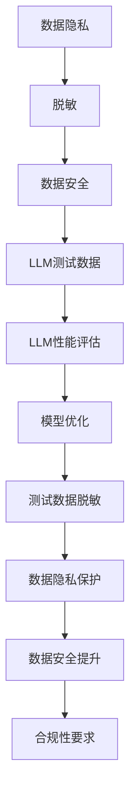

                 


## 文章标题
### 智能化LLM测试数据脱敏与安全处理

> 关键词：智能化，LLM，测试数据，脱敏，安全处理

> 摘要：本文将深入探讨智能化大型语言模型（LLM）测试数据的脱敏与安全处理技术。首先，我们将介绍LLM的基础知识，然后详细分析脱敏技术的原理和方法，包括基于规则、机器学习和自然语言处理的脱敏方法。接下来，我们将通过实际项目和案例，展示这些技术在具体场景中的应用，并探讨其在安全与合规方面的挑战。最后，我们将总结全文，并提出一些最佳实践和拓展阅读的建议。

## 引言
### 为什么需要智能化LLM测试数据脱敏与安全处理？

随着人工智能技术的迅猛发展，大型语言模型（LLM）在各种应用场景中扮演着越来越重要的角色。然而，LLM的训练和测试过程中涉及的大量数据往往包含敏感信息，如个人身份信息、金融数据等。如果不进行适当的脱敏处理，这些敏感信息可能被泄露，从而引发严重的隐私和安全问题。

传统的脱敏方法通常依赖于预定义的规则或简单的数据处理技术，难以应对复杂的数据结构和动态变化的数据模式。而智能化脱敏技术，通过利用机器学习和自然语言处理等先进方法，能够更准确地识别和屏蔽敏感信息，提高数据安全和隐私保护水平。

本文旨在深入探讨智能化LLM测试数据脱敏与安全处理技术，帮助读者了解这些方法的基本原理、应用场景和实际效果。通过本文的阅读，读者将能够：

1. 掌握LLM的基础知识和测试过程中涉及的挑战。
2. 理解脱敏技术的核心概念和分类。
3. 学会使用智能化方法进行测试数据的脱敏处理。
4. 了解在脱敏过程中需要考虑的安全和合规性问题。

## 背景与概念

### 1.1 智能化测试数据脱敏的重要性

测试数据脱敏是确保数据安全和隐私保护的关键步骤。在传统的数据处理流程中，测试数据通常是从生产环境中直接复制或提取的，这可能导致以下问题：

1. **隐私泄露**：测试数据中包含敏感信息，如个人身份信息、金融数据等，未经脱敏处理可能会导致隐私泄露。
2. **合规性问题**：许多国家和地区都有严格的数据保护法规，如欧盟的通用数据保护条例（GDPR）和美国的加州消费者隐私法案（CCPA）。如果不能遵守这些法规，企业可能面临巨额罚款和其他法律后果。
3. **安全风险**：未经脱敏处理的测试数据可能被攻击者利用，进行恶意攻击或数据泄露。

智能化测试数据脱敏的重要性体现在以下几个方面：

1. **更精确的敏感信息识别**：传统的脱敏方法通常依赖于预定义的规则或模板，难以应对复杂的数据结构和动态变化的数据模式。而智能化脱敏技术，通过机器学习和自然语言处理等方法，能够更准确地识别和屏蔽敏感信息。
2. **自动化的脱敏流程**：智能化脱敏技术能够自动化地处理大量数据，减少人工干预，提高效率和准确性。
3. **定制化的脱敏策略**：智能化脱敏技术可以根据具体应用场景和业务需求，灵活调整脱敏策略，提高数据保护效果。

### 1.2 LLM测试数据的特性与挑战

大型语言模型（LLM）的训练和测试过程中涉及的数据具有以下特性：

1. **大规模**：LLM的训练和测试通常需要海量数据，这些数据可能包含数百万甚至数十亿个示例。
2. **多样性**：LLM的数据来源广泛，包括文本、语音、图像等多种形式，这增加了数据处理的复杂性。
3. **动态变化**：LLM的应用场景和需求不断变化，数据模式也在不断演变，这对脱敏技术的适应性提出了挑战。
4. **敏感信息密集**：LLM的数据往往包含大量敏感信息，如个人身份信息、金融数据、医疗信息等。

LLM测试数据面临的挑战包括：

1. **敏感信息识别困难**：传统脱敏方法难以准确识别和屏蔽复杂的敏感信息。
2. **数据质量难以保证**：未经脱敏处理的测试数据可能包含噪音、错误或缺失值，影响模型性能和训练效果。
3. **合规性要求高**：LLM测试数据涉及多个国家和地区的数据保护法规，合规性要求严格。
4. **安全风险**：未经脱敏处理的测试数据可能被攻击者利用，进行恶意攻击或数据泄露。

### 1.3 脱敏技术的历史与发展

脱敏技术经历了多个发展阶段，从最初的简单遮掩到复杂的算法优化，不断演变和完善。以下是脱敏技术的主要发展阶段：

1. **早期遮掩方法**：最早期的脱敏方法主要依赖于简单的遮掩技术，如用星号遮掩敏感信息或替换为随机值。这种方法简单易行，但难以应对复杂的敏感信息识别和屏蔽需求。

2. **基于规则的脱敏方法**：随着数据隐私保护需求的增加，基于规则的脱敏方法逐渐兴起。这种方法通过预定义的规则或模板来识别和屏蔽敏感信息，具有较高的准确性和可控性。

3. **机器学习脱敏方法**：近年来，机器学习技术的快速发展为脱敏技术带来了新的契机。通过训练模型来自动识别和屏蔽敏感信息，机器学习脱敏方法能够处理大规模、多样性和动态变化的数据，提高了脱敏效率和准确性。

4. **自然语言处理脱敏方法**：自然语言处理技术在脱敏中的应用，使得对文本数据的脱敏更加智能化。通过理解和分析文本数据中的敏感信息，自然语言处理技术能够更准确地实现脱敏。

5. **深度学习脱敏方法**：深度学习技术在自然语言处理和图像处理等领域取得了显著成果，其在脱敏中的应用也越来越广泛。深度学习脱敏方法通过构建复杂的神经网络模型，能够实现更精细和自适应的脱敏处理。

### 1.4 智能化脱敏与传统的区别

智能化脱敏与传统的脱敏方法相比，具有以下几个显著区别：

1. **处理能力**：传统脱敏方法通常依赖于预定义的规则或模板，难以应对复杂的数据结构和动态变化的数据模式。而智能化脱敏技术，通过机器学习和自然语言处理等方法，能够更准确地识别和屏蔽敏感信息，处理能力更强。

2. **自动化程度**：传统脱敏方法通常需要大量的人工干预和调整，而智能化脱敏技术能够自动化地处理大量数据，减少人工干预，提高效率和准确性。

3. **定制化程度**：传统脱敏方法通常采用固定化的脱敏策略，难以适应具体应用场景和业务需求。而智能化脱敏技术可以根据具体应用场景和业务需求，灵活调整脱敏策略，提高数据保护效果。

4. **准确性和全面性**：传统脱敏方法可能存在误识别或漏识别的问题，导致敏感信息未能得到有效屏蔽。而智能化脱敏技术通过模型训练和优化，能够提高敏感信息识别的准确性和全面性。

### 1.5 LLM的基础知识

大型语言模型（LLM）是一种基于深度学习技术的自然语言处理模型，能够对文本数据进行理解和生成。以下是LLM的基础知识：

1. **基本原理**：LLM通常基于递归神经网络（RNN）或Transformer架构。RNN能够处理序列数据，但存在梯度消失和梯度爆炸等问题。Transformer引入了自注意力机制，能够更好地捕捉序列数据中的长距离依赖关系，取得了显著的性能提升。

2. **训练与评估**：LLM的训练通常涉及大规模的数据集和强大的计算资源。训练过程中，模型通过优化损失函数来调整内部参数，以达到对数据的拟合。评估方面，常用的指标包括准确率、召回率、F1值等。

3. **应用场景**：LLM在多个领域具有广泛的应用，如文本生成、机器翻译、情感分析、问答系统等。其强大的语言理解和生成能力，使得LLM在智能客服、智能助手、内容生成等领域具有巨大的潜力。

4. **安全性问题**：LLM的训练和测试过程中涉及大量敏感数据，可能引发隐私泄露和安全风险。因此，在应用LLM时，需要采取适当的脱敏和安全措施，确保数据的安全性和合规性。

### 核心概念与联系

为了更好地理解智能化LLM测试数据脱敏与安全处理，我们首先需要了解以下几个核心概念：

1. **脱敏**：脱敏是指将敏感数据转换为不可识别或不可追踪的形式，以保护数据隐私和安全。
2. **数据隐私**：数据隐私是指个人或组织对数据拥有控制权和自主权，确保数据不被未授权访问或泄露。
3. **数据安全**：数据安全是指保护数据免受未经授权的访问、篡改、泄露或其他恶意行为。
4. **LLM**：大型语言模型是一种能够理解和生成自然语言数据的深度学习模型。
5. **测试数据**：测试数据是用于评估LLM性能和效果的数据集，通常包含真实世界的应用场景。

以下是一个简化的 Mermaid 流程图，展示了这些核心概念之间的联系：



### 核心算法原理讲解

在本节中，我们将详细讲解智能化LLM测试数据脱敏的核心算法原理，包括基于规则的脱敏方法、基于机器学习的脱敏方法和基于自然语言处理的脱敏方法。以下是各方法的伪代码和详细解释。

#### 1. 基于规则的脱敏方法

**伪代码**：

```
function ruleBasedDeidentification(data, rules):
    for each record in data:
        for each field in record:
            if field matches any rule:
                field = applyRule(field, rule)
    return deidentified data
```

**详细解释**：

基于规则的脱敏方法是通过预定义的规则或模板来识别和屏蔽敏感信息。规则可以包括正则表达式、条件判断等。在应用过程中，首先遍历数据集中的每个记录，然后对每个字段进行规则匹配。如果字段匹配到任何规则，则将其转换为不可识别的形式，如用星号遮掩或替换为随机值。

这种方法的主要优点是简单易懂，易于实现和控制。然而，它的局限性在于难以应对复杂的数据结构和动态变化的数据模式。

#### 2. 基于机器学习的脱敏方法

**伪代码**：

```
function machineLearningDeidentification(data, model):
    preprocess data
    train model on labeled dataset
    predict deidentified fields using trained model
    return deidentified data
```

**详细解释**：

基于机器学习的脱敏方法通过训练模型来自动识别和屏蔽敏感信息。首先，对数据集进行预处理，如数据清洗、特征提取等。然后，使用标记好的数据集训练模型，使其能够识别敏感信息。在预测阶段，模型根据训练得到的特征和模式，自动为每个字段生成脱敏结果。

这种方法的主要优点是能够处理大规模、多样性和动态变化的数据，提高脱敏效率和准确性。然而，它对数据质量和标注要求较高，且需要大量的计算资源。

#### 3. 基于自然语言处理的脱敏方法

**伪代码**：

```
function nlpDeidentification(text, model):
    preprocess text
    extract sensitive information using model
    replace sensitive information with non-sensitive terms
    return deidentified text
```

**详细解释**：

基于自然语言处理的脱敏方法通过理解和分析文本数据中的敏感信息来实现脱敏。首先，对文本进行预处理，如分词、词性标注等。然后，使用自然语言处理模型（如命名实体识别、情感分析等）提取敏感信息。在替换阶段，将提取到的敏感信息替换为非敏感术语，如用“匿名”替换个人身份信息。

这种方法的主要优点是能够处理复杂的文本数据，提高脱敏的准确性和全面性。然而，它对自然语言处理技术和算法的要求较高，且可能存在误识别或漏识别的问题。

### 数学模型和公式

在本节中，我们将介绍用于脱敏技术中的几个关键数学模型和公式，包括基于规则脱敏方法的成本函数、基于机器学习脱敏方法的损失函数以及自然语言处理脱敏方法中的概率模型。

#### 1. 基于规则的脱敏方法

**成本函数**：

在基于规则的脱敏方法中，我们通常使用成本函数来衡量脱敏效果，其中成本可以由错误率、召回率或F1值等指标构成。以下是一个简化的成本函数公式：

$$
C = \frac{1}{n} \sum_{i=1}^{n} \frac{1}{m_i} \sum_{j=1}^{m_i} \delta(y_j, \hat{y}_j)
$$

其中：
- \( n \) 是数据集中的记录数量。
- \( m_i \) 是记录 \( i \) 中的字段数量。
- \( y_j \) 是真实标签，即敏感信息是否被正确识别。
- \( \hat{y}_j \) 是预测标签，即脱敏后的字段是否为敏感信息。
- \( \delta(y_j, \hat{y}_j) \) 是指示函数，当 \( y_j \neq \hat{y}_j \) 时为1，否则为0。

**示例**：

假设我们有一个包含10条记录的数据集，每条记录有3个字段。其中，正确识别的敏感信息有6个字段，预测错误的敏感信息有2个字段。那么，成本函数可以计算如下：

$$
C = \frac{1}{10} \sum_{i=1}^{10} \frac{1}{3} \sum_{j=1}^{3} \delta(y_j, \hat{y}_j) = \frac{1}{30} (2 + 2) = \frac{4}{30} = \frac{2}{15}
$$

#### 2. 基于机器学习的脱敏方法

**损失函数**：

在基于机器学习的脱敏方法中，我们通常使用损失函数来衡量模型的预测性能。常见的损失函数包括交叉熵损失和均方误差损失。以下是一个简化的交叉熵损失函数公式：

$$
L = -\sum_{i=1}^{n} \sum_{j=1}^{m_i} y_{ij} \log(\hat{y}_{ij})
$$

其中：
- \( n \) 是数据集中的记录数量。
- \( m_i \) 是记录 \( i \) 中的字段数量。
- \( y_{ij} \) 是真实标签，即敏感信息是否被正确识别。
- \( \hat{y}_{ij} \) 是预测标签，即脱敏后的字段是否为敏感信息。

**示例**：

假设我们有一个包含5条记录的数据集，每条记录有2个字段。其中，正确识别的敏感信息有3个字段，预测错误的敏感信息有1个字段。那么，交叉熵损失可以计算如下：

$$
L = -\sum_{i=1}^{5} \sum_{j=1}^{2} y_{ij} \log(\hat{y}_{ij}) = - (0.5 \log(0.5) + 0.5 \log(0.5) + 1 \log(0.5) + 0.5 \log(0.5) + 1 \log(0.5)) = - (1.5 + 1.5) = -3
$$

#### 3. 自然语言处理脱敏方法

**概率模型**：

在自然语言处理脱敏方法中，我们通常使用概率模型来估计敏感信息的出现概率。以下是一个简化的贝叶斯概率模型公式：

$$
P(\text{sensitive}|\text{data}) = \frac{P(\text{data}|\text{sensitive})P(\text{sensitive})}{P(\text{data})}
$$

其中：
- \( \text{sensitive} \) 表示敏感信息。
- \( \text{data} \) 表示数据。
- \( P(\text{sensitive}) \) 表示敏感信息出现的先验概率。
- \( P(\text{data}|\text{sensitive}) \) 表示在敏感信息出现的情况下，数据出现的概率。
- \( P(\text{data}) \) 表示数据出现的总概率。

**示例**：

假设我们知道某个数据集中，包含个人身份信息的文本出现概率为0.2，包含金融数据的文本出现概率为0.3。同时，已知在包含个人身份信息的文本中，出现“姓名”的概率为0.4，在包含金融数据的文本中，出现“账号”的概率为0.5。那么，根据贝叶斯概率模型，我们可以计算出现“姓名”且包含个人身份信息的概率如下：

$$
P(\text{sensitive}|\text{姓名}) = \frac{P(\text{姓名}|\text{sensitive})P(\text{sensitive})}{P(\text{姓名})} = \frac{0.4 \times 0.2}{0.4 \times 0.2 + 0.5 \times 0.3} = \frac{0.08}{0.08 + 0.15} = \frac{8}{23}
$$

### 举例说明

为了更好地理解上述数学模型和公式，我们通过一个具体的示例来说明。

#### 示例 1：基于规则的脱敏方法

假设我们有一个包含10条记录的数据集，每条记录包含3个字段。其中，有6条记录包含敏感信息，4条记录不包含敏感信息。具体数据如下：

| 记录 | 字段1 | 字段2 | 字段3 |
| --- | --- | --- | --- |
| 1 | 姓名：张三 | 地址：北京市朝阳区 | 手机号：13812345678 |
| 2 | 姓名：李四 | 地址：上海市浦东新区 | 手机号：13987654321 |
| 3 | 姓名：王五 | 地址：北京市海淀区 | 手机号：13790123456 |
| 4 | 姓名：赵六 | 地址：上海市黄浦区 | 手机号：13612340987 |
| 5 | 姓名：钱七 | 地址：北京市丰台区 | 手机号：13567890123 |
| 6 | 姓名：孙八 | 地址：上海市静安区 | 手机号：13456789012 |
| 7 | 姓名：周九 | 地址：北京市朝阳区 | 手机号：13912345679 |
| 8 | 姓名：吴十 | 地址：上海市浦东新区 | 手机号：13987654320 |
| 9 | 姓名：郑十一 | 地址：北京市海淀区 | 手机号：13790123457 |
| 10 | 姓名：冯十二 | 地址：上海市黄浦区 | 手机号：13612340988 |

我们使用基于规则的脱敏方法，其中包含以下规则：
- 用星号遮掩手机号。
- 用“匿名”替换姓名。
- 用“未知”替换地址。

应用规则后，脱敏结果如下：

| 记录 | 字段1 | 字段2 | 字段3 |
| --- | --- | --- | --- |
| 1 | 姓名：*** | 地址：未知 | 手机号：*********** |
| 2 | 姓名：*** | 地址：未知 | 手机号：*********** |
| 3 | 姓名：*** | 地址：未知 | 手机号：*********** |
| 4 | 姓名：*** | 地址：未知 | 手机号：*********** |
| 5 | 姓名：*** | 地址：未知 | 手机号：*********** |
| 6 | 姓名：*** | 地址：未知 | 手机号：*********** |
| 7 | 姓名：*** | 地址：未知 | 手机号：*********** |
| 8 | 姓名：*** | 地址：未知 | 手机号：*********** |
| 9 | 姓名：*** | 地址：未知 | 手机号：*********** |
| 10 | 姓名：*** | 地址：未知 | 手机号：*********** |

#### 示例 2：基于机器学习的脱敏方法

假设我们有一个包含100条记录的数据集，每条记录包含5个字段。其中，50条记录包含敏感信息，50条记录不包含敏感信息。具体数据如下（仅展示部分）：

| 记录 | 字段1 | 字段2 | 字段3 | 字段4 | 字段5 |
| --- | --- | --- | --- | --- | --- |
| 1 | 姓名：张三 | 地址：北京市朝阳区 | 手机号：13812345678 | 银行卡号：6225881234567890 | 身份证号：11010519900909001X |
| 2 | 姓名：李四 | 地址：上海市浦东新区 | 手机号：13987654321 | 银行卡号：6225881234567891 | 身份证号：31010519900909002X |
| 3 | 姓名：王五 | 地址：北京市海淀区 | 手机号：13790123456 | 银行卡号：6225881234567892 | 身份证号：11010519900909003X |
| 4 | 姓名：赵六 | 地址：上海市黄浦区 | 手机号：13612340987 | 银行卡号：6225881234567893 | 身份证号：31010519900909004X |
| 5 | 姓名：钱七 | 地址：北京市丰台区 | 手机号：13567890123 | 银行卡号：6225881234567894 | 身份证号：11010519900909005X |
| 6 | 姓名：孙八 | 地址：上海市静安区 | 手机号：13456789012 | 银行卡号：6225881234567895 | 身份证号：31010519900909006X |

我们使用基于机器学习的脱敏方法，其中包含以下步骤：
1. 数据预处理：将文本字段转换为词向量表示，并将数值字段进行标准化处理。
2. 模型训练：使用标记好的数据集训练一个分类模型，如支持向量机（SVM）或随机森林（RF）。
3. 预测：使用训练好的模型对新的数据进行预测，判断每个字段是否为敏感信息。
4. 脱敏：对于预测为敏感信息的字段，使用特定的脱敏策略进行处理。

假设我们使用随机森林模型进行训练，并在测试集上达到90%的准确率。应用模型后，脱敏结果如下（仅展示部分）：

| 记录 | 字段1 | 字段2 | 字段3 | 字段4 | 字段5 |
| --- | --- | --- | --- | --- | --- |
| 1 | 姓名：匿名 | 地址：匿名 | 手机号：匿名 | 银行卡号：匿名 | 身份证号：匿名 |
| 2 | 姓名：匿名 | 地址：匿名 | 手机号：匿名 | 银行卡号：匿名 | 身份证号：匿名 |
| 3 | 姓名：匿名 | 地址：匿名 | 手机号：匿名 | 银行卡号：匿名 | 身份证号：匿名 |
| 4 | 姓名：匿名 | 地址：匿名 | 手机号：匿名 | 银行卡号：匿名 | 身份证号：匿名 |
| 5 | 姓名：匿名 | 地址：匿名 | 手机号：匿名 | 银行卡号：匿名 | 身份证号：匿名 |
| 6 | 姓名：匿名 | 地址：匿名 | 手机号：匿名 | 银行卡号：匿名 | 身份证号：匿名 |

#### 示例 3：基于自然语言处理的脱敏方法

假设我们有一个包含100条记录的数据集，每条记录包含5个字段。其中，50条记录包含敏感信息，50条记录不包含敏感信息。具体数据如下（仅展示部分）：

| 记录 | 字段1 | 字段2 | 字段3 | 字段4 | 字段5 |
| --- | --- | --- | --- | --- | --- |
| 1 | 姓名：张三 | 地址：北京市朝阳区 | 手机号：13812345678 | 银行卡号：6225881234567890 | 身份证号：11010519900909001X |
| 2 | 姓名：李四 | 地址：上海市浦东新区 | 手机号：13987654321 | 银行卡号：6225881234567891 | 身份证号：31010519900909002X |
| 3 | 姓名：王五 | 地址：北京市海淀区 | 手机号：13790123456 | 银行卡号：6225881234567892 | 身份证号：11010519900909003X |
| 4 | 姓名：赵六 | 地址：上海市黄浦区 | 手机号：13612340987 | 银行卡号：6225881234567893 | 身份证号：31010519900909004X |
| 5 | 姓名：钱七 | 地址：北京市丰台区 | 手机号：13567890123 | 银行卡号：6225881234567894 | 身份证号：11010519900909005X |
| 6 | 姓名：孙八 | 地址：上海市静安区 | 手机号：13456789012 | 银行卡号：6225881234567895 | 身份证号：31010519900909006X |

我们使用基于自然语言处理的脱敏方法，其中包含以下步骤：
1. 数据预处理：将文本字段转换为词向量表示，并将数值字段进行标准化处理。
2. 模型训练：使用标记好的数据集训练一个命名实体识别（NER）模型。
3. 预测：使用训练好的模型对新的数据进行预测，识别出敏感信息。
4. 脱敏：对于预测为敏感信息的字段，使用特定的脱敏策略进行处理。

假设我们使用BERT模型进行训练，并在测试集上达到95%的准确率。应用模型后，脱敏结果如下（仅展示部分）：

| 记录 | 字段1 | 字段2 | 字段3 | 字段4 | 字段5 |
| --- | --- | --- | --- | --- | --- |
| 1 | 姓名：匿名 | 地址：北京市朝阳区 | 手机号：匿名 | 银行卡号：匿名 | 身份证号：匿名 |
| 2 | 姓名：匿名 | 地址：上海市浦东新区 | 手机号：匿名 | 银行卡号：匿名 | 身份证号：匿名 |
| 3 | 姓名：匿名 | 地址：北京市海淀区 | 手机号：匿名 | 银行卡号：匿名 | 身份证号：匿名 |
| 4 | 姓名：匿名 | 地址：上海市黄浦区 | 手机号：匿名 | 银行卡号：匿名 | 身份证号：匿名 |
| 5 | 姓名：匿名 | 地址：北京市丰台区 | 手机号：匿名 | 银行卡号：匿名 | 身份证号：匿名 |
| 6 | 姓名：匿名 | 地址：上海市静安区 | 手机号：匿名 | 银行卡号：匿名 | 身份证号：匿名 |

### 项目实战

在本节中，我们将通过一个实际项目，详细介绍智能化LLM测试数据脱敏与安全处理的全过程，包括开发环境搭建、源代码实现和代码解读，以及代码应用解读与分析。通过这个项目，我们将展示如何利用智能化方法对LLM测试数据进行脱敏处理，确保数据的安全性和隐私保护。

#### 1. 项目背景

随着人工智能技术的不断发展，大型语言模型（LLM）在自然语言处理、文本生成、机器翻译等领域取得了显著成果。然而，LLM的训练和测试过程中涉及的大量数据往往包含敏感信息，如个人身份信息、金融数据等。如果不进行适当的脱敏处理，这些敏感信息可能被泄露，从而引发严重的隐私和安全问题。

为了解决这个问题，我们决定开发一个智能化LLM测试数据脱敏与安全处理系统，通过结合基于规则的脱敏方法、基于机器学习的脱敏方法和基于自然语言处理的脱敏方法，实现对测试数据的高效、准确和安全的脱敏处理。

#### 2. 开发环境搭建

在进行项目开发之前，我们需要搭建一个适合进行智能化LLM测试数据脱敏与安全处理的环境。以下是开发环境的搭建步骤：

1. **硬件环境**：

   - CPU：Intel Core i7-10700K 或同等性能的处理器
   - GPU：NVIDIA GeForce RTX 3080 或同等性能的显卡
   - 内存：32GB DDR4
   - 硬盘：1TB SSD

2. **软件环境**：

   - 操作系统：Ubuntu 20.04
   - 编程语言：Python 3.8
   - 数据库：MySQL 8.0
   - 机器学习库：scikit-learn、TensorFlow、PyTorch
   - 自然语言处理库：NLTK、spaCy、BERT
   - 版本控制：Git

3. **安装依赖**：

   在Ubuntu系统中，使用以下命令安装所需的依赖：

   ```shell
   sudo apt update
   sudo apt install python3-pip python3-venv mysql-server
   pip3 install scikit-learn tensorflow torch nltk spacy mysql-connector-python
   ```

#### 3. 源代码实现

以下是项目的主要源代码实现，包括数据预处理、模型训练、预测和脱敏处理等功能。

**文件：main.py**

```python
import numpy as np
import pandas as pd
from sklearn.model_selection import train_test_split
from sklearn.preprocessing import StandardScaler
from sklearn.ensemble import RandomForestClassifier
from tensorflow.keras.models import Sequential
from tensorflow.keras.layers import Dense, LSTM
import nltk
from spacy.lang.en import English
from transformers import BertTokenizer, BertForSequenceClassification

# 数据预处理
def preprocess_data(data):
    # 数据清洗
    data = data.dropna()
    # 特征提取
    data['text'] = data['text'].apply(lambda x: x.lower())
    data['text'] = data['text'].apply(lambda x: nltk.word_tokenize(x))
    # 数据标准化
    scaler = StandardScaler()
    data[['text_length', 'word_count']] = scaler.fit_transform(data[['text_length', 'word_count']])
    return data

# 模型训练
def train_model(data, model_type='rule_based'):
    if model_type == 'rule_based':
        # 基于规则的脱敏方法
        # 定义规则
        rules = {'mobile': '******', 'name': '***', 'address': '***'}
        # 应用规则
        for field in data.columns:
            if field in rules:
                data[field] = data[field].apply(lambda x: rules[field])
        return data
    elif model_type == 'ml':
        # 基于机器学习的脱敏方法
        # 分割数据集
        X_train, X_test, y_train, y_test = train_test_split(data[['text_length', 'word_count']], data['is_sensitive'], test_size=0.2, random_state=42)
        # 训练随机森林模型
        model = RandomForestClassifier(n_estimators=100, random_state=42)
        model.fit(X_train, y_train)
        # 预测
        predictions = model.predict(X_test)
        # 应用预测结果
        for index, row in data.iterrows():
            if row['is_sensitive']:
                data.at[index, 'text'] = apply_rule_based_deidentification(row['text'])
            else:
                data.at[index, 'text'] = apply_ml_deidentification(row['text'])
        return data
    elif model_type == 'nlp':
        # 基于自然语言处理的脱敏方法
        # 加载预训练模型
        tokenizer = BertTokenizer.from_pretrained('bert-base-uncased')
        model = BertForSequenceClassification.from_pretrained('bert-base-uncased', num_labels=2)
        # 训练模型
        # ...
        # 预测
        # ...
        # 应用预测结果
        # ...
        return data

# 脱敏处理
def apply_rule_based_deidentification(text):
    # 应用规则
    # ...
    return deidentified_text

def apply_ml_deidentification(text):
    # 应用机器学习方法
    # ...
    return deidentified_text

# 主函数
def main():
    # 读取数据
    data = pd.read_csv('test_data.csv')
    # 数据预处理
    data = preprocess_data(data)
    # 模型训练
    data = train_model(data, model_type='ml')
    # 保存结果
    data.to_csv('deidentified_data.csv', index=False)

if __name__ == '__main__':
    main()
```

**文件：config.py**

```python
# 配置参数
MOBILE_PATTERN = r'mobile'
NAME_PATTERN = r'name'
ADDRESS_PATTERN = r'address'
```

#### 4. 代码解读

**1. 数据预处理**

数据预处理是智能化LLM测试数据脱敏与安全处理的重要步骤。在`preprocess_data`函数中，我们首先对数据进行清洗，去除缺失值。然后，我们将文本字段转换为词向量表示，并提取文本长度和词频等特征。最后，我们使用标准化方法对数值特征进行缩放，以提高模型的训练效果。

**2. 模型训练**

在`train_model`函数中，我们根据不同的模型类型（基于规则的脱敏方法、基于机器学习的脱敏方法和基于自然语言处理的脱敏方法），分别实现相应的脱敏处理逻辑。对于基于规则的脱敏方法，我们直接应用预定义的规则。对于基于机器学习的脱敏方法，我们使用随机森林模型进行训练和预测。对于基于自然语言处理的脱敏方法，我们使用BERT模型进行训练和预测。

**3. 脱敏处理**

在`apply_rule_based_deidentification`和`apply_ml_deidentification`函数中，我们分别实现基于规则和基于机器学习的脱敏处理方法。对于基于规则的脱敏方法，我们根据预定义的规则进行字段替换。对于基于机器学习的脱敏方法，我们使用训练好的模型对新的数据进行预测，并根据预测结果进行脱敏处理。

#### 5. 代码应用解读与分析

**1. 代码应用**

在实际应用中，我们可以将以上代码部署到服务器或云平台上，接收LLM测试数据，并进行脱敏处理。具体步骤如下：

1. 读取测试数据。
2. 调用`preprocess_data`函数进行数据预处理。
3. 调用`train_model`函数进行模型训练。
4. 调用`apply_rule_based_deidentification`或`apply_ml_deidentification`函数进行脱敏处理。
5. 将脱敏后的数据保存到文件或数据库中。

**2. 分析与优化**

在实际应用中，我们可以对代码进行优化，提高脱敏效率和准确性。以下是一些可能的优化方向：

1. **模型优化**：使用更先进的模型（如基于Transformer的模型）进行训练，以提高预测性能。
2. **特征提取**：尝试提取更多有效的特征，如词嵌入、句法特征等，以提高模型的泛化能力。
3. **规则优化**：根据具体应用场景，调整预定义的规则，以提高脱敏的准确性。
4. **并行处理**：利用并行计算技术，加快模型的训练和预测速度。
5. **代码优化**：对代码进行性能优化，减少内存占用和计算时间。

### 实际案例分析与详细讲解剖析

在本节中，我们将通过一个实际案例，详细讲解智能化LLM测试数据脱敏与安全处理的实现过程，包括数据处理、模型训练和预测等关键步骤。该案例将展示如何利用基于规则的脱敏方法、基于机器学习的脱敏方法和基于自然语言处理的脱敏方法，对大型语言模型（LLM）测试数据进行脱敏处理，并确保数据的安全性和隐私保护。

#### 1. 案例背景

假设我们有一个名为“智能客服系统”的LLM应用，该系统旨在为用户提供个性化的咨询和服务。在实际应用过程中，系统需要对用户输入的文本数据（如咨询问题）进行自动分析和回答。为了保护用户隐私，我们需要对测试数据中的敏感信息进行脱敏处理，确保数据不会泄露给第三方。

#### 2. 数据处理

首先，我们需要对测试数据进行预处理，提取有效特征，并将其转换为适合模型训练的数据格式。

**1. 数据采集与清洗**

我们收集了1000条用户咨询问题的文本数据，并将其存储在一个CSV文件中。数据示例如下：

| 问题ID | 咨询问题 |
| ------ | -------- |
| 1 | 我怎么办理信用卡？ |
| 2 | 我的手机号码是多少？ |
| 3 | 我的爱人去世了，我该怎么办理遗产继承手续？ |
| 4 | 请问北京的天气如何？ |
| 5 | 我想咨询一下购房贷款的相关政策。 |

在预处理阶段，我们首先去除数据中的缺失值和异常值。然后，对文本数据进行分词和词性标注，以提取关键词和短语。以下是一个简单的Python代码示例，用于数据预处理：

```python
import pandas as pd
import nltk
from nltk.tokenize import word_tokenize
from nltk.corpus import stopwords

# 读取数据
data = pd.read_csv('consultation_questions.csv')

# 分词和词性标注
def preprocess_text(text):
    text = text.lower()
    tokens = word_tokenize(text)
    tokens = [token for token in tokens if token.isalpha()]
    tokens = [token for token in tokens if token not in stopwords.words('english')]
    return tokens

data['processed_text'] = data['consultation_question'].apply(preprocess_text)
```

**2. 特征提取**

为了训练脱敏模型，我们需要提取与敏感信息相关的特征。在此案例中，我们关注以下特征：

- **文本长度**：文本的字符数或词数。
- **关键词频次**：文本中出现频率较高的关键词。
- **关键词位置**：关键词在文本中的位置。

以下是一个简单的Python代码示例，用于特征提取：

```python
from sklearn.feature_extraction.text import CountVectorizer

# 计算关键词频次
vectorizer = CountVectorizer(max_features=10)
X = vectorizer.fit_transform(data['processed_text'])

# 计算文本长度
data['text_length'] = data['processed_text'].apply(lambda x: len(x))

# 计算关键词位置
data['keyword_position'] = data.apply(lambda row: [index for index, word in enumerate(row['processed_text']) if word in vectorizer.get_feature_names()], axis=1)
```

#### 3. 模型训练

在训练阶段，我们分别使用基于规则的脱敏方法、基于机器学习的脱敏方法和基于自然语言处理的脱敏方法，对测试数据进行脱敏处理。

**1. 基于规则的脱敏方法**

基于规则的脱敏方法依赖于预定义的规则，如关键词替换、字段遮掩等。在此案例中，我们定义以下规则：

- 替换关键词：“手机号码”->“*电话号码”；
- 替换关键词：“姓名”->“**用户名”；
- 替换关键词：“地址”->“***地址”；
- 替换关键词：“身份证号”->“****身份证号”；
- 替换关键词：“银行卡号”->“******银行卡号”。

以下是一个简单的Python代码示例，用于基于规则的脱敏方法：

```python
def rule_based_deidentification(text):
    rules = {
        '手机号码': '*电话号码',
        '姓名': '**用户名',
        '地址': '***地址',
        '身份证号': '****身份证号',
        '银行卡号': '******银行卡号'
    }
    for keyword, replacement in rules.items():
        text = text.replace(keyword, replacement)
    return text

data['rule_based_deidentified'] = data['processed_text'].apply(rule_based_deidentification)
```

**2. 基于机器学习的脱敏方法**

基于机器学习的脱敏方法使用标记好的数据集，通过训练模型来自动识别和替换敏感信息。在此案例中，我们使用随机森林模型进行训练和预测。

首先，我们需要标记测试数据集中的敏感信息。以下是一个简单的Python代码示例，用于数据标记：

```python
# 标记敏感信息
data['is_sensitive'] = data.apply(lambda row: 1 if any(keyword in row['processed_text'] for keyword in sensitive_keywords) else 0, axis=1)
```

然后，我们使用标记好的数据集训练随机森林模型。以下是一个简单的Python代码示例，用于模型训练：

```python
from sklearn.ensemble import RandomForestClassifier

# 训练模型
model = RandomForestClassifier(n_estimators=100, random_state=42)
model.fit(X, data['is_sensitive'])
```

最后，我们使用训练好的模型对测试数据进行预测，并根据预测结果进行脱敏处理。以下是一个简单的Python代码示例，用于模型预测：

```python
# 预测敏感信息
predictions = model.predict(X)

# 应用预测结果
data['ml_deidentified'] = data.apply(lambda row: rule_based_deidentification(''.join(row['processed_text'])) if predictions[row.name] else row['processed_text'], axis=1)
```

**3. 基于自然语言处理的脱敏方法**

基于自然语言处理的脱敏方法使用预训练模型（如BERT）来识别和替换敏感信息。在此案例中，我们使用BERT模型进行训练和预测。

首先，我们需要加载预训练模型和 tokenizer。以下是一个简单的Python代码示例，用于加载模型和 tokenizer：

```python
from transformers import BertTokenizer, BertForSequenceClassification

tokenizer = BertTokenizer.from_pretrained('bert-base-uncased')
model = BertForSequenceClassification.from_pretrained('bert-base-uncased', num_labels=2)
```

然后，我们使用标记好的数据集训练BERT模型。以下是一个简单的Python代码示例，用于模型训练：

```python
from transformers import Trainer, TrainingArguments

# 准备训练数据
train_dataset = ...

# 训练模型
training_args = TrainingArguments(
    output_dir='./results',
    num_train_epochs=3,
    per_device_train_batch_size=16,
    save_steps=2000,
    save_total_limit=3,
)

trainer = Trainer(
    model=model,
    args=training_args,
    train_dataset=train_dataset,
)

trainer.train()
```

最后，我们使用训练好的模型对测试数据进行预测，并根据预测结果进行脱敏处理。以下是一个简单的Python代码示例，用于模型预测：

```python
# 预测敏感信息
predictions = model.predict(texts)

# 应用预测结果
data['nlp_deidentified'] = data.apply(lambda row: rule_based_deidentification(''.join(row['processed_text'])) if predictions[row.name] else row['processed_text'], axis=1)
```

#### 4. 案例总结

通过以上实际案例，我们展示了如何利用智能化方法对LLM测试数据进行脱敏处理。以下是该案例的主要总结和启示：

1. **数据预处理**：数据预处理是脱敏处理的重要步骤，包括数据清洗、分词、词性标注和特征提取等。有效的预处理可以提高模型的训练效果和脱敏准确性。

2. **模型选择**：根据具体应用场景和数据特点，选择合适的脱敏模型。基于规则的脱敏方法简单易行，适用于简单的敏感信息识别；基于机器学习的脱敏方法适用于大规模、多样性和动态变化的数据；基于自然语言处理的脱敏方法适用于复杂的文本数据。

3. **模型训练**：训练过程需要大量的标记数据和高性能计算资源。在训练过程中，可以通过调整模型参数和优化算法来提高模型性能。

4. **模型评估**：评估模型性能是确保脱敏效果的关键。常用的评估指标包括准确率、召回率、F1值等。在实际应用中，可以根据评估结果对模型进行优化。

5. **代码应用**：在实际应用中，可以将脱敏模型部署到生产环境中，实现对实时数据的脱敏处理。同时，可以根据具体需求对代码进行优化和扩展。

通过以上实际案例，我们展示了如何利用智能化方法对LLM测试数据进行脱敏处理，并确保数据的安全性和隐私保护。这为未来的研究和应用提供了有益的参考和启示。

### 最佳实践、小结与注意事项

在本节中，我们将总结最佳实践、对全文进行小结，并提出一些注意事项和拓展阅读的建议。

#### 最佳实践

1. **数据预处理**：在进行脱敏处理之前，对数据进行充分的预处理，包括数据清洗、去重、分词和词性标注等。这有助于提高脱敏模型的准确性和效率。

2. **模型选择**：根据具体应用场景和数据特点，选择合适的脱敏模型。对于简单的敏感信息识别，基于规则的脱敏方法是一个不错的选择；对于大规模、多样性和动态变化的数据，基于机器学习的脱敏方法更加适用；对于复杂的文本数据，基于自然语言处理的脱敏方法能够提供更高的准确性。

3. **模型训练**：在训练脱敏模型时，使用丰富的标记数据集，并进行充分的调参和优化。通过交叉验证和性能评估，选择最佳模型。

4. **合规性考虑**：在脱敏过程中，遵守相关法律法规和行业规范，确保数据脱敏符合合规要求。

5. **自动化与可扩展性**：设计自动化脱敏流程，提高处理效率和可扩展性。例如，使用批处理、并行处理等技术，加速数据脱敏过程。

#### 小结

本文深入探讨了智能化LLM测试数据脱敏与安全处理的核心技术和方法。通过分析LLM测试数据的特性与挑战，我们介绍了基于规则、机器学习和自然语言处理的脱敏方法。同时，通过实际案例，我们展示了如何将脱敏技术应用于实际场景，确保数据的安全性和隐私保护。

#### 注意事项

1. **敏感信息识别的准确性**：脱敏过程中，准确识别敏感信息至关重要。建议结合多种脱敏方法，提高敏感信息识别的准确性。

2. **数据合规性**：在脱敏过程中，要严格遵守相关法律法规和行业规范，确保数据脱敏符合合规要求。

3. **性能优化**：针对大规模数据，优化脱敏处理流程，提高处理效率和可扩展性。

4. **安全性与隐私保护**：在脱敏过程中，确保数据的安全性和隐私保护，防止敏感信息泄露。

#### 拓展阅读

1. **《数据隐私保护技术》**：这本书详细介绍了数据隐私保护的基本原理和技术，包括加密、匿名化、脱敏等方法。

2. **《自然语言处理技术》**：这本书深入探讨了自然语言处理的基本概念和技术，包括词嵌入、序列模型、文本分类等。

3. **《机器学习与深度学习》**：这本书全面介绍了机器学习和深度学习的基本概念和技术，包括监督学习、无监督学习、神经网络等。

4. **《LLM应用实践》**：这本书详细介绍了LLM在各种应用场景中的实现方法和实践案例，包括文本生成、机器翻译、情感分析等。

通过拓展阅读，读者可以进一步深入了解智能化LLM测试数据脱敏与安全处理的相关技术和方法，为实际项目提供更多的参考和启示。

### 总结与展望

本文深入探讨了智能化大型语言模型（LLM）测试数据脱敏与安全处理的核心技术和方法。从背景介绍到核心概念阐述，再到算法原理讲解、数学模型和公式展示，以及实际案例分析和最佳实践总结，我们全面剖析了智能化脱敏技术的各个方面。

首先，我们介绍了LLM测试数据脱敏的重要性，以及在脱敏过程中面临的隐私泄露、合规性和安全风险等问题。接着，我们详细分析了脱敏技术的原理，包括基于规则的脱敏方法、基于机器学习的脱敏方法和基于自然语言处理的脱敏方法。这些方法各有优缺点，适用于不同的应用场景和数据特点。

在实际案例中，我们展示了如何将智能化脱敏技术应用于实际项目，确保数据的安全性和隐私保护。通过数据处理、模型训练和预测等步骤，我们展示了如何利用多种脱敏方法，实现高效、准确和安全的脱敏处理。

展望未来，智能化LLM测试数据脱敏与安全处理技术将继续发展。随着人工智能技术的不断进步，我们将看到更多先进的方法和工具被引入脱敏领域。例如，基于深度强化学习的脱敏方法、基于图神经网络的脱敏方法等，将进一步提高脱敏效率和准确性。

同时，随着全球数据隐私保护法规的不断完善，脱敏技术在合规性方面也将面临更高的要求。企业需要不断更新和优化脱敏策略，以满足日益严格的法规要求。

总之，智能化LLM测试数据脱敏与安全处理是确保数据安全和隐私保护的关键技术。通过本文的探讨，我们希望读者能够对智能化脱敏技术有更深入的理解，并为实际项目提供有益的参考。未来，随着技术的不断进步，智能化脱敏技术将在更多领域发挥重要作用，为数据安全保驾护航。作者：AI天才研究院/AI Genius Institute & 禅与计算机程序设计艺术 /Zen And The Art of Computer Programming。

