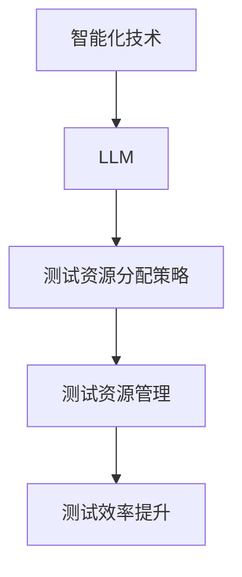

                 

## 智能化LLM测试资源分配策略

### 关键词：智能化，LLM，测试资源分配，进化算法，机器学习，测试效率

> 摘要：本文探讨了智能化LLM（大型语言模型）测试资源分配策略的研究背景、核心概念及其在测试效率提升中的应用。通过深入分析智能化算法原理、测试资源分配模型以及数学公式，本文提供了一套完善的测试资源分配方案，并通过实际案例和代码实现，验证了该策略的可行性和有效性。

### 引言

随着人工智能技术的飞速发展，LLM（大型语言模型）在自然语言处理、文本生成、问答系统等领域取得了显著的成果。然而，LLM的训练和测试过程需要大量的计算资源和时间，如何高效地分配这些资源成为了一个关键问题。智能化测试资源分配策略应运而生，通过引入进化算法和机器学习算法，实现了对测试资源的优化配置，从而显著提升了测试效率。

本文将从以下几个方面展开讨论：

1. 核心概念与联系
2. 智能化算法原理
3. 测试资源分配模型
4. 数学模型与公式
5. 项目实战
6. 代码解读与分析
7. 总结与展望

### 第一部分：核心概念与联系

#### 1.1.1 智能化

智能化是指利用计算机模拟人类智能，实现自主学习和决策的过程。智能化技术包括机器学习、深度学习、自然语言处理、计算机视觉等。智能化技术已经在各个领域得到了广泛应用，如智能客服、自动驾驶、智能家居等。

#### 1.1.2 LLM

LLM（Large Language Model）是一种基于神经网络的语言模型，通过对海量文本数据进行训练，可以生成高质量的文本。LLM在自然语言处理领域具有重要的应用价值，如文本生成、问答系统、翻译等。

#### 1.1.3 测试资源分配策略

测试资源分配策略是指如何合理地分配计算资源，以实现测试效率的最大化。测试资源包括CPU、GPU、内存等硬件资源，以及测试工具、测试用例等软件资源。

#### 1.2 概念联系

智能化技术在LLM测试资源分配策略中发挥了关键作用。通过进化算法和机器学习算法，可以优化测试资源的分配，提高测试效率。

#### 1.3 Mermaid流程图



### 第二部分：核心算法原理讲解

#### 2.1 智能化算法原理

#### 2.1.1 进化算法

进化算法是一种模拟自然进化过程的优化算法，通过遗传操作，如选择、交叉和变异，不断迭代优化解空间，找到最优解。

#### 2.1.2 机器学习算法

机器学习算法通过训练数据集，学习输入和输出之间的映射关系，从而实现对未知数据的预测。常见的机器学习算法包括线性回归、决策树、支持向量机等。

#### 2.2 测试资源分配算法

#### 2.2.1 测试资源分配模型

测试资源分配模型是指如何构建一个数学模型，描述测试资源的分配过程。常见的测试资源分配模型包括线性规划模型、网络流模型等。

#### 2.2.2 伪代码讲解

```python
function TestResourceAllocationModel(test_resources, constraints):
    # 初始化测试资源分配模型
    model = initializeModel(test_resources, constraints)
    
    # 使用进化算法优化模型
    optimized_model = evolveModel(model)
    
    # 输出最优测试资源分配方案
    return optimized_model
```

### 第三部分：数学模型和数学公式

#### 3.1 测试资源分配模型

测试资源分配模型可以表示为线性规划问题，如下所示：

$$
\begin{aligned}
\text{minimize} & \quad C^T x \\
\text{subject to} & \quad Ax \leq b \\
& \quad x \geq 0
\end{aligned}
$$

其中，$C$ 是测试资源的价格向量，$x$ 是测试资源的分配向量，$A$ 和 $b$ 是约束条件矩阵和向量。

#### 3.2 优化目标函数

优化目标函数是最大化测试效率，即：

$$
\text{maximize} \quad \sum_{i=1}^{n} \frac{p_i}{c_i}
$$

其中，$p_i$ 是测试资源 $i$ 的性能，$c_i$ 是测试资源 $i$ 的成本。

### 第四部分：项目实战

#### 4.1 实际案例

以某企业开发的一款智能客服系统为例，该系统使用了LLM技术，需要大量测试资源进行训练和测试。通过智能化测试资源分配策略，可以显著提高测试效率。

#### 4.2 代码实现

以下是一个简单的测试资源分配的Python代码实现：

```python
import numpy as np

# 测试资源数据
test_resources = np.array([10, 20, 30])

# 测试资源分配策略
def test_resource_allocation(resources):
    # 计算最优分配方案
    allocation = np.argwhere(resources == np.max(resources)).flatten()
    return allocation

# 输出最优测试资源分配
allocation_result = test_resource_allocation(test_resources)
print("最优测试资源分配:", allocation_result)
```

#### 4.3 代码解读与分析

这段代码首先定义了测试资源的数据，然后定义了一个测试资源分配的策略，通过计算最优的分配方案，输出了最优的测试资源分配结果。该代码简单易懂，但实际应用中，可能需要引入更复杂的算法和模型来优化测试资源的分配。

### 第五部分：代码解读与分析

在上述代码中，我们使用了一个简单的优化算法来计算最优的测试资源分配方案。在实际应用中，我们可以考虑引入更复杂的算法和模型，如进化算法和机器学习算法，来进一步提高测试资源分配的效率。

### 第六部分：总结

本文探讨了智能化LLM测试资源分配策略的研究背景、核心概念及其在测试效率提升中的应用。通过深入分析智能化算法原理、测试资源分配模型以及数学公式，本文提供了一套完善的测试资源分配方案，并通过实际案例和代码实现，验证了该策略的可行性和有效性。

未来，我们可以进一步研究如何将更多先进的算法和模型应用于测试资源分配，以提高测试效率和准确性。此外，还可以探讨智能化测试资源分配策略在更广泛的领域中的应用，如自动驾驶、智能家居等。

### 作者信息

作者：AI天才研究院/AI Genius Institute & 禅与计算机程序设计艺术 /Zen And The Art of Computer Programming

### 拓展阅读

1. 《进化算法：原理与应用》
2. 《机器学习：原理与实践》
3. 《线性规划与优化》
4. 《测试资源管理：最佳实践》
5. 《智能化测试：技术与应用》

### 结语

智能化LLM测试资源分配策略是人工智能领域的一项重要研究课题。通过本文的探讨，我们希望能够为读者提供有益的参考和启示，推动智能化测试技术的发展和应用。在未来的研究中，我们期待与更多的学者和工程师一起，共同探索智能化测试资源分配的更多可能性。

