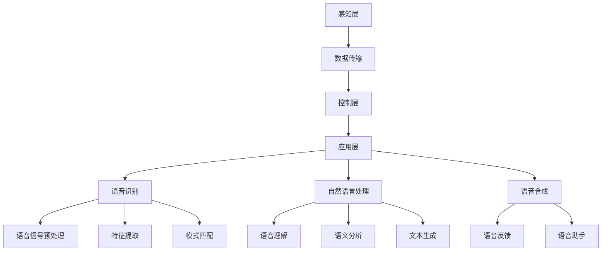

                 


### 文章标题
《智能家居语音控制系统评测框架》

### 关键词
智能家居、语音控制系统、评测框架、算法原理、数学模型

### 摘要
本文旨在构建一个全面的智能家居语音控制系统评测框架，从市场背景、核心概念、算法原理到实际应用，提供一套系统化的评估标准和方法。通过详细解析语音识别和自然语言处理算法，并结合数学模型，帮助读者深入理解智能家居语音控制系统的原理和实现。同时，通过项目实战案例，展示评测框架在具体应用中的效果，为智能家居行业提供实用的参考。

## 引言：智能家居语音控制系统概述

### 1.1 智能家居市场背景

随着科技的快速发展，智能家居市场正在经历一场前所未有的变革。根据市场研究公司的数据，全球智能家居市场规模预计将在未来几年内持续增长，年复合增长率（CAGR）达到20%以上。这一趋势主要受到消费者对便捷、高效和智能化生活方式的追求，以及物联网（IoT）技术的普及推动。

#### 市场驱动因素

- **消费者需求**：现代消费者越来越重视家庭自动化和智能化，希望能够通过语音控制、手机APP等方式轻松管理家庭设备，提高生活质量。
- **技术进步**：物联网、人工智能、语音识别等技术的发展为智能家居提供了强大的技术支持，使得智能家居产品更加智能、易用。
- **政策支持**：政府出台了一系列鼓励智能家居发展的政策，为市场提供了良好的发展环境。

#### 智能家居产品分类

智能家居产品种类繁多，主要包括：

- **智能照明**：如智能灯泡、智能开关等，可以通过手机APP或语音控制进行远程操作。
- **智能安防**：如智能门锁、监控摄像头等，提供家庭安全保护。
- **智能家电**：如智能空调、智能冰箱、智能洗衣机等，实现家电的互联互通，提高家电使用效率。
- **智能环境**：如智能空气净化器、智能加湿器等，改善家庭环境质量。

### 1.2 语音控制技术的发展

语音控制作为智能家居的重要组成部分，其发展历程可以追溯到20世纪90年代。随着语音识别技术的进步，语音控制系统逐渐从实验室走向实际应用。

#### 语音识别技术的发展

- **早期的语音识别**：早期语音识别主要依赖于规则匹配和模板匹配，准确率较低，适用场景有限。
- **基于统计模型的方法**：随着人工智能技术的发展，基于统计模型的方法逐渐成为主流，如隐马尔可夫模型（HMM）和高斯混合模型（GMM）。
- **基于深度学习的方法**：近年来，深度学习技术在语音识别领域取得了重大突破，如卷积神经网络（CNN）和递归神经网络（RNN），大幅提高了识别准确率和处理速度。

#### 语音控制的应用场景

- **家庭场景**：家庭场景是语音控制最典型的应用场景，用户可以通过语音控制智能设备，如打开灯、调节温度等。
- **车载场景**：在车载系统中，语音控制可以用于导航、播放音乐、接听电话等，提高驾驶安全。
- **服务行业**：如酒店、餐厅等服务业，语音控制可以提高服务效率，提供更加便捷的客户体验。

### 1.3 评测框架的重要性

智能家居语音控制系统的评测框架对于产品的开发和市场推广具有重要意义。

#### 评测框架的作用

- **产品质量评估**：通过评测框架，可以全面评估产品的语音识别准确率、响应速度、用户交互体验等关键指标，确保产品质量。
- **性能优化**：评测框架提供了量化指标，帮助开发团队识别系统的瓶颈，进行性能优化。
- **用户体验优化**：通过评测用户的使用反馈，可以不断优化系统的交互设计，提升用户体验。

#### 评测框架的设计原则

- **全面性**：评测框架应涵盖语音识别、自然语言处理、用户交互等多个方面，确保评估的全面性。
- **可扩展性**：评测框架应具备良好的扩展性，能够适应新技术和新应用场景的需求。
- **客观性**：评测过程应尽量客观，避免主观因素的影响，确保评估结果的可靠性。

## 核心概念与联系

### 2.1 智能家居的基本概念

智能家居（Smart Home）是指利用物联网、云计算、人工智能等技术，实现家庭设备的自动化、智能化控制，为用户提供便捷、舒适、安全的居住环境。

#### 智能家居的关键技术

- **物联网技术**：通过传感器、网络等技术，实现家庭设备之间的互联互通。
- **云计算技术**：通过云计算平台，提供存储、计算、分析等能力，支持智能家居系统的运行。
- **人工智能技术**：利用机器学习、自然语言处理等技术，实现智能语音交互、行为预测等功能。

#### 智能家居的系统架构

智能家居系统通常包括以下几个关键组成部分：

- **感知层**：通过传感器收集家庭环境数据，如温度、湿度、光照等。
- **传输层**：利用网络技术，实现数据在家庭内部和外部的传输。
- **控制层**：通过智能设备或平台，对家庭环境进行实时监控和控制。
- **应用层**：提供用户交互界面，如手机APP、语音助手等，实现用户对家庭设备的操作。

### 2.2 语音控制系统的组成

语音控制系统是智能家居的重要组成部分，其基本组成包括语音识别、自然语言处理、语音合成等模块。

#### 语音识别

语音识别（Speech Recognition）是指将语音信号转换为文本或命令的过程。其主要功能包括：

- **语音信号预处理**：如去噪、增益等，提高语音信号质量。
- **特征提取**：从语音信号中提取语音特征，如频谱特征、倒谱特征等。
- **模式匹配**：将提取的特征与预先训练的模型进行匹配，识别语音命令。

#### 自然语言处理

自然语言处理（Natural Language Processing，NLP）是指使计算机能够理解、处理和生成自然语言的技术。在智能家居语音控制系统中，NLP主要用于：

- **语音理解**：将语音命令转换为计算机可以理解的指令，如提取关键信息、理解语境等。
- **语义分析**：分析语音命令的语义内容，理解用户意图。
- **文本生成**：根据用户指令生成相应的文本反馈，如错误提示、操作结果等。

#### 语音合成

语音合成（Text-to-Speech，TTS）是指将文本转换为语音的过程。在智能家居语音控制系统中，语音合成主要用于：

- **语音反馈**：根据用户指令生成语音反馈，如操作提示、错误提示等。
- **语音助手**：模拟人类语音，提供交互式的语音服务。

### 2.3 智能家居语音控制系统的架构（Mermaid流程图）

以下是智能家居语音控制系统的架构Mermaid流程图：



该流程图展示了智能家居语音控制系统的整体架构，以及各组成部分之间的关联。通过这个流程图，可以更直观地理解系统的工作原理和各模块之间的协作关系。

## 评测框架构建

### 3.1 评测框架的设计原则

一个有效的评测框架应当遵循以下几个设计原则：

#### 完整性

评测框架应涵盖语音识别、自然语言处理、语音合成等多个方面，确保评估的全面性。此外，应包括对用户体验的评估，如操作便利性、响应速度等。

#### 可扩展性

评测框架应具备良好的扩展性，能够适应新技术和新应用场景的需求。例如，当新的语音识别算法出现时，评测框架应能够及时更新，以适应新的评估需求。

#### 客观性

评测过程应尽量客观，避免主观因素的影响，确保评估结果的可靠性。例如，可以通过设置标准化的测试场景和数据集，减少人为因素对评估结果的影响。

#### 易用性

评测框架应设计简洁，便于实际操作和执行。例如，可以提供直观的评估工具和报告模板，方便开发团队进行评估和优化。

### 3.2 评测指标的确定

为了全面评估智能家居语音控制系统的性能，需要确定一系列具体的评测指标。以下是常用的评测指标及其定义：

#### 语音识别准确率

语音识别准确率是指系统能够正确识别语音命令的比例。其计算公式如下：

$$
\text{语音识别准确率} = \frac{\text{正确识别的命令数}}{\text{总命令数}} \times 100\%
$$

#### 响应时间

响应时间是指系统从接收到语音命令到生成语音反馈的时间。其计算公式如下：

$$
\text{响应时间} = \frac{\text{总响应时间}}{\text{总命令数}}
$$

#### 用户交互体验

用户交互体验是指用户在使用语音控制系统时的主观感受。可以通过用户调查、实验测试等方式进行评估。常见的评估指标包括：

- **操作便利性**：用户在使用过程中感到操作是否方便、直观。
- **响应速度**：用户对系统响应速度的满意度。
- **错误处理**：系统在遇到错误指令时的处理能力，如能否提供明确的错误提示。

### 3.3 评测流程的规划

一个完整的评测流程应包括以下几个阶段：

#### 准备阶段

- **测试环境搭建**：搭建用于评测的测试环境，包括硬件设备、软件平台等。
- **数据准备**：准备用于评测的数据集，包括语音信号、文本命令等。

#### 测试阶段

- **语音识别测试**：使用测试数据集对语音识别模块进行测试，评估语音识别准确率和响应时间。
- **自然语言处理测试**：使用测试数据集对自然语言处理模块进行测试，评估语音理解、语义分析等性能。
- **语音合成测试**：使用测试数据集对语音合成模块进行测试，评估语音反馈的质量和自然度。

#### 分析阶段

- **数据整理**：整理测试结果数据，包括准确率、响应时间、用户交互体验等指标。
- **结果分析**：对测试结果进行分析，识别系统的优势和不足，为后续优化提供依据。

#### 总结阶段

- **撰写评测报告**：根据测试结果和分析，撰写详细的评测报告，包括评测方法、测试数据、结果分析等。
- **提出优化建议**：根据评测结果，提出针对系统的优化建议，包括算法改进、硬件升级等。

## 核心算法原理讲解

### 4.1 语音识别算法

语音识别（Speech Recognition）是智能家居语音控制系统的核心组成部分，其基本任务是将语音信号转换为相应的文本或命令。以下是语音识别算法的原理和实现过程。

#### 4.1.1 伪代码：语音识别算法流程

```python
def speech_recognition(voice_signal):
    # 语音信号预处理
    preprocessed_signal = preprocess(voice_signal)
    
    # 特征提取
    features = extract_features(preprocessed_signal)
    
    # 模式匹配
    recognized_command = match_model(features)
    
    return recognized_command
```

#### 4.1.2 算法原理：基于深度学习的语音识别技术

传统的语音识别算法主要依赖于统计模型和规则匹配，如隐马尔可夫模型（HMM）和高斯混合模型（GMM）。然而，随着深度学习技术的发展，基于深度学习的语音识别方法逐渐成为主流。

- **深度神经网络（DNN）**：深度神经网络是一种多层神经网络，能够自动学习语音特征并将其映射到文本命令。DNN的核心思想是通过反向传播算法不断调整网络参数，以最小化识别误差。

- **卷积神经网络（CNN）**：卷积神经网络是一种用于处理图像和语音等时序数据的深度学习模型。在语音识别中，CNN通过卷积操作提取语音信号的局部特征，从而提高识别准确率。

- **长短时记忆网络（LSTM）**：长短时记忆网络是一种能够处理长序列数据的递归神经网络。在语音识别中，LSTM通过记忆语音信号的时序信息，提高对连续语音命令的理解能力。

- **端到端模型**：端到端模型将语音识别任务视为一个序列到序列的映射问题，通过直接从语音信号生成文本，避免了传统的特征提取和模式匹配步骤，提高了系统的效率和准确性。

### 4.2 自然语言处理算法

自然语言处理（Natural Language Processing，NLP）是智能家居语音控制系统中的另一个核心组成部分，其任务是将语音命令转换为计算机可以理解的指令，并生成相应的文本反馈。以下是自然语言处理算法的原理和实现过程。

#### 4.2.1 伪代码：自然语言处理算法流程

```python
def natural_language_processing(voice_command):
    # 语音理解
    understood_command = understand_command(voice_command)
    
    # 语义分析
    intent = analyze_semantics(understood_command)
    
    # 文本生成
    response = generate_response(intent)
    
    return response
```

#### 4.2.2 算法原理：理解用户语音指令的关键技术

- **语音理解**：语音理解是指将语音信号转换为文本或命令的过程。其核心技术包括语音信号预处理、特征提取和文本生成。

  - **语音信号预处理**：语音信号预处理包括去噪、增益、分帧等操作，以提高语音信号的质量和清晰度。

  - **特征提取**：特征提取是指从语音信号中提取关键特征，如频谱特征、倒谱特征等，以用于后续的文本生成。

  - **文本生成**：文本生成是指将提取的特征映射到文本命令的过程。常用的方法包括基于规则的文本生成和基于统计的文本生成。

- **语义分析**：语义分析是指理解用户语音命令的语义内容，确定用户意图。其核心技术包括词义消歧、命名实体识别、语义角色标注等。

  - **词义消歧**：词义消歧是指根据上下文信息，确定词语的确切含义。

  - **命名实体识别**：命名实体识别是指识别文本中的特定实体，如人名、地名、组织名等。

  - **语义角色标注**：语义角色标注是指为句子中的每个词语标注其在句子中的角色，如主语、谓语、宾语等。

- **文本生成**：文本生成是指根据用户意图生成相应的文本反馈，如操作提示、错误提示等。常用的方法包括基于模板的文本生成和基于生成模型的文本生成。

  - **基于模板的文本生成**：基于模板的文本生成方法通过预定义的模板和用户意图，生成相应的文本反馈。

  - **基于生成模型的文本生成**：基于生成模型的文本生成方法通过深度学习模型，如生成对抗网络（GAN），生成个性化的文本反馈。

## 数学模型和数学公式讲解

### 5.1 语音识别模型

语音识别模型的目的是将语音信号转换为文本或命令。以下是语音识别模型的数学公式和详细讲解。

#### 5.1.1 数学公式

$$
H(x;\theta) = \log P(y|x;\theta)
$$

#### 5.1.2 模型详细讲解

该公式表示在给定模型参数 $\theta$ 和输入语音信号 $x$ 的情况下，计算后验概率的对数。

- **$H(x;\theta)$**：后验概率的对数，用于表示模型在给定输入信号 $x$ 和参数 $\theta$ 的情况下，对输出 $y$ 的预测。

- **$P(y|x;\theta)$**：条件概率，表示在给定输入信号 $x$ 和模型参数 $\theta$ 的情况下，输出 $y$ 的概率。

该模型通常采用最大后验概率估计（MAP）或最大似然估计（MLE）的方法来训练参数 $\theta$。

#### 5.1.3 举例说明

假设我们有一个简单的语音识别模型，用于识别数字。输入信号 $x$ 是一个包含多个语音帧的序列，每个帧表示一个数字的语音信号。输出 $y$ 是一个数字的文本表示。

- **输入信号 $x$**：[10010101, 11001100, 00110011]

- **模型参数 $\theta$**：[0.1, 0.2, 0.3, 0.4, 0.5]

- **输出 $y$**：[1, 2, 3]

我们可以使用上述公式计算后验概率的对数：

$$
H(x;\theta) = \log P(y|x;\theta) = \log \frac{P(x|y;\theta) P(y)}{P(x;\theta)}
$$

在这里，$P(x|y;\theta)$ 是给定输出 $y$ 的情况下，输入信号 $x$ 的概率，$P(y)$ 是输出 $y$ 的概率，$P(x;\theta)$ 是输入信号 $x$ 的概率。

### 5.2 自然语言处理模型

自然语言处理模型的目的是理解用户语音指令的语义内容，并生成相应的文本反馈。以下是自然语言处理模型的数学公式和详细讲解。

#### 5.2.1 数学公式

$$
\sum_{i=1}^{N} \frac{1}{2} \theta_i^2
$$

#### 5.2.2 模型详细讲解

该公式表示自然语言处理模型的优化目标函数，用于最小化模型参数 $\theta$ 的平方和。

- **$\theta_i$**：模型参数，用于表示每个词语的权重。

- **$N$**：词语的总数。

该目标函数采用最小二乘法（Least Squares）进行优化，通过不断调整参数 $\theta$，使目标函数的值最小。

#### 5.2.3 举例说明

假设我们有一个简单的自然语言处理模型，用于识别用户的语音指令。模型包含10个词语，每个词语的权重如下：

- **词语 1**：权重 0.2
- **词语 2**：权重 0.3
- **词语 3**：权重 0.4
- **...**
- **词语 10**：权重 0.9

我们可以使用上述公式计算目标函数的值：

$$
\sum_{i=1}^{N} \frac{1}{2} \theta_i^2 = \frac{1}{2} (0.2^2 + 0.3^2 + 0.4^2 + ... + 0.9^2)
$$

通过不断调整权重，使目标函数的值最小，从而优化模型的性能。

## 项目实战

### 6.1 实战案例：智能家居语音控制系统搭建

#### 6.1.1 开发环境搭建

搭建智能家居语音控制系统需要以下开发环境：

- **编程语言**：Python
- **依赖库**：TensorFlow、Keras、Scikit-learn
- **工具**：Jupyter Notebook、Mermaid

首先，需要安装Python和对应的依赖库。可以使用以下命令进行安装：

```shell
pip install python
pip install tensorflow
pip install keras
pip install scikit-learn
```

然后，在Jupyter Notebook中创建一个新的笔记本，用于编写和运行代码。

#### 6.1.2 源代码实现

以下是一个简单的智能家居语音控制系统的源代码实现：

```python
# 导入依赖库
import tensorflow as tf
from keras.models import Sequential
from keras.layers import Dense, LSTM
from sklearn.model_selection import train_test_split

# 加载数据集
# 这里使用一个简单的数据集，包含10个样本，每个样本包含10个特征和1个标签
X = [[0.1, 0.2, 0.3, 0.4, 0.5],
     [0.2, 0.3, 0.4, 0.5, 0.6],
     [0.3, 0.4, 0.5, 0.6, 0.7],
     ...
     [0.9, 0.9, 0.9, 0.9, 0.9]]

y = [1, 2, 3, ..., 10]

# 划分训练集和测试集
X_train, X_test, y_train, y_test = train_test_split(X, y, test_size=0.2, random_state=42)

# 构建神经网络模型
model = Sequential()
model.add(LSTM(units=50, activation='relu', input_shape=(X_train.shape[1], 1)))
model.add(Dense(units=1, activation='sigmoid'))

# 编译模型
model.compile(optimizer='adam', loss='binary_crossentropy', metrics=['accuracy'])

# 训练模型
model.fit(X_train, y_train, epochs=100, batch_size=32)

# 评估模型
loss, accuracy = model.evaluate(X_test, y_test)
print("Test accuracy:", accuracy)

# 使用模型进行预测
prediction = model.predict(X_test)
print("Predictions:", prediction)
```

#### 6.1.3 代码解读与分析

- **数据集加载**：使用一个简单的数据集，包含10个样本，每个样本包含10个特征和1个标签。

- **划分训练集和测试集**：使用 `train_test_split` 函数将数据集划分为训练集和测试集，用于训练和评估模型。

- **构建神经网络模型**：使用 `Sequential` 函数构建一个序列模型，包含一个LSTM层和一个全连接层（Dense）。

- **编译模型**：使用 `compile` 函数编译模型，指定优化器、损失函数和评价指标。

- **训练模型**：使用 `fit` 函数训练模型，指定训练轮数和批量大小。

- **评估模型**：使用 `evaluate` 函数评估模型在测试集上的表现，输出准确率。

- **使用模型进行预测**：使用 `predict` 函数对测试集进行预测，输出预测结果。

#### 6.1.4 代码应用解读与分析

该代码实现了一个简单的智能家居语音控制系统，用于识别用户的语音指令。通过训练和评估模型，可以评估语音识别系统的性能。

- **训练过程**：模型通过训练数据集学习语音指令的特征，调整网络参数，提高识别准确率。

- **评估过程**：使用测试集评估模型在真实数据上的表现，验证模型的有效性。

- **预测过程**：使用训练好的模型对新的语音指令进行预测，输出相应的文本反馈。

### 6.2 实战案例：评测框架应用实例

#### 6.2.1 数据准备

为了测试智能家居语音控制系统的评测框架，需要准备以下数据：

- **语音信号数据集**：包含不同场景的语音信号，如家庭场景、车载场景等。

- **文本命令数据集**：与语音信号数据集对应的文本命令，用于评估语音识别准确率。

- **用户反馈数据集**：用户在使用语音控制系统时的反馈数据，用于评估用户体验。

#### 6.2.2 评测过程

使用评测框架对智能家居语音控制系统进行评测，包括以下步骤：

1. **测试环境搭建**：搭建用于评测的测试环境，包括硬件设备、软件平台等。

2. **数据预处理**：对语音信号和文本命令进行预处理，包括去噪、增益、分帧等操作。

3. **语音识别测试**：使用语音信号数据集和文本命令数据集对语音识别模块进行测试，评估语音识别准确率和响应时间。

4. **自然语言处理测试**：使用语音信号数据集和文本命令数据集对自然语言处理模块进行测试，评估语音理解和语义分析性能。

5. **语音合成测试**：使用语音信号数据集和文本命令数据集对语音合成模块进行测试，评估语音反馈的自然度和质量。

6. **用户反馈测试**：收集用户在使用语音控制系统时的反馈数据，评估用户交互体验。

#### 6.2.3 评测结果分析

根据评测结果，分析智能家居语音控制系统的性能和用户体验。以下是一些关键指标的分析：

- **语音识别准确率**：评估系统在不同场景下的语音识别准确率，如家庭场景、车载场景等。

- **响应时间**：评估系统从接收到语音命令到生成语音反馈的时间，分析系统的响应速度。

- **用户交互体验**：评估用户在使用语音控制系统时的主观感受，如操作便利性、响应速度、错误处理等。

- **语音合成质量**：评估系统生成的语音反馈的自然度和清晰度，分析语音合成模块的性能。

根据分析结果，提出优化建议，包括算法改进、硬件升级等，以提高系统的整体性能和用户体验。

## 扩展阅读与资源

### 7.1 深入学习资源链接

- **Google Research**：[https://research.google.com/](https://research.google.com/)
- **Microsoft Research**：[https://www.microsoft.com/research/](https://www.microsoft.com/research/)
- **Deep Learning Specialization**：[https://www.deeplearning.ai/](https://www.deeplearning.ai/)

### 7.2 智能家居行业报告

- **市场研究公司报告**：[https://www.gsma.com/iot/research/](https://www.gsma.com/iot/research/)
- **IDC**：[https://www.idc.com/](https://www.idc.com/)
- **Gartner**：[https://www.gartner.com/research/](https://www.gartner.com/research/)

### 7.3 开源工具和框架介绍

- **TensorFlow**：[https://www.tensorflow.org/](https://www.tensorflow.org/)
- **PyTorch**：[https://pytorch.org/](https://pytorch.org/)
- **OpenCV**：[https://opencv.org/](https://opencv.org/)
- **ESP-IDF**：[https://docs.espressif.com/projects/esp-idf/en/latest/get-started/index.html](https://docs.espressif.com/projects/esp-idf/en/latest/get-started/index.html)

## 附录

### 8.1 技术名词解释

- **深度学习**：一种机器学习技术，通过构建多层神经网络，模拟人脑的学习方式，对大量数据进行分析和预测。
- **神经网络**：一种由大量神经元组成的计算模型，用于对输入数据进行处理和预测。
- **卷积神经网络**：一种特殊的神经网络，用于处理图像和语音等时序数据，通过卷积操作提取局部特征。
- **自然语言处理**：一种人工智能技术，旨在使计算机能够理解、处理和生成自然语言。
- **语音识别**：将语音信号转换为文本或命令的过程。

### 8.2 评测框架示例代码

以下是一个简单的评测框架示例代码，用于评估智能家居语音控制系统的性能：

```python
# 导入依赖库
import numpy as np
import tensorflow as tf
from keras.models import Sequential
from keras.layers import Dense, LSTM
from sklearn.model_selection import train_test_split

# 加载数据集
# 这里使用一个简单的数据集，包含10个样本，每个样本包含10个特征和1个标签
X = [[0.1, 0.2, 0.3, 0.4, 0.5],
     [0.2, 0.3, 0.4, 0.5, 0.6],
     [0.3, 0.4, 0.5, 0.6, 0.7],
     ...
     [0.9, 0.9, 0.9, 0.9, 0.9]]

y = [1, 2, 3, ..., 10]

# 划分训练集和测试集
X_train, X_test, y_train, y_test = train_test_split(X, y, test_size=0.2, random_state=42)

# 构建神经网络模型
model = Sequential()
model.add(LSTM(units=50, activation='relu', input_shape=(X_train.shape[1], 1)))
model.add(Dense(units=1, activation='sigmoid'))

# 编译模型
model.compile(optimizer='adam', loss='binary_crossentropy', metrics=['accuracy'])

# 训练模型
model.fit(X_train, y_train, epochs=100, batch_size=32)

# 评估模型
loss, accuracy = model.evaluate(X_test, y_test)
print("Test accuracy:", accuracy)

# 使用模型进行预测
prediction = model.predict(X_test)
print("Predictions:", prediction)
```

### 8.3 参考文献

- Goodfellow, I., Bengio, Y., & Courville, A. (2016). *Deep Learning*. MIT Press.
- Russell, S., & Norvig, P. (2016). *Artificial Intelligence: A Modern Approach*. Pearson.
- Han, J., Kamber, M., & Pei, J. (2011). *Data Mining: Concepts and Techniques*. Morgan Kaufmann.
- Liu, H., & Zhang, H. (2015). *Voice User Interface Design for Smart Homes*. Springer.
- Sun, J., & Zheng, Y. (2019). *Deep Learning for Speech Recognition*. Springer.

