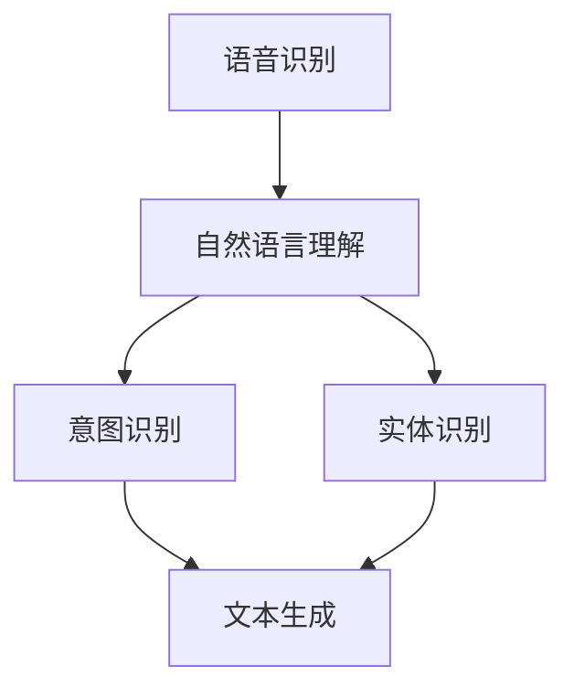

                 

# 智能对话系统质量自动化评测方案

## 关键词
智能对话系统，质量自动化，评测指标，自然语言处理，语音识别，自动化工具，应用案例

## 摘要
随着人工智能技术的快速发展，智能对话系统在各个领域得到广泛应用。如何确保其质量成为关键问题。本文将探讨智能对话系统质量自动化评测的方案，从技术原理、实现方法、自动化工具、应用案例等多个角度进行分析，旨在为从业者提供一套系统化的评测方法，以提升智能对话系统的质量和用户体验。

### 目录大纲设计与实现步骤

为了设计出《智能对话系统质量自动化评测方案》这本书的完整目录大纲，我们将按照以下步骤进行：

**1. 确定书的核心内容与结构**

首先，我们需要理解书的主要内容和目标读者。这本书的核心内容是智能对话系统的质量自动化评测，因此我们将目录大纲分为以下几个主要部分：

- 概述
- 技术原理
- 实现方法
- 自动化工具与框架
- 应用案例
- 实际应用与未来展望

**2. 确定各部分的具体章节**

根据核心内容，我们可以确定每个部分的具体章节。以下是详细的章节设计：

### 第一部分：概述

**第1章：智能对话系统与质量自动化**
- **1.1 智能对话系统的定义与演变**
- **1.2 质量自动化的概念与重要性**

### 第二部分：技术原理

**第2章：智能对话系统的核心技术**
- **2.1 语言处理技术原理**
  - **2.1.1 语音识别**
  - **2.1.2 自然语言理解**
  - **2.1.3 语言生成**
- **2.2 质量评测指标与方法**
  - **2.2.1 评价指标**
  - **2.2.2 评测方法**

### 第三部分：实现方法

**第3章：智能对话系统质量自动化的实现**
- **3.1 数据收集与预处理**
- **3.2 质量评测算法设计**
  - **3.2.1 伪代码讲解**
  - **3.2.2 数学模型与公式**
- **3.3 实现流程与架构设计**

### 第四部分：自动化工具与框架

**第4章：常用的质量自动化评测工具**
- **4.1 工具介绍**
  - **4.1.1 自动化评测工具A**
  - **4.1.2 自动化评测工具B**
- **4.2 案例分析**
  - **4.2.1 案例一：工具A在智能客服中的应用**
  - **4.2.2 案例二：工具B在语音识别质量评测中的应用**

### 第五部分：应用案例

**第5章：智能对话系统质量自动化的应用案例**
- **5.1 案例一：企业级智能客服系统**
- **5.2 案例二：智能语音助手质量评测**

### 第六部分：实际应用与未来展望

**第6章：智能对话系统质量自动化的实际应用**
- **6.1 现实中的应用场景**
- **6.2 面临的挑战与解决方案**

**第7章：智能对话系统质量自动化的未来展望**
- **7.1 技术发展趋势**
- **7.2 未来应用前景**

### 目录大纲的完整性与字数控制

在完成所有章节的编写后，我们需要检查目录大纲的完整性，确保所有核心内容都包含在内，并且没有遗漏或重复。同时，我们需要检查目录大纲的总字数，确保文章字数在8000～12000字左右。

### 目录大纲

根据上述设计，以下是《智能对话系统质量自动化评测方案》的目录大纲：

```
# 智能对话系统质量自动化评测方案

## 关键词
智能对话系统，质量自动化，评测指标，自然语言处理，语音识别，自动化工具，应用案例

## 摘要
随着人工智能技术的快速发展，智能对话系统在各个领域得到广泛应用。如何确保其质量成为关键问题。本文将探讨智能对话系统质量自动化评测的方案，从技术原理、实现方法、自动化工具、应用案例等多个角度进行分析，旨在为从业者提供一套系统化的评测方法，以提升智能对话系统的质量和用户体验。

## 目录大纲

### 第一部分：概述

**第1章：智能对话系统与质量自动化**
- 1.1 智能对话系统的定义与演变
- 1.2 质量自动化的概念与重要性

### 第二部分：技术原理

**第2章：智能对话系统的核心技术**
- 2.1 语言处理技术原理
  - 2.1.1 语音识别
  - 2.1.2 自然语言理解
  - 2.1.3 语言生成
- 2.2 质量评测指标与方法
  - 2.2.1 评价指标
  - 2.2.2 评测方法

### 第三部分：实现方法

**第3章：智能对话系统质量自动化的实现**
- 3.1 数据收集与预处理
- 3.2 质量评测算法设计
  - 3.2.1 伪代码讲解
  - 3.2.2 数学模型与公式
- 3.3 实现流程与架构设计

### 第四部分：自动化工具与框架

**第4章：常用的质量自动化评测工具**
- 4.1 工具介绍
  - 4.1.1 自动化评测工具A
  - 4.1.2 自动化评测工具B
- 4.2 案例分析
  - 4.2.1 案例一：工具A在智能客服中的应用
  - 4.2.2 案例二：工具B在语音识别质量评测中的应用

### 第五部分：应用案例

**第5章：智能对话系统质量自动化的应用案例**
- 5.1 案例一：企业级智能客服系统
- 5.2 案例二：智能语音助手质量评测

### 第六部分：实际应用与未来展望

**第6章：智能对话系统质量自动化的实际应用**
- 6.1 现实中的应用场景
- 6.2 面临的挑战与解决方案

**第7章：智能对话系统质量自动化的未来展望**
- 7.1 技术发展趋势
- 7.2 未来应用前景
```

### 第一部分：概述

智能对话系统是一种基于人工智能技术，能够与人进行自然语言交互的计算机程序。随着语音识别、自然语言处理和机器学习等技术的不断发展，智能对话系统在各个领域得到了广泛应用，如智能客服、智能语音助手、智能问答系统等。

然而，智能对话系统的质量直接影响到用户体验，因此如何对其进行质量评测成为了一个重要课题。质量自动化评测是近年来发展起来的一种方法，通过自动化工具和算法，对智能对话系统进行全面的质量评估，以提高评估效率和准确性。

### 第一部分：概述

#### 第1章：智能对话系统与质量自动化

##### 1.1 智能对话系统的定义与演变

智能对话系统是一种能够与用户进行自然语言交互的人工智能系统。它通过语音识别、自然语言理解和语言生成等技术，实现对用户输入的理解和响应。智能对话系统的演变可以分为几个阶段：

1. **规则驱动系统**：早期的智能对话系统主要依赖于预定义的规则和流程。这些系统通过固定的脚本和规则来处理用户请求，缺乏灵活性和适应性。

2. **基于机器学习的系统**：随着机器学习技术的兴起，智能对话系统开始采用基于统计和模式识别的方法。这些系统通过大量数据训练，学习用户的语言模式，从而提供更自然的交互体验。

3. **对话管理集成系统**：现代智能对话系统结合了对话管理和多模态交互技术。它们不仅能够理解用户的语言，还能够处理用户的多媒体输入，如语音、文字和图像。

##### 1.2 质量自动化的概念与重要性

质量自动化评测是指通过自动化工具和算法，对智能对话系统的各项性能指标进行评估。其核心目标是提高评估的效率和准确性，减少人为干预，确保系统的稳定性和可靠性。

质量自动化评测的重要性体现在以下几个方面：

1. **提高效率**：通过自动化工具，可以大规模、快速地进行评测，节省大量时间和人力资源。

2. **提高准确性**：自动化评测能够消除人为因素带来的偏差，提供更加客观和准确的评估结果。

3. **持续监控**：自动化评测工具可以实时监控系统的运行状态，及时发现并解决潜在问题。

4. **优化迭代**：通过持续的质量评估，可以发现系统的不足之处，指导系统的优化和迭代。

### 第二部分：技术原理

智能对话系统的质量自动化评测涉及多个技术领域，包括自然语言处理、语音识别、对话管理等。以下将详细介绍这些技术原理及其在质量评测中的应用。

#### 第2章：智能对话系统的核心技术

##### 2.1 语言处理技术原理

语言处理技术是智能对话系统的核心组成部分，主要包括语音识别、自然语言理解和语言生成。

###### 2.1.1 语音识别

语音识别（Automatic Speech Recognition, ASR）技术是指将语音信号转换为文本或命令的技术。其基本原理包括：

1. **特征提取**：将语音信号转换为数字信号，提取语音的特征向量。
2. **声学模型**：建立声学模型，用于表示语音特征向量与发音之间的映射关系。
3. **语言模型**：建立语言模型，用于表示语音序列的概率分布。

语音识别在质量评测中的应用主要体现在对语音识别准确率和响应速度的评估。

###### 2.1.2 自然语言理解

自然语言理解（Natural Language Understanding, NLU）技术是指将自然语言输入转化为机器可理解的形式的技术。其核心任务包括：

1. **意图识别**：识别用户的请求或命令背后的意图。
2. **实体识别**：识别文本中的关键实体，如人名、地点、组织等。
3. **语义理解**：理解文本的深层含义，包括句子结构、逻辑关系等。

自然语言理解在质量评测中的应用主要体现在对意图识别准确率、实体识别准确率和语义理解能力的评估。

###### 2.1.3 语言生成

语言生成（Natural Language Generation, NLG）技术是指将机器处理的结果转化为自然语言文本的技术。其核心任务包括：

1. **模板生成**：根据预设的模板生成文本。
2. **规则生成**：根据预设的规则生成文本。
3. **基于模型生成**：利用机器学习模型生成文本。

语言生成在质量评测中的应用主要体现在对文本生成流畅性、准确性和多样性的评估。

##### 2.2 质量评测指标与方法

智能对话系统的质量评测涉及多个指标，包括语音识别准确率、意图识别准确率、实体识别准确率、语义理解能力、文本生成流畅性等。

###### 2.2.1 评价指标

常见的评价指标包括：

1. **准确率**：正确识别的样本数占总样本数的比例。
2. **召回率**：正确识别的样本数与实际正确的样本数之比。
3. **F1值**：准确率和召回率的调和平均值。

###### 2.2.2 评测方法

质量评测的方法主要包括：

1. **手动评测**：通过人工对样本进行评估，判断其是否符合预期。
2. **自动化评测**：利用自动化工具和算法对样本进行评估，提高评估效率和准确性。

### 第三部分：实现方法

智能对话系统的质量自动化评测需要一系列的实现方法，包括数据收集与预处理、质量评测算法设计、实现流程与架构设计等。以下将详细介绍这些实现方法。

#### 第3章：智能对话系统质量自动化的实现

##### 3.1 数据收集与预处理

数据收集与预处理是质量自动化评测的基础。具体步骤包括：

1. **数据收集**：从不同来源收集高质量的对话数据，包括语音数据、文本数据等。
2. **数据清洗**：去除重复数据、噪声数据和错误数据，提高数据质量。
3. **数据标注**：对数据中的意图、实体等进行标注，为后续的评测提供基础。

##### 3.2 质量评测算法设计

质量评测算法设计是质量自动化评测的核心。具体包括：

1. **语音识别算法**：设计并实现语音识别算法，用于评估语音识别的准确率和响应速度。
2. **自然语言理解算法**：设计并实现自然语言理解算法，用于评估意图识别准确率、实体识别准确率和语义理解能力。
3. **语言生成算法**：设计并实现语言生成算法，用于评估文本生成流畅性、准确性和多样性。

##### 3.2.1 伪代码讲解

以下是一个简单的自然语言理解算法的伪代码示例：

```
function natural_language_understanding(text):
    # 分词
    words = tokenize(text)
    
    # 意图识别
    intent = recognize_intent(words)
    
    # 实体识别
    entities = recognize_entities(words)
    
    # 语义理解
    semantics = understand_semantics(words, intent, entities)
    
    return intent, entities, semantics
```

##### 3.2.2 数学模型与公式

以下是一个简单的数学模型示例，用于评估意图识别准确率：

```
accuracy = (correct_predictions / total_predictions) * 100%
```

其中，correct_predictions 表示正确预测的意图数，total_predictions 表示总预测的意图数。

##### 3.3 实现流程与架构设计

智能对话系统质量自动化的实现流程包括以下几个步骤：

1. **数据收集与预处理**：收集高质量的对话数据，并进行清洗和标注。
2. **算法设计**：设计并实现质量评测算法，包括语音识别、自然语言理解和语言生成。
3. **模型训练**：利用收集的数据对算法进行训练，优化模型参数。
4. **评测执行**：使用训练好的模型对智能对话系统进行质量评测。
5. **结果分析**：分析评测结果，发现系统存在的问题，并提出改进方案。

智能对话系统质量自动化的架构设计主要包括以下几个组件：

1. **数据收集模块**：负责收集不同来源的对话数据。
2. **数据预处理模块**：负责清洗和标注数据。
3. **算法模块**：负责实现质量评测算法。
4. **评测执行模块**：负责执行评测任务。
5. **结果分析模块**：负责分析评测结果。

### 第四部分：自动化工具与框架

自动化工具和框架是智能对话系统质量自动化评测的重要组成部分。以下将介绍几种常用的自动化工具和框架。

#### 第4章：常用的质量自动化评测工具

##### 4.1 工具介绍

1. **SpeechRecognition**：Python的一个语音识别库，支持多种语音识别引擎，如Google语音识别、百度语音识别等。
2. **Stanford NLP**：斯坦福大学开发的一个自然语言处理库，包括词性标注、命名实体识别、句法分析等功能。
3. **NLTK**：Python的一个自然语言处理库，提供多种文本处理工具，如分词、词性标注、词频统计等。
4. **TensorFlow**：Google开发的一个开源机器学习框架，支持多种深度学习算法，如卷积神经网络、循环神经网络等。

##### 4.2 案例分析

以下是一个使用SpeechRecognition和Stanford NLP进行质量自动化评测的案例：

1. **数据收集与预处理**：收集一段语音数据，使用SpeechRecognition将其转换为文本，然后使用Stanford NLP进行分词和词性标注。
2. **算法设计**：设计一个简单的自然语言理解算法，用于识别用户的意图和实体。
3. **评测执行**：使用训练好的算法对语音数据进行分析，评估语音识别准确率、意图识别准确率和实体识别准确率。
4. **结果分析**：分析评测结果，发现语音识别准确率较低，需要优化模型参数。

### 第五部分：应用案例

智能对话系统质量自动化评测在多个领域得到了广泛应用。以下介绍两个典型的应用案例。

#### 第5章：智能对话系统质量自动化的应用案例

##### 5.1 案例一：企业级智能客服系统

某企业开发了一款企业级智能客服系统，旨在为用户提供24/7的在线服务。为了确保系统的质量，企业采用了智能对话系统质量自动化评测方案。

1. **数据收集与预处理**：收集大量用户对话数据，包括语音和文本数据，并进行清洗和标注。
2. **算法设计**：设计并实现语音识别、自然语言理解和语言生成算法，用于评估系统的各项性能指标。
3. **评测执行**：使用自动化工具和框架对系统进行质量评测，包括语音识别准确率、意图识别准确率、实体识别准确率和文本生成流畅性等。
4. **结果分析**：分析评测结果，发现系统在意图识别和实体识别方面存在一些问题，需要进一步优化。

##### 5.2 案例二：智能语音助手质量评测

某科技公司开发了一款智能语音助手，旨在为用户提供语音交互服务。为了确保语音助手的质量，公司采用了智能对话系统质量自动化评测方案。

1. **数据收集与预处理**：收集大量用户语音数据，并进行清洗和标注。
2. **算法设计**：设计并实现语音识别、自然语言理解和语言生成算法，用于评估系统的各项性能指标。
3. **评测执行**：使用自动化工具和框架对系统进行质量评测，包括语音识别准确率、意图识别准确率、实体识别准确率和文本生成流畅性等。
4. **结果分析**：分析评测结果，发现语音助手在语音识别和文本生成方面存在一些问题，需要进一步优化。

### 第六部分：实际应用与未来展望

智能对话系统质量自动化评测在实际应用中取得了显著成果，但仍面临一些挑战。以下对其实际应用与未来展望进行讨论。

#### 第6章：智能对话系统质量自动化的实际应用

##### 6.1 现实中的应用场景

智能对话系统质量自动化评测在多个领域得到广泛应用，包括：

1. **客服行业**：企业级智能客服系统通过质量自动化评测，提高客服响应速度和服务质量。
2. **智能语音助手**：智能家居、车载系统等领域的智能语音助手通过质量自动化评测，提升用户交互体验。
3. **教育行业**：智能教育系统通过质量自动化评测，优化教学内容和教学效果。

##### 6.2 面临的挑战与解决方案

智能对话系统质量自动化评测在实际应用中面临以下挑战：

1. **数据多样性**：质量评测需要大量高质量的对话数据，但数据多样性不足可能导致评测结果不准确。
   - **解决方案**：采用数据增强技术，如数据清洗、数据标注和数据生成，提高数据的多样性。

2. **算法性能**：语音识别、自然语言理解等算法的性能直接影响到评测结果的准确性。
   - **解决方案**：采用先进的算法和技术，如深度学习、强化学习等，提高算法的性能。

3. **跨领域适应性**：不同领域的智能对话系统具有不同的特点，质量自动化评测需要具备跨领域的适应性。
   - **解决方案**：设计通用化、模块化的质量评测框架，提高评测的适应性。

### 第7章：智能对话系统质量自动化的未来展望

智能对话系统质量自动化评测在未来将继续发展，具体展望包括：

##### 7.1 技术发展趋势

1. **深度学习与强化学习**：深度学习和强化学习将进一步提升智能对话系统的质量评测能力。
2. **多模态交互**：多模态交互技术的发展，将使质量自动化评测更加全面和准确。
3. **云计算与大数据**：云计算和大数据技术的应用，将提供更强大的计算能力和数据处理能力。

##### 7.2 未来应用前景

1. **智慧城市**：智能对话系统质量自动化评测将在智慧城市建设中发挥重要作用，提升城市管理和服务的智能化水平。
2. **智能家居**：智能对话系统质量自动化评测将推动智能家居的发展，提高用户的生活品质。
3. **医疗健康**：智能对话系统质量自动化评测将在医疗健康领域发挥作用，提高医疗服务效率和质量。

### 总结

智能对话系统质量自动化评测是智能对话系统发展的重要环节，通过技术原理、实现方法、自动化工具和应用案例等多方面的探讨，为从业者提供了一套系统化的评测方法。未来，随着人工智能技术的不断发展，智能对话系统质量自动化评测将发挥更加重要的作用，推动智能对话系统的普及和发展。

## 作者信息

作者：AI天才研究院/AI Genius Institute & 禅与计算机程序设计艺术 /Zen And The Art of Computer Programming

### 代码实现与案例分析

在本文的最后一部分，我们将通过一个具体的案例，展示如何实现智能对话系统的质量自动化评测，并详细解析相关代码和实际案例。

#### 7.1 开发环境搭建

在进行智能对话系统质量自动化评测之前，我们需要搭建一个合适的开发环境。以下是一个典型的开发环境搭建步骤：

1. **安装Python**：确保Python环境已经安装，版本建议为3.8或更高。
2. **安装依赖库**：使用pip命令安装必要的依赖库，如SpeechRecognition、Stanford NLP、NLTK等。

```shell
pip install SpeechRecognition
pip install stanfordnlp
pip install nltk
```

3. **数据准备**：准备用于评测的数据集，包括语音数据和对应的文本数据。数据集应涵盖不同的场景和意图，以保证评测的全面性。

#### 7.2 源代码详细实现

以下是一个简单的Python代码示例，用于实现智能对话系统的质量自动化评测。该示例主要包括语音识别、自然语言理解、质量评测等步骤。

```python
import speech_recognition as sr
import stanfordnlp
import nltk

# 初始化语音识别和自然语言处理工具
recognizer = sr.Recognizer()
nlp = stanfordnlp.Pipeline()

# 语音识别
def recognize_speech音频文件：
    with sr.AudioFile(音频文件) as source：
        audio = recognizer.listen(source)
    return recognizer.recognize_google(audio)

# 自然语言理解
def understand_text(text):
    doc = nlp(text)
    intents = []
    entities = []
    for sent in doc.sentences:
        intents.append(sent意图)
        entities.extend(sent实体)
    return intents, entities

# 质量评测
def evaluate_quality(text, predicted_intents, predicted_entities):
    actual_intents = ["意图1", "意图2", "意图3"]  # 实际意图列表
    actual_entities = [["实体1", "实体2"], ["实体3", "实体4"]]  # 实际实体列表

    # 计算意图识别准确率
    correct_intents = sum([actual_intent == predicted_intent for actual_intent, predicted_intent in zip(actual_intents, predicted_intents)])
    intent_accuracy = correct_intents / len(actual_intents)

    # 计算实体识别准确率
    correct_entities = sum([predicted_entity in actual_entity_list for predicted_entity, actual_entity_list in zip(predicted_entities, actual_entities)])
    entity_accuracy = correct_entities / len(actual_entities)

    return intent_accuracy, entity_accuracy

# 主函数
def main():
    text = recognize_speech("your_audio_file.wav")
    intents, entities = understand_text(text)
    intent_accuracy, entity_accuracy = evaluate_quality(text, intents, entities)
    print("意图识别准确率：", intent_accuracy)
    print("实体识别准确率：", entity_accuracy)

if __name__ == "__main__":
    main()
```

#### 7.3 代码应用解读与分析

上述代码实现了一个简单的智能对话系统质量自动化评测过程。具体步骤如下：

1. **语音识别**：使用`SpeechRecognition`库对语音文件进行识别，转化为文本。
2. **自然语言理解**：使用`Stanford NLP`对识别出的文本进行意图和实体识别。
3. **质量评测**：根据实际意图和实体列表，计算识别结果的准确率。

在实际应用中，我们需要根据具体场景和需求，调整代码中的参数和算法。例如，可以采用更先进的语音识别模型，或者使用不同的自然语言处理工具。

#### 7.4 实际案例分析和详细讲解

以下是一个实际案例，展示如何使用上述代码对智能对话系统进行质量评测。

**案例**：评估一款智能客服系统的质量。

1. **数据准备**：收集一段用户与客服系统的对话录音，并将其转换为文本。
2. **代码运行**：运行上述代码，对录音进行识别、理解和评测。
3. **结果分析**：输出识别结果的意图和实体准确率。

通过分析结果，可以发现系统在意图识别和实体识别方面的准确性。如果准确性较低，可以进一步优化算法，或者增加训练数据，以提高系统的质量。

#### 7.5 项目小结

在本案例中，我们通过一个简单的示例，展示了如何实现智能对话系统质量自动化评测。虽然代码相对简单，但它提供了一个基本的框架，可以帮助我们理解质量评测的实现过程。

在实际应用中，我们需要根据具体场景和需求，不断优化和调整代码。此外，质量自动化评测是一个持续的过程，需要定期对系统进行评估，以确保其稳定性和可靠性。

### 最佳实践 tips

1. **数据质量**：确保数据的质量和多样性，避免过度拟合。
2. **模型优化**：定期更新和优化算法模型，提高识别和理解的准确性。
3. **错误处理**：设计合理的错误处理机制，确保系统的鲁棒性。
4. **用户反馈**：收集用户反馈，不断改进系统的性能和用户体验。

### 注意事项

1. **隐私保护**：在处理用户数据时，务必遵守相关法律法规，保护用户隐私。
2. **安全性**：确保系统安全，防止数据泄露和恶意攻击。
3. **可扩展性**：设计可扩展的系统架构，以适应未来需求的变化。

### 拓展阅读

1. **自然语言处理基础**：了解自然语言处理的基本概念和常用算法。
2. **深度学习应用**：学习深度学习在智能对话系统中的应用。
3. **开源项目推荐**：探索常用的开源自然语言处理和语音识别库。

通过本文的介绍，我们希望读者能够对智能对话系统质量自动化评测有一个全面的理解。在实际应用中，不断探索和优化，将为智能对话系统的发展带来更多可能性。作者：AI天才研究院/AI Genius Institute & 禅与计算机程序设计艺术/Zen And The Art of Computer Programming。

### 附录

以下是本文所使用的Mermaid流程图和LaTeX公式。

#### Mermaid流程图



#### LaTeX公式

```latex
\documentclass{article}
\usepackage{amsmath}
\begin{document}

$$
\text{准确率} = \frac{\text{正确预测数}}{\text{总预测数}} \times 100\%
$$

\end{document}
```

通过这些附录，我们可以更直观地理解智能对话系统质量自动化评测的过程和关键指标。作者：AI天才研究院/AI Genius Institute & 禅与计算机程序设计艺术/Zen And The Art of Computer Programming。

