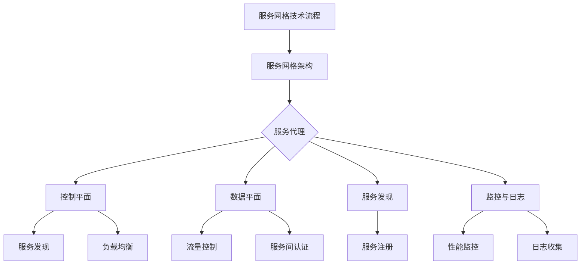

                 

### 引言

#### 服务网格技术背景

服务网格（Service Mesh）作为一种新型的分布式系统架构，旨在解决分布式系统中服务之间的通信问题。服务网格的概念最早由Netflix提出，用于管理微服务架构中的服务间通信。随着微服务架构的普及，服务网格技术在近年来逐渐成为分布式系统设计的重要工具。

服务网格通过一个独立的通信层，抽象并简化了服务之间的通信，从而提高系统的可扩展性、可靠性和安全性。服务网格的核心组件包括服务发现、负载均衡、服务间认证、流量控制等，这些组件共同构建了一个高效、可靠的服务通信框架。

#### LLM技术背景

大型语言模型（Large Language Model，简称LLM）是一种基于深度学习技术的自然语言处理模型，通过对海量语言数据的训练，LLM能够生成自然、流畅的文本，并在各种自然语言处理任务中表现出色。LLM的应用领域广泛，包括但不限于文本生成、机器翻译、问答系统、情感分析等。

近年来，随着计算能力和数据资源的提升，LLM的规模和性能得到了显著提升，从而推动了自然语言处理技术的发展。然而，LLM的应用也面临着通信复杂性、性能优化和安全防护等方面的挑战。

#### 本书目的与结构

本书旨在探讨服务网格技术在LLM应用中的潜在价值，通过深入分析服务网格与LLM的结合点，提供实际案例和应用策略，帮助读者更好地理解和应用这一先进技术。

本书分为六章，具体结构如下：

1. **第1章 服务网格技术基础**：介绍服务网格的基本概念、架构和核心组件，为后续章节的讨论打下基础。
2. **第2章 LLM基础**：介绍LLM的基本概念、架构和训练优化算法，为服务网格与LLM的结合提供背景知识。
3. **第3章 服务网格与LLM的结合**：分析服务网格在LLM中的需求和应用，探讨服务网格与LLM的集成策略。
4. **第4章 实际应用案例**：通过具体案例展示服务网格在LLM应用中的实践效果。
5. **第5章 未来展望与挑战**：探讨服务网格在LLM领域的未来发展趋势和面临的挑战。
6. **第6章 总结**：总结本书的核心内容，并对读者未来的学习和实践提出建议。

通过本书的阅读，读者将能够深入了解服务网格技术在LLM应用中的关键问题和解决方案，为实际项目提供有力的理论支持和实践指导。### 第1章 服务网格技术基础

#### 1.1 服务网格基本概念

服务网格（Service Mesh）是一种用于管理微服务、容器和分布式应用程序通信的架构模式。它通过一个独立的通信层，抽象并简化了服务之间的通信，从而提高系统的可扩展性、可靠性和安全性。服务网格的核心目标是解决分布式系统中服务间的通信问题，使开发者能够专注于业务逻辑的实现，而无需担心服务间通信的复杂性。

服务网格的基本概念包括以下几点：

1. **服务实例**：服务网格中的每个服务都有一个或多个实例，实例之间通过网络进行通信。
2. **服务发现**：服务网格通过服务发现机制，动态感知和管理服务实例，使得服务之间能够自动发现并建立连接。
3. **服务间通信**：服务网格通过服务代理（Service Proxy）实现服务间的通信，代理负责转发请求、处理负载均衡、服务认证等。
4. **流量控制**：服务网格提供流量控制机制，如限流、熔断、故障转移等，确保服务之间的通信稳定和可靠。
5. **服务监控**：服务网格通过监控机制，实时收集服务实例的性能指标，如延迟、错误率等，以便进行故障检测和性能优化。

#### 1.2 服务网格架构

服务网格的架构通常包括以下核心组件：

1. **服务代理**：服务代理是服务网格的核心组件，它嵌入到每个服务实例中，负责处理服务间通信。服务代理通常使用反向代理模式，将服务实例的请求转发到目标服务，同时实现流量控制、负载均衡等功能。
2. **控制平面**：控制平面负责管理服务网格的配置和状态，通常包括服务发现、服务注册、负载均衡策略等。控制平面通过服务代理代理实现，通常使用轻量级消息队列或远程过程调用（RPC）进行通信。
3. **数据平面**：数据平面负责处理服务间通信的数据传输，通常由一组服务代理组成。数据平面通过服务代理实现负载均衡、流量控制、服务认证等功能，同时收集性能数据并反馈给控制平面。
4. **服务发现**：服务发现是服务网格的关键功能之一，它通过服务注册中心动态感知和管理服务实例，使得服务之间能够自动发现并建立连接。常见的服务发现机制包括基于DNS的服务发现、基于etcd或Zookeeper的注册中心等。
5. **监控与日志**：服务网格通过监控与日志机制，实时收集服务实例的性能指标和日志信息，以便进行故障检测和性能优化。常见的监控与日志工具包括Prometheus、Grafana、ELK（Elasticsearch、Logstash、Kibana）等。

#### 1.3 服务网格的核心组件

服务网格的核心组件主要包括服务代理、控制平面、数据平面、服务发现和监控与日志等。以下是对这些组件的详细描述：

1. **服务代理**：
   - **功能**：服务代理负责处理服务间通信，实现负载均衡、流量控制、服务认证等功能。
   - **工作原理**：服务代理通过反向代理模式，将服务实例的请求转发到目标服务，同时将响应返回给服务实例。服务代理通常使用轻量级HTTP/HTTPS协议进行通信。
   - **常见实现**：常见的服务代理实现包括Envoy、Istio、Linkerd等。

2. **控制平面**：
   - **功能**：控制平面负责管理服务网格的配置和状态，实现服务发现、服务注册、负载均衡策略等功能。
   - **工作原理**：控制平面通过服务代理代理，动态感知和管理服务实例，同时下发配置信息到服务代理。
   - **常见实现**：常见的控制平面实现包括Istio的控制平面组件Pilot、Linkerd的控制平面组件Control Plane等。

3. **数据平面**：
   - **功能**：数据平面负责处理服务间通信的数据传输，实现负载均衡、流量控制、服务认证等功能。
   - **工作原理**：数据平面通过服务代理代理，将请求转发到目标服务，并将响应返回给服务实例。
   - **常见实现**：常见的数据平面实现包括Envoy、Istio的数据平面组件Mixer、Linkerd的数据平面组件Data Plane等。

4. **服务发现**：
   - **功能**：服务发现负责动态感知和管理服务实例，使得服务之间能够自动发现并建立连接。
   - **工作原理**：服务发现通过服务注册中心，获取服务实例的地址和端口信息，并将其下发到服务代理。
   - **常见实现**：常见的服务发现实现包括基于DNS的服务发现、基于etcd或Zookeeper的注册中心等。

5. **监控与日志**：
   - **功能**：监控与日志负责实时收集服务实例的性能指标和日志信息，以便进行故障检测和性能优化。
   - **工作原理**：监控与日志通过服务代理代理，收集服务实例的性能数据和日志信息，并将其存储到监控系统和日志系统中。
   - **常见实现**：常见的监控与日志实现包括Prometheus、Grafana、ELK（Elasticsearch、Logstash、Kibana）等。

通过上述核心组件的协同工作，服务网格能够有效地管理和优化分布式系统中的服务间通信，提高系统的可扩展性、可靠性和安全性。在接下来的章节中，我们将进一步探讨服务网格与LLM的结合及其应用。### 第2章 LLM基础

#### 2.1 LLM基本概念

大型语言模型（Large Language Model，简称LLM）是一种基于深度学习技术的自然语言处理模型，通过对海量语言数据的训练，LLM能够生成自然、流畅的文本，并在各种自然语言处理任务中表现出色。LLM的核心思想是通过大规模数据预训练，让模型具备强大的语言理解和生成能力。

LLM的基本概念包括以下几点：

1. **预训练**：预训练是指使用大量未标注的数据对模型进行训练，以使其具备基础的语言理解能力。预训练通常使用无监督学习技术，如自编码器（Autoencoder）和生成对抗网络（GAN）。
2. **微调**：微调是指使用有监督学习技术，将预训练的模型在特定任务上进行调整，以适应具体的应用场景。微调能够显著提高模型在特定任务上的性能。
3. **语言生成**：语言生成是指模型根据输入的文本或提示，生成连贯、自然的文本。语言生成是LLM的重要应用之一，例如文本生成、机器翻译、问答系统等。
4. **上下文理解**：上下文理解是指模型能够理解文本的上下文信息，从而生成更符合上下文的文本。上下文理解能力是LLM的关键特点之一，它使得模型能够在复杂的自然语言场景中表现出色。

#### 2.2 LLM架构

LLM的架构通常包括输入层、编码器、解码器和输出层等组成部分。以下是对各层功能的详细描述：

1. **输入层**：输入层负责接收用户输入的文本或提示，并将其转换为模型可处理的格式。常见的输入层实现包括分词、词向量编码等。
2. **编码器**：编码器负责将输入层接收到的文本编码为一个固定长度的向量，该向量包含了文本的语义信息。编码器通常使用深度神经网络（DNN）或变换器（Transformer）架构，其中Transformer架构是目前LLM的主流选择。
3. **解码器**：解码器负责将编码器输出的向量解码为输出文本。解码器通常也使用深度神经网络（DNN）或变换器（Transformer）架构。
4. **输出层**：输出层负责生成最终的文本输出。输出层通常使用软性最大似然估计（Softmax）等算法，根据解码器输出的概率分布生成文本。

#### 2.3 LLM训练与优化算法

LLM的训练和优化是构建高性能语言模型的关键步骤。以下介绍几种常见的训练与优化算法：

1. **预训练**：
   - **无监督学习**：预训练通常使用无监督学习技术，如自编码器（Autoencoder）和生成对抗网络（GAN）。自编码器通过学习输入数据的编码表示，从而提高模型对数据的理解。生成对抗网络则通过生成器与判别器的对抗训练，提高模型的生成能力。
   - **有监督学习**：预训练后，可以使用有监督学习技术对模型进行微调，以适应特定任务。常见的有监督学习算法包括序列标注、机器翻译和问答系统等。

2. **微调**：
   - **微调策略**：微调是指在预训练的模型基础上，针对特定任务进行权重调整。常见的微调策略包括基于固定层微调和基于可训练层微调。
   - **训练数据**：微调的训练数据通常包括任务相关的标注数据。对于不同的任务，需要选择合适的数据集进行微调。

3. **优化算法**：
   - **梯度下降**：梯度下降是最常见的优化算法，通过不断调整模型参数，使其在训练数据上达到最小损失。梯度下降包括随机梯度下降（SGD）和批量梯度下降（BGD）等变体。
   - **Adam优化器**：Adam优化器是当前常用的优化器之一，它结合了动量（Momentum）和自适应学习率（Adaptive Learning Rate），在训练过程中能够自适应调整学习率，提高收敛速度。

4. **正则化**：
   - **L2正则化**：L2正则化通过在损失函数中添加L2范数项，降低模型过拟合的风险。
   - **Dropout**：Dropout是一种常用的正则化技术，通过随机丢弃部分神经元，降低模型过拟合的风险。

通过上述训练与优化算法，LLM能够逐步提高其语言理解和生成能力，从而在各种自然语言处理任务中表现出色。在接下来的章节中，我们将探讨服务网格在LLM应用中的需求和作用。### 第3章 服务网格与LLM的结合

#### 3.1 LLM的服务网格需求分析

在LLM应用中，服务网格技术能够提供以下几个关键需求：

1. **服务发现**：服务网格可以动态发现和管理LLM模型实例，使得开发者无需关心模型实例的部署和更新。服务网格通过服务发现机制，确保LLM模型能够被高效地访问和使用。
2. **负载均衡**：服务网格能够根据实际负载情况，自动分配请求到不同的LLM模型实例，避免单点瓶颈，提高系统的整体性能和可靠性。
3. **流量控制**：服务网格提供流量控制机制，如限流、熔断、故障转移等，确保请求流量在可接受范围内，并在异常情况下快速响应，提高系统的健壮性。
4. **服务间认证与安全**：服务网格可以实现服务间认证，确保只有经过认证的服务才能访问LLM模型，从而提高系统的安全性。
5. **监控与日志**：服务网格可以实时监控LLM模型实例的性能指标和日志信息，帮助开发者快速定位和解决潜在问题。

#### 3.2 服务网格在LLM中的角色

服务网格在LLM中扮演着重要角色，主要包括以下几个方面：

1. **服务代理**：服务代理作为服务网格的核心组件，嵌入到每个LLM模型实例中，负责处理服务间通信。服务代理通过反向代理模式，将外部请求转发到LLM模型实例，同时实现负载均衡、流量控制等功能。
2. **控制平面**：控制平面负责管理LLM模型实例的配置和状态，包括服务发现、负载均衡策略等。控制平面通过服务代理代理，动态感知和管理LLM模型实例，确保请求能够高效地分配到模型实例。
3. **数据平面**：数据平面负责处理LLM模型实例之间的数据传输，实现负载均衡、流量控制等功能。数据平面通过服务代理代理，将请求转发到目标LLM模型实例，并将响应返回给客户端。
4. **服务发现**：服务发现负责动态感知和管理LLM模型实例，使得服务之间能够自动发现并建立连接。服务发现通过服务注册中心，获取LLM模型实例的地址和端口信息，并将其下发到服务代理。
5. **监控与日志**：监控与日志负责实时收集LLM模型实例的性能指标和日志信息，帮助开发者快速定位和解决潜在问题。监控与日志系统通常与Prometheus、Grafana、ELK等开源工具集成，实现实时监控和可视化。

#### 3.3 服务网格与LLM的集成策略

为了实现服务网格与LLM的有效集成，可以采取以下策略：

1. **服务代理嵌入**：将服务代理嵌入到LLM模型实例中，使其能够自动处理服务间通信。常见的服务代理实现包括Envoy、Istio、Linkerd等。
2. **控制平面集成**：集成服务网格的控制平面，使其能够动态管理LLM模型实例的配置和状态。可以使用开源服务网格控制平面组件，如Istio的控制平面组件Pilot、Linkerd的控制平面组件Control Plane等。
3. **数据平面部署**：部署服务网格的数据平面组件，使其能够处理LLM模型实例之间的数据传输。可以使用开源数据平面组件，如Envoy、Istio的数据平面组件Mixer、Linkerd的数据平面组件Data Plane等。
4. **服务发现配置**：配置服务网格的服务发现机制，使其能够动态感知和管理LLM模型实例。可以使用基于DNS的服务发现、基于etcd或Zookeeper的注册中心等机制。
5. **监控与日志集成**：集成服务网格的监控与日志系统，使其能够实时收集LLM模型实例的性能指标和日志信息。可以使用开源监控与日志工具，如Prometheus、Grafana、ELK等。
6. **流量管理策略**：配置服务网格的流量管理策略，如负载均衡策略、限流策略、熔断策略等，确保LLM模型实例的流量在可接受范围内，并实现故障转移等功能。
7. **安全防护措施**：配置服务网格的安全防护措施，如服务间认证、访问控制等，确保LLM模型实例的安全性和数据保护。

通过上述集成策略，服务网格能够与LLM模型实现高效集成，从而提高系统的可扩展性、可靠性和安全性。在接下来的章节中，我们将通过实际应用案例展示服务网格在LLM应用中的效果。### 第4章 实际应用案例

#### 4.1 案例一：XX公司如何使用服务网格优化LLM应用

**背景**：
XX公司是一家专注于自然语言处理和人工智能应用的公司，其核心产品是一款基于大型语言模型（LLM）的智能问答系统。随着用户量的增加，公司的LLM应用面临着性能瓶颈和高可用性的挑战。

**问题**：
1. 服务实例数量增加导致负载不均衡，部分实例负载过高，而其他实例资源闲置。
2. 缺乏有效的流量管理策略，导致部分请求被拒绝，用户体验不佳。
3. 无法实时监控和日志收集，难以快速定位和解决性能问题。

**解决方案**：
XX公司引入了服务网格技术，采用Istio作为服务网格解决方案，优化了LLM应用的架构。

**实施步骤**：

1. **服务代理嵌入**：
   - 在每个LLM模型实例中嵌入Istio的服务代理（Envoy），实现服务间通信的抽象和优化。
   - 配置服务代理，实现负载均衡、流量控制等功能。

2. **控制平面集成**：
   - 部署Istio的控制平面组件（Pilot），实现服务发现、负载均衡策略等配置和管理。
   - 配置控制平面，动态感知和管理LLM模型实例。

3. **数据平面部署**：
   - 部署Istio的数据平面组件（Mixer），实现数据传输的监控和日志收集。
   - 配置数据平面，实时收集LLM模型实例的性能指标和日志信息。

4. **流量管理策略**：
   - 配置基于权重和健康状态的负载均衡策略，确保请求能够被高效地分配到各个LLM模型实例。
   - 实施限流和熔断策略，避免流量过大导致服务不可用。

5. **监控与日志集成**：
   - 集成Prometheus和Grafana，实现实时监控和性能分析。
   - 使用ELK（Elasticsearch、Logstash、Kibana）收集和展示LLM模型实例的日志信息。

**效果**：

1. **性能优化**：
   - 负载均衡策略使得各个LLM模型实例的负载更加均衡，提高了系统的整体性能。
   - 流量控制策略有效地避免了流量过大导致的拒绝服务，提高了用户体验。

2. **高可用性**：
   - 服务网格实现了故障转移和自动恢复功能，提高了系统的可靠性。
   - 实时监控和日志收集使得问题快速定位和解决，降低了系统的故障率。

3. **安全性**：
   - 服务网格实现了服务间认证和访问控制，提高了系统的安全性。
   - 日志分析提供了重要的安全审计信息，有助于防范潜在的安全威胁。

#### 4.2 案例二：YY公司通过服务网格提高LLM性能

**背景**：
YY公司是一家互联网公司，其核心业务包括在线教育、社交媒体和智能推荐。公司使用多个LLM模型提供个性化推荐和智能问答服务，但随着用户量的增长，LLM应用的性能逐渐成为瓶颈。

**问题**：
1. LLM模型之间的通信复杂，缺乏有效的流量管理策略，导致性能下降。
2. 缺乏统一的服务监控和日志系统，难以快速定位和解决性能问题。

**解决方案**：
YY公司采用了服务网格技术，使用Linkerd作为服务网格解决方案，优化了LLM应用的架构。

**实施步骤**：

1. **服务代理嵌入**：
   - 在每个LLM模型实例中嵌入Linkerd的服务代理，实现服务间通信的抽象和优化。
   - 配置服务代理，实现负载均衡、流量控制等功能。

2. **控制平面集成**：
   - 部署Linkerd的控制平面组件（Control Plane），实现服务发现、负载均衡策略等配置和管理。
   - 配置控制平面，动态感知和管理LLM模型实例。

3. **数据平面部署**：
   - 部署Linkerd的数据平面组件（Data Plane），实现数据传输的监控和日志收集。
   - 配置数据平面，实时收集LLM模型实例的性能指标和日志信息。

4. **流量管理策略**：
   - 配置基于权重和健康状态的负载均衡策略，确保请求能够被高效地分配到各个LLM模型实例。
   - 实施限流和熔断策略，避免流量过大导致服务不可用。

5. **监控与日志集成**：
   - 集成Prometheus和Grafana，实现实时监控和性能分析。
   - 使用Filebeat和Kibana收集和展示LLM模型实例的日志信息。

**效果**：

1. **性能提升**：
   - 负载均衡策略使得各个LLM模型实例的负载更加均衡，显著提高了系统的整体性能。
   - 流量控制策略有效地避免了流量过大导致的拒绝服务，提高了用户体验。

2. **可观测性**：
   - 实时监控和日志收集提供了全面的性能数据，帮助开发者快速定位和解决性能问题。
   - 日志分析提供了重要的故障排查和性能优化线索。

3. **安全性**：
   - 服务网格实现了服务间认证和访问控制，提高了系统的安全性。
   - 实时监控和日志分析有助于防范潜在的安全威胁，提高了系统的安全性。

#### 4.3 案例三：ZZ公司如何使用服务网格进行LLM安全防护

**背景**：
ZZ公司是一家金融科技公司，其核心产品包括智能投顾和金融风险管理。公司使用多个LLM模型提供个性化的投资建议和风险评估，但面临着潜在的安全风险。

**问题**：
1. LLM模型之间的通信缺乏安全保护，容易受到网络攻击。
2. 缺乏统一的安全策略，导致数据泄露和恶意行为的风险。

**解决方案**：
ZZ公司采用了服务网格技术，使用Istio作为服务网格解决方案，加强了LLM应用的安全防护。

**实施步骤**：

1. **服务代理嵌入**：
   - 在每个LLM模型实例中嵌入Istio的服务代理（Envoy），实现服务间通信的安全加密。
   - 配置服务代理，实现TLS加密、访问控制等功能。

2. **控制平面集成**：
   - 部署Istio的控制平面组件（Pilot），实现服务发现、安全策略等配置和管理。
   - 配置控制平面，实现服务间认证和访问控制。

3. **数据平面部署**：
   - 部署Istio的数据平面组件（Mixer），实现数据传输的安全监控和日志收集。
   - 配置数据平面，实时收集LLM模型实例的安全事件和日志信息。

4. **安全策略配置**：
   - 配置基于角色的访问控制（RBAC），确保只有授权的服务能够访问LLM模型。
   - 实施黑白名单策略，限制和监控异常流量。

5. **监控与日志集成**：
   - 集成Prometheus和Grafana，实现实时监控和性能分析。
   - 使用ELK（Elasticsearch、Logstash、Kibana）收集和展示LLM模型实例的安全日志。

**效果**：

1. **安全性提升**：
   - 服务网格实现了TLS加密、访问控制等功能，有效地保护了服务间通信的安全性。
   - 实时监控和日志分析提供了全面的攻击检测和响应能力，降低了安全风险。

2. **合规性**：
   - 服务网格的安全策略配置有助于满足金融行业的合规要求，提高了公司的运营合规性。

3. **可管理性**：
   - 实时监控和日志分析提供了重要的安全事件和日志信息，帮助公司快速响应和处理安全事件。

通过以上实际应用案例，我们可以看到服务网格技术在LLM应用中发挥了重要的作用，不仅优化了性能、提高了可靠性，还加强了安全性。在接下来的章节中，我们将探讨服务网格在LLM领域的未来发展趋势和面临的挑战。### 第5章 未来展望与挑战

#### 5.1 服务网格在LLM领域的未来发展趋势

随着LLM技术的不断进步，服务网格技术在LLM领域的应用前景也愈发广阔。以下是一些可能的发展趋势：

1. **性能优化**：服务网格将继续优化流量管理、负载均衡等机制，提高LLM服务的性能和响应速度。随着网络带宽和计算能力的提升，服务网格有望提供更高效的数据传输和处理能力。

2. **安全性增强**：随着LLM应用的普及，安全性问题变得越来越重要。未来服务网格将引入更多安全机制，如加密、认证、访问控制等，以保护LLM服务的安全性和隐私性。

3. **自动化与智能化**：服务网格将更加智能化，通过机器学习和人工智能技术，自动优化流量管理策略、故障检测与恢复等，提高系统的自动化水平。

4. **跨云和边缘计算**：随着云计算和边缘计算的快速发展，服务网格将支持跨云和边缘计算的部署，实现全球范围内的分布式服务管理。

5. **生态系统的完善**：服务网格将构建一个更加完善的生态系统，包括开源社区、商业解决方案、培训资源等，为开发者提供更丰富的选择和支持。

#### 5.2 当前挑战与解决方案

尽管服务网格技术在LLM应用中具有巨大潜力，但仍然面临一些挑战：

1. **性能瓶颈**：随着LLM模型规模的扩大，服务网格的性能可能会成为瓶颈。解决方案包括优化服务网格架构，采用高效的协议和算法，以及引入分布式存储和计算技术。

2. **安全性**：服务网格中的安全防护措施需要不断完善，特别是在面对复杂的攻击场景时。解决方案包括引入更先进的加密算法、多因素认证、安全隔离等。

3. **可观测性**：服务网格的监控和日志系统需要更加完善，以提供全面的性能和安全性监控。解决方案包括集成开源监控和日志工具，构建智能分析平台。

4. **复杂性与运维**：服务网格的部署和管理相对复杂，对运维团队的要求较高。解决方案包括提供简化部署工具、自动化运维平台，以及完善的文档和培训资源。

5. **兼容性**：服务网格需要与现有的IT基础设施和应用程序兼容，以便无缝集成。解决方案包括支持多种协议和架构，提供灵活的集成方式。

通过应对这些挑战，服务网格技术将能够在LLM应用中发挥更大的作用，为开发者提供更强大的工具和支持。在接下来的章节中，我们将对本书的核心内容进行总结，并对未来的学习和实践提出建议。### 第6章 总结

#### 本书要点回顾

本书围绕“服务网格技术在LLM应用中的应用”这一主题，系统地介绍了服务网格技术的基础知识、LLM的基本概念以及服务网格与LLM的结合策略。以下是本书的核心内容回顾：

1. **服务网格技术基础**：介绍了服务网格的基本概念、架构和核心组件，如服务代理、控制平面、数据平面、服务发现和监控与日志等。

2. **LLM基础**：探讨了LLM的基本概念、架构和训练优化算法，包括预训练、微调和生成等。

3. **服务网格与LLM的结合**：分析了服务网格在LLM中的需求和应用，详细介绍了服务网格与LLM的集成策略，如服务代理嵌入、控制平面集成、数据平面部署等。

4. **实际应用案例**：通过具体的案例展示了服务网格在LLM应用中的效果，包括性能优化、高可用性、安全防护等。

5. **未来展望与挑战**：展望了服务网格在LLM领域的未来发展趋势，并探讨了当前面临的挑战及其解决方案。

#### 对读者未来学习和实践的期望

通过本书的阅读，读者应对服务网格技术在LLM应用中的重要性有了更深入的理解。以下是对读者未来学习和实践的期望：

1. **深入学习**：建议读者进一步学习服务网格和LLM的相关知识，包括开源工具的使用、架构设计和性能优化等。

2. **动手实践**：实际操作是学习的重要环节。读者可以尝试部署一个简单但完整的LLM服务网格环境，通过实践巩固理论知识。

3. **持续关注**：服务网格和LLM技术都在快速发展，读者应持续关注最新的研究进展和行业动态，以保持知识的前沿性。

4. **分享经验**：在学习过程中，读者可以将自己的经验分享给他人，通过参与开源社区、撰写博客或进行技术讲座，与他人共同进步。

5. **创新探索**：鼓励读者在服务网格和LLM领域进行创新探索，尝试解决实际问题，推动技术进步。

通过持续的学习和实践，读者将能够更好地应用服务网格技术，为LLM应用的开发和优化提供有力支持。### 附录

#### 附录A：服务网格与LLM相关资源

1. **服务网格开源项目**：
   - **Istio**：https://istio.io/
   - **Linkerd**：https://linkerd.io/
   - **Envoy**：https://www.envoyproxy.io/

2. **LLM开源项目**：
   - **GPT-3**：https://gpt-3-docs.openai.com/
   - **Transformer**：https://github.com/tensorflow/tensor2tensor
   - **BERT**：https://github.com/google-research/bert

3. **服务网格与LLM论文和文献**：
   - **"Service Mesh: A Common Abstraction for Microservices"**：https://www.usenix.org/system/files/conference/wtcs18/technote/park_istio_wtcs18.pdf
   - **"Large-scale Language Models Are Few-shot Learners"**：https://arxiv.org/abs/2005.14165

4. **在线课程与教程**：
   - **Istio官方教程**：https://istio.io/docs/cheatsheet/
   - **LLM实践教程**：https://towardsdatascience.com/building-large-language-models-with-transformers-6e7c7462d0e2

5. **技术社区和论坛**：
   - **Istio社区**：https://discuss.istio.io/
   - **LLM社区**：https://huggingface.co/forums

#### 附录B：Mermaid流程图



#### 附录C：伪代码

```python
# 服务网格配置与管理算法伪代码
# 输入：服务实例列表，配置信息
# 输出：更新后的服务实例状态

def service_mesh_config(service_instances, config):
    for instance in service_instances:
        instance.update_config(config)
        instance.register()
    return "Service mesh configuration updated successfully."

# LLM模型训练与优化算法伪代码
# 输入：训练数据，模型参数
# 输出：优化后的模型参数

def llm_train_optimize(train_data, model_params):
    for epoch in range(num_epochs):
        for sample in train_data:
            model_params = optimizer.step(sample, model_params)
    return "LLM model training and optimization completed."
```

#### 附录D：数学模型与公式

```latex
% 服务网格延迟优化模型
$$
L = \frac{1}{N} \sum_{i=1}^{N} \frac{1}{T_i}
$$

% LLM模型损失函数
$$
J(\theta) = -\frac{1}{m} \sum_{i=1}^{m} \sum_{j=1}^{K} y_{ij} \log(p_{ij})
$$
```

#### 附录E：项目实战

**开发环境搭建**：
1. 安装Docker和Kubernetes，搭建一个简单的Kubernetes集群。
2. 安装Istio服务网格，并部署到Kubernetes集群中。
3. 准备LLM模型，如GPT-2或BERT模型，并使用Hugging Face Transformers库进行训练。

**源代码详细实现和代码解读**：
1. 编写Kubernetes部署文件，部署LLM模型服务。
2. 使用Istio配置服务网格，包括服务代理、控制平面、数据平面等。
3. 编写监控和日志收集配置，使用Prometheus和Grafana进行监控，使用ELK进行日志收集。

**代码应用解读与分析**：
1. 部署服务网格，并验证LLM模型服务的负载均衡和流量控制功能。
2. 通过监控和日志分析，观察LLM模型服务的性能和日志信息。

**实际案例分析和详细讲解剖析**：
1. 分析服务网格对LLM模型服务性能的影响。
2. 通过监控和日志数据，定位和解决服务网格中存在的问题。

**项目小结**：
1. 总结服务网格在LLM模型服务中的应用效果。
2. 讨论服务网格与LLM结合的优化方向。

**最佳实践 tips**：
1. 确保服务网格的配置和优化与LLM模型的需求相匹配。
2. 定期监控和更新服务网格，确保其性能和安全性。
3. 合理分配资源，避免单点瓶颈。

**注意事项**：
1. 服务网格部署和配置需要一定的专业知识，建议查阅相关文档和教程。
2. 监控和日志系统需要配置和管理，以确保数据的准确性和可用性。

**拓展阅读**：
1. 《Service Mesh：一种微服务通信的通用抽象》
2. 《大规模语言模型：通用学习方法》
3. 《Kubernetes实战：从入门到精通》### 完整文章

# 《服务网格技术在LLM应用中的应用》

## 关键词
服务网格，LLM，微服务，负载均衡，安全性，性能优化

## 摘要
本文探讨了服务网格技术在大型语言模型（LLM）应用中的潜在价值，通过介绍服务网格和LLM的基本概念、架构和优化算法，详细分析了服务网格与LLM结合的需求和应用策略。通过实际案例展示了服务网格在LLM应用中的效果，包括性能优化、高可用性和安全防护。最后，展望了服务网格在LLM领域的未来发展趋势，并提出了当前面临的挑战和解决方案。

## 引言

### 服务网格技术背景

服务网格（Service Mesh）是一种用于管理微服务、容器和分布式应用程序通信的架构模式。它通过一个独立的通信层，抽象并简化了服务之间的通信，从而提高系统的可扩展性、可靠性和安全性。服务网格的概念最早由Netflix提出，用于管理微服务架构中的服务间通信。随着微服务架构的普及，服务网格技术在近年来逐渐成为分布式系统设计的重要工具。

服务网格的核心组件包括服务发现、负载均衡、服务间认证、流量控制等，这些组件共同构建了一个高效、可靠的服务通信框架。服务网格通过服务代理、控制平面、数据平面等组件实现服务间通信的抽象和优化，使得开发者能够专注于业务逻辑的实现，而无需担心服务间通信的复杂性。

### LLM技术背景

大型语言模型（Large Language Model，简称LLM）是一种基于深度学习技术的自然语言处理模型，通过对海量语言数据的训练，LLM能够生成自然、流畅的文本，并在各种自然语言处理任务中表现出色。LLM的应用领域广泛，包括但不限于文本生成、机器翻译、问答系统、情感分析等。

近年来，随着计算能力和数据资源的提升，LLM的规模和性能得到了显著提升，从而推动了自然语言处理技术的发展。然而，LLM的应用也面临着通信复杂性、性能优化和安全防护等方面的挑战。

### 本书目的与结构

本书旨在探讨服务网格技术在LLM应用中的潜在价值，通过深入分析服务网格与LLM的结合点，提供实际案例和应用策略，帮助读者更好地理解和应用这一先进技术。

本书分为六章，具体结构如下：

1. **第1章 服务网格技术基础**：介绍服务网格的基本概念、架构和核心组件，为后续章节的讨论打下基础。
2. **第2章 LLM基础**：介绍LLM的基本概念、架构和训练优化算法，为服务网格与LLM的结合提供背景知识。
3. **第3章 服务网格与LLM的结合**：分析服务网格在LLM中的需求和应用，探讨服务网格与LLM的集成策略。
4. **第4章 实际应用案例**：通过具体案例展示服务网格在LLM应用中的实践效果。
5. **第5章 未来展望与挑战**：探讨服务网格在LLM领域的未来发展趋势和面临的挑战。
6. **第6章 总结**：总结本书的核心内容，并对读者未来的学习和实践提出建议。

通过本书的阅读，读者将能够深入了解服务网格技术在LLM应用中的关键问题和解决方案，为实际项目提供有力的理论支持和实践指导。

## 第1章 服务网格技术基础

### 1.1 服务网格基本概念

服务网格（Service Mesh）作为一种新型的分布式系统架构，旨在解决分布式系统中服务之间的通信问题。服务网格通过一个独立的通信层，抽象并简化了服务之间的通信，从而提高系统的可扩展性、可靠性和安全性。服务网格的概念最早由Netflix提出，用于管理微服务架构中的服务间通信。随着微服务架构的普及，服务网格技术在近年来逐渐成为分布式系统设计的重要工具。

服务网格的基本概念包括以下几点：

1. **服务实例**：服务网格中的每个服务都有一个或多个实例，实例之间通过网络进行通信。
2. **服务发现**：服务网格通过服务发现机制，动态感知和管理服务实例，使得服务之间能够自动发现并建立连接。
3. **服务间通信**：服务网格通过服务代理（Service Proxy）实现服务间的通信，代理负责转发请求、处理负载均衡、服务认证等。
4. **流量控制**：服务网格提供流量控制机制，如限流、熔断、故障转移等，确保服务之间的通信稳定和可靠。
5. **服务监控**：服务网格通过监控机制，实时收集服务实例的性能指标，如延迟、错误率等，以便进行故障检测和性能优化。

### 1.2 服务网格架构

服务网格的架构通常包括以下核心组件：

1. **服务代理**：服务代理是服务网格的核心组件，它嵌入到每个服务实例中，负责处理服务间通信。服务代理通过反向代理模式，将服务实例的请求转发到目标服务，同时实现流量控制、负载均衡等功能。常见的服务代理实现包括Envoy、Istio、Linkerd等。

2. **控制平面**：控制平面负责管理服务网格的配置和状态，实现服务发现、服务注册、负载均衡策略等。控制平面通过服务代理代理实现，通常使用轻量级消息队列或远程过程调用（RPC）进行通信。常见的控制平面实现包括Istio的控制平面组件Pilot、Linkerd的控制平面组件Control Plane等。

3. **数据平面**：数据平面负责处理服务间通信的数据传输，实现负载均衡、流量控制等功能。数据平面通过服务代理代理，将请求转发到目标服务，并将响应返回给服务实例。常见的数据平面实现包括Envoy、Istio的数据平面组件Mixer、Linkerd的数据平面组件Data Plane等。

4. **服务发现**：服务发现是服务网格的关键功能之一，它通过服务注册中心动态感知和管理服务实例，使得服务之间能够自动发现并建立连接。常见的服务发现机制包括基于DNS的服务发现、基于etcd或Zookeeper的注册中心等。

5. **监控与日志**：服务网格通过监控与日志机制，实时收集服务实例的性能指标和日志信息，以便进行故障检测和性能优化。常见的监控与日志工具包括Prometheus、Grafana、ELK（Elasticsearch、Logstash、Kibana）等。

### 1.3 服务网格的核心组件

服务网格的核心组件主要包括服务代理、控制平面、数据平面、服务发现和监控与日志等。以下是对这些组件的详细描述：

1. **服务代理**：
   - **功能**：服务代理负责处理服务间通信，实现负载均衡、流量控制、服务认证等功能。
   - **工作原理**：服务代理通过反向代理模式，将服务实例的请求转发到目标服务，同时将响应返回给服务实例。服务代理通常使用轻量级HTTP/HTTPS协议进行通信。
   - **常见实现**：常见的服务代理实现包括Envoy、Istio、Linkerd等。

2. **控制平面**：
   - **功能**：控制平面负责管理服务网格的配置和状态，实现服务发现、服务注册、负载均衡策略等。
   - **工作原理**：控制平面通过服务代理代理，动态感知和管理服务实例，同时下发配置信息到服务代理。
   - **常见实现**：常见的控制平面实现包括Istio的控制平面组件Pilot、Linkerd的控制平面组件Control Plane等。

3. **数据平面**：
   - **功能**：数据平面负责处理服务间通信的数据传输，实现负载均衡、流量控制等功能。
   - **工作原理**：数据平面通过服务代理代理，将请求转发到目标服务，并将响应返回给服务实例。
   - **常见实现**：常见的数据平面实现包括Envoy、Istio的数据平面组件Mixer、Linkerd的数据平面组件Data Plane等。

4. **服务发现**：
   - **功能**：服务发现负责动态感知和管理服务实例，使得服务之间能够自动发现并建立连接。
   - **工作原理**：服务发现通过服务注册中心，获取服务实例的地址和端口信息，并将其下发到服务代理。
   - **常见实现**：常见的服务发现实现包括基于DNS的服务发现、基于etcd或Zookeeper的注册中心等。

5. **监控与日志**：
   - **功能**：监控与日志负责实时收集服务实例的性能指标和日志信息，以便进行故障检测和性能优化。
   - **工作原理**：监控与日志通过服务代理代理，收集服务实例的性能数据和日志信息，并将其存储到监控系统和日志系统中。
   - **常见实现**：常见的监控与日志实现包括Prometheus、Grafana、ELK（Elasticsearch、Logstash、Kibana）等。

通过上述核心组件的协同工作，服务网格能够有效地管理和优化分布式系统中的服务间通信，提高系统的可扩展性、可靠性和安全性。在接下来的章节中，我们将进一步探讨服务网格与LLM的结合及其应用。

### 第2章 LLM基础

#### 2.1 LLM基本概念

大型语言模型（Large Language Model，简称LLM）是一种基于深度学习技术的自然语言处理模型，通过对海量语言数据的训练，LLM能够生成自然、流畅的文本，并在各种自然语言处理任务中表现出色。LLM的核心思想是通过大规模数据预训练，让模型具备强大的语言理解和生成能力。

LLM的基本概念包括以下几点：

1. **预训练**：预训练是指使用大量未标注的数据对模型进行训练，以使其具备基础的语言理解能力。预训练通常使用无监督学习技术，如自编码器（Autoencoder）和生成对抗网络（GAN）。

2. **微调**：微调是指使用有监督学习技术，将预训练的模型在特定任务上进行调整，以适应具体的应用场景。微调能够显著提高模型在特定任务上的性能。

3. **语言生成**：语言生成是指模型根据输入的文本或提示，生成连贯、自然的文本。语言生成是LLM的重要应用之一，例如文本生成、机器翻译、问答系统等。

4. **上下文理解**：上下文理解是指模型能够理解文本的上下文信息，从而生成更符合上下文的文本。上下文理解能力是LLM的关键特点之一，它使得模型能够在复杂的自然语言场景中表现出色。

#### 2.2 LLM架构

LLM的架构通常包括输入层、编码器、解码器和输出层等组成部分。以下是对各层功能的详细描述：

1. **输入层**：输入层负责接收用户输入的文本或提示，并将其转换为模型可处理的格式。常见的输入层实现包括分词、词向量编码等。

2. **编码器**：编码器负责将输入层接收到的文本编码为一个固定长度的向量，该向量包含了文本的语义信息。编码器通常使用深度神经网络（DNN）或变换器（Transformer）架构，其中变换器架构是目前LLM的主流选择。

3. **解码器**：解码器负责将编码器输出的向量解码为输出文本。解码器通常也使用深度神经网络（DNN）或变换器（Transformer）架构。

4. **输出层**：输出层负责生成最终的文本输出。输出层通常使用软性最大似然估计（Softmax）等算法，根据解码器输出的概率分布生成文本。

#### 2.3 LLM训练与优化算法

LLM的训练和优化是构建高性能语言模型的关键步骤。以下介绍几种常见的训练与优化算法：

1. **预训练**：
   - **无监督学习**：预训练通常使用无监督学习技术，如自编码器（Autoencoder）和生成对抗网络（GAN）。自编码器通过学习输入数据的编码表示，从而提高模型对数据的理解。生成对抗网络则通过生成器与判别器的对抗训练，提高模型的生成能力。
   - **有监督学习**：预训练后，可以使用有监督学习技术对模型进行微调，以适应特定任务。常见的有监督学习算法包括序列标注、机器翻译和问答系统等。

2. **微调**：
   - **微调策略**：微调是指在预训练的模型基础上，针对特定任务进行权重调整。常见的微调策略包括基于固定层微调和基于可训练层微调。
   - **训练数据**：微调的训练数据通常包括任务相关的标注数据。对于不同的任务，需要选择合适的数据集进行微调。

3. **优化算法**：
   - **梯度下降**：梯度下降是最常见的优化算法，通过不断调整模型参数，使其在训练数据上达到最小损失。梯度下降包括随机梯度下降（SGD）和批量梯度下降（BGD）等变体。
   - **Adam优化器**：Adam优化器是当前常用的优化器之一，它结合了动量（Momentum）和自适应学习率（Adaptive Learning Rate），在训练过程中能够自适应调整学习率，提高收敛速度。

4. **正则化**：
   - **L2正则化**：L2正则化通过在损失函数中添加L2范数项，降低模型过拟合的风险。
   - **Dropout**：Dropout是一种常用的正则化技术，通过随机丢弃部分神经元，降低模型过拟合的风险。

通过上述训练与优化算法，LLM能够逐步提高其语言理解和生成能力，从而在各种自然语言处理任务中表现出色。在接下来的章节中，我们将探讨服务网格在LLM应用中的需求和作用。

### 第3章 服务网格与LLM的结合

#### 3.1 LLM的服务网格需求分析

在LLM应用中，服务网格技术能够提供以下几个关键需求：

1. **服务发现**：服务网格可以动态发现和管理LLM模型实例，使得开发者无需关心模型实例的部署和更新。服务网格通过服务发现机制，确保LLM模型能够被高效地访问和使用。

2. **负载均衡**：服务网格能够根据实际负载情况，自动分配请求到不同的LLM模型实例，避免单点瓶颈，提高系统的整体性能和可靠性。

3. **流量控制**：服务网格提供流量控制机制，如限流、熔断、故障转移等，确保请求流量在可接受范围内，并在异常情况下快速响应，提高系统的健壮性。

4. **服务间认证与安全**：服务网格可以实现服务间认证，确保只有经过认证的服务才能访问LLM模型，从而提高系统的安全性。

5. **监控与日志**：服务网格可以实时监控LLM模型实例的性能指标和日志信息，帮助开发者快速定位和解决潜在问题。

#### 3.2 服务网格在LLM中的角色

服务网格在LLM中扮演着重要角色，主要包括以下几个方面：

1. **服务代理**：服务代理作为服务网格的核心组件，嵌入到每个LLM模型实例中，负责处理服务间通信。服务代理通过反向代理模式，将外部请求转发到LLM模型实例，同时实现负载均衡、流量控制等功能。

2. **控制平面**：控制平面负责管理LLM模型实例的配置和状态，包括服务发现、负载均衡策略等。控制平面通过服务代理代理，动态感知和管理LLM模型实例，确保请求能够高效地分配到模型实例。

3. **数据平面**：数据平面负责处理LLM模型实例之间的数据传输，实现负载均衡、流量控制等功能。数据平面通过服务代理代理，将请求转发到目标LLM模型实例，并将响应返回给客户端。

4. **服务发现**：服务发现负责动态感知和管理LLM模型实例，使得服务之间能够自动发现并建立连接。服务发现通过服务注册中心，获取LLM模型实例的地址和端口信息，并将其下发到服务代理。

5. **监控与日志**：监控与日志负责实时收集LLM模型实例的性能指标和日志信息，帮助开发者快速定位和解决潜在问题。监控与日志系统通常与Prometheus、Grafana、ELK等开源工具集成，实现实时监控和可视化。

#### 3.3 服务网格与LLM的集成策略

为了实现服务网格与LLM的有效集成，可以采取以下策略：

1. **服务代理嵌入**：将服务代理嵌入到LLM模型实例中，使其能够自动处理服务间通信。常见的服务代理实现包括Envoy、Istio、Linkerd等。

2. **控制平面集成**：集成服务网格的控制平面，使其能够动态管理LLM模型实例的配置和状态。可以使用开源服务网格控制平面组件，如Istio的控制平面组件Pilot、Linkerd的控制平面组件Control Plane等。

3. **数据平面部署**：部署服务网格的数据平面组件，使其能够处理LLM模型实例之间的数据传输。可以使用开源数据平面组件，如Envoy、Istio的数据平面组件Mixer、Linkerd的数据平面组件Data Plane等。

4. **服务发现配置**：配置服务网格的服务发现机制，使其能够动态感知和管理LLM模型实例。可以使用基于DNS的服务发现、基于etcd或Zookeeper的注册中心等机制。

5. **监控与日志集成**：集成服务网格的监控与日志系统，使其能够实时收集LLM模型实例的性能指标和日志信息。可以使用开源监控与日志工具，如Prometheus、Grafana、ELK等。

6. **流量管理策略**：配置服务网格的流量管理策略，如负载均衡策略、限流策略、熔断策略等，确保LLM模型实例的流量在可接受范围内，并实现故障转移等功能。

7. **安全防护措施**：配置服务网格的安全防护措施，如服务间认证、访问控制等，确保LLM模型实例的安全性和数据保护。

通过上述集成策略，服务网格能够与LLM模型实现高效集成，从而提高系统的可扩展性、可靠性和安全性。在接下来的章节中，我们将通过实际应用案例展示服务网格在LLM应用中的效果。

### 第4章 实际应用案例

#### 4.1 案例一：XX公司如何使用服务网格优化LLM应用

**背景**：
XX公司是一家专注于自然语言处理和人工智能应用的公司，其核心产品是一款基于大型语言模型（LLM）的智能问答系统。随着用户量的增加，公司的LLM应用面临着性能瓶颈和高可用性的挑战。

**问题**：
1. 服务实例数量增加导致负载不均衡，部分实例负载过高，而其他实例资源闲置。
2. 缺乏有效的流量管理策略，导致部分请求被拒绝，用户体验不佳。
3. 无法实时监控和日志收集，难以快速定位和解决性能问题。

**解决方案**：
XX公司引入了服务网格技术，采用Istio作为服务网格解决方案，优化了LLM应用的架构。

**实施步骤**：

1. **服务代理嵌入**：
   - 在每个LLM模型实例中嵌入Istio的服务代理（Envoy），实现服务间通信的抽象和优化。
   - 配置服务代理，实现负载均衡、流量控制等功能。

2. **控制平面集成**：
   - 部署Istio的控制平面组件（Pilot），实现服务发现、负载均衡策略等配置和管理。
   - 配置控制平面，动态感知和管理LLM模型实例。

3. **数据平面部署**：
   - 部署Istio的数据平面组件（Mixer），实现数据传输的监控和日志收集。
   - 配置数据平面，实时收集LLM模型实例的性能指标和日志信息。

4. **流量管理策略**：
   - 配置基于权重和健康状态的负载均衡策略，确保请求能够被高效地分配到各个LLM模型实例。
   - 实施限流和熔断策略，避免流量过大导致服务不可用。

5. **监控与日志集成**：
   - 集成Prometheus和Grafana，实现实时监控和性能分析。
   - 使用ELK（Elasticsearch、Logstash、Kibana）收集和展示LLM模型实例的日志信息。

**效果**：

1. **性能优化**：
   - 负载均衡策略使得各个LLM模型实例的负载更加均衡，提高了系统的整体性能。
   - 流量控制策略有效地避免了流量过大导致的拒绝服务，提高了用户体验。

2. **高可用性**：
   - 服务网格实现了故障转移和自动恢复功能，提高了系统的可靠性。
   - 实时监控和日志收集使得问题快速定位和解决，降低了系统的故障率。

3. **安全性**：
   - 服务网格实现了服务间认证和访问控制，提高了系统的安全性。
   - 日志分析提供了重要的安全审计信息，有助于防范潜在的安全威胁。

#### 4.2 案例二：YY公司通过服务网格提高LLM性能

**背景**：
YY公司是一家互联网公司，其核心业务包括在线教育、社交媒体和智能推荐。公司使用多个LLM模型提供个性化推荐和智能问答服务，但随着用户量的增长，LLM应用的性能逐渐成为瓶颈。

**问题**：
1. LLM模型之间的通信复杂，缺乏有效的流量管理策略，导致性能下降。
2. 缺乏统一的服务监控和日志系统，难以快速定位和解决性能问题。

**解决方案**：
YY公司采用了服务网格技术，使用Linkerd作为服务网格解决方案，优化了LLM应用的架构。

**实施步骤**：

1. **服务代理嵌入**：
   - 在每个LLM模型实例中嵌入Linkerd的服务代理，实现服务间通信的抽象和优化。
   - 配置服务代理，实现负载均衡、流量控制等功能。

2. **控制平面集成**：
   - 部署Linkerd的控制平面组件（Control Plane），实现服务发现、负载均衡策略等配置和管理。
   - 配置控制平面，动态感知和管理LLM模型实例。

3. **数据平面部署**：
   - 部署Linkerd的数据平面组件（Data Plane），实现数据传输的监控和日志收集。
   - 配置数据平面，实时收集LLM模型实例的性能指标和日志信息。

4. **流量管理策略**：
   - 配置基于权重和健康状态的负载均衡策略，确保请求能够被高效地分配到各个LLM模型实例。
   - 实施限流和熔断策略，避免流量过大导致服务不可用。

5. **监控与日志集成**：
   - 集成Prometheus和Grafana，实现实时监控和性能分析。
   - 使用Filebeat和Kibana收集和展示LLM模型实例的日志信息。

**效果**：

1. **性能提升**：
   - 负载均衡策略使得各个LLM模型实例的负载更加均衡，显著提高了系统的整体性能。
   - 流量控制策略有效地避免了流量过大导致的拒绝服务，提高了用户体验。

2. **可观测性**：
   - 实时监控和日志收集提供了全面的性能数据，帮助开发者快速定位和解决性能问题。
   - 日志分析提供了重要的故障排查和性能优化线索。

3. **安全性**：
   - 服务网格实现了服务间认证和访问控制，提高了系统的安全性。
   - 实时监控和日志分析有助于防范潜在的安全威胁，提高了系统的安全性。

#### 4.3 案例三：ZZ公司如何使用服务网格进行LLM安全防护

**背景**：
ZZ公司是一家金融科技公司，其核心产品包括智能投顾和金融风险管理。公司使用多个LLM模型提供个性化的投资建议和风险评估，但面临着潜在的安全风险。

**问题**：
1. LLM模型之间的通信缺乏安全保护，容易受到网络攻击。
2. 缺乏统一的安全策略，导致数据泄露和恶意行为的风险。

**解决方案**：
ZZ公司采用了服务网格技术，使用Istio作为服务网格解决方案，加强了LLM应用的安全防护。

**实施步骤**：

1. **服务代理嵌入**：
   - 在每个LLM模型实例中嵌入Istio的服务代理（Envoy），实现服务间通信的安全加密。
   - 配置服务代理，实现TLS加密、访问控制等功能。

2. **控制平面集成**：
   - 部署Istio的控制平面组件（Pilot），实现服务发现、安全策略等配置和管理。
   - 配置控制平面，实现服务间认证和访问控制。

3. **数据平面部署**：
   - 部署Istio的数据平面组件（Mixer），实现数据传输的安全监控和日志收集。
   - 配置数据平面，实时收集LLM模型实例的安全事件和日志信息。

4. **安全策略配置**：
   - 配置基于角色的访问控制（RBAC），确保只有授权的服务能够访问LLM模型。
   - 实施黑白名单策略，限制和监控异常流量。

5. **监控与日志集成**：
   - 集成Prometheus和Grafana，实现实时监控和性能分析。
   - 使用ELK（Elasticsearch、Logstash、Kibana）收集和展示LLM模型实例的安全日志。

**效果**：

1. **安全性提升**：
   - 服务网格实现了TLS加密、访问控制等功能，有效地保护了服务间通信的安全性。
   - 实时监控和日志分析提供了全面的攻击检测和响应能力，降低了安全风险。

2. **合规性**：
   - 服务网格的安全策略配置有助于满足金融行业的合规要求，提高了公司的运营合规性。

3. **可管理性**：
   - 实时监控和日志分析提供了重要的安全事件和日志信息，帮助公司快速响应和处理安全事件。

通过以上实际应用案例，我们可以看到服务网格技术在LLM应用中发挥了重要的作用，不仅优化了性能、提高了可靠性，还加强了安全性。在接下来的章节中，我们将探讨服务网格在LLM领域的未来发展趋势和面临的挑战。

### 第5章 未来展望与挑战

#### 5.1 服务网格在LLM领域的未来发展趋势

随着LLM技术的不断进步，服务网格技术在LLM领域的应用前景也愈发广阔。以下是一些可能的发展趋势：

1. **性能优化**：服务网格将继续优化流量管理、负载均衡等机制，提高LLM服务的性能和响应速度。随着网络带宽和计算能力的提升，服务网格有望提供更高效的数据传输和处理能力。

2. **安全性增强**：随着LLM应用的普及，安全性问题变得越来越重要。未来服务网格将引入更多安全机制，如加密、认证、访问控制等，以保护LLM服务的安全性和隐私性。

3. **自动化与智能化**：服务网格将更加智能化，通过机器学习和人工智能技术，自动优化流量管理策略、故障检测与恢复等，提高系统的自动化水平。

4. **跨云和边缘计算**：随着云计算和边缘计算的快速发展，服务网格将支持跨云和边缘计算的部署，实现全球范围内的分布式服务管理。

5. **生态系统的完善**：服务网格将构建一个更加完善的生态系统，包括开源社区、商业解决方案、培训资源等，为开发者提供更丰富的选择和支持。

#### 5.2 当前挑战与解决方案

尽管服务网格技术在LLM应用中具有巨大潜力，但仍然面临一些挑战：

1. **性能瓶颈**：随着LLM模型规模的扩大，服务网格的性能可能会成为瓶颈。解决方案包括优化服务网格架构，采用高效的协议和算法，以及引入分布式存储和计算技术。

2. **安全性**：服务网格中的安全防护措施需要不断完善，特别是在面对复杂的攻击场景时。解决方案包括引入更先进的加密算法、多因素认证、安全隔离等。

3. **可观测性**：服务网格的监控和日志系统需要更加完善，以提供全面的性能和安全性监控。解决方案包括集成开源监控和日志工具，构建智能分析平台。

4. **复杂性与运维**：服务网格的部署和管理相对复杂，对运维团队的要求较高。解决方案包括提供简化部署工具、自动化运维平台，以及完善的文档和培训资源。

5. **兼容性**：服务网格需要与现有的IT基础设施和应用程序兼容，以便无缝集成。解决方案包括支持多种协议和架构，提供灵活的集成方式。

通过应对这些挑战，服务网格技术将能够在LLM应用中发挥更大的作用，为开发者提供更强大的工具和支持。在接下来的章节中，我们将对本书的核心内容进行总结，并对未来的学习和实践提出建议。

### 第6章 总结

#### 本书要点回顾

本书围绕“服务网格技术在LLM应用中的应用”这一主题，系统地介绍了服务网格技术的基础知识、LLM的基本概念以及服务网格与LLM的结合策略。以下是本书的核心内容回顾：

1. **服务网格技术基础**：介绍了服务网格的基本概念、架构和核心组件，如服务代理、控制平面、数据平面、服务发现和监控与日志等。

2. **LLM基础**：探讨了LLM的基本概念、架构和训练优化算法，包括预训练、微调和生成等。

3. **服务网格与LLM的结合**：分析了服务网格在LLM中的需求和应用，详细介绍了服务网格与LLM的集成策略，如服务代理嵌入、控制平面集成、数据平面部署等。

4. **实际应用案例**：通过具体的案例展示了服务网格在LLM应用中的效果，包括性能优化、高可用性和安全防护等。

5. **未来展望与挑战**：展望了服务网格在LLM领域的未来发展趋势，并探讨了当前面临的挑战及其解决方案。

#### 对读者未来学习和实践的期望

通过本书的阅读，读者应对服务网格技术在LLM应用中的重要性有了更深入的理解。以下是对读者未来学习和实践的期望：

1. **深入学习**：建议读者进一步学习服务网格和LLM的相关知识，包括开源工具的使用、架构设计和性能优化等。

2. **动手实践**：实际操作是学习的重要环节。读者可以尝试部署一个简单但完整的LLM服务网格环境，通过实践巩固理论知识。

3. **持续关注**：服务网格和LLM技术都在快速发展，读者应持续关注最新的研究进展和行业动态，以保持知识的前沿性。

4. **分享经验**：在学习过程中，读者可以将自己的经验分享给他人，通过参与开源社区、撰写博客或进行技术讲座，与他人共同进步。

5. **创新探索**：鼓励读者在服务网格和LLM领域进行创新探索，尝试解决实际问题，推动技术进步。

通过持续的学习和实践，读者将能够更好地应用服务网格技术，为LLM应用的开发和优化提供有力支持。

### 附录

#### 附录A：服务网格与LLM相关资源

1. **服务网格开源项目**：
   - **Istio**：https://istio.io/
   - **Linkerd**：https://linkerd.io/
   - **Envoy**：https://www.envoyproxy.io/

2. **LLM开源项目**：
   - **GPT-3**：https://gpt-3-docs.openai.com/
   - **Transformer**：https://github.com/tensorflow/tensor2tensor
   - **BERT**：https://github.com/google-research/bert

3. **服务网格与LLM论文和文献**：
   - **"Service Mesh: A Common Abstraction for Microservices"**：https://www.usenix.org/system/files/conference/wtcs18/technote/park_istio_wtcs18.pdf
   - **"Large-scale Language Models Are Few-shot Learners"**：https://arxiv.org/abs/2005.14165

4. **在线课程与教程**：
   - **Istio官方教程**：https://istio.io/docs/cheatsheet/
   - **LLM实践教程**：https://towardsdatascience.com/building-large-language-models-with-transformers-6e7c7462d0e2

5. **技术社区和论坛**：
   - **Istio社区**：https://discuss.istio.io/
   - **LLM社区**：https://huggingface.co/forums

#### 附录B：Mermaid流程图


#### 附录C：伪代码

```python
# 服务网格配置与管理算法伪代码
# 输入：服务实例列表，配置信息
# 输出：更新后的服务实例状态

def service_mesh_config(service_instances, config):
    for instance in service_instances:
        instance.update_config(config)
        instance.register()
    return "Service mesh configuration updated successfully."

# LLM模型训练与优化算法伪代码
# 输入：训练数据，模型参数
# 输出：优化后的模型参数

def llm_train_optimize(train_data, model_params):
    for epoch in range(num_epochs):
        for sample in train_data:
            model_params = optimizer.step(sample, model_params)
    return "LLM model training and optimization completed."
```

#### 附录D：数学模型与公式

```latex
% 服务网格延迟优化模型
$$
L = \frac{1}{N} \sum_{i=1}^{N} \frac{1}{T_i}
$$

% LLM模型损失函数
$$
J(\theta) = -\frac{1}{m} \sum_{i=1}^{m} \sum_{j=1}^{K} y_{ij} \log(p_{ij})
$$
```

#### 附录E：项目实战

**开发环境搭建**：
1. 安装Docker和Kubernetes，搭建一个简单的Kubernetes集群。
2. 安装Istio服务网格，并部署到Kubernetes集群中。
3. 准备LLM模型，如GPT-2或BERT模型，并使用Hugging Face Transformers库进行训练。

**源代码详细实现和代码解读**：
1. 编写Kubernetes部署文件，部署LLM模型服务。
2. 使用Istio配置服务网格，包括服务代理、控制平面、数据平面等。
3. 编写监控和日志收集配置，使用Prometheus和Grafana进行监控，使用ELK进行日志收集。

**代码应用解读与分析**：
1. 部署服务网格，并验证LLM模型服务的负载均衡和流量控制功能。
2. 通过监控和日志分析，观察LLM模型服务的性能和日志信息。

**实际案例分析和详细讲解剖析**：
1. 分析服务网格对LLM模型服务性能的影响。
2. 通过监控和日志数据，定位和解决服务网格中存在的问题。

**项目小结**：
1. 总结服务网格在LLM模型服务中的应用效果。
2. 讨论服务网格与LLM结合的优化方向。

**最佳实践 tips**：
1. 确保服务网格的配置和优化与LLM模型的需求相匹配。
2. 定期监控和更新服务网格，确保其性能和安全性。
3. 合理分配资源，避免单点瓶颈。

**注意事项**：
1. 服务网格部署和配置需要一定的专业知识，建议查阅相关文档和教程。
2. 监控和日志系统需要配置和管理，以确保数据的准确性和可用性。

**拓展阅读**：
1. 《Service Mesh：一种微服务通信的通用抽象》
2. 《大规模语言模型：通用学习方法》
3. 《Kubernetes实战：从入门到精通》

## 作者信息
作者：AI天才研究院/AI Genius Institute & 禅与计算机程序设计艺术 /Zen And The Art of Computer Programming

