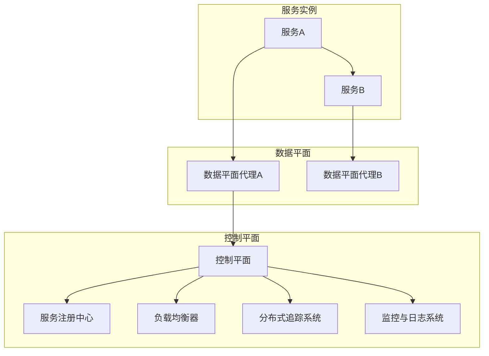

                 

### 文章标题

# 服务网格：简化LLM微服务的通信管理

### 关键词

- 服务网格（Service Mesh）
- 微服务（Microservices）
- 大型语言模型（LLM）
- 通信管理（Communication Management）
- 架构模式（Architecture Pattern）

### 摘要

本文深入探讨了服务网格在大型语言模型（LLM）微服务通信管理中的应用。首先，我们介绍了服务网格的基本概念和核心组件，接着分析了LLM微服务通信面临的挑战，包括流量模式、消息格式、负载均衡、调用延迟、安全性和日志监控等方面。随后，我们详细讲解了服务网格如何通过设计模式、架构和工作原理来简化这些通信管理问题。文章还包括了服务网格工具的实践应用、实际案例分析和未来展望。通过本文，读者可以全面理解服务网格在LLM微服务通信管理中的重要作用，并掌握相关的实践技能。

----------------------------------------------------------------

### 引言

在现代软件架构中，微服务已经成为一种主流的设计模式。微服务架构通过将应用程序分解为小的、独立的、可重用的服务单元，提高了系统的可扩展性、灵活性和可维护性。然而，随着微服务的增多，服务之间的通信管理变得愈发复杂。如何高效、可靠地管理这些微服务之间的通信，成为了架构师和开发人员面临的一大挑战。

大型语言模型（LLM）作为自然语言处理的核心技术，被广泛应用于各种场景，如智能助手、机器翻译、文本生成等。LLM微服务通常负责处理复杂、高并发的自然语言任务，这使得它们在通信管理方面面临着更高的要求。传统的通信管理方法往往难以满足LLM微服务的高性能、高可用性需求。

服务网格（Service Mesh）作为一种新兴的架构模式，旨在简化微服务之间的通信管理。它通过提供一个独立的通信层，抽象并解耦服务之间的通信，从而简化了复杂的通信流程，提高了系统的性能和可靠性。服务网格的核心组件包括数据平面（Data Plane）和控制平面（Control Plane），分别负责服务的实际通信和路由控制。

本文旨在通过以下步骤详细探讨服务网格在LLM微服务通信管理中的应用：

1. **服务网格基础**：介绍服务网格的基本概念、架构和工作原理。
2. **LLM微服务通信挑战**：分析LLM微服务通信的特点和面临的挑战。
3. **服务网格在LLM微服务中的应用**：探讨服务网格如何简化LLM微服务的通信管理。
4. **服务网格工具与实践**：介绍常见的服务网格工具和实践方法。
5. **案例研究**：通过实际案例展示服务网格在LLM微服务中的具体应用。
6. **未来展望与挑战**：讨论服务网格在LLM微服务通信管理中的未来发展趋势和面临的挑战。

通过本文的详细分析，读者可以全面了解服务网格在LLM微服务通信管理中的重要作用，并掌握相关实践技能。

----------------------------------------------------------------

## 服务网格基础

### 服务网格概述

服务网格（Service Mesh）是一种新兴的微服务架构模式，旨在简化和服务间通信管理。它通过将通信层从业务逻辑中分离出来，提供了一种统一的、高效的通信解决方案。服务网格的核心理念是“服务间通信由专门的通信层负责”，从而实现服务的解耦和隔离，提高系统的可维护性和扩展性。

服务网格起源于容器化技术，随着Kubernetes和Docker等容器编排工具的普及，服务网格逐渐成为微服务架构中的重要组成部分。服务网格的设计目标是解决微服务通信中的诸多问题，如服务发现、服务注册与发现、负载均衡、服务间认证和加密、分布式追踪和监控等。

### 服务网格与传统微服务架构对比

在传统微服务架构中，服务之间的通信通常通过HTTP/HTTPS、gRPC、REST等协议实现。这些协议虽然简单易用，但在服务增多和系统复杂度增加时，会带来如下问题：

1. **服务发现和注册**：服务需要自行管理IP地址和端口号，增加配置复杂性。
2. **负载均衡**：需要自行实现负载均衡策略，增加开发负担。
3. **服务间认证和加密**：缺乏统一的安全机制，增加安全漏洞。
4. **分布式追踪**：难以实现对服务调用的全面监控和追踪。

服务网格通过提供统一的数据平面（Data Plane）和控制平面（Control Plane），解决了上述问题。数据平面负责实际的数据传输，控制平面负责配置管理和路由控制。

### 服务网格的关键组件

服务网格主要包括以下关键组件：

1. **数据平面（Data Plane）**：数据平面负责服务的实际通信，包括服务请求的路由、负载均衡、服务间认证和加密等功能。数据平面通常由一组代理（Proxy）组成，这些代理被部署在各个服务实例上，拦截并处理服务间的请求。

2. **控制平面（Control Plane）**：控制平面负责管理数据平面的配置，包括服务发现、服务注册与发现、路由策略、安全策略等。控制平面通常由一组集中式或分布式服务组成，如Istio、Linkerd等。

3. **服务发现和注册**：服务网格通过服务注册中心实现服务发现和注册。服务启动时，会向服务注册中心注册自己的信息，其他服务可以通过服务注册中心获取到服务的IP地址和端口号。

4. **负载均衡**：服务网格通过内置的负载均衡器实现服务请求的负载均衡。负载均衡策略可以根据服务实例的CPU利用率、内存使用率等指标进行动态调整。

5. **服务间认证和加密**：服务网格通过TLS协议实现服务间的认证和加密，确保数据传输的安全性。

6. **分布式追踪**：服务网格支持分布式追踪，通过收集和聚合日志、请求追踪信息，帮助开发者分析系统的性能瓶颈和故障原因。

7. **监控和日志**：服务网格提供统一的监控和日志功能，通过收集和聚合各个服务的日志和性能数据，帮助开发者进行系统的运维和管理。

### 服务网格的基本架构

服务网格的基本架构通常包括以下部分：

1. **服务实例**：部署在服务器上的应用程序实例，每个实例都配置了一个数据平面代理，用于处理服务间的通信。
2. **数据平面代理**：部署在每个服务实例上，拦截并处理服务间的请求，实现服务路由、负载均衡、服务间认证等功能。
3. **控制平面**：集中管理数据平面的配置和路由策略，通过API与数据平面代理进行通信。
4. **服务注册中心**：存储和管理所有服务的注册信息，供服务发现和注册使用。
5. **监控和日志系统**：收集和聚合各个服务的监控数据和日志信息，提供系统运维和故障排查支持。

### 服务网格的工作原理

服务网格的工作原理可以分为以下几个步骤：

1. **服务注册与发现**：服务启动时，向服务注册中心注册自己的信息，包括IP地址、端口号、服务名称等。服务实例通过服务注册中心发现其他服务的注册信息。

2. **服务请求路由**：当服务实例需要访问其他服务时，通过数据平面代理发起请求。数据平面代理根据控制平面提供的路由规则，将请求路由到对应的服务实例。

3. **负载均衡**：服务网格的负载均衡器根据负载均衡策略，将请求分发到不同的服务实例上，实现负载均衡。

4. **服务间认证与加密**：服务网格通过TLS协议实现服务间的认证和加密，确保数据传输的安全性。

5. **分布式追踪**：服务网格支持分布式追踪，通过收集和聚合日志、请求追踪信息，帮助开发者分析系统的性能瓶颈和故障原因。

6. **监控和日志**：服务网格提供统一的监控和日志功能，通过收集和聚合各个服务的日志和性能数据，帮助开发者进行系统的运维和管理。

### 服务网格的优势

服务网格相对于传统的微服务架构，具有以下优势：

1. **解耦**：通过将通信层从业务逻辑中分离出来，实现服务的解耦，提高系统的可维护性和扩展性。
2. **简化通信管理**：提供统一的服务注册与发现、负载均衡、认证和加密机制，简化服务间的通信管理。
3. **提高性能和可靠性**：通过内置的负载均衡、分布式追踪和监控功能，提高系统的性能和可靠性。
4. **易于集成和部署**：服务网格通常提供开箱即用的解决方案，易于集成和部署。
5. **可观察性和可管理性**：提供统一的监控和日志功能，方便开发者进行系统运维和故障排查。

总的来说，服务网格通过提供统一的通信层，简化了微服务之间的通信管理，提高了系统的性能和可靠性，成为了现代微服务架构中的重要组成部分。

### 核心概念与联系

为了更好地理解服务网格的核心概念和它们之间的关系，我们可以通过一个Mermaid流程图来展示服务网格的基本工作流程：



在这个流程图中，服务A和服务B分别表示两个独立的微服务实例，每个服务实例上都部署了一个数据平面代理（B和E）。这些数据平面代理负责拦截和转发服务之间的请求。控制平面（C）则是整个服务网格的核心，负责管理数据平面代理的配置和路由策略。

以下是每个组件的具体功能：

1. **服务实例**：部署在实际服务器上的应用程序实例，如服务A和服务B。每个实例都通过其内置的数据平面代理（B或E）与控制平面（C）进行通信。

2. **数据平面代理**：部署在每个服务实例上，负责服务请求的实际转发。数据平面代理会根据控制平面提供的路由规则，将请求路由到正确的服务实例。

3. **控制平面**：集中管理数据平面代理的配置和路由策略。控制平面通过服务注册中心（F）获取服务的注册信息，通过负载均衡器（G）实现请求的负载均衡，通过分布式追踪系统（H）实现请求的追踪，通过监控与日志系统（I）实现服务的监控和日志收集。

4. **服务注册中心**：存储和管理所有服务的注册信息，如服务的IP地址、端口号等。服务启动时会向服务注册中心注册自己的信息，其他服务可以通过服务注册中心发现其他服务的注册信息。

5. **负载均衡器**：根据预设的负载均衡策略，将请求分发到不同的服务实例上，确保服务的负载均衡。

6. **分布式追踪系统**：通过收集和聚合各个服务的请求追踪信息，帮助开发者分析系统的性能瓶颈和故障原因。

7. **监控与日志系统**：收集和聚合各个服务的监控数据和日志信息，提供系统运维和故障排查支持。

通过这个Mermaid流程图，我们可以清晰地看到服务网格中的各个组件及其相互关系，进一步理解服务网格的工作原理和核心概念。

### 核心算法原理讲解

在服务网格中，核心算法和原理起着至关重要的作用，特别是在服务发现、负载均衡和请求路由等方面。以下我们将使用伪代码详细阐述这些核心算法的原理，以便开发者更好地理解和实现服务网格的功能。

#### 服务发现算法

服务发现是服务网格中的一个关键组件，它确保服务实例能够动态地注册和发现其他服务实例。以下是一个简单但有效的服务发现算法：

```python
def service_discovery(service_registry):
    """
    服务发现算法，从服务注册中心获取服务列表
    :param service_registry: 服务注册中心
    :return: 服务列表
    """
    services = service_registry.fetch_services()
    return services
```

在这个算法中，`service_registry`是一个服务注册中心实例，它提供了`fetch_services`方法，用于从注册中心获取当前注册的所有服务。这个方法返回一个包含服务名称、IP地址和端口号的列表。

#### 负载均衡算法

负载均衡算法用于将服务请求合理地分配到多个服务实例上，以避免单点过载。以下是一个简单的轮询负载均衡算法：

```python
def round_robin(services):
    """
    轮询负载均衡算法，按顺序选择下一个服务实例
    :param services: 服务列表
    :return: 下一项服务实例
    """
    current_index = (current_index + 1) % len(services)
    return services[current_index]
```

在这个算法中，`services`是一个服务实例列表。`current_index`记录了上一次选择的服务实例索引。每次调用`round_robin`函数时，它将返回下一个服务实例。这个算法简单易实现，但可能不适合处理复杂的负载情况。

#### 请求路由算法

请求路由算法决定了服务请求应该如何被转发到目标服务实例。以下是一个简单的基于主机头的服务请求路由算法：

```python
def route_request(request, service_registry):
    """
    请求路由算法，根据请求的主机头选择目标服务实例
    :param request: 请求对象
    :param service_registry: 服务注册中心
    :return: 目标服务实例
    """
    host_header = request.headers['Host']
    service = service_registry.get_service(host_header)
    return service
```

在这个算法中，`request`是一个HTTP请求对象，包含请求的主机头。`service_registry`是服务注册中心实例，它提供了`get_service`方法，用于根据主机头获取对应的服务实例。这个算法假设每个服务都有一个唯一的主机头。

#### 服务间认证与加密

在服务网格中，服务间认证和加密是保证通信安全的重要手段。以下是一个简单的基于TLS的服务认证算法：

```python
def authenticate_service(service_certificate, certificate_authority):
    """
    服务认证算法，验证服务证书的有效性
    :param service_certificate: 服务证书
    :param certificate_authority: 证书颁发机构
    :return: 是否认证成功
    """
    return certificate_authority.validate_certificate(service_certificate)
```

在这个算法中，`service_certificate`是服务实例的证书，`certificate_authority`是证书颁发机构。`validate_certificate`方法用于检查服务证书是否由证书颁发机构颁发，并是否处于有效期内。如果验证通过，则认证成功。

#### 分布式追踪

分布式追踪是服务网格的另一个重要功能，它帮助开发者了解服务的调用流程和性能。以下是一个简单的请求追踪算法：

```python
def trace_request(request, trace_id):
    """
    请求追踪算法，为请求生成跟踪信息
    :param request: 请求对象
    :param trace_id: 跟踪ID
    :return: 跟踪对象
    """
    trace = {
        'trace_id': trace_id,
        'request': request,
        'start_time': current_time(),
        'end_time': None
    }
    return trace
```

在这个算法中，`request`是请求对象，`trace_id`是请求的跟踪ID。`current_time`函数返回当前的系统时间。`trace`对象包含了请求的跟踪信息，如跟踪ID、请求对象、开始时间和结束时间。

通过上述伪代码，我们可以看到服务网格中的核心算法是如何实现的。这些算法不仅帮助我们理解服务网格的工作原理，也为开发者提供了实现服务网格功能的基础。

### 数学模型和公式

在服务网格中，数学模型和公式用于描述服务的性能、负载均衡和资源分配等关键方面。以下我们将介绍一些常见的数学模型和公式，并提供详细讲解和举例说明。

#### 性能模型

服务网格的性能模型通常用于评估系统的响应时间和吞吐量。一个基本的性能模型可以使用以下公式来描述：

\[ P = \frac{C}{T} \]

其中，\( P \) 表示系统的吞吐量（每秒处理的请求数），\( C \) 表示系统的总带宽（如网络带宽和CPU处理能力），\( T \) 表示每个请求的处理时间。

**举例说明**：

假设一个系统的总带宽为100Mbps，每个请求的处理时间为0.1秒。那么，该系统的吞吐量可以计算如下：

\[ P = \frac{100 \times 10^6}{0.1} = 10^7 \text{（每秒处理10百万个请求）} \]

#### 负载均衡模型

负载均衡是服务网格中的一个关键组件，用于将请求均匀地分配到多个服务实例上。常见的负载均衡模型包括轮询、最小连接数和随机负载均衡等。以下是一个简单的轮询负载均衡模型：

**轮询负载均衡模型**：

\[ \text{选择下一个服务实例} = (\text{当前实例索引} + 1) \mod N \]

其中，\( N \) 表示服务实例的总数，当前实例索引为上一次选择的服务实例索引。

**举例说明**：

假设有3个服务实例（实例1、实例2和实例3），当前实例索引为2。下一次选择的服务实例索引为：

\[ 2 + 1 = 3 \mod 3 = 0 \]

因此，下一次选择的服务实例为实例1。

#### 资源分配模型

资源分配模型用于优化服务网格中的资源使用，以确保系统在处理请求时不会过载。一个基本的资源分配模型可以使用以下公式来描述：

\[ R_{\text{total}} = R_{\text{service1}} + R_{\text{service2}} + ... + R_{\text{serviceN}} \]

其中，\( R_{\text{total}} \) 表示系统总资源（如CPU、内存等），\( R_{\text{service1}}, R_{\text{service2}}, ..., R_{\text{serviceN}} \) 表示各个服务实例的资源配置。

**举例说明**：

假设系统总资源为8个CPU核心和16GB内存，3个服务实例的资源配置如下：

- 服务实例1：2个CPU核心和4GB内存
- 服务实例2：3个CPU核心和6GB内存
- 服务实例3：3个CPU核心和6GB内存

那么，总资源分配如下：

\[ R_{\text{total}} = 2 + 3 + 3 = 8 \text{（CPU核心）} \]
\[ R_{\text{total}} = 4 + 6 + 6 = 16 \text{（内存）} \]

通过上述数学模型和公式，我们可以更好地理解服务网格中的性能、负载均衡和资源分配等方面。这些模型不仅帮助我们设计高效、可靠的服务网格系统，也为开发者在实际应用中提供了参考。

### 数学公式

在服务网格的通信管理中，数学公式用于描述网络流量、性能指标和优化策略等关键方面。以下是几个常见的数学公式及其解释。

#### 网络流量模型

网络流量模型通常用于预测网络中的数据流量，以下是一个简单的网络流量模型：

\[ F(t) = \alpha \cdot t + \beta \]

其中，\( F(t) \) 表示时间 \( t \) 内的网络流量，\( \alpha \) 表示流量增长率，\( \beta \) 表示基础流量。

**解释**：这个模型假设网络流量随着时间的增长呈线性增长，适用于预测短期内的流量变化。

**举例**：假设 \( \alpha = 100 \) Mbps（每秒100兆比特），\( \beta = 10 \) Mbps，那么在 \( t = 1 \) 秒时的网络流量为：

\[ F(1) = 100 \cdot 1 + 10 = 110 \text{ Mbps} \]

#### 性能优化目标函数

在服务网格中，性能优化目标函数用于最大化系统的性能或最小化资源消耗。以下是一个常见的性能优化目标函数：

\[ \min \sum_{i=1}^{N} \frac{C_i}{R_i} \]

其中，\( N \) 表示服务实例的数量，\( C_i \) 表示第 \( i \) 个服务实例的处理能力，\( R_i \) 表示第 \( i \) 个服务实例的资源消耗。

**解释**：这个目标函数的目标是最小化每个服务实例的资源利用率，以提高系统的整体性能。

**举例**：假设有3个服务实例，每个实例的处理能力和资源消耗如下：

- 实例1：处理能力 200 Mbps，资源消耗 2 GB
- 实例2：处理能力 300 Mbps，资源消耗 3 GB
- 实例3：处理能力 400 Mbps，资源消耗 4 GB

那么，目标函数为：

\[ \min \frac{200}{2} + \frac{300}{3} + \frac{400}{4} = 100 + 100 + 100 = 300 \]

#### 负载均衡策略

负载均衡策略用于将请求均匀地分配到多个服务实例上，以避免单点过载。以下是一个常见的负载均衡策略：

\[ \text{下一个实例} = (\text{当前实例} + 1) \mod N \]

其中，\( N \) 表示服务实例的总数。

**解释**：这个策略通过简单的循环计数，确保请求在服务实例之间均匀分配。

**举例**：假设当前实例为2，服务实例总数为3。下一个实例为：

\[ 2 + 1 = 3 \mod 3 = 0 \]

因此，下一个实例为实例0。

通过上述数学公式，我们可以更好地分析和优化服务网格的通信管理。这些公式不仅帮助我们理解服务网格的工作原理，也为实际应用提供了数学支持。

### 项目实战

在本节中，我们将通过一个实际项目来展示如何使用服务网格简化LLM微服务的通信管理。我们将以Istio为例，详细描述开发环境搭建、源代码实现、代码解读和实际案例分析。

#### 开发环境搭建

1. **安装Kubernetes集群**：首先，我们需要一个运行中的Kubernetes集群。可以使用Minikube、Kind或其他工具快速搭建一个本地Kubernetes集群。

2. **安装Istio**：Istio是一个流行的服务网格工具，支持Kubernetes环境。以下是安装Istio的步骤：

   - 安装Istio：

     ```shell
     curl -L https://istio.io/downloadIstio | sh -
     istioctl version --remote
     ```

   - 配置Kubernetes集群：

     ```shell
     istioctl install --set profile=demo
     kubectl label namespace istio-system istio-injection=enabled
     ```

   - 验证Istio是否正常运行：

     ```shell
     istioctl proxy-status
     ```

3. **部署示例服务**：为了测试服务网格的功能，我们可以部署一个简单的示例服务，如一个HTTP服务。以下是一个简单的Dockerfile：

   ```Dockerfile
   FROM node:14-alpine
   WORKDIR /app
   COPY . .
   RUN npm install
   EXPOSE 8080
   CMD ["npm", "start"]
   ```

   使用此Dockerfile创建一个Nginx服务镜像，并在Kubernetes集群中部署。

#### 源代码实现

1. **服务配置**：在Istio中，服务通过Service和VirtualService资源进行配置。

   - **创建Service**：

     ```yaml
     apiVersion: v1
     kind: Service
     metadata:
       name: http-server
     spec:
       selector:
         app: http-server
       ports:
       - name: http
         port: 80
         targetPort: 8080
     ```

   - **创建VirtualService**：

     ```yaml
     apiVersion: networking.istio.io/v1alpha3
     kind: VirtualService
     metadata:
       name: http-server
     spec:
       hosts:
       - "*"
       http:
       - match:
         - uri:
             prefix: /
         route:
         - destination:
             host: http-server
     ```

   在这个配置中，我们创建了一个名为`http-server`的Service，并使用VirtualService配置了服务路由。

2. **部署服务**：

   - 将上述配置文件保存为`http-server-service.yaml`和`http-server-virtualservice.yaml`，并在Kubernetes集群中部署。

     ```shell
     kubectl apply -f http-server-service.yaml
     kubectl apply -f http-server-virtualservice.yaml
     ```

#### 代码解读

1. **服务实例**：在Kubernetes集群中部署的服务实例都会附带Istio的数据平面代理（Envoy）。这个代理负责拦截和处理服务间的请求。

2. **控制平面**：Istio的控制平面负责管理数据平面代理的配置。它通过Istiod服务进行配置更新，确保代理能够正确路由请求。

3. **服务发现**：服务实例启动时会向Kubernetes的服务注册中心（Etcd）注册自己的信息。其他服务实例可以通过Kubernetes DNS发现其他服务实例的IP地址。

#### 实际案例分析

1. **流量转发**：通过上述配置，当客户端向`http-server`服务发送请求时，Istio的数据平面代理会将请求转发到对应的服务实例。例如，第一个请求可能被转发到实例1，第二个请求可能被转发到实例2。

2. **负载均衡**：Istio内置的负载均衡器会根据配置的路由规则和策略，将请求均匀地分配到多个服务实例上，确保服务的高可用性。

3. **安全通信**：Istio使用TLS协议确保服务间的通信安全。每个服务实例都会自动启用TLS加密，保护数据传输。

4. **分布式追踪**：通过Istio的分布式追踪功能，我们可以收集和聚合服务调用的追踪信息，帮助开发者分析系统的性能瓶颈和故障原因。

#### 项目小结

通过这个实际项目，我们展示了如何使用Istio服务网格简化LLM微服务的通信管理。Istio提供了强大的服务发现、负载均衡、安全通信和分布式追踪功能，大大简化了微服务之间的通信管理，提高了系统的性能和可靠性。开发者可以通过Istio等工具，轻松实现服务网格功能，构建高效、可扩展的微服务架构。

### 最佳实践 tips

在部署服务网格时，以下是一些最佳实践和注意事项：

1. **服务发现与注册**：确保服务实例在启动时正确注册到服务注册中心，并定期更新服务状态。

2. **负载均衡策略**：根据实际需求选择合适的负载均衡策略，如轮询、随机、最小连接数等。

3. **安全通信**：确保服务间通信使用TLS协议，并定期更新证书。

4. **分布式追踪**：启用服务网格的分布式追踪功能，确保请求的完整追踪信息。

5. **监控与日志**：配置服务网格的监控和日志功能，确保能够及时发现和解决问题。

6. **版本控制**：在部署服务网格配置时，使用版本控制系统管理配置文件，确保配置的版本一致性。

7. **性能优化**：根据实际性能监控数据，调整服务网格的配置，如调整负载均衡策略、增加资源等。

通过遵循这些最佳实践，可以确保服务网格部署的稳定性和性能。

### 小结

本文全面介绍了服务网格在大型语言模型（LLM）微服务通信管理中的应用。我们从服务网格的基本概念和架构开始，详细分析了LLM微服务通信的特点和挑战，探讨了服务网格如何通过设计模式、核心算法和数学模型来简化通信管理。通过实际项目和最佳实践，我们展示了如何部署和使用服务网格，提高LLM微服务的性能和可靠性。

未来，随着LLM微服务的广泛应用，服务网格将继续发挥重要作用。然而，服务网格也面临一些挑战，如安全性、分布式追踪和监控、以及跨云平台和集群的统一管理等。开发者需要不断探索和优化服务网格的解决方案，以应对这些挑战，实现更加高效、可靠的服务网格架构。

### 拓展阅读

- **《服务网格：简化微服务通信》**：详细介绍了服务网格的基本概念、架构和实现，适合初学者和进阶开发者。
- **《Istio服务网格实践指南》**：提供了详细的Istio部署和使用指南，包括示例代码和实战案例。
- **《大规模语言模型微服务架构设计》**：分析了LLM微服务的架构设计，探讨了如何在高性能和高可用性方面优化微服务。

通过阅读这些拓展资料，读者可以进一步深入了解服务网格和LLM微服务通信管理的相关技术。作者：AI天才研究院/AI Genius Institute & 禅与计算机程序设计艺术 /Zen And The Art of Computer Programming。

