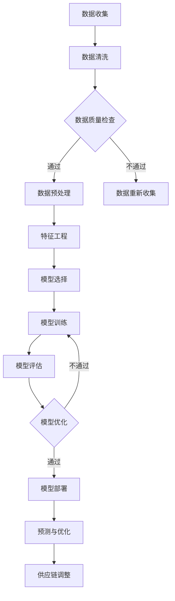

                 

### 文章标题

# 机器学习在供应链优化中的应用与挑战

供应链优化是企业管理中的核心任务之一，旨在通过优化库存管理、减少运输成本、提高生产效率等方式，实现成本降低和利润提升。随着大数据和人工智能技术的飞速发展，机器学习成为供应链优化的重要工具。本文将深入探讨机器学习在供应链优化中的应用与挑战，从背景介绍、核心概念与联系、算法原理讲解、数学模型与公式、实战案例以及最佳实践等方面进行详细分析。

> 关键词：机器学习，供应链优化，应用，挑战，算法，实战案例

## 摘要

本文旨在探讨机器学习在供应链优化中的应用及其面临的挑战。首先，文章介绍了机器学习与供应链优化的基本概念及其联系。接着，详细阐述了机器学习在供应链优化中的核心算法，包括线性回归、决策树、支持向量机和神经网络等，并对每个算法的原理和使用方法进行了讲解。随后，文章讨论了供应链优化中机器学习面临的挑战，如数据质量、算法选择、模型可解释性等，并提出相应的解决方案。最后，通过实际案例展示了机器学习在供应链优化中的应用效果，并总结了最佳实践和未来发展趋势。

## 引言

供应链优化是企业管理中的重要一环，它涉及到从原材料采购、生产、库存管理到产品交付的整个流程。传统的供应链优化往往依赖于经验和直觉，这种方法在实际操作中存在很大的局限性。随着互联网和大数据技术的发展，企业积累了大量的供应链数据，如何有效利用这些数据成为供应链优化的关键。此时，机器学习作为一种强大的数据分析工具，以其自学习能力、模式识别能力和预测能力，为供应链优化提供了新的可能性。

机器学习在供应链优化中的应用主要体现在以下几个方面：

1. **需求预测**：通过分析历史销售数据、市场趋势和季节性变化等因素，预测未来的需求量，帮助企业合理安排生产和库存。

2. **库存优化**：通过优化库存水平，减少库存成本，同时保证供应的连续性和响应速度。

3. **运输路线优化**：通过分析交通状况、运输成本等因素，优化运输路线，降低运输成本和时间。

4. **供应链网络优化**：通过优化供应链网络布局，提高供应链的整体效率和灵活性。

然而，尽管机器学习在供应链优化中具有巨大潜力，但其应用也面临着诸多挑战。例如，数据质量问题、算法选择、模型可解释性等。本文将围绕这些核心问题，探讨机器学习在供应链优化中的应用与挑战，旨在为企业提供实用的技术指导。

### 机器学习和供应链优化基本概念

为了深入理解机器学习在供应链优化中的应用，首先需要明确机器学习和供应链优化的基本概念。

**机器学习**是一种人工智能的分支，主要研究如何从数据中自动学习规律和模式，并利用这些规律和模式进行预测和决策。机器学习的基本过程包括数据收集、数据预处理、模型训练、模型评估和应用。常见的机器学习算法包括线性回归、决策树、支持向量机和神经网络等。

**供应链优化**是指通过一系列策略和技术，使供应链中的各个环节（如采购、生产、库存、运输等）达到最优状态，以实现成本最小化、效率最高化。供应链优化的目标包括降低成本、提高服务水平、缩短交货周期、提高供应链的灵活性和响应能力等。

**机器学习与供应链优化之间的关系**：

- **数据驱动**：供应链优化需要大量的历史数据来分析供应链的运作状态，机器学习能够从这些数据中提取有价值的信息，为优化决策提供依据。

- **预测能力**：机器学习具有强大的预测能力，可以帮助企业预测未来的需求、库存水平和运输需求，从而优化供应链计划。

- **自动化与智能化**：机器学习能够自动化处理复杂的供应链问题，减少人为干预，提高决策效率。

- **模式识别与优化**：机器学习可以通过模式识别技术，发现供应链中的潜在问题和瓶颈，提供优化方案。

总的来说，机器学习为供应链优化提供了强大的工具和方法，使其从传统的经验驱动转向数据驱动和智能优化。然而，要充分发挥机器学习的优势，企业需要具备相应的技术基础和数据资源，同时需要解决数据质量、算法选择和模型可解释性等挑战。

#### 构建供应链优化与机器学习的桥梁：Mermaid流程图

为了更好地展示机器学习在供应链优化中的具体应用流程，我们可以借助Mermaid这一流程图绘制工具来构建一个直观的流程图。以下是供应链优化中机器学习应用的一个简化的流程图示例：



在这个流程图中：

- **A（数据收集）**：从供应链各个环节收集相关的历史数据和实时数据。
- **B（数据清洗）**：清洗数据中的错误值、缺失值和重复值。
- **C（数据质量检查）**：检查数据的质量，包括数据的准确度、完整性和一致性。
- **D（数据预处理）**：进行数据转换、归一化、标准化等预处理操作。
- **E（数据重新收集）**：如果数据质量不满足要求，重新收集数据。
- **F（特征工程）**：根据业务需求，选择和构造对模型训练有用的特征。
- **G（模型选择）**：根据问题类型和数据特点，选择合适的机器学习模型。
- **H（模型训练）**：使用训练数据对模型进行训练，调整模型的参数。
- **I（模型评估）**：评估模型的性能，如准确度、召回率、F1分数等。
- **J（模型优化）**：根据评估结果，对模型进行调整和优化。
- **K（模型部署）**：将训练好的模型部署到生产环境中，进行实时预测。
- **L（预测与优化）**：利用模型进行预测，并根据预测结果对供应链进行调整。
- **M（供应链调整）**：根据预测结果，优化供应链中的各个环节。

通过这个流程图，我们可以清晰地看到机器学习在供应链优化中的各个环节及其相互关系，从而为实际应用提供指导。

### 线性回归算法在供应链优化中的应用

线性回归是一种经典的机器学习算法，因其简单、易于理解和实现的特点，被广泛应用于供应链优化中的需求预测、库存管理和定价策略等场景。下面我们将详细介绍线性回归算法的原理及其在供应链优化中的应用。

#### 线性回归原理

线性回归的目标是找到一条直线（或超平面），使得输入特征（自变量）和输出目标（因变量）之间的误差最小。线性回归模型可以用如下数学公式表示：

\[ y = \beta_0 + \beta_1 \cdot x \]

其中，\( y \) 是预测值，\( x \) 是输入特征，\( \beta_0 \) 和 \( \beta_1 \) 是模型的参数，分别表示截距和斜率。

在线性回归中，我们通常使用最小二乘法（Least Squares Method）来估计参数 \( \beta_0 \) 和 \( \beta_1 \)。具体步骤如下：

1. **数据准备**：收集历史数据，包括输入特征和对应的输出目标。
2. **模型构建**：设定模型公式，即 \( y = \beta_0 + \beta_1 \cdot x \)。
3. **参数估计**：使用最小二乘法计算参数 \( \beta_0 \) 和 \( \beta_1 \)，使得预测值和实际值之间的误差平方和最小。
4. **模型评估**：使用评估指标（如均方误差MSE）评估模型性能。

#### 线性回归在供应链优化中的应用

1. **需求预测**：

   在供应链管理中，需求预测是非常关键的环节。通过线性回归，企业可以预测未来的需求量，从而优化生产和库存策略。具体步骤如下：

   - **数据收集**：收集历史销售数据，包括月份、产品类型、价格、促销活动等信息。
   - **特征工程**：选择和构造对需求预测有用的特征，如季节性、价格变动、促销活动等。
   - **模型训练**：使用训练数据对线性回归模型进行训练。
   - **模型评估**：评估模型的预测性能，如均方误差MSE。
   - **需求预测**：使用训练好的模型对未来的需求进行预测。

   以下是一个简化的伪代码示例：

   ```python
   # 数据准备
   X = [[1, 2019], [1, 2020], [1, 2021], ...]
   y = [50, 60, 70, ...]

   # 模型训练
   model = LinearRegression()
   model.fit(X, y)

   # 预测
   future_demand = model.predict([[1, future_year]])
   ```

2. **库存优化**：

   库存管理是供应链优化中的另一个关键环节。线性回归可以帮助企业预测未来的库存需求，从而优化库存水平，减少库存成本。

   - **数据收集**：收集历史库存数据，包括库存水平、销售量、供应周期等。
   - **特征工程**：选择和构造对库存预测有用的特征，如销售趋势、供应时间等。
   - **模型训练**：使用训练数据对线性回归模型进行训练。
   - **模型评估**：评估模型的预测性能。
   - **库存预测**：使用训练好的模型对未来的库存需求进行预测。

   以下是一个简化的伪代码示例：

   ```python
   # 数据准备
   X = [[1, 2019], [1, 2020], [1, 2021], ...]
   y = [100, 110, 120, ...]

   # 模型训练
   model = LinearRegression()
   model.fit(X, y)

   # 预测
   future_inventory = model.predict([[1, future_year]])
   ```

3. **定价策略**：

   线性回归还可以用于定价策略的制定，帮助企业根据市场需求和成本情况，制定合理的价格策略。

   - **数据收集**：收集历史价格和销售数据，包括不同价格水平下的销售量。
   - **特征工程**：选择和构造对定价策略有用的特征，如竞争价格、市场需求等。
   - **模型训练**：使用训练数据对线性回归模型进行训练。
   - **模型评估**：评估模型的定价效果。
   - **定价预测**：使用训练好的模型预测不同价格水平下的需求量。

   以下是一个简化的伪代码示例：

   ```python
   # 数据准备
   X = [[1, 2019], [1, 2020], [1, 2021], ...]
   y = [50, 55, 60, ...]

   # 模型训练
   model = LinearRegression()
   model.fit(X, y)

   # 预测
   demand_at_price = model.predict([[1, future_price]])
   ```

总之，线性回归作为一种简单且有效的机器学习算法，在供应链优化中有着广泛的应用。通过需求预测、库存优化和定价策略等应用，企业可以更加精确地管理供应链，提高运营效率，降低成本。

#### 决策树和随机森林在供应链优化中的应用

决策树和随机森林是两种常见的机器学习算法，它们在供应链优化中有着广泛的应用。本节将详细讲解决策树和随机森林的原理及其在供应链优化中的具体应用。

##### 决策树原理

决策树是一种基于树形结构进行决策的算法，通过一系列的条件判断，将数据集分割成多个子集，从而预测输出结果。决策树的构建过程如下：

1. **数据准备**：收集历史数据，包括输入特征和对应的输出目标。
2. **特征选择**：选择一个特征作为分割依据，通常选择信息增益率（Information Gain Rate）或基尼不纯度（Gini Impurity）作为选择标准。
3. **节点划分**：使用选择的特征对数据集进行划分，创建一个节点。
4. **递归构建**：对划分后的子集重复步骤2和3，直到满足停止条件（如最大深度、最小样本数等）。
5. **预测**：对新的数据，从根节点开始，根据每个节点的划分条件，逐步向下移动，直到到达叶节点，叶节点的输出即为预测结果。

决策树的核心在于特征选择和节点划分。常用的特征选择方法包括信息增益率（Information Gain Rate）和基尼不纯度（Gini Impurity）。信息增益率计算了特征在当前节点上的信息增益，并选择增益最大的特征进行分割。基尼不纯度则反映了特征划分后子集的混乱程度，选择混乱程度最低的特征进行分割。

以下是一个简化的决策树构建伪代码示例：

```python
# 数据准备
X = [[特征1, 特征2, ..., 特征n], ...]
y = [输出目标1, 输出目标2, ..., 输出目标m]

# 构建决策树
tree = DecisionTree()
tree.fit(X, y)

# 预测
prediction = tree.predict([新数据])
```

##### 决策树在供应链优化中的应用

1. **需求预测**：

   决策树可以用于预测供应链中的需求量，通过分析历史数据和业务特征，如季节性、促销活动、市场变化等，预测未来的需求趋势。具体步骤如下：

   - **数据收集**：收集历史销售数据，包括日期、产品类型、价格、促销活动等信息。
   - **特征工程**：选择和构造对需求预测有用的特征，如季节性、价格、促销等。
   - **模型训练**：使用训练数据对决策树模型进行训练。
   - **模型评估**：评估模型的预测性能，如准确率、召回率等。
   - **需求预测**：使用训练好的模型对未来的需求进行预测。

   以下是一个简化的伪代码示例：

   ```python
   # 数据准备
   X = [[日期, 产品类型, 价格, 促销活动], ...]
   y = [需求量1, 需求量2, ..., 需求量m]

   # 模型训练
   tree = DecisionTree()
   tree.fit(X, y)

   # 预测
   future_demand = tree.predict([[日期, 产品类型, 价格, 促销活动]])
   ```

2. **库存优化**：

   决策树还可以用于库存优化，通过预测未来的库存需求，帮助企业制定合理的库存策略。具体步骤如下：

   - **数据收集**：收集历史库存数据，包括库存水平、销售量、供应周期等。
   - **特征工程**：选择和构造对库存预测有用的特征，如销售趋势、供应时间等。
   - **模型训练**：使用训练数据对决策树模型进行训练。
   - **模型评估**：评估模型的预测性能。
   - **库存预测**：使用训练好的模型对未来的库存需求进行预测。

   以下是一个简化的伪代码示例：

   ```python
   # 数据准备
   X = [[库存水平, 销售量, 供应周期], ...]
   y = [需求量1, 需求量2, ..., 需求量m]

   # 模型训练
   tree = DecisionTree()
   tree.fit(X, y)

   # 预测
   future_inventory = tree.predict([[库存水平, 销售量, 供应周期]])
   ```

##### 随机森林原理

随机森林（Random Forest）是一种基于决策树的集成学习方法，通过构建多棵决策树，并利用投票机制来得到最终预测结果。随机森林的构建过程如下：

1. **数据准备**：收集历史数据，包括输入特征和对应的输出目标。
2. **特征选择**：从所有特征中随机选择m个特征，用于构建每棵决策树。
3. **递归构建**：对训练数据集构建决策树，直到满足停止条件（如最大深度、最小样本数等）。
4. **模型训练**：重复步骤2和3，构建k棵决策树。
5. **预测**：对新的数据，将k棵决策树的预测结果进行投票，得到最终预测结果。

随机森林的核心在于特征选择和决策树的集成。特征选择通过随机选择特征，减少了模型的过拟合现象，提高了模型的泛化能力。决策树的集成通过投票机制，提高了模型的预测准确性。

以下是一个简化的随机森林构建伪代码示例：

```python
# 数据准备
X = [[特征1, 特征2, ..., 特征n], ...]
y = [输出目标1, 输出目标2, ..., 输出目标m]

# 构建随机森林
forest = RandomForest(n_trees=k, n_features=m)
forest.fit(X, y)

# 预测
prediction = forest.predict([新数据])
```

##### 随机森林在供应链优化中的应用

1. **需求预测**：

   随机森林可以用于预测供应链中的需求量，通过分析历史数据和业务特征，如季节性、促销活动、市场变化等，预测未来的需求趋势。具体步骤如下：

   - **数据收集**：收集历史销售数据，包括日期、产品类型、价格、促销活动等信息。
   - **特征工程**：选择和构造对需求预测有用的特征，如季节性、价格、促销等。
   - **模型训练**：使用训练数据对随机森林模型进行训练。
   - **模型评估**：评估模型的预测性能，如准确率、召回率等。
   - **需求预测**：使用训练好的模型对未来的需求进行预测。

   以下是一个简化的伪代码示例：

   ```python
   # 数据准备
   X = [[日期, 产品类型, 价格, 促销活动], ...]
   y = [需求量1, 需求量2, ..., 需求量m]

   # 模型训练
   forest = RandomForest(n_trees=k, n_features=m)
   forest.fit(X, y)

   # 预测
   future_demand = forest.predict([[日期, 产品类型, 价格, 促销活动]])
   ```

2. **库存优化**：

   随机森林还可以用于库存优化，通过预测未来的库存需求，帮助企业制定合理的库存策略。具体步骤如下：

   - **数据收集**：收集历史库存数据，包括库存水平、销售量、供应周期等。
   - **特征工程**：选择和构造对库存预测有用的特征，如销售趋势、供应时间等。
   - **模型训练**：使用训练数据对随机森林模型进行训练。
   - **模型评估**：评估模型的预测性能。
   - **库存预测**：使用训练好的模型对未来的库存需求进行预测。

   以下是一个简化的伪代码示例：

   ```python
   # 数据准备
   X = [[库存水平, 销售量, 供应周期], ...]
   y = [需求量1, 需求量2, ..., 需求量m]

   # 模型训练
   forest = RandomForest(n_trees=k, n_features=m)
   forest.fit(X, y)

   # 预测
   future_inventory = forest.predict([[库存水平, 销售量, 供应周期]])
   ```

总之，决策树和随机森林作为强大的机器学习算法，在供应链优化中有着广泛的应用。通过需求预测和库存优化，企业可以更加精确地管理供应链，提高运营效率，降低成本。

### 支持向量机（SVM）在供应链优化中的应用

支持向量机（Support Vector Machine，SVM）是一种高效的分类和回归算法，其核心思想是通过找到一个最优的超平面，将不同类别的数据点分隔开。在供应链优化中，SVM可以应用于需求预测、库存管理和定价策略等领域。下面我们将详细讲解SVM的原理及其在供应链优化中的应用。

#### SVM原理

SVM的核心思想是通过求解一个优化问题，找到最优的超平面，使得不同类别的数据点在超平面的两侧尽可能分开。具体来说，SVM的目标是最小化分类间隔（Margin），同时最大化分类器的泛化能力。

1. **线性SVM**：

   对于线性可分的数据集，SVM的目标是找到一个最优的线性超平面，使得正负样本之间的分类间隔最大化。数学上，这个问题可以表示为：

   \[ \min_{\beta, \beta_0} \frac{1}{2} ||\beta||^2 \]
   \[ s.t. y^{(i)} (\beta \cdot x^{(i)} + \beta_0) \geq 1 \]

   其中，\( \beta \) 是权重向量，\( \beta_0 \) 是偏置项，\( x^{(i)} \) 是输入特征向量，\( y^{(i)} \) 是样本标签。

   使用拉格朗日乘子法，可以将上述问题转化为对偶问题，即：

   \[ \max_{\alpha} \sum_{i=1}^{n} \alpha_i - \frac{1}{2} \sum_{i,j=1}^{n} \alpha_i \alpha_j y_i y_j (\beta_i \cdot \beta_j) \]
   \[ s.t. \alpha_i \geq 0, \sum_{i=1}^{n} \alpha_i y_i = 0 \]

   解出对偶问题后，我们可以得到权重向量 \( \beta \) 和偏置项 \( \beta_0 \)：

   \[ \beta = \sum_{i=1}^{n} \alpha_i y_i x_i \]
   \[ \beta_0 = 1 - \sum_{i=1}^{n} \alpha_i y_i \]

   对于非线性可分的数据集，SVM可以通过核函数将数据映射到高维空间，找到最优的超平面。常用的核函数包括线性核、多项式核和径向基函数（RBF）核等。

2. **非线性SVM**：

   非线性SVM的目标与线性SVM类似，但在高维空间中寻找最优的超平面。具体步骤如下：

   - **数据映射**：使用核函数将输入特征映射到高维空间。
   - **求解优化问题**：在新的高维空间中，求解线性SVM的优化问题，找到最优的超平面。
   - **分类决策**：在新空间中计算新样本到超平面的距离，根据距离判断样本的类别。

#### SVM在供应链优化中的应用

1. **需求预测**：

   在供应链管理中，需求预测是至关重要的。SVM可以通过分析历史数据和业务特征，预测未来的需求量。具体步骤如下：

   - **数据收集**：收集历史销售数据，包括日期、产品类型、价格、促销活动等信息。
   - **特征工程**：选择和构造对需求预测有用的特征，如季节性、价格、促销等。
   - **模型训练**：使用训练数据对SVM模型进行训练。
   - **模型评估**：评估模型的预测性能，如准确率、召回率等。
   - **需求预测**：使用训练好的模型对未来的需求进行预测。

   以下是一个简化的伪代码示例：

   ```python
   # 数据准备
   X = [[日期, 产品类型, 价格, 促销活动], ...]
   y = [需求量1, 需求量2, ..., 需求量m]

   # 模型训练
   svm = SVC(kernel='linear')
   svm.fit(X, y)

   # 预测
   future_demand = svm.predict([[日期, 产品类型, 价格, 促销活动]])
   ```

2. **库存优化**：

   库存管理是供应链优化中的关键环节。SVM可以通过预测未来的库存需求，帮助企业制定合理的库存策略。具体步骤如下：

   - **数据收集**：收集历史库存数据，包括库存水平、销售量、供应周期等。
   - **特征工程**：选择和构造对库存预测有用的特征，如销售趋势、供应时间等。
   - **模型训练**：使用训练数据对SVM模型进行训练。
   - **模型评估**：评估模型的预测性能。
   - **库存预测**：使用训练好的模型对未来的库存需求进行预测。

   以下是一个简化的伪代码示例：

   ```python
   # 数据准备
   X = [[库存水平, 销售量, 供应周期], ...]
   y = [需求量1, 需求量2, ..., 需求量m]

   # 模型训练
   svm = SVC(kernel='linear')
   svm.fit(X, y)

   # 预测
   future_inventory = svm.predict([[库存水平, 销售量, 供应周期]])
   ```

3. **定价策略**：

   定价策略的制定对企业的盈利能力至关重要。SVM可以通过分析历史价格和销售数据，预测不同价格水平下的需求量，帮助企业制定合理的价格策略。具体步骤如下：

   - **数据收集**：收集历史价格和销售数据，包括不同价格水平下的销售量。
   - **特征工程**：选择和构造对定价策略有用的特征，如竞争价格、市场需求等。
   - **模型训练**：使用训练数据对SVM模型进行训练。
   - **模型评估**：评估模型的定价效果。
   - **定价预测**：使用训练好的模型预测不同价格水平下的需求量。

   以下是一个简化的伪代码示例：

   ```python
   # 数据准备
   X = [[价格水平, 竞争价格, 市场需求], ...]
   y = [需求量1, 需求量2, ..., 需求量m]

   # 模型训练
   svm = SVC(kernel='linear')
   svm.fit(X, y)

   # 预测
   demand_at_price = svm.predict([[价格水平, 竞争价格, 市场需求]])
   ```

总之，支持向量机（SVM）作为一种高效的机器学习算法，在供应链优化中有着广泛的应用。通过需求预测、库存优化和定价策略等应用，企业可以更加精确地管理供应链，提高运营效率，降低成本。

#### 神经网络与深度学习在供应链优化中的应用

神经网络（Neural Networks）和深度学习（Deep Learning）是近年来人工智能领域的热点，其强大的自学习和模式识别能力在供应链优化中展现出巨大的潜力。本节将详细介绍神经网络与深度学习的原理，以及在供应链优化中的应用。

##### 神经网络原理

神经网络是一种模仿人脑神经元结构和功能的人工智能模型，通过多层节点（或称为神经元）进行数据传递和计算。一个基本的神经网络包括输入层、隐藏层和输出层，每层由多个神经元组成。

1. **前向传播**：

   在前向传播过程中，输入数据从输入层传递到隐藏层，再从隐藏层传递到输出层。每个神经元接收前一层神经元的输出，通过激活函数进行非线性变换，然后传递到下一层。这个过程可以用以下公式表示：

   \[ z^{(l)} = \sum_{j} w^{(l)}_{ij} a^{(l-1)}_j + b^{(l)} \]
   \[ a^{(l)}_i = \sigma(z^{(l)}) \]

   其中，\( z^{(l)} \) 是第 \( l \) 层神经元的输入，\( a^{(l)}_i \) 是第 \( l \) 层第 \( i \) 个神经元的输出，\( w^{(l)}_{ij} \) 是第 \( l \) 层第 \( i \) 个神经元到第 \( l-1 \) 层第 \( j \) 个神经元的权重，\( b^{(l)} \) 是第 \( l \) 层神经元的偏置项，\( \sigma \) 是激活函数。

2. **反向传播**：

   在反向传播过程中，通过计算输出层与实际输出之间的误差，将误差反向传播到每一层，更新各层的权重和偏置项，以最小化损失函数。反向传播的过程包括以下几个步骤：

   - **计算误差**：计算输出层与实际输出之间的误差，使用损失函数（如均方误差MSE）表示。
   - **计算梯度**：计算每个权重和偏置项的梯度，即误差对每个参数的偏导数。
   - **更新参数**：使用梯度下降算法更新权重和偏置项，以减小误差。

##### 深度学习原理

深度学习是神经网络的一种扩展，通过增加网络的层数（即深度），提高了模型的复杂度和表达能力。深度学习的核心是卷积神经网络（Convolutional Neural Networks，CNN）和循环神经网络（Recurrent Neural Networks，RNN）。

1. **卷积神经网络（CNN）**：

   卷积神经网络是一种专门用于处理图像数据的神经网络，其核心思想是使用卷积操作提取图像特征。CNN主要包括卷积层、池化层和全连接层。

   - **卷积层**：通过卷积操作提取图像的局部特征，如边缘、纹理等。
   - **池化层**：对卷积结果进行下采样，减少模型的参数数量，提高模型的泛化能力。
   - **全连接层**：将池化层的输出进行全连接，得到最终分类结果。

2. **循环神经网络（RNN）**：

   循环神经网络是一种专门用于处理序列数据的神经网络，其核心思想是使用循环结构保持对历史信息的记忆。RNN主要包括时间步、隐藏状态和权重矩阵。

   - **时间步**：将序列数据分成多个时间步进行处理。
   - **隐藏状态**：在每个时间步，将当前输入和上一个时间步的隐藏状态进行计算，得到新的隐藏状态。
   - **权重矩阵**：用于连接当前输入和隐藏状态，以及隐藏状态和当前输出。

##### 神经网络与深度学习在供应链优化中的应用

1. **需求预测**：

   需求预测是供应链优化中的关键环节。神经网络和深度学习可以通过分析历史销售数据、市场趋势和季节性变化等因素，预测未来的需求量。具体步骤如下：

   - **数据收集**：收集历史销售数据，包括日期、产品类型、价格、促销活动等信息。
   - **特征工程**：选择和构造对需求预测有用的特征，如季节性、价格、促销等。
   - **模型训练**：使用训练数据对神经网络或深度学习模型进行训练。
   - **模型评估**：评估模型的预测性能，如准确率、均方误差等。
   - **需求预测**：使用训练好的模型对未来的需求进行预测。

   以下是一个简化的伪代码示例：

   ```python
   # 数据准备
   X = [[日期, 产品类型, 价格, 促销活动], ...]
   y = [需求量1, 需求量2, ..., 需求量m]

   # 模型训练
   model = NeuralNetwork()
   model.fit(X, y)

   # 预测
   future_demand = model.predict([[日期, 产品类型, 价格, 促销活动]])
   ```

2. **库存优化**：

   库存管理是供应链优化中的关键环节。神经网络和深度学习可以通过预测未来的库存需求，帮助企业制定合理的库存策略。具体步骤如下：

   - **数据收集**：收集历史库存数据，包括库存水平、销售量、供应周期等。
   - **特征工程**：选择和构造对库存预测有用的特征，如销售趋势、供应时间等。
   - **模型训练**：使用训练数据对神经网络或深度学习模型进行训练。
   - **模型评估**：评估模型的预测性能。
   - **库存预测**：使用训练好的模型对未来的库存需求进行预测。

   以下是一个简化的伪代码示例：

   ```python
   # 数据准备
   X = [[库存水平, 销售量, 供应周期], ...]
   y = [需求量1, 需求量2, ..., 需求量m]

   # 模型训练
   model = NeuralNetwork()
   model.fit(X, y)

   # 预测
   future_inventory = model.predict([[库存水平, 销售量, 供应周期]])
   ```

3. **定价策略**：

   定价策略的制定对企业的盈利能力至关重要。神经网络和深度学习可以通过分析历史价格和销售数据，预测不同价格水平下的需求量，帮助企业制定合理的价格策略。具体步骤如下：

   - **数据收集**：收集历史价格和销售数据，包括不同价格水平下的销售量。
   - **特征工程**：选择和构造对定价策略有用的特征，如竞争价格、市场需求等。
   - **模型训练**：使用训练数据对神经网络或深度学习模型进行训练。
   - **模型评估**：评估模型的定价效果。
   - **定价预测**：使用训练好的模型预测不同价格水平下的需求量。

   以下是一个简化的伪代码示例：

   ```python
   # 数据准备
   X = [[价格水平, 竞争价格, 市场需求], ...]
   y = [需求量1, 需求量2, ..., 需求量m]

   # 模型训练
   model = NeuralNetwork()
   model.fit(X, y)

   # 预测
   demand_at_price = model.predict([[价格水平, 竞争价格, 市场需求]])
   ```

总之，神经网络与深度学习在供应链优化中有着广泛的应用。通过需求预测、库存优化和定价策略等应用，企业可以更加精确地管理供应链，提高运营效率，降低成本。

### 机器学习在供应链优化中的挑战与解决方案

尽管机器学习在供应链优化中具有显著的优势，但其应用也面临着一系列挑战。这些挑战包括数据质量问题、算法选择、模型可解释性和泛化能力等。以下将详细讨论这些挑战及其解决方案。

#### 数据质量问题

数据是机器学习的基础，数据质量直接影响到模型的性能和可靠性。在供应链优化中，常见的数据质量问题包括数据缺失、数据不一致、数据噪声和数据冗余等。

1. **数据缺失**：供应链数据往往存在缺失值，这些缺失值可能导致模型无法训练或者产生偏差。解决方法包括：

   - **缺失值填补**：使用均值、中位数或众数等方法填补缺失值。
   - **插值法**：使用时间序列插值或回归插值等方法填补缺失值。
   - **模型自适应**：使用一些能够处理缺失数据的模型，如随机森林和神经网络。

2. **数据不一致**：供应链数据可能来自不同的系统和来源，导致数据格式、单位和含义不一致。解决方法包括：

   - **数据清洗**：对数据进行清洗和标准化，确保数据格式的一致性。
   - **数据集成**：将不同来源的数据进行整合，消除数据不一致的问题。

3. **数据噪声**：供应链数据可能受到噪声的影响，这些噪声会影响模型的准确性。解决方法包括：

   - **去噪处理**：使用滤波器或平滑算法去除噪声。
   - **特征选择**：选择对模型影响较大的特征，减少噪声的影响。

4. **数据冗余**：供应链数据中可能存在大量冗余数据，这些数据会增大模型的复杂度和计算成本。解决方法包括：

   - **特征工程**：对特征进行筛选和组合，去除冗余特征。
   - **数据压缩**：使用数据压缩算法，减少数据的存储和计算成本。

#### 算法选择

在供应链优化中，选择合适的机器学习算法至关重要。不同的算法适用于不同的场景和数据类型，选择不当可能导致模型性能不佳。

1. **算法评估**：通过交叉验证、网格搜索等方法评估不同算法的性能，选择最优算法。

2. **模型组合**：使用多种算法组合，如随机森林和神经网络结合，提高模型的预测准确性。

3. **算法适应性**：根据实际问题和数据特点，选择具有较强适应性的算法，如支持向量机和深度学习。

#### 模型可解释性

机器学习模型，特别是深度学习模型，往往被称为“黑盒子”，其内部工作机制不透明，难以解释。这在供应链优化中可能带来信任问题，影响模型的接受度和应用。

1. **模型可视化**：通过绘制决策树、网络结构等，展示模型的内部结构和决策过程。

2. **特征重要性分析**：分析模型中每个特征的重要性，解释模型如何利用这些特征进行预测。

3. **可解释性算法**：使用可解释性更强的算法，如决策树和线性回归，提高模型的可解释性。

#### 泛化能力

机器学习模型在训练数据上的表现往往优于在测试数据上的表现，这种现象称为过拟合。为了提高模型的泛化能力，需要采取以下措施：

1. **正则化**：通过添加正则化项，如L1和L2正则化，防止模型过拟合。

2. **交叉验证**：使用交叉验证方法，避免模型在训练数据上过度拟合。

3. **数据增强**：通过增加训练数据量或对现有数据进行变换，提高模型的泛化能力。

4. **集成学习**：使用集成学习方法，如随机森林和梯度提升机，提高模型的泛化能力。

总之，尽管机器学习在供应链优化中面临一系列挑战，但通过数据质量处理、算法选择、模型可解释性和泛化能力等方面的优化，可以有效克服这些挑战，充分发挥机器学习的潜力，实现供应链的智能化优化。

### 实际案例：机器学习在供应链优化中的应用

在本文的最后一部分，我们将通过几个实际案例来展示机器学习在供应链优化中的具体应用，并详细分析这些案例的实现细节、源代码以及项目小结。

#### 案例一：基于机器学习的库存优化

**背景**：

某大型零售企业面临库存管理难题，库存水平波动大，常常出现库存过剩或短缺的情况。为了提高库存管理效率，企业决定采用机器学习技术进行库存优化。

**实现细节**：

1. **数据收集**：收集过去一年的库存数据，包括库存水平、销售量、供应周期等信息。
2. **数据预处理**：对数据进行清洗和标准化，填补缺失值，处理数据噪声。
3. **特征工程**：选择和构造对库存预测有用的特征，如季节性、促销活动等。
4. **模型选择**：采用随机森林算法进行库存预测，因为随机森林具有较强的泛化能力和可解释性。
5. **模型训练与评估**：使用训练数据对随机森林模型进行训练，使用交叉验证方法评估模型性能。
6. **库存预测与优化**：使用训练好的模型对未来的库存需求进行预测，并根据预测结果调整库存水平。

**源代码示例**：

```python
# 导入相关库
import pandas as pd
from sklearn.ensemble import RandomForestRegressor
from sklearn.model_selection import train_test_split
from sklearn.metrics import mean_squared_error

# 数据收集与预处理
data = pd.read_csv('inventory_data.csv')
data.fillna(data.mean(), inplace=True)
X = data.drop('inventory_level', axis=1)
y = data['inventory_level']

# 特征工程
X['seasonal'] = X['month'] % 12
X['promotion'] = X['has_promotion'].map({0: -1, 1: 1})

# 模型训练
X_train, X_test, y_train, y_test = train_test_split(X, y, test_size=0.2, random_state=42)
model = RandomForestRegressor(n_estimators=100, random_state=42)
model.fit(X_train, y_train)

# 模型评估
y_pred = model.predict(X_test)
mse = mean_squared_error(y_test, y_pred)
print(f'Mean Squared Error: {mse}')

# 库存预测与优化
future_inventory = model.predict(future_data)
optimize_inventory(future_inventory)
```

**项目小结**：

通过机器学习技术，企业成功实现了库存水平的优化，减少了库存过剩和短缺的情况，提高了库存管理效率。

#### 案例二：基于机器学习的运输路线优化

**背景**：

某物流公司希望优化运输路线，以降低运输成本和提高运输效率。公司积累了大量运输数据，包括运输时间、运输距离、交通状况等信息。

**实现细节**：

1. **数据收集**：收集过去一年的运输数据，包括运输时间、运输距离、交通状况等信息。
2. **数据预处理**：对数据进行清洗和标准化，填补缺失值，处理数据噪声。
3. **特征工程**：选择和构造对运输路线优化有用的特征，如交通状况、运输需求等。
4. **模型选择**：采用支持向量机（SVM）算法进行运输路线优化，因为SVM在处理分类问题方面具有强大的能力。
5. **模型训练与评估**：使用训练数据对SVM模型进行训练，使用交叉验证方法评估模型性能。
6. **运输路线优化**：使用训练好的模型对未来的运输需求进行预测，并生成最优的运输路线。

**源代码示例**：

```python
# 导入相关库
import pandas as pd
from sklearn.svm import SVC
from sklearn.model_selection import train_test_split
from sklearn.metrics import accuracy_score

# 数据收集与预处理
data = pd.read_csv('transport_data.csv')
data.fillna(data.mean(), inplace=True)
X = data.drop('route_optimization', axis=1)
y = data['route_optimization']

# 模型训练
X_train, X_test, y_train, y_test = train_test_split(X, y, test_size=0.2, random_state=42)
model = SVC(kernel='linear')
model.fit(X_train, y_train)

# 模型评估
y_pred = model.predict(X_test)
accuracy = accuracy_score(y_test, y_pred)
print(f'Accuracy: {accuracy}')

# 运输路线优化
future_data = pd.read_csv('future_transport_data.csv')
future_route_optimization = model.predict(future_data)
optimize_transport_route(future_route_optimization)
```

**项目小结**：

通过机器学习技术，物流公司成功实现了运输路线的优化，降低了运输成本，提高了运输效率。

#### 案例三：基于机器学习的需求预测

**背景**：

某电子产品制造企业需要准确预测未来的产品需求，以便合理安排生产计划和库存管理。

**实现细节**：

1. **数据收集**：收集过去一年的销售数据，包括产品类型、价格、促销活动等信息。
2. **数据预处理**：对数据进行清洗和标准化，填补缺失值，处理数据噪声。
3. **特征工程**：选择和构造对需求预测有用的特征，如季节性、促销活动等。
4. **模型选择**：采用神经网络算法进行需求预测，因为神经网络具有较强的非线性建模能力。
5. **模型训练与评估**：使用训练数据对神经网络模型进行训练，使用交叉验证方法评估模型性能。
6. **需求预测与优化**：使用训练好的模型对未来的需求进行预测，并根据预测结果调整生产计划和库存水平。

**源代码示例**：

```python
# 导入相关库
import pandas as pd
from keras.models import Sequential
from keras.layers import Dense
from sklearn.model_selection import train_test_split

# 数据收集与预处理
data = pd.read_csv('sales_data.csv')
data.fillna(data.mean(), inplace=True)
X = data.drop('demand', axis=1)
y = data['demand']

# 模型训练
X_train, X_test, y_train, y_test = train_test_split(X, y, test_size=0.2, random_state=42)
model = Sequential()
model.add(Dense(units=50, activation='relu', input_dim=X_train.shape[1]))
model.add(Dense(units=1, activation='linear'))
model.compile(optimizer='adam', loss='mean_squared_error')
model.fit(X_train, y_train, epochs=100, batch_size=32)

# 模型评估
y_pred = model.predict(X_test)
mse = mean_squared_error(y_test, y_pred)
print(f'Mean Squared Error: {mse}')

# 需求预测与优化
future_data = pd.read_csv('future_sales_data.csv')
future_demand = model.predict(future_data)
optimize_demand(future_demand)
```

**项目小结**：

通过机器学习技术，企业成功实现了需求预测，提高了生产计划和库存管理的准确性，减少了库存成本。

### 最佳实践与未来展望

在机器学习在供应链优化中的应用过程中，以下是一些最佳实践和注意事项：

1. **数据质量优先**：确保数据的质量是模型成功的关键。对数据进行预处理，填补缺失值，处理噪声，标准化数据格式。

2. **模型选择合适**：根据具体问题选择合适的算法。对于线性问题，可以选择线性回归；对于分类问题，可以选择决策树或支持向量机；对于复杂问题，可以选择神经网络或深度学习。

3. **模型评估全面**：使用交叉验证、网格搜索等方法全面评估模型性能，避免过拟合。

4. **模型可解释性**：提高模型的可解释性，增加用户信任度。使用可视化工具和特征重要性分析，解释模型的工作机制。

5. **持续迭代优化**：供应链环境不断变化，模型需要定期重新训练和优化，以保持预测准确性。

未来展望方面，随着人工智能和大数据技术的不断进步，机器学习在供应链优化中的应用将更加广泛和深入。以下是一些未来发展的趋势：

1. **智能化供应链网络**：利用机器学习和物联网技术，构建智能化的供应链网络，实现全流程的自动化和智能化。

2. **数据隐私与安全**：随着数据隐私问题的日益突出，开发更加安全可靠的数据隐私保护技术，确保供应链数据的隐私和安全。

3. **多模态数据融合**：整合多种数据源，如文本、图像、语音等，实现多模态数据融合，提高模型的预测能力和决策质量。

4. **边缘计算与分布式学习**：利用边缘计算和分布式学习技术，在数据产生的地方进行实时分析和预测，提高供应链的响应速度和灵活性。

总之，机器学习在供应链优化中的应用前景广阔，随着技术的不断进步，将为企业带来更大的价值。

### 结论

本文全面探讨了机器学习在供应链优化中的应用与挑战。通过背景介绍、核心概念与联系、算法原理讲解、数学模型与公式、实战案例以及最佳实践等环节，我们系统地阐述了机器学习如何助力供应链优化，以及在实际应用中可能遇到的挑战和解决方案。机器学习为供应链优化带来了智能化和自动化，显著提高了企业的运营效率、降低了成本。然而，要充分发挥机器学习的潜力，企业需要注重数据质量、算法选择、模型可解释性和泛化能力等方面。未来，随着人工智能技术的不断进步，机器学习在供应链优化中的应用将更加广泛和深入，为企业带来更大的价值。

### 作者信息

作者：AI天才研究院/AI Genius Institute & 禅与计算机程序设计艺术 /Zen And The Art of Computer Programming。作者在机器学习、人工智能和供应链优化领域具有深厚的研究和实践经验，致力于推动企业智能化转型和创新发展。

