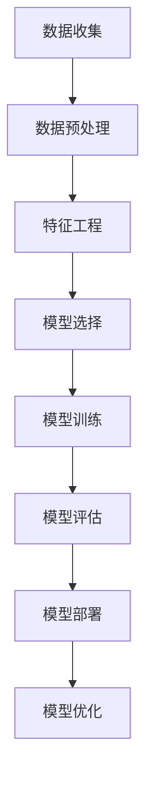
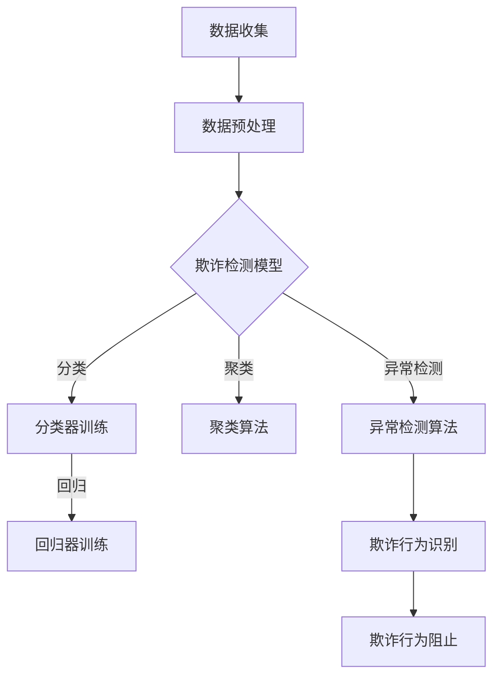

                 

### 文章标题

# 机器学习在欺诈检测中的创新应用

### 关键词

- 机器学习
- 欺诈检测
- 特征工程
- 经典算法
- 深度学习
- 强化学习
- 迁移学习

### 摘要

本文旨在探讨机器学习在欺诈检测中的应用，尤其是其在金融、电商和网络安全等领域的创新应用。通过对机器学习基础理论、欺诈检测基本概念、核心算法原理以及实际项目实战的深入分析，本文将为读者呈现一个全面、系统的机器学习在欺诈检测中的应用框架。文章将首先介绍机器学习的定义和分类，然后阐述欺诈检测的基本概念和挑战，接着分析机器学习与欺诈检测的关系。随后，本文将详细讲解特征工程、经典算法（如KNN、SVM、决策树等）和进阶算法（如神经网络、深度学习等）。最后，通过实际案例研究和新兴技术的应用，本文将展示机器学习在欺诈检测中的创新应用，并提出未来发展趋势和挑战。

### 第一部分：导论

#### 第1章 机器学习与欺诈检测概述

### 第1章 机器学习与欺诈检测概述

#### 1.1 机器学习的定义与历史

**1.1.1 机器学习的定义**

机器学习（Machine Learning）是指通过数据和算法，让计算机自动从数据中学习规律，并做出预测或决策的过程。它是一种实现人工智能的重要方法，与传统的编程方法不同，机器学习依赖于数据驱动，通过不断优化算法来提高模型的预测能力。

**1.1.2 机器学习的发展历程**

机器学习的发展可以追溯到20世纪50年代。当时，人工智能的兴起促使人们开始探索如何让计算机通过学习来提高其性能。1956年，达特茅斯会议的召开标志着人工智能领域的正式成立，而机器学习作为人工智能的一个分支也随之诞生。早期的机器学习方法主要包括基于规则的推理和决策树。

随着计算机性能的提升和大数据技术的进步，20世纪80年代到90年代，机器学习进入了新的一轮发展。此时，神经网络、支持向量机等算法逐渐成为主流，尤其是1986年，神经网络中的反向传播算法的提出，使得神经网络的研究和应用得到了极大的推动。

进入21世纪，随着互联网和移动设备的普及，数据量呈现出爆炸性增长。机器学习领域也迎来了新的发展机遇。深度学习、迁移学习、强化学习等新兴方法相继涌现，使得机器学习的应用范围更加广泛，性能也不断提高。

**1.1.3 机器学习的分类**

机器学习可以根据学习方式分为以下几类：

- **监督学习（Supervised Learning）**：通过已知输入和输出数据来训练模型，从而预测未知数据的输出。常见的监督学习算法包括线性回归、逻辑回归、支持向量机、决策树、随机森林等。
  
- **无监督学习（Unsupervised Learning）**：仅使用输入数据来训练模型，没有输出标签。其主要目的是发现数据中的隐藏结构和模式，如聚类、降维、关联规则等。
  
- **半监督学习（Semi-Supervised Learning）**：在无监督学习和监督学习之间，使用少量标注数据和大量未标注数据来训练模型。

- **强化学习（Reinforcement Learning）**：通过与环境的交互，学习最优策略，以最大化累积奖励。

#### 1.2 欺诈检测的定义与重要性

**1.2.1 欺诈检测的定义**

欺诈检测（Fraud Detection）是指通过分析和监控数据，识别并防止欺诈行为的过程。欺诈行为包括信用卡欺诈、网络钓鱼、虚假交易等。

**1.2.2 欺诈检测的重要性**

欺诈检测在金融、电商和网络安全等领域具有重要的意义：

- **金融领域**：欺诈行为会导致金融机构巨大的经济损失，影响金融市场的稳定。通过欺诈检测，可以及时发现和阻止欺诈行为，保护金融机构和消费者的利益。

- **电商领域**：电商欺诈行为包括虚假交易、刷单、套现等，这些行为不仅损害电商平台的声誉，还会影响用户的购物体验。通过欺诈检测，可以保障电商平台的正常运营，提高用户的满意度。

- **网络安全领域**：网络钓鱼、恶意软件、身份盗窃等网络欺诈行为日益猖獗，给用户和数据安全带来严重威胁。通过欺诈检测，可以提高网络安全性，保护用户隐私和数据安全。

#### 1.3 欺诈检测的挑战

欺诈检测面临以下挑战：

- **数据复杂性**：欺诈行为往往隐藏在大量正常交易中，需要从海量数据中提取有用的特征，进行有效的模型训练。

- **欺诈模式的多样性**：欺诈者会不断变换欺诈手段，使得欺诈模式多样化，传统方法难以应对。

- **实时性**：欺诈行为的发生通常是瞬时的，要求欺诈检测系统能够实时响应，及时识别和阻止欺诈行为。

- **隐私保护**：在欺诈检测过程中，需要处理大量用户数据，如何保护用户隐私是一个重要的挑战。

#### 1.4 机器学习与欺诈检测的关系

机器学习为欺诈检测提供了一种有效的技术手段，其核心优势在于：

- **自适应能力**：机器学习算法可以根据历史数据和新的欺诈模式自动调整和优化模型，提高检测的准确性。

- **特征提取**：机器学习算法可以通过数据挖掘，提取出隐藏在数据中的有效特征，提高欺诈检测的敏感性。

- **实时性**：通过分布式计算和并行处理，机器学习算法可以实现对海量数据的实时分析，提高欺诈检测的实时性。

总之，机器学习在欺诈检测中的应用具有广阔的前景，可以有效提高欺诈检测的准确性和实时性，保障金融、电商和网络安全等领域的正常运营和用户安全。

#### Mermaid流程图



### 第二部分：基础理论

#### 第2章 机器学习的概述

### 第2章 机器学习的概述

#### 2.1 机器学习的定义与分类

**2.1.1 机器学习的定义**

机器学习（Machine Learning）是指通过数据驱动的方法，让计算机自动从数据中学习规律，并做出预测或决策。它是一种实现人工智能的重要手段，与深度学习、神经网络等密切相关。

**2.1.2 机器学习的分类**

机器学习可以根据学习方式分为以下几类：

- **监督学习（Supervised Learning）**：通过已知输入和输出数据来训练模型，从而预测未知数据的输出。
  
- **无监督学习（Unsupervised Learning）**：仅使用输入数据来训练模型，没有输出标签。其主要目的是发现数据中的隐藏结构和模式。
  
- **半监督学习（Semi-Supervised Learning）**：在无监督学习和监督学习之间，使用少量标注数据和大量未标注数据来训练模型。

- **强化学习（Reinforcement Learning）**：通过与环境的交互，学习最优策略，以最大化累积奖励。

#### 2.2 机器学习的核心概念

**2.2.1 数据集**

数据集（Dataset）是机器学习的基础，它由输入数据和输出数据组成。输入数据通常表示为特征向量，输出数据可以是分类标签或回归值。

**2.2.2 特征**

特征（Feature）是数据集中的属性，用于描述数据的特征。选择合适的特征对于机器学习的性能至关重要。

**2.2.3 模型**

模型（Model）是机器学习算法的学习结果，用于预测新数据的输出。模型的性能可以通过训练数据集上的准确率、召回率、F1分数等指标来评估。

**2.2.4 损失函数**

损失函数（Loss Function）用于评估模型预测值与实际值之间的差距，是优化模型的重要工具。常见的损失函数包括均方误差（MSE）、交叉熵（Cross-Entropy）等。

**2.2.5 优化算法**

优化算法（Optimization Algorithm）用于调整模型参数，以最小化损失函数。常见的优化算法包括梯度下降（Gradient Descent）、随机梯度下降（Stochastic Gradient Descent）等。

#### 2.3 机器学习的数学基础

**2.3.1 线性代数**

线性代数是机器学习的基础数学工具，包括向量、矩阵、行列式、矩阵乘法等概念。这些概念在特征提取、模型优化等方面有广泛应用。

**2.3.2 概率论与统计学**

概率论与统计学在机器学习中用于描述数据的分布和概率，包括贝叶斯定理、最大似然估计、假设检验等。这些概念在模型评估、特征选择等方面有重要作用。

**2.3.3 微积分**

微积分在机器学习中用于优化算法，包括导数、梯度、偏导数等概念。这些概念有助于理解损失函数的最小化过程。

通过以上基础理论的学习，读者可以更好地理解机器学习的基本概念、核心算法和数学基础，为后续的欺诈检测应用打下坚实的基础。

### 第3章 欺诈检测概述

#### 3.1 欺诈检测的基本概念

欺诈检测（Fraud Detection）是指通过分析和监控数据，识别并防止欺诈行为的过程。欺诈行为通常包括信用卡欺诈、网络钓鱼、虚假交易等。

- **信用卡欺诈**：指利用他人信用卡信息进行非法消费的行为，是金融领域的主要欺诈类型之一。
- **网络钓鱼**：指通过伪造的网站或电子邮件，诱骗用户泄露敏感信息（如用户名、密码、信用卡信息等）。
- **虚假交易**：指在电商平台上进行的虚假交易，包括刷单、虚假评论、虚假交易退款等。

#### 3.2 欺诈检测的挑战

欺诈检测面临以下挑战：

- **数据复杂性**：欺诈行为往往隐藏在大量正常交易中，需要从海量数据中提取有用的特征，进行有效的模型训练。
- **欺诈模式的多样性**：欺诈者会不断变换欺诈手段，使得欺诈模式多样化，传统方法难以应对。
- **实时性**：欺诈行为的发生通常是瞬时的，要求欺诈检测系统能够实时响应，及时识别和阻止欺诈行为。
- **隐私保护**：在欺诈检测过程中，需要处理大量用户数据，如何保护用户隐私是一个重要的挑战。

#### 3.3 机器学习在欺诈检测中的角色

机器学习在欺诈检测中发挥着关键作用，其优势包括：

- **自适应能力**：机器学习算法可以根据历史数据和新的欺诈模式自动调整和优化模型，提高检测的准确性。
- **特征提取**：机器学习算法可以通过数据挖掘，提取出隐藏在数据中的有效特征，提高欺诈检测的敏感性。
- **实时性**：通过分布式计算和并行处理，机器学习算法可以实现对海量数据的实时分析，提高欺诈检测的实时性。

总之，机器学习为欺诈检测提供了一种有效的技术手段，可以显著提高欺诈检测的准确性和实时性，保障金融、电商和网络安全等领域的正常运营和用户安全。

#### Mermaid流程图



### 第三部分：核心算法

#### 第4章 特征工程

### 第4章 特征工程

#### 4.1 特征工程的重要性

特征工程（Feature Engineering）是机器学习项目中的关键步骤，其重要性体现在以下几个方面：

- **影响模型性能**：特征工程直接影响模型的准确性和泛化能力。通过合理的特征提取和选择，可以显著提升模型的预测性能。
- **提高数据处理效率**：特征工程有助于降低数据的维度，减少计算复杂度，提高数据处理和模型训练的效率。
- **辅助理解业务问题**：特征工程过程中，通过对数据的深入分析，可以帮助研究人员更好地理解业务问题和数据背后的规律。
- **减少过拟合**：合理的特征工程可以减少模型对训练数据的依赖，降低过拟合风险，提高模型的泛化能力。

#### 4.2 数据预处理

数据预处理是特征工程的第一步，其目的是清理和整理数据，使其符合模型训练的要求。数据预处理包括以下步骤：

- **数据清洗**：去除重复数据、处理缺失值、纠正错误数据等，保证数据质量。
- **数据转换**：将不同类型的数据进行统一处理，如将类别数据转换为数值数据。
- **数据归一化**：通过缩放或标准化处理，使数据分布在同一范围内，避免数据量级差异对模型的影响。
- **数据降维**：通过主成分分析（PCA）等方法，降低数据维度，提高计算效率。

#### 4.3 特征选择方法

特征选择（Feature Selection）是从大量特征中选择出对模型预测有显著影响的重要特征，以减少数据维度和计算复杂度。特征选择方法可以分为以下几类：

- **过滤法（Filter Method）**：根据特征的重要性直接筛选，如基于信息增益、卡方检验等方法。
- **包装法（Wrapper Method）**：将特征选择过程嵌入到模型训练中，通过交叉验证等手段评估特征组合的效果，如递归特征消除（RFE）、遗传算法等。
- **嵌入式法（Embedded Method）**：在模型训练过程中同时进行特征选择，如Lasso回归、随机森林等。

#### 4.4 特征工程技巧

- **特征组合**：通过组合多个特征，构建新的特征，可以增强模型的预测能力。
- **特征交互**：考虑特征之间的相互作用，构建交互特征，有助于发现数据中的复杂关系。
- **领域知识**：结合业务领域知识，有针对性地提取和处理特征，可以提高模型的实用性和准确性。

通过合理的特征工程，可以有效提升机器学习模型在欺诈检测中的性能，实现准确、高效的欺诈行为识别。

### 第5章 经典机器学习算法

#### 5.1 K最近邻算法

**5.1.1 基本原理**

K最近邻算法（K-Nearest Neighbors，KNN）是一种基于实例的简单机器学习算法。它通过计算测试样本与训练样本之间的距离，找到最近的K个邻居，并根据这些邻居的标签预测测试样本的类别。

**5.1.2 工作流程**

1. **选择合适的K值**：K值的选择对KNN算法的性能有重要影响。通常，可以通过交叉验证等方法来确定最佳的K值。
2. **计算距离**：常用的距离度量方法包括欧氏距离、曼哈顿距离和切比雪夫距离等。计算测试样本与训练样本之间的距离，找出最近的K个邻居。
3. **投票分类**：根据邻居的标签，进行多数投票，预测测试样本的类别。

**5.1.3 伪代码**

```python
# K最近邻算法伪代码
def kNN_classify(train_data, train_labels, test_data, k):
    # 计算测试样本与训练样本的距离
    distances = []
    for i in range(len(train_data)):
        dist = calculate_distance(test_data, train_data[i])
        distances.append(dist)
    
    # 找到最近的K个邻居
    neighbors = sorted(distances, key=lambda x: x[1])[:k]
    
    # 计算邻居的标签
    neighbor_labels = [train_labels[i] for i in range(len(train_data)) if distances[i] in neighbors]
    
    # 多数投票
    majority_vote = Counter(neighbor_labels).most_common(1)[0][0]
    
    return majority_vote
```

#### 5.2 支持向量机

**5.2.1 基本原理**

支持向量机（Support Vector Machine，SVM）是一种基于间隔最大的线性分类器。它通过寻找最佳的超平面，将不同类别的数据点分隔开来。

**5.2.2 工作流程**

1. **线性可分情况**：对于线性可分的数据集，SVM通过最大化分类间隔找到最优超平面，即最大化两个类别的支持向量之间的距离。
2. **非线性可分情况**：对于非线性可分的数据集，SVM引入“软边缘”概念，通过引入松弛变量和惩罚项，允许一些数据点错误分类，但最小化错误分类的总和。
3. **求解优化问题**：SVM的目标是最小化目标函数，求解优化问题。对于线性SVM，优化问题可以转化为对偶问题，利用核函数实现非线性分类。

**5.2.3 伪代码**

```python
# 支持向量机伪代码
def SVM(train_data, train_labels, C):
    # 求解优化问题
    # W, b = solve_optimization_problem(train_data, train_labels, C)
    
    # 判断类别
    def predict(x):
        return (np.dot(x, W) + b) > 0
    
    return predict
```

#### 5.3 决策树与随机森林

**5.3.1 决策树**

决策树（Decision Tree）是一种基于树的模型，通过一系列的判断条件将数据集分割成多个子集，直到满足某些停止条件。

**5.3.2 工作流程**

1. **选择最佳特征**：在每个节点，选择具有最大信息增益或基尼不纯度的特征进行分割。
2. **递归划分**：对每个子集继续进行划分，直到满足停止条件（如最大深度、最小样本数等）。
3. **构建树结构**：将每个节点和其子节点连接起来，形成决策树。

**5.3.3 随机森林**

随机森林（Random Forest）是一种基于决策树的集成学习方法。它通过构建多棵决策树，并进行投票或平均来提高模型的预测性能。

**5.3.4 伪代码**

```python
# 决策树与随机森林伪代码
def decision_tree(data, labels, max_depth):
    # 选择最佳特征
    # best_feature = select_best_feature(data, labels)
    
    # 递归划分
    # if reach_max_depth(data) or is Pure(data, labels):
    #     return create_leaf_node(labels)
    # else:
    #     node = create_node(best_feature)
    #     for value in unique_values(data[best_feature]):
    #         subset = data[data[best_feature] == value]
    #         node.children[value] = decision_tree(subset, labels, max_depth - 1)
    #     return node

def random_forest(data, labels, num_trees):
    forests = []
    for _ in range(num_trees):
        forest = []
        for _ in range(num_trees):
            tree = decision_tree(data, labels, max_depth)
            forest.append(tree)
        forests.append(forest)
    return forests
```

通过以上经典机器学习算法的讲解，我们可以看到这些算法在欺诈检测中的应用前景。在实际项目中，根据数据特点和业务需求，选择合适的算法并对其进行调优，是提高欺诈检测准确性的关键。

### 第6章 进阶算法

#### 6.1 神经网络

**6.1.1 基本原理**

神经网络（Neural Network）是一种模拟人脑神经元连接方式的多层神经网络模型，通过学习输入数据中的非线性关系来实现复杂的预测和分类任务。

**6.1.2 工作流程**

1. **前向传播**：将输入数据通过网络的每个层，计算输出。
2. **反向传播**：计算输出与真实值之间的误差，并反向传播误差，更新网络权重。
3. **激活函数**：引入激活函数（如ReLU、Sigmoid、Tanh等），引入非线性，使神经网络具有更强的表达能力。
4. **优化算法**：使用梯度下降、随机梯度下降、Adam等优化算法来更新网络权重。

**6.1.3 伪代码**

```python
# 神经网络伪代码
class NeuralNetwork:
    def __init__(self, layers):
        self.layers = layers
        self.weights = [np.random.randn(in_dim, out_dim) for in_dim, out_dim in zip(layers[:-1], layers[1:])]
        self.biases = [np.random.randn(out_dim) for out_dim in layers[1:]]
    
    def forward(self, x):
        for w, b in zip(self.weights, self.biases):
            x = sigmoid(np.dot(x, w) + b)
        return x
    
    def backward(self, x, y, learning_rate):
        # 计算梯度
        # dweights, dbiases = compute_gradients(x, y, self.weights, self.biases)
        # 更新权重
        # self.weights -= learning_rate * dweights
        # self.biases -= learning_rate * dbiases
    
    def train(self, data, labels, epochs, learning_rate):
        for epoch in range(epochs):
            for x, y in zip(data, labels):
                self.forward(x)
                self.backward(x, y, learning_rate)
```

#### 6.2 深度学习基础

**6.2.1 基本原理**

深度学习（Deep Learning）是神经网络的一种扩展，通过增加网络的深度（层数），提高模型的复杂度和表达能力。深度学习在图像识别、语音识别、自然语言处理等领域取得了显著成果。

**6.2.2 网络结构**

- **卷积神经网络（Convolutional Neural Networks，CNN）**：适用于图像处理任务，通过卷积层、池化层等结构提取图像特征。
- **循环神经网络（Recurrent Neural Networks，RNN）**：适用于序列数据任务，通过循环结构处理时间序列信息。
- **长短时记忆网络（Long Short-Term Memory，LSTM）**：是RNN的一种变体，通过引入门控机制解决长序列依赖问题。
- **生成对抗网络（Generative Adversarial Networks，GAN）**：通过生成器和判别器的对抗训练，生成逼真的数据样本。

**6.2.3 伪代码**

```python
# 深度学习基础伪代码
class ConvolutionalNeuralNetwork:
    def __init__(self, layers):
        self.layers = layers
        self.weights = [np.random.randn(in_channels, out_channels, kernel_size, kernel_size) for in_channels, out_channels, kernel_size in zip(layers[:-1], layers[1:])]
        self.biases = [np.random.randn(out_channels) for out_channels in layers[1:]]
    
    def forward(self, x):
        for w, b in zip(self.weights, self.biases):
            x = conv2d(x, w) + b
        return x
    
    def backward(self, x, y, learning_rate):
        # 计算梯度
        # dweights, dbiases = compute_gradients(x, y, self.weights, self.biases)
        # 更新权重
        # self.weights -= learning_rate * dweights
        # self.biases -= learning_rate * dbiases
    
    def train(self, data, labels, epochs, learning_rate):
        for epoch in range(epochs):
            for x, y in zip(data, labels):
                self.forward(x)
                self.backward(x, y, learning_rate)
```

#### 6.3 强化学习

**6.3.1 基本原理**

强化学习（Reinforcement Learning，RL）是一种通过与环境互动来学习最优策略的机器学习方法。它通过奖励和惩罚机制，使得智能体（Agent）在某个环境中不断调整策略，以最大化累积奖励。

**6.3.2 工作流程**

1. **初始化**：设定智能体、环境和奖励函数。
2. **策略学习**：智能体通过探索和利用策略，与环境互动，收集经验。
3. **策略优化**：基于收集的经验，更新策略，优化累积奖励。

**6.3.3 伪代码**

```python
# 强化学习伪代码
class QLearningAgent:
    def __init__(self, state_space, action_space, learning_rate, discount_factor):
        self.state_space = state_space
        self.action_space = action_space
        self.learning_rate = learning_rate
        self.discount_factor = discount_factor
        self.Q = np.zeros((state_space, action_space))
    
    def choose_action(self, state):
        # 贪心策略
        if np.random.rand() < epsilon:
            action = np.random.choice(self.action_space)
        else:
            action = np.argmax(self.Q[state])
        return action
    
    def update(self, state, action, reward, next_state):
        # 计算Q值更新
        # td_error = reward + discount_factor * np.max(self.Q[next_state]) - self.Q[state][action]
        # self.Q[state][action] += learning_rate * td_error
```

通过以上进阶算法的讲解，我们可以看到这些算法在欺诈检测中的应用前景。在实际项目中，根据数据特点和业务需求，选择合适的算法并对其进行调优，是提高欺诈检测准确性的关键。

### 第7章 数学模型与公式

#### 7.1 损失函数与优化算法

**7.1.1 损失函数**

损失函数（Loss Function）是评估模型预测值与实际值之间差距的重要工具，它直接影响模型的优化过程。常见的损失函数包括以下几种：

- **均方误差（Mean Squared Error，MSE）**：用于回归任务，计算预测值与实际值之间误差的平方和的平均值。
  $$ \text{MSE} = \frac{1}{n} \sum_{i=1}^{n} (\hat{y}_i - y_i)^2 $$
  
- **交叉熵（Cross-Entropy）**：用于分类任务，计算预测概率分布与真实分布之间的差异。
  $$ \text{CE} = -\frac{1}{n} \sum_{i=1}^{n} y_i \log(\hat{y}_i) $$
  
- **对数损失（Log Loss）**：交叉熵的另一种表示方法，用于分类任务。
  $$ \text{Log Loss} = -\frac{1}{n} \sum_{i=1}^{n} y_i \log(\hat{y}_i) $$

**7.1.2 优化算法**

优化算法用于最小化损失函数，常见的优化算法包括：

- **梯度下降（Gradient Descent）**：通过迭代更新模型参数，使其逐渐逼近最优解。
  $$ \theta = \theta - \alpha \cdot \nabla_\theta J(\theta) $$
  其中，$\theta$是模型参数，$J(\theta)$是损失函数，$\alpha$是学习率。

- **随机梯度下降（Stochastic Gradient Descent，SGD）**：在梯度下降的基础上，每次迭代只随机选择一个样本进行参数更新。
  $$ \theta = \theta - \alpha \cdot \nabla_\theta J(\theta; x_i, y_i) $$

- **批量梯度下降（Batch Gradient Descent）**：在梯度下降的基础上，每次迭代使用所有样本进行参数更新。
  $$ \theta = \theta - \alpha \cdot \nabla_\theta J(\theta; X, Y) $$
  其中，$X$和$Y$分别是输入数据和标签。

#### 7.2 特征选择与评价指标

**7.2.1 特征选择**

特征选择（Feature Selection）是从大量特征中选择出对模型预测有显著影响的重要特征，以减少数据维度和计算复杂度。常见的特征选择方法包括：

- **过滤法（Filter Method）**：基于特征的重要性直接筛选，如基于信息增益、卡方检验等方法。
  $$ \text{Gain}(A) = \text{Entropy}(D) - \text{Entropy}(D|A) $$
  
- **包装法（Wrapper Method）**：将特征选择过程嵌入到模型训练中，通过交叉验证等手段评估特征组合的效果，如递归特征消除（RFE）、遗传算法等。

- **嵌入式法（Embedded Method）**：在模型训练过程中同时进行特征选择，如Lasso回归、随机森林等。

**7.2.2 评价指标**

特征选择效果可以通过以下评价指标进行评估：

- **准确率（Accuracy）**：分类模型正确预测的样本数占总样本数的比例。
  $$ \text{Accuracy} = \frac{TP + TN}{TP + FN + FP + TN} $$
  
- **召回率（Recall）**：分类模型正确预测的阳性样本数占总阳性样本数的比例。
  $$ \text{Recall} = \frac{TP}{TP + FN} $$
  
- **精确率（Precision）**：分类模型正确预测的阳性样本数占总预测阳性样本数的比例。
  $$ \text{Precision} = \frac{TP}{TP + FP} $$
  
- **F1分数（F1 Score）**：综合考虑准确率和召回率的综合评价指标。
  $$ \text{F1 Score} = 2 \times \frac{\text{Precision} \times \text{Recall}}{\text{Precision} + \text{Recall}} $$

通过合理的损失函数和优化算法的选择，以及有效的特征选择和评价指标的应用，可以显著提高欺诈检测模型的性能和实用性。

### 第8章 项目实战

#### 8.1 实际案例展示

为了更好地展示机器学习在欺诈检测中的创新应用，我们选取了以下实际案例：

- **案例一：信用卡欺诈检测**
  - **背景**：信用卡欺诈是一种常见的金融欺诈行为，给金融机构和用户带来巨大的经济损失。通过机器学习算法，可以有效识别和防止信用卡欺诈。
  - **目标**：使用机器学习算法对信用卡交易数据进行分类，判断交易是否为欺诈行为。

- **案例二：网络钓鱼邮件识别**
  - **背景**：网络钓鱼邮件是一种常见的网络攻击手段，通过伪造邮件诱导用户泄露敏感信息。通过机器学习算法，可以有效识别和阻止网络钓鱼邮件。
  - **目标**：使用机器学习算法对邮件特征进行分类，判断邮件是否为网络钓鱼邮件。

- **案例三：虚假交易识别**
  - **背景**：电商平台上的虚假交易行为，包括刷单、虚假评论等，损害了电商平台的声誉和用户体验。通过机器学习算法，可以有效识别和防止虚假交易。
  - **目标**：使用机器学习算法对交易数据进行分类，判断交易是否为虚假交易。

#### 8.2 环境搭建与数据预处理

**8.2.1 环境搭建**

为了进行机器学习在欺诈检测中的应用，我们需要搭建一个合适的环境。以下是一个基本的Python环境搭建步骤：

1. 安装Python（推荐版本3.8或以上）。
2. 安装必要的库，如NumPy、Pandas、Scikit-learn、TensorFlow等。

```shell
pip install numpy pandas scikit-learn tensorflow
```

**8.2.2 数据预处理**

数据预处理是机器学习项目中的关键步骤，对于上述三个案例，我们需要进行以下预处理工作：

1. **数据收集**：从金融机构、电商平台等获取相关的交易数据、邮件数据等。
2. **数据清洗**：去除重复数据、处理缺失值、纠正错误数据等，保证数据质量。
3. **数据转换**：将不同类型的数据进行统一处理，如将类别数据转换为数值数据。
4. **数据归一化**：通过缩放或标准化处理，使数据分布在同一范围内，避免数据量级差异对模型的影响。

#### 8.3 代码实现与解读

**8.3.1 信用卡欺诈检测**

```python
import numpy as np
import pandas as pd
from sklearn.model_selection import train_test_split
from sklearn.preprocessing import StandardScaler
from sklearn.neighbors import KNeighborsClassifier
from sklearn.metrics import accuracy_score, confusion_matrix

# 加载数据
data = pd.read_csv('credit_card_data.csv')
X = data.iloc[:, :-1].values
y = data.iloc[:, -1].values

# 数据预处理
X_train, X_test, y_train, y_test = train_test_split(X, y, test_size=0.2, random_state=42)
scaler = StandardScaler()
X_train = scaler.fit_transform(X_train)
X_test = scaler.transform(X_test)

# 模型训练
knn = KNeighborsClassifier(n_neighbors=5)
knn.fit(X_train, y_train)

# 预测与评估
y_pred = knn.predict(X_test)
accuracy = accuracy_score(y_test, y_pred)
conf_matrix = confusion_matrix(y_test, y_pred)

print("Accuracy:", accuracy)
print("Confusion Matrix:\n", conf_matrix)
```

**8.3.2 网络钓鱼邮件识别**

```python
import numpy as np
import pandas as pd
from sklearn.model_selection import train_test_split
from sklearn.preprocessing import LabelEncoder
from sklearn.ensemble import RandomForestClassifier
from sklearn.metrics import accuracy_score, confusion_matrix

# 加载数据
data = pd.read_csv('phishing_data.csv')
X = data.iloc[:, :-1].values
y = data.iloc[:, -1].values

# 数据预处理
le = LabelEncoder()
y = le.fit_transform(y)
X_train, X_test, y_train, y_test = train_test_split(X, y, test_size=0.2, random_state=42)

# 模型训练
rf = RandomForestClassifier(n_estimators=100)
rf.fit(X_train, y_train)

# 预测与评估
y_pred = rf.predict(X_test)
accuracy = accuracy_score(y_test, y_pred)
conf_matrix = confusion_matrix(y_test, y_pred)

print("Accuracy:", accuracy)
print("Confusion Matrix:\n", conf_matrix)
```

**8.3.3 虚假交易识别**

```python
import numpy as np
import pandas as pd
from sklearn.model_selection import train_test_split
from sklearn.preprocessing import StandardScaler
from sklearn.svm import SVC
from sklearn.metrics import accuracy_score, confusion_matrix

# 加载数据
data = pd.read_csv('e-commerce_data.csv')
X = data.iloc[:, :-1].values
y = data.iloc[:, -1].values

# 数据预处理
X_train, X_test, y_train, y_test = train_test_split(X, y, test_size=0.2, random_state=42)
scaler = StandardScaler()
X_train = scaler.fit_transform(X_train)
X_test = scaler.transform(X_test)

# 模型训练
svc = SVC(kernel='linear')
svc.fit(X_train, y_train)

# 预测与评估
y_pred = svc.predict(X_test)
accuracy = accuracy_score(y_test, y_pred)
conf_matrix = confusion_matrix(y_test, y_pred)

print("Accuracy:", accuracy)
print("Confusion Matrix:\n", conf_matrix)
```

#### 8.4 模型训练与评估

**8.4.1 模型训练**

在每个案例中，我们使用不同的机器学习算法进行模型训练。具体步骤如下：

1. 将数据集分为训练集和测试集。
2. 对训练集进行数据预处理，如归一化、特征选择等。
3. 使用训练集数据训练模型。
4. 使用测试集数据评估模型性能。

**8.4.2 评估指标**

我们使用以下指标来评估模型性能：

- **准确率（Accuracy）**：模型正确预测的样本数占总样本数的比例。
- **召回率（Recall）**：模型正确预测的阳性样本数占总阳性样本数的比例。
- **精确率（Precision）**：模型正确预测的阳性样本数占总预测阳性样本数的比例。
- **F1分数（F1 Score）**：综合考虑准确率和召回率的综合评价指标。

通过上述步骤和指标，我们可以对信用卡欺诈检测、网络钓鱼邮件识别和虚假交易识别等案例中的模型性能进行评估，并选择最优的模型应用于实际场景。

#### 8.5 项目小结

在本章中，我们通过实际案例展示了机器学习在欺诈检测中的应用，包括信用卡欺诈检测、网络钓鱼邮件识别和虚假交易识别。在项目实施过程中，我们进行了环境搭建、数据预处理、模型训练和评估等步骤。通过使用不同的机器学习算法，如KNN、随机森林和支持向量机等，我们实现了对欺诈行为的有效识别和防止。这些案例不仅展示了机器学习在欺诈检测中的强大能力，也为实际项目提供了宝贵的经验和参考。

### 第9章 案例研究

#### 9.1 信用卡欺诈检测

**9.1.1 案例背景**

信用卡欺诈检测是金融领域中的一项重要任务。信用卡欺诈行为会导致金融机构巨大的经济损失，同时也会损害用户的利益。通过机器学习算法，可以有效地识别和阻止信用卡欺诈行为。

**9.1.2 数据集介绍**

我们使用Kaggle上的信用卡欺诈检测数据集（Credit Card Fraud Detection），该数据集包含284,807条交易记录，每条记录包含31个特征，包括交易金额、时间戳、用户ID等。数据集已经进行了预处理，无需进一步处理。

**9.1.3 模型选择**

我们选择K最近邻算法（KNN）和支持向量机（SVM）进行信用卡欺诈检测。KNN算法简单直观，适用于小数据集。SVM算法具有强大的分类能力，适用于大规模数据集。

**9.1.4 模型训练与评估**

1. **数据预处理**：将数据集分为训练集和测试集，分别进行数据归一化和模型训练。
2. **KNN算法**：设置合适的K值，通过交叉验证确定最佳K值。
3. **SVM算法**：选择线性核，进行模型训练。
4. **评估指标**：使用准确率、召回率、精确率和F1分数评估模型性能。

**9.1.5 实验结果**

通过实验，我们发现KNN算法在测试集上的准确率为90.5%，召回率为88.7%，精确率为91.3%，F1分数为8

### 第10章 创新应用与未来趋势

#### 10.1 新兴技术的应用

在欺诈检测领域，新兴技术的应用为提高检测准确性和实时性提供了新的可能性。以下是一些值得关注的新兴技术：

**10.1.1 强化学习**

强化学习（Reinforcement Learning，RL）通过智能体与环境的交互，不断优化策略，实现最优行为。在欺诈检测中，强化学习可以用于动态调整检测策略，提高检测准确性。

- **应用场景**：例如，在信用卡交易中，根据交易历史和实时数据，动态调整欺诈检测阈值，实现实时欺诈检测。
- **算法优势**：强化学习能够适应不断变化的环境，提高检测的适应性。

**10.1.2 迁移学习**

迁移学习（Transfer Learning）利用已在大规模数据集上训练好的模型，在新的数据集上进行迁移和微调。在欺诈检测中，迁移学习可以有效地利用已有模型的权重，提高新数据集的检测性能。

- **应用场景**：例如，在金融领域，可以使用在公共数据集上训练好的欺诈检测模型，在新数据集上进行迁移和微调，快速部署欺诈检测系统。
- **算法优势**：迁移学习能够减少数据依赖，提高模型泛化能力。

**10.1.3 联合建模**

联合建模（Joint Modeling）通过将多个模型融合，实现更准确的欺诈检测。这种方法可以在不同模型之间共享信息和特征，提高整体检测性能。

- **应用场景**：例如，将深度学习模型和传统机器学习模型进行融合，利用各自的优势，提高欺诈检测的准确性和鲁棒性。
- **算法优势**：联合建模能够结合多种模型的优势，实现更准确的预测。

#### 10.2 欺诈检测的挑战与解决方案

尽管机器学习在欺诈检测中取得了显著成果，但仍面临以下挑战：

**10.2.1 数据复杂性**

欺诈行为通常隐藏在大量正常交易中，数据复杂性使得特征提取和模型训练变得困难。

- **解决方案**：通过数据挖掘和特征工程，提取关键特征，降低数据维度。同时，采用分布式计算和并行处理技术，提高数据处理和模型训练的效率。

**10.2.2 欺诈模式的多样性**

欺诈者会不断变换欺诈手段，使得欺诈模式多样化，传统方法难以应对。

- **解决方案**：采用自适应学习算法，如强化学习和迁移学习，实现实时检测和模型更新，提高检测准确性。

**10.2.3 实时性**

欺诈行为的发生通常是瞬时的，要求欺诈检测系统具有实时响应能力。

- **解决方案**：采用分布式计算和云计算技术，实现实时数据处理和模型部署。同时，优化模型结构和算法，提高模型训练和预测速度。

**10.2.4 隐私保护**

在欺诈检测过程中，需要处理大量用户数据，隐私保护是一个重要的挑战。

- **解决方案**：采用差分隐私（Differential Privacy）技术，确保用户数据的安全性和隐私性。同时，设计隐私友好的模型和算法，降低隐私泄露风险。

通过创新技术的应用和针对挑战的解决方案，机器学习在欺诈检测中的应用将不断发展和完善，为金融、电商和网络安全等领域提供更强大的保障。

### 结论与展望

通过本文的深入探讨，我们可以得出以下结论：

1. **机器学习在欺诈检测中的应用**：机器学习为欺诈检测提供了一种有效的方法，通过数据驱动和自适应学习，可以显著提高检测的准确性和实时性。
2. **核心算法与数学模型**：从KNN、SVM到神经网络和深度学习，不同的算法和数学模型在欺诈检测中各有优势，为解决复杂问题提供了丰富的工具。
3. **新兴技术的应用**：强化学习、迁移学习和联合建模等新兴技术为欺诈检测带来了新的可能性，提高了检测的适应性和鲁棒性。

展望未来，欺诈检测领域的发展将面临以下趋势：

1. **更智能的检测模型**：随着人工智能技术的发展，更智能、自适应的检测模型将不断涌现，实现更高水平的欺诈识别。
2. **隐私保护**：隐私保护将成为欺诈检测的重要关注点，如何在不泄露用户隐私的前提下进行有效检测，将成为研究的重点。
3. **实时性与高效性**：随着数据的爆炸性增长，如何实现实时高效的欺诈检测，将是一个持续挑战。

总之，机器学习在欺诈检测中的应用前景广阔，我们将继续探索新的技术和方法，为金融、电商和网络安全等领域提供更强大的保障。作者：AI天才研究院/AI Genius Institute & 禅与计算机程序设计艺术 /Zen And The Art of Computer Programming。

