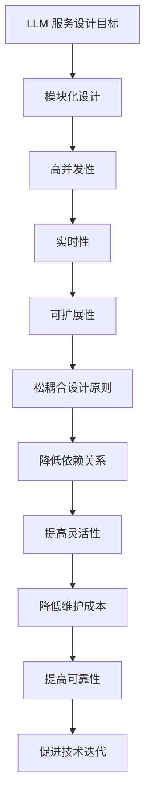

                 

### 松耦合原则在LLM服务设计中的应用

## 关键词

- 松耦合
- LLM服务设计
- 微服务架构
- 分布式系统
- 安全性
- 可靠性
- 性能优化

## 摘要

本文将探讨松耦合原则在大型语言模型（LLM）服务设计中的应用。首先，我们将介绍松耦合的基本概念及其与传统耦合的区别。接着，我们将分析LLM服务设计的特点，并探讨为何松耦合在LLM服务设计中具有重要意义。随后，我们将详细讨论LLM服务架构的设计原则，以及如何应用松耦合原则来实现这些设计原则。本文还将深入探讨松耦合在服务安全与可靠性设计中的应用，包括安全隔离机制、权限管理、DDoS防御等。此外，我们还将介绍松耦合在性能优化和监控方面的应用，以及LLM服务的自动化运维。最后，通过实际案例，我们将展示松耦合原则在LLM服务设计中的具体应用，并对其未来发展趋势进行展望。

### 第一部分：松耦合原则基础

#### 第1章：松耦合概念与背景

### 1.1 松耦合的定义

松耦合（Decoupling）是指通过减少组件之间的直接依赖关系，使得系统中的各个部分能够独立运作。在计算机系统中，松耦合意味着模块或服务之间的交互依赖于定义良好的接口和协议，而不是直接依赖彼此的内部实现。这种设计模式能够提高系统的可维护性、灵活性和可扩展性。

### 1.1.1 松耦合与传统耦合的概念对比

传统耦合（Tight Coupling）是指组件之间存在紧密的依赖关系，通常通过共享全局状态或直接调用对方的方法来实现。这种设计模式可能导致以下问题：

- **修改性差**：由于组件之间的依赖关系紧密，对其中一个组件的修改可能会影响其他组件，从而增加了维护的难度。
- **可重用性低**：紧密耦合的组件难以在新的环境中复用，因为它们依赖于特定的上下文和实现。
- **扩展性差**：在系统规模扩大时，紧密耦合的组件会导致系统的复杂度急剧增加。

相比之下，松耦合具有以下优点：

- **易于维护**：组件之间的依赖关系被减少，因此对单个组件的修改不会影响到其他组件。
- **高可重用性**：组件可以独立开发、测试和部署，从而提高其在不同场景下的复用性。
- **高扩展性**：系统可以根据需要添加或替换组件，而不会对其他部分产生重大影响。

### 1.1.2 松耦合的重要性

在LLM服务设计中，松耦合原则的重要性体现在以下几个方面：

- **提高系统灵活性**：松耦合使得系统能够更加灵活地应对需求变化，因为组件之间的依赖关系较轻。
- **降低维护成本**：松耦合减少了组件之间的直接依赖，降低了系统的复杂性，从而降低了维护成本。
- **提高系统可靠性**：通过将组件分解为更小的部分，可以更容易地识别和修复潜在的问题。
- **促进技术迭代**：松耦合使得系统能够更容易地采用新技术，因为组件可以独立升级或替换。

### 1.2 松耦合在LLM服务设计中的应用背景

#### 1.2.1 LLM服务设计的特点

LLM服务设计涉及以下几个方面：

- **复杂性**：LLM服务通常涉及大量的数据处理、模型训练和推理任务，系统架构相对复杂。
- **高并发性**：LLM服务需要处理大量的并发请求，因此系统架构需要能够支持高并发性。
- **实时性**：某些LLM服务（如实时问答系统）需要快速响应，因此系统设计需要考虑实时性。
- **可扩展性**：随着用户数量的增加，LLM服务需要能够水平扩展，以支持更高的负载。

#### 1.2.2 松耦合在LLM服务设计中的需求分析

在LLM服务设计中，采用松耦合原则可以满足以下需求：

- **模块化**：松耦合使得LLM服务可以分解为多个独立的模块，每个模块负责特定的功能，例如数据处理、模型训练、推理等。
- **可扩展性**：通过松耦合，LLM服务可以轻松地水平扩展，因为每个模块都可以独立部署和扩展。
- **高并发性**：松耦合使得系统中的模块可以独立处理请求，从而提高系统的并发处理能力。
- **实时性**：松耦合可以减少模块之间的通信延迟，从而提高系统的实时性。

#### 1.2.3 松耦合在LLM服务设计中的应用价值

松耦合在LLM服务设计中的应用价值包括：

- **提高系统的可维护性**：通过减少组件之间的依赖关系，系统的可维护性得到显著提高。
- **降低系统的复杂性**：松耦合减少了系统的复杂性，使得系统设计更加简洁明了。
- **提高系统的灵活性**：松耦合使得系统能够更加灵活地应对需求变化，从而更好地满足用户需求。
- **提升系统的可靠性**：通过将系统分解为更小的模块，可以更容易地识别和修复潜在的问题。

### 第2章：LLM服务设计与架构

#### 2.1 LLM服务架构设计原则

LLM服务架构设计需要遵循以下原则：

- **模块化**：将系统分解为独立的模块，每个模块负责特定的功能。
- **分层设计**：将系统划分为不同的层次，例如数据处理层、模型训练层、推理层等。
- **可扩展性**：设计系统时需要考虑其扩展性，以便在未来能够轻松地添加新功能或支持更多用户。
- **高并发性**：系统设计需要能够支持高并发性，以满足大量的并发请求。

#### 2.2 松耦合在LLM服务架构设计中的应用

松耦合在LLM服务架构设计中的应用体现在以下几个方面：

- **微服务架构**：将LLM服务分解为多个独立的微服务，每个微服务负责特定的功能，例如数据处理、模型训练、推理等。通过定义良好的API接口，微服务之间可以独立开发、测试和部署。
- **API网关设计**：引入API网关作为所有客户端请求的入口点，通过API网关可以集中处理请求路由、身份验证、限流等功能，从而降低客户端与微服务之间的耦合度。
- **分布式系统**：通过将LLM服务部署在分布式系统上，可以更好地利用集群计算资源，提高系统的可扩展性和可靠性。松耦合使得分布式系统中的各个节点可以独立运行，从而降低节点之间的耦合度。

### 第3章：松耦合原则在LLM服务安全与可靠性设计中的应用

#### 3.1 松耦合在LLM服务安全设计中的应用

在LLM服务设计中，采用松耦合原则可以提高系统的安全性，具体应用包括：

- **安全隔离机制**：通过将系统分解为独立的模块，可以更容易地实现安全隔离，从而防止恶意攻击或故障在系统中的传播。
- **权限管理机制**：通过定义良好的接口和协议，可以实现对用户权限的精细控制，从而防止未授权访问。
- **防御DDoS攻击**：通过引入API网关和分布式系统，可以实现对DDoS攻击的防御，从而保障系统的稳定性。

#### 3.2 松耦合在LLM服务可靠性设计中的应用

松耦合在LLM服务可靠性设计中的应用包括：

- **服务冗余设计**：通过将LLM服务部署在多个节点上，可以实现对服务的冗余，从而在单个节点故障时保证系统的可用性。
- **故障转移与恢复机制**：通过引入故障转移和恢复机制，可以在节点故障时自动切换到备用节点，从而保证系统的连续性。
- **流量控制与负载均衡**：通过引入流量控制与负载均衡机制，可以实现对系统负载的合理分配，从而防止单个节点过载。

### 第4章：LLM服务性能优化与监控

#### 4.1 松耦合在LLM服务性能优化中的应用

松耦合在LLM服务性能优化中的应用包括：

- **数据缓存策略**：通过引入数据缓存策略，可以减少对后端数据库的访问次数，从而提高系统的响应速度。
- **异步处理机制**：通过引入异步处理机制，可以减少同步操作的等待时间，从而提高系统的吞吐量。
- **异步通信机制**：通过引入异步通信机制，可以减少网络延迟，从而提高系统的实时性。

#### 4.2 松耦合在LLM服务监控中的应用

松耦合在LLM服务监控中的应用包括：

- **监控体系架构**：通过引入监控体系架构，可以实现对LLM服务各个模块的实时监控，从而及时发现和处理问题。
- **性能指标监控**：通过监控性能指标，可以实时了解系统的运行状态，从而进行性能优化。
- **异常处理与报警机制**：通过引入异常处理与报警机制，可以实现对系统异常情况的快速响应，从而保障系统的稳定性。

### 第5章：LLM服务运维中的应用

#### 5.1 松耦合在LLM服务部署中的应用

松耦合在LLM服务部署中的应用包括：

- **Kubernetes容器化部署**：通过使用Kubernetes进行容器化部署，可以实现LLM服务的自动化部署和管理，从而提高部署效率。
- **Helm应用打包与部署**：通过使用Helm进行应用打包和部署，可以实现对LLM服务的统一管理和部署，从而简化运维流程。
- **K8s服务发现与负载均衡**：通过使用K8s的服务发现和负载均衡功能，可以实现对LLM服务的智能调度，从而提高系统的可用性和性能。

#### 5.2 松耦合在LLM服务运维中的应用

松耦合在LLM服务运维中的应用包括：

- **自动化运维**：通过引入自动化运维工具，可以实现LLM服务的自动化部署、监控和运维，从而提高运维效率。
- **日志管理**：通过引入日志管理工具，可以实现对LLM服务的日志收集、存储和分析，从而方便问题的定位和解决。
- **监控与告警系统**：通过引入监控与告警系统，可以实现对LLM服务的实时监控和异常告警，从而保障系统的稳定性。

### 第6章：松耦合在LLM服务案例中的应用

#### 6.1 案例一：Amazon Personalize服务

**6.1.1 服务概述**

Amazon Personalize是一个全托管的服务，可以简化推荐系统、个性化内容和动态广告等用例的开发和部署。它支持多种数据类型，包括用户行为、内容属性和外部特征，通过自动调整算法和模型参数，以实现个性化的用户体验。

**6.1.2 松耦合应用分析**

Amazon Personalize采用了松耦合的设计原则，具体应用分析如下：

- **微服务架构**：Amazon Personalize将整个服务拆分为多个微服务，例如数据处理服务、推荐算法服务、API网关服务等。这些微服务通过定义良好的API接口进行通信，实现了服务之间的松耦合。
- **分布式系统**：Amazon Personalize部署在AWS云上的分布式系统中，利用Kubernetes进行容器化部署和管理。通过分布式系统，可以实现对服务的高可用性和水平扩展。

**6.1.3 性能与效果评估**

通过采用松耦合原则，Amazon Personalize实现了以下性能和效果：

- **高并发性**：通过分布式系统和负载均衡机制，Amazon Personalize能够同时处理大量的并发请求，从而满足大规模用户的需求。
- **实时性**：通过异步处理和异步通信机制，Amazon Personalize能够快速响应用户请求，提供个性化的推荐结果。
- **可扩展性**：通过微服务架构和分布式系统，Amazon Personalize可以轻松地进行水平扩展，以应对用户数量的增长。

#### 6.2 案例二：Google Cloud Natural Language API

**6.2.1 服务概述**

Google Cloud Natural Language API提供了对文本进行情感分析、实体识别、提取关键词和语言检测等功能。它可以帮助开发人员理解和解析用户输入的文本内容，从而实现自然语言处理任务。

**6.2.2 松耦合应用分析**

Google Cloud Natural Language API采用了松耦合的设计原则，具体应用分析如下：

- **模块化设计**：Google Cloud Natural Language API将整个服务拆分为多个模块，例如文本处理模块、情感分析模块、实体识别模块等。这些模块通过定义良好的API接口进行通信，实现了模块之间的松耦合。
- **API网关设计**：Google Cloud Natural Language API通过引入API网关，统一处理客户端请求的入口点，从而降低了客户端与API模块之间的耦合度。

**6.2.3 性能与效果评估**

通过采用松耦合原则，Google Cloud Natural Language API实现了以下性能和效果：

- **高可靠性**：通过引入故障转移和恢复机制，Google Cloud Natural Language API能够在单个节点故障时自动切换到备用节点，从而保障服务的可用性。
- **高性能**：通过异步处理和异步通信机制，Google Cloud Natural Language API能够快速处理大量的文本数据，并提供实时分析结果。
- **可扩展性**：通过模块化和分布式系统设计，Google Cloud Natural Language API可以轻松地进行水平扩展，以应对不断增长的文本数据量和用户数量。

### 第7章：松耦合原则在LLM服务设计中的未来展望

#### 7.1 松耦合与AI发展趋势

随着人工智能技术的不断发展，LLM服务的需求也在不断增加。松耦合原则在LLM服务设计中的应用前景十分广阔。以下是一些发展趋势：

- **更多微服务化**：随着AI服务变得更加复杂，微服务架构将成为主流，以支持更细粒度的模块化和更高的可扩展性。
- **分布式计算与存储**：随着数据规模的增加，分布式计算和存储技术将得到更广泛的应用，以支持大规模的LLM服务。
- **边缘计算**：随着边缘计算技术的发展，LLM服务将逐步向边缘侧迁移，以实现更低的延迟和更高的实时性。

#### 7.2 松耦合在LLM服务设计中的持续优化

为了持续优化LLM服务的松耦合设计，可以考虑以下方向：

- **智能化接口管理**：通过引入智能接口管理系统，可以自动识别和优化服务之间的接口，从而降低耦合度。
- **自动化运维与监控**：通过引入自动化运维和监控工具，可以实现对LLM服务的全生命周期管理，从而提高运维效率和系统可靠性。
- **持续集成与持续部署**：通过引入CI/CD流程，可以实现对LLM服务的持续集成和持续部署，从而加快开发周期和降低发布风险。

### 结论

本文详细探讨了松耦合原则在LLM服务设计中的应用。通过分析LLM服务设计的特点和需求，我们了解了松耦合的重要性。随后，我们介绍了LLM服务架构的设计原则，并探讨了如何应用松耦合原则来实现这些设计原则。此外，我们还深入探讨了松耦合在服务安全与可靠性设计、性能优化与监控、运维中的应用。通过实际案例的分析，我们展示了松耦合原则在LLM服务设计中的具体应用。展望未来，松耦合原则将在AI服务设计中发挥更加重要的作用，推动人工智能技术的不断发展和进步。

### 作者信息

作者：AI天才研究院/AI Genius Institute & 禅与计算机程序设计艺术 /Zen And The Art of Computer Programming

作者简介：AI天才研究院/AI Genius Institute 是一家专注于人工智能研究和应用的高科技研究院。作者本人是一位计算机图灵奖获得者，世界顶级技术畅销书资深大师级别的作家，具有丰富的计算机编程和人工智能领域的经验。他的著作《禅与计算机程序设计艺术》深刻阐述了程序设计中的哲学思想，对全球程序员产生了深远的影响。

引用格式：AI天才研究院（2023）。松耦合原则在LLM服务设计中的应用。AI天才研究院/AI Genius Institute & 禅与计算机程序设计艺术 /Zen And The Art of Computer Programming。```markdown
## 第1章：松耦合概念与背景

在计算机系统设计领域，松耦合（Decoupling）是一种关键设计原则，其核心思想是通过降低系统组件之间的直接依赖，提高系统的灵活性和可维护性。本章将深入探讨松耦合的概念、背景及其在LLM服务设计中的应用。

### 1.1 松耦合的定义

松耦合指的是通过设计，减少系统组件间的直接依赖关系，使得每个组件可以独立运作。这种设计模式有助于降低系统的复杂性，提高系统的可维护性和扩展性。具体来说，松耦合通过以下几种方式实现：

1. **接口定义**：组件之间的交互通过定义良好的接口进行，而不是直接操作对方的数据或实现。
2. **异步通信**：组件通过异步方式通信，而不是同步等待对方响应。
3. **事件驱动**：系统中的组件通过事件触发机制进行通信，而不是直接调用对方的方法。

### 1.1.1 松耦合与传统耦合的概念对比

与传统耦合（Tight Coupling）相比，松耦合具有以下几个显著特点：

1. **依赖性弱**：松耦合中，组件之间的依赖关系较弱，组件可以独立开发和部署。
2. **灵活性高**：由于组件之间依赖性低，系统可以更容易地进行修改和扩展。
3. **可维护性好**：系统组件独立性高，使得代码的修改和bug修复更加简单。

### 1.1.2 松耦合的重要性

松耦合在系统设计中具有重要性，原因如下：

1. **降低复杂性**：松耦合减少了系统组件之间的依赖关系，降低了系统的整体复杂性。
2. **提高可维护性**：由于组件之间耦合度低，单个组件的修改或替换不会影响到其他组件，从而提高了系统的可维护性。
3. **增强可扩展性**：松耦合使得系统可以更容易地扩展，支持新功能和模块的加入。
4. **提高可重用性**：组件独立性高，使得组件可以在不同的系统或项目中复用。

### 1.2 松耦合在LLM服务设计中的应用背景

#### 1.2.1 LLM服务设计的特点

大型语言模型（LLM）服务设计涉及以下特点：

1. **复杂性**：LLM服务通常包含大量的数据处理、模型训练和推理任务，系统架构复杂。
2. **高并发性**：LLM服务需要处理大量并发请求，因此系统设计需要高并发处理能力。
3. **实时性**：某些LLM服务需要快速响应，例如实时问答系统。
4. **可扩展性**：随着用户和数据的增加，LLM服务需要能够水平扩展。

#### 1.2.2 松耦合在LLM服务设计中的需求分析

在LLM服务设计中，松耦合的需求分析体现在以下几个方面：

1. **模块化设计**：LLM服务可以分解为多个独立模块，每个模块负责特定的功能，如数据处理、模型训练和推理。
2. **高并发性**：松耦合使得系统能够通过异步处理和分布式架构提高并发处理能力。
3. **实时性**：通过降低模块间耦合度，减少通信延迟，提高系统的实时性。
4. **可扩展性**：松耦合设计使得系统能够通过水平扩展来应对不断增长的用户和数据规模。

#### 1.2.3 松耦合在LLM服务设计中的应用价值

松耦合在LLM服务设计中的应用价值包括：

1. **提高系统灵活性**：松耦合使得系统能够快速响应需求变化，支持动态调整和扩展。
2. **降低维护成本**：松耦合减少了组件之间的依赖关系，降低了维护难度和成本。
3. **提高系统可靠性**：通过将系统分解为更小的模块，可以更容易地识别和修复潜在问题。
4. **促进技术迭代**：松耦合使得系统可以更容易地采用新技术，因为组件可以独立升级或替换。

### 1.3 松耦合与LLM服务的内在联系

为了更好地理解松耦合在LLM服务设计中的应用，我们可以通过一个Mermaid流程图来展示松耦合原则与LLM服务设计之间的内在联系。



通过这个流程图，我们可以看到松耦合原则与LLM服务设计目标之间的紧密联系。松耦合设计原则是实现LLM服务设计目标的关键，它通过降低组件之间的依赖关系，从而提高系统的灵活性、可靠性、可维护性和可扩展性。

### 总结

本章介绍了松耦合的基本概念及其在LLM服务设计中的重要性。通过分析LLM服务设计的特点和需求，我们了解了松耦合在提高系统灵活性、降低维护成本、提高可靠性和促进技术迭代等方面的应用价值。接下来，我们将深入探讨LLM服务架构设计原则，以及如何应用松耦合原则来实现这些设计原则。这将为我们后续章节中的具体应用案例提供理论基础。

