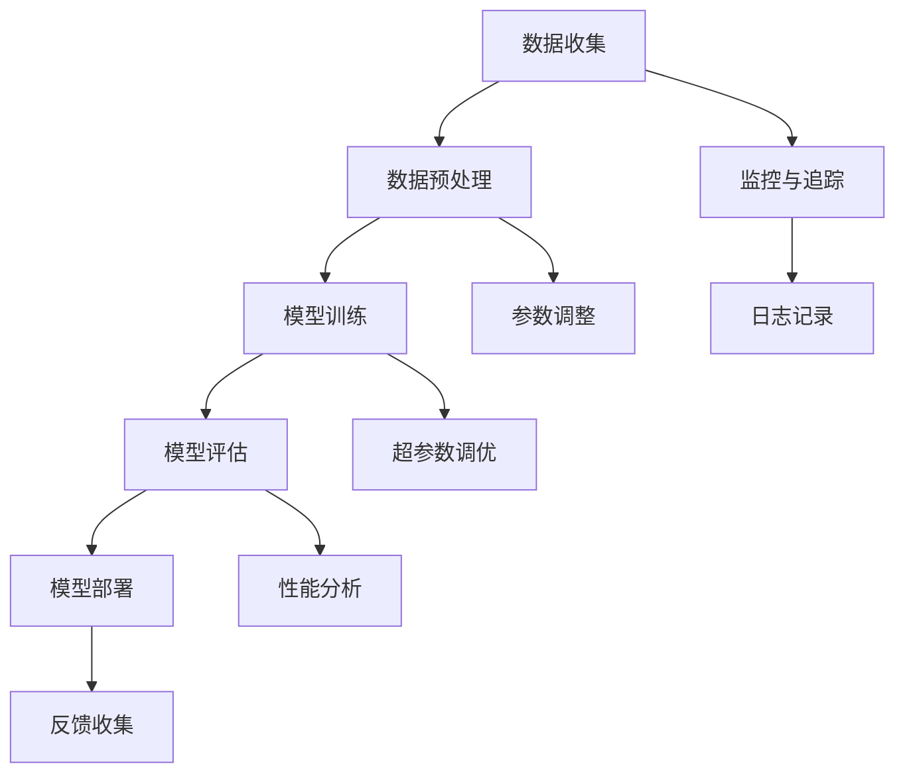

                 

# 文章标题：构建prompt工程的端到端自动化流水线

## 关键词

- Prompt Engineering
- 自动化流水线
- 端到端
- 数据预处理
- 机器学习
- 模型训练
- 模型优化
- 实战案例

## 摘要

本文旨在探讨如何构建prompt工程的端到端自动化流水线。通过逐步分析，从数据预处理到模型训练与优化，再到自动化流水线的搭建，本文将详细介绍各个环节的技术细节和实践方法。同时，通过实际案例的剖析，读者可以了解如何将理论知识应用到实际项目中，实现prompt工程的自动化。

## 引言

### 1.1 Prompt Engineering的概念

Prompt Engineering是一种基于自然语言处理（NLP）的技术，旨在通过设计高效的提示（prompt）来提高机器学习模型的表现。这些提示通常由一组预定义的短语或句子组成，用于引导模型在特定任务上的表现。

### 1.2 背景和重要性

随着人工智能技术的不断发展，Prompt Engineering在许多应用场景中变得越来越重要。例如，在聊天机器人、文本生成和翻译等领域，通过精心设计的prompt，可以显著提升模型的质量和效率。此外，Prompt Engineering还为自动化流程提供了新的可能性，使得模型训练和优化变得更加高效和智能化。

### 1.3 目标与内容概述

本文的目标是帮助读者了解并掌握如何构建prompt工程的端到端自动化流水线。本文将首先介绍自动化流水线的概念及其优势，然后深入探讨数据预处理、模型训练与优化、自动化流水线搭建等关键技术。最后，通过实际案例的分析，读者可以更好地理解这些技术的应用。

## 自动化流水线的概念

### 2.1 定义

自动化流水线（Automated Pipeline）是一种自动化流程管理工具，用于自动化地处理和执行一系列任务。在机器学习和人工智能领域，自动化流水线通常用于数据预处理、模型训练、评估和部署等环节。

### 2.2 原理

自动化流水线通过将一系列任务（如数据收集、数据处理、模型训练、模型评估等）连接起来，形成一个连续的流程。每个任务都可以通过脚本或代码实现，并且可以配置参数来调整任务的行为。这些任务可以通过自动化工具（如Airflow、Kubeflow等）进行调度和执行。

### 2.3 优势

自动化流水线具有以下优势：

1. **效率提升**：通过自动化流程，可以显著减少手动操作的步骤，提高工作效率。
2. **错误减少**：自动化流程可以减少人为错误，提高流程的可靠性。
3. **灵活性**：自动化流水线可以根据需求进行自定义和扩展，以适应不同的项目需求。
4. **监控和追踪**：自动化工具提供了监控和追踪功能，使得流程的执行状态和性能指标可以实时查看。

### 2.4 概念图

## 机器学习和人工智能基础

### 3.1 基本概念

机器学习（Machine Learning）是一种人工智能（Artificial Intelligence）的分支，它使计算机系统能够通过数据学习并改进其性能。在机器学习中，模型通过从数据中学习特征，从而预测或分类新的数据点。

### 3.2 常用算法

机器学习算法种类繁多，常用的算法包括：

1. **监督学习**：有标记数据训练模型，如线性回归、决策树、支持向量机等。
2. **无监督学习**：没有标记数据，模型从数据中发现结构，如聚类、降维等。
3. **强化学习**：模型通过与环境的交互学习最佳行为策略，如Q-learning、深度强化学习等。

### 3.3 模型评估

模型评估是机器学习流程中至关重要的一步。常用的评估指标包括：

1. **准确率**：预测正确的样本数占总样本数的比例。
2. **召回率**：预测正确的正样本数占总正样本数的比例。
3. **F1 分数**：准确率和召回率的调和平均。
4. **ROC 曲线和 AUC 值**：用于评估分类模型的性能。

## 数据预处理

### 4.1 数据收集

数据收集是机器学习项目的第一步，它涉及从各种来源收集数据，包括公共数据集、公司内部数据、外部 API 等。数据的多样性、质量和完整性对于后续的模型训练和优化至关重要。

### 4.2 数据清洗

数据清洗是确保数据质量的过程，包括以下步骤：

1. **去重**：去除重复的数据记录。
2. **填充缺失值**：使用合适的策略填充缺失的数据。
3. **异常值处理**：识别和处理异常值，避免其对模型训练产生不良影响。
4. **数据规范化**：将数据转换为统一的格式，如归一化、标准化等。

### 4.3 数据标注

数据标注是机器学习中的一项重要任务，它涉及对数据进行标记，以便模型可以学习。例如，在图像分类任务中，标注可能涉及给图像分配类别标签。

### 4.4 数据可视化

数据可视化是一种强大的工具，它可以帮助我们更好地理解数据。通过可视化，我们可以发现数据中的模式、趋势和异常。

## 模型训练与优化

### 5.1 训练过程

模型训练是机器学习的核心步骤，它涉及以下过程：

1. **数据划分**：将数据集划分为训练集、验证集和测试集。
2. **模型初始化**：初始化模型参数。
3. **前向传播**：计算输入数据通过模型的输出。
4. **损失函数**：计算模型输出与真实值之间的差距。
5. **反向传播**：更新模型参数，以最小化损失函数。
6. **迭代**：重复上述过程，直到满足停止条件（如达到特定迭代次数或损失函数收敛）。

### 5.2 优化策略

优化策略用于调整模型参数，以提高模型性能。常用的优化策略包括：

1. **梯度下降**：通过更新模型参数来最小化损失函数。
2. **随机梯度下降**：每次迭代只更新一个样本的参数。
3. **动量法**：结合历史梯度，以加速收敛。
4. **Adam优化器**：结合了SGD和动量法，适用于大多数问题。

### 5.3 模型评估与调整

模型评估用于评估模型的性能，常用的评估指标包括：

1. **准确率**：预测正确的样本数占总样本数的比例。
2. **召回率**：预测正确的正样本数占总正样本数的比例。
3. **F1 分数**：准确率和召回率的调和平均。

根据评估结果，可以对模型进行调整，如调整超参数、增加数据集、使用不同的算法等。

## 自动化流水线搭建

### 6.1 工具选择

在搭建自动化流水线时，选择合适的工具至关重要。常用的自动化工具包括：

1. **Airflow**：一个开源的数据处理和调度工具，适用于复杂的数据流水线。
2. **Kubeflow**：基于Kubernetes的流水线工具，适用于容器化和微服务架构。
3. **Apache Beam**：一个统一的数据处理框架，适用于批处理和流处理。

### 6.2 流程设计

流程设计是自动化流水线搭建的关键步骤，它涉及以下内容：

1. **任务定义**：定义各个任务的输入、输出和依赖关系。
2. **调度策略**：确定任务的执行顺序和时间。
3. **错误处理**：定义任务失败时的处理策略。

### 6.3 系统集成

系统集成是将自动化流水线与现有系统（如数据库、API 等）整合在一起的过程。通过集成，可以实现数据的自动流动和流程的自动化执行。

### 6.4 调试与优化

调试与优化是确保自动化流水线稳定运行的关键步骤。通过监控流水线的执行状态和性能指标，可以发现并解决潜在问题，以提高流水线的效率和可靠性。

## 实战案例

### 7.1 案例背景

假设我们面临一个文本分类任务，需要使用Prompt Engineering技术来提高模型的表现。我们的目标是构建一个端到端的自动化流水线，包括数据预处理、模型训练和优化、自动化流水线搭建等步骤。

### 7.2 流程搭建

1. **数据收集**：从公共数据集和公司内部数据中收集文本数据。
2. **数据清洗**：去除重复数据、填充缺失值、处理异常值等。
3. **数据标注**：对文本数据进行标注，以便模型可以学习。
4. **模型训练**：使用预训练的模型和自定义prompt进行训练。
5. **模型优化**：调整模型参数，以获得更好的性能。
6. **模型评估**：使用验证集和测试集评估模型性能。
7. **自动化流水线搭建**：使用Kubeflow工具搭建自动化流水线，实现数据预处理、模型训练、模型评估的自动化执行。

### 7.3 模型训练与优化

1. **模型初始化**：初始化模型参数。
2. **前向传播**：计算输入文本的输出。
3. **损失函数**：计算输出与真实值之间的差距。
4. **反向传播**：更新模型参数。
5. **迭代**：重复上述过程，直到满足停止条件。

### 7.4 实际效果分析

通过实际案例的分析，我们可以看到，使用Prompt Engineering技术可以显著提高文本分类模型的性能。同时，自动化流水线的搭建使得模型训练和优化过程变得更加高效和智能化。

## 小结

本文详细介绍了构建prompt工程的端到端自动化流水线的全过程。从数据预处理到模型训练与优化，再到自动化流水线搭建，每个环节都涉及到关键的技术细节和实践方法。通过实际案例的分析，读者可以更好地理解这些技术的应用，并在实际项目中应用所学知识。

## 注意事项

1. **数据质量**：数据预处理是模型性能的关键，确保数据的质量和完整性至关重要。
2. **模型选择**：选择合适的模型和算法对于模型性能有着重要的影响。
3. **超参数调优**：超参数的设置对模型性能有着显著的影响，需要根据实际情况进行调优。
4. **自动化工具选择**：根据项目需求和团队技能，选择合适的自动化工具。

## 拓展阅读

1. **《自然语言处理实战》**：详细介绍了自然语言处理的相关技术，包括文本分类、情感分析等。
2. **《深度学习》**：介绍了深度学习的基本概念和常用算法，适合对深度学习有兴趣的读者。
3. **《Kubernetes权威指南》**：全面介绍了Kubernetes的架构、安装和使用方法。

## 作者信息

作者：AI天才研究院/AI Genius Institute & 禅与计算机程序设计艺术 /Zen And The Art of Computer Programming

---

由于篇幅限制，本文仅提供了一个大致的框架和示例内容。完整的文章需要进一步扩展每个章节的内容，并提供更多的实际案例、代码示例和详细分析。同时，为了保证文章的质量和专业性，建议在撰写过程中多次审稿和修改。在实际应用中，应根据项目需求和实际情况进行调整和优化。希望本文能为读者在构建prompt工程的端到端自动化流水线方面提供有益的参考。

