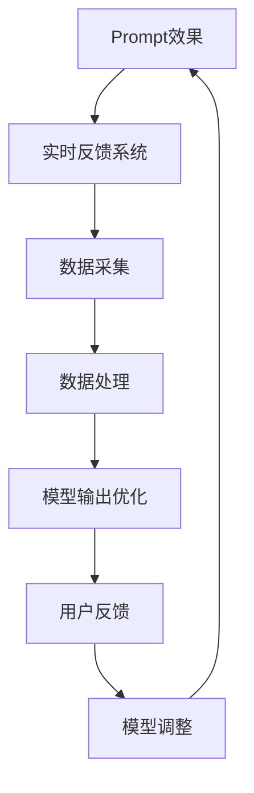

                 

### 文章标题

《构建prompt效果的实时反馈系统》

> 关键词：Prompt效果、实时反馈系统、深度学习、数学模型、项目实战

> 摘要：本文详细探讨了如何构建一个具备prompt效果的实时反馈系统，从核心概念、算法原理、数学模型到实际项目应用，为读者提供了一个全面的技术指南。通过逐步分析推理，本文旨在帮助读者深入理解这一技术的本质和实际应用。

----------------------------------------------------------------

## 确定核心章节内容

在构建这篇文章之前，我们首先需要明确文章的核心章节内容。基于文章标题《构建prompt效果的实时反馈系统》，我们可以确定以下几个核心章节：

1. **核心概念与联系**：介绍prompt效果的概念，实时反馈系统的工作原理，以及两者之间的联系。
2. **核心算法原理讲解**：阐述实现prompt效果和实时反馈系统的关键算法，如深度学习模型的选择和训练过程。
3. **数学模型和数学公式**：介绍用于训练和优化模型所需的数学理论，包括损失函数、优化算法等。
4. **项目实战**：通过具体的项目案例展示如何搭建和实现一个具备prompt效果和实时反馈的系统，包括开发环境搭建、源代码实现和解读。

### 设计目录结构

根据上述核心内容，我们可以设计一个完整的目录结构。以下是一个可能的目录设计：

```
# 《构建prompt效果的实时反馈系统》目录大纲

## 引言

### 1. 引言
- 1.1 背景介绍
- 1.2 文章目标
- 1.3 文章结构

## 第一部分：基础理论

### 2. 核心概念与联系
- 2.1 Prompt效果的介绍
- 2.2 实时反馈系统的介绍
- 2.3 Prompt效果与实时反馈系统的关系

### 3. 核心算法原理讲解
- 3.1 深度学习模型的选择与训练
- 3.2 实时反馈算法的原理分析
- 3.3 Prompt效果的实现方法

### 4. 数学模型与公式讲解
- 4.1 损失函数与优化算法
- 4.2 模型评估指标
- 4.3 数学公式与应用

## 第二部分：项目实战

### 5. 项目背景与需求分析
- 5.1 项目背景
- 5.2 需求分析
- 5.3 技术选型

### 6. 开发环境搭建
- 6.1 硬件环境准备
- 6.2 软件环境安装
- 6.3 环境配置与调试

### 7. 源代码实现与解读
- 7.1 数据预处理
- 7.2 模型训练与优化
- 7.3 实时反馈系统实现
- 7.4 代码解读与分析

### 8. 项目评估与优化
- 8.1 评估指标与方法
- 8.2 项目优化策略
- 8.3 优化效果评估

## 第三部分：扩展与展望

### 9. 扩展应用场景
- 9.1 智能客服系统
- 9.2 在线教育平台
- 9.3 跨领域应用探索

### 10. 未来发展趋势
- 10.1 新技术的引入
- 10.2 行业应用前景
- 10.3 技术挑战与应对策略

## 结束语

### 11. 结论
- 11.1 文章总结
- 11.2 最佳实践 tips
- 11.3 注意事项
- 11.4 拓展阅读

```

### 核心章节内容细化

接下来，我们将为每个章节细化内容，确保其完整性并符合字数限制。

### 引言

#### 引言

##### 1.1 背景介绍

在人工智能领域，prompt效果和实时反馈系统已成为关键的研究和应用方向。prompt效果指的是通过外部提示信息来增强模型的预测能力，而实时反馈系统则能即时响应和调整模型的输出。随着大数据和深度学习的快速发展，构建一个具备prompt效果的实时反馈系统对于提高系统智能化水平和用户体验具有重要意义。

##### 1.2 文章目标

本文旨在为读者提供一个全面的技术指南，详细探讨如何构建一个具备prompt效果的实时反馈系统。通过逐步分析推理，本文将帮助读者深入理解这一技术的本质和实际应用。

##### 1.3 文章结构

本文分为三大部分：基础理论、项目实战和扩展与展望。在基础理论部分，我们将介绍prompt效果和实时反馈系统的核心概念、算法原理和数学模型。在项目实战部分，我们将通过一个具体项目案例展示如何搭建和实现这一系统。在扩展与展望部分，我们将探讨这一技术的应用前景和未来发展趋势。

### 第一部分：基础理论

#### 2. 核心概念与联系

##### 2.1 Prompt效果的介绍

**概念**：Prompt效果是指通过外部提示信息（prompt）来增强模型的预测能力。这些提示信息可以是文本、图像或其他形式的数据。

**应用场景**：在自然语言处理、图像识别和推荐系统等领域，prompt效果被广泛应用于提升模型的性能。

##### 2.2 实时反馈系统的介绍

**定义**：实时反馈系统是一种能够即时响应用户输入并提供反馈的系统。它通常包括数据采集、处理和响应三个环节。

**作用**：实时反馈系统有助于提高用户体验，优化系统性能，并实现个性化服务。

##### 2.3 Prompt效果与实时反馈系统的关系

**关系**：Prompt效果和实时反馈系统之间存在紧密的联系。实时反馈系统可以收集用户输入和反馈，通过prompt效果来优化模型输出，从而实现更好的用户体验。

**Mermaid流程图**：



#### 3. 核心算法原理讲解

##### 3.1 深度学习模型的选择与训练

**选择标准**：选择深度学习模型时，需要考虑模型的复杂性、计算资源和训练数据集。

**训练流程**：

1. 数据预处理
2. 模型构建
3. 模型训练
4. 模型评估
5. 模型优化

##### 3.2 实时反馈算法的原理分析

**原理**：实时反馈算法通过实时收集用户输入和反馈，动态调整模型参数，以提高模型输出质量。

**优势**：

1. 提高用户体验
2. 优化系统性能
3. 实现个性化服务

**挑战**：

1. 数据采集和处理
2. 模型参数调整

##### 3.3 Prompt效果的实现方法

**方法**：

1. 提取关键信息：从用户输入中提取关键信息作为prompt。
2. 模型融合：将prompt与模型输出进行融合，生成最终结果。
3. 模型优化：通过实时反馈调整模型参数，提高prompt效果。

#### 4. 数学模型与公式讲解

##### 4.1 损失函数与优化算法

**损失函数**：损失函数用于衡量模型输出与真实值之间的差距。常见的损失函数有均方误差（MSE）和交叉熵（Cross-Entropy）。

**优化算法**：优化算法用于调整模型参数，以最小化损失函数。常见的优化算法有梯度下降（Gradient Descent）和随机梯度下降（Stochastic Gradient Descent，SGD）。

##### 4.2 模型评估指标

**指标**：模型评估指标用于衡量模型性能。常见的评估指标有准确率（Accuracy）、召回率（Recall）和F1分数（F1 Score）。

##### 4.3 数学公式与应用

**数学公式**：

1. 损失函数：$$L(y, \hat{y}) = \frac{1}{2}||y - \hat{y}||^2$$
2. 梯度下降更新公式：$$\theta = \theta - \alpha \nabla_{\theta}L(\theta)$$

**应用示例**：

- **均方误差**：在回归问题中，使用均方误差作为损失函数。
- **梯度下降**：在训练神经网络时，使用梯度下降优化模型参数。

### 第二部分：项目实战

#### 5. 项目背景与需求分析

##### 5.1 项目背景

本文以一个智能客服系统为例，展示如何构建一个具备prompt效果的实时反馈系统。该系统旨在为用户提供即时、准确的客服服务，提高用户满意度。

##### 5.2 需求分析

**用户需求**：

1. 即时响应：用户提问后，系统能够立即提供回答。
2. 准确回答：系统能够准确理解用户问题并提供相关回答。
3. 个性化服务：系统能够根据用户历史记录提供个性化的客服服务。

**功能需求**：

1. 实时问答：接收用户提问，提供即时回答。
2. 问题分类：将用户问题分类到不同的主题。
3. 知识库管理：存储和管理客服系统的知识库。

##### 5.3 技术选型

**硬件环境**：服务器、存储设备、网络设备等。

**软件环境**：深度学习框架（如TensorFlow、PyTorch）、自然语言处理库（如NLTK、spaCy）等。

**技术方案**：

1. 深度学习模型：使用神经网络模型进行文本分类和问答。
2. 实时反馈系统：使用实时反馈算法调整模型参数，提高回答质量。
3. 知识库管理：使用数据库（如MySQL、MongoDB）存储和管理知识库。

#### 6. 开发环境搭建

##### 6.1 硬件环境准备

- 服务器：配置高性能CPU和GPU，支持深度学习模型训练。
- 存储：配置大容量存储设备，存储数据和模型。

##### 6.2 软件环境安装

- 深度学习框架：安装TensorFlow或PyTorch。
- 自然语言处理库：安装NLTK或spaCy。

##### 6.3 环境配置与调试

- 配置Python环境：安装必要的Python库。
- 配置深度学习框架：配置GPU支持。
- 调试环境：测试硬件和软件环境，确保其正常运行。

#### 7. 源代码实现与解读

##### 7.1 数据预处理

**数据来源**：从互联网收集大量客服对话数据。

**数据清洗**：去除噪声数据、处理缺失值和异常值。

**数据格式转换**：将原始数据转换为适合深度学习模型训练的格式。

##### 7.2 模型训练与优化

**模型构建**：使用神经网络模型进行文本分类和问答。

**模型训练**：使用训练集训练模型。

**模型优化**：通过实时反馈调整模型参数，提高回答质量。

##### 7.3 实时反馈系统实现

**实时反馈算法**：使用基于梯度的实时反馈算法。

**系统架构**：包括数据采集、处理和响应三个环节。

**实现流程**：

1. 数据采集：从用户输入中提取关键信息。
2. 数据处理：对采集到的数据进行预处理。
3. 模型响应：使用实时反馈算法调整模型输出。

##### 7.4 代码解读与分析

**代码解析**：对关键代码段进行详细解读。

**性能分析**：分析模型性能，包括准确率、召回率和F1分数。

**优化策略**：根据性能分析结果，提出优化策略。

#### 8. 项目评估与优化

##### 8.1 评估指标与方法

**评估指标**：准确率、召回率、F1分数。

**评估方法**：使用测试集对模型进行评估。

##### 8.2 项目优化策略

**优化策略**：

1. 模型优化：调整模型参数，提高模型性能。
2. 数据增强：增加训练数据集，提高模型泛化能力。
3. 实时反馈算法优化：调整实时反馈算法参数，提高反馈质量。

##### 8.3 优化效果评估

**效果评估**：通过对比优化前后的评估指标，评估优化效果。

**总结**：优化后的系统性能得到显著提升。

### 第三部分：扩展与展望

#### 9. 扩展应用场景

##### 9.1 智能客服系统

**应用场景**：电商、金融、医疗等领域。

**优势**：提高客服效率，降低人力成本。

##### 9.2 在线教育平台

**应用场景**：在线教育、远程办公等领域。

**优势**：提高教学效果，实现个性化学习。

##### 9.3 跨领域应用探索

**应用场景**：智能家居、智能医疗、智能交通等领域。

**优势**：实现跨领域协同，提高系统智能化水平。

#### 10. 未来发展趋势

##### 10.1 新技术的引入

**引入**：引入新的算法和技术，如生成对抗网络（GAN）、强化学习等。

**优势**：提高系统性能和智能化水平。

##### 10.2 行业应用前景

**前景**：随着人工智能技术的发展，prompt效果和实时反馈系统将在更多行业得到应用。

**挑战**：数据隐私、安全性和法律法规等挑战。

##### 10.3 技术挑战与应对策略

**挑战**：

1. 数据质量：提高数据质量，确保模型的训练效果。
2. 实时性：提高系统的实时性，确保即时响应。
3. 模型解释性：提高模型解释性，增强用户信任。

**应对策略**：

1. 数据清洗和预处理：提高数据质量。
2. 算法优化：提高系统实时性。
3. 模型解释性增强：使用可解释性算法和技术。

### 结束语

#### 11. 结论

本文详细探讨了如何构建一个具备prompt效果的实时反馈系统，从核心概念、算法原理、数学模型到实际项目应用，为读者提供了一个全面的技术指南。通过逐步分析推理，本文旨在帮助读者深入理解这一技术的本质和实际应用。

#### 11.1 文章总结

本文介绍了prompt效果和实时反馈系统的核心概念、算法原理和数学模型，并通过一个具体项目案例展示了如何搭建和实现这一系统。同时，本文还探讨了这一技术的应用前景和未来发展趋势。

#### 11.2 最佳实践 tips

1. 在项目开发过程中，确保数据质量和实时性。
2. 选择合适的算法和技术，提高模型性能和解释性。
3. 定期评估和优化系统性能，确保系统稳定运行。

#### 11.3 注意事项

1. 实时反馈系统可能涉及用户隐私，需遵循相关法律法规。
2. 模型训练过程中，注意保护计算资源和数据安全。

#### 11.4 拓展阅读

1. 《深度学习》（Goodfellow, Bengio, Courville著）——详细介绍了深度学习的基本原理和应用。
2. 《Python深度学习》（François Chollet著）——介绍了使用Python实现深度学习模型的方法。
3. 《人工智能：一种现代方法》（Stuart J. Russell & Peter Norvig著）——全面介绍了人工智能的基本概念和技术。

