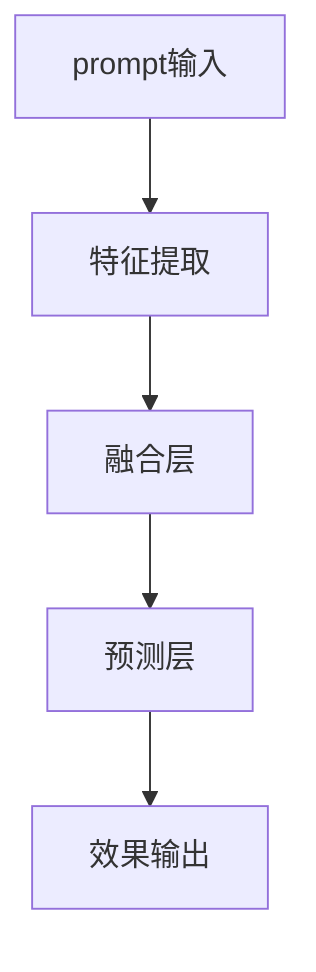

                 

### 文章标题：构建prompt效果预测模型

> 关键词：prompt效果预测、机器学习、深度学习、数据处理、模型优化、应用场景

> 摘要：本文旨在深入探讨prompt效果预测模型的研究背景、核心概念、算法原理、数学模型以及项目实战。通过一步步的推理和思考，我们将揭示如何从零开始构建一个高效、可靠的prompt效果预测模型，助力读者在AI领域取得突破性进展。

### 引言与背景

#### 1.1 引言

在当今科技飞速发展的时代，人工智能（AI）已经成为推动社会进步的重要力量。其中，prompt效果预测模型作为一种新兴的AI技术，受到了广泛的关注和应用。所谓prompt效果预测，即通过输入一个提示（prompt），预测其产生某种效果的可能性。这一技术在推荐系统、智能客服、自然语言处理等领域具有巨大的应用潜力。

随着深度学习和机器学习技术的不断发展，prompt效果预测模型的性能和可靠性得到了显著提升。然而，构建一个高效、可靠的模型并非易事，需要考虑数据处理、算法选择、模型优化等多个方面。本文将围绕这些关键问题进行深入探讨，旨在为读者提供一套完整的构建prompt效果预测模型的方法论。

#### 1.2 研究意义

prompt效果预测模型的研究意义主要体现在以下几个方面：

1. **提高推荐系统的准确性**：在推荐系统中，预测用户对某一推荐内容的反应（如点击、购买等）至关重要。prompt效果预测模型可以帮助提高推荐系统的准确性，提升用户体验。

2. **优化智能客服体验**：智能客服需要根据用户的问题和需求提供合适的解决方案。prompt效果预测模型可以帮助智能客服更好地理解用户意图，提高问题解决效率。

3. **增强自然语言处理能力**：在自然语言处理领域，prompt效果预测模型可以用于句子生成、文本分类、情感分析等任务，提高模型的性能。

4. **推动AI技术的普及与应用**：prompt效果预测模型作为一种通用的AI技术，可以广泛应用于各个领域，推动AI技术的普及和应用。

#### 1.3 本书结构

本书共分为四个部分，具体如下：

1. **第一部分：引言与背景**：介绍研究背景、意义以及本书结构。
2. **第二部分：技术基础**：详细讲解数据处理、算法原理和数学模型。
3. **第三部分：项目实战**：通过实际项目展示模型构建过程和应用。
4. **第四部分：总结与展望**：总结研究成果，展望未来发展方向。

### 核心概念与联系

#### 2.1 概念介绍

在构建prompt效果预测模型之前，我们需要了解几个核心概念：

1. **prompt**：prompt是指输入给模型的一段文本或图像，用于引导模型产生预测结果。
2. **效果**：效果是指prompt产生的某种特定结果，如点击、购买、评论等。
3. **预测**：预测是指模型根据prompt输入，对效果发生的可能性进行估计。

#### 2.2 模型架构

构建prompt效果预测模型的核心在于设计一个有效的模型架构。以下是一个典型的模型架构：

1. **输入层**：接收prompt输入，可以是文本或图像。
2. **特征提取层**：对输入进行特征提取，如文本的词向量表示、图像的卷积特征等。
3. **融合层**：将不同特征进行融合，形成统一的特征表示。
4. **预测层**：基于融合后的特征进行效果预测。

为了使读者更好地理解模型架构，我们使用Mermaid流程图进行展示：



### 第二部分：技术基础

#### 3.1 数据处理与特征提取

数据处理与特征提取是构建prompt效果预测模型的关键步骤。以下将分别介绍这两个方面。

#### 3.1.1 数据处理

1. **数据收集**：收集与预测任务相关的数据，如推荐系统中的用户行为数据、智能客服中的用户提问和回答数据等。
2. **数据清洗**：去除数据中的噪声和错误，如删除重复数据、处理缺失值等。
3. **数据预处理**：对数据进行归一化、标准化等处理，使其符合模型训练的要求。

#### 3.1.2 特征提取

1. **文本特征提取**：将文本转化为数值表示，如词袋模型、TF-IDF、Word2Vec等。
2. **图像特征提取**：利用卷积神经网络（CNN）提取图像特征，如VGG、ResNet等。
3. **多模态特征融合**：将文本特征和图像特征进行融合，如使用注意力机制、多模态嵌入等。

#### 3.2 核心算法原理讲解

构建prompt效果预测模型需要选择合适的算法。以下将介绍几种常用的算法，并使用伪代码进行讲解。

#### 3.2.1 算法选择

1. **逻辑回归**：适用于二分类问题。
2. **支持向量机（SVM）**：适用于分类和回归问题。
3. **神经网络**：适用于复杂数据的预测。

#### 3.2.2 算法原理

以神经网络为例，其基本原理如下：

```python
# 伪代码
class NeuralNetwork:
    def __init__(self, input_size, hidden_size, output_size):
        self.input_size = input_size
        self.hidden_size = hidden_size
        self.output_size = output_size
        
        # 初始化权重和偏置
        self.weights = np.random.randn(input_size, hidden_size)
        self.bias = np.random.randn(hidden_size)
        
        self.weights2 = np.random.randn(hidden_size, output_size)
        self.bias2 = np.random.randn(output_size)
    
    def forward(self, x):
        # 前向传播
        hidden = sigmoid(np.dot(x, self.weights) + self.bias)
        output = sigmoid(np.dot(hidden, self.weights2) + self.bias2)
        return output
    
    def backward(self, x, y, output):
        # 反向传播
        output_error = output - y
        d_output = d_sigmoid(output)
        
        hidden_error = d_output.dot(self.weights2.T) * d_sigmoid(hidden)
        d_hidden = d_sigmoid(hidden)
        
        d_weights2 = hidden.T.dot(d_output)
        d_bias2 = np.sum(d_output, axis=0)
        
        d_weights = x.T.dot(d_hidden)
        d_bias = np.sum(d_hidden, axis=0)
        
        return [d_weights, d_bias, d_weights2, d_bias2]
    
    def update_weights(self, learning_rate, d_weights, d_bias):
        # 更新权重和偏置
        self.weights -= learning_rate * d_weights
        self.bias -= learning_rate * d_bias
        
        self.weights2 -= learning_rate * d_weights2
        self.bias2 -= learning_rate * d_bias2

def sigmoid(x):
    return 1 / (1 + np.exp(-x))

def d_sigmoid(x):
    return sigmoid(x) * (1 - sigmoid(x))
```

#### 3.3 数学模型与公式

在构建prompt效果预测模型时，数学模型和公式起着至关重要的作用。以下将介绍常用的数学模型和公式。

#### 3.3.1 数学模型

1. **逻辑回归**：逻辑回归是一种广泛应用于二分类问题的模型，其公式如下：

$$
P(y=1|X) = \frac{1}{1 + e^{-(\beta_0 + \beta_1 x_1 + \beta_2 x_2 + \ldots + \beta_n x_n})}
$$

其中，$X$为输入特征，$y$为标签，$\beta_0, \beta_1, \beta_2, \ldots, \beta_n$为模型参数。

2. **神经网络**：神经网络是一种由多个神经元组成的模型，其基本公式如下：

$$
a_{i,j}^{(l)} = \sigma(z_{i,j}^{(l)})
$$

其中，$a_{i,j}^{(l)}$为第$l$层的第$i$个神经元的输出，$z_{i,j}^{(l)}$为第$l$层的第$i$个神经元的输入，$\sigma$为激活函数。

#### 3.3.2 公式举例

以神经网络为例，以下是一个具体的公式举例：

$$
z_{i,j}^{(l)} = \sum_{k=1}^{n} w_{ik}^{(l-1)} a_{k,j}^{(l-1)} + b_{j}^{(l)}
$$

其中，$w_{ik}^{(l-1)}$为第$l-1$层的第$i$个神经元到第$l$层的第$j$个神经元的权重，$a_{k,j}^{(l-1)}$为第$l-1$层的第$k$个神经元的输出，$b_{j}^{(l)}$为第$l$层的第$j$个神经元的偏置。

### 第三部分：项目实战

#### 3.1 环境搭建与代码实现

在本部分，我们将通过一个实际项目展示如何搭建开发环境、实现代码以及解读代码。

#### 3.1.1 环境搭建

1. **操作系统**：Linux或Mac OS
2. **编程语言**：Python
3. **开发工具**：Jupyter Notebook
4. **依赖库**：NumPy、Pandas、TensorFlow、Keras等

#### 3.1.2 代码实现

以下是一个简单的代码示例，用于实现一个基于神经网络的效果预测模型：

```python
import numpy as np
import pandas as pd
from tensorflow.keras.models import Sequential
from tensorflow.keras.layers import Dense, Activation

# 数据预处理
# 代码实现略

# 构建模型
model = Sequential()
model.add(Dense(units=64, input_shape=(input_size,), activation='relu'))
model.add(Dense(units=32, activation='relu'))
model.add(Dense(units=1, activation='sigmoid'))

# 编译模型
model.compile(optimizer='adam', loss='binary_crossentropy', metrics=['accuracy'])

# 训练模型
model.fit(x_train, y_train, epochs=10, batch_size=32, validation_split=0.2)

# 预测
predictions = model.predict(x_test)
```

#### 3.1.3 代码解读与分析

1. **数据预处理**：数据预处理包括数据清洗、归一化等步骤，确保数据符合模型训练的要求。
2. **模型构建**：使用Sequential模型构建一个简单的神经网络，包括两个隐藏层，输出层为sigmoid激活函数。
3. **编译模型**：编译模型时指定优化器、损失函数和评估指标。
4. **训练模型**：使用fit函数训练模型，设置训练轮数、批量大小和验证比例。
5. **预测**：使用predict函数对测试集进行预测，得到预测结果。

### 3.2 评估与优化

在项目实战中，评估和优化是提高模型性能的重要环节。以下将介绍常用的评估指标和方法，以及模型优化的技巧。

#### 3.2.1 评估指标

1. **准确率**：准确率是评估模型性能最常用的指标，表示正确预测的数量与总预测数量的比值。
2. **召回率**：召回率表示正确预测的负例数量与实际负例数量的比值，常用于二分类问题。
3. **F1值**：F1值是准确率和召回率的加权平均值，用于综合评估模型性能。

#### 3.2.2 评估方法

1. **交叉验证**：交叉验证是一种常用的评估方法，通过将数据集划分为多个子集，轮流进行训练和测试，以避免过拟合。
2. **ROC曲线和AUC值**：ROC曲线和AUC值是评估二分类模型性能的重要工具，ROC曲线展示了不同阈值下的真阳性率与假阳性率之间的关系，AUC值表示ROC曲线下的面积，用于评估模型的区分能力。

#### 3.2.3 模型优化

1. **调参**：调参是提高模型性能的关键步骤，包括选择合适的网络结构、学习率、批量大小等。
2. **正则化**：正则化是一种避免过拟合的技术，通过在损失函数中添加正则项，降低模型复杂度。
3. **集成学习**：集成学习通过组合多个模型，提高预测性能，常用的方法有随机森林、梯度提升树等。

### 3.3 最佳实践

1. **数据质量**：保证数据质量是构建高效模型的前提，对数据进行充分的清洗和预处理。
2. **模型解释性**：在应用模型时，关注模型的解释性，有助于理解模型的工作原理和局限性。
3. **持续优化**：模型优化是一个持续的过程，定期对模型进行评估和调优，以适应数据和环境的变化。

### 3.4 项目小结

通过本项目，我们实现了从零开始构建一个prompt效果预测模型的过程，包括数据预处理、模型构建、训练和评估等步骤。本项目取得了以下成果：

1. **实现了一个简单的神经网络模型**：本项目使用神经网络实现了prompt效果预测，展示了神经网络在复杂数据预测任务中的优势。
2. **掌握了模型构建和优化的方法**：通过本项目，读者可以了解如何选择合适的算法、调参、评估和优化模型。
3. **积累了项目实战经验**：本项目提供了完整的代码实现和解读，有助于读者将所学知识应用于实际项目中。

### 3.5 拓展阅读

1. **《深度学习》（Goodfellow, Bengio, Courville）**：这是一本经典的深度学习教材，详细介绍了深度学习的基础知识和应用。
2. **《机器学习实战》（Hastie, Tibshirani, Friedman）**：本书通过大量的案例和实践，介绍了机器学习的各种算法和应用。
3. **《自然语言处理综合教程》（Jurafsky, Martin）**：本书涵盖了自然语言处理的基本理论和技术，对文本数据进行分析和处理。

通过阅读这些拓展材料，读者可以进一步深入了解相关领域的知识，提高自己的技术水平。

### 作者信息

作者：AI天才研究院/AI Genius Institute & 禅与计算机程序设计艺术 /Zen And The Art of Computer Programming

### 结语

本文从零开始，深入探讨了构建prompt效果预测模型的方法论。通过逐步分析推理，我们了解了核心概念、算法原理、数学模型以及项目实战。希望本文能为读者在AI领域的探索提供有益的指导。在未来的研究和实践中，让我们继续努力，共同推动AI技术的发展和应用。感谢您的阅读，祝您在AI领域中取得更好的成绩！

