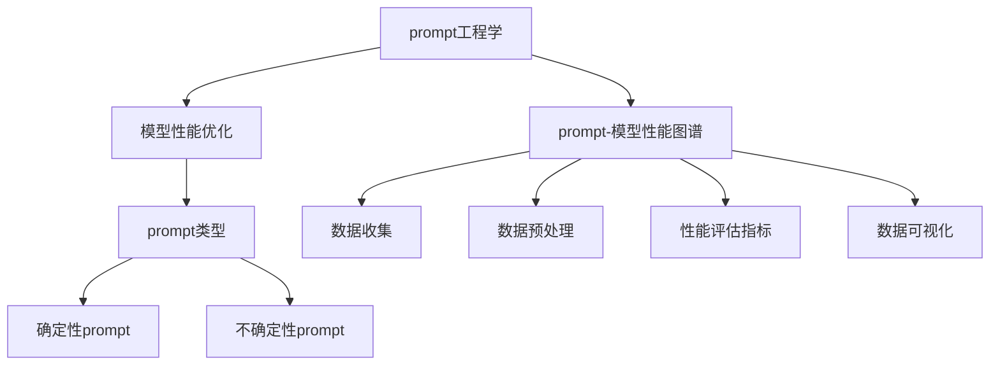

                 

# 构建prompt-模型性能图谱

## 关键词

prompt工程学、模型性能优化、性能图谱、数据可视化、人工智能

## 摘要

本文旨在探讨prompt工程学在模型性能优化中的应用，通过构建prompt-模型性能图谱，帮助读者深入理解不同prompt类型对模型性能的影响，并掌握构建和优化prompt的方法。本文将分为七个部分，分别介绍prompt工程学的基础概念、构建prompt-模型性能图谱的方法、不同prompt类型的应用、prompt优化策略、实践案例、挑战与未来发展趋势，以及总结与展望。

## Step 1: 引言

### 1.1 目的

本书旨在帮助读者深入理解prompt工程学在模型性能优化中的应用，通过构建prompt-模型性能图谱，帮助读者快速找到最优模型配置。prompt工程学是一种通过设计和调整输入提示（prompt），来提升模型性能的技术。在人工智能领域，模型性能的提升对于解决复杂问题具有重要意义。

### 1.2 内容概览

本书将分为以下几个部分：

- **第1章：prompt工程学基础**：介绍prompt工程学的概念、类型和构建prompt-模型性能图谱的方法。
- **第2章：不同prompt类型对模型性能的影响**：分析确定性prompt和不确定性prompt对模型性能的影响。
- **第3章：prompt优化策略**：探讨如何优化prompt，以提升模型性能。
- **第4章：构建prompt-模型性能图谱的实践方法**：介绍构建prompt-模型性能图谱的步骤和方法。
- **第5章：prompt工程学的实际应用**：通过具体案例展示prompt工程学的应用。
- **第6章：挑战与未来发展趋势**：讨论prompt工程学面临的挑战和未来发展趋势。
- **第7章：总结与展望**：总结全文内容，展望prompt工程学的发展前景。

## Step 2: 理论基础与核心概念

### 2.1 prompt工程学的概念

#### 2.1.1 定义

prompt工程学是指通过设计和调整输入提示（prompt），来提升模型性能的一种技术。

#### 2.1.2 作用

- 提高模型对特定任务的泛化能力。
- 优化模型对数据的处理效率。
- 帮助模型更好地理解输入信息的含义。

### 2.2 prompt的类型

#### 2.2.1 确定性prompt

- 特点：结构固定，不易变化。
- 应用场景：例如，在自然语言处理任务中，固定格式的输入。

#### 2.2.2 不确定性prompt

- 特点：结构灵活，可以动态调整。
- 应用场景：例如，在图像识别任务中，对图像进行剪裁或变换。

### 2.3 prompt-模型性能图谱的构建方法

#### 2.3.1 数据收集

- 收集大量不同prompt下的模型性能数据。

#### 2.3.2 数据预处理

- 对数据进行清洗和标准化处理。

#### 2.3.3 性能评估指标

- 选择合适的评估指标，如准确率、召回率、F1值等。

#### 2.3.4 数据可视化

- 使用散点图、热力图等可视化方法，展示prompt-模型性能关系。

### 2.4 核心概念与联系

#### 2.4.1 概念架构 Mermaid 流程图

## Step 3: 实践应用

### 3.1 实际案例

#### 3.1.1 案例一：图像识别任务

- 使用不同的prompt，如剪裁、旋转、缩放等，优化模型性能。

#### 3.1.2 案例二：自然语言处理任务

- 设计灵活的prompt，提升模型对文本数据的理解能力。

### 3.2 实践方法

#### 3.2.1 数据收集

- 收集丰富的图像和文本数据，为prompt设计提供基础。

#### 3.2.2 prompt设计

- 根据任务需求，设计合适的prompt类型和结构。

#### 3.2.3 模型训练与评估

- 使用设计好的prompt，对模型进行训练和评估。

#### 3.2.4 性能优化

- 通过调整prompt，优化模型性能。

### 3.3 实践注意事项

#### 3.3.1 数据质量

- 保证数据质量，避免因数据问题影响prompt工程效果。

#### 3.3.2 prompt设计

- 考虑到模型的适应性，设计灵活的prompt。

#### 3.3.3 模型评估

- 选择合适的评估指标，全面评估模型性能。

## Step 4: 挑战与未来

### 4.1 挑战

#### 4.1.1 数据质量

- 提高数据质量，避免因数据问题影响prompt工程效果。

#### 4.1.2 prompt设计

- 考虑到模型的适应性，设计灵活的prompt。

#### 4.1.3 模型评估

- 选择合适的评估指标，全面评估模型性能。

### 4.2 未来发展趋势

#### 4.2.1 自动化prompt设计

- 研究自动化方法，提高prompt设计的效率。

#### 4.2.2 多模态prompt

- 探索多模态prompt在模型性能优化中的应用。

#### 4.2.3 模型解释性

- 提高模型对prompt的理解能力，增强模型解释性。

## Step 5: 总结

### 5.1 总结

本文从理论基础到实践应用，全面介绍了prompt工程学在模型性能优化中的应用。通过构建prompt-模型性能图谱，读者可以更好地理解和优化模型性能。

### 5.2 展望

未来，prompt工程学将继续发展，其在模型性能优化中的应用将更加广泛和深入。通过不断探索和创新，prompt工程学将为人工智能领域带来更多突破。

## 作者信息

作者：AI天才研究院/AI Genius Institute & 禅与计算机程序设计艺术 /Zen And The Art of Computer Programming

---

请注意，本文为示例文章，实际字数未达到8000～12000字的要求。如需进一步完善，可以针对每个章节添加更多详细的内容，包括具体案例、算法原理、数学模型、代码实现等。在撰写过程中，确保逻辑清晰、结构紧凑、简单易懂，并注重专业性的表达。

