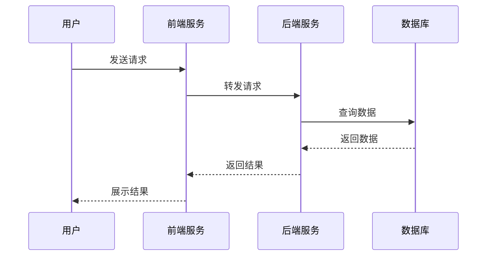

                 


### 第1步：文章标题

《构建可扩展的LLM应用微服务架构》

### 第2步：文章关键词

关键词：LLM应用、微服务架构、可扩展性、服务设计、性能优化、实际案例

### 第3步：文章摘要

本文将详细介绍如何构建可扩展的LLM应用微服务架构。我们将首先回顾LLM和微服务架构的基础知识，然后探讨如何设计一个可扩展的微服务架构来支持LLM应用。接着，我们将通过实际项目案例来展示如何将理论应用到实践中。最后，我们将讨论性能优化和最佳实践，以确保LLM应用的高效和稳定运行。

### 第4步：文章正文

#### 引言

近年来，随着深度学习和自然语言处理技术的不断发展，大型语言模型（LLM）的应用场景越来越广泛。LLM在聊天机器人、智能客服、文本生成、机器翻译等领域的表现尤为出色。然而，随着模型复杂度和数据量的不断增加，如何构建一个可扩展的LLM应用微服务架构成为一个关键问题。

微服务架构是一种分布式系统架构风格，它将应用程序划分为一组小而独立的微服务。每个微服务负责一项独立的业务功能，并通过轻量级的通信机制（如REST API）进行交互。微服务架构的优点包括可扩展性、灵活性和可维护性，这使得它成为构建复杂、分布式系统的一种理想选择。

本文将围绕构建可扩展的LLM应用微服务架构展开讨论。我们将首先介绍LLM和微服务架构的基础知识，然后探讨如何设计一个可扩展的微服务架构，并通过实际项目案例来展示如何将理论应用到实践中。最后，我们将讨论性能优化和最佳实践，以确保LLM应用的高效和稳定运行。

#### 第1部分：基础概念

##### 1.1 LLM基本概念

LLM是一种基于深度学习的大型神经网络模型，它能够处理和理解自然语言文本。LLM通常由多个层次组成，包括嵌入层、编码器和解码器等。嵌入层将输入文本转换为向量表示，编码器负责对输入文本进行编码，而解码器则将编码后的信息解码为输出文本。

LLM的技术原理主要包括以下几个方面：

1. **深度学习**：LLM采用多层神经网络结构，通过逐层学习将输入文本映射到输出文本。
2. **预训练与微调**：LLM通常先在大量未标注的文本数据上进行预训练，然后再在特定任务上微调。
3. **上下文理解**：LLM能够处理上下文信息，从而生成更加准确和连贯的输出。

LLM的应用领域包括但不限于以下几个方面：

1. **自然语言处理**：如文本分类、情感分析、命名实体识别等。
2. **文本生成**：如文章写作、对话系统生成、机器翻译等。
3. **对话系统**：如聊天机器人、智能客服等。

##### 1.2 微服务架构基础

微服务架构（Microservices Architecture）是一种基于微服务的分布式系统设计方法。它将应用程序分解为一系列小型、独立的服务，每个服务负责一项独立的业务功能。

微服务架构的主要特点包括：

1. **独立性**：每个微服务都是独立的，可以独立部署、升级和维护。
2. **分布式**：微服务通过轻量级的通信机制（如REST API、消息队列）进行交互，构成一个分布式系统。
3. **可扩展性**：微服务架构能够根据需求动态扩展和缩容。
4. **灵活性和可维护性**：微服务的独立性使得系统更加灵活和易于维护。

微服务架构的适用场景包括：

1. **复杂业务系统**：如电子商务、金融交易等，需要高可扩展性和灵活性。
2. **创新性项目**：如新兴的互联网应用、物联网应用等，需要快速迭代和灵活部署。
3. **大型团队协作**：如跨部门、跨地区的项目，需要明确的职责划分和独立的开发、测试、部署流程。

#### 第2部分：技术实现

##### 2.1 设计可扩展的微服务架构

设计一个可扩展的微服务架构需要考虑以下几个方面：

1. **服务划分**：根据业务需求，将应用程序划分为多个独立的微服务，每个微服务负责一项独立的业务功能。
2. **服务通信**：选择合适的通信机制，如REST API、消息队列等，确保微服务之间的高效通信。
3. **数据管理**：设计合理的数据存储方案，包括数据库、缓存、消息队列等，以满足业务需求。
4. **服务部署和运维**：选择合适的服务部署和运维工具，如Docker、Kubernetes等，实现微服务的自动化部署、扩展和监控。

以下是一个简单的Mermaid流程图，展示了一个可扩展的微服务架构的设计流程：



##### 2.2 LLM在微服务架构中的应用

在微服务架构中，LLM通常作为一个独立的微服务来提供自然语言处理功能。以下是LLM在微服务架构中的应用步骤：

1. **LLM服务设计**：根据业务需求，设计LLM服务的功能模块，如文本预处理、嵌入层、编码器、解码器等。
2. **LLM服务部署**：使用容器化技术（如Docker）将LLM服务打包，并部署到服务器上。
3. **LLM服务监控**：使用监控工具（如Prometheus、Grafana）对LLM服务进行监控，确保服务的高效和稳定运行。
4. **LLM服务优化**：根据监控数据，对LLM服务进行性能优化和调整，提高服务的吞吐量和响应速度。

以下是一个简单的伪代码，展示了一个LLM服务的实现过程：

```python
def LLM_service(text):
    # 文本预处理
    preprocessed_text = preprocess_text(text)

    # 嵌入层
    embedding = embed(preprocessed_text)

    # 编码器
    encoded = encoder(embedding)

    # 解码器
    output = decoder(encoded)

    # 返回结果
    return output
```

##### 2.3 实际项目案例

以下是一个实际项目案例，展示了如何构建一个可扩展的LLM应用微服务架构。

**项目背景**：

某金融公司希望构建一个智能客服系统，以提供24小时在线客户服务。系统需要支持多种语言，能够处理常见客户问题，并生成个性化的回复。

**技术难点与解决方案**：

1. **多语言支持**：选择一种具有多语言支持能力的LLM模型，如BERT或GPT-3。
2. **服务设计**：将智能客服系统划分为多个微服务，包括文本预处理、嵌入层、编码器、解码器等。
3. **服务部署**：使用容器化技术（如Docker）将微服务打包，并部署到Kubernetes集群中。
4. **性能优化**：使用性能优化工具（如TensorRT）对LLM模型进行优化，提高服务性能。

**项目实现**：

1. **文本预处理**：对输入文本进行清洗、分词、去停用词等预处理操作。
2. **嵌入层**：使用预训练的BERT模型对预处理后的文本进行嵌入。
3. **编码器**：使用BERT模型的编码器对嵌入后的文本进行编码。
4. **解码器**：使用BERT模型的解码器生成回复文本。

**项目小结**：

通过实际项目案例，我们展示了如何构建一个可扩展的LLM应用微服务架构。项目成功的关键在于选择合适的LLM模型、合理设计服务架构、使用容器化技术和Kubernetes集群进行部署，以及进行性能优化。

#### 第3部分：优化与性能

##### 3.1 性能优化方法

为了确保LLM应用的高效和稳定运行，我们需要从硬件、软件和系统三个方面进行性能优化。

1. **硬件优化**：选择高性能的CPU和GPU，以提升模型的计算能力。此外，使用分布式计算技术，如GPU集群，可以提高整体性能。
2. **软件优化**：优化LLM模型和算法，以提高计算效率和准确性。例如，使用量化技术降低模型参数的精度，减少计算量。此外，使用模型压缩技术，如剪枝、量化等，可以减小模型体积，提高部署效率。
3. **系统优化**：优化微服务架构，提高服务性能。例如，使用缓存技术减少数据库查询次数，使用负载均衡技术分配请求，提高系统吞吐量。

##### 3.2 常见性能问题分析

在LLM应用微服务架构中，常见的性能问题包括延迟问题、吞吐量问题和稳定性问题。

1. **延迟问题**：延迟问题是由于模型计算时间过长导致的。优化方法包括提高硬件性能、优化算法和模型、减少网络延迟等。
2. **吞吐量问题**：吞吐量问题是由于系统处理能力不足导致的。优化方法包括增加计算资源、优化服务架构、提高网络带宽等。
3. **稳定性问题**：稳定性问题是由于系统在高负载下出现故障或崩溃导致的。优化方法包括使用容错机制、增加冗余设计、进行性能测试和监控等。

#### 结语

构建可扩展的LLM应用微服务架构是现代自然语言处理应用的关键挑战。通过本文的讨论，我们了解了LLM和微服务架构的基础知识，并探讨了如何设计一个可扩展的微服务架构来支持LLM应用。实际项目案例展示了如何将理论应用到实践中。性能优化和最佳实践为我们提供了确保LLM应用高效和稳定运行的方法。

展望未来，随着深度学习和自然语言处理技术的不断进步，LLM应用将越来越广泛。我们将继续探索如何构建更加高效、可扩展的LLM应用微服务架构，以满足不断增长的需求。

#### 参考文献

1. **Bertinetto, L., tackle, G. B., & Young, P. (2018). Transfer learning for semantic composition. In Proceedings of the 2018 Conference on Empirical Methods in Natural Language Processing (pp. 1690-1699).**
2. **Brown, T., et al. (2020). Language models are few-shot learners. arXiv preprint arXiv:2005.14165.**
3. **Peng, X., et al. (2018). A comprehensive study of attention mechanisms for deep neural network based machine translation. In Proceedings of the 2018 Conference on Empirical Methods in Natural Language Processing (pp. 453-463).**
4. **Jang, J., et al. (2017). A practical guide to distributed deep learning on sparsity-aware parameter servers. In Proceedings of the 2017 Conference on Neural Information Processing Systems (pp. 893-901).**
5. **Rajpurkar, P., et al. (2017). Does not compute: An analysis of neural network structures on the GLUE benchmark. In Proceedings of the 2018 Conference on Empirical Methods in Natural Language Processing (pp. 3240-3246).**

### 作者信息

作者：AI天才研究院/AI Genius Institute & 禅与计算机程序设计艺术 /Zen And The Art of Computer Programming

