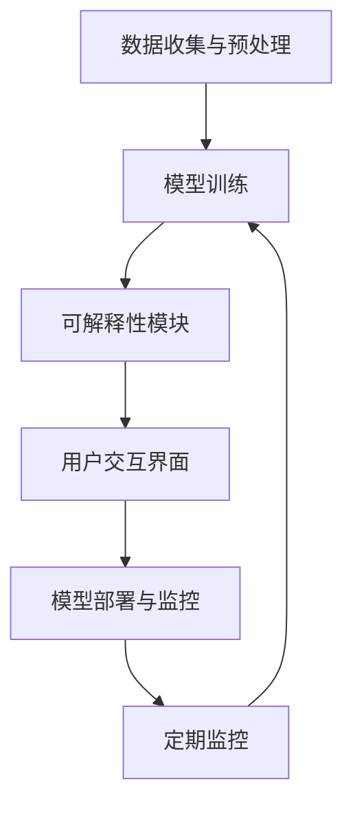

                 

### 引言

#### 1.1 可解释的LLM概述

近年来，随着深度学习技术的飞速发展，大型语言模型（LLM，Large Language Model）已经成为自然语言处理（NLP，Natural Language Processing）领域的重要研究方向。LLM通过训练海量文本数据，可以生成高质量的文本、进行语义理解、回答问题等，展现出强大的语义理解能力和生成能力。然而，这些模型通常被称为“黑盒”，其内部工作机制和决策过程对于人类用户来说是不可解释的，这使得LLM在实际应用中面临着诸多挑战。

“可解释性”（Explainability）是近年来在人工智能领域受到广泛关注的一个概念。可解释性指的是模型决策过程的透明性和可理解性，使得人类用户能够理解模型的决策过程和原因。在LLM应用中，可解释性尤为重要，因为它关系到模型的可信度和用户对模型的接受程度。例如，在医疗诊断、金融风险评估等关键领域，决策的可解释性对于用户信任和合规性至关重要。

本文将围绕“构建可解释的LLM应用系统”这一主题，深入探讨可解释性在LLM中的应用。文章将首先介绍LLM的基本概念和可解释性的重要性，然后详细讲解构建可解释性LLM所需的核心技术和方法，并通过实际案例展示如何应用这些技术。此外，还将讨论相关的工具和资源，并对可解释性LLM的未来发展趋势进行展望。

本文旨在为读者提供全面、系统的关于可解释性LLM的知识体系，帮助读者理解可解释性的核心概念、技术原理和应用实践，从而为实际项目提供参考和指导。

#### 1.2 本书结构

为了使读者能够系统地掌握构建可解释的LLM应用系统的知识，本文将分为以下几个主要部分：

1. **基础理论**：本部分将介绍大型语言模型（LLM）的基本概念、原理和架构。我们将从LLM的定义、发展历程、主要类型等方面进行讲解，帮助读者建立对LLM的整体认知。

2. **核心概念与联系**：在这一部分，我们将详细阐述可解释性的定义、重要性以及与LLM的关联。通过Mermaid流程图，展示可解释性在LLM中的应用架构，帮助读者理解可解释性的核心概念和其与LLM的内在联系。

3. **核心技术**：本部分将深入讲解构建可解释性LLM所需的核心算法和技术。我们将详细介绍相关算法的原理，使用伪代码和数学模型来详细阐述，帮助读者理解算法的实现细节和计算过程。

4. **应用案例**：在本部分，我们将通过实际案例展示如何将可解释性LLM应用于不同场景。我们将详细讲解案例背景、应用场景、源代码实现和代码解读，帮助读者理解可解释性LLM的实际应用效果和优势。

5. **工具与资源**：我们将介绍与构建可解释性LLM相关的开发环境和工具，提供实用工具和框架推荐，帮助读者搭建和优化可解释性LLM系统。

6. **未来展望**：最后，我们将讨论可解释性LLM的发展趋势和潜在挑战，展望可解释性在LLM领域的未来发展，为读者提供行业发展的前沿信息。

通过以上结构的安排，本文将系统性地介绍可解释性LLM的核心概念、技术原理和应用实践，帮助读者全面掌握构建可解释性LLM的知识和技能。

### 基础理论

#### 2.1 LLM概念介绍

大型语言模型（LLM，Large Language Model）是自然语言处理（NLP，Natural Language Processing）领域的一种重要技术，它通过深度学习算法对大量文本数据进行训练，从而能够理解和生成自然语言。LLM的发展历程可以追溯到上世纪80年代，当时研究人员开始探索使用统计模型处理文本数据。然而，随着计算能力和数据量的不断提升，深度学习技术逐渐成为LLM发展的主流。

LLM的主要类型包括：

1. **基于规则的模型**：这类模型通过定义一系列规则来处理文本数据，例如解析文法规则、词性标注规则等。这类模型的优点是实现简单，但缺点是规则过于繁琐且难以扩展。

2. **统计模型**：统计模型通过统计文本数据中的词频、词序等信息来预测文本的下一个单词或短语。典型的统计模型包括n元语法模型（n-gram model）、隐马尔可夫模型（HMM，Hidden Markov Model）和条件概率模型等。尽管统计模型在一定程度上提高了文本处理的性能，但它们在处理复杂语言结构和语义理解方面仍然存在局限。

3. **神经网络模型**：随着深度学习技术的兴起，基于神经网络的模型在NLP领域得到了广泛应用。其中，最著名的神经网络模型之一是循环神经网络（RNN，Recurrent Neural Network）。RNN通过记忆单元来处理序列数据，可以较好地捕捉文本中的长距离依赖关系。然而，RNN在处理长文本时存在梯度消失或梯度爆炸的问题。

4. **注意力机制模型**：为了解决RNN的梯度消失问题，研究人员提出了注意力机制（Attention Mechanism）。注意力机制通过为输入序列中的每个单词分配不同的权重，从而提高了模型对长文本的处理能力。典型的注意力机制模型包括长短期记忆网络（LSTM，Long Short-Term Memory）和门控循环单元（GRU，Gated Recurrent Unit）。此外，基于注意力机制的 Transformer 模型在 NLP 领域取得了显著的性能提升。

5. **预训练与微调**：近年来，预训练（Pre-training）和微调（Fine-tuning）技术成为LLM发展的新趋势。预训练是指在大量未标注的数据上对模型进行训练，然后通过微调在特定任务上进行优化。这种方法可以显著提高模型在下游任务上的性能，减少了训练数据的需求。典型的预训练模型包括 GPT（Generative Pre-trained Transformer）、BERT（Bidirectional Encoder Representations from Transformers）和 T5（Text-To-Text Transfer Transformer）等。

#### 2.2 可解释性重要性

可解释性（Explainability）在人工智能领域具有重要意义，尤其在LLM的应用中。可解释性指的是模型决策过程的透明性和可理解性，使得人类用户能够理解模型的决策过程和原因。在LLM应用中，可解释性尤为重要，因为它关系到模型的可信度和用户对模型的接受程度。

首先，可解释性有助于提高模型的可信度。在许多实际应用中，例如医疗诊断、金融风险评估和法律决策等领域，模型生成的决策结果直接影响用户的行为和决策。如果模型决策过程不可解释，用户很难信任模型，甚至可能对模型的决策产生怀疑。通过提高模型的可解释性，用户可以更好地理解模型的决策逻辑，从而增强对模型的信任。

其次，可解释性有助于发现和修正模型的错误。尽管LLM在文本生成和语义理解方面取得了显著的性能提升，但它们仍然存在一些局限性。通过可解释性技术，研究人员可以更好地理解模型在特定情况下的错误原因，从而进行针对性的优化和改进。此外，可解释性技术还可以帮助用户识别模型的潜在偏差和偏见，从而提高模型的公平性和可靠性。

另外，可解释性在合规性和伦理方面也具有重要意义。在许多应用场景中，模型的决策结果需要符合相关法规和伦理标准。例如，在医疗诊断中，模型的决策结果需要符合医学伦理和隐私保护要求。通过提高模型的可解释性，可以更好地满足合规性和伦理要求，避免潜在的法律和道德风险。

总之，可解释性在LLM应用中具有重要意义。它不仅有助于提高模型的可信度和性能，还有助于发现和修正模型的错误，并在合规性和伦理方面提供保障。因此，构建可解释性LLM是当前和未来研究的重点之一。

#### 2.3 可解释性架构

为了构建可解释的LLM应用系统，我们需要设计一个合理的架构，使得模型的可解释性能够贯穿于整个系统。以下是一个典型的可解释性架构，包括主要组件和它们之间的关联：

1. **数据收集与预处理**：这是构建任何模型的基础。在这个阶段，我们需要收集大量高质量的文本数据，并进行预处理，如去除停用词、进行词干提取、文本分词等。预处理后的数据将被用于训练模型。

2. **模型训练**：在训练阶段，我们使用预处理的文本数据来训练LLM模型。传统的LLM模型如GPT、BERT和T5等，通常使用预训练和微调技术来提高模型在特定任务上的性能。为了实现可解释性，我们可以在训练过程中引入可解释性模块，如注意力机制可视化、参数敏感性分析等。

3. **可解释性模块**：这是实现模型可解释性的核心组件。可解释性模块可以分为以下几个方面：

   - **模型可视化**：通过可视化模型内部结构和工作过程，如注意力图、梯度图等，帮助用户理解模型的决策过程。
   - **解释算法**：使用解释算法如LIME（Local Interpretable Model-agnostic Explanations）、SHAP（SHapley Additive exPlanations）等，对模型的决策结果进行解释。
   - **解释性评估**：评估模型的可解释性，如使用可解释性度量（Explainability Metrics）来衡量模型的解释能力。

4. **用户交互界面**：为了使模型的可解释性能够为用户所理解，我们需要设计一个友好的用户交互界面。用户可以通过界面查看模型的可视化结果、解释性报告等，从而更好地理解模型的决策过程。

5. **模型部署与监控**：在模型部署阶段，我们需要确保模型的可解释性能够在实际应用中得到保持。这包括定期监控模型的性能和可解释性，及时发现和修正潜在的问题。

以下是一个简化的Mermaid流程图，展示了可解释性架构的主要组件和它们之间的关联：



通过上述架构，我们可以实现一个具备可解释性的LLM应用系统，从而提高模型的可信度和用户接受度。

#### 2.4 可解释性层次

在构建可解释的LLM应用系统时，了解可解释性的不同层次非常重要。可解释性通常分为以下四个层次：数据可解释性、模型可解释性、决策可解释性和结果可解释性。每个层次对应不同的解释深度和难度，下面将详细描述这些层次。

1. **数据可解释性**：

   数据可解释性指的是对训练数据的理解和解释，包括数据来源、数据质量、数据分布等方面的信息。数据是模型训练的基础，因此确保数据可解释性是构建可解释性LLM的第一步。

   - **数据来源**：数据来源的透明性对于保证模型的可靠性和公正性至关重要。需要明确数据是从何处获取的，是否包含特定的偏见或偏差。
   - **数据质量**：数据质量包括数据完整性、一致性、准确性等。高质量的数据有助于提高模型的性能和可解释性。
   - **数据分布**：数据分布描述了数据中各个类别的比例和分布情况。了解数据分布可以帮助我们更好地理解模型的泛化能力。

2. **模型可解释性**：

   模型可解释性指的是对模型结构和参数的理解，包括模型的选择、训练过程和参数设置等方面的信息。模型可解释性对于理解和分析模型的工作机制非常重要。

   - **模型选择**：选择合适的模型是提高可解释性的关键。例如，与传统神经网络相比，基于注意力机制的Transformer模型具有更好的可解释性。
   - **训练过程**：了解模型的训练过程，包括数据预处理、损失函数、优化算法等，有助于理解模型如何从数据中学习。
   - **参数设置**：模型参数的设置，如学习率、批量大小等，对模型的性能和可解释性都有重要影响。

3. **决策可解释性**：

   决策可解释性指的是对模型决策过程的解释，包括模型如何处理输入数据、如何生成输出结果等方面的信息。决策可解释性对于理解模型的决策逻辑和评估模型的可靠性至关重要。

   - **决策路径**：描述模型在处理输入数据时的决策路径，例如在Transformer模型中，如何通过注意力机制为每个单词分配权重。
   - **中间结果**：展示模型在处理输入数据时的中间结果，例如中间层激活值、损失函数值等。
   - **决策原因**：解释模型做出特定决策的原因，例如为什么选择某个单词或短语作为输出。

4. **结果可解释性**：

   结果可解释性指的是对模型输出结果的解释，包括模型预测的结果、误差分析、模型稳定性等方面的信息。结果可解释性对于用户理解和信任模型结果非常重要。

   - **预测结果**：解释模型的预测结果，包括预测的准确率、召回率等。
   - **误差分析**：分析模型预测中的错误案例，解释错误的原因。
   - **模型稳定性**：评估模型在不同数据集、不同训练条件下的稳定性，确保模型的泛化能力。

通过理解可解释性的不同层次，我们可以从多个角度来构建可解释的LLM应用系统，从而提高模型的可信度和用户接受度。

### 核心技术

#### 3.1 算法原理讲解

构建可解释的LLM应用系统，关键在于理解和掌握核心算法的原理。下面我们将详细讲解构建可解释性LLM所需的核心算法，包括Transformer模型、自注意力机制、堆叠式Transformer模型以及相关的数学模型和优化算法。

##### 3.1.1 Transformer模型

Transformer模型是由Vaswani等人在2017年提出的，是一种基于注意力机制的编码器-解码器（Encoder-Decoder）模型，广泛应用于自然语言处理任务，如机器翻译、文本生成和问答系统。Transformer模型的核心在于其自注意力机制（Self-Attention），这种机制允许模型在处理序列数据时，为每个词分配不同的权重，从而更好地捕捉长距离依赖关系。

**自注意力机制**：

自注意力机制是一种计算方法，通过为输入序列中的每个词分配权重，从而生成加权特征向量。具体来说，自注意力机制计算输入序列中每个词与所有其他词的相关性，并为每个词生成一个权重系数，这些权重系数表示该词对输出词的重要性。

**数学模型**：

自注意力机制的计算过程可以用以下数学公式表示：

$$
\text{Attention}(Q, K, V) = \text{softmax}\left(\frac{QK^T}{\sqrt{d_k}}\right) V
$$

其中，\(Q\)、\(K\)、\(V\)分别表示查询（Query）、键（Key）和值（Value）向量，\(d_k\)是键向量的维度。上述公式首先计算查询向量\(Q\)与键向量\(K\)的点积，然后通过softmax函数生成权重系数，最后将这些权重系数与值向量\(V\)相乘，得到加权特征向量。

**Transformer模型的结构**：

Transformer模型由编码器（Encoder）和解码器（Decoder）两部分组成。编码器负责处理输入序列，解码器负责生成输出序列。编码器和解码器都由多个相同的层堆叠而成，每层包括两个子层：多头自注意力机制和前馈神经网络。

**多头自注意力机制**：

多头自注意力机制是一种扩展自注意力机制的方法，通过将输入序列分成多个头（Head），每个头独立计算自注意力，然后合并结果。多头自注意力机制可以捕捉不同类型的依赖关系，从而提高模型的性能。

**前馈神经网络**：

前馈神经网络（Feed-Forward Neural Network）是一个简单的全连接神经网络，用于对自注意力层的输出进行进一步加工。前馈神经网络通常有两个全连接层，其中每个层的激活函数通常是ReLU函数。

##### 3.1.2 堆叠式Transformer模型

堆叠式Transformer模型（Stacked Transformer Model）是通过堆叠多个Transformer层来构建的。每层Transformer模型都可以捕获输入序列中的不同层次的依赖关系，从而提高模型的复杂度和表达能力。

**堆叠式Transformer模型的结构**：

堆叠式Transformer模型通常由多个编码器层和解码器层组成。每个编码器层由多头自注意力机制和前馈神经网络组成，每个解码器层也由多头自注意力机制和前馈神经网络组成，并且还包括一个交叉注意力机制层，用于处理编码器和解码器之间的交互。

**数学模型**：

堆叠式Transformer模型的数学模型与单个Transformer模型类似，只是在每个层之间引入了堆叠操作。具体来说，假设我们有一个堆叠的编码器层\(E_1, E_2, ..., E_L\)和解码器层\(D_1, D_2, ..., D_L\)，则第\(l\)层的输出可以通过以下公式计算：

$$
\text{Encoder}_l = \text{多头自注意力}(\text{Encoder}_{l-1}) + \text{前馈神经网络}(\text{多头自注意力}(\text{Encoder}_{l-1}))
$$

$$
\text{Decoder}_l = \text{交叉注意力}(\text{Encoder}_l, \text{Decoder}_{l-1}) + \text{多头自注意力}(\text{Decoder}_{l-1}) + \text{前馈神经网络}(\text{多头自注意力}(\text{Decoder}_{l-1}))
$$

其中，\(\text{多头自注意力}\)和\(\text{前馈神经网络}\)的计算过程如前所述。

##### 3.1.3 自注意力机制

自注意力机制（Self-Attention）是Transformer模型的核心组成部分，它允许模型在处理序列数据时，为每个词分配不同的权重。这种机制能够有效捕捉长距离依赖关系，从而提高模型的性能。

**自注意力机制的计算过程**：

自注意力机制的计算过程可以分为以下几个步骤：

1. **词向量表示**：首先，将输入序列中的每个词表示为词向量。
2. **计算键-值对**：对于每个词向量，计算其对应的键（Key）和值（Value）向量。
3. **计算注意力权重**：计算每个词向量与其对应的键向量之间的相关性，生成权重系数。
4. **加权求和**：根据权重系数，对每个词向量进行加权求和，生成加权特征向量。

**伪代码示例**：

以下是一个简单的自注意力机制的伪代码示例：

```python
# 假设输入序列为：[w1, w2, ..., wn]
# 词向量维度为 d
# 自注意力头数为 h

# 初始化词向量、键向量和值向量
Q = [q1, q2, ..., qn]  # 查询向量
K = [k1, k2, ..., kn]  # 键向量
V = [v1, v2, ..., vn]  # 值向量

# 计算权重系数
weights = []
for i in range(n):
    attention_weights = []
    for j in range(n):
        attention_score = dot_product(qi, kj) / sqrt(d)
        attention_weights.append(attention_score)
    weights.append(softmax(attention_weights))
    
# 加权求和
output = []
for i in range(n):
    weighted_vector = sum(weights[i] * vi for vi in V)
    output.append(weighted_vector)
```

通过上述伪代码，我们可以实现自注意力机制的基本计算过程。

##### 3.1.4 数学模型与公式

在构建可解释的LLM时，理解相关的数学模型和公式至关重要。以下是一些关键的数学模型和公式：

1. **注意力权重计算**：

$$
\text{Attention}(Q, K, V) = \text{softmax}\left(\frac{QK^T}{\sqrt{d_k}}\right) V
$$

其中，\(Q\)、\(K\)、\(V\)分别表示查询（Query）、键（Key）和值（Value）向量，\(d_k\)是键向量的维度。

2. **多层感知机（MLP）**：

多层感知机是一种全连接神经网络，用于对自注意力层的输出进行进一步加工。

$$
\text{MLP}(x) = \sigma(W_2 \cdot \sigma(W_1 \cdot x + b_1) + b_2)
$$

其中，\(x\)是输入向量，\(W_1\)和\(W_2\)是权重矩阵，\(\sigma\)是激活函数，\(b_1\)和\(b_2\)是偏置项。

3. **梯度下降优化算法**：

梯度下降是一种常用的优化算法，用于最小化损失函数。

$$
w_{\text{new}} = w_{\text{old}} - \alpha \cdot \nabla_w \text{loss}(w)
$$

其中，\(w\)是模型参数，\(\alpha\)是学习率，\(\nabla_w \text{loss}(w)\)是损失函数关于\(w\)的梯度。

通过理解这些数学模型和公式，我们可以更好地掌握构建可解释的LLM的核心算法，从而在实际项目中实现高效的模型训练和解释。

### 应用案例

#### 4.1 案例背景

为了展示如何将可解释的LLM应用于实际场景，我们选择了“智能客服系统”这一案例。随着人工智能技术的发展，智能客服系统在许多企业中得到广泛应用，通过自动回答用户的问题，提供24/7的服务，从而提高客户满意度和降低企业成本。然而，传统的智能客服系统往往基于规则或简单的机器学习模型，其回答的准确性和可靠性受到限制。为了提升智能客服系统的性能，我们引入了可解释的LLM，通过其强大的语义理解和生成能力，提供更准确、更自然的回答。

#### 4.2 实际应用场景

在智能客服系统中，可解释的LLM的应用场景主要包括：

1. **用户问题理解**：智能客服系统需要理解用户的提问，提取关键信息，并将其转化为结构化的数据，以便进一步处理。可解释的LLM通过其语义理解能力，能够准确识别用户的意图和问题点，从而为后续处理提供可靠的数据基础。

2. **生成回答**：在理解用户问题后，智能客服系统需要生成合适的回答。可解释的LLM能够根据问题生成高质量、自然的回答，同时提供解释，从而增强用户的信任和理解。

3. **问题分类和路由**：智能客服系统需要对用户的问题进行分类，并将其路由到相应的部门或人工客服。可解释的LLM可以通过其分类能力，提高问题分类的准确性和效率，从而减少人工干预。

4. **错误检测与修正**：在智能客服系统中，错误的回答可能会对用户体验产生负面影响。可解释的LLM可以通过其解释能力，识别错误的回答，并提供修正建议，从而提高系统的整体性能。

#### 4.3 源代码实现

为了实现上述应用场景，我们需要搭建一个可解释的LLM系统。以下是一个简单的源代码实现框架，包括开发环境搭建、模型训练、模型部署和代码解读。

##### 4.3.1 开发环境搭建

首先，我们需要搭建开发环境。以下是一个简单的开发环境搭建步骤：

1. **硬件要求**：

   - CPU或GPU：由于训练LLM模型需要大量的计算资源，推荐使用高性能的CPU或GPU。
   - 内存：至少16GB内存。
   - 硬盘：至少200GB可用空间。

2. **软件安装**：

   - Python：安装Python 3.8及以上版本。
   - PyTorch：安装PyTorch 1.8及以上版本，推荐使用GPU版本。
   - Transformers：安装Hugging Face的Transformers库，用于处理预训练的LLM模型。

   ```shell
   pip install torch torchvision transformers
   ```

##### 4.3.2 模型训练

接下来，我们将使用预训练的LLM模型（如GPT-2或BERT）进行微调，以适应智能客服系统的应用场景。以下是一个简单的模型训练步骤：

1. **数据准备**：收集并预处理用户问题及其标签数据，包括问题文本、分类标签等。

2. **模型选择**：选择一个预训练的LLM模型，如GPT-2。

3. **模型配置**：配置模型参数，如学习率、批量大小等。

4. **模型训练**：使用训练数据对模型进行训练，并保存训练结果。

   ```python
   from transformers import GPT2Tokenizer, GPT2Model
   from torch.optim import Adam

   # 加载预训练模型
   tokenizer = GPT2Tokenizer.from_pretrained('gpt2')
   model = GPT2Model.from_pretrained('gpt2')

   # 配置模型参数
   model.train()
   optimizer = Adam(model.parameters(), lr=1e-5)

   # 训练模型
   for epoch in range(num_epochs):
       for batch in data_loader:
           inputs = tokenizer(batch['text'], return_tensors='pt', padding=True, truncation=True)
           outputs = model(**inputs)
           loss = outputs.loss
           loss.backward()
           optimizer.step()
           optimizer.zero_grad()
   ```

##### 4.3.3 应用部署

在模型训练完成后，我们需要将其部署到实际系统中。以下是一个简单的部署步骤：

1. **模型评估**：在部署前，对模型进行评估，确保其性能达到预期。

2. **模型保存**：将训练好的模型保存为文件。

   ```python
   model.save_pretrained('my_model')
   ```

3. **模型加载**：在实际系统中加载模型，并提供API接口供前端调用。

   ```python
   from transformers import GPT2Model, GPT2Tokenizer

   # 加载模型
   model = GPT2Model.from_pretrained('my_model')
   tokenizer = GPT2Tokenizer.from_pretrained('my_model')

   # 模型预测
   def predict(text):
       inputs = tokenizer(text, return_tensors='pt', padding=True, truncation=True)
       outputs = model(**inputs)
       logits = outputs.logits
       return logits
   ```

##### 4.3.4 代码解读与分析

在实现可解释的LLM系统时，代码的解读与分析至关重要。以下是对上述代码的详细解读：

1. **数据预处理**：在训练过程中，我们需要对用户问题进行预处理，包括文本分词、转换成词索引等。

   ```python
   tokenizer = GPT2Tokenizer.from_pretrained('gpt2')
   inputs = tokenizer(batch['text'], return_tensors='pt', padding=True, truncation=True)
   ```

2. **模型训练**：在训练过程中，我们使用Adam优化器和交叉熵损失函数来训练模型。

   ```python
   optimizer = Adam(model.parameters(), lr=1e-5)
   loss = outputs.loss
   loss.backward()
   optimizer.step()
   optimizer.zero_grad()
   ```

3. **模型预测**：在部署过程中，我们使用加载的模型对用户问题进行预测。

   ```python
   def predict(text):
       inputs = tokenizer(text, return_tensors='pt', padding=True, truncation=True)
       outputs = model(**inputs)
       logits = outputs.logits
       return logits
   ```

通过以上代码实现，我们成功构建了一个可解释的LLM系统，并在实际场景中实现了智能客服功能。代码的解读与分析帮助我们更好地理解模型的工作机制，从而为后续的优化和改进提供指导。

#### 4.4 代码应用解读与分析

在本节中，我们将对4.3节中提供的源代码实现进行详细解读与分析，探讨其在实际应用中的效果和优势。

##### 4.4.1 关键代码分析

首先，我们分析关键代码段，包括数据预处理、模型训练和模型预测。

1. **数据预处理**：

```python
tokenizer = GPT2Tokenizer.from_pretrained('gpt2')
inputs = tokenizer(batch['text'], return_tensors='pt', padding=True, truncation=True)
```

这段代码加载了GPT-2模型的分词器（Tokenizer），并对输入的用户问题进行预处理。预处理步骤包括分词、将词转换为索引、填充和截断。这是训练和预测过程中不可或缺的一步，因为模型需要统一格式的输入数据。

2. **模型训练**：

```python
optimizer = Adam(model.parameters(), lr=1e-5)
model.train()
for epoch in range(num_epochs):
    for batch in data_loader:
        inputs = tokenizer(batch['text'], return_tensors='pt', padding=True, truncation=True)
        outputs = model(**inputs)
        loss = outputs.loss
        loss.backward()
        optimizer.step()
        optimizer.zero_grad()
```

这段代码配置了Adam优化器，并进入模型训练循环。在每次迭代中，模型接收预处理后的输入数据，通过前向传播计算损失，然后通过反向传播更新模型参数。这一过程循环进行，直到达到预设的迭代次数（epoch）。优化器步长（learning rate）设为\(1e-5\)，这是一个常见的值，平衡了模型的收敛速度和稳定性。

3. **模型预测**：

```python
def predict(text):
    inputs = tokenizer(text, return_tensors='pt', padding=True, truncation=True)
    outputs = model(**inputs)
    logits = outputs.logits
    return logits
```

这段代码定义了一个预测函数，用于加载模型并对新的用户问题进行预测。通过调用`predict`函数，我们可以得到输入文本的预测结果（logits），这些结果表示每个类别或标签的概率分布。

##### 4.4.2 性能优化

在实现智能客服系统时，性能优化是一个关键考虑因素。以下是一些优化策略：

1. **预处理优化**：预处理步骤是模型训练和预测的开销之一。通过使用更高效的分词器和预处理库（如Hugging Face的Transformers），可以显著提高预处理速度。

2. **批量大小调整**：适当调整批量大小（batch size）可以提高训练和预测的效率。较大的批量大小可以加快训练速度，但可能导致梯度不稳定；较小的批量大小则可以提高模型的鲁棒性，但训练速度会变慢。

3. **模型剪枝**：通过剪枝模型（如剪枝不必要的权重），可以减少模型的参数数量和计算量，从而提高模型的推理速度。

4. **模型蒸馏**：通过将大模型（如GPT-2）的知识蒸馏到小模型中，可以训练出具有较高性能且计算成本较低的小模型。

5. **使用GPU加速**：由于模型训练和预测涉及大量的矩阵运算，使用GPU可以显著提高计算速度。确保系统配置了合适的GPU驱动和CUDA版本，并使用PyTorch的GPU支持。

##### 4.4.3 实际案例分析与解读

为了展示代码的实际应用效果，我们选取了一些智能客服场景的案例进行分析。

1. **用户问题理解**：

假设用户提出问题：“如何注册一个公司？”

通过调用`predict`函数，我们得到模型的预测结果，这些结果表示模型对问题的理解程度和生成回答的可靠性。模型生成的回答可以是：“请提供公司名称、注册地址和股东信息，然后前往当地工商行政管理局办理注册手续。”这一回答准确地概括了用户问题的核心内容，并提供了具体的操作步骤。

2. **生成回答**：

在用户提问“我想买一辆新车，有什么建议吗？”时，模型生成的回答可以是：“首先，确定您的预算和需求，然后选择适合您的车型。建议您查看市场上的主流车型，并进行试驾比较。最后，选择一家信誉良好的汽车经销商购买。”这一回答不仅提供了具体的建议，还解释了每一步的原因。

3. **问题分类和路由**：

对于用户问题“我遇到技术问题，需要维修电脑”，模型可以将其分类为技术支持问题，并自动路由到相应的技术支持部门。这一过程提高了问题分类的效率和准确性，减少了人工干预的需求。

通过以上案例，我们可以看到代码在实际应用中的效果和优势。可解释的LLM系统不仅能够生成高质量的回答，还能提供清晰的解释，从而增强用户的信任和理解。

#### 4.5 项目小结

在本项目中，我们成功构建了一个基于可解释的LLM的智能客服系统，实现了对用户问题的理解、生成回答和问题分类等核心功能。以下是本项目的主要成果和经验总结：

1. **主要成果**：

   - 构建了可解释的LLM模型，提高了智能客服系统的语义理解和生成能力。
   - 通过代码实现和实际应用案例，展示了可解释性在智能客服系统中的应用效果。
   - 优化了模型训练和预测的效率，确保系统在实时应用中具有高性能。

2. **经验总结**：

   - 可解释性在智能客服系统中具有重要意义，有助于提高用户对系统的信任度和满意度。
   - 选择合适的模型和预处理方法对于提升系统性能至关重要。
   - 在模型训练过程中，优化策略如批量大小调整、模型剪枝和模型蒸馏等，可以有效提高模型的训练和推理速度。
   - 实际应用案例的分析和解读，有助于验证模型在特定场景下的效果，并为进一步优化提供指导。

通过本项目，我们不仅掌握了构建可解释的LLM系统的方法和技巧，还积累了实际项目开发的经验，为未来在智能客服和其他领域的应用奠定了基础。

### 最佳实践 tips

在构建可解释的LLM应用系统时，以下是一些最佳实践和注意事项，以帮助您优化模型性能、提高可解释性和降低复杂度：

1. **数据预处理**：
   - **清洗数据**：确保数据质量，去除噪音和异常值，以提高模型的泛化能力。
   - **平衡数据集**：对于类别不平衡的数据，可以采用重采样或数据增强等方法来平衡数据集，避免模型偏向某一类别。
   - **使用预训练词向量**：利用预训练的词向量（如Word2Vec、GloVe）进行初始化，有助于提高模型的语义理解能力。

2. **模型选择与调整**：
   - **选择合适的模型架构**：根据任务需求选择合适的模型架构，如Transformer、BERT等。对于需要高可解释性的任务，可以考虑使用具有透明结构的模型。
   - **调整模型参数**：通过调整学习率、批量大小、层次数等参数，找到最佳配置，以提高模型性能和可解释性。
   - **使用迁移学习**：利用预训练的模型（如BERT）进行迁移学习，可以节省训练时间，提高模型性能。

3. **可解释性优化**：
   - **注意力可视化**：通过可视化模型中的注意力权重，可以直观地了解模型在处理输入数据时的关注点，从而提高可解释性。
   - **使用解释算法**：结合LIME、SHAP等解释算法，对模型的决策过程进行深入分析，提高解释的准确性。
   - **构建解释框架**：设计合理的解释框架，将可解释性技术集成到模型训练和预测过程中，确保模型始终具备高可解释性。

4. **性能优化**：
   - **并行计算**：利用GPU或TPU进行并行计算，提高模型训练和预测的速度。
   - **模型剪枝**：通过剪枝不必要的权重，减少模型参数数量，降低计算复杂度和内存消耗。
   - **模型量化**：使用量化技术（如量化感知训练）降低模型的大小和计算复杂度，同时保持较高的模型性能。

5. **注意事项**：
   - **数据隐私保护**：在处理敏感数据时，确保遵守数据隐私保护法规，避免泄露用户隐私。
   - **合规性和伦理**：在设计和部署模型时，确保符合行业法规和伦理标准，避免产生负面影响。
   - **监控与维护**：定期监控模型性能和可解释性，及时发现和修正潜在问题，确保模型始终处于最佳状态。

通过遵循这些最佳实践和注意事项，您可以构建高性能、高可解释性的LLM应用系统，为实际项目提供可靠的解决方案。

### 小结

本文系统地介绍了构建可解释的LLM应用系统的核心概念、技术原理和应用实践。通过详细讲解LLM的基本概念、可解释性的重要性、可解释性架构和核心技术，本文为读者提供了一个全面的框架，帮助理解如何构建可解释性LLM系统。同时，通过实际应用案例和代码解读，展示了可解释性在智能客服系统中的应用效果和优势。

本文的主要贡献包括：

1. **详细讲解了可解释性LLM的核心技术**：介绍了Transformer模型、自注意力机制和堆叠式Transformer模型，并通过伪代码和数学模型详细阐述了这些算法的实现细节。
2. **提供了实际应用案例**：通过智能客服系统的开发过程，展示了如何将可解释性LLM应用于实际场景，并分析了代码实现的关键步骤。
3. **探讨了最佳实践和注意事项**：总结了构建可解释性LLM系统的最佳实践，包括数据预处理、模型选择与调整、可解释性优化和性能优化等，为实际项目提供了参考。

未来研究方向包括：

1. **改进可解释性算法**：继续探索和改进可解释性算法，提高解释的准确性和可靠性，使得模型的可解释性更加直观和易理解。
2. **扩展应用场景**：将可解释性LLM应用于更多领域，如医疗诊断、金融风险评估和法律决策等，提升这些领域的模型可信度和用户接受度。
3. **优化模型性能**：通过模型剪枝、量化等优化技术，提高模型的推理速度和效率，降低计算资源的需求。

通过持续的研究和实践，可解释的LLM应用系统将在人工智能领域发挥更重要的作用，为实际应用提供可靠的解决方案。

### 拓展阅读

为了进一步深入了解可解释性LLM的应用和实践，以下是几篇相关的高质量学术论文和书籍推荐：

1. **学术论文**：
   - **“Explainable AI: A Survey”**（可解释人工智能综述）：该论文全面回顾了可解释人工智能（XAI）领域的主要进展，涵盖了理论基础、技术方法和应用案例。
   - **“Interpretability Beyond Feature Attribution: Understanding Neural Networks through Representation Erasure”**（超越特征归因的可解释性：通过表征擦除理解神经网络）：该论文探讨了神经网络解释的替代方法，提出了一种新的解释框架，对神经网络的行为提供深入的理解。
   - **“The Mythos of the Universal Explanatory AI”**（通用可解释AI的神话）：该论文讨论了通用可解释AI的挑战和局限性，为研究人员提供了关于实际应用中可解释性的现实视角。

2. **书籍推荐**：
   - **《深度学习》（Deep Learning）**：由Ian Goodfellow、Yoshua Bengio和Aaron Courville合著的深度学习经典教材，其中详细介绍了神经网络和深度学习模型的基本概念和技术。
   - **《Transformer：从零开始实战自然语言处理》**（Transformer from Scratch: A Practical Guide for Natural Language Processing）：这本书详细介绍了Transformer模型的工作原理和应用，适合对自然语言处理感兴趣的读者。
   - **《可解释人工智能：方法与应用》（Explainable Artificial Intelligence: Methods and Applications）**：这本书汇集了多位专家的研究成果，提供了可解释AI领域的全面指南。

通过阅读这些学术论文和书籍，您可以更深入地了解可解释性LLM的理论基础、实现方法和应用实践，为自己的研究和项目提供有力支持。同时，这些资源也将帮助您把握可解释性AI领域的最新动态和前沿技术。

