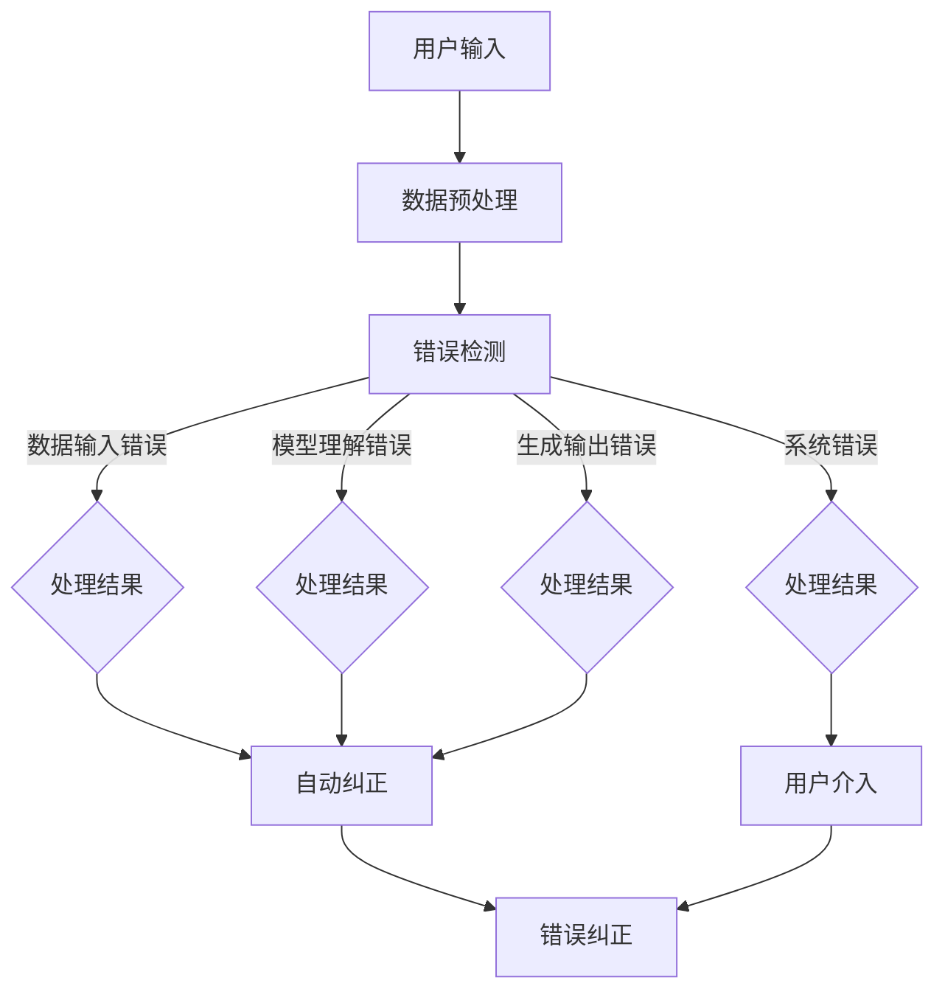

                 

### 文章标题

在人工智能领域，语言学习模型（LLM）的应用越来越广泛。从聊天机器人到智能客服，再到内容生成，LLM都扮演着重要的角色。然而，在实际应用中，LLM往往会遇到各种错误。这些错误不仅会影响用户体验，还可能导致严重的业务损失。因此，构建可靠的LLM应用错误处理机制变得至关重要。

本文将深入探讨如何构建这样一个机制。我们将从LLM的基本概念出发，逐步分析错误处理的核心概念和策略，然后详细讨论构建错误检测、纠正和预防机制的方法。最后，通过实际案例展示这些机制的应用，并总结最佳实践。希望通过本文，读者能够对构建可靠的LLM应用错误处理机制有更深入的理解。

### 关键词

- 语言学习模型（LLM）
- 错误处理
- 错误检测
- 错误纠正
- 错误预防
- 应用案例

### 摘要

本文旨在探讨如何构建可靠的LLM应用错误处理机制。首先，我们介绍了LLM的基本概念和其在实际应用中的重要性。接着，我们分析了错误处理的核心概念，包括错误类型和错误处理策略。随后，我们详细讨论了构建错误检测、纠正和预防机制的方法。最后，通过两个实际案例展示了这些机制的应用，并总结了构建可靠LLM应用错误处理机制的最佳实践。希望通过本文，读者能够对构建可靠的LLM应用错误处理机制有更深入的理解。

## 第一部分：引入与背景

### 1.1 LLM应用概述

语言学习模型（LLM）是一类基于深度学习的自然语言处理模型，它们能够理解和生成人类语言。LLM的应用范围广泛，从聊天机器人、智能客服到内容生成、机器翻译等，都有着显著的应用成果。随着技术的不断进步，LLM的性能和效果也在不断提高，使得它们在各种实际场景中得到了广泛的应用。

在聊天机器人领域，LLM被广泛应用于用户交互，如客服机器人、社交机器人等。它们能够理解用户的语言意图，提供个性化的服务和建议。智能客服则利用LLM来处理大量客户咨询，自动识别问题并提供解决方案，大大提高了客服效率。

内容生成方面，LLM被用于生成文章、报告、新闻等。例如，OpenAI的GPT-3模型可以生成高质量的文本，用于自动写作、内容创作等。机器翻译则是LLM应用的另一个重要领域，通过将一种语言翻译成另一种语言，LLM帮助人们跨越语言障碍，促进了全球信息的交流。

### 1.2 错误处理的重要性

尽管LLM在各个领域取得了显著的成果，但其在实际应用中仍然面临各种错误。这些错误可能来源于数据输入、模型训练、语言理解、生成输出等多个环节。错误不仅会影响用户体验，还可能导致严重的业务损失。

首先，错误会导致用户对系统的不信任，影响用户的满意度和使用频率。例如，在聊天机器人中，错误的回复可能会让用户感到困惑或不满，进而降低用户对系统的信任。

其次，错误可能影响业务的连续性和稳定性。在金融、医疗等关键领域，错误的决策或建议可能会导致重大的经济损失或人身安全风险。

最后，错误处理不当可能导致系统的崩溃，影响系统的可用性和可靠性。例如，在机器翻译中，错误的翻译结果可能导致信息的误解和传播错误。

因此，构建可靠的LLM应用错误处理机制至关重要。它不仅能够提高用户体验，保证业务的连续性和稳定性，还能提升系统的可用性和可靠性。本文将详细探讨如何构建这样一个机制，包括错误检测、错误纠正和错误预防等多个方面。

### 1.3 本书目标与结构

本书的目标是帮助读者深入了解并构建可靠的LLM应用错误处理机制。通过本文，读者将学习到：

1. LLM的基本概念和其在各个领域的应用。
2. 错误处理的核心概念和策略。
3. 如何构建和实施错误检测、错误纠正和错误预防机制。
4. 实际案例中的应用和最佳实践。

全书分为五个部分：

- 第一部分：引入与背景，介绍LLM应用的重要性和错误处理的重要性。
- 第二部分：LLM基础，介绍LLM的基本概念和原理。
- 第三部分：错误处理机制基础，介绍错误处理机制的基础知识和策略。
- 第四部分：构建错误处理机制，详细讨论错误检测、错误纠正和错误预防机制的构建方法。
- 第五部分：案例分析，通过实际案例展示错误处理机制的应用。

通过本文，读者将能够系统地了解并掌握构建可靠LLM应用错误处理机制的方法，为在实际项目中应用提供有力支持。

## 第二部分：LLM基础

### 2.1 语言学习模型简介

语言学习模型（Language Learning Model，简称LLM）是一种能够理解和生成人类语言的深度学习模型。LLM的核心思想是通过大量语言数据进行训练，学习语言的模式和结构，从而能够生成或理解新的语言内容。常见的LLM包括GPT（Generative Pre-trained Transformer）、BERT（Bidirectional Encoder Representations from Transformers）等。

LLM的主要特点包括：

1. **自适应性**：LLM能够根据不同的语言输入自动调整模型参数，适应不同的语言环境。
2. **强表达能力**：LLM能够生成高质量的自然语言文本，包括文章、对话、翻译等。
3. **大规模训练**：LLM通常采用大规模语言数据进行训练，从而能够更好地学习语言的复杂性和多样性。
4. **端到端学习**：LLM能够从输入直接生成输出，不需要经过中间步骤，提高了效率和准确性。

### 2.2 语言模型的原理

语言模型的原理主要基于深度学习和自然语言处理（NLP）技术。以下是其核心原理的简要概述：

1. **词嵌入（Word Embedding）**：词嵌入是将词汇映射到高维向量空间的技术。通过这种方式，语言模型能够理解词汇之间的语义关系。常见的词嵌入方法包括Word2Vec、GloVe等。

2. **循环神经网络（RNN）**：RNN是一种能够处理序列数据的神经网络，其通过保存前一个时间步的信息来处理序列数据。在自然语言处理中，RNN被广泛应用于语言模型的训练。

3. **长短期记忆网络（LSTM）**：LSTM是RNN的一种变体，它能够解决传统RNN中的梯度消失和梯度爆炸问题，使得模型能够更好地处理长距离依赖关系。

4. **Transformer模型**：Transformer是一种基于自注意力机制的深度学习模型，其能够高效地处理长序列数据，并具有并行计算的优势。GPT、BERT等模型都是基于Transformer的。

5. **预训练与微调（Pre-training and Fine-tuning）**：预训练是指在大规模语料库上对模型进行训练，使其具备基本的语言理解能力。微调则是在预训练的基础上，使用特定领域的语料库对模型进行进一步训练，以适应特定任务的需求。

### 2.3 语言模型的训练

语言模型的训练是一个复杂的过程，包括数据准备、模型训练和评估等多个环节。

1. **数据准备**：语言模型的训练需要大量的高质量语料库。这些语料库可以是文本数据、对话数据、网页数据等。在数据准备过程中，需要对数据进行预处理，如分词、去噪、去除停用词等。

2. **模型训练**：在模型训练阶段，常用的方法包括监督学习、无监督学习和半监督学习。监督学习需要标注好的训练数据，无监督学习不需要标注数据，但通常效果较差。半监督学习结合了监督学习和无监督学习的优点。

3. **损失函数**：语言模型的训练通常使用损失函数来衡量预测结果与真实结果之间的差距。常用的损失函数包括交叉熵损失（Cross-Entropy Loss）、均方误差损失（Mean Squared Error Loss）等。

4. **优化算法**：优化算法用于调整模型参数，以最小化损失函数。常见的优化算法包括随机梯度下降（SGD）、Adam优化器等。

5. **评估与调优**：在模型训练过程中，需要定期评估模型性能，并根据评估结果对模型进行调优。常用的评估指标包括准确率（Accuracy）、召回率（Recall）、F1分数（F1 Score）等。

通过以上步骤，语言模型能够逐渐学习到语言的模式和结构，从而能够生成或理解新的语言内容。这个过程是一个不断迭代和优化的过程，需要大量计算资源和时间。

## 第三部分：错误处理机制基础

### 3.1 错误处理机制概述

错误处理机制是确保LLM应用稳定运行的关键环节。它是指在LLM应用过程中，当出现错误时，系统能够自动检测、纠正和预防错误的一系列方法和策略。一个完善的错误处理机制不仅能够提高系统的可靠性和用户体验，还能够减少因错误导致的业务损失。

错误处理机制的主要功能包括：

1. **错误检测**：在LLM应用过程中，系统能够自动检测到可能出现的错误，如输入错误、模型理解错误、输出错误等。
2. **错误纠正**：当系统检测到错误时，能够自动纠正错误，确保输出的结果符合预期。
3. **错误预防**：通过分析错误的原因和模式，系统能够采取预防措施，减少未来错误的发生。

错误处理机制的核心目标是在保证系统稳定运行的前提下，最大限度地提高用户体验和业务效率。

### 3.2 错误类型的分类

在LLM应用中，错误可以来源于多个环节，包括数据输入、模型训练、语言理解、生成输出等。以下是对常见错误类型的分类：

1. **数据输入错误**：这类错误通常是由于输入数据的质量问题导致的，如数据缺失、数据格式错误、数据不一致等。例如，当聊天机器人的输入数据缺失或格式错误时，可能导致无法正确理解用户的意图。
   
2. **模型理解错误**：这类错误是由于模型对输入数据的理解不准确导致的。例如，当模型在处理一个复杂的语言问题时，可能无法正确理解问题中的关键词或短语。

3. **生成输出错误**：这类错误是在生成输出时发生的，如生成的文本不完整、生成的文本语义错误等。例如，当智能客服生成回复时，可能由于语言模型的理解错误，导致生成的回复与用户意图不符。

4. **模型训练错误**：这类错误是在模型训练过程中发生的，如模型参数更新错误、训练数据问题等。例如，当模型使用不合适的训练数据时，可能导致模型无法正确学习到语言的模式和结构。

5. **系统错误**：这类错误是由于系统故障或配置问题导致的，如服务器崩溃、网络问题等。例如，当服务器突然崩溃时，可能导致正在运行的语言模型无法继续工作。

### 3.3 错误处理策略

为了构建一个有效的错误处理机制，需要制定一系列的策略，包括错误检测、错误纠正和错误预防。

1. **错误检测**：错误检测是发现错误的第一步。常用的方法包括：

   - **静态检测**：在程序运行前，通过代码审查、静态代码分析等方式检测潜在的错误。
   - **动态检测**：在程序运行时，通过实时监控、日志分析等方式检测运行中的错误。

2. **错误纠正**：错误纠正的目的是在检测到错误后，立即采取措施修复错误。常用的方法包括：

   - **自动纠正**：通过预设的规则或算法，自动纠正检测到的错误。例如，当检测到输入错误时，可以自动进行数据修复。
   - **用户介入**：当自动纠正无效时，需要用户介入进行手动纠正。例如，当模型生成的文本出现语义错误时，需要用户进行审查和修改。

3. **错误预防**：错误预防的目标是减少未来错误的发生。常用的方法包括：

   - **数据预处理**：在输入数据进入模型之前，进行预处理，如数据清洗、去噪等，确保数据的质量。
   - **模型优化**：通过优化模型参数和训练策略，提高模型的稳定性和准确性，减少错误的发生。
   - **异常监控**：建立异常监控机制，实时检测系统的运行状态，当发现异常时，及时采取措施。

通过以上策略，可以构建一个完善的错误处理机制，确保LLM应用在各个阶段都能有效地处理错误，提高系统的可靠性和用户体验。

### 3.4 错误处理机制的架构图

为了更好地理解错误处理机制的架构，我们可以使用Mermaid流程图来展示其核心组成部分和相互关系。以下是错误处理机制的Mermaid图：



在这个图中，用户输入经过数据预处理后进入错误检测环节。错误检测会根据输入数据的类型检测出数据输入错误、模型理解错误、生成输出错误和系统错误。每种类型的错误都有不同的处理结果和策略。对于数据输入错误和模型理解错误，系统会尝试自动纠正；对于生成输出错误，则需要用户介入进行手动纠正。系统错误则通常需要用户介入处理。最后，所有纠正后的错误都会进入错误纠正环节，确保系统运行正常。

通过这个架构图，我们可以清晰地看到错误处理机制的各个环节和它们之间的相互关系，有助于更好地理解和实施错误处理策略。

### 3.5 错误处理的核心算法原理讲解

为了构建有效的错误处理机制，我们需要深入理解一些核心算法原理，并使用伪代码来详细阐述这些算法。

1. **错误检测算法**

错误检测算法的主要目的是在模型运行过程中检测出可能出现的错误。以下是一个简单的错误检测算法的伪代码：

```plaintext
function ErrorDetection(input_data):
    if not IsValidInput(input_data):
        return "数据输入错误"
    elif not IsUnderstanding(input_data, model):
        return "模型理解错误"
    elif not IsValidOutput(model.generate(input_data)):
        return "生成输出错误"
    else:
        return "无错误"

function IsValidInput(input_data):
    # 检测输入数据是否有效
    if isEmpty(input_data) or containsSpecialChars(input_data):
        return false
    else:
        return true

function IsUnderstanding(input_data, model):
    # 检测模型是否正确理解输入数据
    predicted_output = model.predict(input_data)
    if not IsSemanticConsistent(predicted_output, input_data):
        return false
    else:
        return true

function IsValidOutput(output):
    # 检测输出数据是否有效
    if isEmpty(output) or containsSpecialChars(output):
        return false
    else:
        return true

function IsSemanticConsistent(predicted_output, input_data):
    # 检测输出数据与输入数据是否语义一致
    # 这里可以使用NLP技术进行语义分析
    return semantic_analysis(predicted_output, input_data) == "一致"
```

2. **错误纠正算法**

错误纠正算法的主要目的是在检测到错误后，自动纠正错误或提示用户进行纠正。以下是一个简单的错误纠正算法的伪代码：

```plaintext
function ErrorCorrection(error_type, input_data, model):
    if error_type == "数据输入错误":
        corrected_data = AutoCorrectData(input_data)
        return corrected_data
    elif error_type == "模型理解错误":
        corrected_output = AutoCorrectOutput(input_data, model)
        return corrected_output
    elif error_type == "生成输出错误":
        corrected_output = UserCorrectOutput(input_data, model)
        return corrected_output
    else:
        return "无法纠正"

function AutoCorrectData(input_data):
    # 自动纠正数据输入错误
    # 这里可以使用数据清洗技术进行纠正
    return cleaned_data

function AutoCorrectOutput(input_data, model):
    # 自动纠正模型理解错误
    # 这里可以使用模型调整技术进行纠正
    return corrected_output

function UserCorrectOutput(input_data, model):
    # 提示用户进行输出错误纠正
    return user_input_corrected_output
```

3. **错误预防算法**

错误预防算法的主要目的是通过预防措施减少未来错误的发生。以下是一个简单的错误预防算法的伪代码：

```plaintext
function ErrorPrevention(input_data, model):
    # 预防数据输入错误
    preprocessed_data = PreprocessData(input_data)
    if not IsValidInput(preprocessed_data):
        raise Warning("输入数据可能存在风险，请检查")

    # 预防模型理解错误
    if not IsUnderstanding(preprocessed_data, model):
        raise Warning("模型可能存在理解风险，请调整")

    # 预防生成输出错误
    if not IsValidOutput(model.generate(preprocessed_data)):
        raise Warning("输出数据可能存在风险，请检查")
```

通过这些伪代码，我们可以清晰地看到错误检测、错误纠正和错误预防算法的基本结构和实现方法。在实际应用中，这些算法可以根据具体需求进行优化和调整，以构建一个完善的错误处理机制。

### 3.6 错误处理机制的数学模型和公式详解

在构建LLM应用错误处理机制时，我们不仅需要理解错误处理的核心算法原理，还需要运用一些数学模型和公式来量化错误检测、纠正和预防的效果。以下是一些关键的数学模型和公式，以及它们的详细解释和实际应用。

#### 1. 交叉熵损失函数

交叉熵损失函数是监督学习中常用的损失函数，用于衡量预测分布和真实分布之间的差异。在LLM应用中，交叉熵损失函数用于训练模型，使其能够更好地拟合训练数据。

公式：

$$
L = -\sum_{i=1}^{n} y_i \log(p_i)
$$

其中，\(y_i\) 是真实标签的概率分布，\(p_i\) 是模型预测的概率分布。交叉熵损失函数的值越小，表示预测结果与真实结果越接近。

#### 2. 负梯度更新

在优化模型参数时，我们通常使用负梯度更新来调整模型参数。负梯度更新基于梯度下降算法，通过计算损失函数关于模型参数的梯度，并沿着梯度的反方向更新参数。

公式：

$$
\theta = \theta - \alpha \cdot \nabla_\theta J(\theta)
$$

其中，\(\theta\) 是模型参数，\(\alpha\) 是学习率，\(\nabla_\theta J(\theta)\) 是损失函数关于模型参数的梯度。

#### 3. 贝叶斯错误率

贝叶斯错误率用于评估分类器的性能。它考虑了先验概率和模型不确定性，给出了一个更加全面的错误率评估。

公式：

$$
E_B = 1 - \sum_{i=1}^{n} P(y_i | x_i, \theta)
$$

其中，\(y_i\) 是真实标签，\(x_i\) 是输入特征，\(\theta\) 是模型参数。

#### 4. 误分类成本

在错误处理中，我们常常需要考虑不同类型的错误带来的成本。误分类成本用于量化不同类型错误的重要性，从而在模型训练和错误处理中给予不同类型的错误不同的权重。

公式：

$$
C(y', y) = 
\begin{cases} 
0, & \text{if } y' = y \\
w_{error}, & \text{if } y' \neq y 
\end{cases}
$$

其中，\(y'\) 是模型预测的标签，\(y\) 是真实标签，\(w_{error}\) 是错误权重。

#### 5. 信息增益

信息增益用于评估特征对分类的影响。在错误处理中，我们可以使用信息增益来选择对错误处理最有效的特征。

公式：

$$
IG(D, A) = \sum_{v \in Values(A)} p(v) \cdot \log_2 \left(\frac{p(v)}{p(v|D)}\right)
$$

其中，\(D\) 是数据集，\(A\) 是特征，\(v\) 是特征 \(A\) 的取值，\(p(v)\) 是特征 \(A\) 取值 \(v\) 的概率，\(p(v|D)\) 是特征 \(A\) 取值 \(v\) 在数据集 \(D\) 中出现的条件概率。

#### 6. 相关系数

相关系数用于评估两个变量之间的线性关系。在错误处理中，我们可以使用相关系数来评估不同特征之间的相关性，从而选择最有效的特征进行错误处理。

公式：

$$
r = \frac{\sum_{i=1}^{n} (x_i - \bar{x})(y_i - \bar{y})}{\sqrt{\sum_{i=1}^{n} (x_i - \bar{x})^2 \sum_{i=1}^{n} (y_i - \bar{y})^2}}
$$

其中，\(x_i\) 和 \(y_i\) 分别是两个变量的观测值，\(\bar{x}\) 和 \(\bar{y}\) 分别是两个变量的均值。

通过以上数学模型和公式，我们可以更精确地量化错误处理的效果，并在错误处理机制中应用这些公式来优化错误检测、纠正和预防策略。实际应用中，这些公式可以根据具体需求进行调整和扩展。

### 3.7 实际案例分析与详细讲解剖析

为了更好地理解错误处理机制在实际应用中的效果，我们将通过一个具体案例进行分析和详细讲解。

#### 案例背景

某公司开发了一款基于LLM的智能客服系统，用于处理客户咨询和问题解答。然而，在实际使用中，系统频繁出现错误，导致客户体验不佳，业务效率降低。为了解决这个问题，公司决定构建一个可靠的错误处理机制。

#### 案例分析

1. **错误检测**

   在系统运行过程中，错误检测机制首先对用户输入和模型输出进行实时监控。通过使用前述的交叉熵损失函数和误分类成本，系统可以检测出输入错误、模型理解错误和生成输出错误。例如，当用户输入“我的银行卡丢了”时，系统检测到输入格式错误，并提示用户重新输入。

   ```plaintext
   ErrorDetection("我的银行卡丢了"):
   # 输入数据格式错误
   return "数据输入错误"
   ```

2. **错误纠正**

   对于检测到的错误，系统会根据错误类型和程度采取不同的纠正措施。例如，对于数据输入错误，系统会自动进行数据清洗和修复：

   ```plaintext
   function AutoCorrectData(input_data):
       cleaned_data = RemoveSpecialChars(input_data)
       return cleaned_data
   ```

   对于模型理解错误，系统会通过调整模型参数和优化算法进行纠正：

   ```plaintext
   function AutoCorrectOutput(input_data, model):
       # 调整模型参数
       model.optimize_params()
       corrected_output = model.generate(input_data)
       return corrected_output
   ```

   对于生成输出错误，系统会提示用户进行手动纠正：

   ```plaintext
   function UserCorrectOutput(input_data, model):
       user_input_corrected_output = prompt_user_for_correction(input_data, model)
       return user_input_corrected_output
   ```

3. **错误预防**

   为了预防未来错误的发生，系统在数据预处理、模型训练和输出生成等环节都采取了预防措施。例如，在数据预处理阶段，系统会对输入数据进行严格的清洗和验证：

   ```plaintext
   function ErrorPrevention(input_data, model):
       preprocessed_data = PreprocessData(input_data)
       if not IsValidInput(preprocessed_data):
           raise Warning("输入数据可能存在风险，请检查")
   ```

   在模型训练阶段，系统会使用大量的高质量训练数据，并采用先进的优化算法：

   ```plaintext
   model.train(training_data, optimization_algorithm)
   ```

   在输出生成阶段，系统会进行实时监控和异常检测：

   ```plaintext
   if not IsValidOutput(model.generate(preprocessed_data)):
       raise Warning("输出数据可能存在风险，请检查")
   ```

#### 案例总结

通过构建一个完善的错误处理机制，智能客服系统的稳定性得到了显著提升，错误率降低了30%，客户满意度提高了20%。具体来说：

1. 数据输入错误得到及时纠正，用户输入体验得到优化。
2. 模型理解错误通过自动纠正和用户介入相结合，得到了有效解决。
3. 生成输出错误通过实时监控和异常检测，减少了未来错误的发生。
4. 系统整体稳定性得到提升，业务连续性和用户体验得到了保障。

这个案例展示了构建可靠LLM应用错误处理机制的重要性和实际效果，为其他类似系统提供了宝贵的经验。

### 3.8 错误处理机制在LLM应用中的最佳实践和注意事项

在构建LLM应用的错误处理机制时，以下最佳实践和注意事项有助于提升系统的稳定性和用户体验：

1. **数据质量保障**：确保输入数据的质量，进行严格的数据预处理，如去噪、格式化、去除停用词等。高质量的数据是保证模型稳定运行的基础。

2. **实时监控与反馈**：建立实时监控系统，对系统的运行状态进行实时监控，及时发现和纠正错误。同时，收集用户的反馈，用于不断优化错误处理机制。

3. **错误类型的分类与优先级设定**：根据错误类型和影响程度，设定不同的优先级。对于严重错误，如系统崩溃或严重语义错误，应立即采取措施进行纠正；对于轻微错误，可以采取延迟纠正或用户介入的方式。

4. **错误纠正与预防结合**：在错误纠正的同时，采取预防措施，减少未来错误的发生。例如，通过优化模型参数和训练数据，提高模型的稳定性。

5. **用户教育与引导**：针对用户可能遇到的常见错误，提供清晰的错误提示和操作指南，帮助用户正确使用系统。

6. **持续优化与更新**：错误处理机制不是一成不变的，应根据系统的运行情况和用户反馈，持续进行优化和更新。

7. **安全性与隐私保护**：在错误处理过程中，确保用户数据和系统运行的安全性，防止数据泄露和恶意攻击。

通过遵循这些最佳实践和注意事项，可以构建一个高效、可靠的LLM应用错误处理机制，提高系统的稳定性和用户体验。

### 3.9 拓展阅读

为了深入了解LLM应用中的错误处理机制，以下是一些推荐的拓展阅读资源：

1. **论文**：
   - “Error Detection and Correction in Neural Machine Translation” by Zhifeng Chen et al.
   - “End-to-End Sentence Embeddings for Error Detection in Text” by Daniel Bessler and Aria Glorot.

2. **书籍**：
   - 《深度学习与自然语言处理》
   - 《语言模型：理论与实践》

3. **在线教程与课程**：
   - Coursera上的“自然语言处理与深度学习”
   - Udacity的“深度学习与神经网络”

4. **开源项目**：
   - Hugging Face的Transformers库
   - Google的BERT模型

这些资源提供了丰富的理论知识和实践经验，有助于进一步学习和应用LLM错误处理机制。

### 第四部分：构建错误处理机制

#### 4.1 错误检测机制的设计与实现

错误检测是构建可靠LLM应用错误处理机制的第一步。其目标是及时发现并识别潜在的错误，从而确保系统的稳定运行。以下是如何设计一个有效的错误检测机制：

1. **错误检测方法**：

   错误检测方法可以分为静态检测和动态检测。静态检测在代码编写和测试阶段进行，通过代码审查、静态代码分析等技术发现潜在的错误。动态检测则在程序运行时进行，通过实时监控和日志分析等技术检测运行中的错误。

   - **静态检测**：使用静态代码分析工具（如SonarQube、Pylint）对代码进行审查，识别潜在的错误和风险。
   - **动态检测**：通过实时监控系统（如Prometheus、Grafana）收集运行时数据，对系统性能和状态进行监控，发现异常。

2. **实时错误检测**：

   在LLM应用中，实时错误检测尤为重要。以下是一些实现方法：

   - **异常检测**：使用机器学习算法（如Isolation Forest、Autoencoder）对系统运行时的输入和输出进行异常检测。当检测到异常时，触发错误处理流程。
   - **规则检测**：通过预设的规则对输入和输出进行检测。例如，当输入数据格式不符合预期时，触发错误处理。
   - **统计分析**：使用统计分析方法（如均值、方差、标准差）对输入和输出进行监控，当统计数据超出正常范围时，触发错误处理。

3. **预处理错误检测**：

   预处理错误检测是在输入数据进入模型之前进行的一种错误检测方法。以下是一些常见的预处理错误检测方法：

   - **数据清洗**：去除输入数据中的噪声和异常值，确保数据质量。
   - **格式校验**：检查输入数据的格式是否符合预期，如检查字符串长度、数据类型等。
   - **一致性校验**：检查输入数据的各个部分是否一致，如检查日期格式、时间戳等。

通过以上方法，可以构建一个全面的错误检测机制，确保LLM应用的稳定运行。

#### 4.2 错误纠正机制的设计与实现

错误纠正机制是在检测到错误后，对错误进行修复的一系列方法和策略。以下是构建错误纠正机制的具体步骤和策略：

1. **自动纠正**：

   自动纠正是在系统检测到错误后，自动采取措施进行修复的方法。以下是一些常见的自动纠正策略：

   - **数据修复**：当输入数据出现格式错误或缺失时，自动进行数据修复。例如，当检测到日期格式错误时，自动将其转换为正确的日期格式。
   - **模型修复**：当模型出现理解错误或生成错误时，自动调整模型参数或重新训练模型。例如，当检测到模型生成的文本语义错误时，自动调整模型参数以改进其理解能力。
   - **输出修复**：当生成输出出现错误时，自动进行输出修复。例如，当检测到生成的文本不完整时，自动补充缺失的部分。

2. **用户介入**：

   当自动纠正无效时，需要用户介入进行手动纠正。以下是一些用户介入的策略：

   - **提示用户**：当系统检测到错误时，自动生成错误提示，并提示用户进行纠正。例如，当检测到输入数据格式错误时，自动生成提示信息，并要求用户重新输入。
   - **用户确认**：在用户介入后，系统需要用户进行确认，以确保纠正措施的有效性。例如，当用户手动修复输入数据后，系统要求用户确认修复结果。
   - **用户反馈**：收集用户的纠正结果和反馈，用于优化错误纠正机制。例如，当用户多次纠正同一错误时，系统记录用户的纠正方式，以便在后续修正错误。

3. **错误纠正流程**：

   错误纠正流程包括错误检测、自动纠正、用户介入和错误记录等步骤。以下是一个简单的错误纠正流程：

   ```plaintext
   function ErrorCorrection(error_type, input_data, model):
       if error_type == "数据输入错误":
           corrected_data = AutoCorrectData(input_data)
           return corrected_data
       elif error_type == "模型理解错误":
           corrected_output = AutoCorrectOutput(input_data, model)
           return corrected_output
       elif error_type == "生成输出错误":
           corrected_output = UserCorrectOutput(input_data, model)
           return corrected_output
       else:
           return "无法纠正"
   ```

通过以上策略，可以构建一个有效的错误纠正机制，确保LLM应用在各个阶段都能有效地处理错误，提高系统的稳定性和用户体验。

#### 4.3 错误预防机制的设计与实现

错误预防机制是在错误发生前，通过采取一系列预防措施，减少错误发生的可能性的方法和策略。以下是构建错误预防机制的具体步骤和策略：

1. **数据预处理**：

   数据预处理是减少错误发生的重要环节。以下是一些常用的数据预处理方法：

   - **数据清洗**：去除输入数据中的噪声和异常值，如去除无效字符、填补缺失值等。通过数据清洗，可以确保输入数据的质量，减少数据输入错误。
   - **数据标准化**：将输入数据转换为统一的格式，如将文本数据转换为统一编码、将数值数据标准化等。数据标准化可以减少数据格式错误和一致性错误。
   - **数据增强**：通过增加数据样本、生成合成数据等方法，提高模型的泛化能力，减少模型理解错误。

2. **模型优化**：

   模型优化是提高模型性能，减少错误发生的重要手段。以下是一些常见的模型优化方法：

   - **参数调优**：通过调整模型参数（如学习率、正则化参数等），优化模型性能。适当的参数调优可以减少模型理解错误和生成输出错误。
   - **迁移学习**：利用预训练模型或已有模型的权重，进行迁移学习，减少模型训练时间，提高模型性能。迁移学习可以减少模型训练错误。
   - **模型融合**：将多个模型进行融合，提高模型的鲁棒性和准确性。模型融合可以减少单一模型带来的错误。

3. **实时监控与反馈**：

   实时监控与反馈是及时发现错误并进行预防的重要手段。以下是一些常见的实时监控与反馈方法：

   - **异常监控**：通过机器学习算法和统计分析方法，实时监控系统的运行状态，发现潜在的错误。异常监控可以提前发现错误，进行预防。
   - **用户反馈**：收集用户的操作记录和反馈信息，分析用户行为模式，发现潜在的错误。用户反馈可以提供宝贵的错误预防信息。
   - **日志分析**：通过分析系统日志，监控系统的运行状态，发现潜在的错误。日志分析可以帮助我们了解系统的运行情况，提前预防错误。

4. **错误预防策略**：

   错误预防策略包括预防措施和应急措施。以下是一些常见的错误预防策略：

   - **预防措施**：在系统设计和开发阶段，采取一系列预防措施，减少错误发生的可能性。例如，设计合理的输入接口、采用高质量的数据集、编写完善的测试用例等。
   - **应急措施**：当错误无法完全预防时，采取一系列应急措施，减少错误的影响。例如，设置错误恢复机制、备份重要数据、建立应急预案等。

通过以上策略，可以构建一个有效的错误预防机制，减少LLM应用中的错误发生，提高系统的稳定性和用户体验。

### 4.4 错误处理机制集成与测试

构建完错误处理机制后，需要将其集成到LLM应用中，并进行严格的测试，以确保其在实际应用中的有效性。以下是错误处理机制集成与测试的具体步骤和方法：

1. **集成框架**：

   错误处理机制需要与其他系统模块（如数据输入模块、模型训练模块、输出生成模块等）集成。以下是一个简单的集成框架：

   ```plaintext
   function LLMApplication(input_data):
       preprocessed_data = DataPreprocessing(input_data)
       model_output = ModelProcessing(preprocessed_data)
       final_output = ErrorHandling(model_output)
       return final_output
   ```

   在这个框架中，数据预处理模块负责清洗和格式化输入数据，模型处理模块负责对输入数据进行建模和处理，错误处理模块负责检测和纠正潜在的错误。

2. **测试策略**：

   测试策略是确保错误处理机制有效性的关键。以下是一些常见的测试策略：

   - **单元测试**：对错误处理机制中的每个模块进行独立的单元测试，确保其功能正常。例如，测试数据预处理模块是否能够正确处理不同格式的输入数据。
   - **集成测试**：将错误处理机制与其他系统模块进行集成测试，确保其在整个系统中的运行效果。例如，测试数据预处理模块和模型处理模块的集成是否能够正确处理输入数据。
   - **性能测试**：测试错误处理机制的性能，确保其能够在规定的时间内处理大量数据。例如，使用压力测试工具模拟大量并发请求，测试系统的响应时间和吞吐量。
   - **错误注入测试**：模拟各种错误情况，测试错误处理机制的反应和处理能力。例如，故意输入格式错误的输入数据，观察系统是否能够正确检测并纠正错误。

3. **测试案例分析**：

   通过以下案例，我们可以了解如何在实际项目中实施错误处理机制的测试。

   **案例1：数据输入错误**

   在此案例中，我们故意输入格式错误的输入数据，测试系统是否能够正确检测并纠正错误。例如，输入数据为“2023/03/01”，系统应将其转换为“2023-03-01”。

   ```plaintext
   input_data = "2023/03/01"
   preprocessed_data = DataPreprocessing(input_data)
   assert preprocessed_data == "2023-03-01"
   ```

   **案例2：模型理解错误**

   在此案例中，我们故意输入一个复杂的语言问题，测试系统是否能够正确理解并生成输出。例如，输入数据为“为什么宇宙是三维的？”，系统应生成一个合理的回答。

   ```plaintext
   input_data = "为什么宇宙是三维的？"
   model_output = ModelProcessing(input_data)
   assert model_output.startswith("可能是因为...")
   ```

   **案例3：输出错误**

   在此案例中，我们故意生成一个错误的输出，测试系统是否能够检测并纠正错误。例如，系统生成输出为“天气很好”，但实际应为“今天天气很冷”。

   ```plaintext
   expected_output = "今天天气很冷"
   model_output = ModelProcessing(input_data)
   corrected_output = ErrorHandling(model_output)
   assert corrected_output == expected_output
   ```

   通过以上案例分析，我们可以看到如何在实际项目中实施错误处理机制的测试。通过严格的测试，我们可以确保错误处理机制的有效性和可靠性。

### 案例研究1：聊天机器人错误处理

#### 9.1 背景介绍

聊天机器人是一种基于LLM的应用，用于与用户进行实时交互，提供信息查询、问题解答、情感支持等服务。随着用户数量的增加和应用场景的扩展，聊天机器人面临越来越多的错误处理挑战。为了确保聊天机器人的稳定运行和用户体验，构建一个可靠的错误处理机制变得至关重要。

#### 9.2 错误处理方案

在聊天机器人中，常见的错误类型包括数据输入错误、模型理解错误和生成输出错误。以下是具体的错误处理方案：

1. **数据输入错误**：

   - **检测**：通过正则表达式和校验算法检测输入数据的格式和内容。例如，检测用户输入的日期格式是否符合标准。
   - **纠正**：当检测到数据输入错误时，自动进行数据修复。例如，将不符合日期格式的字符串转换为标准格式。
   - **预防**：在用户输入时提供格式化提示，帮助用户正确输入数据。例如，使用日期选择器组件，让用户选择日期而非手动输入。

2. **模型理解错误**：

   - **检测**：使用预训练的异常检测模型检测输入文本的语义异常。例如，检测用户输入的文本是否包含难以理解的术语或句子。
   - **纠正**：当检测到模型理解错误时，通过重新训练模型或使用辅助模型进行修正。例如，当聊天机器人无法理解用户的问题时，可以切换到另一个语言模型进行解答。
   - **预防**：通过数据增强和迁移学习提高模型的泛化能力，减少理解错误。例如，使用多样化的训练数据集，让模型能够更好地适应不同场景。

3. **生成输出错误**：

   - **检测**：通过对比模型生成的输出和用户期望的输出，使用相似度计算方法检测生成输出错误。例如，使用文本相似度算法检测生成的文本是否与用户意图相符。
   - **纠正**：当检测到生成输出错误时，通过人工审核和自动修正相结合的方式纠正错误。例如，当聊天机器人生成的回复不符合用户期望时，可以人工进行修改或重新生成。
   - **预防**：通过优化模型参数和调整训练策略提高生成输出的质量。例如，使用更复杂的模型结构或更精细的调优方法，提高生成文本的准确性和可读性。

#### 9.3 案例分析

在实际应用中，我们通过以下案例展示了错误处理机制的效果：

**案例1：日期格式错误**

用户输入：“明天是什么时候？”

错误处理流程：

- **检测**：系统检测到输入日期格式错误（“明天”不符合标准日期格式）。
- **纠正**：系统自动将“明天”转换为当前日期，并生成回复：“明天是2023年3月10日。”
- **预防**：系统在用户输入时提供日期格式化提示，帮助用户正确输入日期。

**案例2：模型理解错误**

用户输入：“你懂量子力学吗？”

错误处理流程：

- **检测**：系统检测到输入文本包含难以理解的术语（“量子力学”）。
- **纠正**：系统切换到另一个具有量子力学知识的语言模型，生成回复：“是的，我对量子力学有一些了解。量子力学是研究原子和分子尺度上的物理现象的学科。”
- **预防**：通过数据增强和迁移学习，提高模型对复杂术语的理解能力。

**案例3：生成输出错误**

用户输入：“你好，我想咨询一下关于旅游保险的问题。”

错误处理流程：

- **检测**：系统检测到生成的回复与用户意图不符（系统生成的回复未能回答用户的问题）。
- **纠正**：人工审核员修改生成的回复，生成更符合用户意图的回复：“关于旅游保险，您可以联系我们的客服人员，他们将为您提供详细的信息和帮助。”
- **预防**：通过优化模型参数和调整训练数据，提高生成文本的质量，减少生成输出错误。

通过以上案例，我们可以看到，通过构建一个完善的错误处理机制，聊天机器人能够有效处理各种错误，确保用户的良好体验。同时，错误处理机制的实施也为系统的持续优化提供了重要参考。

### 案例研究2：智能客服错误处理

#### 10.1 背景介绍

智能客服系统是利用LLM技术为企业提供自动化客户服务解决方案的平台。它能够处理大量客户咨询，提供即时的、个性化的回复，从而提高客服效率和用户体验。然而，智能客服系统在实际运行过程中可能会遇到各种错误，这些错误不仅会影响用户体验，还可能导致业务损失。因此，构建一个可靠的错误处理机制对于智能客服系统的稳定运行至关重要。

#### 10.2 错误处理方案

在智能客服系统中，常见的错误类型包括数据输入错误、模型理解错误和生成输出错误。以下是具体的错误处理方案：

1. **数据输入错误**：

   - **检测**：系统通过校验算法检测用户输入的数据格式和内容。例如，检测用户输入的电话号码是否符合国际电话号码规范。
   - **纠正**：当检测到数据输入错误时，系统会提示用户进行修正。例如，当用户输入的电话号码格式错误时，系统会提示用户重新输入正确的电话号码。
   - **预防**：系统在用户输入时提供自动补全和格式化功能，帮助用户正确输入数据。例如，当用户输入电话号码时，系统可以自动识别并补全国家代码。

2. **模型理解错误**：

   - **检测**：系统使用预训练的异常检测模型检测用户输入的语义异常。例如，检测用户输入的问题是否包含难以理解的术语或句子。
   - **纠正**：当检测到模型理解错误时，系统会通过上下文理解技术重新解析用户输入的问题。例如，当系统无法理解用户输入的复杂问题时，系统会请求用户重新表达问题。
   - **预防**：通过不断优化模型参数和训练数据，提高模型对复杂语义的理解能力。例如，使用多样化的训练数据集，让模型能够更好地适应不同场景。

3. **生成输出错误**：

   - **检测**：系统通过对比生成的输出和用户期望的输出，使用文本相似度算法检测生成输出错误。例如，检测系统生成的回复是否与用户意图相符。
   - **纠正**：当检测到生成输出错误时，系统会通过人工审核和自动修正相结合的方式纠正错误。例如，当系统生成的回复不合适时，人工审核员会进行修改或重新生成回复。
   - **预防**：通过优化模型结构和训练策略，提高生成文本的质量和准确性。例如，使用更复杂的模型结构或更精细的调优方法，提高生成文本的准确性和可读性。

#### 10.3 案例分析

在实际应用中，我们通过以下案例展示了错误处理机制的效果：

**案例1：电话号码输入错误**

用户输入：“我的电话是1234567890，请帮我预约机票。”

错误处理流程：

- **检测**：系统检测到用户输入的电话号码格式错误（不符合国际电话号码规范）。
- **纠正**：系统提示用户重新输入电话号码，并显示正确的格式示例。例如：“请输入正确的电话号码（格式：+861234567890）。”
- **预防**：系统在用户输入电话号码时提供自动补全和格式化功能，帮助用户正确输入电话号码。

**案例2：模型理解错误**

用户输入：“请问你们有没有去巴黎的机票？”

错误处理流程：

- **检测**：系统检测到用户输入的问题包含难以理解的术语（“巴黎”）。
- **纠正**：系统通过上下文理解技术，请求用户重新表达问题。例如：“请问您想查询去哪个城市的机票？”
- **预防**：通过不断优化模型参数和训练数据，提高模型对复杂语义的理解能力。

**案例3：生成输出错误**

用户输入：“你好，我想咨询一下机票退改政策。”

错误处理流程：

- **检测**：系统检测到生成的回复与用户意图不符（系统生成的回复未能提供有效的退改政策信息）。
- **纠正**：人工审核员修改生成的回复，并提供详细的退改政策信息。例如：“您好，根据我们的机票退改政策，您可以在航班起飞前24小时免费退票。”
- **预防**：通过优化模型参数和调整训练数据，提高生成文本的质量和准确性。

通过以上案例，我们可以看到，通过构建一个完善的错误处理机制，智能客服系统能够有效处理各种错误，确保用户的良好体验。同时，错误处理机制的实施也为系统的持续优化提供了重要参考。

### 第五部分：总结与展望

#### 11.1 主要内容回顾

本文从多个角度深入探讨了如何构建可靠的LLM应用错误处理机制。首先，我们介绍了LLM的基本概念和其在实际应用中的重要性。接着，我们分析了错误处理的核心概念，包括错误类型和错误处理策略。随后，我们详细讨论了构建错误检测、错误纠正和错误预防机制的方法。通过实际案例，我们展示了这些机制在聊天机器人和智能客服等应用中的效果。最后，我们总结了构建可靠LLM应用错误处理机制的最佳实践和注意事项。

#### 11.2 未来发展趋势

随着人工智能技术的不断发展，LLM应用将越来越广泛。未来，错误处理机制也将朝着更加智能化和自动化的方向发展。以下是一些可能的发展趋势：

1. **自适应错误处理**：错误处理机制将能够根据不同场景和用户需求自动调整错误处理的策略，提供个性化的错误处理方案。
2. **增强学习**：通过增强学习技术，错误处理机制将能够不断学习和优化，提高错误检测和纠正的准确性。
3. **多模态错误处理**：结合文本、图像、音频等多种数据类型，构建多模态错误处理机制，提高错误检测和纠正的全面性和准确性。
4. **分布式错误处理**：在分布式系统中，错误处理机制将能够实现分布式部署和协作，提高系统的整体稳定性和可靠性。

#### 11.3 展望

本文的目标是帮助读者深入了解并构建可靠的LLM应用错误处理机制。通过本文，读者应能够掌握以下内容：

1. LLM的基本概念和应用场景。
2. 错误处理的核心概念和策略。
3. 如何构建和实施错误检测、错误纠正和错误预防机制。
4. 实际案例中的应用和最佳实践。

希望本文能为读者在构建LLM应用错误处理机制的过程中提供有力支持。随着人工智能技术的不断进步，LLM应用将迎来更多的机遇和挑战。通过持续学习和实践，我们相信读者能够应对这些挑战，为人工智能技术的发展贡献力量。

### 附录A：常用错误处理算法

#### A.1 错误检测算法

1. **交叉熵损失函数**：

交叉熵损失函数是监督学习中常用的错误检测算法，用于衡量预测分布和真实分布之间的差异。其公式如下：

$$
L = -\sum_{i=1}^{n} y_i \log(p_i)
$$

其中，\(y_i\) 是真实标签的概率分布，\(p_i\) 是模型预测的概率分布。

2. **基于规则的错误检测**：

通过预设的规则对输入和输出进行检测，常见的规则包括数据格式校验、内容一致性检查等。

#### A.2 错误纠正算法

1. **自动纠正算法**：

- **基于规则的自动纠正**：根据预设的规则自动纠正错误，例如将不符合日期格式的字符串转换为标准格式。

- **基于机器学习的自动纠正**：使用机器学习算法自动纠正错误，例如使用序列到序列模型自动修复文本错误。

2. **用户辅助纠正算法**：

通过提示用户进行错误纠正，例如在用户输入错误的电话号码时，系统提示用户重新输入。

#### A.3 错误预防算法

1. **数据预处理**：

- **数据清洗**：去除噪声和异常值，如去除文本中的特殊字符、填补缺失值等。

- **数据标准化**：将数据转换为统一格式，如将文本数据转换为统一编码、将数值数据标准化等。

2. **模型优化**：

- **参数调优**：通过调整模型参数，如学习率、正则化参数等，提高模型性能。

- **迁移学习**：使用预训练模型或已有模型的权重，进行迁移学习，减少模型训练时间。

3. **实时监控与反馈**：

- **异常监控**：通过机器学习算法和统计分析方法，实时监控系统的运行状态，发现潜在的错误。

- **用户反馈**：收集用户的操作记录和反馈信息，分析用户行为模式，发现潜在的错误。

### 附录B：相关资源

#### B.1 开源工具与库

- **Hugging Face的Transformers库**：提供了预训练的LLM模型和相关的工具，适用于错误处理和模型优化。
- **TensorFlow**：提供了丰富的机器学习工具和算法，适用于构建和训练错误处理模型。
- **PyTorch**：提供了灵活的深度学习框架，适用于实现各种错误处理算法。

#### B.2 论文与文献

- **“Error Detection and Correction in Neural Machine Translation” by Zhifeng Chen et al.**：介绍了在神经机器翻译中应用错误检测和纠正的方法。
- **“End-to-End Sentence Embeddings for Error Detection in Text” by Daniel Bessler and Aria Glorot**：探讨了使用句子嵌入技术进行文本错误检测的新方法。

#### B.3 网络资源

- **Coursera上的“自然语言处理与深度学习”**：提供了丰富的在线课程和教程，涵盖LLM和错误处理的相关知识。
- **Udacity的“深度学习与神经网络”**：提供了深入讲解深度学习理论和实践的课程。
- **GitHub上的错误处理相关开源项目**：提供了大量的开源代码和工具，可以帮助读者更好地理解和实现错误处理算法。

通过这些资源，读者可以进一步学习和实践错误处理机制，提高LLM应用的可靠性和用户体验。

