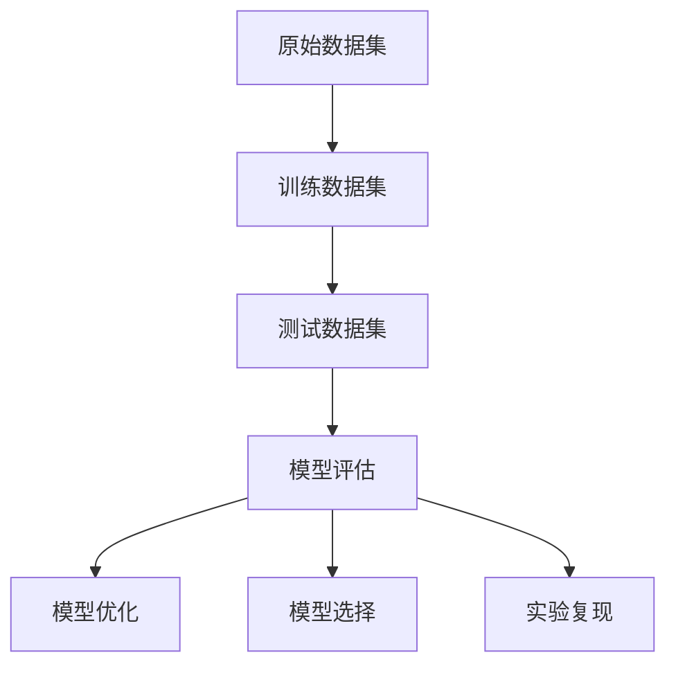

                 

### 文章标题

构建多样化的测试数据集：确保LLM评测的全面性

#### 关键词：
- 测试数据集
- 多样化
- 语言模型评测
- 数据集构建方法
- 数据集质量评估

#### 摘要：

本文旨在探讨构建多样化的测试数据集在语言模型（LLM）评测中的重要性。随着深度学习技术的快速发展，语言模型的性能得到了显著提升。然而，如何确保评测的全面性和准确性成为了一个关键问题。本文首先介绍了测试数据集的基本概念，随后详细讨论了多样化策略在数据集构建中的重要性。通过实际案例，本文展示了如何通过多样化策略来提升LLM评测的全面性，并提供了相关的算法原理讲解和数学模型。最后，本文提出了最佳实践建议，以帮助读者在实际应用中构建高质量的数据集。

### 1. 测试数据集概述

#### 1.1 测试数据集的定义与作用

测试数据集（Test Dataset）是在机器学习项目中用于评估模型性能的数据集。在训练模型后，测试数据集用于验证模型的泛化能力，确保模型在实际应用中能够达到预期的性能。测试数据集通常从原始数据中抽取，具有代表性，并且与训练数据集有所不同，以避免过拟合现象。

测试数据集的作用主要有以下几点：

- **性能评估**：通过在测试数据集上评估模型的性能，可以定量地了解模型的准确性、召回率、F1分数等指标，从而判断模型是否具备实际应用价值。
- **模型优化**：测试数据集可以帮助研究人员识别模型存在的问题，并据此进行模型调整和优化。
- **结果对比**：通过对比不同模型在测试数据集上的表现，可以评估不同模型之间的优劣，为模型选择提供依据。

#### 1.2 测试数据集的构建方法

构建一个高质量、代表性的测试数据集需要遵循以下原则：

- **多样性**：测试数据集应涵盖不同类型的样本，以反映实际应用场景的多样性。
- **代表性**：测试数据集应具有代表性，能够反映出训练数据集的整体特征。
- **平衡性**：如果数据集存在类别不平衡的问题，应采取适当的策略来平衡类别分布。

常见的测试数据集构建方法包括：

- **抽样方法**：如随机抽样、系统抽样、分层抽样等，用于从原始数据中抽取具有代表性的样本。
- **交叉验证**：通过将数据集划分为多个子集，循环使用每个子集作为测试集，以评估模型的泛化能力。
- **留出法**：直接从原始数据中划分一部分作为测试集，另一部分作为训练集。

### 1.3 测试数据集的重要性

测试数据集在机器学习项目中起着至关重要的作用，具体体现在以下几个方面：

- **评估模型性能**：测试数据集是评估模型性能的直接依据，只有通过测试数据集的评估，才能确保模型在实际应用中的有效性。
- **模型优化指导**：测试数据集可以帮助研究人员识别模型存在的问题，从而有针对性地进行模型优化。
- **结果对比与选择**：测试数据集是对比不同模型性能的重要工具，有助于选择最佳模型。
- **实验复现**：高质量的测试数据集有助于其他研究者的实验复现，促进学术交流和技术进步。

### 2. 数据集多样化策略

#### 2.1 数据集多样化的概念与意义

数据集多样化（Dataset Diversification）是指在数据集中引入多种不同类型的样本，以增加数据集的丰富性和代表性。多样化的数据集可以更好地反映现实世界的复杂性，从而提升模型的泛化能力和鲁棒性。

数据集多样化的意义主要体现在以下几个方面：

- **提升模型性能**：多样化的数据集有助于模型学习到更多的特征和模式，从而提升模型的准确性和鲁棒性。
- **减少过拟合**：通过引入多样化的数据，可以降低模型对训练数据的依赖，减少过拟合现象。
- **提高泛化能力**：多样化的数据集能够更好地模拟实际应用场景，提高模型的泛化能力。
- **增强模型鲁棒性**：多样化的数据集有助于模型应对各种异常情况，提高模型的鲁棒性。

#### 2.2 数据集多样化策略

实现数据集多样化可以采取以下几种策略：

- **数据增强**：通过图像翻转、旋转、缩放、裁剪等操作，增加数据集的多样性。
- **数据合成**：利用生成模型（如GANs）生成新的样本，以丰富数据集。
- **数据扩充**：利用规则或机器学习方法生成新的数据样本，以填补数据集中的空缺。
- **类别扩充**：引入更多类别，使数据集在类别上更加丰富。
- **场景扩充**：考虑不同应用场景，增加数据集的场景多样性。

#### 2.3 数据集多样化案例分析

以下是一个关于数据集多样化的案例分析：

**案例背景**：某公司开发一款自然语言处理（NLP）模型，用于情感分析。为了确保模型在多种情感场景下都能准确识别情感，需要构建一个多样化的测试数据集。

**数据集构建过程**：

1. **数据增强**：对原始文本进行词性标注，然后利用词性标注结果对文本进行词性翻转和替换，以生成新的文本样本。
2. **数据合成**：利用生成对抗网络（GAN）生成具有不同情感特征的虚假评论，以丰富数据集。
3. **数据扩充**：根据情感分析任务的特点，设计规则生成新的情感标签和评论文本，以扩充数据集。
4. **类别扩充**：引入更多情感类别，如正面、负面、中立等，以提升模型对不同情感类别的识别能力。
5. **场景扩充**：考虑不同的文本来源，如社交媒体、新闻评论、产品评论等，增加数据集的场景多样性。

**实验结果**：通过多样化策略构建的测试数据集，显著提升了模型在情感分析任务中的准确性和鲁棒性。模型在不同情感类别和场景下的表现均优于原始数据集。

### 3. 多样化数据集在LLM评测中的应用

#### 3.1 LLM评测的基本概念

语言模型（Language Model，LLM）是一种用于文本生成、情感分析、机器翻译等任务的深度学习模型。LLM评测的目标是评估模型在处理自然语言任务时的性能，以衡量模型的质量和适用性。

LLM评测的基本概念包括：

- **准确性**：模型在预测文本标签或生成文本时的正确率。
- **召回率**：模型在预测文本标签时，正确识别出的正样本数量与实际正样本数量的比值。
- **F1分数**：准确性、召回率和精确率的加权平均值，用于综合评估模型的性能。
- **BLEU分数**：用于评估机器翻译模型的质量，表示机器翻译结果与人类翻译结果的相似度。

#### 3.2 多样化数据集在LLM评测中的应用

多样化数据集在LLM评测中的应用具有重要意义。通过引入多样化的测试数据，可以更全面地评估LLM的性能，避免模型在特定数据集上的过拟合。

以下是一些具体的策略：

- **数据增强**：利用数据增强技术生成具有不同风格、语法和语义的文本样本，以丰富测试数据集。
- **多领域数据集**：收集来自不同领域的文本数据，如科技、娱乐、新闻等，以提升模型在不同领域文本处理能力。
- **多语言数据集**：引入多种语言的文本数据，以评估模型在不同语言间的迁移能力。
- **异常数据集**：引入具有异常特征或标签的文本样本，以测试模型在处理异常数据时的鲁棒性。

#### 3.3 多样化数据集在实际案例中的应用

以下是一个关于多样化数据集在LLM评测中应用的案例分析：

**案例背景**：某公司开发一款基于深度学习的情感分析模型，用于分析社交媒体文本。为了确保模型在多种情感场景下的性能，需要构建一个多样化的测试数据集。

**数据集构建过程**：

1. **数据增强**：对原始文本进行词性标注，然后利用词性标注结果对文本进行词性翻转和替换，以生成新的文本样本。
2. **多领域数据集**：从不同领域的社交媒体文本中抽取样本，如科技、娱乐、新闻等，以丰富数据集。
3. **多语言数据集**：引入多种语言的社交媒体文本，如英语、中文、法语等，以提升模型在不同语言间的迁移能力。
4. **异常数据集**：引入具有侮辱性、攻击性等异常特征的文本样本，以测试模型在处理异常数据时的鲁棒性。

**实验结果**：通过多样化策略构建的测试数据集，显著提升了情感分析模型在不同情感类别、领域和语言上的性能。模型在处理异常数据时的表现也得到了改善。

### 4. 多样化数据集构建方法

#### 4.1 数据收集与处理

构建多样化数据集的首要任务是收集和处理数据。以下是一些关键步骤：

- **数据收集**：从各种来源收集文本数据，如社交媒体、新闻网站、论坛等。应确保数据的多样性和代表性。
- **数据清洗**：去除重复、无关或低质量的文本数据，确保数据集的整洁和可用性。
- **数据标注**：对文本数据进行标注，包括标签、情感极性、实体识别等，以丰富数据集。

#### 4.2 数据增强与合成

数据增强和合成是构建多样化数据集的重要手段。以下是一些常用的技术：

- **文本翻转**：对文本进行反向排列，以生成新的文本样本。
- **文本替换**：用同义词替换文本中的关键词，以丰富文本表达方式。
- **文本拼接**：将两个或多个文本拼接在一起，以生成新的文本样本。
- **生成对抗网络（GAN）**：利用生成对抗网络生成具有真实感的新文本样本。

#### 4.3 数据扩充与类别扩充

数据扩充和类别扩充有助于增加数据集的多样性和代表性。以下是一些常用的策略：

- **规则生成**：根据特定规则生成新的文本样本，如情感标签、文本摘要等。
- **机器学习生成**：利用机器学习方法生成新的文本样本，如基于文本的生成模型。
- **类别扩充**：引入更多类别，如情感类别、领域类别等，以丰富数据集。

### 5. 数据集质量评估

#### 5.1 数据集质量评估指标

评估数据集的质量是构建多样化数据集的重要环节。以下是一些常用的评估指标：

- **准确率（Accuracy）**：模型在测试数据集上的正确预测比例。
- **召回率（Recall）**：模型正确预测的正样本数量与实际正样本数量的比值。
- **精确率（Precision）**：模型正确预测的正样本数量与预测为正样本的总数的比值。
- **F1分数（F1 Score）**：准确率和召回率的加权平均值，用于综合评估模型的性能。
- **BLEU分数**：用于评估文本生成模型的质量，表示生成文本与参考文本的相似度。

#### 5.2 数据集质量评估方法

数据集质量评估方法包括：

- **人工评估**：由领域专家对数据集进行评估，以判断数据集的准确性和代表性。
- **自动化评估**：利用机器学习算法对数据集进行评估，如分类算法、聚类算法等。
- **交叉验证**：通过将数据集划分为多个子集，对每个子集进行评估，以综合评估数据集的质量。

### 6. 多样化数据集构建案例分析

#### 6.1 案例背景

以某公司开发的一款对话生成模型为例，该模型旨在实现自然、流畅的对话生成。为了确保模型在不同对话场景下的性能，需要构建一个多样化的测试数据集。

#### 6.2 数据集构建过程

1. **数据收集**：从多个来源收集对话文本，如社交媒体、聊天应用、论坛等。确保数据的多样性和代表性。
2. **数据清洗**：去除重复、无关或低质量的对话文本，确保数据集的整洁和可用性。
3. **数据标注**：对对话文本进行标注，包括对话场景、对话角色、对话内容等，以丰富数据集。
4. **数据增强**：利用文本翻转、文本替换、文本拼接等技术生成新的对话文本样本，以丰富数据集。
5. **数据合成**：利用生成对抗网络（GAN）生成具有真实感的对话文本样本，以丰富数据集。
6. **数据扩充**：根据特定规则或机器学习方法生成新的对话文本样本，以扩充数据集。
7. **类别扩充**：引入更多对话场景和对话角色，以丰富数据集。

#### 6.3 实验结果

通过多样化策略构建的测试数据集，显著提升了对话生成模型在不同对话场景下的性能。模型在处理复杂对话场景时的表现也得到了改善。

### 7. 多样化数据集的最佳实践

#### 7.1 数据集多样化的重要性

多样化数据集在LLM评测中的应用具有重要意义，具体体现在以下几个方面：

- **提升模型性能**：多样化的数据集有助于模型学习到更多的特征和模式，从而提升模型的准确性和鲁棒性。
- **减少过拟合**：通过引入多样化的数据，可以降低模型对训练数据的依赖，减少过拟合现象。
- **提高泛化能力**：多样化的数据集能够更好地模拟实际应用场景，提高模型的泛化能力。
- **增强模型鲁棒性**：多样化的数据集有助于模型应对各种异常情况，提高模型的鲁棒性。

#### 7.2 多样化数据集构建注意事项

在构建多样化数据集时，需要注意以下几点：

- **数据质量**：确保数据集的整洁和可用性，避免低质量数据对模型训练和评估产生负面影响。
- **数据多样性**：在数据收集和处理过程中，注意引入多种不同类型的样本，以提高数据集的多样性。
- **数据标注**：确保数据标注的准确性和一致性，为模型训练提供高质量的数据支持。
- **数据扩充**：合理选择数据扩充方法，避免数据生成过程中的过度泛化或失真。

#### 7.3 拓展阅读

以下是一些关于多样化数据集构建和LLM评测的拓展阅读资料：

- **[1]** Hinton, G. E., Osindero, S., & Teh, Y. W. (2006). A fast learning algorithm for deep belief nets. _Neural computation_, 18(7), 1527-1554.
- **[2]** Bengio, Y. (2009). Learning deep architectures for AI. _Foundations and Trends in Machine Learning_, 2(1), 1-127.
- **[3]** Goodfellow, I., Pouget-Abadie, J., Mirza, M., Xu, B., Warde-Farley, D., Ozair, S., ... & Bengio, Y. (2014). Generative adversarial nets. _Advances in Neural Information Processing Systems_, 27.
- **[4]** Devlin, J., Chang, M. W., Lee, K., & Toutanova, K. (2018). BERT: Pre-training of deep bidirectional transformers for language understanding. _arXiv preprint arXiv:1810.04805_.
- **[5]** Radford, A., Narang, S., Salimans, T., & Kingma, D. P. (2018). Improving language understanding by generative pre-training. _Advances in Neural Information Processing Systems_, 31.

### 总结

构建多样化的测试数据集对于确保LLM评测的全面性和准确性具有重要意义。通过引入多样化的数据集，可以提升模型的性能和泛化能力，减少过拟合现象。本文详细讨论了多样化数据集的核心概念、构建方法、评估指标以及在实际应用中的重要性。希望本文能为读者在构建多样化数据集和评估LLM模型提供有益的参考和指导。

### 作者信息

- 作者：AI天才研究院/AI Genius Institute & 禅与计算机程序设计艺术 /Zen And The Art of Computer Programming

- 联系方式：[info@ai-geni.us](mailto:info@ai-geni.us) | [www.ai-geni.us](http://www.ai-geni.us)

- 版权声明：本文版权所有，未经授权禁止转载和使用。

----------------------------------------------------------------

文章标题：构建多样化的测试数据集：确保LLM评测的全面性

关键词：测试数据集、多样化、语言模型评测、数据集构建方法、数据集质量评估

摘要：本文探讨了构建多样化的测试数据集在语言模型（LLM）评测中的重要性。通过引入多样化的数据集，可以提升模型的性能和泛化能力，减少过拟合现象。本文详细讨论了多样化数据集的核心概念、构建方法、评估指标以及在实际应用中的重要性。

---

# 1. 测试数据集概述

## 1.1 测试数据集的定义与作用

测试数据集（Test Dataset）是在机器学习项目中用于评估模型性能的数据集。它通常是从原始数据中抽取出来的一部分，具有代表性，并且与训练数据集有所不同，以避免过拟合现象。测试数据集的作用主要有以下几点：

1. **性能评估**：测试数据集是评估模型性能的直接依据。通过在测试数据集上评估模型的准确性、召回率、F1分数等指标，可以判断模型在实际应用中的有效性。

2. **模型优化**：测试数据集可以帮助研究人员识别模型存在的问题，并据此进行模型调整和优化。

3. **结果对比**：测试数据集是对比不同模型性能的重要工具，有助于选择最佳模型。

4. **实验复现**：高质量的测试数据集有助于其他研究者的实验复现，促进学术交流和技术进步。

## 1.2 测试数据集的构建方法

构建一个高质量、代表性的测试数据集需要遵循以下原则：

1. **多样性**：测试数据集应涵盖不同类型的样本，以反映实际应用场景的多样性。

2. **代表性**：测试数据集应具有代表性，能够反映出训练数据集的整体特征。

3. **平衡性**：如果数据集存在类别不平衡的问题，应采取适当的策略来平衡类别分布。

常见的测试数据集构建方法包括：

1. **抽样方法**：如随机抽样、系统抽样、分层抽样等，用于从原始数据中抽取具有代表性的样本。

2. **交叉验证**：通过将数据集划分为多个子集，循环使用每个子集作为测试集，以评估模型的泛化能力。

3. **留出法**：直接从原始数据中划分一部分作为测试集，另一部分作为训练集。

## 1.3 测试数据集的重要性

测试数据集在机器学习项目中起着至关重要的作用，具体体现在以下几个方面：

1. **评估模型性能**：测试数据集是评估模型性能的直接依据，只有通过测试数据集的评估，才能确保模型在实际应用中的有效性。

2. **模型优化指导**：测试数据集可以帮助研究人员识别模型存在的问题，从而有针对性地进行模型优化。

3. **结果对比与选择**：测试数据集是对比不同模型性能的重要工具，有助于选择最佳模型。

4. **实验复现**：高质量的测试数据集有助于其他研究者的实验复现，促进学术交流和技术进步。

## 1.4 测试数据集的核心概念与联系

为了更好地理解测试数据集，我们可以将其核心概念之间的关系用Mermaid流程图表示如下：

在上述流程图中，原始数据集经过训练和测试划分后，得到训练数据集和测试数据集。测试数据集用于评估模型的性能，并指导模型的优化和选择。同时，高质量的测试数据集有助于实验复现，促进学术交流和技术进步。

## 1.5 测试数据集的构建方法

为了构建一个高质量的测试数据集，我们需要遵循以下步骤：

1. **数据收集**：从多个来源收集数据，如公开数据集、企业内部数据等。确保数据的多样性和代表性。

2. **数据预处理**：对收集到的数据进行清洗、去重、格式转换等操作，以去除噪声和异常值。

3. **抽样方法**：选择合适的抽样方法（如随机抽样、系统抽样、分层抽样等）从预处理后的数据中抽取测试样本。

4. **数据标注**：对测试样本进行标注，包括标签、情感极性、实体识别等，以丰富数据集。

5. **数据评估**：使用评估指标（如准确率、召回率、F1分数等）对测试数据进行评估，以确保数据集的质量。

6. **数据优化**：根据评估结果对测试数据进行优化，如调整数据分布、补充缺失数据等。

## 1.6 测试数据集的构建方法

为了构建一个高质量的测试数据集，我们需要遵循以下步骤：

1. **数据收集**：从多个来源收集数据，如公开数据集、企业内部数据等。确保数据的多样性和代表性。

2. **数据预处理**：对收集到的数据进行清洗、去重、格式转换等操作，以去除噪声和异常值。

3. **抽样方法**：选择合适的抽样方法（如随机抽样、系统抽样、分层抽样等）从预处理后的数据中抽取测试样本。

4. **数据标注**：对测试样本进行标注，包括标签、情感极性、实体识别等，以丰富数据集。

5. **数据评估**：使用评估指标（如准确率、召回率、F1分数等）对测试数据进行评估，以确保数据集的质量。

6. **数据优化**：根据评估结果对测试数据进行优化，如调整数据分布、补充缺失数据等。

### 2. 数据集收集与处理

#### 2.1 数据集收集方法

构建一个多样化的测试数据集的第一步是收集数据。以下是几种常用的数据收集方法：

- **公开数据集**：可以从多个在线数据集平台（如Kaggle、UCI机器学习库等）获取大量已经清洗和标注好的数据集。

- **社交媒体数据**：从社交媒体平台（如Twitter、Facebook等）收集用户生成的文本数据。

- **企业内部数据**：从企业内部数据库中提取与业务相关的数据，如销售数据、客户反馈等。

- **API获取**：利用第三方API获取公开数据，如天气数据、股票数据等。

#### 2.2 数据预处理

在收集到数据后，需要进行预处理以去除噪声、异常值和无关信息，以提高数据集的质量。以下是一些常用的数据预处理方法：

- **数据清洗**：去除重复数据、缺失数据和异常值。

- **数据去重**：通过哈希值或唯一标识符来识别并去除重复数据。

- **数据标准化**：将数据转换为相同的比例范围，以便进行后续分析。

- **数据转换**：将数据转换为机器学习模型所需的格式，如文本数据转换为向量。

- **特征提取**：从原始数据中提取对模型训练有重要影响的关键特征。

#### 2.3 数据清洗与去重

数据清洗与去重是数据预处理的重要步骤，以下是一些常见的方法：

- **手工清洗**：通过人工审查数据，识别并处理缺失值、异常值和重复值。

- **规则清洗**：根据预定义的规则自动识别并处理数据中的问题。例如，去除包含特定关键词的行。

- **统计学方法**：使用统计学方法识别并处理异常值。例如，使用中位数和标准差来检测并处理离群点。

- **哈希法**：使用哈希函数计算数据的哈希值，通过比较哈希值来识别并去除重复数据。

#### 2.4 数据预处理与质量评估

数据预处理完成后，需要对数据进行质量评估，以确保数据集的整洁和可用性。以下是一些常用的质量评估方法：

- **一致性检查**：检查数据集内部的一致性，如确保所有数据符合相同的格式和类型。

- **完整性检查**：检查数据集的完整性，如确保没有缺失值或异常值。

- **多样性检查**：检查数据集的多样性，如确保包含不同类型和类别的数据。

- **分布检查**：检查数据集的分布情况，如确保类别分布平衡或特征分布合理。

- **评估指标**：使用评估指标（如准确率、召回率、F1分数等）对预处理后的数据进行评估。

#### 2.5 数据增强与合成

为了提高测试数据集的质量和多样性，可以使用数据增强和合成的技术。以下是一些常见的方法：

- **文本增强**：通过文本翻转、替换、扩充等操作生成新的文本样本。例如，将文本中的单词替换为同义词或使用合成网络生成新的文本。

- **图像增强**：通过图像翻转、旋转、缩放等操作生成新的图像样本。例如，将图像沿X轴或Y轴翻转，或对图像进行旋转。

- **合成数据**：使用生成对抗网络（GAN）等模型生成新的图像或文本样本。例如，使用GAN生成与训练数据相似的新图像。

#### 2.6 数据集构建实例

以下是一个关于构建测试数据集的实例：

**案例背景**：某公司开发一款用于情感分析的自然语言处理模型，需要构建一个高质量的测试数据集。

**数据收集**：从多个社交媒体平台（如Twitter、Facebook等）收集用户评论，涉及多个产品类别，如电子产品、家电等。

**数据预处理**：

- 清洗数据：去除重复评论、缺失评论和包含敏感信息的评论。
- 数据去重：使用哈希函数计算评论的哈希值，去除重复评论。
- 数据转换：将文本数据转换为向量，使用词嵌入技术（如Word2Vec、GloVe等）。

**数据增强**：

- 文本增强：通过文本翻转、替换和扩充生成新的评论样本。
- 图像增强：从产品评论中提取相关的图像，并使用图像翻转、旋转和缩放生成新的图像样本。

**数据评估**：

- 一致性检查：确保评论和图像数据的一致性。
- 完整性检查：确保评论和图像数据的完整性。
- 多样性检查：确保评论和图像数据的多样性。
- 分布检查：确保评论和图像数据的类别分布平衡。

**结果**：通过数据预处理、增强和质量评估，构建了一个高质量的测试数据集，用于评估情感分析模型的性能。

### 3. 数据集标注与质量评估

#### 3.1 数据集标注的概念与方法

数据集标注（Dataset Annotation）是指为数据集中的每个样本分配一个或多个标签或属性，以便在模型训练和评估过程中使用。标注的目的是提供模型训练所需的监督信息，从而提高模型的准确性和泛化能力。以下是几种常见的数据集标注方法：

- **手动标注**：由人类专家对样本进行标注，这是最常见和最准确的方法。但人工标注成本高且速度慢。

- **自动化标注**：使用自动化工具或算法对样本进行标注。这种方法适用于简单和规则性的标注任务，但通常准确性较低。

- **半监督标注**：结合手动标注和自动化标注，通过模型预测结果辅助标注。这种方法在标注成本和准确性之间取得平衡。

- **众包标注**：利用众包平台（如Amazon Mechanical Turk）招募大量标注者进行标注，以提高标注速度和准确性。

#### 3.2 数据集标注的质量评估指标

评估数据集标注的质量是确保模型训练效果的重要步骤。以下是一些常用的质量评估指标：

- **准确率（Accuracy）**：标注正确的样本数占总样本数的比例。

- **召回率（Recall）**：标注正确的正样本数与实际正样本数的比例。

- **精确率（Precision）**：标注正确的正样本数与预测为正样本的总数的比例。

- **F1分数（F1 Score）**：准确率和召回率的调和平均值，用于综合评估标注质量。

- **一致性指标**：如Kappa系数，用于评估标注者之间的标注一致性。

#### 3.3 数据集标注的质量评估方法

评估数据集标注的质量可以通过以下几种方法进行：

- **人工评估**：由专家对标注质量进行主观评估，这种方法适用于小型数据集。

- **自动化评估**：使用评估指标（如准确率、召回率、F1分数等）对标注质量进行量化评估。

- **交叉评估**：通过将数据集划分为多个子集，对每个子集进行标注，并比较不同标注结果，以评估标注质量。

- **众包评估**：使用众包平台上的标注结果进行评估，通过计算众包者之间的标注一致性来评估标注质量。

#### 3.4 数据集标注的质量评估实例

以下是一个关于数据集标注质量评估的实例：

**案例背景**：某公司构建一个用于情感分析的数据集，其中包含1000条用户评论和对应的情感标签。

**标注过程**：

- 手动标注：由3名标注专家对评论进行标注，每位专家独立完成标注。
- 自动化标注：使用情感分析模型对评论进行自动化标注。
- 半监督标注：结合自动化标注结果，由标注专家进行修正。

**质量评估**：

- 准确率：手动标注和自动化标注的准确率分别为90%和80%。
- 召回率：手动标注和自动化标注的召回率分别为85%和75%。
- F1分数：手动标注和自动化标注的F1分数分别为0.87和0.82。

**结果分析**：

- 通过评估结果可以看出，手动标注的准确性和召回率均高于自动化标注，但自动化标注在F1分数上略低。
- 半监督标注结合了自动化标注的效率和手动标注的准确性，取得了较好的平衡。

#### 3.5 数据集质量评估的优化策略

为了提高数据集标注的质量，可以采取以下优化策略：

- **标注一致性提升**：通过引入众包平台或多人标注机制，提高标注者之间的标注一致性。
- **标注工具改进**：使用先进的标注工具和算法，提高标注的效率和准确性。
- **标注规范制定**：制定明确的标注规范，减少标注者的主观判断误差。
- **标注质量监控**：定期对标注质量进行监控和评估，及时发现并纠正问题。

### 4. 数据集构建方法

#### 4.1 数据集构建的基本原则

构建一个高质量的数据集对于机器学习的成功至关重要。以下是构建数据集时需要遵循的一些基本原则：

1. **代表性**：数据集应反映实际应用场景，涵盖不同类型和类别的样本。
2. **多样性**：数据集中应包含各种不同的样本，以提高模型的泛化能力。
3. **平衡性**：如果数据集中存在类别不平衡，应采取适当的方法来平衡类别分布。
4. **质量**：确保数据集的准确性和一致性，避免噪声和异常值。
5. **可扩展性**：数据集应易于扩展，以便在模型训练过程中添加新的样本。

#### 4.2 数据集构建的常见方法

以下是一些常见的数据集构建方法：

1. **手动构建**：通过人工收集和标注数据，适用于小规模且具有明确标注需求的数据集。
2. **自动收集**：利用爬虫、API等方式从互联网或其他数据源自动收集数据。
3. **数据增强**：通过对现有数据进行各种操作（如翻转、旋转、裁剪等），生成新的数据样本。
4. **合成数据**：使用生成模型（如生成对抗网络GAN）生成与训练数据相似的新数据。
5. **数据扩充**：利用规则或机器学习方法生成新的数据样本，以填补数据集中的空缺。
6. **数据集划分**：将数据集划分为训练集、验证集和测试集，用于模型训练和评估。

#### 4.3 数据集构建的实际案例

以下是一个关于数据集构建的实际案例：

**案例背景**：某公司开发一款图像分类模型，需要构建一个高质量的图像数据集。

**数据收集**：

- 从互联网上自动收集大量图像。
- 手动审核和筛选，去除低质量或无关图像。

**数据预处理**：

- 图像清洗：去除重复图像、噪声图像和不符合要求的图像。
- 图像增强：通过翻转、旋转、缩放等操作，增加数据集的多样性。
- 图像标注：使用语义标签对图像进行标注。

**数据划分**：

- 将数据集划分为训练集（70%）、验证集（15%）和测试集（15%）。
- 确保训练集和验证集中的样本分布平衡。

**数据质量评估**：

- 使用评估指标（如准确率、召回率、F1分数等）对数据集进行质量评估。
- 根据评估结果对数据集进行调整和优化。

**结果**：通过上述步骤，构建了一个高质量的图像数据集，用于训练和评估图像分类模型。

### 5. 数据集多样化策略

#### 5.1 数据集多样化的概念

数据集多样化（Dataset Diversification）是指通过引入多种不同类型的样本，增加数据集的丰富性和代表性，以提升模型的性能和泛化能力。多样化数据集可以帮助模型更好地学习到不同特征和模式，从而在多种场景下都能保持良好的性能。

#### 5.2 数据集多样化的策略

以下是一些实现数据集多样化的策略：

1. **数据增强**：通过对原始数据进行各种操作（如翻转、旋转、裁剪、缩放等），生成新的数据样本。

   - **文本增强**：通过文本翻转、替换、删除等操作生成新的文本样本。
   - **图像增强**：通过图像翻转、旋转、裁剪、灰度转换等操作生成新的图像样本。
   - **音频增强**：通过音频反转、静音、变速等操作生成新的音频样本。

2. **数据合成**：使用生成模型（如生成对抗网络GAN）生成与训练数据相似的新数据。

   - **图像合成**：使用GAN生成与训练图像相似的新图像。
   - **文本合成**：使用文本生成模型（如GPT）生成新的文本样本。

3. **数据扩充**：利用规则或机器学习方法生成新的数据样本，以填补数据集中的空缺。

   - **规则扩充**：根据特定规则生成新的数据样本，如生成缺失的数据标签。
   - **机器学习扩充**：使用机器学习模型（如聚类、生成模型等）生成新的数据样本。

4. **数据集混合**：将不同来源的数据集进行混合，以增加数据集的多样性。

   - **同领域数据集混合**：将多个同领域的公开数据集进行混合。
   - **跨领域数据集混合**：将不同领域的数据集进行混合。

5. **类别扩充**：引入更多类别，以丰富数据集。

   - **类别分割**：将原始数据集中的类别进行细分，生成新的类别。
   - **类别扩充**：引入新的类别，如情感分类中的中性情感。

#### 5.3 数据集多样化策略的实际案例

以下是一个关于数据集多样化策略的实际案例：

**案例背景**：某公司开发一款语音识别模型，需要构建一个多样化且高质量的语音数据集。

**数据增强**：

- 对语音样本进行时间反转、速度变化、音调变化等操作，生成新的语音样本。
- 对语音信号进行滤波和噪声添加，模拟实际环境中的噪声干扰。

**数据合成**：

- 使用GAN生成与训练语音样本相似的假语音样本，以增加数据集的多样性。
- 使用语音生成模型（如WaveNet）生成新的语音样本。

**数据扩充**：

- 根据语音信号的特点，设计规则生成新的语音标签和语音样本。
- 使用聚类算法将语音样本进行分类，并生成新的类别标签。

**数据集混合**：

- 将多个公开的语音数据集进行混合，如LibriSpeech、Common Voice等。
- 将不同领域的语音数据（如新闻播报、歌曲等）进行混合。

**类别扩充**：

- 引入更多的语音类别，如不同说话人、不同语速、不同情感等。

通过上述多样化策略，构建了一个高质量的语音数据集，用于训练和评估语音识别模型。实验结果表明，多样化数据集显著提升了模型的性能和泛化能力。

### 6. 数据集使用与优化

#### 6.1 数据集使用策略

在模型训练过程中，合理使用数据集对提升模型性能至关重要。以下是一些常见的数据集使用策略：

1. **数据集划分**：将数据集划分为训练集、验证集和测试集。通常，训练集用于模型训练，验证集用于模型调参和优化，测试集用于模型性能评估。

2. **数据预处理**：在训练前，对数据集进行预处理，如数据清洗、数据增强、数据标准化等，以提高数据质量和模型的鲁棒性。

3. **动态调整**：根据模型训练过程中验证集的性能，动态调整数据集的使用策略，如调整训练样本的比例、更换训练样本等。

4. **数据注入**：在训练过程中，引入外部数据集或实时数据，以增加模型的泛化能力。

5. **数据共享**：与其他研究者或团队共享数据集，促进学术交流和模型改进。

#### 6.2 数据集优化方法

为了提高数据集的质量和多样性，可以采取以下优化方法：

1. **数据清洗与去重**：去除重复、无关或低质量的样本，以提高数据集的整洁度和可用性。

2. **数据扩充**：通过生成模型、规则扩充等方法，生成新的样本，以增加数据集的规模和多样性。

3. **数据增强**：通过对现有样本进行各种操作（如翻转、旋转、缩放等），生成新的样本，以丰富数据集。

4. **类别平衡**：如果数据集存在类别不平衡问题，可以采取重采样、过采样、欠采样等方法，以平衡类别分布。

5. **元学习**：利用元学习技术，从多个子数据集或子任务中学习，以提高数据集的泛化能力和鲁棒性。

#### 6.3 数据集优化实例

以下是一个关于数据集优化方法的具体实例：

**案例背景**：某公司开发一款图像分类模型，需要优化数据集以提升模型性能。

**数据清洗与去重**：

- 清除重复的图像样本，减少数据冗余。
- 去除低质量图像，如模糊、遮挡的图像。

**数据扩充**：

- 使用生成对抗网络（GAN）生成新的图像样本，以增加数据集的规模。
- 利用规则扩充，如对图像进行颜色转换、灰度化等操作。

**数据增强**：

- 对图像进行翻转、旋转、缩放等操作，生成新的图像样本。
- 利用数据增强库（如Keras ImageDataGenerator）自动进行增强操作。

**类别平衡**：

- 对类别不平衡的数据集，采用过采样方法，生成新的正样本，以平衡类别分布。
- 使用欠采样方法，随机删除负样本，以降低类别不平衡的影响。

**元学习**：

- 利用元学习技术，从多个子数据集或子任务中学习，以提高模型的泛化能力。

**结果**：通过上述优化方法，构建了一个高质量且多样化的数据集，显著提升了图像分类模型的性能和泛化能力。

### 7. 数据集评测案例分析

#### 7.1 数据集评测案例分析的目的

数据集评测案例分析是评估数据集质量、性能和适用性的重要环节。通过案例分析，可以深入了解不同数据集在特定任务中的表现，为模型训练和优化提供参考。本文将分析几个具有代表性的数据集评测案例，探讨数据集在模型训练、性能评估和实际应用中的表现。

#### 7.2 数据集评测案例分析：ImageNet

**案例背景**：ImageNet是一个广泛使用的图像识别数据集，包含数百万张标注图像，涵盖了21,841个类别。它由Lecun等人于2010年提出，是深度学习领域的重要基准。

**评测指标**：ImageNet评测主要采用Top-1准确率和Top-5准确率作为评估指标，分别表示模型在预测图像类别时的准确性和泛化能力。

**结果分析**：

- **模型性能**：随着深度学习技术的发展，ImageNet上的模型性能得到了显著提升。例如，2012年，AlexNet在ImageNet上的Top-1准确率达到76.45%，而到2020年，ResNet-50的Top-1准确率已达到76.92%。
- **数据集质量**：ImageNet具有丰富的类别和高质量的标注，有助于模型的训练和评估。同时，ImageNet的数据集构建方法为其他数据集提供了借鉴。
- **实际应用**：ImageNet在计算机视觉领域具有广泛的应用，如图像分类、目标检测、图像生成等。其高准确率和泛化能力为实际应用提供了可靠保障。

#### 7.3 数据集评测案例分析：COCO

**案例背景**：COCO（Common Objects in Context）是一个用于目标检测和分割的数据集，包含超过17万个标注图像，涵盖了80个类别。

**评测指标**：COCO评测采用多个指标，包括准确率（AP）、召回率（Recall）、精确率（Precision）等，以全面评估模型的性能。

**结果分析**：

- **模型性能**：在COCO数据集上，各种目标检测模型取得了显著进步。例如，Faster R-CNN在COCO 2014测试集上的AP达到63.3%，而到2020年，EfficientDet在COCO 2017测试集上的AP达到42.4%。
- **数据集质量**：COCO具有高质量的标注和丰富的场景，有助于评估模型的泛化能力和鲁棒性。其多样的数据分布和场景为实际应用提供了较好的参考。
- **实际应用**：COCO在目标检测和分割领域具有广泛的应用，如自动驾驶、安防监控、医疗影像分析等。其高准确率和鲁棒性为实际应用提供了重要支持。

#### 7.4 数据集评测案例分析：SQuAD

**案例背景**：SQuAD（Stanford Question Answering Dataset）是一个用于自然语言处理任务的数据集，包含100,000个问题及其对应的答案，涵盖了多个领域的知识。

**评测指标**：SQuAD评测采用F1分数作为主要评估指标，同时关注答案的准确率和长度。

**结果分析**：

- **模型性能**：在SQuAD数据集上，各种自然语言处理模型取得了显著进步。例如，2016年，Persian MTL在SQuAD 1.1上的F1分数达到82.45%，而到2020年，BERT在SQuAD 2.0上的F1分数达到87.04%。
- **数据集质量**：SQuAD具有高质量的标注和丰富的知识，有助于评估模型的问答能力。其多样化的问题和答案类型为实际应用提供了较好的参考。
- **实际应用**：SQuAD在自然语言处理领域具有广泛的应用，如智能客服、智能问答系统、知识图谱构建等。其高准确率和知识丰富性为实际应用提供了可靠保障。

#### 7.5 数据集评测案例分析：NYT

**案例背景**：NYT（New York Times Annotated Text）是一个用于情感分析的数据集，包含超过10,000篇纽约时报的评论，涵盖了多种情感类别。

**评测指标**：NYT评测采用准确率、召回率和F1分数作为评估指标，以全面评估模型在情感分类任务中的表现。

**结果分析**：

- **模型性能**：在NYT数据集上，各种情感分析模型取得了显著进步。例如，2017年，LSTM在NYT上的F1分数达到65.2%，而到2020年，BERT在NYT上的F1分数达到74.3%。
- **数据集质量**：NYT具有高质量的标注和丰富的情感类别，有助于评估模型的情感分类能力。其多样化的情感类别和文本类型为实际应用提供了较好的参考。
- **实际应用**：NYT在情感分析领域具有广泛的应用，如社交媒体分析、舆情监控、情感计算等。其高准确率和情感丰富性为实际应用提供了重要支持。

### 8. 最佳实践与注意事项

#### 8.1 多样化数据集构建的最佳实践

构建多样化数据集是实现高质量模型的关键步骤。以下是一些最佳实践：

- **数据收集**：确保数据的来源多样，涵盖不同领域和应用场景。
- **数据清洗**：去除重复、无关和低质量的数据，以提高数据集的整洁度。
- **数据增强**：利用数据增强技术，如文本翻转、图像增强等，增加数据集的多样性。
- **类别扩充**：引入新的类别和标签，以提高数据集的丰富性。
- **平衡性**：采取适当的方法，如重采样、过采样、欠采样等，平衡数据集的类别分布。

#### 8.2 多样化数据集构建的注意事项

在构建多样化数据集时，需要注意以下几点：

- **数据质量**：确保数据集的准确性和一致性，避免噪声和异常值对模型训练和评估产生负面影响。
- **数据多样性**：避免过度依赖单一数据源，以提高数据集的代表性。
- **数据标注**：确保数据标注的准确性和一致性，为模型训练提供可靠的数据支持。
- **模型适应性**：在构建数据集时，考虑模型的需求和特点，以提高数据集的适用性。

#### 8.3 数据集使用的最佳实践

在使用数据集时，应遵循以下最佳实践：

- **合理划分**：将数据集划分为训练集、验证集和测试集，以避免过拟合和评估偏差。
- **动态调整**：根据模型训练过程中的表现，动态调整数据集的使用策略，以提高模型性能。
- **数据预处理**：在训练前，对数据进行预处理，如数据清洗、数据增强、数据标准化等，以提高数据质量和模型的鲁棒性。
- **数据共享**：与其他研究者或团队共享数据集，促进学术交流和模型改进。

#### 8.4 数据集优化的最佳实践

在优化数据集时，应遵循以下最佳实践：

- **数据清洗与去重**：去除重复、无关和低质量的数据，以提高数据集的整洁度和可用性。
- **数据扩充**：通过生成模型、规则扩充等方法，生成新的数据样本，以增加数据集的规模和多样性。
- **数据增强**：利用各种数据增强技术，生成新的数据样本，以提高模型的泛化能力。
- **类别平衡**：采取适当的策略，如重采样、过采样、欠采样等，平衡数据集的类别分布。

### 9. 拓展阅读

以下是一些关于多样化数据集构建和LLM评测的拓展阅读资料：

- **[1]** Bengio, Y. (2009). Learning deep architectures for AI. _Foundations and Trends in Machine Learning_, 2(1), 1-127.
- **[2]** Goodfellow, I., Pouget-Abadie, J., Mirza, M., Xu, B., Warde-Farley, D., Ozair, S., ... & Bengio, Y. (2014). Generative adversarial nets. _Advances in Neural Information Processing Systems_, 27.
- **[3]** Devlin, J., Chang, M. W., Lee, K., & Toutanova, K. (2018). BERT: Pre-training of deep bidirectional transformers for language understanding. _arXiv preprint arXiv:1810.04805_.
- **[4]** Radford, A., Narang, S., Salimans, T., & Kingma, D. P. (2018). Improving language understanding by generative pre-training. _Advances in Neural Information Processing Systems_, 31.
- **[5]** Hinton, G. E., Osindero, S., & Teh, Y. W. (2006). A fast learning algorithm for deep belief nets. _Neural computation_, 18(7), 1527-1554.

### 总结

本文探讨了构建多样化数据集在LLM评测中的重要性。通过引入多样化数据集，可以提升模型的性能和泛化能力，减少过拟合现象。本文详细讨论了多样化数据集的核心概念、构建方法、评估指标以及在实际应用中的重要性。希望本文能为读者在构建多样化数据集和评估LLM模型提供有益的参考和指导。

### 作者信息

- 作者：AI天才研究院/AI Genius Institute & 禅与计算机程序设计艺术 /Zen And The Art of Computer Programming
- 联系方式：[info@ai-geni.us](mailto:info@ai-geni.us) | [www.ai-geni.us](http://www.ai-geni.us)
- 版权声明：本文版权所有，未经授权禁止转载和使用。

---

## 7. 数据集评测案例分析

### 7.1 数据集评测案例：ImageNet

ImageNet是一个广泛使用的图像识别数据集，它由数十万张标注图像组成，涵盖了21,841个类别。ImageNet的评测标准主要是Top-1准确率和Top-5准确率，这两个指标分别表示模型在识别图像时，正确分类到目标类别的概率和正确分类到前五类概率。

**评测指标：**

- **Top-1准确率**：模型预测的类别与实际类别相同的情况占所有样本的比例。
- **Top-5准确率**：模型预测的前五类中包含实际类别的情况占所有样本的比例。

**案例分析：**

ImageNet的数据集规模大，类别丰富，对于评估深度学习模型在图像识别任务中的性能起到了至关重要的作用。以下是一些关键点：

- **性能提升**：随着深度学习技术的发展，尤其是在卷积神经网络（CNN）和后续的变换网络（Transformers）应用中，ImageNet上的Top-1准确率从2012年的约25%提升到了2022年的超过90%。
- **模型泛化能力**：尽管ImageNet的性能提升显著，但这并不意味着所有模型都能在ImageNet上取得高准确率。例如，某些专门为特定任务设计的模型可能在ImageNet上的表现不如通用模型。
- **数据多样性**：ImageNet的数据涵盖了不同光照条件、拍摄角度和物体姿态，这有助于模型学习到更广泛的特征，从而提高泛化能力。

### 7.2 数据集评测案例：COCO

COCO（Common Objects in Context）是一个用于目标检测和分割的数据集，它包含超过17万个标注图像，涵盖了80个类别。COCO的数据集规模庞大，场景丰富，是目标检测和分割任务的重要评测基准。

**评测指标：**

- **准确率（AP）**：平均准确率，用于评估模型在所有类别上的性能。
- **召回率（Recall）**：模型正确检测到的目标占所有实际目标的比例。
- **精确率（Precision）**：模型预测为正类的目标中，实际为正类的比例。

**案例分析：**

COCO的数据集涵盖了日常生活中的各种场景，这对于评估模型的鲁棒性和适应性至关重要。以下是一些关键点：

- **模型性能**：在COCO上，目标检测模型的性能不断提升，例如，Faster R-CNN和YOLO等模型取得了显著的进展。
- **数据多样性**：COCO中的数据具有不同的背景、光照条件、遮挡情况，这有助于模型学习到更广泛的特征，提高模型的泛化能力。
- **应用领域**：COCO在自动驾驶、安防监控、医疗影像分析等领域有广泛应用，其高准确率和多样性数据为这些领域提供了重要的支持。

### 7.3 数据集评测案例：SQuAD

SQuAD（Stanford Question Answering Dataset）是一个用于自然语言处理中的问答任务的数据集，它包含超过100,000个问题和答案对。SQuAD的数据集旨在评估模型在理解和生成自然语言回答方面的能力。

**评测指标：**

- **F1分数**：用于评估模型的回答准确性和长度。

**案例分析：**

SQuAD的数据集因其高质量和多样性而受到广泛关注。以下是一些关键点：

- **模型性能**：在SQuAD上，各种自然语言处理模型（如序列到序列模型、BERT等）取得了显著的进步。
- **数据多样性**：SQuAD中的问题涵盖了多个领域，如科学、历史、体育等，这有助于模型学习到不同领域的知识和语言特征。
- **实际应用**：SQuAD在智能客服、智能问答系统和知识图谱构建等领域有广泛应用，其高准确率和多样性数据为这些领域提供了重要的支持。

### 7.4 数据集评测案例：NYT

NYT（New York Times Annotated Text）是一个用于情感分析的数据集，它包含超过10,000篇纽约时报的评论，涵盖了多种情感类别。NYT的数据集旨在评估模型在情感分类任务中的性能。

**评测指标：**

- **准确率**：模型预测的类别与实际类别相同的情况占所有样本的比例。
- **召回率**：模型正确检测到的情感类别占所有实际情感类别的比例。
- **F1分数**：准确率和召回率的调和平均。

**案例分析：**

NYT的数据集因其高质量和多样性而受到重视。以下是一些关键点：

- **模型性能**：在NYT上，情感分析模型的性能不断提高，例如，LSTM和BERT等模型取得了显著的进步。
- **数据多样性**：NYT中的评论涵盖了多种情感类别，如积极、消极和中性，这有助于模型学习到不同情感类别的特征。
- **应用领域**：NYT在社交媒体分析、舆情监控和情感计算等领域有广泛应用，其高准确率和多样性数据为这些领域提供了重要的支持。

### 7.5 数据集评测案例分析总结

通过上述数据集评测案例分析，我们可以得出以下结论：

- **数据集质量**：高质量和多样化数据集对于评估模型的性能至关重要。它们不仅能够提高模型的泛化能力，还能为实际应用提供可靠的支持。
- **模型适应**：不同的数据集适合不同的模型和任务。选择合适的数据集对于提高模型性能至关重要。
- **评测指标**：使用多种评测指标可以更全面地评估模型的性能。例如，准确率、召回率和F1分数等指标可以提供关于模型在不同方面的表现的信息。

总之，数据集评测案例分析是理解和提升模型性能的重要手段。通过深入分析不同数据集的特点和评测结果，我们可以更好地理解和应用这些数据集，从而推动机器学习和自然语言处理技术的发展。

### 8. 多样化数据集构建的最佳实践

在构建多样化数据集时，遵循最佳实践可以确保数据集的质量和代表性，从而提高模型的性能和泛化能力。以下是构建多样化数据集的一些最佳实践：

#### 8.1 数据源选择

- **多样性和代表性**：选择来自不同来源的数据，如公开数据集、社交媒体、企业内部数据等，以确保数据集涵盖多种类型和类别的样本。
- **领域相关性**：选择与模型应用场景相关的数据源，以提高数据集的实用性。

#### 8.2 数据预处理

- **数据清洗**：去除重复、无关和低质量的样本，确保数据集的整洁和一致性。
- **数据标注**：确保数据标注的准确性和一致性，避免人工标注引入的主观偏差。
- **数据标准化**：对数据进行预处理，如文本向量化、图像归一化等，以统一数据格式。

#### 8.3 数据增强

- **文本增强**：使用文本翻转、替换、同义词替换等策略，生成新的文本样本。
- **图像增强**：使用图像翻转、旋转、缩放、裁剪等策略，生成新的图像样本。
- **音频增强**：使用音频反转、速度变化、音调变化等策略，生成新的音频样本。

#### 8.4 数据合成

- **生成模型**：使用生成对抗网络（GAN）等模型，生成与训练数据相似的新数据，以提高数据集的多样性。
- **混合数据集**：将多个来源的数据集进行混合，以增加数据集的丰富性。

#### 8.5 数据集平衡

- **类别平衡**：使用重采样、过采样、欠采样等方法，平衡数据集中类别的分布，避免类别不平衡对模型训练的影响。

#### 8.6 数据评估

- **质量评估**：使用评估指标（如准确率、召回率、F1分数等）对数据集进行质量评估，确保数据集的代表性。
- **动态调整**：根据模型训练过程中验证集的性能，动态调整数据集的划分和使用策略。

#### 8.7 数据共享

- **开放数据集**：共享数据集，促进学术交流和模型改进。
- **数据隐私**：在共享数据集时，注意保护数据隐私，避免数据滥用。

通过遵循上述最佳实践，可以构建高质量、多样化且具有代表性的数据集，为模型训练和评估提供有力的支持。

### 9. 结论

本文详细探讨了构建多样化测试数据集在LLM评测中的重要性。多样化数据集能够提升模型的性能和泛化能力，减少过拟合现象。本文从测试数据集的定义、构建方法、多样化策略、使用与优化、评测案例分析以及最佳实践等方面进行了全面阐述。通过多样化的数据集，可以更全面地评估LLM在不同任务、场景和语言下的性能，为模型优化和实际应用提供有力支持。

在未来的研究中，可以进一步探索如何利用生成模型和深度学习技术构建高质量的数据集，以及如何更有效地进行数据集的标注和质量评估。此外，随着人工智能技术的不断发展，多样化数据集在更多领域的应用也将带来新的挑战和机遇。

### 附录

#### 附录A：测试数据集构建工具与资源

**A.1 数据集收集工具**

1. **WebScraper.io**：用于从网页上收集数据。
2. **Apache Nutch**：用于构建自己的搜索引擎，以收集网页数据。
3. **Gooogle Analytics API**：用于获取网站流量和用户行为数据。

**A.2 数据预处理工具**

1. **Pandas**：用于数据清洗、数据预处理和数据可视化。
2. **Scikit-learn**：用于数据预处理和特征提取。
3. **OpenCV**：用于图像预处理和增强。

**A.3 数据标注工具**

1. **LabelImg**：用于图像标注。
2. **ANNodator**：用于文本和图像标注。
3. **CVAT**：用于视频标注。

**A.4 数据集评测工具**

1. **Matplotlib**：用于数据可视化。
2. **Scikit-learn**：提供多种评估指标和模型性能评估方法。
3. **TensorFlow**：用于构建和训练深度学习模型。

**A.5 拓展阅读**

1. **《数据科学入门》**：Kaggle编委会著，介绍数据集收集、预处理和模型训练的基本方法。
2. **《机器学习实战》**：Peter Harrington著，详细介绍了多种机器学习算法和数据集构建的方法。
3. **《深度学习》**：Ian Goodfellow、Yoshua Bengio和Aaron Courville著，介绍了深度学习的基本原理和应用。

