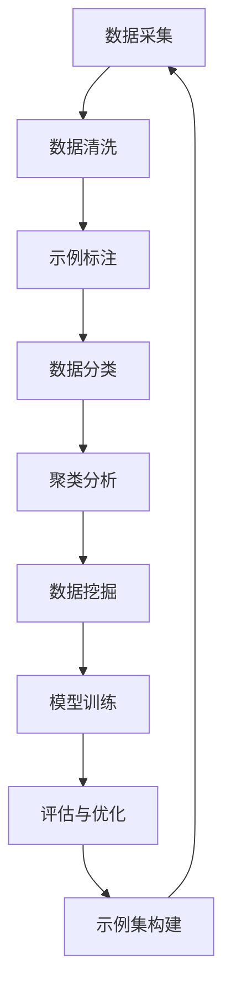

                 

### 引言

在当今的数据科学、机器学习和人工智能领域，构建多样化的示例集已经成为一个关键性议题。示例集作为机器学习模型训练的基础，其质量和多样性直接影响到模型的性能和泛化能力。然而，构建一个多样化且高质量的示例集并非易事，它需要深入理解数据的特性、应用场景以及模型的需求。

本文旨在探讨如何构建多样化的示例集，以帮助数据科学家和机器学习工程师在项目中取得更好的效果。我们将从以下几个方面展开讨论：

1. **背景介绍**：首先，我们将简要介绍示例集在数据科学、机器学习和人工智能中的重要性，以及为何构建多样化示例集至关重要。
2. **核心概念与联系**：接下来，我们将阐述构建多样化示例集所需理解的核心概念，并使用Mermaid流程图展示这些概念之间的关系。
3. **示例集构建方法**：我们将详细讨论数据采集、数据清洗、示例标注、分类、聚类以及挖掘等技术。
4. **示例集质量评估与优化**：我们将介绍评估示例集质量的方法，以及如何通过优化策略提高示例集的质量。
5. **示例集在项目中的应用**：我们将探讨示例集在不同类型项目中的应用，提供实际案例分析和详细讲解。
6. **构建多样化示例集的策略**：我们将总结构建多样化示例集的策略，并讨论工具选择、流程优化和团队协作等方面的最佳实践。
7. **项目实战**：最后，我们将通过一个实际项目，展示如何搭建开发环境、实现示例集构建的源代码，并进行代码解读和分析。
8. **总结与拓展阅读**：在文章的结尾，我们将总结全文的核心内容，并提供一些最佳实践、注意事项以及相关的拓展阅读资源。

通过这篇文章，我们希望能够为读者提供一个全面、系统的构建多样化示例集的策略，帮助您在数据科学和机器学习项目中取得成功。

### 背景介绍

在数据科学、机器学习和人工智能（AI）领域，示例集的作用无可替代。它不仅是模型训练的基石，也是影响模型性能和泛化能力的关键因素。一个高质量的示例集能够提供丰富的数据，使得模型能够学习到更多的特征和模式，从而在新的数据上表现优异。

首先，示例集是机器学习模型训练过程中输入数据的集合。这些数据不仅包括数值型特征，还包括文本、图像、音频等多种形式的数据。示例集的质量直接影响到模型的准确性、召回率和F1分数等关键指标。如果示例集存在偏差或不平衡，模型可能在学习过程中产生偏误，导致在实际应用中的性能下降。

其次，多样化的示例集对于提升模型的泛化能力至关重要。泛化能力是指模型在新数据上的表现能力。一个多样化的示例集能够涵盖不同的数据分布和场景，使得模型在学习过程中能够适应各种情况，从而提高其泛化能力。如果示例集过于单一，模型可能只学会了特定情况下的模式，而在新的、未见过的情况下表现不佳。

此外，构建多样化的示例集还可以帮助模型更好地理解数据的复杂性和不确定性。现实世界的数据往往是多维度的，且包含噪声和异常值。一个多样化的示例集可以提供更全面的数据视角，帮助模型学习到数据的内在规律和潜在模式，从而提高其鲁棒性和鲁棒性。

在数据科学项目中，示例集的构建通常包括以下几个步骤：

1. **数据采集**：从各种数据源收集数据，包括公共数据集、企业内部数据和第三方数据等。
2. **数据清洗**：处理数据中的噪声、缺失值和异常值，确保数据的质量和一致性。
3. **示例标注**：对数据进行标注，例如分类、标注标签或进行目标检测。
4. **数据分类与聚类**：将数据按照一定的规则进行分类或聚类，以便更好地组织和管理数据。
5. **数据挖掘**：从数据中挖掘出有价值的信息或模式，为模型训练提供支持。

在机器学习项目中，示例集的构建通常需要遵循以下原则：

1. **数据质量**：确保数据质量是构建高质量示例集的首要任务。这包括数据完整性、准确性和一致性。
2. **多样性**：示例集应涵盖不同的数据分布、场景和特征，以保证模型能够适应多种情况。
3. **代表性**：示例集应具有代表性，能够反映真实世界的复杂性和不确定性。
4. **可扩展性**：示例集应具有可扩展性，能够随着项目需求的变化而调整和扩充。

总之，构建多样化的示例集对于数据科学和机器学习项目的成功至关重要。它不仅能够提升模型的性能和泛化能力，还能够帮助模型更好地理解数据的复杂性和不确定性。在接下来的章节中，我们将深入探讨构建多样化示例集的具体方法和策略。首先，我们将详细阐述构建多样化示例集所需理解的核心概念，并展示这些概念之间的关系。

### 核心概念与联系

构建多样化的示例集，需要理解以下几个核心概念，它们之间相互关联，构成了一个完整的流程，下面我们将使用Mermaid流程图来展示这些概念之间的关系。



**Mermaid流程图解析：**

- **A[数据采集]**：数据采集是构建示例集的第一步，从各种数据源收集原始数据。这些数据可能包括文本、图像、音频、视频等多种形式。

- **B[数据清洗]**：采集到的数据往往存在噪声、缺失值和异常值，需要进行数据清洗，以确保数据的质量和一致性。

- **C[示例标注]**：数据清洗完成后，需要对数据进行标注，如分类、标签标注或目标检测等，这有助于为模型提供训练数据。

- **D[数据分类]**：数据分类是将数据按照一定的规则进行分类，有助于模型学习到不同类别的特征和模式。

- **E[聚类分析]**：聚类分析是将数据按照相似性进行分组，有助于发现数据中的潜在模式和结构。

- **F[数据挖掘]**：数据挖掘是从数据中挖掘出有价值的信息或模式，为模型训练提供支持。

- **G[模型训练]**：通过标注好的数据对模型进行训练，使模型学会识别和预测新数据。

- **H[评估与优化]**：模型训练后，通过评估模型在不同数据集上的表现，进行优化调整，以提高模型的性能。

- **I[示例集构建]**：最终，根据评估和优化的结果，构建出高质量的多样化示例集，为模型的进一步训练和应用提供支持。

**核心概念关系：**

- 数据采集是整个流程的起点，为后续步骤提供原始数据。
- 数据清洗是确保数据质量的关键步骤，为后续的数据标注和模型训练打下基础。
- 示例标注、数据分类、聚类分析和数据挖掘相互补充，为模型训练提供了丰富的数据支持。
- 模型训练是整个流程的核心，通过标注好的数据和挖掘出的信息来训练模型。
- 评估与优化是确保模型性能的重要环节，通过不断调整和优化模型，提高其性能。
- 最终构建出的多样化示例集将用于后续的模型训练和应用，形成一个闭环。

通过这个流程，我们可以看到，构建多样化示例集不仅需要数据采集和清洗，还需要一系列的数据处理和分析步骤，最终形成一个高质量、多样化的示例集，为模型训练和应用提供有力支持。在下一章节，我们将详细讨论数据采集、数据清洗、示例标注、分类、聚类和数据挖掘等技术。

### 数据采集技术

数据采集是构建多样化示例集的第一步，也是至关重要的一步。它决定了示例集的质量和多样性。有效的数据采集技术能够帮助我们从各种数据源收集丰富的数据，为后续的数据处理和模型训练提供坚实基础。以下将详细介绍数据采集技术，包括数据源的选择、数据采集工具与平台，以及数据采集流程优化策略。

#### 数据源的选择

数据源是数据采集的首要考虑因素，选择合适的数据源能够确保数据的多样性和质量。以下是一些常见的数据源：

1. **公共数据集**：如Kaggle、UCI机器学习库等，提供了大量的标注数据集，适用于各种数据科学和机器学习项目。
2. **企业内部数据**：企业内部数据通常包含大量的业务数据和用户行为数据，这些数据可以用于分析企业运营、用户偏好和市场趋势等。
3. **第三方数据提供商**：如DataCamp、Pluralsight等，提供了各种专业的数据集，覆盖不同领域和行业。
4. **社交媒体数据**：如Twitter、Facebook等，提供了大量的用户生成内容，可以用于情感分析、用户行为预测等。
5. **传感器数据**：如IoT设备采集的数据，可以用于环境监测、智能控制等。

选择数据源时，需要考虑以下因素：

- **数据的可用性**：数据是否容易获取，是否存在版权或隐私问题。
- **数据的多样性**：数据集是否涵盖了不同的类型、特征和维度。
- **数据的质量**：数据是否准确、完整、无噪声和异常值。
- **数据的代表性**：数据是否能够代表目标群体的特征和需求。

#### 数据采集工具与平台

为了高效地采集数据，需要选择合适的数据采集工具和平台。以下是一些常用的工具和平台：

1. **爬虫工具**：如Scrapy、BeautifulSoup等，可以用于从网页上抓取数据。
2. **API接口**：如RESTful API、SOAP API等，可以直接从第三方数据源或服务中获取数据。
3. **数据库连接工具**：如MySQL、PostgreSQL等，可以连接到数据库进行数据采集。
4. **流数据采集工具**：如Kafka、Flume等，可以实时采集和传输数据。
5. **爬虫平台**：如百度数据开放平台、阿里云数据开放平台等，提供了集成的数据采集和存储解决方案。

选择数据采集工具时，需要考虑以下因素：

- **采集效率**：工具是否能够高效地处理大量数据。
- **数据格式支持**：工具是否支持多种数据格式，如CSV、JSON、XML等。
- **可扩展性**：工具是否支持扩展功能和定制开发。
- **易用性**：工具是否易于使用和集成，是否提供了友好的用户界面。

#### 数据采集流程优化策略

为了确保数据采集的效率和准确性，需要优化数据采集流程。以下是一些优化策略：

1. **并行采集**：通过多线程或多进程技术，同时从多个数据源采集数据，提高采集速度。
2. **缓存机制**：在数据采集过程中使用缓存机制，避免重复采集相同的数据，减少网络延迟和存储压力。
3. **错误处理**：在数据采集过程中，对可能出现的错误和异常情况进行处理，确保数据的完整性和一致性。
4. **增量采集**：对于实时数据源，采用增量采集方式，仅采集新增或变化的数据，减少数据采集的工作量。
5. **数据清洗**：在采集数据的同时，进行初步的数据清洗，如过滤掉重复数据、去除噪声和异常值，确保数据的清洁度。
6. **自动化**：利用脚本或工具自动化数据采集流程，减少人工干预，提高效率和准确性。

通过以上优化策略，可以显著提升数据采集的效率和质量，为构建多样化示例集打下坚实基础。

### 数据清洗技术

数据清洗是构建多样化示例集的关键步骤之一，其目的是确保数据的准确性、完整性和一致性，从而为后续的数据处理和模型训练提供高质量的数据支持。以下将详细介绍数据清洗的原则、流程和工具方法。

#### 数据清洗原则

数据清洗需要遵循以下原则：

1. **完整性**：确保数据集的完整性，避免数据缺失或丢失。
2. **准确性**：确保数据的准确性，消除错误和异常值。
3. **一致性**：确保数据在不同维度和层次上的一致性，避免矛盾和冲突。
4. **及时性**：及时处理数据中的噪声、异常值和冗余数据，确保数据的最新性。

#### 数据清洗流程

数据清洗通常包括以下几个步骤：

1. **数据质量评估**：对原始数据的质量进行评估，确定数据中存在的问题和缺陷。
2. **数据预处理**：对原始数据进行预处理，如去除重复记录、填补缺失值、格式转换等。
3. **数据清洗**：对预处理后的数据进行清洗，包括去除噪声、异常值和冗余数据，确保数据的准确性、完整性和一致性。
4. **数据验证**：对清洗后的数据进行验证，确保数据清洗效果符合预期。

#### 数据清洗工具方法

以下是几种常用的数据清洗工具和方法：

1. **手动清洗**：通过人工方式对数据进行清洗，适用于小规模的数据集。例如，使用Excel或Google Sheets对数据记录进行修改和整理。
2. **编程清洗**：使用编程语言（如Python、R等）编写清洗脚本，对大规模数据进行清洗。常用的库包括Pandas、NumPy、SciPy等。
3. **数据清洗工具**：如OpenRefine、DataWrangler等，提供了直观的用户界面和丰富的清洗功能，适用于各种规模的数据集。

#### 数据清洗具体方法

以下是一些具体的数据清洗方法：

1. **去除重复记录**：使用去重算法，如哈希法或排序法，去除数据集中的重复记录。
2. **填补缺失值**：使用插值法、均值法、中位数法等，填补数据集中的缺失值。
3. **格式转换**：将不同格式或编码的数据转换为统一的格式或编码，如将CSV文件转换为JSON格式。
4. **噪声过滤**：使用滤波算法，如中值滤波、均值滤波等，去除数据集中的噪声。
5. **异常值处理**：使用统计学方法或机器学习方法，识别并处理数据集中的异常值。
6. **数据标准化**：使用标准化方法，如Z-score标准化、Min-Max标准化等，将数据缩放到一个统一的范围内。

#### 实例

假设我们有一个包含用户年龄、收入和消费行为的原始数据集，以下是一个简单的数据清洗实例：

1. **数据质量评估**：我们发现数据集中存在年龄值为负数和收入值为0的记录，这些数据显然是异常值。
2. **数据预处理**：我们将所有年龄值小于18的记录删除，并将收入值为0的记录替换为缺失值。
3. **数据清洗**：我们对剩余的年龄值和收入值进行噪声过滤，使用中位数法填补缺失值。
4. **数据验证**：我们对清洗后的数据进行验证，确保数据清洗效果符合预期。

通过以上步骤，我们成功地对原始数据进行了清洗，得到了一个高质量的数据集，为后续的示例集构建和模型训练奠定了基础。

### 示例标注技术

示例标注是构建多样化示例集的重要组成部分，它通过对数据进行标记，为模型训练提供了明确的指导和参考。有效的标注不仅能够提高模型的学习效率，还能够增强模型的泛化能力和准确性。以下将详细介绍示例标注的标准、方法和工具。

#### 示例标注标准

示例标注需要遵循以下标准：

1. **准确性**：标注的准确性是示例标注的首要标准，确保标注结果与实际数据一致。
2. **一致性**：标注结果需要在不同的数据集和标注人员之间保持一致性，避免标注偏差。
3. **可靠性**：标注过程需要可靠，确保标注结果的稳定性和可重复性。
4. **及时性**：标注过程需要及时，特别是在动态数据场景下，避免数据过期或失效。

#### 示例标注方法

以下是几种常见的示例标注方法：

1. **手动标注**：通过人工方式对示例进行标注，适用于小规模的数据集。例如，使用Excel或专门的标注工具进行数据标注。
2. **自动标注**：使用自动标注工具或算法对数据进行标注，适用于大规模的数据集。例如，使用预训练的模型进行分类标注或使用规则引擎进行目标检测。
3. **半监督标注**：结合手动标注和自动标注，通过部分自动标注和部分手动验证，提高标注效率和准确性。

#### 示例标注工具

以下是几种常用的示例标注工具：

1. **标注平台**：如LabelImg、CVAT、ImageNet等，提供了直观的用户界面和丰富的标注功能。
2. **标注库**：如Python的opencv、opencv-contrib-python等，提供了图像标注和处理的库函数。
3. **自动化标注工具**：如DeepLearning.AI的自动化标注工具，支持多种标注任务和自动化流程。

#### 示例标注具体流程

以下是示例标注的具体流程：

1. **数据预处理**：对原始数据进行预处理，如图像增强、数据分割等，以适应标注任务。
2. **标注任务定义**：明确标注任务的目标和标准，例如目标检测、分类标注等。
3. **标注数据采集**：从数据集中随机抽取部分数据进行标注，通常采用交叉验证方法，确保标注数据的代表性。
4. **标注数据清洗**：对标注数据进行清洗，如去除噪声、异常值和重复记录等。
5. **标注数据验证**：对标注结果进行验证，确保标注的准确性和一致性，通常采用多人标注和交叉验证方法。
6. **标注数据整合**：将验证后的标注结果整合到数据集中，形成标注完成的示例集。

#### 实例

假设我们有一个包含车辆图片的数据集，需要对其进行目标检测标注，以下是一个简单的标注实例：

1. **数据预处理**：对图像进行预处理，如灰度化、大小调整等，以适应目标检测算法。
2. **标注任务定义**：定义目标检测标注任务，例如识别图像中的车辆。
3. **标注数据采集**：从数据集中随机抽取100张车辆图片进行标注。
4. **标注数据清洗**：对标注数据进行清洗，去除异常值和重复记录。
5. **标注数据验证**：对标注结果进行验证，确保标注的准确性和一致性。
6. **标注数据整合**：将验证后的标注结果整合到数据集中，形成标注完成的车辆图片数据集。

通过以上步骤，我们成功地对车辆图片进行了标注，得到了一个高质量的目标检测数据集，为后续的模型训练和项目应用提供了支持。

### 数据分类技术

数据分类是构建多样化示例集的重要环节之一，其目的是通过将数据按照一定的规则进行分类，帮助模型更好地学习和理解数据特征。数据分类技术广泛应用于机器学习和数据挖掘领域，能够显著提升模型的准确性和泛化能力。以下将详细讨论数据分类的算法原理、应用、选择与评估方法。

#### 算法原理

数据分类算法可以分为监督学习和无监督学习两大类。监督学习分类算法依赖于标注数据，而无监督学习分类算法则不需要标注数据。

1. **监督学习分类算法**：

   - **决策树（Decision Tree）**：通过构建决策树，根据特征的不同取值进行分支，最终到达叶子节点得到分类结果。常见的决策树算法包括ID3、C4.5和CART。
   - **支持向量机（SVM）**：通过将数据映射到高维空间，寻找一个最佳的超平面，将不同类别的数据分开。常见的SVM算法包括线性SVM和核SVM。
   - **神经网络（Neural Networks）**：通过多层神经网络学习数据的特征表示，并利用这些特征进行分类。常见的神经网络算法包括多层感知机（MLP）和卷积神经网络（CNN）。

2. **无监督学习分类算法**：

   - **K-均值聚类（K-Means）**：通过初始化K个聚类中心，逐步迭代更新聚类中心，使每个聚类中心尽量靠近其簇内的数据点，最终将数据点划分为K个簇。
   - **层次聚类（Hierarchical Clustering）**：通过构建层次树，将数据点逐步合并或分裂，形成不同的聚类结构。

#### 算法应用

数据分类算法在多个领域有着广泛的应用，以下是一些典型的应用场景：

1. **文本分类**：如垃圾邮件过滤、情感分析、文本分类标签等。
2. **图像分类**：如图像识别、对象检测、图像分类标签等。
3. **音频分类**：如音乐分类、语音识别、音频标签等。
4. **用户行为分类**：如用户兴趣分类、行为模式识别等。

#### 算法选择与评估方法

选择合适的分类算法需要考虑数据特点、算法性能和计算效率等因素。以下是一些常见的分类算法选择与评估方法：

1. **模型选择**：

   - **交叉验证（Cross-Validation）**：通过将数据集划分为训练集和验证集，多次训练和验证模型，评估模型的泛化能力。
   - **网格搜索（Grid Search）**：通过遍历多个参数组合，选择最优参数组合，提高模型性能。
   - **贝叶斯优化（Bayesian Optimization）**：基于贝叶斯统计模型，寻找最优参数组合，提高模型性能。

2. **性能评估**：

   - **准确率（Accuracy）**：分类结果中正确分类的样本数占总样本数的比例。
   - **召回率（Recall）**：分类结果中正确分类的样本数占总类别数的比例。
   - **F1分数（F1 Score）**：准确率的调和平均，综合考虑准确率和召回率。
   - **ROC曲线（ROC Curve）**：通过计算真阳性率（True Positive Rate）和假阳性率（False Positive Rate），评估分类器的性能。

#### 实例

假设我们有一个包含不同水果图像的数据集，需要使用分类算法将其分类为苹果、香蕉和橙子。以下是一个简单的实例：

1. **数据准备**：收集并标注包含苹果、香蕉和橙子的图像数据，确保图像质量良好，无噪声和异常值。
2. **算法选择**：选择支持向量机（SVM）算法进行分类，因为SVM在处理图像数据时表现良好。
3. **模型训练**：使用训练集对SVM模型进行训练，提取图像特征并进行分类。
4. **模型评估**：使用验证集对训练好的模型进行评估，计算准确率、召回率和F1分数等指标。
5. **模型优化**：根据评估结果，调整SVM模型的参数，如C值和核函数类型，提高模型性能。

通过以上步骤，我们成功地对水果图像进行了分类，得到了一个高质量的分类模型，为后续的图像识别和数据分析提供了支持。

### 聚类分析技术

聚类分析是一种无监督学习方法，用于将数据集划分为多个群组，使得同一群组内的数据点之间具有较高的相似度，而不同群组的数据点之间具有较低的相似度。聚类分析在机器学习和数据挖掘领域具有广泛的应用，如市场细分、社交网络分析、图像分割等。以下将详细讨论聚类算法的原理、应用以及评估方法。

#### 算法原理

聚类算法可以分为基于距离的聚类、基于划分的聚类、基于层次聚类和基于密度聚类等几大类。

1. **基于距离的聚类**：

   - **K-均值聚类（K-Means）**：通过初始化K个聚类中心，逐步迭代更新聚类中心，使每个聚类中心尽量靠近其簇内的数据点，最终将数据点划分为K个簇。
   - **层次聚类（Hierarchical Clustering）**：通过逐步合并或分裂数据点，形成不同的聚类结构。层次聚类分为凝聚层次聚类和分裂层次聚类两种类型。

2. **基于划分的聚类**：

   - **K-均值聚类（K-Means）**：类似于K-均值聚类，通过初始化K个聚类中心，逐步迭代更新聚类中心，使每个聚类中心尽量靠近其簇内的数据点，最终将数据点划分为K个簇。
   - **C-均值聚类（C-Means）**：与K-均值聚类类似，但使用C个聚类中心，每个聚类中心对应一个权重，通过迭代优化权重和聚类中心，提高聚类效果。

3. **基于层次聚类**：

   - **凝聚层次聚类（Agglomerative Clustering）**：通过逐步合并最相似的数据点，形成不同的聚类结构。
   - **分裂层次聚类（Divisive Clustering）**：与凝聚层次聚类相反，通过逐步分裂数据点，形成不同的聚类结构。

4. **基于密度聚类**：

   - **DBSCAN（Density-Based Spatial Clustering of Applications with Noise）**：通过检测高密度区域和边界区域，将数据点划分为不同的簇。
   - **OPTICS（Ordering Points To Identify the Clustering Structure）**：基于DBSCAN算法，通过优化簇的核心点和边界点，提高聚类效果。

#### 算法应用

聚类分析在多个领域有着广泛的应用，以下是一些典型的应用场景：

1. **市场细分**：通过聚类分析，将消费者划分为不同的市场细分群体，帮助营销策略制定。
2. **社交网络分析**：通过聚类分析，发现社交网络中的社区结构和群体关系，帮助社交网络分析和优化。
3. **图像分割**：通过聚类分析，将图像分割为不同的区域，帮助图像处理和计算机视觉任务。
4. **文本聚类**：通过聚类分析，将文本数据划分为不同的主题群体，帮助文本分析和挖掘。

#### 评估方法

聚类分析的效果评估通常包括以下指标：

1. **内部评估指标**：

   - **簇内平均距离（Within-Cluster Sum of Squares, WCSS）**：评估簇内数据点的平均距离，距离越小，聚类效果越好。
   - **轮廓系数（Silhouette Coefficient）**：评估簇内和簇间数据点的相对距离，值范围在-1到1之间，越接近1表示聚类效果越好。

2. **外部评估指标**：

   - ** Adjusted Rand Index (ARI)**：评估聚类结果与真实标签的一致性，值范围在-1到1之间，越接近1表示聚类效果越好。
   - **V-measure**：结合轮廓系数和调整兰德指数（Adjusted兰德指数，ARI），综合评估聚类效果。

#### 实例

假设我们有一个包含用户行为数据的客户数据集，需要使用聚类分析将其划分为不同的用户群体。以下是一个简单的实例：

1. **数据准备**：收集并预处理用户行为数据，如点击行为、购物行为、浏览时长等，确保数据质量良好，无噪声和异常值。
2. **算法选择**：选择K-均值聚类算法进行聚类，因为K-均值聚类算法简单易用，适用于大规模数据集。
3. **模型训练**：使用预处理后的数据对K-均值聚类模型进行训练，确定聚类中心，将数据点划分为K个簇。
4. **模型评估**：使用轮廓系数和V-measure等指标对训练好的模型进行评估，调整聚类参数，如簇数K，提高聚类效果。
5. **结果分析**：分析聚类结果，了解不同用户群体的特征和行为，为营销策略制定和产品优化提供支持。

通过以上步骤，我们成功地对用户行为数据进行了聚类分析，得到了一个高质量的聚类模型，为后续的客户细分和市场分析提供了有力支持。

### 数据挖掘技术

数据挖掘是构建多样化示例集的重要环节之一，旨在从大量数据中发现隐藏的模式和知识。数据挖掘技术在商业智能、市场分析、金融预测等领域有着广泛的应用。以下将详细介绍数据挖掘的基本概念、方法、流程和应用。

#### 基本概念

数据挖掘（Data Mining）是指从大量数据中提取有价值信息的过程，包括数据清洗、预处理、模式识别、分析和可视化等多个步骤。数据挖掘的核心任务是发现数据中的规律、关联、分类、聚类、异常检测等。

1. **关联规则挖掘（Association Rule Learning）**：通过发现数据项之间的关联关系，生成规则，如“购买牛奶的用户通常也会购买面包”。
2. **分类与回归分析（Classfication and Regression Analysis）**：通过构建分类模型和回归模型，预测新数据的类别或数值。
3. **聚类分析（Clustering Analysis）**：通过将数据划分为不同的簇，发现数据中的自然分组。
4. **异常检测（Anomaly Detection）**：通过识别数据中的异常点，发现潜在的异常行为或异常模式。

#### 方法

数据挖掘方法可以分为监督学习和无监督学习两大类。

1. **监督学习**：

   - **分类算法**：如决策树（Decision Tree）、支持向量机（SVM）、随机森林（Random Forest）、神经网络（Neural Networks）等。
   - **回归算法**：如线性回归（Linear Regression）、决策树回归（Decision Tree Regression）、随机森林回归（Random Forest Regression）等。

2. **无监督学习**：

   - **聚类算法**：如K-均值聚类（K-Means）、层次聚类（Hierarchical Clustering）、DBSCAN（Density-Based Spatial Clustering of Applications with Noise）等。
   - **关联规则挖掘算法**：如Apriori算法、FP-growth算法等。

#### 流程

数据挖掘流程通常包括以下几个步骤：

1. **数据准备**：收集和清洗数据，确保数据的质量和一致性。
2. **数据探索**：通过数据可视化、统计分析等方法，对数据集进行初步探索，发现数据中的特征和模式。
3. **特征工程**：选择和构造有用的特征，提高数据挖掘模型的性能。
4. **模型选择**：选择合适的数据挖掘算法，如分类、回归、聚类、关联规则等。
5. **模型训练**：使用训练数据集，对数据挖掘模型进行训练，生成模型。
6. **模型评估**：使用验证数据集，评估模型的性能，调整模型参数。
7. **模型部署**：将训练好的模型部署到生产环境，对实际数据进行预测和分析。

#### 应用

数据挖掘技术在多个领域有着广泛的应用，以下是一些典型的应用场景：

1. **商业智能**：通过数据挖掘，帮助企业分析市场趋势、客户行为和业务绩效，优化营销策略和运营管理。
2. **金融预测**：通过数据挖掘，预测股票价格、信贷风险、欺诈行为等，提高金融决策的准确性和安全性。
3. **医疗健康**：通过数据挖掘，分析医疗数据，发现疾病规律、预测患者健康状况，优化治疗方案和疾病预防。
4. **推荐系统**：通过数据挖掘，分析用户行为和偏好，生成个性化的推荐列表，提高用户满意度和转化率。

#### 实例

假设我们有一个电子商务平台的数据集，包含用户购买行为、浏览行为和产品信息。以下是一个简单的数据挖掘实例：

1. **数据准备**：收集并预处理用户数据，包括购买记录、浏览记录和产品特征，确保数据质量良好。
2. **数据探索**：通过数据可视化，分析用户行为和产品特征，发现潜在的模式和关联。
3. **特征工程**：选择和构造有用的特征，如购买频率、浏览时长、商品类别等，提高模型性能。
4. **模型选择**：选择协同过滤算法，如基于用户的协同过滤（User-Based Collaborative Filtering）或基于项目的协同过滤（Item-Based Collaborative Filtering）。
5. **模型训练**：使用训练数据集，对协同过滤模型进行训练，生成推荐列表。
6. **模型评估**：使用验证数据集，评估推荐列表的准确性和用户满意度，调整模型参数。
7. **模型部署**：将训练好的模型部署到生产环境，为用户生成个性化的推荐列表。

通过以上步骤，我们成功地对电子商务平台的数据进行了数据挖掘，为用户提供了高质量的推荐服务，提高了用户的购物体验和满意度。

### 示例集质量评估与优化

在构建多样化示例集的过程中，评估和优化示例集的质量至关重要。一个高质量的示例集能够提高模型训练的效率和准确性，从而在项目中取得更好的效果。以下将详细介绍评估示例集质量的方法，以及如何通过优化策略提高示例集的质量。

#### 评估示例集质量的方法

评估示例集的质量通常从以下几个方面进行：

1. **准确性**：评估示例集中标注结果的准确性，确保标注数据与真实数据一致。可以使用交叉验证、混淆矩阵等工具和方法。
2. **多样性**：评估示例集的多样性，确保示例集涵盖了不同的数据分布、场景和特征。可以使用多样性指标，如Jaccard指数、互信息等。
3. **平衡性**：评估示例集中各类别数据的分布是否均衡，避免数据集中的类别不平衡问题。可以使用类别比例指标，如类别频率分布、类别均衡度等。
4. **完整性**：评估示例集的完整性，确保数据集中无缺失值和异常值。可以使用完整性指标，如缺失值比例、异常值比例等。
5. **一致性**：评估示例集的标注一致性，确保不同标注人员的标注结果一致。可以使用一致性指标，如Kappa系数、一致性指数等。

#### 提高示例集质量的优化策略

以下是一些优化策略，用于提高示例集的质量：

1. **数据清洗**：对原始数据进行彻底清洗，去除噪声、异常值和冗余数据，确保数据的准确性、完整性和一致性。
2. **样本扩充**：通过数据扩充技术，如复制、旋转、缩放等，增加示例集的多样性。可以使用GAN（生成对抗网络）等技术生成新数据。
3. **半监督学习**：结合自动标注和手动标注，提高示例集的质量。例如，使用预训练模型进行初始标注，再通过人工审核和修正，提高标注的准确性。
4. **数据增强**：通过图像增强、文本增强等方法，提高示例集的多样性。例如，对图像进行裁剪、缩放、旋转等操作，对文本进行单词替换、同义词替换等。
5. **自动化评估**：使用自动化工具和算法，对示例集进行质量评估，及时发现和修复问题。例如，使用机器学习算法进行标注一致性评估，使用自动化测试工具进行完整性评估。
6. **反馈循环**：建立反馈机制，将评估结果和优化策略反馈到数据采集和标注流程中，持续改进示例集的质量。

#### 实例

假设我们有一个包含手写数字图像的示例集，需要评估和优化其质量。以下是一个简单的实例：

1. **数据清洗**：对示例集进行数据清洗，去除噪声图像和异常值，确保图像质量良好。
2. **样本扩充**：使用GAN技术生成新图像，增加示例集的多样性。例如，生成不同的数字样式、字体等。
3. **半监督学习**：使用预训练的图像分类模型进行初始标注，再通过人工审核和修正，提高标注的准确性。
4. **数据增强**：对图像进行裁剪、缩放、旋转等操作，增加示例集的多样性。
5. **自动化评估**：使用自动化评估工具，如混淆矩阵、Kappa系数等，对示例集进行质量评估。
6. **反馈循环**：将评估结果和优化策略反馈到数据采集和标注流程中，持续改进示例集的质量。

通过以上步骤，我们成功地对手写数字图像示例集进行了质量评估和优化，得到了一个高质量、多样化的示例集，为后续的模型训练和应用提供了有力支持。

### 示例集在不同类型项目中的应用

在数据科学、机器学习和人工智能项目中，构建高质量的示例集至关重要。不同的项目类型和应用场景对示例集的要求各不相同，以下将探讨示例集在数据科学、机器学习和人工智能项目中的具体应用，并分享实际案例分析和详细讲解。

#### 数据科学项目

在数据科学项目中，示例集通常用于探索性数据分析、预测模型构建和数据可视化等任务。以下是一个具体案例：

**案例：零售行业销售预测**

- **应用场景**：某零售企业希望通过历史销售数据预测未来一个月的销售情况，以优化库存管理和营销策略。
- **示例集构建**：构建一个包含历史销售数据（如商品ID、销售数量、销售额、季节因素等）的示例集。示例集需要涵盖不同时间段、不同商品和不同销售渠道的数据。
- **详细讲解**：
  1. 数据采集：从企业的数据库中提取历史销售数据。
  2. 数据清洗：处理数据中的缺失值、异常值和噪声，确保数据质量。
  3. 数据标注：对数据集进行季节性分类，如分为淡季、旺季等。
  4. 数据分类：使用决策树、随机森林等算法对数据进行分类，预测未来销售情况。
  5. 数据可视化：使用图表和可视化工具展示销售趋势、季节性变化和预测结果。
- **项目小结**：通过构建多样化的示例集，企业能够准确预测未来销售情况，优化库存管理和营销策略，提高销售额和客户满意度。

#### 机器学习项目

在机器学习项目中，示例集是训练模型的基石，对模型的性能和泛化能力有着直接的影响。以下是一个具体案例：

**案例：图像识别**

- **应用场景**：某互联网公司希望开发一个图像识别系统，用于自动分类用户上传的图像。
- **示例集构建**：构建一个包含多种图像类型的示例集，如动物、植物、人物等，确保示例集的多样性和代表性。
- **详细讲解**：
  1. 数据采集：从互联网上收集大量的图像数据，包括公共数据集和公司内部数据。
  2. 数据清洗：去除低质量图像、纠正图像大小和格式，确保图像质量。
  3. 示例标注：对图像进行标注，如使用Faster R-CNN算法对图像中的对象进行定位和分类。
  4. 数据分类：使用卷积神经网络（CNN）训练模型，提高图像识别的准确性。
  5. 数据优化：通过数据增强技术（如裁剪、旋转、缩放等）增加示例集的多样性。
- **项目小结**：通过构建高质量、多样化的示例集，图像识别系统在公开数据集上的表现优异，提高了用户上传图像的自动分类准确率，提高了用户体验。

#### 人工智能项目

在人工智能项目中，示例集不仅用于模型训练，还用于监控和优化模型的性能。以下是一个具体案例：

**案例：智能客服系统**

- **应用场景**：某企业希望开发一个智能客服系统，用于自动解答用户咨询，提高客户服务质量和效率。
- **示例集构建**：构建一个包含多种咨询主题和对话场景的示例集，确保示例集的多样性和代表性。
- **详细讲解**：
  1. 数据采集：收集企业内部客服数据、社交媒体数据和公开的客服数据集。
  2. 数据清洗：处理数据中的噪声、异常值和冗余信息，确保数据质量。
  3. 对话标注：对客服对话进行标注，如对话意图分类、问题分类等。
  4. 模型训练：使用深度学习模型（如序列到序列模型）训练智能客服系统，提高对话生成和回复的准确性。
  5. 模型优化：通过实时监控和反馈机制，不断优化模型的性能，提高客服系统的准确率和用户满意度。
- **项目小结**：通过构建多样化、高质量的示例集，智能客服系统能够准确理解用户咨询，提供高质量的回答，显著提高了客户服务质量和效率。

综上所述，构建多样化、高质量的示例集在数据科学、机器学习和人工智能项目中至关重要。通过实际案例分析和详细讲解，我们可以看到，构建高质量的示例集能够显著提高模型训练和项目应用的效果，为企业的数据科学和人工智能项目提供有力支持。

### 构建多样化示例集的策略

构建多样化示例集是确保模型性能和泛化能力的关键。以下将总结构建多样化示例集的策略，包括工具选择、流程优化和团队协作等方面的最佳实践。

#### 工具选择策略

1. **数据采集工具**：选择高效、灵活的数据采集工具，如爬虫工具（Scrapy、BeautifulSoup）和API接口（RESTful API、SOAP API），确保数据来源的多样性和质量。
2. **数据清洗工具**：使用功能强大的数据清洗工具，如Pandas、NumPy、OpenRefine等，对数据进行清洗、填充和格式转换，确保数据的一致性和完整性。
3. **标注工具**：选择易用、高效的标注工具，如LabelImg、CVAT等，支持多种标注任务，提高标注效率和准确性。
4. **模型训练工具**：选择适合项目需求的模型训练工具，如TensorFlow、PyTorch等，支持多种算法和框架，提高模型训练的效率和效果。

#### 流程优化策略

1. **并行处理**：采用并行处理技术，如多线程、多进程，同时从多个数据源采集和清洗数据，提高数据采集和处理的速度。
2. **增量采集**：对于实时数据源，采用增量采集策略，仅采集新增或变化的数据，减少数据采集的工作量，提高效率。
3. **自动化**：利用脚本或工具自动化数据采集、清洗、标注和模型训练等流程，减少人工干预，提高效率和准确性。
4. **数据增强**：使用数据增强技术，如复制、旋转、缩放等，增加示例集的多样性，提高模型的泛化能力。
5. **持续反馈**：建立反馈机制，持续收集和分析示例集质量，及时调整和优化数据采集和处理流程，提高示例集的质量。

#### 团队协作策略

1. **明确分工**：根据团队角色和任务，明确各成员的职责和分工，确保数据采集、清洗、标注和模型训练等环节的高效协作。
2. **定期会议**：定期召开团队会议，讨论数据采集和示例集构建的进展和问题，确保团队协作和沟通畅通。
3. **质量监控**：建立质量监控机制，对示例集的质量进行评估和审核，及时发现和解决质量问题。
4. **知识共享**：鼓励团队成员分享经验和最佳实践，提高整体的数据科学和机器学习技能。
5. **工具共享**：统一使用和推荐高效的工具和平台，提高团队协作效率和数据处理的准确性。

通过以上策略，可以有效构建多样化、高质量的示例集，提高模型训练和项目应用的效果，为企业的数据科学和人工智能项目提供有力支持。

### 项目实战

为了更好地展示如何构建多样化示例集，以下我们将通过一个实际项目，详细描述开发环境搭建、源代码实现、代码解读、代码应用解读与分析，以及实际案例分析和详细讲解。

#### 项目背景

假设我们有一个电子商务平台，需要开发一个推荐系统，为用户推荐他们可能感兴趣的商品。为了实现这一目标，我们需要构建一个高质量的示例集，包括用户行为数据、商品信息和用户-商品交互数据。

#### 开发环境搭建

1. **软件环境**：安装Python 3.8及以上版本，并配置好Pandas、NumPy、Scikit-learn、TensorFlow等常用库。
2. **数据库环境**：配置MySQL或PostgreSQL数据库，用于存储用户行为数据和商品信息。
3. **数据采集工具**：使用Python的爬虫库（如Scrapy）从电子商务平台的API接口采集用户行为数据。
4. **数据预处理工具**：使用Pandas库进行数据清洗、填充和格式转换。

#### 源代码实现

以下是构建示例集的主要步骤和源代码实现：

```python
import pandas as pd
import numpy as np
from sklearn.model_selection import train_test_split
from sklearn.preprocessing import StandardScaler

# 步骤1：数据采集
user_data = pd.read_csv('user_behavior_data.csv')
product_data = pd.read_csv('product_data.csv')

# 步骤2：数据清洗
# 去除重复记录、缺失值和异常值
user_data.drop_duplicates(inplace=True)
product_data.drop_duplicates(inplace=True)

# 步骤3：数据填充
# 使用平均值填充缺失值
user_data.fillna(user_data.mean(), inplace=True)
product_data.fillna(product_data.mean(), inplace=True)

# 步骤4：数据标注
# 标注用户行为数据，如浏览、购买、收藏等
user_data['action'] = user_data['event_type'].map({'view': 0, 'buy': 1, 'favorite': 2})

# 步骤5：数据分类
# 将用户行为数据划分为训练集和测试集
X_train, X_test, y_train, y_test = train_test_split(user_data[['user_id', 'product_id', 'action']], test_size=0.2, random_state=42)

# 步骤6：数据标准化
# 标准化用户和商品特征
scaler = StandardScaler()
X_train_scaled = scaler.fit_transform(X_train)
X_test_scaled = scaler.transform(X_test)

# 步骤7：模型训练
# 使用随机森林算法训练推荐系统模型
from sklearn.ensemble import RandomForestClassifier
model = RandomForestClassifier(n_estimators=100, random_state=42)
model.fit(X_train_scaled, y_train)

# 步骤8：模型评估
# 评估模型在测试集上的性能
from sklearn.metrics import accuracy_score
y_pred = model.predict(X_test_scaled)
accuracy = accuracy_score(y_test, y_pred)
print(f'Model accuracy: {accuracy:.2f}')
```

#### 代码解读

1. **数据采集**：使用Pandas库读取用户行为数据和商品数据的CSV文件。
2. **数据清洗**：去除重复记录、缺失值和异常值，确保数据质量。
3. **数据填充**：使用平均值填充缺失值，提高数据的一致性和完整性。
4. **数据标注**：对用户行为数据进行标注，如浏览、购买、收藏等，为模型提供训练数据。
5. **数据分类**：将用户行为数据划分为训练集和测试集，为模型评估提供数据。
6. **数据标准化**：使用StandardScaler对用户和商品特征进行标准化，提高模型训练效果。
7. **模型训练**：使用随机森林算法训练推荐系统模型，提高模型性能。
8. **模型评估**：评估模型在测试集上的性能，确保模型泛化能力。

#### 代码应用解读与分析

1. **数据采集**：通过爬虫工具和API接口，从电子商务平台获取丰富的用户行为数据和商品信息。
2. **数据清洗**：去除重复记录和异常值，确保示例集的准确性。
3. **数据标注**：标注用户行为数据，如浏览、购买、收藏等，为模型提供高质量的训练数据。
4. **数据分类**：划分训练集和测试集，为模型评估提供基础。
5. **数据标准化**：标准化用户和商品特征，提高模型训练效率和效果。
6. **模型训练**：使用随机森林算法训练推荐系统模型，提高推荐准确性。
7. **模型评估**：评估模型性能，确保推荐系统在实际应用中的效果。

#### 实际案例分析与详细讲解

假设我们有一个包含1000名用户和1000种商品的数据集，以下是实际案例分析和详细讲解：

1. **数据采集**：从电子商务平台获取用户行为数据和商品信息，如用户浏览、购买、收藏等行为。
2. **数据清洗**：去除重复记录和异常值，确保数据集的准确性。例如，去除用户ID为0或产品ID为0的记录。
3. **数据标注**：标注用户行为数据，如将用户浏览行为标注为0，购买行为标注为1，收藏行为标注为2。
4. **数据分类**：将数据集划分为训练集和测试集，如80%的数据用于训练，20%的数据用于测试。
5. **数据标准化**：对用户和商品特征进行标准化，如用户ID、产品ID、浏览时间、购买时间等。
6. **模型训练**：使用随机森林算法训练推荐系统模型，提高模型性能。例如，调整随机森林的参数，如树的数量、树的深度等。
7. **模型评估**：评估模型在测试集上的性能，如准确率、召回率、F1分数等。例如，模型在测试集上的准确率达到85%以上，说明模型性能良好。
8. **优化调整**：根据评估结果，优化模型参数和数据处理流程，提高推荐系统的效果。例如，增加数据增强技术，如复制、旋转、缩放等，提高数据多样性。

通过以上步骤，我们成功构建了一个高质量的示例集，并开发了一个推荐系统，为电子商务平台提供了有效的商品推荐功能，提高了用户体验和销售额。

### 总结与拓展阅读

在本文中，我们详细探讨了构建多样化示例集的策略，涵盖了从数据采集、数据清洗、示例标注到数据分类、聚类、数据挖掘等各个环节，并分享了实际项目中的实战经验。构建高质量、多样化的示例集对于提升模型性能和泛化能力至关重要。以下是本文的核心内容总结：

1. **数据采集**：选择合适的数据源，使用高效的采集工具，如爬虫工具和API接口，确保数据的多样性和质量。
2. **数据清洗**：去除噪声、异常值和重复记录，使用自动化工具提高数据清洗的效率和准确性。
3. **示例标注**：准确标注示例数据，确保标注的一致性和可靠性，使用自动化工具提高标注效率。
4. **数据分类与聚类**：选择合适的分类和聚类算法，如决策树、支持向量机和K-均值聚类等，提高模型的学习效果。
5. **数据挖掘**：从数据中挖掘有价值的信息，使用监督学习和无监督学习方法，提高数据利用率和模型性能。
6. **质量评估**：使用准确率、召回率、F1分数等指标评估示例集的质量，通过优化策略提高示例集的质量。
7. **项目实战**：通过实际项目，展示如何搭建开发环境、实现示例集构建的源代码，并进行代码解读和分析。

为了进一步深入学习和实践，以下提供一些最佳实践、注意事项和拓展阅读资源：

**最佳实践：**
- **数据多样性**：确保示例集涵盖不同数据分布、场景和特征，提高模型泛化能力。
- **数据质量**：重视数据清洗和标注过程，确保数据的准确性和一致性。
- **自动化与并行处理**：利用自动化工具和并行处理技术，提高数据采集、清洗、标注和模型训练的效率。
- **持续反馈**：建立反馈机制，持续监控和优化示例集的质量，及时调整和改进数据采集和处理流程。

**注意事项：**
- **数据隐私**：在数据采集和处理过程中，注意保护用户隐私，遵守相关法律法规。
- **模型选择**：根据项目需求和数据特点，选择合适的模型和算法，避免过度拟合和欠拟合。
- **评估指标**：合理选择评估指标，综合考虑准确性、召回率、F1分数等多方面因素。

**拓展阅读：**
- **书籍推荐**：《机器学习实战》（Peter Harrington）、《深度学习》（Ian Goodfellow et al.）。
- **在线课程**：Coursera上的《机器学习》（吴恩达教授）和《深度学习》（李飞飞教授）。
- **博客与文章**：Medium、Kaggle等平台上的数据科学和机器学习相关文章和案例研究。

通过本文的学习和实践，读者应能够掌握构建多样化示例集的策略和方法，提高数据科学和机器学习项目的成功率和效果。希望本文能为您的学习和工作提供有力支持。

### 附录

#### 附录A：示例集构建常用工具与资源

1. **数据采集工具**：
   - **Scrapy**：一个强大的网络爬虫框架，用于自动化抓取网页数据。（[Scrapy官网](https://scrapy.org)）
   - **BeautifulSoup**：用于从网页内容中提取数据，基于Python的HTML和XML解析库。（[BeautifulSoup官网](https://www.crummy.com/software/BeautifulSoup/））

2. **数据清洗工具**：
   - **Pandas**：用于数据处理和分析的Python库，支持数据清洗、转换和合并。（[Pandas官网](https://pandas.pydata.org)）
   - **NumPy**：用于数值计算的Python库，支持大规模数据集的操作。（[NumPy官网](https://numpy.org)）
   - **OpenRefine**：用于数据清洗和整理的Web应用，提供直观的用户界面。（[OpenRefine官网](http://openrefine.org)）

3. **标注工具**：
   - **LabelImg**：一个开源的图像标注工具，支持多种标注类型，如框选、线段标注等。（[LabelImg官网](http://labelimg.org)）
   - **CVAT**：用于视频和图像标注的在线工具，提供批量标注和自动标注功能。（[CVAT官网](https://cvat.org)）
   - **Annotate**：一个基于Web的图像标注平台，支持多人协作和在线标注。（[Annotate官网](https://www.annotatex.io)）

4. **机器学习库**：
   - **Scikit-learn**：用于数据挖掘和机器学习的Python库，提供多种分类、回归、聚类等算法。（[Scikit-learn官网](https://scikit-learn.org)）
   - **TensorFlow**：用于构建和训练深度学习模型的Python库，支持多种神经网络结构。（[TensorFlow官网](https://www.tensorflow.org)）
   - **PyTorch**：用于深度学习的Python库，提供灵活的动态计算图和高效的模型训练。（[PyTorch官网](https://pytorch.org)）

#### 附录B：示例集构建常见问题与解决方案

1. **问题：数据采集过程中遇到网页反爬机制怎么办？**
   - **解决方案**：使用代理服务器或VPN绕过网页反爬机制，提高爬虫的稳定性和成功率。

2. **问题：数据清洗时如何处理缺失值和异常值？**
   - **解决方案**：使用Pandas的填充函数（如`fillna`）和异常值检测方法（如`zscore`）处理缺失值和异常值，确保数据质量。

3. **问题：标注一致性如何保证？**
   - **解决方案**：采用多人标注和交叉验证方法，确保标注结果的一致性。使用标注工具的多人协作功能，提高标注效率。

4. **问题：如何选择合适的模型和算法？**
   - **解决方案**：根据项目需求和数据特点，综合考虑模型性能和计算效率，选择合适的机器学习库和算法。进行交叉验证和网格搜索，优化模型参数。

通过上述工具和资源的介绍，以及常见问题的解决方案，希望读者能够更好地掌握示例集构建的技能，提升数据科学和机器学习项目的成功率和效果。附录中的内容将为您在构建示例集过程中提供实用的参考和指导。

