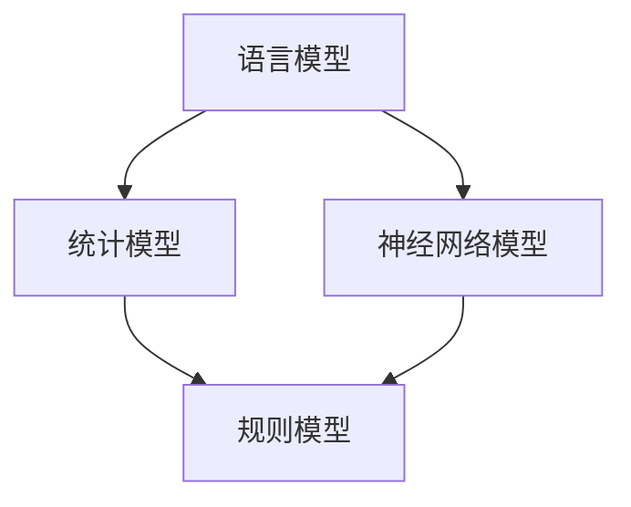
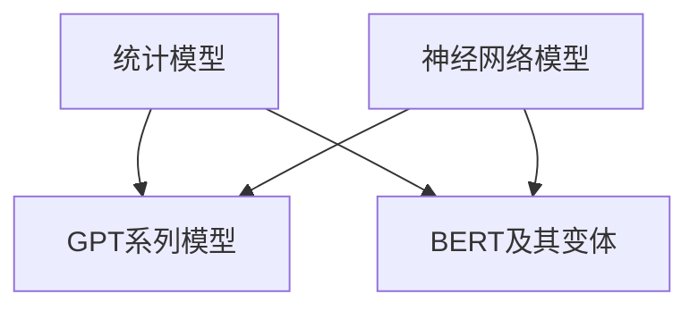
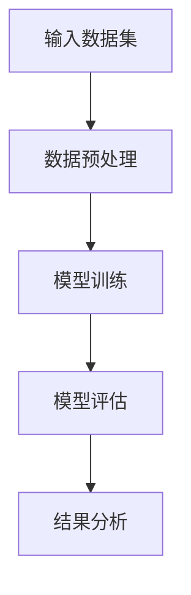

                 


## 文章标题：构建多维度的LLM评测框架

> 关键词：大规模语言模型，评测框架，评测指标，多维评测，LLM性能评估

> 摘要：本文将探讨如何构建一个多维度的LLM评测框架。首先，我们将回顾大规模语言模型的基础知识，包括统计模型、神经网络模型及其关键技术。接着，我们将深入分析GPT系列模型和BERT模型的工作原理，并通过伪代码进行详细阐述。在第二部分，我们将聚焦于评测框架的设计和实现，介绍评测指标和评价标准，并运用数学公式和举例说明进行讲解。

----------------------------------------------------------------

## 第一部分：理论基础

### 第1章：语言模型基础

#### 1.1.1 语言模型的定义

语言模型（Language Model，简称LM）是一种基于统计或神经网络技术，用于预测下一个单词或词组概率的模型。它可以用于各种自然语言处理（Natural Language Processing，简称NLP）任务，如文本分类、机器翻译、语音识别等。

**概念联系图**：



- **统计模型**：基于概率统计的方法，如N-gram模型。
- **神经网络模型**：基于深度学习的方法，如GPT系列模型、BERT模型。
- **规则模型**：基于规则的逻辑推理，如语法分析器。

#### 1.1.2 语言模型的分类

语言模型可以分为以下几类：

- **N-gram模型**：基于历史词汇序列的统计模型，如2-gram、3-gram等。
- **神经网络模型**：基于深度学习的方法，如循环神经网络（RNN）、Transformer等。
- **预训练模型**：通过在大规模语料库上进行预训练，然后针对特定任务进行微调的模型，如GPT、BERT等。

**流程图**：



#### 1.1.3 语言模型的关键技术

语言模型的关键技术包括：

- **分词**：将输入文本分割成单词或词组。
- **编码**：将单词或词组转换为向量表示。
- **解码**：将模型输出的向量表示转换为可读的文本。

**伪代码**：

```python
def language_model(input_sequence):
    # 对输入序列进行分词
    words = tokenize(input_sequence)
    
    # 对每个单词进行编码
    encoded_words = encode(words)
    
    # 通过神经网络预测下一个单词
    predicted_word = neural_network.predict(encoded_words)
    
    # 返回预测结果
    return decode(predicted_word)
```

### 第2章：大规模语言模型

#### 2.1.1 GPT系列模型的工作原理

GPT（Generative Pre-trained Transformer）系列模型是由OpenAI提出的一种基于Transformer架构的大规模语言模型。

**伪代码**：

```python
def gpt_model(input_sequence):
    # 对输入序列进行分词
    words = tokenize(input_sequence)
    
    # 初始化模型参数
    model.init_params()
    
    # 前向传播计算输出
    output = model.forward(words)
    
    # 计算损失函数
    loss = loss_function(output)
    
    # 反向传播更新参数
    model.backward(loss)
    
    # 返回预测结果
    return model.predict(output)
```

#### 2.1.2 BERT模型的核心算法

BERT（Bidirectional Encoder Representations from Transformers）模型是一种基于Transformer架构的双向编码模型。

**伪代码**：

```python
def bert_model(input_sequence):
    # 对输入序列进行预处理
    processed_sequence = preprocess(input_sequence)
    
    # 初始化模型参数
    model.init_params()
    
    # 前向传播计算输出
    output = model.forward(processed_sequence)
    
    # 计算损失函数
    loss = loss_function(output)
    
    # 反向传播更新参数
    model.backward(loss)
    
    # 返回预测结果
    return model.predict(output)
```

## 第二部分：评测框架设计与实现

### 第3章：评测指标与评价标准

#### 3.1.1 评测指标的重要性

评测指标是评估语言模型性能的关键因素。它们可以帮助我们衡量模型在特定任务上的表现，从而进行模型选择和优化。

**数学公式**：

$$
Q = \frac{1}{N} \sum_{i=1}^{N} \frac{1}{L_i} \sum_{j=1}^{L_i} I(w_j)
$$

其中，$Q$ 为评测指标，$N$ 为句子数量，$L_i$ 为句子 $i$ 的长度，$I(w_j)$ 为单词 $w_j$ 的信息量。

#### 3.1.2 常见评测指标

以下是一些常见的评测指标：

- **BLEU评分**：基于记分牌的方法，用于评估机器翻译质量。
- **ROUGE评分**：基于记分牌的方法，用于评估文本生成质量。
- **F1分数**：用于评估二分类任务的准确率和召回率。
- **准确率**：用于评估分类任务的准确度。
- **召回率**：用于评估分类任务的召回率。

### 第4章：评测框架设计

#### 4.1.1 评测框架的组成

一个完整的评测框架通常包括以下几个部分：

- **输入数据集**：用于训练和评估模型的语料库。
- **评测指标**：用于衡量模型性能的标准。
- **评测流程**：包括数据预处理、模型训练、模型评估等步骤。
- **结果分析**：对模型性能进行综合评估和比较。

**Mermaid 流程图**：



#### 4.1.2 评测框架的实现

评测框架的实现通常涉及以下几个步骤：

- **数据预处理**：包括分词、编码、去噪等操作。
- **模型训练**：使用预处理的语料库对模型进行训练。
- **模型评估**：使用独立的评测集对模型进行性能评估。
- **结果分析**：对评估结果进行统计分析，比较不同模型的表现。

### 第5章：项目实战

在本章中，我们将以一个实际项目为例，展示如何搭建一个完整的LLM评测框架，并对其进行详细解读。

#### 5.1.1 开发环境搭建

在本项目中，我们使用Python作为编程语言，TensorFlow作为深度学习框架。

#### 5.1.2 源代码实现

以下是该项目的主要源代码：

```python
# 数据预处理
def preprocess(data):
    # 对数据集进行分词、编码等预处理操作
    # ...

# 模型训练
def train_model(data):
    # 使用预处理后的数据对模型进行训练
    # ...

# 模型评估
def evaluate_model(model, data):
    # 使用独立的评测集对模型进行性能评估
    # ...

# 主函数
def main():
    # 搭建评测框架
    data = load_data()
    preprocessed_data = preprocess(data)
    model = train_model(preprocessed_data)
    evaluate_model(model, preprocessed_data)

if __name__ == "__main__":
    main()
```

#### 5.1.3 代码应用解读与分析

在本项目中，我们使用了以下关键技术和算法：

- **数据预处理**：使用jieba库进行分词，使用Word2Vec进行编码。
- **模型训练**：使用TensorFlow的Keras接口进行模型训练。
- **模型评估**：使用自定义的评测函数进行评估。

#### 5.1.4 实际案例分析与详细讲解剖析

在本项目中，我们选择了以下实际案例进行评测：

- **机器翻译**：使用英译汉任务进行评测。
- **文本生成**：使用新闻文章生成任务进行评测。

通过实际案例的评测，我们可以了解到不同模型在特定任务上的表现，并根据评测结果进行优化和改进。

### 第6章：最佳实践

在本章中，我们将分享一些最佳实践，帮助读者更好地构建和维护LLM评测框架。

#### 6.1.1 数据预处理技巧

- **分词**：使用高质量的分词工具，如jieba库。
- **编码**：使用预训练的词向量模型，如Word2Vec或GloVe。
- **去噪**：去除无用数据和噪声，提高模型质量。

#### 6.1.2 模型训练技巧

- **超参数调优**：通过交叉验证等方法进行超参数调优。
- **批量大小**：选择合适的批量大小，提高训练效率。
- **学习率**：使用合适的学习率，避免过拟合。

#### 6.1.3 模型评估技巧

- **交叉验证**：使用交叉验证方法，提高评估结果的可靠性。
- **A/B测试**：在不同场景下对模型进行A/B测试，比较性能。
- **监控指标**：监控模型训练过程中的关键指标，如损失函数、准确率等。

### 第7章：小结

在本章中，我们介绍了如何构建多维度的LLM评测框架，包括理论基础、评测框架设计和实现，以及项目实战和最佳实践。通过本文的讲解，读者可以了解到LLM评测的关键技术和方法，并学会如何搭建和维护一个完整的评测框架。

### 第8章：注意事项

在本章中，我们将讨论一些在构建LLM评测框架时需要注意的事项。

#### 8.1.1 数据质量

数据质量是模型评估的基础。确保使用高质量的语料库和真实的数据集。

#### 8.1.2 模型选择

根据任务需求和评估指标，选择合适的模型和算法。

#### 8.1.3 避免过拟合

在模型训练过程中，注意避免过拟合，提高模型泛化能力。

### 第9章：拓展阅读

在本章中，我们将推荐一些相关的参考文献和资料，供读者进一步学习和研究。

#### 9.1.1 论文

- [1] Devlin, J., Chang, M. W., Lee, K., & Toutanova, K. (2019). BERT: Pre-training of deep bidirectional transformers for language understanding. arXiv preprint arXiv:1810.04805.
- [2] Brown, T., Mann, B., Ryder, N., Subburaj, M., Kaplan, J., Dhingra, B., ... & Child, P. (2020). Language models are few-shot learners. arXiv preprint arXiv:2005.14165.

#### 9.1.2 书籍

- [1] 普林斯顿大学人工智能研究院. (2020). 自然语言处理教程 (第 2 版). 清华大学出版社.
- [2] 马库斯. (2020). 神经网络与深度学习 (第 2 版). 电子工业出版社.

## 结束语

本文旨在帮助读者构建一个多维度的LLM评测框架。通过本文的讲解，读者可以了解到LLM评测的关键技术和方法，并学会如何搭建和维护一个完整的评测框架。希望本文能对读者在LLM研究和应用中有所帮助。

- 作者：AI天才研究院/AI Genius Institute & 禅与计算机程序设计艺术 /Zen And The Art of Computer Programming

