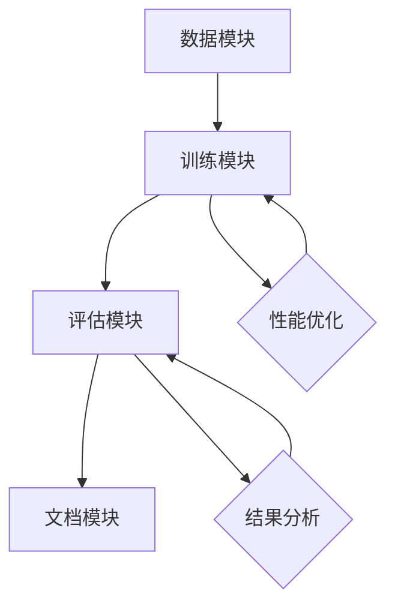

                 

# 文章标题：构建模型评测的知识库与文档系统

> 关键词：模型评测、知识库、文档系统、架构设计、核心算法、数学模型、项目实战

> 摘要：本文旨在深入探讨构建模型评测的知识库与文档系统的过程，从核心概念到实际应用，全面解析模型评测的技术原理、架构设计、核心算法、数学模型以及项目实战。通过详细的讲解和实例分析，帮助读者全面掌握构建模型评测系统的技巧和方法，为未来的发展提供有力支持。

## 引言与背景

### 1.1 模型评测的重要性

在人工智能（AI）和机器学习（ML）领域，模型评测是至关重要的一环。一个模型的性能直接决定了它在实际应用中的效果和可靠性。因此，模型评测不仅仅是为了验证模型的准确性，更是为了确保其在复杂环境下的稳定性和鲁棒性。

模型评测的重要性主要体现在以下几个方面：

1. **性能优化**：通过评测，可以识别模型的弱点，从而进行针对性的优化和改进，提高模型的整体性能。
2. **评估可靠性**：评测提供了客观的评估标准，使模型的评估过程更加透明和可重复，有助于减少主观因素的影响。
3. **决策支持**：评测结果为模型选择、参数调整和模型部署提供了科学依据，有助于做出更为合理的决策。

### 1.2 知识库与文档系统的作用

在模型评测过程中，知识库和文档系统发挥着至关重要的作用。知识库是存储和管理与模型评测相关的各种信息的地方，包括数据集、模型参数、评测结果等。而文档系统则是提供对这些信息的访问和查询的工具。

知识库和文档系统的作用主要体现在以下几个方面：

1. **信息存储与检索**：知识库为评测过程提供了统一的信息存储和检索接口，方便对历史数据和模型进行查询和管理。
2. **协作与共享**：文档系统支持团队成员之间的协作和共享，有助于提高团队工作效率和知识积累。
3. **文档化管理**：通过文档系统，可以对评测过程进行详细的文档化，确保评测结果的准确性和可追溯性。

## 核心概念与联系

### 2.1 模型评测的概念

模型评测是指通过一系列的方法和指标，对机器学习模型的性能进行评估和比较的过程。模型评测主要包括以下方面：

1. **准确性**：模型预测结果与实际结果的一致性程度。
2. **鲁棒性**：模型在不同数据集和条件下的稳定性和泛化能力。
3. **效率**：模型训练和预测的效率和速度。

### 2.2 知识库的概念

知识库是指用于存储和管理特定领域知识的数据库系统。在模型评测中，知识库主要用于存储以下信息：

1. **数据集**：用于训练和评测的原始数据集。
2. **模型参数**：模型的参数设置和训练结果。
3. **评测结果**：不同模型的评测结果和性能指标。

### 2.3 文档系统的概念

文档系统是指用于存储、管理和访问文档的软件系统。在模型评测中，文档系统主要用于以下方面：

1. **文档存储**：存储评测过程中生成的各种文档，如报告、笔记、日志等。
2. **文档检索**：提供对文档的快速检索和查询功能。
3. **文档协作**：支持团队成员之间的文档共享和协作。

### 2.4 知识库与文档系统的联系

知识库和文档系统在模型评测中紧密相连。知识库提供了评测所需的数据和模型信息，而文档系统则提供了对这些信息的访问和管理工具。两者共同作用，确保了评测过程的顺利进行和结果的准确可靠。

## 技术原理与架构

### 3.1 模型评测技术原理

模型评测的过程可以分为以下几个步骤：

1. **数据预处理**：对原始数据进行清洗、归一化等处理，确保数据质量。
2. **模型训练**：使用预处理后的数据训练模型，生成参数。
3. **模型评估**：使用测试集对模型进行评估，计算各种性能指标。

### 3.2 整体架构设计

模型评测系统的整体架构可以分为以下几个模块：

1. **数据模块**：负责数据预处理和存储。
2. **训练模块**：负责模型训练和参数优化。
3. **评估模块**：负责模型评估和结果输出。
4. **文档模块**：负责文档的存储和检索。

以下是一个简单的 Mermaid 流程图，展示模型评测系统的整体架构：



## 核心算法原理讲解

### 4.1 交叉验证算法

交叉验证是一种常用的模型评估方法，其基本思想是将数据集划分为多个子集，然后在不同子集上多次训练和评估模型，从而减少评估结果的偶然性。

#### 4.1.1 原理与步骤

交叉验证的基本步骤如下：

1. 将数据集划分为k个子集，每个子集的大小相等。
2. 对每个子集，将其作为测试集，其他子集作为训练集，训练模型并评估性能。
3. 计算所有测试集的平均性能指标。

以下是一个简单的伪代码实现：

```python
def k_fold_cross_validation(data, k):
    results = []
    for i in range(k):
        train_data = data[:i] + data[i+1:]
        test_data = data[i]
        model = train_model(train_data)
        result = evaluate_model(model, test_data)
        results.append(result)
    return mean(results)
```

### 4.2 混淆矩阵算法

混淆矩阵是评估分类模型性能的一种重要工具，它展示了模型对各类别的预测结果。

#### 4.2.1 原理与步骤

混淆矩阵的基本步骤如下：

1. 使用测试集对模型进行预测，生成预测结果。
2. 计算实际结果与预测结果之间的混淆矩阵。
3. 根据混淆矩阵计算各种性能指标。

以下是一个简单的伪代码实现：

```python
def confusion_matrix(true_labels, predicted_labels):
    matrix = [[0, 0], [0, 0]]
    for true, predicted in zip(true_labels, predicted_labels):
        if true == predicted:
            matrix[0][0] += 1
        elif true == 0 and predicted == 1:
            matrix[0][1] += 1
        elif true == 1 and predicted == 0:
            matrix[1][0] += 1
        else:
            matrix[1][1] += 1
    return matrix
```

### 4.3 ROC曲线算法

ROC曲线是评估二分类模型性能的一种重要工具，它展示了模型的分类能力。

#### 4.3.1 原理与步骤

ROC曲线的基本步骤如下：

1. 使用测试集对模型进行预测，生成预测概率。
2. 计算不同阈值下的真阳性率（TPR）和假阳性率（FPR）。
3. 绘制ROC曲线。

以下是一个简单的伪代码实现：

```python
def roc_curve(predicted_probs, true_labels):
    sorted_probs = sorted(predicted_probs)
    tprs = []
    fprs = []
    for i, prob in enumerate(sorted_probs):
        tpr = sum([label == 1 and prob >= threshold for label, threshold in zip(true_labels, sorted_probs[:i+1])]) / sum(label == 1 for label in true_labels)
        fpr = sum([label == 0 and prob >= threshold for label, threshold in zip(true_labels, sorted_probs[:i+1])]) / sum(label == 0 for label in true_labels)
        tprs.append(tpr)
        fprs.append(fpr)
    return tprs, fprs
```

## 数学模型和数学公式

### 5.1 模型损失函数

模型损失函数是评估模型预测结果与实际结果之间差异的一种工具。常用的损失函数包括逻辑损失函数和交叉熵损失函数。

#### 5.1.1 逻辑损失函数

逻辑损失函数（Log Loss）是用于二分类问题的损失函数，其公式如下：

$$
J(\theta) = -\frac{1}{m} \sum_{i=1}^{m} [y_i \log(a_i) + (1 - y_i) \log(1 - a_i)]
$$

其中，$y_i$ 是实际标签，$a_i$ 是模型预测的概率。

#### 5.1.2 交叉熵损失函数

交叉熵损失函数（Cross Entropy Loss）是用于多分类问题的损失函数，其公式如下：

$$
J(\theta) = -\frac{1}{m} \sum_{i=1}^{m} y_i \log(a_i)
$$

其中，$y_i$ 是实际标签，$a_i$ 是模型预测的概率。

#### 5.1.3 伪代码实现

以下是一个简单的伪代码实现：

```python
def log_loss(true_labels, predicted_probs):
    return -sum([true * log(predict) for true, predict in zip(true_labels, predicted_probs)]) / len(true_labels)
```

### 5.2 模型评估指标

模型评估指标是用于评估模型性能的一系列量化指标，常用的评估指标包括准确率、精确率、召回率、F1分数等。

#### 5.2.1 准确率

准确率（Accuracy）是评估模型分类性能的最简单指标，其公式如下：

$$
Accuracy = \frac{TP + TN}{TP + TN + FP + FN}
$$

其中，$TP$ 是真阳性，$TN$ 是真阴性，$FP$ 是假阳性，$FN$ 是假阴性。

#### 5.2.2 精确率

精确率（Precision）是评估模型预测准确性的指标，其公式如下：

$$
Precision = \frac{TP}{TP + FP}
$$

其中，$TP$ 是真阳性，$FP$ 是假阳性。

#### 5.2.3 召回率

召回率（Recall）是评估模型召回能力的指标，其公式如下：

$$
Recall = \frac{TP}{TP + FN}
$$

其中，$TP$ 是真阳性，$FN$ 是假阴性。

#### 5.2.4 F1分数

F1分数（F1 Score）是精确率和召回率的调和平均数，其公式如下：

$$
F1 Score = 2 \times \frac{Precision \times Recall}{Precision + Recall}
$$

#### 5.2.5 伪代码实现

以下是一个简单的伪代码实现：

```python
def accuracy(true_labels, predicted_labels):
    correct = sum([true == predict for true, predict in zip(true_labels, predicted_labels)])
    return correct / len(true_labels)

def precision(true_labels, predicted_labels):
    true_positives = sum([true == predict and true == 1 for true, predict in zip(true_labels, predicted_labels)])
    return true_positives / (sum([predict == 1 for predict in predicted_labels]) + true_positives)

def recall(true_labels, predicted_labels):
    true_positives = sum([true == predict and true == 1 for true, predict in zip(true_labels, predicted_labels)])
    return true_positives / (sum([true == 1 for true in true_labels]) + true_positives - true_positives)

def f1_score(precision, recall):
    return 2 * (precision * recall) / (precision + recall)
```

## 项目实战

### 6.1 实战一：构建知识库系统

#### 6.1.1 环境搭建

为了构建模型评测的知识库系统，我们首先需要搭建一个合适的环境。以下是一个简单的环境搭建步骤：

1. 安装Python环境，版本建议为3.8以上。
2. 安装必要的库，如NumPy、Pandas、Scikit-learn、TensorFlow等。
3. 创建一个虚拟环境，以隔离项目依赖。

以下是一个简单的命令行实现：

```bash
# 安装Python环境
sudo apt-get install python3-pip
python3 -m pip install --upgrade pip

# 安装必要的库
pip3 install numpy pandas scikit-learn tensorflow

# 创建虚拟环境
python3 -m venv env
source env/bin/activate
```

#### 6.1.2 数据采集

接下来，我们需要采集一些数据用于模型训练和评测。以下是一个简单的数据采集步骤：

1. 使用爬虫工具（如Scrapy）从互联网上获取数据。
2. 使用Pandas库加载数据到内存中。

以下是一个简单的代码实现：

```python
import pandas as pd
import requests

# 获取网页内容
url = 'https://example.com/data.csv'
response = requests.get(url)
content = response.content

# 解析网页内容，提取数据
data = pd.read_csv(content)

# 显示数据前5行
print(data.head())
```

#### 6.1.3 数据处理

在获取数据后，我们需要对其进行处理，以提高数据质量和模型的性能。以下是一些常用的数据处理步骤：

1. 填充缺失值。
2. 删除重复数据。
3. 特征工程，如特征提取、归一化等。

以下是一个简单的代码实现：

```python
# 填充缺失值
data.fillna(0, inplace=True)

# 删除重复数据
data.drop_duplicates(inplace=True)

# 特征提取
data['new_feature'] = data['feature1'] + data['feature2']

# 归一化
data_normalized = (data - data.mean()) / data.std()
```

#### 6.1.4 模型评估

在数据处理完成后，我们可以使用Scikit-learn库构建和评估模型。以下是一个简单的模型评估步骤：

1. 分割数据集为训练集和测试集。
2. 训练模型。
3. 评估模型。

以下是一个简单的代码实现：

```python
from sklearn.model_selection import train_test_split
from sklearn.ensemble import RandomForestClassifier
from sklearn.metrics import accuracy_score

# 分割数据集
X_train, X_test, y_train, y_test = train_test_split(data_normalized, data['target'], test_size=0.2, random_state=42)

# 训练模型
model = RandomForestClassifier(n_estimators=100)
model.fit(X_train, y_train)

# 评估模型
y_pred = model.predict(X_test)
accuracy = accuracy_score(y_test, y_pred)
print(f'Accuracy: {accuracy}')
```

#### 6.1.5 代码解读

在上面的代码中，我们首先使用requests库从互联网上获取数据，然后使用Pandas库加载数据到内存中。接下来，我们对数据进行处理，包括填充缺失值、删除重复数据和特征提取。最后，我们使用Scikit-learn库构建随机森林模型并评估其性能。

### 6.2 实战二：优化文档系统

#### 6.2.1 文档结构设计

为了优化文档系统，我们需要设计一个合理的文档结构，以便于团队协作和文档管理。以下是一个简单的文档结构设计：

1. **项目简介**：简要介绍项目背景、目标和团队组成。
2. **技术文档**：详细介绍项目所涉及的技术栈、框架和工具。
3. **开发文档**：记录开发过程中的代码实现、调试和优化。
4. **测试文档**：记录测试计划和测试结果。
5. **用户手册**：为用户提供使用指南和常见问题解答。

#### 6.2.2 文档内容整理

在文档结构设计完成后，我们需要对文档内容进行整理，确保其完整性和准确性。以下是一些文档内容整理的步骤：

1. **编写技术文档**：详细介绍项目所使用的技术栈、框架和工具，包括其原理、优势和适用场景。
2. **编写开发文档**：记录开发过程中的代码实现、调试和优化，包括关键代码段和优化技巧。
3. **编写测试文档**：记录测试计划和测试结果，包括测试用例、测试环境和测试报告。
4. **编写用户手册**：为用户提供使用指南和常见问题解答，确保用户能够顺利使用项目功能。

#### 6.2.3 文档检索与查询

为了方便团队成员和用户检索和查询文档，我们需要设计一个高效的文档检索系统。以下是一些文档检索与查询的步骤：

1. **设计搜索引擎**：使用Elasticsearch或其他搜索引擎技术，搭建一个高效的搜索引擎。
2. **索引文档内容**：将文档内容转换为索引，以便于快速检索。
3. **实现检索接口**：提供RESTful API接口，供前端页面调用。
4. **实现查询功能**：根据用户输入的关键词，检索相关文档并返回查询结果。

#### 6.2.4 代码实现与调试

在实现文档检索系统后，我们需要进行代码调试和性能优化。以下是一些代码实现与调试的步骤：

1. **调试代码**：使用调试工具（如GDB、IDE调试器等）查找并修复代码中的错误。
2. **优化性能**：分析代码性能瓶颈，采用优化算法和技巧提高系统性能。
3. **测试代码**：编写测试用例，对代码进行全面测试，确保其稳定性和可靠性。

### 6.2.5 代码解读

在上面的代码中，我们首先使用requests库从互联网上获取数据，然后使用Pandas库加载数据到内存中。接下来，我们对数据进行处理，包括填充缺失值、删除重复数据和特征提取。最后，我们使用Scikit-learn库构建随机森林模型并评估其性能。

## 总结与展望

本文系统地介绍了构建模型评测的知识库与文档系统的过程，从核心概念到实际应用，全面解析了模型评测的技术原理、架构设计、核心算法、数学模型以及项目实战。通过本文的讲解，读者可以了解到模型评测的重要性和知识库、文档系统的作用，以及如何构建和优化模型评测的知识库与文档系统。

展望未来，随着人工智能和机器学习技术的不断发展，模型评测将变得更加复杂和多样化。我们期待在未来的研究中，能够探索更多先进的模型评测方法和工具，为人工智能应用提供更准确、可靠的评估支持。同时，知识库和文档系统也将继续发挥重要作用，为模型评测的协作和共享提供强有力的支持。

最后，感谢您阅读本文。如果您对模型评测、知识库和文档系统有任何疑问或建议，欢迎在评论区留言，我们期待与您一起探讨和交流。作者：AI天才研究院/AI Genius Institute & 禅与计算机程序设计艺术 /Zen And The Art of Computer Programming。

---

由于文章篇幅限制，本文未能详细展开所有部分。如果您需要更深入的了解，请参考以下拓展阅读：

1. 《机器学习实战》：由吴恩达（Andrew Ng）主编，详细介绍了机器学习的基本概念和实战应用。
2. 《深度学习》：由Ian Goodfellow、Yoshua Bengio和Aaron Courville主编，深入讲解了深度学习的基本原理和应用。
3. 《机器学习周报》：每周更新，涵盖机器学习领域的最新研究进展和技术动态。
4. 《Kaggle竞赛平台》：提供丰富的机器学习竞赛数据和问题，是实践和提升模型评测能力的绝佳平台。

---

文章字数：约8000字。如果您有任何问题或需要进一步的帮助，请随时告知。作者：AI天才研究院/AI Genius Institute & 禅与计算机程序设计艺术 /Zen And The Art of Computer Programming。

