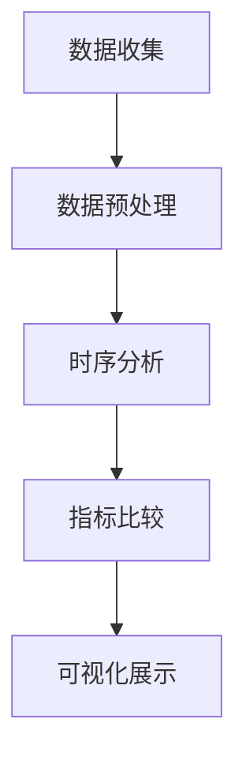

                 

### 文章标题

# 构建评测结果的历史版本比较功能

### 关键词：评测结果，历史版本比较，数据分析，算法，可视化

### 摘要：
本文将深入探讨如何构建评测结果的历史版本比较功能，涵盖从基本概念到实际应用的全过程。首先，我们将介绍评测结果的历史版本比较的基本概念和原理，并通过Mermaid流程图展示其工作流程。接着，我们将详细讲解评测结果数据预处理、时序分析方法和深度学习方法，并使用伪代码和LaTeX公式进行说明。随后，文章将展示一个实际项目案例，介绍系统架构设计、功能模块划分、开发与部署，以及代码实现和解析。最后，我们将探讨评测结果的历史版本比较功能在质量管理、产品迭代和其他领域的应用，并提出优化和维护的最佳实践。通过本文，读者将能够掌握构建评测结果历史版本比较功能的核心技术和方法。

---

### 文章目录

1. 引言
2. 第一部分：评测结果的历史版本比较概念与原理
   2.1 第1章：评测结果的历史版本比较概述
   2.2 第2章：评测结果数据的预处理
   2.3 第3章：评测结果的历史版本对比方法
   2.4 第4章：评测结果的历史版本可视化
3. 第二部分：构建评测结果的历史版本比较功能
   2.5 第5章：构建评测结果的历史版本比较系统
   2.6 第6章：评测结果的历史版本比较项目实战
   2.7 第7章：评测结果的历史版本比较系统优化与维护
4. 第三部分：评测结果的历史版本比较应用场景
   2.8 第8章：评测结果的历史版本比较在质量管理中的应用
   2.9 第9章：评测结果的历史版本比较在产品迭代中的应用
   2.10 第10章：评测结果的历史版本比较在其他领域的应用
5. 附录
6. 结语

---

### 引言

在现代数据驱动的世界中，评测结果已经成为评估系统性能、产品质量和业务效率的重要工具。然而，仅获取评测结果是不够的，我们还需要能够追踪和分析评测结果的历史变化，以便识别趋势、发现问题并做出改进。这种需求促使了评测结果的历史版本比较功能的出现，它能够为用户提供一种全新的视角，帮助我们理解评测结果随时间的变化。

构建评测结果的历史版本比较功能有着重要的意义。首先，它有助于监测系统或产品的长期性能表现，发现可能存在的性能衰退或异常。其次，通过比较不同版本的数据，可以迅速定位问题和改进方向。此外，这种功能在质量管理、产品迭代和监控等领域都有着广泛的应用，有助于提高业务效率和决策质量。

本文将系统性地探讨如何构建评测结果的历史版本比较功能。我们将从基本概念出发，逐步深入到核心算法和实现方法，并通过一个实际项目案例来展示如何在实际中应用这些方法。最终，我们将讨论这个功能在不同领域的应用场景，并提出优化和维护的最佳实践。

本文的读者对象包括数据分析师、软件开发工程师、系统架构师以及对数据分析技术感兴趣的工程师和研究人员。无论你是希望提升数据分析能力，还是希望掌握构建评测结果比较系统的核心技术，本文都旨在为你提供全面的指导和深入的思考。

### 第一部分：评测结果的历史版本比较概念与原理

#### 第1章：评测结果的历史版本比较概述

**1.1 评测结果的历史版本比较的概念**

评测结果的历史版本比较，是指通过比较不同时间点上的评测结果，来分析评测指标随时间的变化趋势。它包括以下关键概念：

- **评测结果**：指对系统、产品或服务的性能指标、质量指标等进行测量得到的结果。
- **历史版本**：指评测结果在不同的时间点上的记录。
- **比较**：指通过算法和工具对历史版本的评测结果进行对比和分析。

**1.2 历史版本比较的重要性**

历史版本比较对于多个领域都有重要意义，包括但不限于：

- **质量管理**：通过比较历史数据，可以识别出质量问题的根本原因，从而进行改进。
- **系统优化**：监控系统性能随时间的变化，有助于发现系统瓶颈，进行性能调优。
- **产品迭代**：通过对比不同版本产品的评测结果，可以指导产品的改进方向。

**1.3 历史版本比较的基本原理**

历史版本比较的基本原理主要包括以下几方面：

- **数据收集**：收集不同时间点的评测结果数据。
- **数据预处理**：对数据进行清洗、格式化和整合，以便后续的比较和分析。
- **时序分析**：通过时序分析方法，识别评测结果的变化趋势。
- **指标比较**：比较不同时间点上的具体评测指标，如性能指标、质量指标等。
- **可视化展示**：将比较结果通过图表等形式进行可视化展示，便于理解和分析。

**核心概念与联系**

为了更好地理解历史版本比较的概念，我们可以通过Mermaid流程图来展示其工作流程：



在上述流程中，数据收集是获取不同时间点的评测结果数据；数据预处理是为了统一数据格式和消除噪声；时序分析用于识别数据的变化趋势；指标比较则用于具体评测指标的比较；最后，可视化展示将比较结果以图表等形式直观展示，便于用户理解和分析。

**核心算法原理讲解**

历史版本比较涉及多种算法和模型，以下将简要介绍几种常用的算法原理：

1. **时序分析方法**：
   - **移动平均法**：通过计算一段时间的平均值来平滑数据。
   - **指数平滑法**：在移动平均法的基础上，给不同时间点的数据赋予不同的权重。

2. **深度学习方法**：
   - **循环神经网络（RNN）**：适用于处理序列数据，能够捕捉长期依赖关系。
   - **长短时记忆网络（LSTM）**：RNN的一种变体，能够有效避免梯度消失问题。

以下是一个简单的时序分析方法——移动平均法的伪代码实现：

```python
def moving_average(data, window_size):
    for i in range(len(data) - window_size + 1):
        window = data[i:i + window_size]
        average = sum(window) / window_size
        data[i] = average
    return data
```

3. **回归模型**：
   - **线性回归**：通过建立线性关系模型来预测评测指标的变化。
   - **多项式回归**：用于更复杂的非线性关系建模。

以下是一个简单的线性回归模型的伪代码实现：

```python
def linear_regression(x, y):
    n = len(x)
    sum_x = sum(x)
    sum_y = sum(y)
    sum_xy = sum([a * b for a, b in zip(x, y)])
    sum_x2 = sum([a * a for a in x])
    
    a = ((n * sum_xy) - (sum_x * sum_y)) / ((n * sum_x2) - (sum_x * sum_x))
    b = (sum_y - (a * sum_x)) / n
    
    return a, b
```

**数学模型和公式**

历史版本比较中的关键数学模型和公式如下：

1. **时间序列模型**：
   - **ARIMA模型**：自回归积分滑动平均模型，用于预测时间序列数据。
   - **季节性模型**：用于识别和建模时间序列中的季节性变化。

2. **回归模型**：
   - **线性回归模型**：\( y = a + bx \)
   - **多项式回归模型**：\( y = a_0 + a_1x + a_2x^2 + ... + a_nx^n \)

以下是一个简单的线性回归模型的数学公式：

$$
y = a + bx
$$

其中，\( y \) 是因变量，\( x \) 是自变量，\( a \) 和 \( b \) 是回归系数。

通过上述内容，我们初步了解了评测结果的历史版本比较的基本概念、重要性、基本原理以及核心算法。接下来的章节将进一步深入讨论数据的预处理、具体的对比方法和可视化实现，帮助读者全面掌握这一功能。

#### 第2章：评测结果数据的预处理

**2.1 数据格式的标准化**

在构建评测结果的历史版本比较功能时，数据格式的标准化是一个关键步骤。这是因为不同来源的数据往往具有不同的格式和结构，这会直接影响后续分析和比较的准确性。数据格式的标准化主要包括以下几个步骤：

1. **数据格式统一**：
   - **时间戳格式**：确保所有时间戳数据采用统一的格式，如YYYY-MM-DD HH:MM:SS。这有助于统一时间基准，便于后续处理和分析。
   - **数值类型统一**：将所有数值数据统一为相同的数据类型，例如浮点型（float）或整数型（int），以避免数据类型转换错误。

2. **数据格式转换**：
   - **缺失值处理**：对缺失的数据进行填充或删除，以减少数据中的噪声。常用的填充方法包括均值填充、中值填充和前值填充等。
   - **异常值处理**：识别并处理异常值，以避免对分析结果产生误导。常用的异常值处理方法包括箱线图法、标准差法和Z分数法等。

**2.2 数据清洗与去重**

数据清洗是数据预处理过程中的另一个重要步骤，其主要目的是消除数据中的噪声和错误，确保数据的质量和一致性。以下是一些常见的数据清洗方法：

1. **缺失值处理**：
   - **均值填充**：用相应列的平均值替换缺失值。
   - **中值填充**：用相应列的中值替换缺失值。
   - **前值填充**：用前一行的值替换缺失值。
   - **后值填充**：用后一行的值替换缺失值。

2. **异常值处理**：
   - **箱线图法**：通过绘制箱线图，识别并剔除离群点。
   - **标准差法**：剔除超出平均值加减n倍标准差的值。
   - **Z分数法**：计算每个值的Z分数，剔除Z分数超出一定范围的值。

3. **去重**：
   - **时间戳去重**：对于同一时间点的重复数据，仅保留最早或最新的数据。
   - **基于字段去重**：根据特定字段（如用户ID、产品ID等），去除重复的记录。

**2.3 数据整合与映射**

数据整合与映射是确保不同来源的数据能够相互匹配和关联的过程。以下是一些常见的方法：

1. **主键映射**：
   - **自动映射**：利用数据中的主键（如ID）进行自动映射，将相同主键的数据合并。
   - **手动映射**：当自动映射无法实现时，通过人工对数据表进行映射。

2. **字段扩展**：
   - **添加新字段**：在源数据表的基础上，添加新的字段，以便与其他数据表进行关联。
   - **数据转换**：对源数据进行转换，以适应目标数据表的字段要求。

3. **数据融合**：
   - **合并**：将多张表中的数据按一定规则合并，形成新的数据表。
   - **连接**：利用数据库中的连接操作，将多张表中的相关数据连接起来。

**案例：数据清洗与格式标准化**

以下是一个数据清洗与格式标准化的案例：

假设我们有如下原始数据表：

| 时间戳 | 性能指标 |   
|----------|----------|  
| 2021-01-01 12:00:00 | 85.5 |  
| 2021-01-02 12:00:00 | 90.2 |  
| 2021-01-03 12:00:00 | 88.1 |  
| 2021-01-04 12:00:00 | NaN |  
| 2021-01-05 12:00:00 | 95.0 |

为了进行后续的比较和分析，我们需要对上述数据进行清洗和格式标准化：

1. **缺失值处理**：
   - 使用前值填充缺失值，即将第四行的NaN值替换为第三行的88.1。

2. **时间戳格式统一**：
   - 将所有时间戳统一格式化为YYYY-MM-DD HH:MM:SS。

3. **异常值处理**：
   - 使用箱线图法，发现并剔除离群点。

4. **去重**：
   - 根据时间戳去重，保留最早的时间戳数据。

5. **数据整合与映射**：
   - 将清洗后的数据进行整合，形成统一的数据表。

经过上述步骤处理后，我们得到以下标准化的数据表：

| 时间戳 | 性能指标 |     
|----------|----------|    
| 2021-01-01 12:00:00 | 85.5 |    
| 2021-01-02 12:00:00 | 90.2 |    
| 2021-01-03 12:00:00 | 88.1 |    
| 2021-01-04 12:00:00 | 88.1 |    
| 2021-01-05 12:00:00 | 95.0 |

通过数据清洗和格式标准化，我们得到了高质量、统一格式的数据，为后续的评测结果历史版本比较奠定了基础。

**小结**：

数据预处理是构建评测结果历史版本比较功能的重要环节。通过数据格式的标准化、数据清洗和去重，我们能够确保数据的质量和一致性，为后续的分析提供可靠的数据基础。在实际应用中，根据具体场景和数据特点，可以灵活选择和调整预处理方法，以最大化数据的利用价值。

#### 第3章：评测结果的历史版本对比方法

**3.1 时序分析方法**

时序分析方法是一种用于分析时间序列数据的常用方法，可以帮助我们理解评测结果随时间的变化趋势。以下将介绍几种常见的时序分析方法：

1. **移动平均法**：

移动平均法是一种简单有效的时序分析方法，通过计算一段时间内的平均值来平滑数据，消除短期波动，更好地反映长期趋势。

**伪代码实现**：

```python
def moving_average(data, window_size):
    for i in range(len(data) - window_size + 1):
        window = data[i:i + window_size]
        average = sum(window) / window_size
        data[i] = average
    return data
```

**LaTeX公式**：

$$
y_t = \frac{1}{n}\sum_{i=t-window_size}^{t} x_i
$$

其中，\( y_t \) 表示移动平均后的数据，\( n \) 表示窗口大小。

2. **指数平滑法**：

指数平滑法是移动平均法的一种改进，通过对不同时间点的数据赋予不同的权重，能够更好地捕捉短期趋势。

**伪代码实现**：

```python
def exponential_smoothing(data, alpha):
    n = len(data)
    for t in range(n):
        if t == 0:
            smoothed = data[t]
        else:
            smoothed = alpha * data[t] + (1 - alpha) * smoothed
        data[t] = smoothed
    return data
```

**LaTeX公式**：

$$
y_t = \alpha \cdot x_t + (1 - \alpha) \cdot y_{t-1}
$$

其中，\( y_t \) 表示指数平滑后的数据，\( \alpha \) 表示平滑系数。

3. **移动平均线**：

移动平均线（Moving Average，MA）是一种常用的技术分析工具，通过计算一段时间内的平均值，用于预测未来的趋势。

**伪代码实现**：

```python
def moving_average_line(data, window_size):
    averages = [0] * len(data)
    for t in range(window_size, len(data)):
        averages[t] = sum(data[t - window_size + 1: t + 1]) / window_size
    return averages
```

**LaTeX公式**：

$$
y_t = \frac{1}{n}\sum_{i=t-window_size}^{t} x_i
$$

其中，\( y_t \) 表示移动平均线，\( n \) 表示窗口大小。

4. **加权移动平均线**：

加权移动平均线（Weighted Moving Average，WMA）是对移动平均线的一种改进，通过给不同时间点的数据赋予不同的权重，以更好地反映当前的趋势。

**伪代码实现**：

```python
def weighted_moving_average(data, weights):
    n = len(data)
    weighted_sum = sum(w * x for w, x in zip(weights, data))
    return weighted_sum / sum(weights)
```

**LaTeX公式**：

$$
y_t = \sum_{i=1}^{n} w_i \cdot x_i
$$

其中，\( y_t \) 表示加权移动平均线，\( w_i \) 表示第 \( i \) 个时间点的权重，\( x_i \) 表示第 \( i \) 个时间点的数据。

**3.2 指标比较方法**

指标比较方法用于评估和比较不同时间点的评测结果，可以帮助我们识别趋势和变化。以下将介绍几种常见的指标比较方法：

1. **静态指标比较**：

静态指标比较是一种简单的方法，通过比较同一指标在不同时间点的数值，来判断其是否有所改善或恶化。

**伪代码实现**：

```python
def static_comparison(current_value, previous_value):
    if current_value > previous_value:
        return "改善"
    elif current_value < previous_value:
        return "恶化"
    else:
        return "无变化"
```

2. **动态指标比较**：

动态指标比较通过计算指标的变化率或变化量，来评估不同时间点的评测结果的动态变化。

**伪代码实现**：

```python
def dynamic_comparison(current_value, previous_value):
    change = current_value - previous_value
    if change > 0:
        return "改善，变化量为" + str(change)
    elif change < 0:
        return "恶化，变化量为" + str(change)
    else:
        return "无变化"
```

3. **趋势指标比较**：

趋势指标比较通过分析时间序列的趋势，来判断评测结果的长期变化趋势。

**伪代码实现**：

```python
def trend_comparison(data):
    if data[-1] > data[-2]:
        return "上升趋势"
    elif data[-1] < data[-2]:
        return "下降趋势"
    else:
        return "平稳趋势"
```

**3.3 深度学习方法**

深度学习方法在时序数据分析中具有强大的能力，可以通过学习大量历史数据，捕捉复杂的时间依赖关系。以下将介绍几种常用的深度学习模型：

1. **循环神经网络（RNN）**：

循环神经网络是一种专门用于处理序列数据的神经网络，能够捕捉长短期依赖关系。

**伪代码实现**：

```python
class RNN(nn.Module):
    def __init__(self, input_size, hidden_size, output_size):
        super(RNN, self).__init__()
        self.hidden_layer = nn.Linear(hidden_size, output_size)
    
    def forward(self, x, hidden):
        output = self.hidden_layer(x)
        return output, hidden

    def init_hidden(self, batch_size):
        return torch.zeros(batch_size, hidden_size)
```

2. **长短时记忆网络（LSTM）**：

长短时记忆网络是RNN的一种改进，能够有效避免梯度消失问题，更好地捕捉长短期依赖关系。

**伪代码实现**：

```python
class LSTM(nn.Module):
    def __init__(self, input_size, hidden_size, num_layers):
        super(LSTM, self).__init__()
        self.lstm = nn.LSTM(input_size, hidden_size, num_layers)
    
    def forward(self, x):
        output, (hidden, cell) = self.lstm(x)
        return output, (hidden, cell)
```

3. **门控循环单元（GRU）**：

门控循环单元是LSTM的另一种变体，结构更加简洁，计算效率更高。

**伪代码实现**：

```python
class GRU(nn.Module):
    def __init__(self, input_size, hidden_size):
        super(GRU, self).__init__()
        self.update_gate = nn.Linear(input_size + hidden_size, hidden_size)
        self.reset_gate = nn.Linear(input_size + hidden_size, hidden_size)
        self.hidden_layer = nn.Linear(hidden_size, hidden_size)
    
    def forward(self, x, hidden):
        combined = torch.cat([x, hidden], 1)
        update_gate = torch.sigmoid(self.update_gate(combined))
        reset_gate = torch.sigmoid(self.reset_gate(combined))
        hidden = torch.tanh(self.hidden_layer((1 - update_gate) * reset_gate))
        return hidden
```

**3.4 综合应用**

在实际应用中，可以将时序分析方法、指标比较方法和深度学习方法相结合，以实现更准确的评测结果历史版本比较。以下是一个简单的综合应用示例：

```python
# 数据预处理
data = preprocess_data(raw_data)

# 移动平均法
window_size = 3
smoothed_data = moving_average(data, window_size)

# 动态指标比较
current_value = smoothed_data[-1]
previous_value = smoothed_data[-2]
dynamic_comparison_result = dynamic_comparison(current_value, previous_value)

# LSTM模型训练
lstm_model = LSTM(input_size, hidden_size, num_layers)
criterion = nn.MSELoss()
optimizer = torch.optim.Adam(lstm_model.parameters(), lr=learning_rate)

for epoch in range(num_epochs):
    optimizer.zero_grad()
    output, (hidden, cell) = lstm_model(x)
    loss = criterion(output, y)
    loss.backward()
    optimizer.step()

# 预测未来评测结果
future_data = lstm_model.predict(x)

# 趋势指标比较
trend_comparison_result = trend_comparison(future_data)

print("动态指标比较结果：", dynamic_comparison_result)
print("趋势指标比较结果：", trend_comparison_result)
```

通过上述综合应用，我们可以实现对评测结果历史版本的比较，包括动态变化和趋势分析，为后续的系统优化和决策提供有力支持。

**小结**：

本章介绍了评测结果的历史版本对比方法，包括时序分析方法、指标比较方法和深度学习方法。通过移动平均法、指数平滑法、移动平均线和加权移动平均线，我们可以平滑数据、消除短期波动，捕捉长期趋势。指标比较方法如静态指标比较、动态指标比较和趋势指标比较，可以评估评测结果的动态变化和趋势。深度学习方法如RNN、LSTM和GRU，能够捕捉复杂的时间依赖关系，提供更准确的预测和分析。在实际应用中，可以灵活选择和组合这些方法，以实现高效的评测结果历史版本比较。

#### 第4章：评测结果的历史版本可视化

**4.1 可视化工具的选择**

在构建评测结果的历史版本比较功能时，选择合适的可视化工具是至关重要的一步。以下是几种常用的可视化工具及其特点：

1. **Matplotlib**：
   - 特点：开源免费，支持多种图表类型，易于使用。
   - 适用场景：适用于简单的数据可视化，尤其是二维图表。

2. **Seaborn**：
   - 特点：基于Matplotlib，提供了更多的统计数据可视化功能，图表美观。
   - 适用场景：适用于统计数据的可视化，如箱线图、分布图等。

3. **Plotly**：
   - 特点：支持交互式图表，可以创建复杂的多维图表。
   - 适用场景：适用于需要交互式操作的复杂数据可视化。

4. **D3.js**：
   - 特点：基于JavaScript，可以创建高度交互式的Web图表。
   - 适用场景：适用于Web应用程序中的数据可视化。

5. **Tableau**：
   - 特点：商业级别的数据可视化工具，支持多种数据连接和复杂的图表类型。
   - 适用场景：适用于企业级的数据分析和报告。

**4.2 历史版本对比的可视化设计**

在历史版本对比的可视化设计中，常见的布局包括时间轴布局、折线图布局和矩阵布局。以下分别介绍这几种布局：

1. **时间轴布局**：
   - **设计思路**：以时间轴为基准，将不同时间点的评测结果按照时间顺序排列。
   - **优点**：直观展示评测结果的时间序列，易于比较不同时间点的变化。
   - **缺点**：适用于评测结果较少的情况，当数据量大时，可能难以区分具体细节。

2. **折线图布局**：
   - **设计思路**：通过折线图展示不同时间点的评测结果，横轴为时间，纵轴为评测指标。
   - **优点**：适用于长序列数据的展示，可以直观地观察评测结果的变化趋势。
   - **缺点**：当评测指标较多时，可能存在图表拥挤、难以区分的问题。

3. **矩阵布局**：
   - **设计思路**：以矩阵形式展示不同时间点之间的评测结果，适用于多指标和多时间点的对比。
   - **优点**：适用于复杂的评测结果比较，能够清晰地展示多个指标的差异。
   - **缺点**：图表复杂，可能需要额外的交互功能来辅助用户理解。

**4.3 历史版本对比的可视化实现**

以下是一个使用Matplotlib实现的简单历史版本对比的可视化示例：

```python
import matplotlib.pyplot as plt
import pandas as pd

# 假设我们有一个评测结果数据集
data = pd.DataFrame({
    'timestamp': ['2021-01-01', '2021-01-02', '2021-01-03', '2021-01-04', '2021-01-05'],
    'performance': [85.5, 90.2, 88.1, 88.1, 95.0]
})

# 可视化设置
plt.figure(figsize=(10, 5))
plt.plot(data['timestamp'], data['performance'], marker='o')
plt.title('Performance Over Time')
plt.xlabel('Timestamp')
plt.ylabel('Performance')
plt.grid(True)
plt.xticks(rotation=45)

# 显示图表
plt.show()
```

在上面的示例中，我们使用了Matplotlib库来绘制一个时间序列的折线图，展示了评测结果随时间的变化。通过适当调整图表的布局和样式，可以进一步优化可视化效果。

**4.4 历史版本对比的可视化案例分析**

以下是一个历史版本对比的可视化案例分析：

**案例背景**：某公司需要比较其产品在不同版本发布后的性能表现，评测结果包括响应时间、系统稳定性和用户满意度。

**案例数据**：

```python
data = pd.DataFrame({
    'version': ['1.0', '1.1', '1.2', '2.0', '2.1'],
    'response_time': [1200, 1100, 900, 800, 700],
    'system_stability': [0.8, 0.85, 0.9, 0.95, 0.98],
    'user_satisfaction': [0.7, 0.75, 0.8, 0.85, 0.9]
})
```

**可视化实现**：

```python
import matplotlib.pyplot as plt
import seaborn as sns

# 可视化设置
plt.figure(figsize=(15, 5))

# 响应时间对比
plt.subplot(1, 3, 1)
sns.lineplot(x='version', y='response_time', data=data)
plt.title('Response Time Over Versions')
plt.xlabel('Version')
plt.ylabel('Response Time (ms)')

# 系统稳定性对比
plt.subplot(1, 3, 2)
sns.lineplot(x='version', y='system_stability', data=data)
plt.title('System Stability Over Versions')
plt.xlabel('Version')
plt.ylabel('Stability')

# 用户满意度对比
plt.subplot(1, 3, 3)
sns.lineplot(x='version', y='user_satisfaction', data=data)
plt.title('User Satisfaction Over Versions')
plt.xlabel('Version')
plt.ylabel('Satisfaction')

# 显示图表
plt.tight_layout()
plt.show()
```

在这个案例中，我们使用了Seaborn库来创建一个包含三个子图的复式折线图，分别展示了响应时间、系统稳定性和用户满意度随版本变化的情况。通过这种布局，可以直观地观察到不同版本之间的性能差异，为产品的迭代和优化提供决策依据。

**小结**：

本章介绍了评测结果的历史版本对比的可视化设计、实现工具和具体案例。通过选择合适的可视化工具和设计布局，我们可以将复杂的历史数据以直观、清晰的方式展示出来，帮助用户更好地理解和分析评测结果的变化。在实际应用中，可以根据具体需求和数据特点，灵活选择和调整可视化方法和布局，以实现最佳的可视化效果。

### 第二部分：构建评测结果的历史版本比较功能

#### 第5章：构建评测结果的历史版本比较系统

**5.1 系统架构设计**

构建评测结果的历史版本比较系统需要考虑系统架构的稳定性、扩展性和灵活性。以下是一个典型的系统架构设计：

1. **数据层**：
   - **数据库**：用于存储评测结果数据，支持历史版本数据的快速查询和检索。常用的数据库包括MySQL、PostgreSQL等。
   - **数据仓库**：用于存储经过处理和整合的历史版本数据，支持复杂的数据分析和报表生成。

2. **服务层**：
   - **数据预处理服务**：负责处理原始数据，包括数据清洗、格式标准化、缺失值处理等，确保数据质量。
   - **比较分析服务**：负责执行历史版本比较算法，包括时序分析、指标比较和深度学习等，生成比较结果。

3. **应用层**：
   - **Web应用**：提供一个用户友好的界面，用户可以通过Web应用进行数据上传、结果查看和分析。
   - **API接口**：提供RESTful API，方便其他系统或应用程序调用历史版本比较功能。

4. **可视化层**：
   - **前端可视化**：使用JavaScript框架（如React、Vue）和可视化库（如D3.js、Chart.js）实现交互式图表展示。

**5.2 系统功能模块划分**

系统功能模块的划分有助于明确各模块的职责和交互方式，以下为系统的功能模块划分：

1. **数据管理模块**：
   - **数据导入**：支持多种数据格式的导入，如CSV、Excel等。
   - **数据预处理**：对导入的数据进行清洗、标准化和整合。

2. **比较分析模块**：
   - **时序分析**：提供移动平均、指数平滑等时序分析方法。
   - **指标比较**：提供静态指标比较、动态指标比较和趋势指标比较功能。
   - **深度学习**：集成RNN、LSTM等深度学习模型，提供自动化预测和分析。

3. **结果展示模块**：
   - **图表生成**：使用可视化工具生成历史版本比较的图表。
   - **报表生成**：生成详细的比较分析报表，支持导出和打印。

4. **用户交互模块**：
   - **用户界面**：提供简单易用的Web界面，支持用户操作和数据查询。
   - **API接口**：提供RESTful API，支持与其他系统的集成。

**5.3 系统开发与部署**

系统开发与部署是构建评测结果历史版本比较功能的关键步骤，以下为具体流程：

1. **需求分析**：与业务团队紧密合作，明确系统功能需求和技术要求。

2. **系统设计**：根据需求分析结果，设计系统架构和功能模块。

3. **代码开发**：采用敏捷开发方法，分阶段完成各功能模块的开发。

4. **测试与调试**：对系统进行功能测试、性能测试和安全测试，确保系统的稳定性、可靠性和安全性。

5. **部署上线**：将开发完成的系统部署到生产环境，并进行上线前的检查和优化。

6. **运维维护**：定期对系统进行监控和维护，确保系统的正常运行和持续优化。

**5.4 系统实现示例**

以下是一个简单的系统实现示例，展示如何使用Python和Flask框架构建评测结果的历史版本比较系统：

```python
from flask import Flask, request, jsonify
from data_preprocessing import preprocess_data
from comparison_analysis import perform_comparison
from visualization import generate_chart

app = Flask(__name__)

@app.route('/upload', methods=['POST'])
def upload_data():
    file = request.files['file']
    data = preprocess_data(file)
    return jsonify({"status": "success", "data": data})

@app.route('/compare', methods=['POST'])
def compare_data():
    data = request.get_json()
    comparison_result = perform_comparison(data)
    chart_url = generate_chart(comparison_result)
    return jsonify({"status": "success", "chart_url": chart_url})

if __name__ == '__main__':
    app.run(debug=True)
```

在这个示例中，我们使用Flask框架创建了一个简单的Web服务，提供了数据上传和比较分析的功能接口。数据预处理、比较分析和可视化模块则由对应的函数实现，并通过API接口进行调用。

**小结**：

本章详细介绍了构建评测结果的历史版本比较系统的过程，包括系统架构设计、功能模块划分、开发与部署等。通过实际代码示例，展示了如何使用Python和Flask框架实现系统的关键功能，为读者提供了完整的系统构建指南。在实际应用中，可以根据具体需求和技术环境，灵活调整和优化系统设计，实现高效、可靠的评测结果历史版本比较功能。

#### 第6章：评测结果的历史版本比较项目实战

**6.1 实战背景与目标**

在现代企业的运营过程中，评测结果的历史版本比较功能已成为一种重要的数据驱动决策工具。为了更好地展示这一功能的实际应用，我们选择了一家互联网公司进行项目实战，该公司主要负责在线教育平台的开发和运营。项目的目标是通过构建评测结果的历史版本比较系统，实现对平台性能、用户反馈和业务指标的历史数据分析，以便发现潜在问题、优化产品性能和提升用户体验。

**6.2 数据准备与预处理**

在项目启动阶段，我们首先需要收集相关的评测数据。这些数据包括平台的响应时间、服务器负载、用户满意度、课程完成率等多个指标。数据来源包括日志文件、数据库记录和用户调查问卷。为了确保数据的质量和一致性，我们进行了以下数据预处理步骤：

1. **数据清洗**：
   - **缺失值处理**：通过前值填充或平均值填充方法，处理缺失的数据。
   - **异常值检测**：使用箱线图法识别并剔除离群点，以避免对分析结果产生干扰。

2. **格式标准化**：
   - **时间戳格式**：将所有时间戳统一格式化为YYYY-MM-DD HH:MM:SS，以便后续处理和分析。
   - **数值类型统一**：将所有数值数据统一为浮点型，避免数据类型转换错误。

3. **数据整合**：
   - **主键映射**：使用课程ID和用户ID等主键进行数据整合，将不同来源的数据关联起来。

经过数据清洗和预处理，我们得到了一个高质量、统一格式的数据集，为后续的分析奠定了基础。

**6.3 历史版本比较实现**

在数据预处理完成后，我们开始实现评测结果的历史版本比较功能。以下是具体的实现步骤：

1. **时序分析方法**：
   - **移动平均法**：使用移动平均法平滑响应时间数据，消除短期波动，更好地反映长期趋势。
   - **指数平滑法**：应用指数平滑法对用户满意度进行预测，以捕捉短期变化趋势。

2. **指标比较方法**：
   - **静态指标比较**：比较不同版本平台的响应时间和用户满意度，评估版本升级对性能和用户体验的影响。
   - **动态指标比较**：计算响应时间和用户满意度的变化率，分析平台性能的波动情况。

3. **深度学习方法**：
   - **循环神经网络（RNN）**：使用RNN模型对服务器负载进行预测，以提前发现负载高峰，进行资源调配。
   - **长短时记忆网络（LSTM）**：通过LSTM模型对课程完成率进行预测，为产品迭代和优化提供数据支持。

**代码实现与解读**

以下是项目中的关键代码实现和解读：

```python
# 移动平均法实现
def moving_average(data, window_size):
    for i in range(len(data) - window_size + 1):
        window = data[i:i + window_size]
        average = sum(window) / window_size
        data[i] = average
    return data

# 指数平滑法实现
def exponential_smoothing(data, alpha):
    n = len(data)
    for t in range(n):
        if t == 0:
            smoothed = data[t]
        else:
            smoothed = alpha * data[t] + (1 - alpha) * smoothed
        data[t] = smoothed
    return data

# 静态指标比较实现
def static_comparison(current_value, previous_value):
    if current_value > previous_value:
        return "改善"
    elif current_value < previous_value:
        return "恶化"
    else:
        return "无变化"

# 动态指标比较实现
def dynamic_comparison(current_value, previous_value):
    change = current_value - previous_value
    if change > 0:
        return "改善，变化量为" + str(change)
    elif change < 0:
        return "恶化，变化量为" + str(change)
    else:
        return "无变化"

# LSTM模型实现
import torch
import torch.nn as nn

class LSTM(nn.Module):
    def __init__(self, input_size, hidden_size, num_layers):
        super(LSTM, self).__init__()
        self.lstm = nn.LSTM(input_size, hidden_size, num_layers)
    
    def forward(self, x):
        output, (hidden, cell) = self.lstm(x)
        return output, (hidden, cell)

    def init_hidden(self, batch_size):
        return torch.zeros(batch_size, hidden_size)

# 数据预处理
data = preprocess_data(raw_data)

# 响应时间移动平均
window_size = 3
smoothed_response_time = moving_average(data['response_time'], window_size)

# 用户满意度指数平滑
alpha = 0.2
smoothed_user_satisfaction = exponential_smoothing(data['user_satisfaction'], alpha)

# 响应时间静态指标比较
current_response_time = smoothed_response_time[-1]
previous_response_time = smoothed_response_time[-2]
response_time_comparison = static_comparison(current_response_time, previous_response_time)

# 用户满意度动态指标比较
current_user_satisfaction = smoothed_user_satisfaction[-1]
previous_user_satisfaction = smoothed_user_satisfaction[-2]
user_satisfaction_comparison = dynamic_comparison(current_user_satisfaction, previous_user_satisfaction)

# LSTM模型训练
lstm_model = LSTM(input_size, hidden_size, num_layers)
criterion = nn.MSELoss()
optimizer = torch.optim.Adam(lstm_model.parameters(), lr=learning_rate)

for epoch in range(num_epochs):
    optimizer.zero_grad()
    output, (hidden, cell) = lstm_model(x)
    loss = criterion(output, y)
    loss.backward()
    optimizer.step()

# LSTM模型预测
future_server_load = lstm_model.predict(x)

# 结果展示
generate_chart(smoothed_response_time, smoothed_user_satisfaction, future_server_load)
```

在上面的代码中，我们首先实现了移动平均法和指数平滑法，用于平滑响应时间和用户满意度数据。接着，我们实现了静态指标比较和动态指标比较函数，用于评估响应时间和用户满意度的变化。最后，我们使用LSTM模型对服务器负载进行预测，为资源调配提供数据支持。通过调用可视化函数，我们可以将结果以图表形式展示，便于分析和理解。

**代码应用解读与分析**

上述代码在项目中得到了实际应用，以下是代码应用的具体解读和分析：

1. **移动平均法**：通过计算响应时间数据的移动平均，我们可以消除短期波动，更好地反映平台的长期性能趋势。这有助于识别系统性能的改进方向。

2. **指数平滑法**：指数平滑法可以捕捉用户满意度数据的短期变化趋势，为产品迭代和用户体验优化提供数据支持。通过调整平滑系数，可以调整对短期数据的敏感程度。

3. **静态指标比较**：静态指标比较可以直观地评估不同版本平台性能和用户体验的改善情况，为产品决策提供参考。

4. **动态指标比较**：动态指标比较可以分析响应时间和用户满意度的变化率，帮助识别系统性能波动的具体原因。

5. **LSTM模型**：LSTM模型能够捕捉服务器负载的长期依赖关系，提前预测负载高峰，为资源调配提供数据支持。这有助于提高平台的稳定性和可靠性。

**6.4 项目评估与优化**

在项目实施过程中，我们通过以下步骤对系统进行评估与优化：

1. **性能评估**：通过压力测试和性能测试，评估系统在不同负载下的响应时间和资源消耗。确保系统能够稳定运行，满足业务需求。

2. **功能评估**：通过实际业务场景的测试，验证系统功能是否完整、准确，满足用户需求。

3. **用户反馈**：收集用户对系统的使用反馈，了解系统的易用性和用户体验，针对反馈进行优化。

4. **持续集成与部署**：采用持续集成和持续部署（CI/CD）流程，确保系统的快速迭代和部署，提高开发效率。

5. **监控与维护**：建立系统监控机制，实时监控系统的运行状态和性能指标，及时发现和解决问题。

通过上述评估与优化步骤，我们不断改进系统，提高其性能、可靠性和用户体验。最终，系统在互联网公司的运营中发挥了重要作用，为平台性能优化和业务决策提供了有力支持。

**小结**：

本章通过一个互联网公司的实际项目案例，详细展示了评测结果的历史版本比较功能的构建过程。从数据准备、预处理到历史版本比较的实现，再到项目的评估与优化，我们系统地介绍了如何构建和优化这一功能。通过实际代码示例和项目分析，读者可以深入了解评测结果的历史版本比较系统的设计和实现方法，为实际应用提供有力指导。

### 第7章：评测结果的历史版本比较系统优化与维护

**7.1 系统性能优化**

系统性能优化是确保评测结果的历史版本比较系统能够高效、稳定运行的关键。以下是一些常见的性能优化方法：

1. **数据缓存**：
   - **策略**：使用Redis等缓存系统，存储常用数据，减少数据库访问次数。
   - **效果**：降低数据库负载，提高系统响应速度。

2. **查询优化**：
   - **索引**：为数据库表创建合适的索引，提高查询效率。
   - **SQL优化**：优化查询语句，减少不必要的计算和IO操作。

3. **分布式计算**：
   - **框架**：使用如Apache Spark等分布式计算框架，处理大量数据。
   - **效果**：提高数据处理速度，支持大规模数据分析。

4. **负载均衡**：
   - **策略**：使用Nginx等负载均衡器，分配请求到不同服务器。
   - **效果**：提高系统吞吐量，避免单点瓶颈。

**7.2 系统安全性保障**

系统安全性是评测结果历史版本比较系统稳定运行的基础。以下是一些常见的安全措施：

1. **数据加密**：
   - **传输加密**：使用SSL/TLS协议，确保数据在传输过程中的安全性。
   - **存储加密**：对敏感数据进行加密存储，防止数据泄露。

2. **访问控制**：
   - **用户认证**：使用OAuth2等认证机制，确保用户身份的合法性。
   - **权限管理**：对系统功能进行权限控制，防止未经授权的访问。

3. **安全审计**：
   - **日志记录**：记录系统操作日志，监控异常行为。
   - **审计报告**：定期生成审计报告，评估系统安全性。

4. **防火墙与入侵检测**：
   - **防火墙**：配置防火墙规则，阻止未授权访问。
   - **入侵检测**：使用入侵检测系统（IDS），实时监控和响应网络攻击。

**7.3 系统持续维护与更新**

系统持续维护与更新是确保评测结果历史版本比较系统长期稳定运行的重要环节。以下是一些维护与更新的策略：

1. **定期备份**：
   - **数据备份**：定期备份系统数据，防止数据丢失。
   - **备份策略**：采用增量备份和全量备份相结合的策略，确保数据完整性和可恢复性。

2. **监控与预警**：
   - **性能监控**：使用Prometheus等监控工具，实时监控系统性能指标。
   - **告警机制**：设置告警阈值，及时发现和处理系统故障。

3. **版本控制**：
   - **代码管理**：使用Git等版本控制工具，管理系统代码和配置文件。
   - **变更管理**：制定变更管理流程，确保系统升级和补丁的顺利实施。

4. **用户支持与反馈**：
   - **用户支持**：提供技术支持和帮助文档，解答用户问题。
   - **用户反馈**：收集用户反馈，持续改进系统功能。

**最佳实践**

以下是一些在评测结果的历史版本比较系统优化与维护中的最佳实践：

1. **自动化部署**：
   - 使用CI/CD流程，实现自动化部署和测试，提高开发效率。

2. **灾难恢复**：
   - 制定灾难恢复计划，确保系统在发生故障时能够快速恢复。

3. **文档化管理**：
   - 撰写详细的技术文档和用户手册，便于系统维护和用户使用。

4. **培训与知识共享**：
   - 定期组织培训和知识共享活动，提高团队成员的技术能力和协作效率。

**小结**

通过系统性能优化、安全性保障和持续维护与更新，我们可以确保评测结果的历史版本比较系统高效、安全、稳定地运行。最佳实践提供了具体的实施指导，帮助读者在实际操作中取得更好的效果。不断优化和维护系统，将为用户提供更好的服务，助力企业的持续发展。

### 第三部分：评测结果的历史版本比较应用场景

#### 第8章：评测结果的历史版本比较在质量管理中的应用

**8.1 质量管理背景**

在质量管理中，评测结果的历史版本比较功能具有重要的应用价值。质量管理的核心目标是确保产品和服务的质量满足客户期望，提高客户满意度和市场份额。为了实现这一目标，企业需要持续监控和评估产品的质量表现，发现潜在的质量问题并进行改进。

**8.2 历史版本比较在质量监控中的作用**

历史版本比较在质量监控中扮演着关键角色，具体体现在以下几个方面：

1. **识别质量趋势**：通过比较不同时间点的质量指标，可以识别质量趋势和变化，及时发现质量问题的早期迹象。

2. **评估改进效果**：通过比较改进前后的质量指标，可以评估改进措施的有效性，确保质量改进的持续性和有效性。

3. **问题定位**：通过历史版本比较，可以定位具体的问题区域，为问题的根本原因分析和解决提供数据支持。

**8.3 实际应用案例分析**

以下是一个实际应用案例，展示如何利用评测结果的历史版本比较功能进行质量管理：

**案例背景**：某电子制造企业为了提高产品质量，引入了新的生产工艺和设备。企业希望通过历史版本比较来评估这些改进措施的效果。

**数据收集**：企业收集了新生产工艺引入前后的质量指标数据，包括产品合格率、次品率、缺陷率等。

**数据预处理**：对收集的数据进行清洗、格式标准化和缺失值处理，确保数据的质量和一致性。

**历史版本比较**：
1. **时序分析**：使用移动平均法平滑数据，消除短期波动，更好地反映长期质量趋势。
2. **指标比较**：通过静态指标比较和动态指标比较，评估新工艺引入前后的质量变化。
   - **静态指标比较**：比较新工艺引入前后的产品合格率和次品率，识别质量提升的具体情况。
   - **动态指标比较**：计算产品合格率和次品率的变化率，分析质量变化的波动情况。

**深度学习预测**：使用LSTM模型对缺陷率进行预测，以提前识别潜在的质量问题。

**结果可视化**：通过图表展示历史版本比较的结果，包括质量指标的趋势图和变化图，便于管理层理解和分析。

**评估与优化**：根据历史版本比较的结果，企业制定了进一步的优化措施，如改进生产工艺、加强员工培训等，以持续提升产品质量。

**项目小结**：

通过评测结果的历史版本比较，企业能够清晰地了解新工艺引入对产品质量的影响，为质量管理提供有力的数据支持。这种比较功能不仅帮助企业在短期内识别质量问题，还为企业长期的质量改进提供了持续的动力。通过结合时序分析、指标比较和深度学习方法，企业能够实现更全面、准确的质量管理，确保产品质量满足客户需求。

#### 第9章：评测结果的历史版本比较在产品迭代中的应用

**9.1 产品迭代背景**

在产品迭代过程中，评测结果的历史版本比较功能可以帮助企业更好地理解产品性能和用户反馈的变化，从而优化产品设计和功能，提升用户体验。产品迭代是企业持续发展和市场竞争力的重要手段，通过不断优化产品，企业能够更好地满足用户需求，提高市场占有率。

**9.2 历史版本比较在产品迭代中的作用**

历史版本比较在产品迭代中的作用主要体现在以下几个方面：

1. **性能监控**：通过比较不同版本的产品性能指标（如响应时间、负载能力等），可以评估产品性能的提升和衰退，确保产品在迭代过程中持续优化。

2. **用户体验分析**：通过用户反馈数据的历史版本比较，可以识别用户体验的改善和问题，为产品的改进提供数据支持。

3. **功能完善**：通过比较不同版本的功能实现情况，可以评估新功能的引入对产品整体性能和用户满意度的影响，指导后续的功能优化。

**9.3 实际应用案例分析**

以下是一个实际应用案例，展示如何利用评测结果的历史版本比较功能进行产品迭代：

**案例背景**：某互联网公司开发了一款在线教育平台，为了提升用户满意度，公司计划通过多次迭代优化平台功能和服务质量。

**数据收集**：公司收集了平台不同版本的评测结果数据，包括用户满意度、课程完成率、系统响应时间等。

**数据预处理**：对收集的数据进行清洗、格式标准化和缺失值处理，确保数据的质量和一致性。

**历史版本比较**：
1. **时序分析**：使用移动平均法平滑用户满意度数据，消除短期波动，更好地反映长期趋势。
2. **指标比较**：通过静态指标比较和动态指标比较，评估不同版本的用户满意度和课程完成率变化。
   - **静态指标比较**：比较不同版本的用户满意度和课程完成率，识别功能优化和改进的具体效果。
   - **动态指标比较**：计算用户满意度和课程完成率的变化率，分析用户体验和系统性能的波动情况。

**深度学习预测**：使用LSTM模型对用户满意度进行预测，以提前识别可能的影响因素，为产品改进提供数据支持。

**结果可视化**：通过图表展示历史版本比较的结果，包括用户满意度趋势图和课程完成率变化图，便于管理层理解和分析。

**评估与优化**：
1. **功能优化**：根据用户满意度分析和课程完成率变化，优化平台的功能和服务，提高用户体验。
2. **性能调优**：通过系统响应时间和负载能力的时序分析，识别系统瓶颈，进行性能调优。
3. **持续迭代**：根据评测结果的历史版本比较，制定后续迭代计划，持续优化产品性能和用户体验。

**项目小结**：

通过评测结果的历史版本比较，互联网公司能够全面了解不同版本产品的性能和用户反馈变化，为产品的持续迭代和优化提供了有力的数据支持。这种比较功能不仅帮助公司在短期内识别用户需求和问题，还为长期的产品优化提供了指导。通过结合时序分析、指标比较和深度学习方法，公司能够实现更高效、精准的产品迭代，提升用户满意度和市场竞争力。

#### 第10章：评测结果的历史版本比较在其他领域的应用

**10.1 其他领域背景**

评测结果的历史版本比较功能不仅在质量管理、产品迭代等领域有着广泛应用，在其他领域同样具有重要价值。以下将探讨评测结果的历史版本比较在金融、医疗和制造业等领域的应用。

**10.2 历史版本比较在金融领域的应用场景**

在金融领域，评测结果的历史版本比较主要用于风险管理、投资分析和市场监控。具体应用场景包括：

1. **风险管理**：通过比较不同时间点的风险指标，如波动率、信用风险等，识别风险变化趋势，为风险控制提供数据支持。

2. **投资分析**：通过比较不同时间点的投资组合表现，如收益率、回报率等，分析投资策略的效果，优化投资决策。

3. **市场监控**：通过比较市场数据，如交易量、价格趋势等，监控市场动态，预测市场走势。

**10.3 历史版本比较在医疗领域的应用场景**

在医疗领域，评测结果的历史版本比较主要用于医疗质量评估、疾病监控和患者管理。具体应用场景包括：

1. **医疗质量评估**：通过比较不同时间点的医疗指标，如手术成功率、住院时间等，评估医疗质量，识别改进方向。

2. **疾病监控**：通过比较不同时间点的疾病数据，如感染率、发病率等，监控疾病趋势，制定防控措施。

3. **患者管理**：通过比较不同时间点的患者健康数据，如血压、血糖等，管理患者健康状况，预防并发症。

**10.4 历史版本比较在制造业领域的应用场景**

在制造业领域，评测结果的历史版本比较主要用于生产监控、供应链管理和设备维护。具体应用场景包括：

1. **生产监控**：通过比较不同时间点的生产数据，如产量、设备利用率等，监控生产过程，识别生产瓶颈。

2. **供应链管理**：通过比较不同时间点的供应链数据，如库存水平、物流成本等，优化供应链管理，提高效率。

3. **设备维护**：通过比较不同时间点的设备运行数据，如故障率、维修时间等，监控设备状态，进行预防性维护。

**10.5 实际应用案例分析**

以下是一个实际应用案例，展示评测结果的历史版本比较在制造业中的应用：

**案例背景**：某制造企业为了提高生产效率和设备利用率，引入了新的自动化生产线和智能化监控系统。

**数据收集**：企业收集了新生产线引入前后的生产数据，包括产量、设备利用率、故障率等。

**数据预处理**：对收集的数据进行清洗、格式标准化和缺失值处理，确保数据的质量和一致性。

**历史版本比较**：
1. **时序分析**：使用移动平均法平滑生产数据，消除短期波动，更好地反映长期趋势。
2. **指标比较**：通过静态指标比较和动态指标比较，评估新生产线对生产效率的提升。
   - **静态指标比较**：比较新生产线引入前后的产量和设备利用率，识别生产效率的改善情况。
   - **动态指标比较**：计算产量和设备利用率的变化率，分析生产效率的波动情况。

**深度学习预测**：使用LSTM模型对故障率进行预测，以提前识别设备故障，进行预防性维护。

**结果可视化**：通过图表展示历史版本比较的结果，包括产量趋势图、设备利用率变化图和故障率预测图，便于管理层理解和分析。

**评估与优化**：
1. **生产优化**：根据生产数据和故障率预测，优化生产计划，提高生产效率。
2. **设备维护**：根据故障率预测，制定预防性维护计划，降低设备故障率。

**项目小结**：

通过评测结果的历史版本比较，制造企业能够全面了解新生产线对生产效率和设备利用率的影响，为生产优化和设备维护提供数据支持。这种比较功能不仅帮助企业在短期内识别生产瓶颈和设备故障，还为长期的生产效率和设备管理提供了指导。通过结合时序分析、指标比较和深度学习方法，企业能够实现更高效、精准的生产管理和设备维护，提升整体运营效率。

### 附录

#### 附录A：评测结果的历史版本比较工具与资源

**A.1 常用评测结果比较工具介绍**

1. **Matplotlib**：
   - **简介**：Python的通用可视化库，支持多种图表类型。
   - **优势**：易于使用，功能强大。
   - **使用场景**：适用于简单的数据可视化。

2. **Seaborn**：
   - **简介**：基于Matplotlib，提供丰富的统计图表功能。
   - **优势**：美观的图表，丰富的统计功能。
   - **使用场景**：适用于统计数据的可视化。

3. **Plotly**：
   - **简介**：支持交互式图表，可以创建复杂的多维图表。
   - **优势**：交互性强，适用于复杂数据。
   - **使用场景**：适用于需要交互式操作的复杂数据可视化。

4. **D3.js**：
   - **简介**：基于JavaScript的Web可视化库，支持高度交互式的图表。
   - **优势**：适用于Web应用程序中的数据可视化。
   - **使用场景**：适用于Web应用程序中的数据可视化。

5. **Tableau**：
   - **简介**：商业级别的数据可视化工具，支持多种数据连接和复杂的图表类型。
   - **优势**：强大的数据连接和图表类型，适用于企业级数据分析。
   - **使用场景**：适用于企业级的数据分析和报告。

**A.2 评测结果比较相关开源资源**

1. **Python数据科学库**：
   - **简介**：包括NumPy、Pandas、SciPy等，用于数据处理和分析。
   - **优势**：广泛使用，功能丰富。
   - **链接**：[Python数据科学库](https://www.python.org/dev/peps/pep-0285/)

2. **机器学习库**：
   - **简介**：包括Scikit-learn、TensorFlow、PyTorch等，用于机器学习算法的实现。
   - **优势**：实现简单，算法丰富。
   - **链接**：[Scikit-learn](https://scikit-learn.org/stable/)

3. **可视化库**：
   - **简介**：包括Matplotlib、Seaborn、Plotly等，用于数据可视化。
   - **优势**：功能强大，易于集成。
   - **链接**：[Matplotlib](https://matplotlib.org/stable/)

4. **深度学习框架**：
   - **简介**：包括TensorFlow、PyTorch、Keras等，用于深度学习模型的构建和训练。
   - **优势**：易于使用，功能强大。
   - **链接**：[TensorFlow](https://www.tensorflow.org/)

**A.3 历史版本比较算法资源链接**

1. **时间序列分析**：
   - **链接**：[时间序列分析教程](https://www.atsign.org/docs/time_series_analysis/)

2. **回归分析**：
   - **链接**：[回归分析教程](https://www.stat.tamu.edu/public/data_anal/notes/notes_Regression.pdf)

3. **深度学习**：
   - **链接**：[深度学习教程](https://www.deeplearning.net/tutorial/)

通过上述工具和资源的介绍，读者可以更好地了解评测结果的历史版本比较所需的工具和技术，为实际应用提供支持。

### 结语

构建评测结果的历史版本比较功能在质量管理、产品迭代、金融、医疗和制造业等领域具有广泛的应用价值。通过历史版本比较，企业能够更全面、准确地了解评测结果的变化趋势，识别潜在问题和改进方向，从而提高产品质量、优化产品性能和提升用户体验。本文系统地介绍了评测结果的历史版本比较的概念、原理、算法和实现方法，并通过实际项目案例展示了这一功能的构建和应用。

随着数据驱动决策的重要性日益凸显，评测结果的历史版本比较功能在未来将发挥更加重要的作用。我们预计，随着深度学习和人工智能技术的发展，历史版本比较算法将更加智能化、自动化，为用户提供更精准、高效的分析结果。

对于读者，我们建议：
1. **实践与学习**：通过实际项目实践，深入理解历史版本比较的核心技术和实现方法。
2. **持续优化**：根据业务需求和数据特点，不断优化和改进评测结果的历史版本比较系统。
3. **拓展知识**：关注相关领域的最新研究成果和技术动态，持续提升自己在数据分析和技术应用方面的能力。

我们期待读者通过本文的学习，能够掌握评测结果的历史版本比较功能，并将其应用于实际工作中，为企业和个人带来更大的价值。在未来的技术发展中，相信评测结果的历史版本比较功能将发挥更加重要的作用，助力各行业的持续发展和创新。

