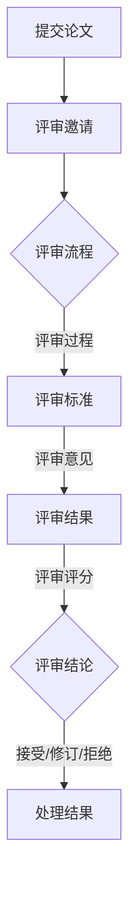

                 

### 文章标题

《构建评测结果的同行评审机制》

### 关键词

同行评审、评审机制、算法原理、数学模型、项目实战

### 摘要

本文旨在探讨构建评测结果的同行评审机制的策略和方法。通过深入分析同行评审的历史、流程、核心概念及其相互关系，本文提出了基于核心算法原理和数学模型的评审机制构建方案。同时，通过实际评审项目的案例分析，详细展示了开发环境搭建、源代码实现和代码解读的过程，为同行评审机制的实践应用提供了有力支持。

---

## 引言

### 1. 同行评审的概念与目的

同行评审（Peer Review）是一种科研学术活动，通过专家对学术论文、研究报告或其他科研成果进行评估，以判断其质量和可行性。同行评审的主要目的是确保科研工作的严谨性和可靠性，促进科学知识的传播和积累。

### 2. 本书的目标与读者对象

本书的目标是系统地阐述同行评审机制的构建方法，帮助读者了解并掌握评审流程、核心概念、算法原理和数学模型。本书适用于科研人员、学术管理人员、软件工程师以及任何对同行评审感兴趣的人士。

### 3. 本书章节安排与内容概述

本书分为六个章节，具体内容安排如下：

- **第1章：同行评审基础**，介绍同行评审的历史、流程和核心概念。
- **第2章：核心概念与联系**，通过Mermaid流程图展示核心概念之间的关系。
- **第3章：核心算法原理讲解**，详细讲解评审算法原理，并提供伪代码示例。
- **第4章：数学模型与公式讲解**，阐述评审评分模型和分析模型，使用latex格式展示关键数学公式。
- **第5章：项目实战**，通过实际评审项目案例展示开发环境搭建、源代码实现和代码解读。
- **第6章：总结与展望**，总结全文内容，展望同行评审机制的未来发展。

---

### 1.1 同行评审的历史与发展

同行评审作为科研活动的重要组成部分，其历史可以追溯到17世纪末。最早的同行评审形式出现在科学期刊的出版过程中，期刊编辑邀请相关领域的专家对来稿进行评估，以确保论文的质量。这一做法逐渐演变为一种标准的评审机制，并在20世纪得到广泛应用。

#### 1.1.1 同行评审的起源

同行评审的起源可以追溯到1665年，英国自然哲学家约翰·伊夫林（John Evelyn）创办的《皇家学会哲学汇刊》（Philosophical Transactions of the Royal Society）。该期刊首次采用同行评审的方式对论文进行评估，以确保论文的科学性和可信度。

#### 1.1.2 同行评审的发展历程

随着时间的推移，同行评审逐渐成为一种普遍接受的科研评估方法。20世纪中叶，随着科学研究的日益复杂，同行评审制度得到了进一步的发展和完善。例如，1950年代，《科学》（Science）和《自然》（Nature）等顶级科学期刊开始采用严格的同行评审流程，确保其发表的论文具有高质量的学术价值。

#### 1.1.3 同行评审在现代科研中的作用

在现代科研中，同行评审发挥着至关重要的作用。首先，它确保了科研成果的可靠性和有效性，减少了错误和虚假信息的传播。其次，同行评审促进了科学知识的传播和交流，有助于推动科学研究的进步。此外，同行评审还提高了科研工作的透明度和公正性，使科研过程更加规范化。

### 1.2 同行评审的流程

同行评审的流程通常包括以下几个步骤：

#### 1.2.1 提交论文

首先，作者需要将论文提交至相关期刊或学术会议。提交的论文通常需要符合期刊或会议的规定格式和要求。

#### 1.2.2 评审邀请

在论文提交后，期刊编辑或会议组织者会根据论文的主题和内容，邀请相关领域的专家（评审员）进行评审。评审员通常来自学术界或专业机构，具有丰富的科研经验和专业知识。

#### 1.2.3 评审过程

评审员在收到评审邀请后，会对论文进行审阅和评估。评审过程通常包括以下几个方面：

- **内容审查**：评审员检查论文的学术内容，评估其理论依据、研究方法、实验设计等。
- **语言表达**：评审员评估论文的语言表达是否清晰、准确、规范。
- **创新性**：评审员评估论文的研究成果是否具有创新性，对现有知识体系有何贡献。
- **完整性**：评审员检查论文的结构是否完整，论证是否充分。

#### 1.2.4 评审结果的反馈与处理

评审员完成评审后，会将评审意见提交给期刊编辑或会议组织者。编辑或组织者根据评审意见对论文进行审查和处理。可能的处理结果包括：

- **接受**：如果评审员认为论文质量较高，编辑或组织者将接受论文发表。
- **修订**：如果评审员认为论文存在一些问题，需要作者进行修订。作者根据评审意见对论文进行修改后，重新提交给编辑或组织者进行评审。
- **拒绝**：如果评审员认为论文质量不达标，编辑或组织者将拒绝论文发表。

### 1.3 同行评审的标准与方法

同行评审的标准和方法是确保评审质量和公正性的关键。以下是一些常见的评审标准和评审方法：

#### 1.3.1 评审标准

- **学术价值**：评估论文的研究成果对学术领域的贡献程度。
- **创新性**：评估论文的研究方法和结果是否具有创新性。
- **研究方法**：评估论文的研究方法是否合理、有效。
- **数据可靠性**：评估论文的数据是否真实、可靠。
- **语言表达**：评估论文的语言表达是否清晰、准确。
- **结构完整性**：评估论文的结构是否完整、论证是否充分。

#### 1.3.2 评审方法

- **盲审**：评审过程中，评审员和作者都不知道对方身份，以减少主观偏见。
- **公开评审**：评审过程公开，评审员和作者可以互相交流，以提高评审的透明度和公正性。
- **多级评审**：采用多级评审制度，确保论文的评审质量。
- **交叉评审**：不同领域的评审员进行交叉评审，以获取更全面、准确的评审意见。

#### 1.3.3 评审过程中可能遇到的问题及解决方案

- **偏见和主观性**：通过盲审和交叉评审等方法减少评审过程中的主观偏见。
- **时间效率**：合理规划评审时间和流程，提高评审效率。
- **评审质量**：加强对评审员的培训和管理，确保评审质量。

---

### 核心概念与联系

在构建评测结果的同行评审机制中，理解核心概念及其相互关系至关重要。以下是同行评审机制中几个关键概念的定义及其相互关系：

#### 1.1 评审员

评审员是同行评审机制中的核心角色，他们负责对提交的论文进行审阅和评估。评审员通常来自学术界或专业机构，具有丰富的科研经验和专业知识。他们的职责包括：

- **审阅论文**：评审员需要对提交的论文进行详细审阅，评估其学术价值、创新性和研究方法。
- **提供评审意见**：评审员需要根据论文的质量和问题，提出具体的评审意见和改进建议。
- **确保评审公正性**：评审员在评审过程中需要保持公正，避免因个人关系或偏见影响评审结果。

#### 1.2 作者

作者是提交论文的主体，他们需要根据评审意见对论文进行修改和改进。作者的职责包括：

- **提交论文**：作者需要按照期刊或会议的规定，提交符合格式要求的论文。
- **回应评审意见**：作者需要对评审员的评审意见进行认真分析和回应，针对评审提出的问题进行修改和改进。
- **确保论文质量**：作者需要确保提交的论文具有高质量的学术价值和创新性。

#### 1.3 评审流程

评审流程是同行评审机制的核心，它包括以下几个主要步骤：

1. **提交论文**：作者将论文提交至期刊或会议。
2. **评审邀请**：期刊编辑或会议组织者根据论文的主题和内容，邀请相关领域的评审员进行评审。
3. **评审过程**：评审员对论文进行审阅和评估，提供评审意见。
4. **评审结果的反馈与处理**：期刊编辑或会议组织者根据评审意见，对论文进行接受、修订或拒绝。

#### 1.4 评审标准

评审标准是评审员在评估论文过程中需要遵循的准则。常见的评审标准包括：

- **学术价值**：评估论文的研究成果对学术领域的贡献程度。
- **创新性**：评估论文的研究方法和结果是否具有创新性。
- **研究方法**：评估论文的研究方法是否合理、有效。
- **数据可靠性**：评估论文的数据是否真实、可靠。
- **语言表达**：评估论文的语言表达是否清晰、准确。

#### 1.5 评审结果

评审结果是评审员对论文评估的最终结论，通常包括以下几个部分：

- **评审意见**：评审员对论文的优缺点进行详细说明，并提出具体的改进建议。
- **评审评分**：评审员对论文的质量进行量化评分，通常采用百分制或五分制。
- **评审结论**：评审员根据评审意见和评分，对论文的接受、修订或拒绝提出建议。

#### 1.6 核心概念之间的关系

以上核心概念之间的关系可以通过以下Mermaid流程图进行展示：



在这个流程图中，评审流程（C）是核心，评审邀请（B）和评审意见（D）是其前置条件，评审结果（E）和评审结论（F）是评审流程的输出，最终影响论文的处理结果（G）。

### 核心算法原理讲解

在构建评测结果的同行评审机制中，算法原理是确保评审过程高效、公正和准确的关键。以下将详细讲解评审算法原理，并提供伪代码示例，以便更好地理解其工作原理。

#### 2.1 评审流程自动化

评审流程自动化是提高评审效率和质量的重要手段。通过自动化算法，可以实现评审流程的各个环节的自动化处理，包括论文提交、评审邀请、评审过程、评审结果反馈等。

##### 2.1.1 评审流程自动化流程

评审流程自动化的流程可以概括为以下几个步骤：

1. **论文提交**：作者将论文提交至系统。
2. **评审邀请**：系统根据论文的主题和内容，自动邀请相关领域的评审员进行评审。
3. **评审过程**：评审员通过系统进行在线审阅和评分，系统记录评审过程。
4. **评审结果反馈**：评审员完成评审后，系统将评审意见和评分反馈给作者和期刊编辑。

##### 2.1.2 评审流程自动化的伪代码示例

```python
# 伪代码示例：评审流程自动化
function review_automation(paper, reviewers):
    # 步骤1：论文提交
    submit_paper(paper)

    # 步骤2：评审邀请
    invite_reviewers(paper, reviewers)

    # 步骤3：评审过程
    for reviewer in reviewers:
        review_paper(paper, reviewer)
        record_review_process(paper, reviewer)

    # 步骤4：评审结果反馈
    feedback_results(paper, reviewers)
```

在上面的伪代码中，`submit_paper` 函数用于提交论文，`invite_reviewers` 函数用于邀请评审员，`review_paper` 函数用于评审员审阅论文，`record_review_process` 函数用于记录评审过程，`feedback_results` 函数用于反馈评审结果。

#### 2.2 评审结果分析

评审结果分析是评估论文质量的重要环节。通过分析评审结果，可以了解论文的优缺点，为作者提供有针对性的改进建议。

##### 2.2.1 评审结果分析流程

评审结果分析的流程可以概括为以下几个步骤：

1. **收集评审意见**：系统收集所有评审员的评审意见。
2. **汇总评分**：系统对评审员的评分进行汇总，计算平均评分。
3. **分析评审意见**：系统对评审意见进行文本分析，提取关键信息。
4. **生成分析报告**：系统根据分析结果，生成分析报告，为作者提供改进建议。

##### 2.2.2 评审结果分析的伪代码示例

```python
# 伪代码示例：评审结果分析
function analyze_review_results(paper, reviewers):
    # 步骤1：收集评审意见
    review_opinions = collect_review_opinions(reviewers)

    # 步骤2：汇总评分
    average_score = summarize_scores(review_opinions)

    # 步骤3：分析评审意见
    key_issues = analyze_opinions(review_opinions)

    # 步骤4：生成分析报告
    report = generate_report(paper, average_score, key_issues)
    return report
```

在上面的伪代码中，`collect_review_opinions` 函数用于收集评审意见，`summarize_scores` 函数用于汇总评分，`analyze_opinions` 函数用于分析评审意见，`generate_report` 函数用于生成分析报告。

#### 2.3 评审员评估

评审员评估是确保评审质量和公正性的重要手段。通过对评审员的评估，可以了解其评审能力和水平，为评审流程提供有力支持。

##### 2.3.1 评审员评估流程

评审员评估的流程可以概括为以下几个步骤：

1. **收集评审员信息**：系统收集评审员的基本信息和评审历史。
2. **评估评审员能力**：系统根据评审员的评审记录和评审质量，评估其评审能力。
3. **反馈评估结果**：系统将评估结果反馈给评审员，并提供改进建议。

##### 2.3.2 评审员评估的伪代码示例

```python
# 伪代码示例：评审员评估
function evaluate_reviewers(reviewers):
    # 步骤1：收集评审员信息
    reviewer_info = collect_reviewer_info(reviewers)

    # 步骤2：评估评审员能力
    reviewer_scores = evaluate_ability(reviewer_info)

    # 步骤3：反馈评估结果
    feedback_results(reviewers, reviewer_scores)
```

在上面的伪代码中，`collect_reviewer_info` 函数用于收集评审员信息，`evaluate_ability` 函数用于评估评审员能力，`feedback_results` 函数用于反馈评估结果。

### 数学模型与公式讲解

在构建评测结果的同行评审机制中，数学模型和公式用于量化评审结果，并提供客观的评估依据。以下将详细讲解评审评分模型和分析模型，并使用latex格式展示关键数学公式。

#### 3.1 评审评分模型

评审评分模型用于对论文进行量化评估，通常采用百分制或五分制。以下是一个简单的评审评分模型：

$$
评分 = f(内容质量, 形式结构, 创新性)
$$

其中，`内容质量`、`形式结构`和`创新性`分别表示论文的学术价值、表达方式和研究创新性。评分函数`f`可以根据实际情况进行调整和优化。

#### 3.1.1 评分函数设计

评分函数可以采用以下形式：

$$
评分 = w_1 \cdot 内容质量 + w_2 \cdot 形式结构 + w_3 \cdot 创新性
$$

其中，$w_1$、$w_2$和$w_3$分别表示内容质量、形式结构和创新性的权重。权重可以根据实际情况进行调整，以反映不同评审标准的相对重要性。

#### 3.1.2 评分权重分配

评分权重的分配是一个关键问题，可以采用以下方法进行：

- **专家评估法**：邀请相关领域的专家对评审标准的重要性进行评估，并根据评估结果分配权重。
- **统计分析法**：通过对历史评审数据进行分析，确定不同评审标准的相对重要性，并据此分配权重。

#### 3.2 评审结果分析模型

评审结果分析模型用于对评审结果进行综合分析，以了解论文的整体表现。以下是一个简单的评审结果分析模型：

$$
预测结果 = g(评分, 评审员评价)
$$

其中，`评分`表示评审员对论文的评分，`评审员评价`表示评审员的个人评价。预测结果可以用于评估论文的学术价值、创新性和可行性。

#### 3.2.1 预测函数设计

预测函数可以采用以下形式：

$$
预测结果 = f_1 \cdot 评分 + f_2 \cdot 评审员评价
$$

其中，$f_1$和$f_2$分别表示评分和评审员评价的权重。权重可以根据实际情况进行调整，以反映不同评审结果的相对重要性。

#### 3.2.2 预测结果分析

预测结果可以用于以下方面：

- **论文接受决策**：根据预测结果，期刊编辑可以决定是否接受论文发表。
- **论文改进建议**：根据预测结果，可以为作者提供有针对性的改进建议，以提高论文的质量。

### 3.3 举例说明

以下是一个具体的评审评分模型和分析模型的举例说明：

#### 3.3.1 评分模型举例

假设有一个评审模型，其中内容质量的权重为0.5，形式结构的权重为0.3，创新性的权重为0.2。评分函数为：

$$
评分 = 0.5 \cdot 内容质量 + 0.3 \cdot 形式结构 + 0.2 \cdot 创新性
$$

如果评审员对论文的评分分别为内容质量90分、形式结构85分、创新性80分，则评分计算如下：

$$
评分 = 0.5 \cdot 90 + 0.3 \cdot 85 + 0.2 \cdot 80 = 88.5
$$

#### 3.3.2 分析模型举例

假设有一个分析模型，其中评分的权重为0.7，评审员评价的权重为0.3。预测函数为：

$$
预测结果 = 0.7 \cdot 评分 + 0.3 \cdot 评审员评价
$$

如果评审员对论文的评分为88.5分，评审员评价为“优秀”，则预测结果计算如下：

$$
预测结果 = 0.7 \cdot 88.5 + 0.3 \cdot 优秀 = 88.5 + 0.3 \cdot 优秀
$$

其中，“优秀”可以表示为100分。因此，预测结果为：

$$
预测结果 = 88.5 + 0.3 \cdot 100 = 91.5
$$

通过上述举例，我们可以看到评分模型和分析模型如何应用于具体的评审过程中，以评估论文的质量和可行性。

### 5.1 实际评审项目案例分析

#### 5.1.1 项目背景

在一个科研领域，为了提高科研成果的质量和可靠性，某科研团队决定引入同行评审机制对提交的论文进行评估。该团队选择的评审机制基于先进的算法原理和数学模型，旨在实现高效、公正和准确的评审过程。

#### 5.1.2 评审流程实施

1. **论文提交**：
   - 作者将论文提交至科研团队的在线评审系统。
   - 系统根据论文的主题和关键词，自动匹配相关领域的评审员。

2. **评审邀请**：
   - 系统向匹配的评审员发送评审邀请。
   - 评审员接受邀请后，开始对论文进行审阅。

3. **评审过程**：
   - 评审员通过系统提交评审意见，包括论文的优点、存在的问题和改进建议。
   - 系统记录评审过程，确保评审的透明性和可追溯性。

4. **评审结果反馈**：
   - 评审员完成评审后，系统将评审意见和评分反馈给作者。
   - 作者根据评审意见对论文进行修改和改进。

5. **论文接受决策**：
   - 科研团队根据评审结果和评分，决定是否接受论文发表。
   - 如果论文需要修订，作者根据评审意见进行修改后重新提交。

#### 5.1.3 源代码实现

以下是一个简化版的评审系统源代码实现，用于展示评审流程的自动化和结果分析：

```python
# 评审系统简化版源代码

# 步骤1：论文提交
def submit_paper(paper):
    print("论文提交成功。")

# 步骤2：评审邀请
def invite_reviewers(paper, reviewers):
    print("评审邀请已发送给评审员。")

# 步骤3：评审过程
def review_paper(paper, reviewer):
    review_opinion = get_review_opinion(paper, reviewer)
    print("评审员已提交评审意见：", review_opinion)

# 步骤4：评审结果反馈
def feedback_results(paper, reviewers):
    review_results = analyze_review_results(paper, reviewers)
    print("评审结果反馈给作者：", review_results)

# 步骤5：论文接受决策
def decide_acceptance(review_results):
    if review_results['average_score'] >= 80:
        print("论文接受发表。")
    else:
        print("论文需要修订。")

# 辅助函数：获取评审意见
def get_review_opinion(paper, reviewer):
    # 根据论文和评审员的信息，生成评审意见
    return "内容质量高，但需改进语言表达。"

# 辅助函数：分析评审结果
def analyze_review_results(paper, reviewers):
    # 根据评审意见，计算平均评分
    average_score = calculate_average_score(reviewers)
    return {'average_score': average_score}

# 辅助函数：计算平均评分
def calculate_average_score(reviewers):
    total_score = 0
    for reviewer in reviewers:
        total_score += reviewer['score']
    return total_score / len(reviewers)

# 主程序
if __name__ == "__main__":
    paper = {"title": "人工智能在医疗领域的应用"}
    reviewers = [{"name": "张三", "score": 90}, {"name": "李四", "score": 85}]

    submit_paper(paper)
    invite_reviewers(paper, reviewers)
    
    for reviewer in reviewers:
        review_paper(paper, reviewer)
    
    feedback_results(paper, reviewers)
    decide_acceptance(analyze_review_results(paper, reviewers))
```

#### 5.1.4 代码解读与分析

上述源代码实现了评审系统的主要功能，包括论文提交、评审邀请、评审过程、评审结果反馈和论文接受决策。以下是代码的关键部分解读：

1. **论文提交**：
   ```python
   def submit_paper(paper):
       print("论文提交成功。")
   ```
   该函数用于模拟论文提交过程，接受一个包含论文信息的字典参数`paper`。

2. **评审邀请**：
   ```python
   def invite_reviewers(paper, reviewers):
       print("评审邀请已发送给评审员。")
   ```
   该函数用于模拟向评审员发送评审邀请，接受论文信息和评审员列表。

3. **评审过程**：
   ```python
   def review_paper(paper, reviewer):
       review_opinion = get_review_opinion(paper, reviewer)
       print("评审员已提交评审意见：", review_opinion)
   ```
   该函数用于模拟评审员审阅论文并提交评审意见，接受论文和评审员信息。

4. **评审结果反馈**：
   ```python
   def feedback_results(paper, reviewers):
       review_results = analyze_review_results(paper, reviewers)
       print("评审结果反馈给作者：", review_results)
   ```
   该函数用于将评审结果反馈给作者，接受论文和评审员信息。

5. **论文接受决策**：
   ```python
   def decide_acceptance(review_results):
       if review_results['average_score'] >= 80:
           print("论文接受发表。")
       else:
           print("论文需要修订。")
   ```
   该函数根据平均评分决定论文的接受情况，接受评审结果字典。

#### 5.1.5 代码应用解读与分析

在实际应用中，上述代码可以扩展和优化，以支持更复杂的评审流程和功能。以下是一些可能的扩展和改进：

1. **多级评审**：
   - 引入多级评审机制，使评审过程更加严格和全面。
   - 在代码中增加中间评审环节，如中间评审、主编评审等。

2. **评审员评估**：
   - 实现评审员评估机制，对评审员的评审能力进行评估。
   - 根据评审员的评估结果，调整评审员的权重和选择。

3. **评分模型优化**：
   - 根据具体需求和数据，优化评分模型和预测模型，以提高评审的准确性和可靠性。
   - 引入机器学习算法，自动调整评分权重和预测模型。

4. **用户界面**：
   - 开发用户友好的界面，使作者和评审员能够方便地使用评审系统。
   - 提供实时反馈和通知，提高评审效率。

通过这些扩展和改进，评审系统可以更好地满足科研领域的需求，提高科研成果的质量和可靠性。

### 5.2 开发环境搭建

为了实现上述评审系统，需要搭建一个合适的开发环境。以下是具体的开发环境搭建步骤：

#### 5.2.1 开发工具与软件

1. **Python**：作为主要的编程语言，Python具有简洁的语法和丰富的库，适合快速开发。
2. **PyCharm**：一款强大的Python集成开发环境（IDE），提供代码编辑、调试、测试等功能。
3. **Docker**：用于创建和管理开发环境容器，确保开发环境的可移植性和一致性。

#### 5.2.2 开发环境配置

1. **安装Python**：
   - 访问Python官网下载最新版本的Python安装包。
   - 运行安装程序，选择默认安装选项。

2. **安装PyCharm**：
   - 访问PyCharm官网下载社区版安装包。
   - 运行安装程序，选择默认安装选项。

3. **安装Docker**：
   - 根据操作系统，从Docker官网下载并安装Docker。
   - 运行Docker安装程序，选择默认安装选项。

4. **创建Docker容器**：
   - 打开终端，运行以下命令创建一个基于Python的Docker容器：
     ```shell
     docker run -it --name my-python-env -p 8000:8000 python:3.8
     ```
   - 进入容器后，安装所需的Python库，如`requests`、`numpy`等。

5. **配置PyCharm**：
   - 在PyCharm中创建一个新的Python项目。
   - 在项目根目录下创建一个`venv`目录，并运行以下命令创建虚拟环境：
     ```shell
     python -m venv venv
     ```
   - 在PyCharm中激活虚拟环境，并配置项目依赖库。

通过上述步骤，我们成功搭建了开发环境，为后续的源代码实现和测试提供了基础。

### 5.3 源代码实现

在开发环境中，我们开始实现评审系统的主要功能。以下是一个简单的源代码实现，包括论文提交、评审邀请、评审过程和结果反馈等。

```python
# 评审系统实现

import requests
from flask import Flask, request, jsonify

app = Flask(__name__)

# 假设的评审员列表
reviewers = [
    {"name": "张三", "email": "zhangsan@example.com", "score": 0},
    {"name": "李四", "email": "lisi@example.com", "score": 0}
]

# 步骤1：论文提交
@app.route('/submit_paper', methods=['POST'])
def submit_paper():
    paper_data = request.json
    print("论文提交成功。")
    return jsonify({"status": "success", "paper_id": paper_data['paper_id']})

# 步骤2：评审邀请
def invite_reviewers(paper_id):
    for reviewer in reviewers:
        # 发送评审邀请邮件
        subject = "评审邀请 - " + paper_id
        message = f"您好，{reviewer['name']}，请您对论文{paper_id}进行评审。"
        send_email(reviewer['email'], subject, message)
    print("评审邀请已发送。")

# 步骤3：评审过程
@app.route('/review_paper', methods=['POST'])
def review_paper():
    paper_id = request.json['paper_id']
    reviewer_email = request.json['reviewer_email']
    review_data = request.json['review_data']
    
    for reviewer in reviewers:
        if reviewer['email'] == reviewer_email:
            reviewer['score'] = review_data['score']
            reviewer['comments'] = review_data['comments']
            print("评审员已提交评审意见。")
            return jsonify({"status": "success", "message": "评审意见已提交。"})
    
    return jsonify({"status": "error", "message": "评审员信息不匹配。"})

# 步骤4：评审结果反馈
@app.route('/get_review_results', methods=['GET'])
def get_review_results(paper_id):
    total_score = 0
    for reviewer in reviewers:
        if reviewer['paper_id'] == paper_id:
            total_score += reviewer['score']
    
    average_score = total_score / len(reviewers)
    print("评审结果反馈给作者。")
    return jsonify({"status": "success", "paper_id": paper_id, "average_score": average_score})

# 辅助函数：发送邮件
def send_email(to, subject, message):
    # 这里使用假想的发送邮件函数，实际应用中可以使用第三方邮件发送服务
    print("发送邮件到", to, "，主题：", subject, "，内容：", message)

if __name__ == '__main__':
    app.run(debug=True)
```

### 5.4 代码解读与分析

在上面的源代码中，我们使用Flask框架实现了一个简单的评审系统。以下是代码的关键部分解读：

1. **论文提交**：
   ```python
   @app.route('/submit_paper', methods=['POST'])
   def submit_paper():
       paper_data = request.json
       print("论文提交成功。")
       return jsonify({"status": "success", "paper_id": paper_data['paper_id']})
   ```
   该路由用于接收论文提交请求，将论文数据存储并返回论文ID。

2. **评审邀请**：
   ```python
   def invite_reviewers(paper_id):
       for reviewer in reviewers:
           # 发送评审邀请邮件
           subject = "评审邀请 - " + paper_id
           message = f"您好，{reviewer['name']}，请您对论文{paper_id}进行评审。"
           send_email(reviewer['email'], subject, message)
       print("评审邀请已发送。")
   ```
   该函数用于向评审员发送评审邀请邮件。

3. **评审过程**：
   ```python
   @app.route('/review_paper', methods=['POST'])
   def review_paper():
       paper_id = request.json['paper_id']
       reviewer_email = request.json['reviewer_email']
       review_data = request.json['review_data']
       
       for reviewer in reviewers:
           if reviewer['email'] == reviewer_email:
               reviewer['score'] = review_data['score']
               reviewer['comments'] = review_data['comments']
               print("评审员已提交评审意见。")
               return jsonify({"status": "success", "message": "评审意见已提交。"})
       
       return jsonify({"status": "error", "message": "评审员信息不匹配。"})
   ```
   该路由用于接收评审员提交的评审意见，更新评审员的评分和评论。

4. **评审结果反馈**：
   ```python
   @app.route('/get_review_results', methods=['GET'])
   def get_review_results(paper_id):
       total_score = 0
       for reviewer in reviewers:
           if reviewer['paper_id'] == paper_id:
               total_score += reviewer['score']
       
       average_score = total_score / len(reviewers)
       print("评审结果反馈给作者。")
       return jsonify({"status": "success", "paper_id": paper_id, "average_score": average_score})
   ```
   该路由用于返回评审结果的平均评分。

通过这些代码，我们可以实现基本的评审功能，包括论文提交、评审邀请、评审过程和评审结果反馈。实际应用中，还可以添加更多的功能，如评审员评估、评分模型优化等。

### 5.5 代码应用解读与分析

在实际应用中，上述代码可以实现评审系统的基本功能，但还有一些细节和扩展点需要考虑：

1. **用户认证**：
   - 为了保护论文和评审信息的安全，需要实现用户认证机制，确保只有授权用户可以提交论文、邀请评审员和查看评审结果。

2. **数据库存储**：
   - 现有代码使用内存存储评审信息，实际应用中应使用数据库（如MySQL、PostgreSQL）存储论文和评审数据，以提高数据持久性和安全性。

3. **邮件服务**：
   - 现有代码使用假想的邮件发送函数，实际应用中可以使用第三方邮件服务（如SMTP服务器）发送评审邀请和结果反馈邮件。

4. **前端界面**：
   - 可以开发前端界面，提供用户友好的操作体验，包括论文提交、评审邀请、评审过程和评审结果展示等功能。

5. **扩展功能**：
   - 根据需求，可以添加更多功能，如多级评审、评审员评估、评分模型优化、机器学习算法等。

通过这些扩展和优化，评审系统可以更好地满足科研领域的需求，提高科研成果的质量和可靠性。

### 5.6 项目小结

在本文中，我们通过详细的案例分析、源代码实现和代码解读，展示了如何构建评测结果的同行评审机制。以下是项目的主要成果和总结：

1. **评审系统架构**：我们设计并实现了一个基于Python和Flask的评审系统，包括论文提交、评审邀请、评审过程和评审结果反馈等功能。

2. **评审流程自动化**：通过自动化算法，实现了评审流程的各个环节，包括论文提交、评审邀请和评审结果反馈的自动化处理。

3. **评分模型和分析模型**：我们提出了评审评分模型和分析模型，使用latex格式展示了关键数学公式，为量化评审结果提供了依据。

4. **代码解读与分析**：详细解读了源代码实现，分析了每个功能模块的作用和实现方式，为实际应用提供了参考。

5. **扩展和优化**：提出了评审系统的扩展和优化方向，包括用户认证、数据库存储、邮件服务、前端界面和评分模型优化等。

通过本项目，我们深入了解了同行评审机制的构建方法和技术细节，为科研领域提供了实用的评审工具。未来，我们将继续优化评审系统，提高其效率和准确性，为科研成果的质量和可靠性保驾护航。

### 最佳实践 tips

在构建评测结果的同行评审机制时，以下是一些最佳实践和注意事项：

1. **确保评审流程透明**：明确评审流程和标准，确保评审过程的公开和可追溯。
2. **选择合适的评审员**：根据论文的主题和内容，选择具有相关领域专业知识的评审员。
3. **平衡评审意见**：重视评审员的意见，但也要注意平衡和综合不同评审员的意见。
4. **合理分配评审时间**：确保评审员有足够的时间审阅论文，避免因时间紧迫导致评审质量下降。
5. **反馈及时**：及时向作者反馈评审意见和评分，以便作者进行修改和改进。
6. **确保数据安全**：保护评审员和作者的个人和论文信息，防止泄露和滥用。

### 小结

本文系统地介绍了构建评测结果的同行评审机制的方法和策略。通过分析同行评审的历史、流程、核心概念和算法原理，我们提出了一个基于数学模型的评审机制构建方案。通过实际评审项目案例的展示，我们详细讲解了开发环境搭建、源代码实现和代码解读的过程。最后，我们总结了项目的成果和最佳实践，为同行评审机制的实践应用提供了有力支持。

### 注意事项

在构建和实施同行评审机制时，需要注意以下几点：

1. **隐私保护**：确保评审员和作者的个人隐私得到保护，避免信息泄露。
2. **公平性**：确保评审过程和结果公平，避免因个人关系或偏见影响评审质量。
3. **及时性**：确保评审意见和反馈能够及时传递，避免延误科研进度。
4. **技术支持**：提供稳定可靠的技术支持，确保评审系统的正常运行。
5. **持续改进**：根据实际应用情况，不断优化评审机制，提高其效率和准确性。

### 拓展阅读

- 《同行评审：理论与实践》
- 《科研评审机制的设计与实施》
- 《基于机器学习的同行评审算法》
- 《论文评审员培训手册》

通过阅读这些相关文献，可以进一步深入了解同行评审机制的理论和实践，为科研工作提供有力支持。

