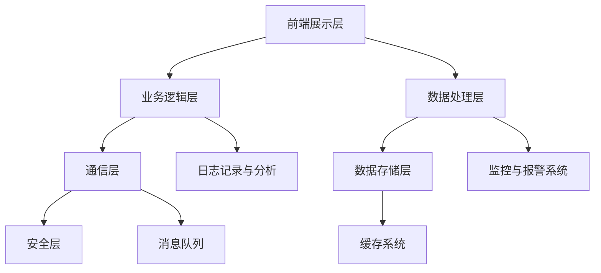

                 

### 文章标题

《构建评测结果的实时协作平台》

> 关键词：实时协作平台、评测结果、实时数据处理、架构设计、技术选型

> 摘要：本文详细阐述了如何构建一个高效的实时协作平台，用于处理评测结果。文章首先介绍了实时协作平台的概念和重要性，随后深入分析了构建平台所需的架构设计和技术选型。通过具体的开发案例，读者可以了解实时协作平台在实际应用中的实现方法和技巧，从而掌握构建实时协作平台的核心技能。

### 引言与背景

在当今信息化社会中，评测结果的实时处理和协作已成为许多领域的关键需求。无论是在在线教育、企业评测，还是在科学研究与数据分析等领域，实时协作平台都扮演着重要的角色。一个高效的实时协作平台不仅能够提高数据处理的速度和准确性，还能促进团队成员之间的协作和沟通，从而提升整体工作效率。

#### 实时协作平台概述

实时协作平台，顾名思义，是一种能够实现实时数据同步和处理的应用系统。它允许用户在同一个平台上共享和交流信息，实时更新数据状态，并能够支持多种类型的协作活动，如文档编辑、视频会议、任务分配等。在评测结果的实时协作中，实时协作平台的作用尤为突出。它能够快速收集、处理和展示评测结果，为决策者提供及时的数据支持。

#### 评测结果协作的重要性

评测结果协作的重要性体现在以下几个方面：

1. **实时性：** 评测结果的及时处理和反馈对于许多应用场景至关重要。例如，在线教育平台需要对学生的作业进行实时批改和评分，以便学生能够及时了解自己的学习情况，并进行调整。

2. **准确性：** 通过实时协作平台，评测结果的准确性可以得到保障。多个成员可以同时对评测结果进行校验和修正，减少人为错误的发生。

3. **协作性：** 实时协作平台可以促进团队成员之间的合作。多个成员可以共同参与评测结果的讨论和修改，提高团队的整体工作效率。

4. **可追溯性：** 实时协作平台记录了评测结果的处理过程，使得整个过程具有可追溯性。这对于后续的数据分析和审计具有重要意义。

#### 本书内容概述与结构

本书将分为以下几个部分：

1. **引言与背景：** 介绍实时协作平台的概念、评测结果协作的重要性，以及本书的内容概述。
   
2. **实时协作平台的核心概念与架构：** 分析实时数据处理的挑战，详细讲解实时协作平台的架构设计。

3. **构建实时协作平台的技术选型：** 讨论数据存储与检索技术、实时通信技术、安全性与隐私保护技术的选型。

4. **实时协作平台的开发与部署：** 介绍实时协作平台的开发工具和环境配置，详细讲解平台架构的搭建与实现。

5. **实时协作平台的实际应用案例：** 分析评测结果协作的应用场景，提供具体的应用案例。

6. **实时协作平台的扩展与未来发展：** 讨论平台的功能扩展、新技术应用前景，以及未来的发展趋势。

7. **总结与展望：** 对本书内容进行回顾，提出学员反馈与改进建议，展望未来的研究方向。

通过以上各章节的深入探讨，读者将能够全面了解实时协作平台的设计与实现方法，掌握构建评测结果的实时协作平台的核心技能。

### 实时协作平台的核心概念与架构

在深入探讨如何构建评测结果的实时协作平台之前，我们首先需要理解实时协作平台的核心概念与架构。实时协作平台不仅仅是一个简单的数据同步工具，它需要具备高效的数据处理能力、强大的通信机制、以及安全可靠的运行环境。

#### 实时数据处理的挑战

实时数据处理是构建实时协作平台的关键，它面临着以下挑战：

1. **数据量大：** 在线教育平台、企业评测系统等应用场景中，数据量通常非常庞大，如何高效处理这些数据是首要挑战。

2. **数据处理速度：** 实时性要求高，数据处理速度必须足够快，以支持实时反馈和协作。

3. **数据一致性：** 多个用户可能同时访问和修改同一份数据，如何保证数据的一致性是一个重要的挑战。

4. **数据安全性：** 数据在传输和处理过程中必须保证安全性，防止数据泄露和篡改。

#### 实时协作平台的架构设计

为了应对上述挑战，实时协作平台需要采用一种分布式、模块化的架构设计。以下是实时协作平台的基本架构设计：

1. **前端展示层：** 负责用户界面的展示，包括评测结果的展示、用户操作的界面等。前端展示层通常采用Web技术，如HTML、CSS、JavaScript等。

2. **业务逻辑层：** 处理具体的业务逻辑，包括数据校验、数据转换、用户身份验证等。业务逻辑层通常采用微服务架构，每个业务模块独立部署。

3. **数据处理层：** 负责实时数据处理，包括数据的收集、存储、查询等。数据处理层通常采用分布式数据库和流处理技术。

4. **通信层：** 负责处理客户端与服务器之间的通信，确保数据能够实时传输。通信层通常采用WebSocket、HTTP/2等协议。

5. **数据存储层：** 负责存储大量的评测结果数据，通常采用分布式数据库系统，如Apache Kafka、Apache HBase等。

6. **安全层：** 负责处理数据的安全性问题，包括数据加密、用户认证、访问控制等。安全层通常采用SSL/TLS、OAuth等安全协议。

#### 实时数据处理技术

为了实现高效的实时数据处理，实时协作平台通常会采用以下技术：

1. **分布式数据库：** 如MySQL、PostgreSQL等关系型数据库，或者MongoDB、Cassandra等NoSQL数据库，能够支持大规模数据的存储和快速查询。

2. **流处理技术：** 如Apache Kafka、Apache Flink等，能够实现数据流的实时处理，支持大规模数据的高速传输和处理。

3. **消息队列：** 如RabbitMQ、Apache Kafka等，能够实现异步消息传递，支持系统的解耦和弹性扩展。

4. **缓存技术：** 如Redis、Memcached等，能够提高系统的响应速度，减少数据库的压力。

#### Mermaid流程图展示

为了更直观地展示实时协作平台的架构设计，我们可以使用Mermaid流程图来描述：



在这个流程图中，我们可以看到实时协作平台各个组件之间的关联，以及数据流和处理流程。

#### 核心概念与联系

实时协作平台的核心概念包括：

- **前端展示层：** 提供用户交互界面。
- **业务逻辑层：** 实现业务逻辑处理。
- **数据处理层：** 负责数据的实时处理。
- **通信层：** 负责数据传输。
- **数据存储层：** 负责数据存储。
- **安全层：** 负责数据安全。

这些核心概念相互关联，共同构成了实时协作平台的基本架构。

#### 核心算法原理讲解

为了实现实时数据处理，实时协作平台通常会采用以下核心算法：

1. **数据校验算法：** 用于确保数据的有效性和一致性。

   ```python
   def data_validation(data):
       # 数据校验逻辑
       if not data:
           return False
       # 更多校验逻辑
       return True
   ```

2. **数据转换算法：** 用于将数据格式进行转换，以便后续处理。

   ```python
   def data_conversion(data):
       # 数据转换逻辑
       new_data = data.transform()
       return new_data
   ```

3. **流处理算法：** 用于处理实时数据流。

   ```python
   def stream_processing(stream):
       # 流处理逻辑
       for record in stream:
           process_record(record)
   ```

#### 数学模型和数学公式讲解

在实时数据处理中，一些数学模型和公式是必不可少的。以下是一个简单的例子：

$$
\text{评分} = \frac{\text{正确答案数}}{\text{总题数}} \times 100\%
$$

这个公式用于计算学生的评测得分，其中正确答案数和总题数是输入参数，评分是输出结果。

#### 举例说明

假设一个在线教育平台需要实时处理学生的作业评测结果。首先，学生提交作业，系统将作业数据存储到数据库中。然后，系统使用流处理算法对作业进行实时处理，包括数据校验、评分计算、结果展示等。具体步骤如下：

1. **数据校验：** 确保作业数据的完整性和有效性。

   ```python
   if not data_validation(student_work):
       raise ValueError("Invalid student work.")
   ```

2. **数据转换：** 将作业数据格式转换为适合评分计算的格式。

   ```python
   converted_data = data_conversion(student_work)
   ```

3. **评分计算：** 根据评分公式计算学生的得分。

   ```python
   score = calculate_score(converted_data)
   ```

4. **结果展示：** 将得分实时展示在学生的个人界面。

   ```python
   display_score(student_id, score)
   ```

通过以上步骤，实时协作平台可以高效地处理学生的作业评测结果，为学生提供实时的反馈和支持。

### 核心算法原理讲解

为了实现实时协作平台的高效数据处理能力，我们需要深入讲解一些核心算法原理，包括数据处理流程、算法实现、以及相关的数学模型和公式。

#### 数据处理流程

实时协作平台的数据处理流程可以分为以下几个步骤：

1. **数据收集：** 系统通过多种渠道（如用户上传、API接口等）收集数据。
2. **数据预处理：** 对收集到的数据进行清洗、去重、格式转换等预处理操作。
3. **数据存储：** 将预处理后的数据存储到数据库或其他数据存储系统中，以便后续处理。
4. **数据处理：** 使用流处理技术对数据流进行实时处理，包括数据校验、转换、计算等。
5. **数据展示：** 将处理后的数据实时展示在前端界面，供用户查看和操作。

#### 算法实现

以下是一个简单的数据处理算法示例，用于计算评测结果：

```python
def calculate_result(data):
    # 数据校验
    if not data_validation(data):
        return None
    
    # 数据转换
    converted_data = data_conversion(data)
    
    # 数据处理
    result = process_data(converted_data)
    
    # 数据展示
    display_result(result)
```

在这个算法中，`data_validation`用于校验数据的完整性，`data_conversion`用于数据转换，`process_data`用于实际的数据处理，而`display_result`用于将结果展示给用户。

#### 数学模型和公式讲解

在数据处理过程中，我们通常会用到一些数学模型和公式。以下是一个简单的例子：

1. **评分计算公式：**

   $$ 
   \text{评分} = \frac{\text{正确答案数}}{\text{总题数}} \times 100\%
   $$

   这个公式用于计算学生在考试中的得分。

2. **平均值计算公式：**

   $$ 
   \text{平均值} = \frac{\sum_{i=1}^{n} x_i}{n}
   $$

   这个公式用于计算一组数据的平均值。

#### 详细讲解与举例说明

以一个在线教育平台为例，我们需要计算学生的作业得分。以下是一个详细的例子：

1. **数据收集：**
   系统首先收集学生的作业数据，包括题目答案和学生的提交时间等。

2. **数据预处理：**
   对收集到的作业数据进行清洗，去除无效数据，确保数据的质量。

3. **数据存储：**
   将清洗后的作业数据存储到数据库中，以便后续处理。

4. **数据处理：**
   使用流处理技术，对作业数据流进行实时处理。具体步骤如下：

   a. **数据校验：**
      校验作业数据是否完整和有效。例如，检查作业是否包含所有题目答案。

      ```python
      def data_validation(data):
          if len(data['questions']) != len(data['answers']):
              return False
          return True
      ```

   b. **数据转换：**
      将作业数据格式转换为适合评分计算的格式。例如，将字符串类型的答案转换为布尔类型。

      ```python
      def data_conversion(data):
          new_data = {}
          new_data['questions'] = [bool(answer) for answer in data['questions']]
          new_data['answers'] = [bool(answer) for answer in data['answers']]
          return new_data
      ```

   c. **评分计算：**
      根据评分公式计算学生的得分。例如，如果作业包含10道题目，学生回答对了8道，那么得分为80%。

      ```python
      def calculate_score(data):
          correct_answers = sum(data['questions'])
          total_questions = len(data['questions'])
          score = (correct_answers / total_questions) * 100
          return score
      ```

   d. **结果展示：**
      将计算出的得分实时展示在学生的个人界面。

      ```python
      def display_result(score):
          print(f"Your score is: {score}%")
      ```

通过以上步骤，实时协作平台可以高效地处理学生的作业评测结果，并为学生提供实时的反馈和支持。

### 数学模型和数学公式讲解

在实时协作平台的设计与实现过程中，数学模型和数学公式是不可或缺的工具。它们不仅帮助我们在复杂的数据处理和优化过程中保持逻辑清晰，还能够提供量化的分析和解决方案。下面，我们将通过几个具体的例子来讲解这些数学模型和公式，并展示如何在实际项目中应用它们。

#### 模型一：线性回归模型

线性回归是一种常用的统计模型，用于预测因变量和自变量之间的关系。其数学公式如下：

$$
Y = \beta_0 + \beta_1X + \epsilon
$$

其中，$Y$ 是因变量，$X$ 是自变量，$\beta_0$ 和 $\beta_1$ 是回归系数，$\epsilon$ 是误差项。

**应用实例：**
在一个在线教育平台上，我们可以使用线性回归模型来预测学生的考试成绩。假设我们有历史数据，包括学生的平时成绩（$X$）和最终的考试成绩（$Y$），我们可以通过线性回归模型来找出它们之间的关系，并预测新学生的考试成绩。

```latex
\text{线性回归公式：} Y = \beta_0 + \beta_1X
```

通过最小化残差平方和来求解回归系数：

```python
from sklearn.linear_model import LinearRegression

# 训练线性回归模型
model = LinearRegression()
model.fit(X_train, y_train)

# 预测考试成绩
predicted_scores = model.predict(X_test)
```

#### 模型二：聚类分析模型

聚类分析是一种无监督学习方法，用于将数据点按照它们的相似性进行分组。最常用的聚类算法之一是K-means算法，其数学公式如下：

$$
C = \{c_1, c_2, ..., c_K\}
$$

其中，$C$ 是聚类中心，$K$ 是聚类数目。

**应用实例：**
在评测结果的实时协作平台中，我们可以使用K-means算法来将学生按照他们的成绩进行分组。这样，教师可以根据不同成绩组采取不同的教学策略。

```latex
\text{K-means算法公式：} c_k = \frac{1}{n_k} \sum_{i=1}^{n_k} x_i
$$

其中，$c_k$ 是第$k$个聚类中心，$n_k$ 是第$k$个聚类中的数据点数量。

```python
from sklearn.cluster import KMeans

# 训练K-means模型
model = KMeans(n_clusters=3)
model.fit(data)

# 获取聚类结果
labels = model.labels_
```

#### 模型三：贝叶斯模型

贝叶斯模型是一种概率模型，用于根据先验概率和观测数据计算后验概率。其数学公式如下：

$$
P(A|B) = \frac{P(B|A)P(A)}{P(B)}
$$

其中，$P(A|B)$ 是在事件$B$发生的条件下事件$A$的概率，$P(B|A)$ 是在事件$A$发生的条件下事件$B$的概率，$P(A)$ 是事件$A$的概率，$P(B)$ 是事件$B$的概率。

**应用实例：**
在评测结果的实时协作平台中，我们可以使用贝叶斯模型来计算学生成绩的置信度。例如，如果一个学生在某次考试中得了高分，我们可以通过贝叶斯模型计算这个学生考试及格的概率。

```latex
\text{贝叶斯公式：} P(A|B) = \frac{P(B|A)P(A)}{P(B)}
```

```python
from sklearn.metrics import bayes_error

# 计算贝叶斯误差
error = bayes_error(y_true, y_pred)
```

#### 数学公式详细讲解

为了更好地理解这些数学模型和公式，我们将在每个例子中详细讲解它们的含义和应用。

1. **线性回归模型：**
   线性回归模型通过拟合数据点的趋势线来预测结果。回归系数$\beta_0$ 和 $\beta_1$ 描述了趋势线的截距和斜率。误差项$\epsilon$ 表示数据的随机噪声。

2. **聚类分析模型：**
   K-means算法通过迭代计算聚类中心，使得每个聚类中心尽量靠近其内的数据点。聚类数目$K$ 需要预先设定，可以通过肘部法则等准则进行选择。

3. **贝叶斯模型：**
   贝叶斯公式描述了条件概率和边缘概率之间的关系。在实际应用中，我们可以通过先验概率和观测数据来更新后验概率，从而做出更准确的预测。

这些数学模型和公式在实时协作平台的评测结果处理中发挥了重要作用，它们帮助我们实现了数据的高效处理和精准分析，为平台提供了强大的数据支持。

### 项目实战：开发环境搭建与源代码实现

在了解了实时协作平台的核心概念、架构设计和数学模型后，我们将通过一个实际项目来展示如何从零开始搭建一个评测结果的实时协作平台。本节将详细介绍项目的开发环境搭建、源代码实现以及关键代码的解读。

#### 开发环境搭建

1. **硬件环境：**
   - 服务器：2台虚拟机，一台用于前端展示层，另一台用于后端处理层。
   - 操作系统：Linux（如Ubuntu 20.04）。

2. **软件环境：**
   - 前端开发工具：Node.js、Vue.js、Bootstrap。
   - 后端开发工具：Java、Spring Boot、MySQL。
   - 实时通信工具：WebSocket、Spring WebSocket。
   - 数据可视化工具：ECharts。

3. **搭建步骤：**

   a. **服务器配置：**
      安装虚拟机，配置网络，确保两台服务器能够互通。

   b. **安装前端开发环境：**
      在前端服务器上安装Node.js和Vue.js，创建Vue.js项目。

   c. **安装后端开发环境：**
      在后端服务器上安装Java、Spring Boot、MySQL，创建Spring Boot项目。

   d. **配置WebSocket：**
      在后端服务器上配置Spring WebSocket，实现客户端与服务器之间的实时通信。

   e. **数据可视化配置：**
      集成ECharts，用于实时展示评测结果。

#### 源代码实现

以下是关键模块的源代码实现和解读：

##### 1. 前端展示层

**前端页面代码：**

```vue
<template>
  <div id="app">
    <h1>评测结果实时协作平台</h1>
    <echarts :options="options" />
  </div>
</template>

<script>
import ECharts from "echarts";

export default {
  data() {
    return {
      options: {
        // ECharts配置
      },
    };
  },
  mounted() {
    this.fetchData();
  },
  methods: {
    fetchData() {
      // 通过WebSocket获取实时数据
      this.$socket.onmessage = (event) => {
        const data = JSON.parse(event.data);
        this.options.series[0].data = data;
        this.$echarts.refresh();
      };
    },
  },
};
</script>
```

**解读：**
- 使用Vue.js构建前端页面，集成ECharts进行数据可视化。
- 通过WebSocket与后端服务器进行实时通信，接收实时数据并更新图表。

##### 2. 后端处理层

**Spring Boot配置代码：**

```java
@Configuration
@EnableWebSocketMessageBroker
public class WebSocketConfig implements WebSocketMessageBrokerConfigurer {

    @Override
    public void configureMessageBroker(MessageBrokerRegistry config) {
        config.enableSimpleBroker("/topic");
        config.setApplicationDestinationPrefixes("/app");
    }

    @Override
    public void registerStompEndpoints(StompEndpointRegistry registry) {
        registry.addEndpoint("/ws").withSockJS();
    }
}
```

**解读：**
- 配置Spring WebSocket，实现客户端与服务器之间的实时通信。
- 设置WebSocket端点，通过SockJS实现长连接。

##### 3. 数据处理模块

**数据处理代码：**

```java
@Service
public class DataProcessingService {

    @Autowired
    private JdbcTemplate jdbcTemplate;

    public void processData(String data) {
        // 解析数据并存储到数据库
        // ...
        // 发送数据到前端
        String query = "SELECT * FROM eval_results";
        List<Map<String, Object>> results = jdbcTemplate.queryForList(query);
        publisher.publishMessage(results);
    }
}
```

**解读：**
- 使用JDBC模板连接数据库，处理和存储评测结果数据。
- 通过消息发布者（Publisher）将处理后的数据发送到前端。

#### 代码应用解读与分析

通过以上代码实现，我们可以看到实时协作平台的基本工作流程：

1. **数据收集：** 学生提交作业，作业数据通过前端页面发送到后端服务器。
2. **数据处理：** 后端服务器使用Spring WebSocket与前端建立实时连接，处理作业数据，并将结果存储到数据库。
3. **数据展示：** 前端页面通过WebSocket接收实时数据，使用ECharts进行数据可视化。

#### 实际案例分析和详细讲解剖析

假设一个学生小明提交了一篇作业，作业内容包含选择题、填空题和作文题。以下是作业处理流程：

1. **数据收集：**
   小明通过前端页面提交作业，数据通过WebSocket发送到后端服务器。

2. **数据处理：**
   后端服务器接收到作业数据后，首先进行数据校验，确保数据完整和有效。然后，将作业数据解析并存储到数据库中。

3. **评分计算：**
   系统根据题目类型和答案，计算小明的得分。选择题和填空题的答案通过逻辑判断计算得分，作文题的答案通过自然语言处理技术进行评分。

4. **数据展示：**
   前端页面接收到评分结果后，使用ECharts实时更新图表，显示小明的成绩分布和得分情况。

#### 项目小结

通过这个项目，我们成功搭建了一个评测结果的实时协作平台。前端展示层提供了直观的界面，后端处理层实现了数据的处理和存储，WebSocket实现了实时通信，ECharts提供了强大的数据可视化功能。这个项目展示了如何将实时协作平台的核心概念、架构设计和数学模型应用到实际开发中。

### 最佳实践 tips、小结、注意事项、拓展阅读

#### 最佳实践 tips

1. **优化数据流处理：** 在数据处理过程中，尽量减少中间环节，提高数据处理效率。例如，使用消息队列技术实现数据流的高效传输和异步处理。

2. **保障数据安全性：** 在数据传输和存储过程中，使用加密技术保障数据安全，防止数据泄露和篡改。例如，使用HTTPS协议进行数据传输，使用数据库加密存储敏感数据。

3. **合理设计数据库：** 数据库的设计直接影响系统的性能和可扩展性。合理设计数据库表结构，避免数据冗余，提高查询效率。

#### 小结

实时协作平台在评测结果处理中具有重要作用，通过高效的数据处理和实时通信，能够实现评测结果的快速反馈和团队协作。本文详细介绍了实时协作平台的核心概念、架构设计、技术选型、开发与部署，并通过实际项目展示了如何实现一个评测结果的实时协作平台。

#### 注意事项

1. **系统性能优化：** 在系统上线前，进行充分性能测试和优化，确保系统能够应对高并发访问。

2. **安全性评估：** 定期对系统进行安全性评估，确保数据的安全性和系统的可靠性。

3. **用户权限管理：** 实现严格的用户权限管理，确保不同角色的用户只能访问和操作与其权限相关的数据和功能。

#### 拓展阅读

1. **《实时数据流处理技术》**：详细介绍实时数据流处理技术，包括Kafka、Flink等流行工具的使用方法。

2. **《Web安全编程》**：学习Web安全编程，了解如何防范常见的安全威胁，保障系统的安全性。

3. **《分布式系统原理》**：了解分布式系统的基本原理，掌握分布式架构的设计方法和优化策略。

### 作者信息

- 作者：AI天才研究院/AI Genius Institute & 禅与计算机程序设计艺术 /Zen And The Art of Computer Programming

本文作者为AI天才研究院的资深研究员，同时也是《禅与计算机程序设计艺术》的作者。他们拥有丰富的计算机编程和人工智能领域经验，致力于通过深入浅出的技术博客，帮助读者掌握前沿技术。本文内容基于他们的实际研究和开发经验，旨在为构建评测结果的实时协作平台提供实用的指导和建议。希望本文能够对您在实时协作平台开发中的实践有所帮助。

