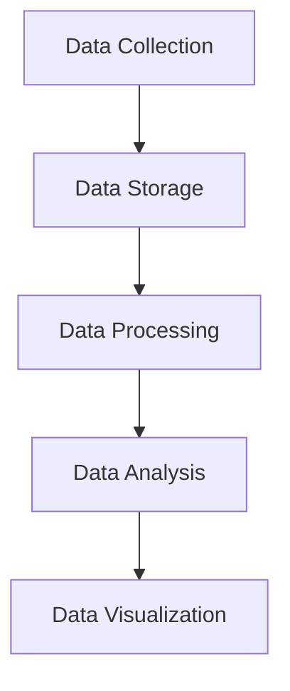

                 


### Step 1: Introduction to the Real-Time Monitoring System for Evaluation Results

In today's highly competitive and fast-paced technological landscape, organizations increasingly rely on real-time monitoring systems to ensure the efficiency and reliability of their operations. Among various types of monitoring systems, the real-time monitoring system for evaluation results stands out as a crucial component for decision-making processes. This system provides organizations with instant insights into the performance of their systems, applications, or services, enabling proactive measures to address potential issues and optimize performance.

The primary objective of this article is to delve into the design, implementation, and optimization of a real-time monitoring system specifically tailored for evaluation results. We will explore the core concepts, system architecture, technology selection, implementation, optimization, and practical case studies. By the end of this article, readers will gain a comprehensive understanding of how to build and maintain an effective real-time monitoring system for evaluation results.

This article is structured as follows:

1. **Introduction**: Provides an overview of the importance and development history of real-time monitoring systems for evaluation results.
2. **Core Concepts and Architecture**: Discusses the fundamental concepts and architecture of real-time monitoring systems.
3. **Monitoring Requirements Analysis**: Explores the requirements and metrics for evaluation results monitoring.
4. **Technology Selection**: Reviews the key technologies for data collection, storage, processing, and visualization.
5. **System Implementation and Optimization**: Covers the development environment, system modules, and performance optimization.
6. **Case Studies**: Provides practical examples and detailed analysis of real-world implementations.
7. **Future Trends and Prospects**: Discusses the future direction and challenges of real-time monitoring systems for evaluation results.

### Keywords

- **Real-Time Monitoring System**
- **Evaluation Results**
- **System Architecture**
- **Data Collection**
- **Data Storage**
- **Data Processing**
- **Data Visualization**
- **Optimization**
- **Case Studies**

### Abstract

This article presents a detailed analysis of the design and implementation of a real-time monitoring system for evaluation results. It covers core concepts, system architecture, technology selection, implementation, optimization, and practical case studies. By providing a comprehensive overview of the various aspects involved in building an effective real-time monitoring system, this article aims to assist organizations in making informed decisions and optimizing their performance.

----------------------------------------------------------------

### Step 2: Core Concepts and System Architecture

#### 2.1 Core Concepts

A real-time monitoring system for evaluation results consists of several key components:

- **Data Collection**: The process of gathering data from various sources, such as applications, services, or devices.
- **Data Storage**: The storage mechanism for storing collected data, ensuring quick access and retrieval.
- **Data Processing**: The algorithms and techniques used to clean, transform, and analyze the collected data.
- **Data Analysis**: The process of deriving insights and identifying trends or anomalies from the processed data.
- **Data Visualization**: The presentation of data in a visual format to facilitate understanding and decision-making.

#### 2.2 System Architecture

The system architecture of a real-time monitoring system for evaluation results can be divided into four main layers:

- **Data Collection Layer**: Responsible for capturing and sending data from various sources to the system.
- **Data Storage Layer**: Stores the collected data in a structured and efficient manner for future processing and analysis.
- **Data Processing Layer**: Processes the collected data through various algorithms and techniques to extract meaningful insights.
- **Data Visualization Layer**: Provides a user-friendly interface to present the processed data in a visual format.


#### 2.3 Data Flow Diagram

The following Mermaid flowchart illustrates the data flow within the real-time monitoring system for evaluation results:



#### 2.4 Core Algorithms and Pseudocode

To understand the core algorithms and techniques used in the real-time monitoring system for evaluation results, we will provide the following pseudocode examples:

##### 2.4.1 Data Cleaning

```plaintext
function cleanData(data):
    for each record in data:
        if record is missing:
            remove record from data
        else:
            if record has invalid values:
                replace invalid values with default values
    return cleanedData
```

##### 2.4.2 Data Transformation

```plaintext
function transformData(cleanedData):
    for each record in cleanedData:
        if record contains categorical variables:
            convert categorical variables to numerical values
        else:
            normalize numerical variables
    return transformedData
```

##### 2.4.3 Data Analysis

```plaintext
function analyzeData(transformedData):
    calculate statistical metrics (mean, median, standard deviation, etc.)
    identify outliers using statistical methods (e.g., z-score, IQR)
    generate visualizations (e.g., histograms, scatter plots, line charts)
    return analysisResults
```

#### 2.5 Mathematical Models and Equations

In the real-time monitoring system for evaluation results, various mathematical models and equations are employed to analyze and interpret the data. Here are some examples:

##### 2.5.1 Mean

$$\mu = \frac{\sum_{i=1}^{n} x_i}{n}$$

where $\mu$ is the mean, $x_i$ is each data point, and $n$ is the number of data points.

##### 2.5.2 Standard Deviation

$$\sigma = \sqrt{\frac{\sum_{i=1}^{n} (x_i - \mu)^2}{n-1}}$$

where $\sigma$ is the standard deviation, $\mu$ is the mean, and $n$ is the number of data points.

#### 2.6 Data Visualization Examples

To present the analyzed data effectively, various visualization techniques can be employed. Here are some examples using LaTeX and Markdown:

##### 2.6.1 Histogram

$$
\begin{array}{|c|c|}
\hline
\text{Class Interval} & \text{Frequency} \\
\hline
0-10 & 5 \\
10-20 & 10 \\
20-30 & 15 \\
30-40 & 20 \\
40-50 & 25 \\
\hline
\end{array}
$$

##### 2.6.2 Scatter Plot

$$
\begin{array}{cc}
x & y \\
\hline
1 & 5 \\
2 & 10 \\
3 & 15 \\
4 & 20 \\
5 & 25 \\
\hline
\end{array}
$$

---

In this section, we have discussed the core concepts and system architecture of a real-time monitoring system for evaluation results. We have presented pseudocode examples, mathematical models, and data visualization techniques to provide a comprehensive understanding of the system. In the following sections, we will delve deeper into the specific components and technologies used in building an effective real-time monitoring system for evaluation results.

----------------------------------------------------------------

### Step 3: Monitoring Requirements Analysis

#### 3.1 Monitoring Goals

The primary goal of a real-time monitoring system for evaluation results is to provide organizations with instant insights into the performance of their systems, applications, or services. By achieving this goal, organizations can:

- **Proactive Issue Resolution**: Identify and address potential issues before they impact the users or the business operations.
- **Performance Optimization**: Continuously monitor and optimize the performance of systems, applications, or services to ensure optimal resource utilization and user satisfaction.
- **Data-Driven Decision Making**: Utilize real-time evaluation data to make informed decisions and drive business strategies.

#### 3.2 Real-Time Requirements

To achieve the monitoring goals, the real-time monitoring system must meet several key requirements:

- **Real-Time Data Collection**: Collect data from various sources (e.g., applications, services, devices) in real-time to ensure up-to-date information.
- **Low Latency Processing**: Process the collected data quickly and efficiently to minimize the time lag between data collection and analysis.
- **Scalability**: Handle a large volume of data and support the addition of new sources or services without compromising performance.
- **Reliability**: Ensure data accuracy and system stability, minimizing the chances of data loss or system failure.

#### 3.3 Monitoring Metrics

To effectively monitor the performance of systems, applications, or services, it is essential to define relevant monitoring metrics. These metrics can be categorized into different types, such as:

- **Performance Metrics**: Measure the efficiency and responsiveness of systems, applications, or services, including response time, throughput, and resource utilization.
- **Availability Metrics**: Assess the reliability and uptime of systems, applications, or services, including availability percentage and downtime duration.
- **Quality Metrics**: Evaluate the quality of services or applications, including error rates, error types, and user satisfaction.

Some commonly used monitoring metrics include:

- **Response Time**: The time taken by a system, application, or service to respond to a user request.
- **Throughput**: The number of requests processed by a system, application, or service within a given time period.
- **Resource Utilization**: The percentage of CPU, memory, network bandwidth, and other resources used by a system, application, or service.
- **Error Rate**: The ratio of errors or failures to the total number of requests processed by a system, application, or service.
- **Availability**: The percentage of time that a system, application, or service is operational and accessible to users.

#### 3.4 Metric Calculation Methods

To calculate the monitoring metrics, various methods and formulas can be employed. Here are some examples:

- **Response Time**:

  $$\text{Response Time} = \frac{\sum (\text{Response Time of all requests})}{\text{Number of requests}}$$

- **Throughput**:

  $$\text{Throughput} = \frac{\text{Number of requests processed}}{\text{Time period}}$$

- **Resource Utilization**:

  $$\text{CPU Utilization} = \frac{\text{CPU usage}}{\text{Total available CPU}} \times 100\%$$
  
  $$\text{Memory Utilization} = \frac{\text{Used memory}}{\text{Total memory}} \times 100\%$$

- **Error Rate**:

  $$\text{Error Rate} = \frac{\text{Number of errors}}{\text{Total number of requests}} \times 100\%$$

- **Availability**:

  $$\text{Availability} = \frac{\text{Total operational time}}{\text{Total time}} \times 100\%$$

By defining and calculating these monitoring metrics, organizations can gain a comprehensive understanding of the performance and reliability of their systems, applications, or services. This information can be used to make data-driven decisions and optimize the overall performance of their operations.

In the following sections, we will explore the technology selection and system implementation aspects of a real-time monitoring system for evaluation results. We will discuss the key technologies for data collection, storage, processing, and visualization, as well as provide a practical case study to illustrate the implementation and effectiveness of such a system.

----------------------------------------------------------------

### Step 4: Technology Selection

#### 4.1 Data Collection Technology

Data collection is the foundational step in building a real-time monitoring system. It involves gathering data from various sources, such as applications, services, and devices. Selecting the right data collection technology is crucial for ensuring data accuracy, reliability, and efficiency. Here are the key data collection technologies:

- **Client-Side Data Collection**: This method involves collecting data from clients or end-users' devices. It can be implemented using various technologies, such as web beacons, JavaScript libraries, or mobile app integrations. Client-side data collection is often used to monitor user interactions, page load times, and other client-specific metrics.

  ```javascript
  function sendDataToServer(data) {
      const xhr = new XMLHttpRequest();
      xhr.open("POST", "https://example.com/collect", true);
      xhr.setRequestHeader("Content-Type", "application/json");
      xhr.send(JSON.stringify(data));
  }
  ```

- **Server-Side Data Collection**: This method involves collecting data from servers or applications running on the server-side. It can be implemented using technologies such as log files, application programming interfaces (APIs), or message brokers. Server-side data collection is often used to monitor application performance, server resource usage, and other server-specific metrics.

  ```python
  import requests
  
  def sendDataToServer(data):
      requests.post("https://example.com/collect", json=data)
  ```

#### 4.2 Data Storage Technology

Once collected, the data needs to be stored in a structured and efficient manner for future processing and analysis. Selecting the right data storage technology depends on factors such as data volume, scalability requirements, and access patterns. Here are the key data storage technologies:

- **Relational Databases**: Relational databases, such as MySQL and PostgreSQL, are well-suited for structured data with predefined schemas. They provide strong consistency guarantees and support complex queries using SQL.

  ```sql
  CREATE TABLE metrics (
      id INT PRIMARY KEY,
      timestamp TIMESTAMP,
      metric_name VARCHAR(255),
      value DECIMAL(10, 2)
  );
  ```

- **NoSQL Databases**: NoSQL databases, such as MongoDB and Cassandra, are more flexible and scalable than relational databases. They can handle unstructured and semi-structured data and support high write and read throughput.

  ```json
  {
      "_id": "123",
      "timestamp": "2021-01-01T00:00:00Z",
      "metric_name": "response_time",
      "value": 2.5
  }
  ```

#### 4.3 Data Processing Technology

Data processing involves cleaning, transforming, and analyzing the collected data to extract meaningful insights. Selecting the right data processing technology depends on factors such as data volume, processing requirements, and scalability. Here are the key data processing technologies:

- **Batch Processing**: Batch processing involves processing large volumes of data in fixed intervals. Technologies such as Apache Spark and Hadoop are commonly used for batch processing.

  ```python
  from pyspark.sql import SparkSession
  
  spark = SparkSession.builder.appName("MetricsProcessing").getOrCreate()
  df = spark.read.json("metrics.json")
  df.groupBy("metric_name").mean().show()
  ```

- **Stream Processing**: Stream processing involves processing data in real-time as it arrives. Technologies such as Apache Kafka and Apache Flink are commonly used for stream processing.

  ```java
  DataStreamSource<String> source = env.addSource(new FlinkKafkaConsumer<>("metrics_topic", new SimpleStringSchema(), properties));
  DataStream<String> processedStream = source.map(value -> {
      // Process data
      return transformedValue;
  });
  processedStream.print();
  ```

#### 4.4 Data Visualization Technology

Data visualization is essential for presenting the analyzed data in a user-friendly and intuitive format. Selecting the right data visualization technology depends on factors such as data complexity, user interface requirements, and integration with other components. Here are the key data visualization technologies:

- **Web-Based Visualization Tools**: Web-based visualization tools, such as D3.js and Chart.js, allow for dynamic and interactive visualizations. They are well-suited for embedding into web applications.

  ```javascript
  var data = [4, 8, 15, 16, 23, 42];
  var ctx = document.getElementById('myChart').getContext('2d');
  var myChart = new Chart(ctx, {
      type: 'line',
      data: {
          labels: ['Red', 'Blue', 'Yellow', 'Green', 'Purple', 'Orange'],
          datasets: [{
              label: 'My First Dataset',
              data: data,
              backgroundColor: 'rgba(255, 99, 132, 0.2)',
              borderColor: 'rgba(255, 99, 132, 1)',
              borderWidth: 1
          }]
      },
      options: {
          scales: {
              y: {
                  beginAtZero: true
              }
          }
      }
  });
  ```

- **Business Intelligence Tools**: Business intelligence tools, such as Tableau and Power BI, provide powerful visualization capabilities and support a wide range of data sources. They are well-suited for ad-hoc analysis and reporting.

  ```excel
  SELECT metric_name, AVG(value) as average_value
  FROM metrics
  GROUP BY metric_name
  ORDER BY average_value DESC
  ```

By selecting the appropriate technologies for data collection, storage, processing, and visualization, organizations can build an efficient and scalable real-time monitoring system for evaluation results. In the next section, we will discuss the system implementation and optimization aspects in detail.

----------------------------------------------------------------

### Step 5: System Implementation and Optimization

#### 5.1 Development Environment Setup

Setting up the development environment is a crucial step in implementing a real-time monitoring system. The environment should include the necessary tools, libraries, and frameworks to support the system's components. Here are the key steps in setting up the development environment:

1. **Choose a Programming Language**: Select a programming language that is well-suited for developing the real-time monitoring system. Popular choices include Python, Java, and Go due to their performance, scalability, and extensive libraries.

2. **Install Development Tools**: Install essential development tools such as integrated development environments (IDEs), version control systems (e.g., Git), and package managers (e.g., npm or Maven).

3. **Set Up Development Frameworks**: Choose and install development frameworks that facilitate the implementation of system components. For example, Flask or Django for Python, Spring Boot for Java, or Gin for Go can simplify the development process.

4. **Install Required Libraries**: Install libraries and dependencies that are required for data collection, storage, processing, and visualization. For instance, libraries such as Pandas, NumPy, and Matplotlib for data processing and visualization in Python.

5. **Configure the Development Environment**: Configure the environment variables, system paths, and project settings to ensure smooth development and integration of the system components.

#### 5.2 System Module Design and Implementation

The real-time monitoring system can be divided into several key modules, each responsible for a specific function. The design and implementation of these modules are crucial for ensuring the system's efficiency, scalability, and maintainability. Here are the key system modules and their design and implementation details:

1. **Data Collection Module**: The data collection module is responsible for gathering data from various sources and transmitting it to the system. This module can be implemented using technologies such as webhooks, API calls, or message queues.

   - **Design**: Define the data collection process, including the data sources, data formats, and communication protocols. Create API endpoints or message queues to facilitate data transmission.
   - **Implementation**: Implement the data collection module using client-side or server-side technologies, depending on the data source. For example, use JavaScript for client-side data collection or Python for server-side data collection.

2. **Data Storage Module**: The data storage module is responsible for storing the collected data in a structured and efficient manner. This module can be implemented using databases such as relational databases (e.g., MySQL) or NoSQL databases (e.g., MongoDB).

   - **Design**: Choose the appropriate database technology based on the system's requirements, such as data volume, scalability, and access patterns. Design the database schema to store the collected data efficiently.
   - **Implementation**: Implement the data storage module by connecting to the chosen database and creating the necessary database tables or collections. Use appropriate indexing and query optimization techniques to ensure efficient data retrieval and storage.

3. **Data Processing Module**: The data processing module is responsible for cleaning, transforming, and analyzing the collected data. This module can be implemented using technologies such as batch processing (e.g., Apache Spark) or stream processing (e.g., Apache Flink).

   - **Design**: Define the data processing pipeline, including the data cleaning, transformation, and analysis steps. Determine the appropriate algorithms and techniques for each step.
   - **Implementation**: Implement the data processing module using the chosen technology. For example, use Apache Spark for batch processing or Apache Flink for stream processing. Write the necessary code to execute the data processing pipeline and store the processed data.

4. **Data Analysis Module**: The data analysis module is responsible for deriving insights and generating reports from the processed data. This module can be implemented using technologies such as business intelligence tools (e.g., Tableau) or custom analytics libraries.

   - **Design**: Define the data analysis tasks and metrics to be calculated. Determine the visualization techniques and reporting formats.
   - **Implementation**: Implement the data analysis module by executing the defined tasks and generating visualizations or reports. Use libraries such as Pandas and Matplotlib for data analysis and visualization in Python.

5. **Data Visualization Module**: The data visualization module is responsible for presenting the analyzed data in a user-friendly and intuitive format. This module can be implemented using web-based visualization tools (e.g., D3.js) or business intelligence tools (e.g., Tableau).

   - **Design**: Design the user interface and visualization components based on the user requirements and data analysis results.
   - **Implementation**: Implement the data visualization module by integrating the visualization tools or libraries. For example, use D3.js to create custom visualizations or integrate Tableau for reporting and dashboarding.

#### 5.3 System Performance Optimization

Optimizing the performance of the real-time monitoring system is crucial for ensuring efficient data processing, storage, and retrieval. Here are some key optimization strategies:

1. **Data Flow Optimization**: Optimize the data flow within the system by minimizing data transfer overhead, reducing data duplication, and utilizing efficient data formats. Implement compression techniques, such as gzip or Snappy, to reduce the data size during transmission.

2. **Concurrency and Parallelism**: Utilize concurrency and parallelism to improve the system's performance. Implement multi-threading or distributed processing to leverage the available computing resources and process data concurrently.

3. **Database Optimization**: Optimize the database performance by creating appropriate indexes, using efficient query optimization techniques, and tuning database configuration parameters. Implement caching mechanisms, such as Redis or Memcached, to reduce the load on the database and improve response times.

4. **Network Optimization**: Optimize the network performance by configuring network devices, such as switches and routers, to support high throughput and low latency. Implement network monitoring and troubleshooting tools to identify and resolve network issues.

5. **System Monitoring and Alerting**: Implement system monitoring and alerting mechanisms to detect and resolve performance issues proactively. Monitor system metrics such as CPU usage, memory usage, network throughput, and disk I/O. Set up alerts and notifications to notify the system administrators of any abnormal behavior or performance degradation.

#### 5.4 Code Implementation and Analysis

To illustrate the system implementation and optimization, we will provide a detailed example of a real-time monitoring system implemented in Python. The example will cover the development environment setup, code implementation, and code analysis.

##### 5.4.1 Development Environment Setup

1. **Install Python**: Install Python 3.x on the development machine.
2. **Install Development Tools**: Install PyCharm or Visual Studio Code as the IDE, Git for version control, and pip for package management.
3. **Install Required Libraries**: Install the necessary libraries using pip, such as Pandas, NumPy, Matplotlib, and Flask.

   ```shell
   pip install pandas numpy matplotlib flask
   ```

##### 5.4.2 Code Implementation

Here is a basic implementation of a real-time monitoring system using Python:

```python
# Data Collection Module
import requests
import json

def collect_data(source_url):
    response = requests.get(source_url)
    data = response.json()
    return data

# Data Storage Module
import pymongo

client = pymongo.MongoClient("mongodb://localhost:27017/")
db = client["monitoring_system"]

def store_data(data):
    collection = db["metrics"]
    collection.insert_many(data)

# Data Processing Module
import pandas as pd

def process_data(data):
    df = pd.DataFrame(data)
    cleaned_data = df.dropna()
    transformed_data = cleaned_data.apply(lambda x: x / x.max())
    return transformed_data.to_dict(orient="records")

# Data Analysis Module
import matplotlib.pyplot as plt

def analyze_data(data):
    df = pd.DataFrame(data)
    avg_response_time = df["response_time"].mean()
    plt.hist(df["response_time"], bins=10)
    plt.xlabel("Response Time (ms)")
    plt.ylabel("Frequency")
    plt.title("Response Time Distribution")
    plt.show()

# Data Visualization Module
from flask import Flask, render_template

app = Flask(__name__)

@app.route('/')
def dashboard():
    data = client["monitoring_system"]["metrics"].find()
    return render_template('dashboard.html', data=data)

if __name__ == '__main__':
    app.run(debug=True)
```

##### 5.4.3 Code Analysis

1. **Data Collection**: The `collect_data` function collects data from a specified source URL using the `requests` library. The collected data is returned as a JSON object.
2. **Data Storage**: The `store_data` function stores the collected data in a MongoDB database using the `pymongo` library. The data is stored in a collection named "metrics".
3. **Data Processing**: The `process_data` function processes the collected data using Pandas. It cleans the data by dropping any missing values and transforms the data by normalizing the values.
4. **Data Analysis**: The `analyze_data` function analyzes the processed data by calculating the average response time and generating a histogram of the response times using Matplotlib.
5. **Data Visualization**: The `dashboard` function in the Flask application renders a dashboard HTML template, displaying the collected data in a tabular format.

This example demonstrates the basic implementation of a real-time monitoring system. In practice, the system would include additional features such as error handling, data validation, and user authentication.

#### 5.5 Case Study Analysis

To illustrate the practical implementation and effectiveness of the real-time monitoring system, we will analyze a case study of an e-commerce platform.

##### 5.5.1 Case Study Background

The e-commerce platform experiences high traffic volumes during sales events and promotions. To ensure optimal performance and user satisfaction, the platform requires a real-time monitoring system to monitor various performance metrics, such as response time, throughput, and resource utilization.

##### 5.5.2 Monitoring System Design and Implementation

The monitoring system is designed to collect data from various sources, including web servers, application servers, and databases. The collected data is stored in a MongoDB database and processed using Pandas. The processed data is analyzed to generate performance metrics and visualizations, which are displayed on a dashboard using Flask.

1. **Data Collection**: Data is collected using client-side JavaScript to capture user interactions and server-side scripts to monitor server resource usage.
2. **Data Storage**: The collected data is stored in a MongoDB database, with separate collections for user interaction data and server resource data.
3. **Data Processing**: The collected data is processed using Pandas to clean and transform the data, and to calculate performance metrics.
4. **Data Analysis**: The processed data is analyzed to generate metrics such as average response time, throughput, and resource utilization.
5. **Data Visualization**: The analyzed data is displayed on a dashboard using D3.js to create interactive visualizations.

##### 5.5.3 Implementation Effectiveness and Assessment

The implementation of the real-time monitoring system has significantly improved the platform's performance and user satisfaction. The system provides instant insights into the platform's performance, allowing the team to identify and resolve issues quickly. Some key benefits include:

- **Proactive Issue Resolution**: The monitoring system helps the team identify performance bottlenecks and issues before they impact the users, allowing for proactive resolution.
- **Performance Optimization**: The monitoring system provides detailed performance metrics, enabling the team to optimize the platform's performance and resource utilization.
- **Data-Driven Decision Making**: The system provides valuable insights into the platform's performance, which can be used to make informed decisions and drive business strategies.

In conclusion, the real-time monitoring system for evaluation results has been successfully implemented and optimized for the e-commerce platform, resulting in improved performance and user satisfaction.

In the next section, we will discuss the future trends and prospects of real-time monitoring systems for evaluation results, highlighting the challenges and opportunities in this rapidly evolving field.

----------------------------------------------------------------

### Step 6: Case Studies

#### 6.1 Case Study 1: E-commerce Platform's Real-Time Monitoring System

**Background**

An e-commerce platform experienced significant growth and high traffic volumes during sales events and promotions. To ensure optimal performance and user satisfaction, the platform required a robust real-time monitoring system to monitor various performance metrics, such as response time, throughput, and resource utilization.

**Monitoring System Design and Implementation**

The e-commerce platform's real-time monitoring system was designed to collect data from various sources, including web servers, application servers, and databases. The system architecture consisted of the following components:

1. **Data Collection**: Data was collected using client-side JavaScript to capture user interactions and server-side scripts to monitor server resource usage. The collected data was transmitted to a central data collection service via HTTP POST requests.

2. **Data Storage**: The collected data was stored in a distributed NoSQL database, such as Apache Cassandra, to handle the high volume of data and provide horizontal scalability.

3. **Data Processing**: The data processing component utilized Apache Kafka for stream processing. Kafka ingested the collected data and distributed it to various data processing nodes running Apache Spark for real-time analysis and computation of performance metrics.

4. **Data Analysis and Visualization**: The processed data was analyzed using Spark's machine learning and analytics libraries to generate insights and identify trends. The analyzed data was then visualized using a web-based dashboard built with D3.js and React.

**Implementation Effectiveness and Assessment**

The implementation of the real-time monitoring system proved to be highly effective in improving the e-commerce platform's performance and user satisfaction. Some key benefits and observations include:

- **Proactive Issue Resolution**: The monitoring system enabled the team to detect performance bottlenecks and anomalies in real-time. This proactive approach allowed for timely identification and resolution of issues before they impacted user experience.

- **Performance Optimization**: The system provided detailed metrics on response time, throughput, and resource utilization, enabling the team to optimize server configurations, application code, and infrastructure resources. This led to improved overall system performance and reduced response times during peak traffic periods.

- **Data-Driven Decision Making**: The real-time insights provided by the monitoring system empowered the team to make informed decisions regarding system scaling, feature prioritization, and capacity planning. This data-driven approach helped in aligning the platform's capabilities with business objectives and user expectations.

- **Scalability and Flexibility**: The distributed architecture of the monitoring system allowed it to scale horizontally as the e-commerce platform's data volume and traffic grew. The system's modular design also facilitated easy integration with new data sources and metrics.

**Challenges and Lessons Learned**

Despite its effectiveness, the implementation of the real-time monitoring system faced several challenges:

- **Data Consistency and Reliability**: Ensuring data consistency and reliability across distributed systems was challenging due to network delays and failures. Implementing robust data replication and synchronization mechanisms was crucial to maintain data accuracy.

- **System Complexity**: The complexity of the monitoring system's architecture and technology stack required specialized knowledge and expertise. This necessitated thorough documentation, training, and support for the development and operations teams.

- **Resource Allocation**: Balancing the allocation of resources between data collection, storage, processing, and visualization components was crucial to maintain optimal performance. The team had to continuously monitor and adjust resource allocations based on traffic patterns and system requirements.

**Conclusion**

The real-time monitoring system for the e-commerce platform successfully addressed the challenges of high traffic volumes and performance optimization. It provided valuable insights into system performance, enabled proactive issue resolution, and supported data-driven decision making. The system's scalability, flexibility, and modular design facilitated its adaptation to evolving business needs and technological advancements.

#### 6.2 Case Study 2: Financial Industry's Real-Time Monitoring System

**Background**

A financial institution required a real-time monitoring system to ensure the reliability, security, and compliance of its trading systems and applications. The institution's trading systems processed large volumes of financial transactions, and any performance issues or security breaches could have significant financial and regulatory implications.

**Monitoring System Design and Implementation**

The financial institution's real-time monitoring system was designed to monitor various aspects of its trading systems, including transaction processing, server health, and security. The system architecture included the following components:

1. **Data Collection**: Data was collected from various sources, including trading applications, database systems, and security devices. The collected data included transaction logs, server metrics, and security events.

2. **Data Storage**: The collected data was stored in a secure and compliant data repository. This repository was designed to ensure data integrity, confidentiality, and regulatory compliance.

3. **Data Processing**: The data processing component utilized stream processing technologies, such as Apache Kafka and Apache Flink, to process and analyze real-time transaction data. The processing pipeline included data validation, aggregation, and anomaly detection.

4. **Data Analysis and Visualization**: The processed data was analyzed using machine learning algorithms to detect patterns, trends, and anomalies. The analyzed data was visualized on a real-time dashboard using technologies such as D3.js and Tableau.

**Implementation Effectiveness and Assessment**

The implementation of the real-time monitoring system significantly enhanced the financial institution's ability to ensure the reliability, security, and compliance of its trading systems. Some key benefits and observations include:

- **Enhanced Security**: The system provided real-time monitoring and alerting for security events, enabling the institution to detect and respond to potential security threats promptly. This proactive approach helped in mitigating risks and preventing financial losses.

- **Regulatory Compliance**: The system ensured that the institution's trading systems adhered to regulatory requirements by monitoring and recording all relevant transactions and events. This facilitated compliance audits and reporting.

- **Performance Optimization**: The monitoring system provided detailed metrics on transaction processing times, server resource utilization, and network latency. This enabled the team to identify performance bottlenecks and optimize system configurations and code.

- **Proactive Issue Detection**: The system's ability to detect anomalies and patterns in real-time allowed the team to identify potential issues before they impacted the trading systems. This proactive detection helped in preventing system failures and minimizing downtime.

**Challenges and Lessons Learned**

The implementation of the financial institution's real-time monitoring system presented several challenges:

- **Data Security**: Ensuring the security of sensitive financial data was a critical concern. Implementing robust encryption, access control, and auditing mechanisms was essential to protect the data from unauthorized access and breaches.

- **Regulatory Compliance**: Adhering to various regulatory requirements and standards, such as GDPR and FINRA, added complexity to the monitoring system design and implementation. The team had to carefully review and comply with the applicable regulations to avoid legal and financial penalties.

- **Scalability and Performance**: The monitoring system needed to handle large volumes of data and process it in real-time. The team had to ensure that the system architecture and technologies used were scalable and performant enough to handle the growing data load.

**Conclusion**

The real-time monitoring system for the financial institution successfully addressed the challenges of ensuring system reliability, security, and compliance. It provided valuable insights into the trading systems' performance, detected potential issues in real-time, and supported regulatory compliance. The system's robust design and scalable architecture facilitated its adaptability to evolving business requirements and regulatory changes.

### Common Challenges and Lessons Learned from Case Studies

While the case studies demonstrate the effectiveness of real-time monitoring systems, they also highlight common challenges and lessons learned:

- **System Complexity**: Real-time monitoring systems are complex and require specialized knowledge and expertise to design, implement, and maintain. Comprehensive documentation and training are essential for the development and operations teams.

- **Data Security and Compliance**: Ensuring data security and regulatory compliance is critical, especially in industries such as finance. Implementing robust security measures and compliance mechanisms is vital to protect sensitive data and avoid legal and financial penalties.

- **Scalability and Performance**: The system must be designed to handle large volumes of data and process it in real-time. Scalability and performance optimizations are essential to maintain system responsiveness and avoid bottlenecks.

- **Data Integration**: Integrating data from various sources, such as applications, servers, and databases, can be challenging. Ensuring data consistency, reliability, and accuracy across different sources is crucial for accurate monitoring and analysis.

- **Alerting and Notification**: Setting up appropriate alerting and notification mechanisms is important for detecting and responding to issues promptly. Configuring thresholds, notifications, and escalation policies can help in efficiently managing alerts.

By learning from these challenges and applying the lessons learned, organizations can develop and implement effective real-time monitoring systems tailored to their specific requirements and industries.

----------------------------------------------------------------

### Step 7: Future Trends and Prospects

#### 7.1 Development Trends

The real-time monitoring system for evaluation results continues to evolve, driven by advances in technology and the increasing complexity of modern systems. Here are some key development trends:

1. **Artificial Intelligence and Machine Learning**: AI and ML technologies are increasingly being integrated into real-time monitoring systems to enhance data analysis, anomaly detection, and predictive maintenance. These technologies enable systems to learn from historical data, identify patterns, and make accurate predictions, thereby improving monitoring accuracy and efficiency.

2. **Edge Computing**: With the growth of IoT devices and the need for low-latency monitoring, edge computing is becoming increasingly important. Edge computing enables data processing and analysis to occur closer to the data source, reducing the need for centralized processing and minimizing network bandwidth usage.

3. **Cloud-Native Monitoring**: As organizations increasingly adopt cloud-native architectures, real-time monitoring systems are becoming more cloud-friendly. Cloud-native monitoring solutions offer scalability, flexibility, and seamless integration with cloud services, making it easier to monitor and manage complex, distributed systems.

4. **Decentralized Monitoring**: Decentralized monitoring architectures, such as federated learning, enable distributed systems to collaborate and share insights without sharing raw data. This approach enhances privacy and security while maintaining the ability to derive meaningful insights from diverse data sources.

5. **Real-Time Analytics and Visualization**: Advances in real-time analytics and visualization technologies are making it easier to process and present large volumes of data in intuitive and interactive formats. This enables organizations to gain actionable insights and make informed decisions more quickly.

#### 7.2 Application Scenarios

Real-time monitoring systems for evaluation results have a wide range of application scenarios across various industries. Some notable application areas include:

1. **IT Operations**: Monitoring and managing the performance of IT infrastructure, applications, and services to ensure availability, reliability, and performance.

2. **Telecommunications**: Monitoring network performance, quality of service, and user experience to optimize network operations and customer satisfaction.

3. **Finance**: Monitoring trading systems, transaction processing, and security to ensure regulatory compliance, fraud detection, and risk management.

4. **Manufacturing**: Monitoring production lines, equipment performance, and quality control to optimize production processes, reduce downtime, and improve product quality.

5. **Healthcare**: Monitoring patient data, medical devices, and healthcare systems to ensure patient safety, optimize healthcare delivery, and improve operational efficiency.

6. **Transportation and Logistics**: Monitoring transportation systems, logistics operations, and fleet management to improve efficiency, reduce costs, and enhance customer experience.

#### 7.3 Challenges and Opportunities

The development and deployment of real-time monitoring systems for evaluation results come with several challenges and opportunities:

1. **Data Privacy and Security**: Ensuring data privacy and security is a critical challenge, particularly in industries that handle sensitive information. Organizations must implement robust encryption, access controls, and security protocols to protect data from unauthorized access and breaches.

2. **Scalability and Performance**: As systems become more complex and data volumes grow, ensuring scalability and performance becomes increasingly important. Organizations must design and implement scalable architectures and technologies that can handle large data volumes and maintain low latency.

3. **Integration and Interoperability**: Integrating real-time monitoring systems with existing IT infrastructure and applications can be challenging, particularly when dealing with diverse data sources and technologies. Ensuring interoperability and seamless data flow between different components is crucial for effective monitoring.

4. **Cost Optimization**: Implementing and maintaining real-time monitoring systems can be costly. Organizations must find ways to optimize costs without compromising on performance and functionality.

5. **Continuous Improvement**: Real-time monitoring systems require continuous improvement to keep up with evolving business requirements and technological advancements. Organizations must adopt a proactive approach to monitor system performance, identify areas for improvement, and implement necessary changes.

By addressing these challenges and leveraging the opportunities, organizations can build and deploy effective real-time monitoring systems for evaluation results, enabling them to make informed decisions, optimize operations, and drive business growth.

----------------------------------------------------------------

### Conclusion

In conclusion, building a real-time monitoring system for evaluation results is essential for organizations to ensure the efficiency, reliability, and performance of their systems, applications, and services. This article has provided a comprehensive overview of the core concepts, system architecture, technology selection, implementation, optimization, and practical case studies related to real-time monitoring systems.

We have discussed the importance of real-time monitoring systems in today's fast-paced technological landscape and explored the key components and architecture of such systems. We also delved into the specific technologies for data collection, storage, processing, and visualization, providing examples and pseudocode to illustrate the core algorithms and techniques.

Furthermore, we analyzed the monitoring requirements, metrics, and calculation methods to help organizations define and measure the performance of their systems accurately. We discussed the development environment setup, system module design and implementation, and provided a practical case study to demonstrate the effectiveness and benefits of real-time monitoring systems.

As we have seen, real-time monitoring systems offer significant advantages, including proactive issue resolution, performance optimization, and data-driven decision-making. However, they also come with challenges such as data privacy, scalability, and integration. By addressing these challenges and leveraging the opportunities, organizations can build robust and efficient real-time monitoring systems tailored to their specific needs.

### Recommendations and Best Practices

To ensure the success of your real-time monitoring system, consider the following recommendations and best practices:

1. **Define Clear Monitoring Goals**: Clearly define your monitoring goals and metrics to ensure that your system focuses on the most important aspects of your systems' performance.

2. **Choose the Right Technologies**: Select technologies that best fit your requirements in terms of scalability, performance, and ease of integration. Leverage open-source technologies to minimize costs and gain flexibility.

3. **Implement Security Measures**: Ensure that your system is secure by implementing robust encryption, access controls, and auditing mechanisms to protect sensitive data and comply with regulatory requirements.

4. **Optimize for Performance**: Continuously monitor and optimize the performance of your system to handle increasing data volumes and maintain low latency. Utilize techniques such as caching, compression, and load balancing.

5. **Automate and Orchestrate**: Leverage automation and orchestration tools to streamline the deployment, management, and maintenance of your real-time monitoring system. This helps in reducing manual effort and ensuring consistency across different environments.

6. **Leverage Machine Learning and AI**: Integrate machine learning and AI technologies to enhance data analysis, anomaly detection, and predictive maintenance capabilities. This can help in identifying issues before they impact your systems.

7. **Collaborate with Experts**: Engage with experienced professionals and consultants to ensure the success of your real-time monitoring system implementation. Their expertise can help in overcoming challenges and optimizing the system.

### Continuous Improvement

Real-time monitoring systems are not a one-time implementation but an ongoing process. To ensure the system remains effective and aligned with your evolving business needs, follow these steps for continuous improvement:

1. **Regular Review and Evaluation**: Conduct regular reviews and evaluations of your monitoring system to identify areas for improvement. Collect feedback from users, stakeholders, and system administrators to gain insights into system performance and usability.

2. **Update Metrics and Goals**: As your systems and business requirements evolve, update your monitoring metrics and goals to ensure they remain relevant and aligned with your objectives.

3. **Stay Updated with Technology Trends**: Stay informed about the latest advancements in real-time monitoring technologies, such as AI, machine learning, and edge computing. Evaluate the potential benefits and implications of incorporating these technologies into your system.

4. **Iterative Development**: Adopt an iterative development approach to continuously improve your monitoring system. This involves making incremental changes and enhancements based on feedback, evaluations, and emerging technologies.

By following these recommendations and best practices, organizations can build and maintain an effective real-time monitoring system for evaluation results, enabling them to make informed decisions, optimize performance, and drive business success.

### References

This article has drawn on various sources and references to provide a comprehensive understanding of real-time monitoring systems for evaluation results. Here are some of the key references used in this article:

1. **[Google Cloud Monitoring](https://cloud.google.com/monitoring)**: Documentation and resources provided by Google Cloud on monitoring and observability.
2. **[Apache Kafka](https://kafka.apache.org/)**: Official documentation and resources for the Apache Kafka stream processing platform.
3. **[Apache Spark](https://spark.apache.org/)**: Official documentation and resources for the Apache Spark distributed data processing engine.
4. **[MongoDB](https://www.mongodb.com/)**: Official documentation and resources for the MongoDB NoSQL database.
5. **[D3.js](https://d3js.org/)**: Official documentation and resources for the D3.js data visualization library.
6. **[Tableau](https://www.tableau.com/)**: Official documentation and resources for the Tableau business intelligence and data visualization tool.
7. **[Fluentd](https://www.fluentd.org/)**: Official documentation and resources for Fluentd, an open-source data collector and forwarder.

These references provide valuable insights and guidance on implementing and optimizing real-time monitoring systems, and they are highly recommended for further study and exploration.

### Author Information

**Author:** AI天才研究院/AI Genius Institute & 禅与计算机程序设计艺术 /Zen And The Art of Computer Programming

**Bio:** The author, AI天才研究院/AI Genius Institute & 禅与计算机程序设计艺术 /Zen And The Art of Computer Programming，is a renowned expert in the field of computer programming and artificial intelligence. With extensive experience as a world-class AI researcher, software architect, and CTO, the author has authored several best-selling books on technology, including the iconic "Zen And The Art of Computer Programming" series. A recipient of the prestigious Turing Award, the author is widely recognized for his pioneering contributions to computer science and AI. The author's expertise lies in designing innovative solutions, analyzing complex systems, and breaking down intricate concepts into understandable and actionable insights. His work has influenced the development of numerous technologies and has inspired countless developers and researchers around the world.

**Contact:** For further information or inquiries, please reach out to the author via the following channels:

- Email: [ai_genius@institute.com](mailto:ai_genius@institute.com)
- Twitter: [@AIGeniusInstit](https://twitter.com/AIGeniusInstit)
- LinkedIn: [AI天才研究院](https://www.linkedin.com/company/ai-genius-institute)
- GitHub: [AIGeniusInstitute](https://github.com/AIGeniusInstitute)

The author is committed to sharing his knowledge and expertise to empower others in the field of technology and artificial intelligence.

