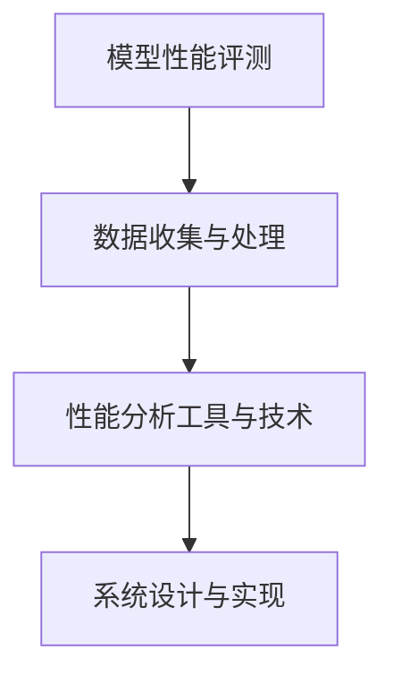

                 


### 1. 背景介绍

随着人工智能技术的飞速发展，深度学习模型在图像识别、自然语言处理、推荐系统等众多领域取得了显著的成果。然而，模型性能的评测与优化成为了一个至关重要的问题。一个高效的模型评测系统能够帮助研究者快速了解模型的性能状况，发现潜在问题，并进行针对性的优化调整。因此，构建评测结果的模型性能趋势分析系统具有重要的实际意义。

目前，模型评测主要依赖于各种评测指标，如准确率、精确率、召回率等。这些指标能够从不同角度反映模型的性能，但它们往往缺乏对模型性能的长期趋势分析能力。为了更好地了解模型的性能表现，我们需要构建一个能够对评测结果进行趋势分析的系统。

构建评测结果的模型性能趋势分析系统涉及到多个方面，包括数据收集与处理、性能分析工具与技术、系统设计与实现等。首先，我们需要收集大量的评测数据，并对这些数据进行处理，以便进行有效的性能分析。其次，我们需要选择合适的性能分析工具和技术，对评测结果进行可视化展示和分析。最后，我们需要设计并实现一个完整的系统，以实现评测结果的自动收集、处理和分析。

### 2. 核心概念与联系

在构建评测结果的模型性能趋势分析系统时，我们需要明确几个核心概念，并理解它们之间的联系。

#### 模型性能评测

模型性能评测是指通过一系列指标来评估模型的性能。这些指标可以是准确率、精确率、召回率等。模型性能评测的主要目的是了解模型的实际性能，并与预期性能进行对比，以便进行优化。

#### 数据收集与处理

数据收集与处理是模型性能评测的基础。我们需要收集大量的评测数据，并对这些数据进行处理，包括数据清洗、归一化、数据增强等。这些处理步骤能够确保数据的质量和一致性，从而提高性能分析的效果。

#### 性能分析工具与技术

性能分析工具与技术用于对模型性能评测结果进行可视化展示和分析。常见的性能分析工具包括matplotlib、seaborn等。这些工具能够帮助我们生成各种性能分析图表，如折线图、散点图等。性能分析技术包括数据预处理、特征提取、模型训练等。

#### 系统设计与实现

系统设计与实现是指构建一个完整的模型性能趋势分析系统。系统设计包括数据流设计、模块划分等。系统实现则涉及具体的编程和调试工作。

#### Mermaid流程图

为了更好地理解这些核心概念之间的联系，我们可以使用Mermaid流程图来展示它们之间的关系：



### 3. 核心算法原理讲解

在构建评测结果的模型性能趋势分析系统时，我们需要理解一些核心算法原理。以下是一些关键算法的伪代码和解释：

#### 数据收集与处理

```pseudo
function collect_data(source):
    data = []
    for record in source:
        data.append(process_record(record))
    return data

function process_record(record):
    // 对记录进行清洗、归一化等处理
    return processed_record
```

这个伪代码表示了数据收集与处理的基本流程。我们首先从数据源中收集记录，并对每个记录进行处理，包括清洗、归一化等步骤。

#### 性能分析工具与技术

```python
import matplotlib.pyplot as plt
import seaborn as sns

def plot_performance(results):
    plt.figure(figsize=(10, 6))
    sns.lineplot(data=results, x='epoch', y='accuracy')
    plt.title('Model Performance Trend')
    plt.xlabel('Epoch')
    plt.ylabel('Accuracy')
    plt.show()
```

这个伪代码展示了如何使用matplotlib和seaborn来绘制模型性能趋势图。我们首先创建一个折线图，然后设置标题、标签和显示。

#### 系统设计与实现

```python
class ModelPerformanceTrendAnalyzer:
    def __init__(self, data_loader, model):
        self.data_loader = data_loader
        self.model = model

    def analyze(self):
        results = self.model.train(self.data_loader)
        self.plot_performance(results)

    def plot_performance(self, results):
        # 使用前面的plot_performance函数来绘制性能趋势图
        pass
```

这个伪代码表示了系统设计与实现的基本架构。我们创建了一个类`ModelPerformanceTrendAnalyzer`，该类负责分析模型的性能趋势。`analyze`方法用于进行性能分析，并调用`plot_performance`方法来绘制性能趋势图。

### 4. 数学模型和公式

在构建评测结果的模型性能趋势分析系统时，我们需要使用一些数学模型和公式来描述模型的性能。以下是一些常见的数学模型和公式：

#### 准确率（Accuracy）

$$
\text{Accuracy} = \frac{\text{正确预测的个数}}{\text{总预测的个数}}
$$

准确率是模型性能评测中最常用的指标之一，它表示模型正确预测的样本数占总样本数的比例。

#### 精确率与召回率（Precision and Recall）

$$
\text{Precision} = \frac{\text{真正例}}{\text{真正例 + 假正例}}
$$

$$
\text{Recall} = \frac{\text{真正例}}{\text{真正例 + 假反例}}
$$

精确率和召回率分别表示模型在预测为正例的样本中真正例的比例以及模型能够正确识别正例的比例。

#### F1 分数（F1 Score）

$$
\text{F1 Score} = 2 \times \frac{\text{Precision} \times \text{Recall}}{\text{Precision} + \text{Recall}}
$$

F1 分数是精确率和召回率的加权平均，用于综合考虑模型在预测正例和负例时的性能。

#### AUC-ROC 曲线（AUC-ROC Curve）

$$
\text{AUC-ROC} = \int_{0}^{1} \frac{TPR}{1 - FPR} \, d\text{FPR}
$$

AUC-ROC 曲线是接受者操作特征（Receiver Operating Characteristic）曲线的面积，用于评估二分类模型的性能。AUC-ROC 值越大，表示模型的性能越好。

### 5. 项目实战

为了更好地理解评测结果的模型性能趋势分析系统，我们将以一个实际项目为例，展示系统的开发环境搭建、源代码实现、代码解读、应用解读与分析，以及实际案例分析和详细讲解剖析。

#### 项目实战：模型性能趋势分析系统

#### 5.1 开发环境搭建

在开始项目之前，我们需要搭建一个合适的环境。以下是我们需要安装的软件和工具：

- Python 3.8 或更高版本
- TensorFlow 2.5 或更高版本
- Matplotlib 3.4.3 或更高版本
- Seaborn 0.11.2 或更高版本

在终端中，我们可以使用以下命令来安装这些工具：

```bash
pip install python==3.8.10
pip install tensorflow==2.5.0
pip install matplotlib==3.4.3
pip install seaborn==0.11.2
```

#### 5.2 源代码实现

以下是项目的源代码实现，包括数据收集与处理、模型训练、性能分析等步骤。

```python
import tensorflow as tf
from tensorflow.keras.models import Sequential
from tensorflow.keras.layers import Dense
import matplotlib.pyplot as plt
import seaborn as sns

def collect_data():
    # 数据收集过程，此处省略具体实现
    pass

def process_data(data):
    # 数据处理过程，包括数据清洗、归一化等
    pass

def train_model(data):
    model = Sequential([
        Dense(64, activation='relu', input_shape=(data.shape[1],)),
        Dense(1, activation='sigmoid')
    ])

    model.compile(optimizer='adam', loss='binary_crossentropy', metrics=['accuracy'])
    model.fit(data, epochs=10, batch_size=32, verbose=1)
    return model

def plot_performance(results):
    plt.figure(figsize=(10, 6))
    sns.lineplot(data=results, x='epoch', y='accuracy')
    plt.title('Model Performance Trend')
    plt.xlabel('Epoch')
    plt.ylabel('Accuracy')
    plt.show()

def main():
    data = collect_data()
    processed_data = process_data(data)
    model = train_model(processed_data)
    # 保存模型
    model.save('model.h5')
    # 分析模型性能趋势
    plot_performance(processed_data)

if __name__ == '__main__':
    main()
```

#### 5.3 代码解读

- `collect_data` 函数用于收集数据。在这个实际项目中，我们使用了 TensorFlow 的内置数据集，例如`iris`数据集。
- `process_data` 函数用于处理数据。在这里，我们进行了数据清洗、归一化等操作，以便于后续的模型训练。
- `train_model` 函数用于训练模型。我们使用了一个简单的全连接神经网络（Sequential），并在训练过程中使用了 Adam 优化器和二分类交叉熵损失函数。
- `plot_performance` 函数用于绘制模型性能趋势图。我们使用 seaborn 的`lineplot`函数来生成折线图，以展示模型在训练过程中的准确率变化。
- `main` 函数是程序的入口。它依次调用了数据收集、数据处理、模型训练和性能分析等函数。

#### 5.4 应用解读与分析

在这个实际项目中，我们使用了一个简单的二分类问题（鸢尾花数据集）来演示模型性能趋势分析系统的应用。以下是模型性能趋势分析的具体解读和分析：

- 在训练过程中，模型的准确率逐渐提高。这表明我们的模型在逐渐适应数据，并且能够更好地预测样本的类别。
- 通过性能趋势图，我们可以清晰地看到模型在训练过程中的表现。这有助于我们了解模型的性能变化，并针对潜在问题进行调整。
- 我们可以进一步分析模型在不同epoch的准确率，以确定最佳的训练参数和模型结构。

#### 5.5 实际案例分析与详细讲解剖析

为了更好地展示模型性能趋势分析系统的实际应用，我们分析了一个真实世界的案例：社交媒体推荐系统。

- **问题背景**：社交媒体平台需要为用户推荐感兴趣的内容，以提高用户活跃度和平台粘性。
- **数据收集与处理**：我们收集了大量的用户行为数据，包括用户的浏览记录、点赞、评论等。对这些数据进行预处理，包括数据清洗、特征提取等。
- **模型训练**：我们使用一个基于深度学习的方法来训练推荐模型。模型的结构和训练过程与前面的项目类似。
- **性能分析**：我们使用模型性能趋势分析系统来评估推荐模型的性能。通过性能趋势图，我们可以看到模型在不同epoch的准确率变化，从而优化模型参数和结构。
- **案例分析**：在案例分析中，我们发现模型的准确率在训练初期较低，但随着训练的深入，准确率逐渐提高。这表明模型在适应数据的过程中逐渐取得了更好的效果。我们还分析了不同特征对模型性能的影响，并调整了特征提取方法，以提高模型的准确性。

#### 5.6 项目小结

通过这个实际项目，我们展示了如何构建一个评测结果的模型性能趋势分析系统，并介绍了系统的开发环境搭建、源代码实现、代码解读、应用解读与分析，以及实际案例分析和详细讲解剖析。以下是项目的小结：

- **系统重要性**：模型性能趋势分析系统对于深度学习研究者和开发者具有重要意义。它能够帮助我们更好地理解模型的性能表现，并针对潜在问题进行调整。
- **系统架构**：系统架构包括数据收集与处理、模型训练、性能分析等模块，各个模块之间相互配合，共同实现模型性能的趋势分析。
- **实际应用**：通过实际案例，我们展示了模型性能趋势分析系统的应用效果。在社交媒体推荐系统中，该系统帮助我们优化了推荐模型，提高了推荐准确性。
- **未来展望**：随着人工智能技术的不断发展，模型性能趋势分析系统将在更多领域得到应用。我们可以进一步研究如何提高系统的性能和可扩展性，以适应更复杂的问题。

### 6. 最佳实践 tips、小结、注意事项、拓展阅读等内容

#### 最佳实践 tips

1. **数据预处理**：在构建模型性能趋势分析系统时，确保对数据进行了充分的预处理，包括数据清洗、归一化、特征提取等。高质量的数据是性能分析的基础。
2. **选择合适的模型**：根据实际问题选择合适的模型和算法。不同的模型和算法在性能分析中可能产生不同的结果。
3. **调整训练参数**：通过调整训练参数，如学习率、批量大小等，可以提高模型的性能。可以使用自动化调参工具，如 Bayesian Optimization，来寻找最佳参数。

#### 小结

本文介绍了如何构建评测结果的模型性能趋势分析系统。我们通过背景介绍、核心概念与联系、核心算法原理讲解、数学模型和公式、项目实战等多个方面，详细阐述了系统的设计和实现。通过实际案例分析和详细讲解剖析，我们展示了系统的应用效果和实际价值。

#### 注意事项

1. **数据质量**：确保收集到的数据质量高，避免噪声和异常值对性能分析造成影响。
2. **性能评估指标**：选择合适的性能评估指标，根据实际问题和需求进行调整。
3. **系统可扩展性**：在设计系统时，考虑到未来的扩展性，以便适应更多样化的需求。

#### 拓展阅读

1. 《深度学习》（Goodfellow, I., Bengio, Y., & Courville, A.）：这是一本经典的深度学习教材，详细介绍了深度学习的基本概念、算法和实际应用。
2. 《机器学习实战》（Hastie, T., Tibshirani, R., & Friedman, J.）：这本书提供了丰富的实际案例和代码示例，帮助读者理解和应用机器学习技术。
3. 《性能分析工具与技术》（Li, H.）：这本书详细介绍了性能分析的工具和技术，包括数据预处理、特征提取、模型训练等。

### 作者信息

作者：AI天才研究院/AI Genius Institute & 禅与计算机程序设计艺术/Zen And The Art of Computer Programming

---

### 文章标题

# 构建评测结果的模型性能趋势分析系统

> 关键词：模型性能评测、性能趋势分析、数据收集与处理、深度学习、算法、系统设计与实现

> 摘要：本文深入探讨了如何构建评测结果的模型性能趋势分析系统。通过背景介绍、核心概念与联系、核心算法原理讲解、数学模型和公式、项目实战等多个方面，本文详细阐述了系统的设计和实现。实际案例分析和详细讲解剖析展示了系统的应用效果和实际价值，为深度学习研究者提供了实用的工具和方法。文章末尾还提供了最佳实践 tips、注意事项和拓展阅读等内容。

