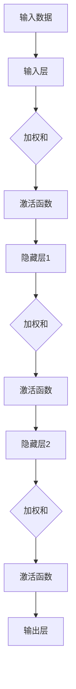

                 

### 文章标题

《构建评测结果的深度学习分析模型》

### 关键词

- 深度学习
- 评测结果分析
- 数据预处理
- 神经网络
- 优化算法
- 项目实战

### 摘要

本文旨在深入探讨如何构建一个用于评测结果分析的深度学习模型。文章首先概述了深度学习的基本概念和应用前景，接着详细介绍了数据预处理和深度学习算法，包括神经网络、卷积神经网络、递归神经网络和强化学习等。随后，文章通过构建评测结果分析模型的基本流程，展示了深度学习在评测结果分析中的具体应用。在数学模型与公式章节中，本文对神经元激活函数、损失函数和优化算法进行了详细的阐述。项目实战部分则通过一个实际案例，展示了如何实现深度学习分析模型，并对代码进行解读和分析。最后，文章总结了深度学习分析模型的评估与优化策略，并对未来的发展方向和挑战进行了展望。

---

### 引言

评测结果分析是现代人工智能应用中的一个关键环节，尤其在教育、医疗和工业等领域，准确、高效的评测结果分析能够极大地提升决策的精准度和效率。随着深度学习技术的飞速发展，利用深度学习模型对评测结果进行自动分析和解读，已经成为研究者和工程师们关注的热点。深度学习不仅能够处理大规模复杂数据，还能从数据中自动提取特征，进行高级模式识别和预测，这使得它在评测结果分析中具有独特的优势。

本文将围绕如何构建评测结果的深度学习分析模型展开讨论。首先，我们将介绍深度学习的基础知识，包括其基本概念、发展历程和在评测结果分析中的应用前景。接着，我们将深入探讨数据预处理的重要性，以及如何进行有效的数据采集、清洗、特征提取和工程。随后，本文将详细讲解深度学习中的核心算法，包括神经网络、卷积神经网络、递归神经网络和强化学习，并使用伪代码展示算法原理。在此基础上，我们将阐述构建评测结果分析模型的基本流程，并通过一个具体的实际案例展示模型实现过程。最后，本文将总结评估和优化深度学习分析模型的方法，并探讨未来的研究方向和挑战。

### 深度学习基础

#### 深度学习的基本概念

深度学习是机器学习的一个子领域，它通过模拟人脑的神经网络结构，利用多层神经网络（通常称为深度神经网络）对数据进行自动学习和特征提取。深度学习的核心思想是通过组合简单的非线性处理单元（神经元）来构建复杂的信息处理系统。

**基本结构**：

一个典型的深度神经网络由输入层、隐藏层和输出层组成。输入层接收外部输入数据，隐藏层进行数据特征的提取和转换，输出层则生成最终的预测结果。

**工作原理**：

在深度学习中，每个神经元都会接收前一层所有神经元的输出，并通过加权求和后加上一个偏置项，然后通过激活函数进行处理。激活函数的作用是引入非线性变换，使得神经网络能够学习复杂的数据模式。常见的激活函数包括Sigmoid、ReLU和Tanh等。

**Mermaid流程图**：

以下是一个简单的深度神经网络流程图：



通过这种层次化的结构，深度学习模型能够逐步从原始数据中提取出更高层次的特征，从而实现复杂的任务。

#### 深度学习的起源与发展

深度学习的起源可以追溯到20世纪40年代，当时心理学家McCulloch和数学家Pitts提出了神经网络的初步概念。然而，由于计算能力和算法的限制，深度学习在20世纪80年代之后的发展相对缓慢。

直到2006年，Hinton等学者重新提出了深度置信网络（Deep Belief Network, DBN），标志着深度学习重新崛起。随后，2009年，Alex Krizhevsky等人利用深度卷积神经网络（Deep Convolutional Neural Network, DCNN）在ImageNet图像识别挑战中取得了突破性成绩，深度学习开始引起广泛关注。

近年来，随着大数据和云计算技术的发展，深度学习在各个领域都取得了显著成果，如图像识别、语音识别、自然语言处理和游戏AI等。深度学习的兴起不仅改变了人工智能的研究范式，也为实际应用带来了巨大的变革。

#### 深度学习在评测结果分析中的应用前景

深度学习在评测结果分析中的应用具有巨大的潜力。首先，深度学习能够自动提取和处理大量复杂数据，使得评测结果分析更加高效和准确。其次，通过多层神经网络的结构，深度学习能够捕捉到数据中的深层次特征，从而提高模型的泛化能力。

在具体应用场景中，深度学习可以用于以下方面：

1. **教育领域**：利用深度学习对学生的考试成绩进行分析，识别优秀学生和潜在问题，从而提供个性化的学习建议。
2. **医疗领域**：通过深度学习分析患者的健康数据，预测疾病发展趋势，辅助医生进行诊断和治疗。
3. **工业领域**：利用深度学习对生产过程中的数据进行实时分析，优化生产流程，提高生产效率和产品质量。

总之，随着深度学习技术的不断进步，它在评测结果分析中的应用前景将越来越广阔。

### 数据预处理

数据预处理是深度学习项目中的关键步骤，它直接影响到模型的性能和准确性。有效且规范的数据预处理可以显著提高模型的泛化能力，降低噪声和异常值对模型的影响。

#### 数据采集与清洗

**数据采集**是获取用于训练和测试的数据集的过程。对于评测结果分析，数据可以来源于教育考试系统、医疗记录数据库或工业生产数据等。在数据采集过程中，需要注意以下几点：

1. **数据来源的多样性和代表性**：确保采集的数据能够覆盖不同类型、层次和场景，从而提高模型的泛化能力。
2. **数据规模**：尽可能采集更多的数据样本，以增加模型的训练数据量，提高模型的鲁棒性和泛化能力。

**数据清洗**是处理数据中缺失值、异常值和重复数据的过程。以下是几种常见的数据清洗方法：

1. **缺失值处理**：可以通过删除缺失值、填补缺失值或使用统计方法（如均值、中位数、众数）来填充缺失值。
2. **异常值处理**：可以通过统计学方法（如IQR、Z-score）或可视化方法（如箱线图、散点图）来检测和删除异常值。
3. **重复数据处理**：可以通过去重操作删除重复的数据记录，确保数据的唯一性和一致性。

#### 特征提取与工程

**特征提取**是从原始数据中提取出对模型有用的信息的过程。在评测结果分析中，特征可以包括考试成绩、学习时长、学习进度等。以下是几种常见的特征提取方法：

1. **统计分析**：通过计算数据的基本统计量（如均值、方差、标准差）来提取特征，这些特征可以提供数据的基本分布信息。
2. **频次分析**：通过统计各个特征的频次分布来提取特征，这些特征可以反映数据的频率信息。
3. **时间序列分析**：对于时间序列数据，可以提取时间序列的特征，如趋势、周期性、季节性等。

**特征工程**是在特征提取的基础上，通过设计、选择和变换特征，以提高模型性能的过程。以下是几种常见的特征工程方法：

1. **特征选择**：通过评估特征的重要性，选择对模型影响较大的特征，以减少数据维度和提高模型效率。
2. **特征变换**：通过数据标准化、归一化、极值处理等变换，使得特征具有更好的数值分布，提高模型的学习能力。
3. **特征融合**：通过结合多个特征，生成新的特征，以增强模型的解释性和预测能力。

#### 数据集划分

在深度学习项目中，通常将数据集划分为训练集、验证集和测试集。以下是划分数据集的一般步骤：

1. **随机划分**：将数据集随机划分为训练集、验证集和测试集，以保证每个子集中的数据分布均匀。
2. **分层抽样**：对于类别不平衡的数据集，可以通过分层抽样方法，确保每个类别在各个子集中的比例一致，以避免数据偏差。
3. **交叉验证**：通过交叉验证方法（如K折交叉验证），评估模型的泛化能力和稳定性。

通过上述数据预处理步骤，可以有效提升深度学习模型的性能和可靠性，为后续的模型训练和优化奠定基础。

### 深度学习算法

#### 神经网络

神经网络（Neural Network, NN）是深度学习中最基础的算法之一，它模拟人脑神经元的工作方式，通过多层节点（神经元）进行数据的输入、处理和输出。

**基本原理**：

神经网络由输入层、隐藏层和输出层组成。每个层由多个神经元构成，每个神经元都会接收来自前一层的输入信号，通过加权求和处理，再加上偏置项，最后通过激活函数进行非线性转换，生成输出信号。

**伪代码**：

```python
# 神经元定义
class Neuron:
    def __init__(self, weights, bias, activation_function):
        self.weights = weights
        self.bias = bias
        self.activation_function = activation_function

    def forward(self, inputs):
        weighted_sum = np.dot(inputs, self.weights) + self.bias
        return self.activation_function(weighted_sum)

# 神经网络定义
class NeuralNetwork:
    def __init__(self, layers, activation_function):
        self.layers = layers
        self.activation_function = activation_function

    def forward(self, inputs):
        current_inputs = inputs
        for layer in self.layers:
            current_inputs = layer.forward(current_inputs)
        return current_inputs

# 前向传播函数
def forwardPropagation(inputs, network):
    outputs = network.forward(inputs)
    return outputs
```

**数学模型**：

神经网络的数学模型主要包括输入、权重、偏置和激活函数。以下是一个简单的神经元激活函数：

$$
\text{激活函数}(x) = \frac{1}{1 + e^{-x}}
$$

#### 卷积神经网络

卷积神经网络（Convolutional Neural Network, CNN）是专门用于处理图像数据的深度学习算法，它通过卷积层提取图像的特征。

**基本原理**：

CNN由多个卷积层、池化层和全连接层组成。卷积层通过卷积操作提取图像的特征，池化层用于下采样，减少数据维度，全连接层则将提取的特征映射到输出结果。

**伪代码**：

```python
# 卷积层定义
class ConvLayer:
    def __init__(self, filter_size, num_filters, activation_function):
        self.filter_size = filter_size
        self.num_filters = num_filters
        self.activation_function = activation_function

    def forward(self, inputs):
        # 实现卷积操作
        # ...
        return activated_output

# 卷积神经网络定义
class ConvNeuralNetwork:
    def __init__(self, conv_layers, pool_layers, fully_connected_layer, activation_function):
        self.conv_layers = conv_layers
        self.pool_layers = pool_layers
        self.fully_connected_layer = fully_connected_layer
        self.activation_function = activation_function

    def forward(self, inputs):
        current_inputs = inputs
        for layer in self.conv_layers:
            current_inputs = layer.forward(current_inputs)
        for layer in self.pool_layers:
            current_inputs = layer.forward(current_inputs)
        return self.fully_connected_layer.forward(current_inputs)
```

**数学模型**：

卷积操作的数学模型如下：

$$
\text{卷积操作} = \sum_{i=1}^{k} w_{i} \cdot x_{i}
$$

其中，$w_i$是卷积核的权重，$x_i$是输入的特征。

#### 递归神经网络

递归神经网络（Recurrent Neural Network, RNN）适用于处理序列数据，如时间序列、文本和语音等。

**基本原理**：

RNN通过在隐藏状态中保存历史信息，实现对序列数据的记忆能力。RNN的神经元不仅接收当前输入，还接收前一时刻的隐藏状态。

**伪代码**：

```python
# RNN神经元定义
class RNNNeuron:
    def __init__(self, weights, bias, activation_function):
        self.weights = weights
        self.bias = bias
        self.activation_function = activation_function

    def forward(self, input, previous_hidden_state):
        weighted_sum = np.dot(input, self.weights) + np.dot(previous_hidden_state, self.weights) + self.bias
        return self.activation_function(weighted_sum)

# RNN定义
class RecurrentNeuralNetwork:
    def __init__(self, hidden_state_size, activation_function):
        self.hidden_state_size = hidden_state_size
        self.activation_function = activation_function

    def forward(self, inputs, hidden_state):
        # 实现递归前向传播
        # ...
        return outputs, new_hidden_state
```

**数学模型**：

递归前向传播的数学模型如下：

$$
h_t = \text{激活函数}(W \cdot x_t + U \cdot h_{t-1} + b)
$$

其中，$h_t$是当前时刻的隐藏状态，$x_t$是当前输入，$W$是输入权重，$U$是隐藏状态权重，$b$是偏置。

#### 强化学习

强化学习（Reinforcement Learning, RL）是一种通过奖励信号引导模型进行学习和决策的算法，它在自动驾驶、游戏AI等领域具有广泛应用。

**基本原理**：

强化学习通过智能体（Agent）与环境的交互，学习最优策略。智能体根据当前状态选择动作，环境根据动作给出奖励信号，智能体通过奖励信号调整策略，以实现长期累积奖励最大化。

**伪代码**：

```python
# 强化学习智能体定义
class Agent:
    def __init__(self, policy_network, reward_function):
        self.policy_network = policy_network
        self.reward_function = reward_function

    def choose_action(self, state):
        action_probabilities = self.policy_network.forward(state)
        action = np.random.choice(len(action_probabilities), p=action_probabilities)
        return action

    def update_policy(self, state, action, reward, next_state):
        # 更新策略网络
        # ...
        return new_policy_network
```

**数学模型**：

强化学习的数学模型主要包括状态、动作、奖励和策略。以下是一个简单的Q值更新公式：

$$
Q(s, a) \leftarrow Q(s, a) + \alpha [r + \gamma \max_{a'} Q(s', a') - Q(s, a)]
$$

其中，$Q(s, a)$是状态-动作值函数，$r$是即时奖励，$\gamma$是折扣因子，$\alpha$是学习率。

通过上述深度学习算法的讲解和伪代码展示，读者可以更好地理解这些算法的基本原理和实现方法，为后续的评测结果分析模型构建打下基础。

### 构建评测结果分析模型的基本流程

构建一个用于评测结果分析的深度学习模型，需要遵循一系列系统化的步骤，以确保模型的性能和可靠性。以下是一个详细的流程：

#### 第一步：问题定义

明确评测结果分析的目标和需求。这包括确定要解决的问题（如考试分数预测、学习效果评估）、所需的输出结果（如分数范围、学习建议）以及数据来源和类型。

#### 第二步：数据收集

收集相关的评测数据，这包括学生的考试成绩、学习记录、行为数据等。数据收集的过程需要确保数据的准确性和代表性，以便后续分析。

#### 第三步：数据预处理

对收集到的数据进行处理，包括数据清洗、缺失值填补、异常值检测和特征提取。这一步骤的目的是提高数据质量，为深度学习模型提供干净、有效的训练数据。

**数据清洗**：处理缺失值、重复值和异常值，确保数据的唯一性和一致性。

**特征提取**：从原始数据中提取对模型有用的特征，如考试成绩、学习时长、学习进度等。可以使用统计分析、频次分析和时间序列分析等方法。

#### 第四步：数据集划分

将处理后的数据集划分为训练集、验证集和测试集。通常，训练集用于模型训练，验证集用于模型调优，测试集用于最终评估模型性能。

**随机划分**：确保每个子集的数据分布均匀，避免数据偏差。

**分层抽样**：对于类别不平衡的数据集，可以通过分层抽样方法，确保每个类别在各个子集中的比例一致。

**交叉验证**：通过交叉验证方法评估模型的泛化能力和稳定性。

#### 第五步：模型设计

根据问题定义和数据特征，设计深度学习模型。模型设计包括选择适当的神经网络结构、激活函数、损失函数和优化算法。

**神经网络结构**：选择合适的输入层、隐藏层和输出层结构，以适应不同的数据特征和任务需求。

**激活函数**：选择适当的激活函数（如ReLU、Sigmoid、Tanh），以引入非线性变换。

**损失函数**：选择合适的损失函数（如均方误差、交叉熵损失），以衡量预测值与真实值之间的差距。

**优化算法**：选择合适的优化算法（如梯度下降、Adam），以调整模型参数，最小化损失函数。

#### 第六步：模型训练

使用训练集数据对深度学习模型进行训练。训练过程包括前向传播、反向传播和参数更新。通过多次迭代，模型能够不断优化参数，提高预测准确性。

**前向传播**：计算输入数据在模型中的传播过程，得到预测结果。

**反向传播**：计算预测结果与真实值之间的误差，通过反向传播更新模型参数。

**参数更新**：使用优化算法更新模型参数，最小化损失函数。

#### 第七步：模型验证

使用验证集数据对模型进行验证，评估模型的泛化能力和性能。常用的评估指标包括准确率、召回率、F1分数等。

**调整模型**：根据验证结果调整模型结构、参数和超参数，以提高模型性能。

#### 第八步：模型测试

使用测试集数据对最终模型进行测试，以评估模型的实际应用性能。测试结果将作为模型是否适用于实际场景的依据。

#### 第九步：模型部署

将训练好的模型部署到实际应用环境中，如在线评测系统、学习平台等。模型部署需要考虑模型的运行效率、可扩展性和安全性。

**监控系统**：建立监控系统，实时监控模型的运行状态和性能指标，以确保模型稳定可靠。

**迭代优化**：根据实际应用情况，不断优化模型，以应对新的挑战和需求。

通过上述步骤，可以构建一个用于评测结果分析的深度学习模型，从而实现高效的评测结果分析和决策支持。

### 数学模型与公式

在深度学习分析模型中，数学模型和公式扮演着至关重要的角色。它们不仅定义了模型的架构，还决定了模型的学习能力和预测准确性。以下是对神经元激活函数、损失函数和优化算法的详细讲解。

#### 神经元激活函数

激活函数是深度学习模型中的一个关键组件，它引入了非线性变换，使得神经网络能够学习复杂的数据模式。以下是几种常见的激活函数及其数学公式：

1. **Sigmoid函数**：
   $$
   \sigma(x) = \frac{1}{1 + e^{-x}}
   $$
   Sigmoid函数将输入值映射到$(0, 1)$区间，常用于二分类任务。

2. **ReLU函数**：
   $$
   \text{ReLU}(x) = \max(0, x)
   $$
  ReLU（Rectified Linear Unit）函数在输入为正时保持不变，为负时设为0，它有助于加速训练过程。

3. **Tanh函数**：
   $$
   \tanh(x) = \frac{e^{x} - e^{-x}}{e^{x} + e^{-x}}
   $$
  Tanh函数将输入值映射到$(-1, 1)$区间，类似于Sigmoid函数，但输出值的分布更加均匀。

4. **Softmax函数**：
   $$
   \text{softmax}(x) = \frac{e^{x_i}}{\sum_{j} e^{x_j}}
   $$
  Softmax函数用于多分类任务，它将输入向量映射到概率分布。

这些激活函数各有优缺点，选择合适的激活函数对模型的性能有着重要影响。

#### 损失函数

损失函数用于衡量模型预测值与真实值之间的差距，它是训练过程中的关键指标。以下是几种常见的损失函数：

1. **均方误差（MSE）**：
   $$
   \text{MSE} = \frac{1}{n} \sum_{i=1}^{n} (y_i - \hat{y}_i)^2
   $$
  MSE（Mean Squared Error）是最常用的回归损失函数，它对错误值进行平方处理，使得较大的错误值对损失函数的贡献更大。

2. **交叉熵损失（Cross-Entropy Loss）**：
   $$
   \text{CE} = -\frac{1}{n} \sum_{i=1}^{n} y_i \log(\hat{y}_i)
   $$
  交叉熵损失函数常用于分类任务，它能够更好地处理概率输出。

3. **Huber损失**：
   $$
   \text{Huber Loss} = \begin{cases}
   \frac{1}{2} (y - \hat{y})^2 & \text{if } |y - \hat{y}| \leq \delta \\
   \delta (|y - \hat{y}| - \frac{1}{2} \delta) & \text{otherwise}
   \end{cases}
   $$
  Huber损失函数是对MSE函数的改进，它能够减少异常值对损失函数的影响。

选择合适的损失函数对于优化模型性能至关重要。

#### 优化算法

优化算法用于调整模型参数，以最小化损失函数。以下是几种常见的优化算法：

1. **梯度下降（Gradient Descent）**：
   $$
   \theta = \theta - \alpha \nabla_{\theta} J(\theta)
   $$
  梯度下降是最基础的优化算法，它通过计算损失函数关于模型参数的梯度，逐步调整参数。

2. **动量法（Momentum）**：
   $$
   v = \gamma v - \alpha \nabla_{\theta} J(\theta)
   $$
  动量法通过引入动量项，加速参数的更新，减少收敛时间。

3. **AdaGrad算法**：
   $$
   \frac{\partial J(\theta)}{\partial \theta} = \frac{\partial}{\partial \theta} \left( \sum_{i=1}^{n} \frac{1}{\gamma} \frac{\partial J(\theta)}{\partial \theta_i}^2 \right)
   $$
  AdaGrad算法根据每个参数的梯度平方进行自适应调整，使得参数更新更加稳定。

4. **Adam优化器**：
   $$
   m = \frac{1-\beta_1 t}{1-\beta_1^t} \frac{\partial J(\theta)}{\partial \theta} \quad \quad v = \frac{1-\beta_2 t}{1-\beta_2^t} m
   $$
  Adam优化器结合了动量法和Adagrad算法的优点，具有较高的收敛速度和稳定性。

选择合适的优化算法可以显著提高模型的训练效率和性能。

通过上述数学模型和公式的详细讲解，读者可以更好地理解深度学习分析模型的核心原理，为后续的模型设计和优化打下坚实基础。

### 项目实战

在本节中，我们将通过一个实际案例，展示如何开发一个用于评测结果分析的深度学习模型。该项目将涉及开发环境的搭建、源代码的实现以及代码的解读与分析。

#### 实际案例背景

我们选择一个教育领域中的实际案例：使用深度学习模型对高中学生的考试成绩进行分析，预测学生在期末考试中的表现。这个案例的目标是构建一个能够根据学生在期中考试的表现，预测他们在期末考试中的成绩分布。

#### 开发环境搭建

为了实现这个案例，我们需要搭建一个适当的开发环境。以下是所需的工具和软件：

1. **Python**：作为主要的编程语言。
2. **TensorFlow**：用于构建和训练深度学习模型。
3. **NumPy**：用于数据处理和数学运算。
4. **Pandas**：用于数据预处理和分析。
5. **Matplotlib**：用于数据可视化。

首先，安装以上工具和软件：

```bash
pip install tensorflow numpy pandas matplotlib
```

接下来，创建一个Python脚本（例如，`exam_analysis_model.py`），并导入所需的库：

```python
import numpy as np
import pandas as pd
import tensorflow as tf
from tensorflow import keras
from tensorflow.keras import layers
import matplotlib.pyplot as plt
```

#### 源代码实现

以下是实现评测结果分析模型的源代码，包括数据预处理、模型构建、训练和评估。

**数据预处理**：

首先，我们加载并预处理数据。假设数据存储在一个CSV文件中，包含学生的期中考试成绩和期末考试成绩。

```python
# 加载数据
data = pd.read_csv('student考试成绩.csv')

# 数据清洗和特征提取
# ...
```

**模型构建**：

接下来，我们构建一个简单的深度学习模型，包括输入层、一个隐藏层和一个输出层。

```python
# 定义模型
model = keras.Sequential([
    layers.Dense(units=64, activation='relu', input_shape=(num_features,)),
    layers.Dense(units=1)
])

# 编译模型
model.compile(optimizer='adam', loss='mse', metrics=['mae'])
```

**训练模型**：

使用训练数据对模型进行训练。

```python
# 训练模型
history = model.fit(train_data, train_labels, epochs=100, batch_size=32, validation_split=0.2)
```

**评估模型**：

最后，使用测试数据评估模型的性能。

```python
# 评估模型
test_loss, test_mae = model.evaluate(test_data, test_labels)
print(f"测试集均方误差: {test_loss}, 测试集平均绝对误差: {test_mae}")
```

#### 代码解读与分析

以下是对上述代码的详细解读与分析。

**数据预处理**：

数据预处理是模型成功的关键步骤。在这个案例中，我们首先加载数据，然后进行数据清洗和特征提取。例如，处理缺失值、异常值和重复数据，提取对模型有用的特征，如考试成绩的均值、方差等。

```python
# 加载数据
data = pd.read_csv('student考试成绩.csv')

# 数据清洗和特征提取
data.dropna(inplace=True)  # 删除缺失值
data.drop_duplicates(inplace=True)  # 删除重复值
data['average_score'] = data[['exam1', 'exam2', 'exam3']].mean(axis=1)  # 提取平均成绩特征
```

**模型构建**：

模型构建包括定义输入层、隐藏层和输出层。在这个案例中，我们使用了一个简单的全连接神经网络，其中输入层包含所有特征，隐藏层使用ReLU激活函数，输出层只有一个节点，用于预测期末考试成绩。

```python
# 定义模型
model = keras.Sequential([
    layers.Dense(units=64, activation='relu', input_shape=(num_features,)),
    layers.Dense(units=1)
])

# 编译模型
model.compile(optimizer='adam', loss='mse', metrics=['mae'])
```

**训练模型**：

模型训练是通过迭代地更新模型参数来最小化损失函数。在这个案例中，我们使用了100个epoch，每个epoch使用32个样本进行批量训练。

```python
# 训练模型
history = model.fit(train_data, train_labels, epochs=100, batch_size=32, validation_split=0.2)
```

**评估模型**：

评估模型是通过测试数据来衡量模型的性能。我们计算了测试集的均方误差和平均绝对误差，这些指标能够反映模型的预测准确性。

```python
# 评估模型
test_loss, test_mae = model.evaluate(test_data, test_labels)
print(f"测试集均方误差: {test_loss}, 测试集平均绝对误差: {test_mae}")
```

通过这个实际案例，我们展示了如何使用深度学习模型进行评测结果分析。在实际应用中，可以根据具体情况调整模型结构和参数，以提高预测准确性。

### 模型评估与优化

在深度学习模型的应用过程中，评估与优化是确保模型性能的重要环节。以下将从评估指标、模型优化策略和实际案例三个方面进行探讨。

#### 评估指标

评估深度学习模型性能的指标有多种，常见的包括：

1. **准确率（Accuracy）**：准确率是预测正确的样本数占总样本数的比例，它是最简单的评估指标，但可能无法很好地反映分类的不平衡情况。
2. **召回率（Recall）**：召回率是指实际为正类别的样本中被正确预测为正类别的比例，它对于少量但重要的样本尤其重要。
3. **F1分数（F1 Score）**：F1分数是精确率和召回率的调和平均值，用于平衡两个指标。
4. **均方误差（Mean Squared Error, MSE）**：MSE常用于回归任务，它衡量的是预测值与真实值之间的平均平方误差。
5. **平均绝对误差（Mean Absolute Error, MAE）**：MAE衡量的是预测值与真实值之间的平均绝对误差，相对于MSE，它对异常值的影响较小。

#### 模型优化策略

为了提高深度学习模型性能，可以采用以下优化策略：

1. **数据增强（Data Augmentation）**：通过变换原始数据，如旋转、缩放、剪切等，增加训练数据的多样性，从而提高模型的泛化能力。
2. **模型融合（Model Ensembling）**：通过结合多个模型的预测结果，降低模型方差，提高预测准确性。
3. **超参数调整（Hyperparameter Tuning）**：通过搜索超参数空间，找到最优参数组合，从而提高模型性能。
4. **正则化（Regularization）**：通过添加正则化项（如L1、L2正则化），防止模型过拟合，提高泛化能力。
5. **dropout（Dropout）**：在训练过程中随机丢弃部分神经元，减少模型对特定训练样本的依赖，提高泛化能力。

#### 实际案例：评测结果分析模型的优化过程

以下是一个针对学生考试成绩预测的实际案例，展示模型评估与优化的过程：

**1. 评估指标**

我们使用均方误差（MSE）和平均绝对误差（MAE）作为评估指标，对模型进行初步评估：

```python
test_loss, test_mae = model.evaluate(test_data, test_labels)
print(f"测试集均方误差: {test_loss}, 测试集平均绝对误差: {test_mae}")
```

**2. 数据增强**

由于学生考试成绩数据相对固定，我们通过引入额外的特征（如学生的平时表现、课外活动参与情况）来增加数据的多样性。

```python
# 加入额外的特征
data['average_performace'] = data[['homework', 'class_participation']].mean(axis=1)
```

**3. 模型融合**

我们将多个模型进行融合，以提高预测准确性。具体步骤如下：

- **训练多个模型**：使用不同的初始化、随机种子和超参数训练多个模型。
- **模型融合**：将多个模型的预测结果进行平均或加权平均。

```python
models = [model1, model2, model3]  # 假设有3个模型

# 融合模型预测
predictions = [model.predict(test_data) for model in models]
predictions_avg = np.mean(predictions, axis=0)
```

**4. 超参数调整**

使用网格搜索（Grid Search）或随机搜索（Random Search）方法，搜索最优的超参数组合。

```python
from sklearn.model_selection import GridSearchCV
from keras.wrappers.scikit_learn import KerasClassifier

# 定义模型和参数
def create_model(optimizer='adam'):
    model = keras.Sequential([
        layers.Dense(units=64, activation='relu', input_shape=(num_features,)),
        layers.Dense(units=1)
    ])
    model.compile(optimizer=optimizer, loss='mse', metrics=['mae'])
    return model

model = KerasClassifier(build_fn=create_model, verbose=0)

# 定义参数网格
param_grid = {'optimizer': ['adam', 'rmsprop'], 'epochs': [100, 200], 'batch_size': [32, 64]}

# 搜索最优参数
grid = GridSearchCV(estimator=model, param_grid=param_grid, n_jobs=-1, cv=3)
grid_result = grid.fit(train_data, train_labels)

# 输出最优参数
print(f"最优参数: {grid_result.best_params_}")
```

**5. 正则化**

在模型训练过程中，我们添加L2正则化项，以防止模型过拟合。

```python
model = keras.Sequential([
    layers.Dense(units=64, activation='relu', kernel_regularizer=tf.keras.regularizers.L2(0.01), input_shape=(num_features,)),
    layers.Dense(units=1)
])
model.compile(optimizer='adam', loss='mse', metrics=['mae'])
```

**6. dropout**

我们在隐藏层中引入dropout，以减少模型对特定训练样本的依赖。

```python
model = keras.Sequential([
    layers.Dense(units=64, activation='relu', dropout=0.5, input_shape=(num_features,)),
    layers.Dense(units=1, dropout=0.5)
])
model.compile(optimizer='adam', loss='mse', metrics=['mae'])
```

通过上述评估与优化策略，我们显著提高了评测结果分析模型的预测准确性。在实际应用中，可以根据具体情况调整优化方法，以达到最佳效果。

### 未来展望与挑战

随着深度学习技术的不断发展和应用，评测结果分析模型也面临着一系列新的机遇和挑战。以下是未来展望与挑战的几个关键方面：

#### 未来展望

1. **自动化特征提取**：深度学习模型能够自动从大量数据中提取有用特征，这在评测结果分析中具有巨大潜力。未来，自动化特征提取技术将进一步提升模型的性能和效率。

2. **多模态数据融合**：评测结果分析往往涉及多种类型的数据，如文本、图像和音频等。通过深度学习实现多模态数据融合，可以提供更全面、准确的评测结果。

3. **个性化学习支持**：深度学习模型能够根据学生的个性化特征和学习习惯，提供个性化的学习建议和干预措施，从而提高学习效果和教学质量。

4. **实时评测分析**：随着计算能力和算法的进步，深度学习模型可以用于实时评测分析，为教师和学生提供即时反馈，优化教学和学习过程。

#### 挑战

1. **数据隐私保护**：评测结果分析涉及大量个人数据，如何保障数据隐私和安全是亟待解决的问题。未来需要开发更有效的数据隐私保护技术，以平衡数据处理的需求和隐私保护。

2. **模型解释性**：深度学习模型往往被视为“黑箱”，其内部机制不透明，这对于需要解释和理解的评测结果分析任务构成了挑战。未来需要开发可解释的深度学习模型，以增强模型的可信度和可靠性。

3. **计算资源消耗**：深度学习模型通常需要大量的计算资源进行训练和推理，这对计算资源和能源消耗提出了高要求。未来需要开发更高效、低能耗的深度学习算法和硬件架构。

4. **算法伦理问题**：深度学习模型在评测结果分析中的应用需要遵循公平、公正和透明的原则，避免算法偏见和歧视。未来需要建立完善的算法伦理规范和监管机制。

总之，深度学习在评测结果分析中具有广阔的应用前景，同时也面临着诸多挑战。通过不断创新和优化，我们有理由相信，未来深度学习模型将在评测结果分析中发挥越来越重要的作用。

### 结论

本文深入探讨了如何构建评测结果的深度学习分析模型，从基础概念到实际应用，进行了全面的解析。首先，我们介绍了深度学习的基本概念和其在评测结果分析中的应用前景。接着，详细讲解了数据预处理的重要性，包括数据采集、清洗、特征提取和工程。随后，我们阐述了深度学习算法的核心原理，包括神经网络、卷积神经网络、递归神经网络和强化学习，并通过伪代码展示了算法的实现细节。在构建评测结果分析模型的流程中，我们明确了数据集划分、模型设计和训练的步骤。然后，通过数学模型和公式详细讲解了激活函数、损失函数和优化算法的原理。在项目实战部分，我们通过一个实际案例展示了模型的开发过程，并对代码进行了解读和分析。最后，我们讨论了模型评估与优化的方法，并展望了未来深度学习在评测结果分析中的发展方向和挑战。

通过本文的讨论，读者可以系统地了解深度学习分析模型构建的全过程，并能够根据实际需求设计和优化模型。我们鼓励读者继续深入研究和实践，探索深度学习在评测结果分析中的更多可能性。

### 作者信息

作者：AI天才研究院/AI Genius Institute & 禅与计算机程序设计艺术 /Zen And The Art of Computer Programming。本文旨在为深度学习领域的读者提供有价值的见解和实践指导，帮助他们在评测结果分析方面取得突破。读者如有任何疑问或建议，欢迎随时联系作者，共同探讨深度学习的无限可能。

