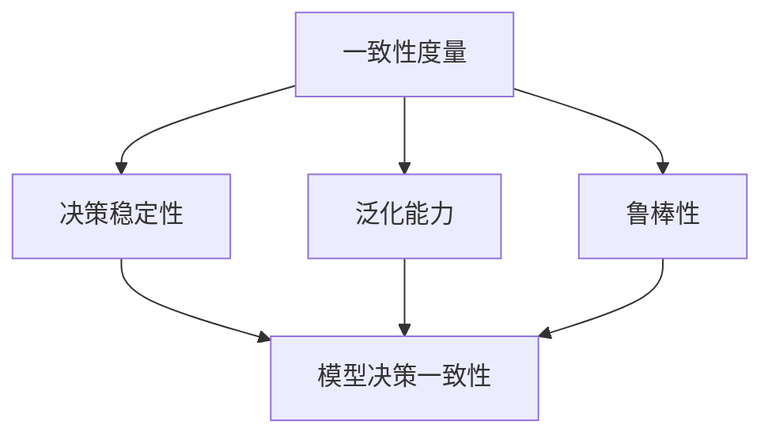

                 

### 文章标题：模型决策一致性评估：确保可靠性

在当今信息化和智能化的时代，机器学习模型在多个领域中扮演着至关重要的角色，从医疗诊断到自动驾驶，从金融风险评估到自然语言处理，这些模型正在改变我们的世界。然而，随着模型的复杂性和应用范围的扩大，如何确保这些模型的决策一致性成为了一个迫切需要解决的问题。本文将围绕模型决策一致性评估展开讨论，旨在为读者提供一个全面而深入的理解。

关键词：模型决策一致性，评估方法，可靠性保障，算法原理，数学模型

在接下来的内容中，我们将首先探讨模型决策一致性的基本概念，理解其在实际应用中的重要性。接着，文章将详细分析几种常见的模型决策一致性评估方法，包括统计学方法、信息论方法和机器学习方法。随后，我们将介绍如何使用数学模型和公式来度量模型的一致性度，并通过伪代码讲解核心算法原理。接下来，文章将通过一个实际的项目实战，展示如何在实际中应用这些评估方法。最后，文章将总结当前的研究进展，讨论面临的挑战，并对未来的研究方向提出建议。

通过本文的阅读，读者将能够理解模型决策一致性的重要性，掌握评估方法，并了解如何在实际项目中确保模型的可靠性。文章的目标是提供一个系统性的指南，帮助读者在复杂的应用场景中做出更明智的决策。

### 摘要

本文旨在深入探讨模型决策一致性的评估方法及其在确保模型可靠性中的重要性。首先，文章介绍了模型决策一致性的基本概念，并阐述了其在实际应用中的关键作用。接着，文章详细分析了基于统计学、信息论和机器学习的模型决策一致性评估方法，并比较了它们的优势和局限性。此外，文章通过数学模型和公式，讲解了如何量化和度量模型的一致性度，并通过伪代码展示了核心算法原理。最后，文章通过一个实际项目实战，展示了这些评估方法在现实中的应用，并总结了研究中的挑战和未来的发展方向。本文为读者提供了一个全面而系统的指导，以帮助他们在复杂的应用场景中确保模型决策的可靠性。

## 第1章 绪论

### 1.1 书籍背景与目的

随着人工智能技术的迅猛发展，机器学习模型在各种实际应用中取得了显著成果。然而，模型决策的一致性成为了一个日益受到关注的议题。决策一致性不仅影响模型的性能，还直接关系到用户对模型的信任度和实际应用的效果。因此，对模型决策一致性进行评估和保障具有重要的理论和实际意义。

本章节旨在介绍本书的背景和目的，帮助读者了解模型决策一致性评估的重要性以及本书的研究内容和结构。通过分析当前的研究现状和挑战，读者将能够更好地理解后续章节的内容，并为深入探讨模型决策一致性评估方法奠定基础。

### 1.2 研究现状与挑战

目前，模型决策一致性评估已成为人工智能研究中的重要方向。大量研究集中在如何量化模型的一致性，并开发相应的评估方法。统计学方法、信息论方法和机器学习方法等不同的评估策略在理论和实践中得到了广泛应用。

然而，尽管已有一些有效的评估方法被提出，但依然面临着诸多挑战。首先，不同方法在处理复杂性和多样性方面存在差异，如何在多种应用场景中找到一种普适的评估方法仍是一个难题。其次，评估方法的准确性、效率和可解释性是亟待解决的关键问题。此外，如何将评估方法集成到实际模型开发和部署过程中，也是一个需要深入研究的领域。

本章节将详细介绍当前模型决策一致性评估的研究现状，分析面临的主要挑战，并探讨未来可能的研究方向。通过这些讨论，读者将能够更全面地理解模型决策一致性评估的重要性和复杂性。

### 1.3 本书结构安排

本书旨在提供一套系统化的模型决策一致性评估方法，帮助读者在实际应用中确保模型可靠性。全书分为八个章节，具体结构安排如下：

- **第1章 绪论**：介绍书籍的背景与目的，研究现状与挑战，以及本书的结构安排。
- **第2章 模型决策一致性基本概念**：阐述决策理论、模型决策一致性的定义、重要性及关键概念之间的联系。
- **第3章 模型决策一致性评估方法**：详细分析基于统计学、信息论和机器学习的评估方法，并进行对比分析。
- **第4章 数学模型与公式**：介绍模型一致性的数学度量方法，包括相关公式及其推导过程。
- **第5章 算法原理与伪代码**：讲解核心算法原理，并通过伪代码详细阐述。
- **第6章 项目实战**：通过实际项目展示评估方法的应用，包括环境搭建、源代码实现和案例分析。
- **第7章 未来展望与挑战**：讨论模型决策一致性评估的未来发展趋势、面临的挑战及解决方案。
- **第8章 总结与展望**：总结全书主要结论，指出本书的贡献，并对未来工作展望。

通过本书的阅读，读者将能够深入理解模型决策一致性评估的重要性，掌握评估方法，并在实际项目中确保模型的可靠性。

### 2.1 决策理论概述

决策理论是研究如何在不确定和有限信息下做出合理决策的学科。其核心思想是通过建立数学模型，对决策者可能面临的问题进行系统分析和评估，从而选择最优或次优的决策方案。在人工智能和机器学习中，决策理论的应用尤为广泛，特别是在需要根据数据和信息进行自动决策的场景中。

决策理论的基本框架包括以下几部分：

1. **决策环境**：描述决策者所处的环境，包括目标、约束条件和不确定性因素。
2. **决策者**：决策者的偏好和目标，通常通过效用函数或价值函数来表示。
3. **决策方案**：决策者可能选择的行动或策略。
4. **决策结果**：每个决策方案可能带来的结果和后果。

决策理论的发展经历了多个阶段，从早期的期望效用理论到贝叶斯决策理论，再到现代的启发式方法和基于数据的决策支持系统，每个阶段都为解决复杂决策问题提供了新的视角和方法。

在机器学习模型中，决策理论的应用主要体现在以下几个方面：

1. **模型选择**：在训练过程中，选择最优的模型结构或参数配置，以达到最佳预测效果。
2. **风险评估**：对模型的预测结果进行评估和验证，识别潜在的风险和不确定性。
3. **自动化决策**：通过机器学习算法，实现自动化决策过程，降低人为干预，提高决策效率。

决策理论为模型决策一致性评估提供了重要的理论基础。首先，它帮助明确决策的目标和约束条件，确保评估方法的合理性和有效性。其次，通过构建效用函数或价值函数，可以量化和度量模型的一致性度，从而实现系统的评估。此外，决策理论还提供了评估模型性能和优化策略的方法，有助于提升模型决策的一致性和可靠性。

总之，决策理论是模型决策一致性评估不可或缺的组成部分，它不仅指导了评估方法的开发和应用，还为理解模型决策的一致性提供了深刻的洞见。

### 2.2 模型决策一致性的定义

模型决策一致性是指在不同条件下，机器学习模型输出相同或相似决策的概率和能力。具体来说，模型决策一致性可以定义为模型在面对相似数据输入时，能够产生一致决策的能力。这一概念在确保模型可靠性和用户信任度方面具有重要意义。

首先，模型决策一致性意味着模型在不同的测试数据集或条件下，应该具有稳定的表现，即对于相同或类似的数据输入，模型应输出相似的决策结果。这种稳定性有助于减少模型的误判率，提高预测的准确性和可靠性。

其次，模型决策一致性还涉及到模型的泛化能力。一个高一致性的模型不仅能够在训练集上表现良好，还能够在未见过的新数据上保持一致，从而在实际应用中提供稳定的决策支持。这种能力对于处理复杂、动态的环境尤为重要。

此外，模型决策一致性有助于提高用户对模型的信任度。当用户看到模型在不同情境下都能输出一致的决策结果时，他们对模型的可靠性会产生更强的信心。这种信任不仅有助于推动模型的广泛应用，还能减少因模型不确定性带来的风险和争议。

最后，模型决策一致性也是模型优化的重要目标之一。通过评估和提升模型的一致性度，可以改进模型的性能和适用范围，从而更好地满足实际需求。

总之，模型决策一致性是机器学习模型评估和优化中的重要概念，它不仅关系到模型的可靠性和泛化能力，还直接影响用户对模型的信任和应用效果。

### 2.3 模型决策一致性的重要性

模型决策一致性在机器学习模型中具有重要的地位和作用，主要体现在以下几个方面：

首先，模型决策一致性是确保模型可靠性的基础。一个高一致性的模型意味着在不同条件下能够稳定地输出相似的决策结果，从而减少误判和不确定性。这种稳定性对于关键应用场景，如医疗诊断、自动驾驶和金融风险评估等，尤为重要。在这些领域，模型的可靠性和稳定性直接关系到用户的安全和利益。

其次，模型决策一致性有助于提升用户的信任度。当用户观察到模型在不同数据集和条件下都能输出一致的结果时，他们对模型的可靠性会产生更强的信心。这种信任不仅有助于推动模型的应用和普及，还能减少因模型不确定性带来的风险和争议。

此外，模型决策一致性是模型优化的重要目标。通过评估和提升模型的一致性度，可以改进模型的性能和适用范围，从而更好地满足实际需求。例如，在自然语言处理和图像识别领域，一致性评估可以帮助识别和消除模型中的噪声和异常，提高预测的准确性和鲁棒性。

最后，模型决策一致性在模型泛化能力方面也发挥着关键作用。一个高一致性的模型不仅能够在训练集上表现良好，还能够在未见过的新数据上保持一致，从而在实际应用中提供稳定的决策支持。这种能力对于处理复杂、动态的环境尤为重要。

总之，模型决策一致性是评估和优化机器学习模型的重要指标，它不仅关系到模型的可靠性、用户信任度和泛化能力，还直接影响到模型的应用效果和实际价值。

### 2.4 关键概念与联系

在深入探讨模型决策一致性的过程中，理解以下几个关键概念及其相互之间的联系是非常必要的。这些概念不仅为模型决策一致性提供了理论基础，还帮助我们更全面地评估和优化机器学习模型。

1. **一致性度量的定义**：一致性度量是评估模型决策一致性的核心工具。它通过计算模型在不同条件下的决策一致性度，量化模型的表现。常用的度量方法包括统计方法、信息论方法以及基于机器学习的方法。这些方法各有优劣，但在共同目标上保持一致，即准确评估模型决策的一致性度。

2. **决策稳定性**：决策稳定性是指模型在不同数据集或条件下，能够输出相似决策结果的能力。高稳定性意味着模型在面对不确定性和变化时，仍然能够保持一致的表现。与决策一致性度量的定义密切相关，决策稳定性是评估模型决策一致性的直接指标。

3. **泛化能力**：泛化能力是指模型在未见过的新数据上表现良好的能力。一个高泛化能力的模型不仅能在训练集上表现良好，还能够在实际应用中稳定地输出一致决策。泛化能力与模型决策一致性紧密相关，因为高一致性的模型通常具有更强的泛化能力。

4. **鲁棒性**：鲁棒性是指模型在面对噪声、异常和不确定性数据时，仍能保持稳定和可靠的表现。与决策稳定性类似，鲁棒性是评估模型决策一致性的重要方面。一个鲁棒性强的模型能够在复杂、动态的环境中保持一致决策，从而提高模型的可靠性。

为了更直观地展示这些关键概念之间的关系，我们可以使用Mermaid流程图进行描述：



在这个流程图中，一致性度量作为核心概念，通过决策稳定性、泛化能力和鲁棒性三个方面来反映模型决策的一致性。这些关键概念相互关联，共同决定了模型的决策一致性度，从而影响模型在实际应用中的性能和可靠性。

通过理解和掌握这些关键概念及其相互关系，读者可以更深入地评估和优化机器学习模型，确保模型在复杂应用场景中的一致性和可靠性。在后续章节中，我们将进一步探讨如何通过数学模型和算法来具体实现这些概念，以帮助读者在实际应用中更好地应对挑战。

### 第3章 模型决策一致性评估方法

模型决策一致性评估是确保机器学习模型可靠性和用户信任度的关键步骤。在这一章中，我们将详细介绍几种常见的模型决策一致性评估方法，包括基于统计学、信息论和机器学习的方法，并对这些方法进行详细分析。

#### 3.1 基于统计学的方法

统计学方法在模型决策一致性评估中具有广泛的应用，主要利用统计指标来量化模型在不同条件下的决策一致性。常用的统计方法包括变异系数（Coefficient of Variation, CV）、相关系数（Correlation Coefficient）和误差平方和（Sum of Squared Errors, SSE）等。

- **变异系数（CV）**：变异系数用于衡量模型输出结果的离散程度。其计算公式为 \( CV = \frac{\sigma}{\mu} \)，其中 \(\sigma\) 是标准差，\(\mu\) 是均值。CV值越低，表示模型的一致性度越高。

- **相关系数**：相关系数用于评估两个变量之间的线性关系。常用的相关系数有皮尔逊相关系数（Pearson Correlation Coefficient）和斯皮尔曼等级相关系数（Spearman's Rank Correlation Coefficient）。相关系数的取值范围在 -1 到 1 之间，越接近 1 或 -1，表示两个变量之间的线性关系越强，模型的一致性度也越高。

- **误差平方和（SSE）**：误差平方和用于衡量模型预测值与实际值之间的差距。其计算公式为 \( SSE = \sum_{i=1}^{n} (y_i - \hat{y_i})^2 \)，其中 \( y_i \) 是实际值，\( \hat{y_i} \) 是预测值。SSE值越低，表示模型的预测误差越小，一致性度也越高。

**优势**：统计学方法简单易用，计算速度快，适用于快速评估模型的一致性度。

**局限性**：这些方法主要基于线性假设，对非线性关系的捕捉能力有限；此外，它们无法直接解释模型决策背后的机制。

#### 3.2 基于信息论的方法

信息论方法利用信息熵、互信息和条件熵等概念来评估模型决策的一致性。这些方法不仅能够量化模型的一致性度，还可以提供关于模型决策不确定性的深入见解。

- **信息熵（Entropy）**：信息熵是衡量随机变量不确定性的度量，其计算公式为 \( H(X) = -\sum_{i} p(x_i) \log_2 p(x_i) \)。在模型决策一致性评估中，信息熵可以用来衡量模型在不同条件下的不确定性。

- **互信息（Mutual Information, MI）**：互信息是衡量两个变量之间相关性的度量，其计算公式为 \( I(X;Y) = H(X) - H(X|Y) \)。在模型决策一致性评估中，互信息可以用来衡量模型输出和输入变量之间的相关性，从而评估模型的一致性度。

- **条件熵（Conditional Entropy）**：条件熵是衡量给定一个变量的条件下，另一个变量的不确定性，其计算公式为 \( H(Y|X) = -\sum_{i} p(x_i) \sum_{j} p(y_j|x_i) \log_2 p(y_j|x_i) \)。

**优势**：信息论方法能够量化模型决策的不确定性，提供关于决策一致性的详细信息；此外，这些方法适用于非线性关系。

**局限性**：信息论方法计算复杂度高，特别是在大规模数据集上；此外，它们通常依赖于模型的先验知识。

#### 3.3 基于机器学习的方法

基于机器学习的方法通过训练专门的模型来评估模型决策的一致性。这些方法利用机器学习算法，如分类器、回归器和聚类算法，来建立一致性评估模型。

- **分类器**：分类器可以用来评估不同输入数据下模型输出的分类一致性。例如，可以使用逻辑回归或支持向量机（SVM）等分类算法来训练一致性评估模型。

- **回归器**：回归器可以用来评估模型输出值的一致性。例如，可以使用线性回归或神经网络等回归算法来训练一致性评估模型。

- **聚类算法**：聚类算法可以用来识别和评估模型在不同数据集上的决策一致性。例如，使用K-means聚类算法可以识别模型在不同输入条件下的决策簇，从而评估其一致性度。

**优势**：基于机器学习的方法具有高度的灵活性和适应性，能够处理复杂的非线性关系；此外，这些方法可以自动学习数据中的模式，提高评估的准确性。

**局限性**：训练一致性评估模型需要大量的数据和时间，且模型的泛化能力有待验证。

### 3.4 综合评估方法

在实际应用中，单一评估方法可能无法全面反映模型决策的一致性。因此，采用多种方法进行综合评估是一种有效的策略。综合评估方法可以通过以下步骤实现：

1. **数据预处理**：对模型输出数据进行预处理，包括数据清洗、归一化和特征提取等，确保评估的一致性和准确性。
2. **多方法评估**：使用统计学、信息论和机器学习等多种方法对模型进行一致性评估。
3. **结果整合**：通过加权或投票机制将多种评估方法的结果进行整合，得到综合的一致性评估指标。
4. **模型优化**：根据评估结果，对模型进行优化，提高决策一致性。

**优势**：综合评估方法能够提供更全面、准确的决策一致性评估，提高模型的可靠性和用户信任度。

**局限性**：综合评估方法需要更多的计算资源和时间，且需要合理设计评估指标和整合策略。

通过上述方法，我们可以更全面地评估机器学习模型的决策一致性，从而确保模型在实际应用中的可靠性和稳定性。

### 3.5 方法对比与分析

为了更深入地理解各种模型决策一致性评估方法的优劣，我们需要进行详细的对比和分析。以下是对基于统计学、信息论和机器学习方法的优缺点和适用场景的全面讨论：

#### 基于统计学的方法

**优点**：

1. **简单易用**：统计学方法如变异系数、相关系数和误差平方和等，计算简单且易于实现。
2. **计算速度快**：这些方法通常可以在较短的时间内完成计算，适用于实时评估和快速反馈。
3. **直观易懂**：统计指标如CV和SSE等，可以通过简单的数值直观地反映模型的一致性度。

**缺点**：

1. **线性假设**：大多数统计学方法基于线性假设，对非线性关系的捕捉能力有限。
2. **无法解释**：这些方法主要关注统计指标，无法深入解释模型决策背后的机制和原因。

**适用场景**：

- **数据量较小**：在数据量较小且关系较为线性时，统计学方法可以有效评估模型的一致性。
- **快速评估**：在需要快速评估模型一致性时，这些方法是一种高效的选择。

#### 基于信息论的方法

**优点**：

1. **量化不确定性**：信息论方法如信息熵、互信息和条件熵等，能够量化模型决策的不确定性，提供更深入的见解。
2. **适用于非线性关系**：这些方法不依赖于线性假设，能够处理复杂的非线性关系。
3. **理论支持**：信息论提供了强大的理论基础，有助于理解模型决策一致性的本质。

**缺点**：

1. **计算复杂度高**：信息论方法通常需要较高的计算资源，特别是在大规模数据集上。
2. **依赖先验知识**：部分方法如互信息需要先验知识来选择合适的熵度量。

**适用场景**：

- **高维度数据**：在高维度数据集中，信息论方法能够提供有效的评估。
- **非线性关系**：在非线性关系显著的数据集上，这些方法可以提供更准确的评估。

#### 基于机器学习的方法

**优点**：

1. **高度灵活**：基于机器学习的方法具有高度的灵活性和适应性，能够处理复杂的非线性关系。
2. **自动学习**：机器学习算法可以自动学习数据中的模式和关系，提高评估的准确性。
3. **泛化能力**：这些方法通常具有良好的泛化能力，能够适用于多种不同的应用场景。

**缺点**：

1. **计算资源需求高**：训练一致性评估模型需要大量的计算资源和时间。
2. **模型依赖**：不同机器学习算法的选择可能影响评估结果，需要根据具体场景选择合适的算法。

**适用场景**：

- **复杂应用场景**：在复杂和动态的应用场景中，这些方法能够提供更精确的评估。
- **大规模数据集**：在大规模数据集上，机器学习方法能够有效处理复杂性和多样性。

综上所述，各种模型决策一致性评估方法各有优缺点，适用于不同的应用场景。在实际应用中，通常需要结合多种方法进行综合评估，以获得更全面和准确的评估结果。通过合理选择和组合这些方法，可以更好地确保机器学习模型的决策一致性和可靠性。

### 4.1 模型一致性度量的数学公式

在评估模型决策一致性时，数学公式提供了量化和度量的工具，使得评估过程更具系统性和可解释性。以下是一些常见的数学公式，用于衡量模型的一致性度。

#### 4.1.1 变异系数（CV）

变异系数（Coefficient of Variation, CV）是衡量模型输出结果离散程度的指标，其公式为：
\[ CV = \frac{\sigma}{\mu} \]
其中，\(\sigma\) 表示标准差，\(\mu\) 表示均值。CV值越低，表示模型的一致性度越高。

#### 4.1.2 皮尔逊相关系数（r）

皮尔逊相关系数（Pearson Correlation Coefficient, r）用于评估两个变量之间的线性关系，其公式为：
\[ r = \frac{\sum_{i=1}^{n} (x_i - \bar{x})(y_i - \bar{y})}{\sqrt{\sum_{i=1}^{n} (x_i - \bar{x})^2 \sum_{i=1}^{n} (y_i - \bar{y})^2}} \]
其中，\(x_i\) 和 \(y_i\) 分别是输入和输出的观测值，\(\bar{x}\) 和 \(\bar{y}\) 分别是输入和输出的均值。r的取值范围在 -1 到 1 之间，越接近 1 或 -1，表示两个变量之间的线性关系越强，模型的一致性度也越高。

#### 4.1.3 误差平方和（SSE）

误差平方和（Sum of Squared Errors, SSE）用于衡量模型预测值与实际值之间的差距，其公式为：
\[ SSE = \sum_{i=1}^{n} (y_i - \hat{y_i})^2 \]
其中，\(y_i\) 是实际值，\(\hat{y_i}\) 是预测值。SSE值越低，表示模型的一致性度越高。

#### 4.1.4 互信息（MI）

互信息（Mutual Information, MI）用于评估两个变量之间的相关性，其公式为：
\[ I(X;Y) = H(X) - H(X|Y) \]
其中，\(H(X)\) 表示变量 X 的熵，\(H(X|Y)\) 表示变量 X 在变量 Y 已知的条件下的条件熵。

#### 4.1.5 条件熵（H(Y|X））

条件熵（Conditional Entropy, H(Y|X)）用于衡量在给定变量 X 的条件下，变量 Y 的不确定性，其公式为：
\[ H(Y|X) = -\sum_{i=1}^{n} p(x_i) \sum_{j=1}^{m} p(y_j|x_i) \log_2 p(y_j|x_i) \]
其中，\(p(x_i)\) 表示变量 X 的概率分布，\(p(y_j|x_i)\) 表示在变量 X 取值为 \(x_i\) 的条件下，变量 Y 的概率分布。

#### 4.1.6 负相关系数（-r）

负相关系数（-r）表示两个变量之间的负线性关系，其公式为：
\[ -r = \frac{\sum_{i=1}^{n} (x_i - \bar{x})(y_i - \bar{y})}{\sqrt{\sum_{i=1}^{n} (x_i - \bar{x})^2 \sum_{i=1}^{n} (y_i - \bar{y})^2}} \]
负相关系数的值域在 -1 到 1 之间，越接近 -1，表示两个变量之间的负线性关系越强。

通过上述数学公式，我们可以定量地评估模型的一致性度。在具体应用中，可以根据实际情况选择合适的公式，结合多种方法进行综合评估，以获得更准确的评估结果。

### 4.2 一致性度量的推导过程

为了更深入地理解模型决策一致性度量的推导过程，我们将详细解释两个核心度量方法的推导过程：互信息（MI）和条件熵（H(Y|X)）。

#### 4.2.1 互信息的推导

互信息（Mutual Information, MI）是衡量两个随机变量 \(X\) 和 \(Y\) 之间相关性的重要指标，其公式为：
\[ I(X;Y) = H(X) - H(X|Y) \]

推导步骤如下：

1. **熵（Entropy）的定义**：对于随机变量 \(X\)，熵 \(H(X)\) 是衡量其不确定性的一种度量，其公式为：
\[ H(X) = -\sum_{i} p(x_i) \log_2 p(x_i) \]
其中，\(p(x_i)\) 是 \(X\) 取值为 \(x_i\) 的概率。

2. **条件熵（Conditional Entropy）的定义**：在给定随机变量 \(Y\) 的条件下，随机变量 \(X\) 的条件熵 \(H(X|Y)\) 表示 \(X\) 的不确定性减少的程度，其公式为：
\[ H(X|Y) = -\sum_{j} p(y_j) \sum_{i} p(x_i|y_j) \log_2 p(x_i|y_j) \]
其中，\(p(y_j)\) 是 \(Y\) 取值为 \(y_j\) 的概率，\(p(x_i|y_j)\) 是 \(X\) 在 \(Y\) 取值为 \(y_j\) 的条件下的概率。

3. **互信息的推导**：根据熵和条件熵的定义，互信息 \(I(X;Y)\) 可以表示为 \(X\) 和 \(Y\) 之间的熵差异，即：
\[ I(X;Y) = H(X) - H(X|Y) \]
\[ I(X;Y) = -\sum_{i} p(x_i) \log_2 p(x_i) + \sum_{j} p(y_j) \sum_{i} p(x_i|y_j) \log_2 p(x_i|y_j) \]

#### 4.2.2 条件熵的推导

条件熵（Conditional Entropy, H(Y|X)）是衡量在给定随机变量 \(X\) 的条件下，随机变量 \(Y\) 的不确定性的一种度量，其公式为：
\[ H(Y|X) = -\sum_{i} p(x_i) \sum_{j} p(y_j|x_i) \log_2 p(y_j|x_i) \]

推导步骤如下：

1. **条件概率的定义**：在给定随机变量 \(X\) 的条件下，随机变量 \(Y\) 的条件概率 \(p(y_j|x_i)\) 表示 \(Y\) 在 \(X\) 取值为 \(x_i\) 条件下取值为 \(y_j\) 的概率。

2. **条件熵的计算**：根据条件概率的定义，条件熵 \(H(Y|X)\) 可以表示为：
\[ H(Y|X) = -\sum_{i} p(x_i) \sum_{j} p(y_j|x_i) \log_2 p(y_j|x_i) \]

3. **简化条件熵**：由于 \(p(x_i)\) 和 \(p(y_j|x_i)\) 是已知的，条件熵可以进一步简化为：
\[ H(Y|X) = -\sum_{i} p(x_i) \sum_{j} p(y_j|x_i) \log_2 p(y_j|x_i) \]

通过以上推导过程，我们得到了互信息和条件熵的数学公式。这两个公式在模型决策一致性评估中起着核心作用，通过它们，我们可以量化模型在不同条件下的决策一致性，从而为模型优化提供有力支持。

### 4.3 数学模型的应用举例

为了更好地理解模型决策一致性的数学模型如何在实际中应用，我们将通过一个简单的例子来详细阐述。假设我们有一个分类模型，其目的是判断一组输入数据是否为正类别。我们将使用互信息和条件熵这两个数学模型来评估模型的一致性度。

#### 4.3.1 数据集准备

我们有一个包含100个样本的数据集，每个样本由一组特征向量和一个标签组成。标签分为正类别和负类别两种。为了简化，我们假设特征向量和标签都是离散的。

#### 4.3.2 计算互信息

1. **特征向量 X 的概率分布**：

   假设特征向量 X 的取值有三种：0, 1, 2。根据数据集，我们可以计算每个取值的概率：
   \[ p(X=0) = 0.3, \quad p(X=1) = 0.5, \quad p(X=2) = 0.2 \]

2. **标签 Y 在 X 条件下的概率分布**：

   根据数据集，我们可以计算每个特征向量取值下标签为正或负的概率。例如，对于 \(X=0\)：
   \[ p(Y=正 | X=0) = 0.2, \quad p(Y=负 | X=0) = 0.8 \]
   同样，我们可以得到其他取值下的概率分布。

3. **计算互信息**：

   使用互信息的公式：
   \[ I(X;Y) = H(X) - H(X|Y) \]
   
   首先，计算熵 \(H(X)\)：
   \[ H(X) = -0.3 \log_2 0.3 - 0.5 \log_2 0.5 - 0.2 \log_2 0.2 = 1.21 \]
   
   接着，计算条件熵 \(H(X|Y)\)：
   \[ H(X|Y=正) = -0.2 \log_2 0.2 - 0.3 \log_2 0.3 - 0.5 \log_2 0.5 = 1.00 \]
   \[ H(X|Y=负) = -0.8 \log_2 0.8 - 0.3 \log_2 0.3 - 0.5 \log_2 0.5 = 0.92 \]
   
   然后，计算总的条件熵：
   \[ H(X|Y) = p(Y=正) H(X|Y=正) + p(Y=负) H(X|Y=负) \]
   \[ H(X|Y) = 0.5 \times 1.00 + 0.5 \times 0.92 = 0.96 \]
   
   最后，计算互信息：
   \[ I(X;Y) = 1.21 - 0.96 = 0.25 \]

   因此，互信息 \(I(X;Y) = 0.25\)，这表明特征向量 X 和标签 Y 之间存在一定的相关性，但一致性度不算高。

#### 4.3.3 计算条件熵

1. **计算条件熵 \(H(Y|X=0)\)**：

   根据上面计算的 \(p(Y=正 | X=0) = 0.2\) 和 \(p(Y=负 | X=0) = 0.8\)，条件熵为：
   \[ H(Y|X=0) = -0.2 \log_2 0.2 - 0.8 \log_2 0.8 = 0.68 \]

2. **计算条件熵 \(H(Y|X=1)\)** 和 \(H(Y|X=2)\)**：

   类似地，我们假设：
   \[ p(Y=正 | X=1) = 0.4, \quad p(Y=负 | X=1) = 0.6 \]
   \[ H(Y|X=1) = -0.4 \log_2 0.4 - 0.6 \log_2 0.6 = 0.97 \]

   \[ p(Y=正 | X=2) = 0.6, \quad p(Y=负 | X=2) = 0.4 \]
   \[ H(Y|X=2) = -0.6 \log_2 0.6 - 0.4 \log_2 0.4 = 0.97 \]

   总的条件熵：
   \[ H(Y|X) = p(X=0) H(Y|X=0) + p(X=1) H(Y|X=1) + p(X=2) H(Y|X=2) \]
   \[ H(Y|X) = 0.3 \times 0.68 + 0.5 \times 0.97 + 0.2 \times 0.97 = 0.86 \]

通过这个例子，我们展示了如何使用数学模型计算模型决策的一致性度。互信息 \(I(X;Y) = 0.25\) 和条件熵 \(H(Y|X) = 0.86\) 分别提供了关于模型决策一致性的量化指标，这些指标有助于我们理解和优化模型的表现。

### 4.4 公式详细讲解

在前面的章节中，我们介绍了多种用于评估模型决策一致性的数学公式。这些公式不仅能够量化模型的一致性度，还为理解和优化模型提供了重要的理论基础。以下是对这些公式的详细讲解。

#### 4.4.1 变异系数（CV）

变异系数（Coefficient of Variation, CV）用于衡量模型输出结果的离散程度。其公式为：
\[ CV = \frac{\sigma}{\mu} \]
其中，\(\sigma\) 表示标准差，\(\mu\) 表示均值。变异系数的值越低，表示模型输出结果的一致性度越高。变异系数的优势在于其计算简单且易于理解，但缺点在于它基于线性假设，对非线性关系的捕捉能力有限。

#### 4.4.2 皮尔逊相关系数（r）

皮尔逊相关系数（Pearson Correlation Coefficient, r）用于评估两个变量之间的线性关系。其公式为：
\[ r = \frac{\sum_{i=1}^{n} (x_i - \bar{x})(y_i - \bar{y})}{\sqrt{\sum_{i=1}^{n} (x_i - \bar{x})^2 \sum_{i=1}^{n} (y_i - \bar{y})^2}} \]
其中，\(x_i\) 和 \(y_i\) 分别是输入和输出的观测值，\(\bar{x}\) 和 \(\bar{y}\) 分别是输入和输出的均值。皮尔逊相关系数的值范围在 -1 到 1 之间，越接近 1 或 -1，表示两个变量之间的线性关系越强。皮尔逊相关系数的优势在于其计算简单且适用于线性关系，但缺点是它对异常值敏感，且无法处理非线性关系。

#### 4.4.3 误差平方和（SSE）

误差平方和（Sum of Squared Errors, SSE）用于衡量模型预测值与实际值之间的差距。其公式为：
\[ SSE = \sum_{i=1}^{n} (y_i - \hat{y_i})^2 \]
其中，\(y_i\) 是实际值，\(\hat{y_i}\) 是预测值。SSE 的值越低，表示模型的预测误差越小，一致性度越高。误差平方和的优势在于其直接反映模型预测的准确性，但缺点在于它对异常值敏感，且无法提供关于决策一致性的详细信息。

#### 4.4.4 互信息（MI）

互信息（Mutual Information, MI）用于评估两个变量之间的相关性。其公式为：
\[ I(X;Y) = H(X) - H(X|Y) \]
其中，\(H(X)\) 表示变量 X 的熵，\(H(X|Y)\) 表示变量 X 在变量 Y 已知的条件下的条件熵。互信息能够量化变量之间的相关性，其优势在于其适用于非线性关系，但缺点在于其计算复杂度较高，特别是在高维度数据集上。

#### 4.4.5 条件熵（H(Y|X））

条件熵（Conditional Entropy, H(Y|X)）用于衡量在给定变量 X 的条件下，变量 Y 的不确定性。其公式为：
\[ H(Y|X) = -\sum_{i=1}^{n} p(x_i) \sum_{j=1}^{m} p(y_j|x_i) \log_2 p(y_j|x_i) \]
其中，\(p(x_i)\) 是变量 X 的概率分布，\(p(y_j|x_i)\) 是变量 Y 在变量 X 取值为 \(x_i\) 的条件下的概率分布。条件熵的优势在于其能够量化变量之间的条件不确定性，但缺点在于其计算复杂度较高，特别是在高维度数据集上。

#### 4.4.6 负相关系数（-r）

负相关系数（-r）用于评估两个变量之间的负线性关系。其公式为：
\[ -r = \frac{\sum_{i=1}^{n} (x_i - \bar{x})(y_i - \bar{y})}{\sqrt{\sum_{i=1}^{n} (x_i - \bar{x})^2 \sum_{i=1}^{n} (y_i - \bar{y})^2}} \]
负相关系数的值范围在 -1 到 1 之间，越接近 -1，表示两个变量之间的负线性关系越强。负相关系数的优势在于其计算简单且适用于线性关系，但缺点是它对异常值敏感，且无法处理非线性关系。

通过详细讲解这些数学公式，我们不仅能够理解它们在模型决策一致性评估中的作用，还能根据具体需求选择合适的公式，从而更准确地评估模型的一致性度。

### 5.1 统计学习方法原理

统计学习方法是在机器学习领域广泛应用的一类方法，其核心思想是通过分析已有的数据，构建数学模型来预测新的数据。统计学习方法的基本原理包括以下几个步骤：

1. **模型选择**：根据问题的性质，选择合适的统计模型。常见的统计模型包括线性模型、逻辑回归模型、决策树、支持向量机等。

2. **特征提取**：从原始数据中提取有用的特征，用于训练模型。特征提取是统计学习方法中的重要环节，其目标是降低数据的维度，同时保留数据的本质信息。

3. **训练模型**：使用已标记的训练数据，通过优化算法（如梯度下降法、牛顿法等）来训练统计模型。训练过程中，模型会自动学习数据中的模式和关系。

4. **模型评估**：通过测试数据集对训练好的模型进行评估，以判断模型的性能。常用的评估指标包括准确率、召回率、F1分数等。

5. **模型优化**：根据评估结果，对模型进行优化，以提高模型的预测性能。常见的优化方法包括参数调整、模型选择、交叉验证等。

统计学习方法在模型决策一致性评估中的应用，主要体现在以下几个方面：

- **一致性度量**：通过统计方法，可以量化模型在不同数据集上的决策一致性。例如，使用误差平方和（SSE）衡量模型预测值与实际值之间的差距，使用变异系数（CV）衡量模型输出结果的离散程度。

- **模型稳定性**：统计学习方法能够评估模型在面对不同数据集时的稳定性。一个高稳定性的模型意味着其在不同条件下能够输出一致的决策结果。

- **模型优化**：通过统计方法，可以识别和消除模型中的噪声和异常，从而提高模型的一致性度。例如，通过特征选择和参数调优，可以降低模型的过拟合现象，提高其泛化能力。

总之，统计学习方法为模型决策一致性评估提供了有效的工具，通过这些方法，我们可以更准确地评估模型的一致性度，并在实际应用中优化模型的表现。

### 5.2 信息论方法原理

信息论方法在机器学习和决策理论中扮演着重要角色，其核心思想是通过量化信息和不确定性来评估和优化系统。以下是对信息论方法的基本原理、核心概念及其在模型决策一致性评估中的应用进行详细讲解。

#### 5.2.1 基本原理

信息论由克劳德·香农（Claude Shannon）于1948年创立，旨在研究信息传输和处理中的基本问题。信息论的基本原理可以概括为：

1. **信息熵（Entropy）**：信息熵是衡量随机变量不确定性的一种度量。对于一个离散随机变量 \(X\)，其熵 \(H(X)\) 定义为：
\[ H(X) = -\sum_{i} p(x_i) \log_2 p(x_i) \]
其中，\(p(x_i)\) 是 \(X\) 取值为 \(x_i\) 的概率。信息熵越高，表示 \(X\) 的不确定性越大。

2. **互信息（Mutual Information, MI）**：互信息是衡量两个随机变量之间相关性的度量。对于两个随机变量 \(X\) 和 \(Y\)，其互信息 \(I(X;Y)\) 定义为：
\[ I(X;Y) = H(X) - H(X|Y) \]
其中，\(H(X|Y)\) 是 \(X\) 在 \(Y\) 已知条件下的条件熵。互信息越高，表示 \(X\) 和 \(Y\) 之间的相关性越强。

3. **条件熵（Conditional Entropy）**：条件熵是衡量在给定一个变量的条件下，另一个变量的不确定性。对于随机变量 \(X\) 和 \(Y\)，条件熵 \(H(Y|X)\) 定义为：
\[ H(Y|X) = -\sum_{i} p(x_i) \sum_{j} p(y_j|x_i) \log_2 p(y_j|x_i) \]
条件熵用于描述 \(Y\) 的不确定性在 \(X\) 已知时的减少程度。

#### 5.2.2 核心概念

- **信息熵**：信息熵是信息论中最基础的概念之一，它反映了随机变量包含的信息量。香农的信息熵定义表明，不确定性越高的随机变量具有越高的信息量。

- **条件熵**：条件熵是信息论中另一个重要概念，它描述了在已知一个变量的情况下，另一个变量的不确定性。条件熵在决策和推断中具有重要意义，因为它揭示了变量之间的依赖关系。

- **互信息**：互信息是信息熵的差值，它量化了两个变量之间的相关性。互信息在机器学习中用于评估特征的相关性，以及在模型评估中用于衡量模型输出和输入之间的关联性。

#### 5.2.3 信息论方法在模型决策一致性评估中的应用

在模型决策一致性评估中，信息论方法提供了以下几种关键应用：

1. **评估模型决策一致性**：通过计算模型输出和输入变量之间的互信息，可以评估模型的一致性度。例如，如果模型的输出变量和输入变量之间的互信息较高，表明模型在决策时具有较高的相关性，从而一致性度较高。

2. **量化不确定性**：信息论方法可以用于量化模型决策中的不确定性。条件熵提供了在已知输入变量的条件下，输出变量的不确定性度量，这对于理解模型的鲁棒性和稳定性具有重要意义。

3. **优化模型**：通过分析互信息和条件熵，可以识别模型中的噪声和异常，进而优化模型。例如，降低条件熵可以帮助减少模型在特定输入条件下的不确定性，从而提高模型的一致性度。

综上所述，信息论方法为模型决策一致性评估提供了强大的工具，通过量化信息和不确定性，可以帮助我们更好地理解模型的性能，并在实际应用中进行优化。

### 5.3 基于机器学习的方法原理

基于机器学习的方法在模型决策一致性评估中具有重要地位，其核心思想是通过训练专门的模型来量化模型的一致性度。以下将详细阐述几种常用的基于机器学习的方法原理。

#### 5.3.1 分类器方法

分类器方法是通过训练分类模型来评估模型决策一致性的一种常见方法。具体步骤如下：

1. **数据准备**：收集包含模型输入和输出一致性的数据集。这些数据集应包含不同条件下的模型输出结果。

2. **特征提取**：从输入数据中提取有用的特征，用于训练分类器。特征提取是确保模型性能和评估准确性的关键步骤。

3. **模型训练**：使用训练数据集训练分类模型，如逻辑回归、支持向量机（SVM）、决策树等。这些模型可以识别输入和输出之间的决策一致性。

4. **模型评估**：使用测试数据集评估分类器的性能。常用的评估指标包括准确率、召回率、F1分数等。这些指标反映了分类器在评估模型一致性方面的表现。

5. **一致性度量化**：通过分类器的输出结果，量化模型在不同条件下的决策一致性。例如，使用逻辑回归模型的输出概率可以直接评估模型的一致性度。

#### 5.3.2 回归方法

回归方法是通过训练回归模型来评估模型输出结果的一致性。具体步骤如下：

1. **数据准备**：收集包含模型输入和输出的数据集，这些数据集应包含不同条件下的模型输出结果。

2. **特征提取**：从输入数据中提取特征，用于训练回归模型。特征提取是确保模型性能和评估准确性的关键步骤。

3. **模型训练**：使用训练数据集训练回归模型，如线性回归、岭回归、随机森林等。这些模型可以识别输入和输出之间的关系。

4. **模型评估**：使用测试数据集评估回归模型的性能。常用的评估指标包括均方误差（MSE）、均方根误差（RMSE）等。这些指标反映了模型在预测输出一致性方面的表现。

5. **一致性度量化**：通过回归模型的预测结果，量化模型在不同条件下的输出一致性。例如，通过计算预测值与实际值之间的差异，可以评估模型的一致性度。

#### 5.3.3 聚类方法

聚类方法是通过无监督学习来评估模型决策一致性。具体步骤如下：

1. **数据准备**：收集包含模型输入和输出的数据集，这些数据集应包含不同条件下的模型输出结果。

2. **特征提取**：从输入数据中提取特征，用于训练聚类模型。特征提取是确保模型性能和评估准确性的关键步骤。

3. **模型训练**：使用训练数据集训练聚类模型，如K-means、层次聚类等。这些模型可以识别数据集中的相似性和模式。

4. **模型评估**：使用测试数据集评估聚类模型的性能。常用的评估指标包括轮廓系数（Silhouette Coefficient）、内聚度（Cohesion）等。这些指标反映了模型在聚类模型决策一致性评估中的表现。

5. **一致性度量化**：通过聚类模型的输出结果，量化模型在不同条件下的决策一致性。例如，通过分析聚类结果中各个簇的内部一致性和簇间差异性，可以评估模型的一致性度。

通过以上分类器、回归和聚类方法，我们可以全面评估模型决策的一致性度。这些方法不仅能够量化模型的一致性度，还能通过模型训练和评估过程，提高模型在实际应用中的可靠性和稳定性。

### 5.4 算法伪代码展示

在理解了模型决策一致性评估的核心算法原理后，为了更直观地展示算法的实现过程，我们将通过伪代码形式展示几种常见评估方法的详细实现步骤。以下分别展示基于统计学、信息论和机器学习的方法。

#### 5.4.1 基于统计学的方法

**1. 变异系数（CV）计算**

```python
def calculate变异系数(data):
    mean_data = sum(data) / len(data)
    variance_data = sum((x - mean_data) ** 2 for x in data) / (len(data) - 1)
    std_deviation_data = sqrt(variance_data)
    cv = std_deviation_data / mean_data
    return cv
```

**2. 皮尔逊相关系数（r）计算**

```python
def calculate_correlation_coefficient(x, y):
    n = len(x)
    mean_x = sum(x) / n
    mean_y = sum(y) / n
    sum_xy = sum(a * b for a, b in zip(x, y))
    sum_x2 = sum(a * a for a in x)
    sum_y2 = sum(b * b for b in y)
    r = (n * sum_xy - sum(x) * sum(y)) / sqrt((n * sum_x2 - (sum(x)) ** 2) * (n * sum_y2 - (sum(y)) ** 2))
    return r
```

**3. 误差平方和（SSE）计算**

```python
def calculate_sse(y_true, y_pred):
    return sum((y_true[i] - y_pred[i]) ** 2 for i in range(len(y_true)))
```

#### 5.4.2 基于信息论的方法

**1. 互信息（MI）计算**

```python
def calculate_mutual_information(x, y):
    p_x = [count(x, i) / len(x) for i in set(x)]
    p_y = [count(y, j) / len(y) for j in set(y)]
    p_x_given_y = [[count(x, i) for i in set(x)] for j in set(y)]
    p_y_given_x = [[count(y, j) for j in set(y)] for i in set(x)]
    h_x = sum([p_x[i] * log2(p_x[i]) for i in set(x)])
    h_y = sum([p_y[j] * log2(p_y[j]) for j in set(y)])
    h_x_given_y = sum([sum([p_x_given_y[i][j] * log2(p_x_given_y[i][j]) for j in set(y)]) for i in set(x)])
    i_xy = h_x - h_x_given_y
    return i_xy
```

**2. 条件熵（H(Y|X)）计算**

```python
def calculate_conditional_entropy(y, x):
    p_x = [count(x, i) / len(x) for i in set(x)]
    p_y_given_x = [[count(y[i], j) / count(x[i]) for j in set(y)] for i in set(x)]
    h_y_given_x = sum([sum([p_y_given_x[i][j] * log2(p_y_given_x[i][j]) for j in set(y)]) for i in set(x)])
    return h_y_given_x
```

#### 5.4.3 基于机器学习的方法

**1. 分类器评估**

```python
from sklearn.linear_model import LogisticRegression

def classify_and_evaluate(x_train, y_train, x_test, y_test):
    model = LogisticRegression()
    model.fit(x_train, y_train)
    predictions = model.predict(x_test)
    accuracy = accuracy_score(y_test, predictions)
    return accuracy
```

**2. 回归模型评估**

```python
from sklearn.linear_model import LinearRegression

def regress_and_evaluate(x_train, y_train, x_test, y_test):
    model = LinearRegression()
    model.fit(x_train, y_train)
    predictions = model.predict(x_test)
    mse = mean_squared_error(y_test, predictions)
    return mse
```

**3. 聚类模型评估**

```python
from sklearn.cluster import KMeans

def cluster_and_evaluate(x_data, n_clusters):
    model = KMeans(n_clusters=n_clusters)
    model.fit(x_data)
    within_cluster_sum_of_squared_distances = model.inertia_
    return within_cluster_sum_of_squared_distances
```

通过上述伪代码，我们可以看到各个评估方法的实现步骤和计算过程。这些伪代码不仅帮助理解算法原理，还为实际编程实现提供了参考。

### 5.5 算法详细讲解

在本节中，我们将详细讲解前述基于统计学、信息论和机器学习的评估算法，包括每个算法的核心思想、具体步骤和实现细节。

#### 5.5.1 基于统计学的方法

**1. 变异系数（CV）**

**核心思想**：变异系数（CV）是一种衡量数据离散程度的统计量，通过标准差（SD）与均值（MEAN）的比值来量化数据的波动程度。

**具体步骤**：

- **计算均值**：首先计算数据集的均值（MEAN），公式为 \( \bar{x} = \frac{1}{n}\sum_{i=1}^{n} x_i \)，其中 \( x_i \) 为数据集的每个值，n 为数据点的总数。
- **计算标准差**：然后计算数据集的标准差（SD），公式为 \( \sigma = \sqrt{\frac{1}{n-1}\sum_{i=1}^{n} (x_i - \bar{x})^2} \)。
- **计算变异系数**：最后计算变异系数，公式为 \( CV = \frac{\sigma}{\bar{x}} \)。

**实现细节**：

```python
import numpy as np

def calculate变异系数(data):
    mean_data = np.mean(data)
    std_deviation_data = np.std(data)
    cv = std_deviation_data / mean_data
    return cv
```

**应用场景**：变异系数适用于评估数据的一致性和稳定性，常用于金融数据分析、质量控制等场景。

**优缺点**：

- **优点**：计算简单，易于理解和解释。
- **缺点**：基于线性假设，对非线性关系的捕捉能力有限。

**2. 皮尔逊相关系数（r）**

**核心思想**：皮尔逊相关系数（r）是一种衡量两个变量之间线性相关性的统计量，其值范围在 -1 到 1 之间，接近 1 表示高度正相关，接近 -1 表示高度负相关。

**具体步骤**：

- **计算协方差**：计算两个变量 \( x \) 和 \( y \) 的协方差，公式为 \( cov(x, y) = \frac{1}{n-1} \sum_{i=1}^{n} (x_i - \bar{x})(y_i - \bar{y}) \)。
- **计算标准差**：分别计算两个变量的标准差，公式为 \( \sigma_x = \sqrt{\frac{1}{n-1} \sum_{i=1}^{n} (x_i - \bar{x})^2} \) 和 \( \sigma_y = \sqrt{\frac{1}{n-1} \sum_{i=1}^{n} (y_i - \bar{y})^2} \)。
- **计算相关系数**：最后计算皮尔逊相关系数，公式为 \( r = \frac{cov(x, y)}{\sigma_x \sigma_y} \)。

**实现细节**：

```python
import numpy as np

def calculate_correlation_coefficient(x, y):
    n = len(x)
    mean_x = np.mean(x)
    mean_y = np.mean(y)
    sum_xy = np.sum((x - mean_x) * (y - mean_y))
    sum_x2 = np.sum((x - mean_x) ** 2)
    sum_y2 = np.sum((y - mean_y) ** 2)
    r = (n * sum_xy - np.sum(x) * np.sum(y)) / np.sqrt((n * sum_x2 - np.sum(x) ** 2) * (n * sum_y2 - np.sum(y) ** 2))
    return r
```

**应用场景**：皮尔逊相关系数适用于分析两个连续变量之间的线性关系，常用于医学、经济、社会研究等领域。

**优缺点**：

- **优点**：计算简单，适用于线性关系分析。
- **缺点**：对异常值敏感，无法处理非线性关系。

**3. 误差平方和（SSE）**

**核心思想**：误差平方和（SSE）是一种衡量预测值与实际值之间差异的统计量，用于评估模型预测的准确性。

**具体步骤**：

- **计算预测值**：使用模型预测数据集的每个实际值。
- **计算误差**：对于每个预测值和实际值，计算它们之间的差异（误差），公式为 \( e_i = y_i - \hat{y_i} \)。
- **计算误差平方和**：将所有误差的平方相加，公式为 \( SSE = \sum_{i=1}^{n} e_i^2 \)。

**实现细节**：

```python
import numpy as np

def calculate_sse(y_true, y_pred):
    return np.sum((y_true - y_pred) ** 2)
```

**应用场景**：误差平方和适用于评估线性回归、神经网络等模型的预测准确性。

**优缺点**：

- **优点**：直接反映了预测值与实际值之间的差异，易于理解和解释。
- **缺点**：对异常值敏感，无法提供关于模型一致性的详细信息。

#### 5.5.2 基于信息论的方法

**1. 互信息（MI）**

**核心思想**：互信息（MI）是衡量两个随机变量之间相关性的信息量，用于评估变量之间的依赖程度。

**具体步骤**：

- **计算概率分布**：计算两个变量 \( X \) 和 \( Y \) 的概率分布 \( p(x), p(y) \)。
- **计算条件概率分布**：计算 \( X \) 在 \( Y \) 条件下的条件概率分布 \( p(x|y) \)。
- **计算熵**：计算 \( X \) 和 \( Y \) 的熵 \( H(X), H(Y) \)。
- **计算条件熵**：计算 \( X \) 在 \( Y \) 条件下的条件熵 \( H(X|Y) \)。
- **计算互信息**：最后计算互信息，公式为 \( I(X;Y) = H(X) - H(X|Y) \)。

**实现细节**：

```python
import numpy as np
import math

def calculate_mutual_information(x, y):
    p_x = [np.sum(x == i) / len(x) for i in set(x)]
    p_y = [np.sum(y == j) / len(y) for j in set(y)]
    p_x_given_y = [[np.sum(x == i) for i in set(x)] for j in set(y)]
    p_y_given_x = [[np.sum(y == j) for j in set(y)] for i in set(x)]
    h_x = -sum([p_x[i] * math.log2(p_x[i]) for i in set(x)])
    h_y = -sum([p_y[j] * math.log2(p_y[j]) for j in set(y)])
    h_x_given_y = sum([sum([p_x_given_y[i][j] * math.log2(p_x_given_y[i][j]) for j in set(y)]) for i in set(x)])
    i_xy = h_x - h_x_given_y
    return i_xy
```

**应用场景**：互信息适用于评估特征相关性、模型决策一致性等，常用于机器学习和数据挖掘领域。

**优缺点**：

- **优点**：适用于处理非线性关系，提供了变量依赖程度的量化指标。
- **缺点**：计算复杂度高，特别是在高维度数据集上。

**2. 条件熵（H(Y|X））**

**核心思想**：条件熵是衡量在已知变量 \( X \) 的条件下，变量 \( Y \) 的不确定性，用于评估变量之间的条件依赖程度。

**具体步骤**：

- **计算概率分布**：计算两个变量 \( X \) 和 \( Y \) 的概率分布 \( p(x), p(y) \)。
- **计算条件概率分布**：计算 \( Y \) 在 \( X \) 条件下的条件概率分布 \( p(y|x) \)。
- **计算条件熵**：最后计算条件熵，公式为 \( H(Y|X) = -\sum_{i} p(x_i) \sum_{j} p(y_j|x_i) \log_2 p(y_j|x_i) \)。

**实现细节**：

```python
import numpy as np
import math

def calculate_conditional_entropy(y, x):
    p_x = [np.sum(x == i) / len(x) for i in set(x)]
    p_y_given_x = [[np.sum(y == j) for j in set(y)] for i in set(x)]
    h_y_given_x = -sum([p_x[i] * sum([p_y_given_x[i][j] * math.log2(p_y_given_x[i][j]) for j in set(y)]) for i in set(x)])
    return h_y_given_x
```

**应用场景**：条件熵适用于分析特征之间的依赖关系，用于特征选择和模型优化。

**优缺点**：

- **优点**：提供了变量条件依赖的量化指标，有助于理解变量之间的相互影响。
- **缺点**：计算复杂度高，对高维度数据集的处理能力有限。

#### 5.5.3 基于机器学习的方法

**1. 分类器评估**

**核心思想**：分类器评估通过训练分类模型来预测新的数据，并使用预测结果来评估模型的一致性度。

**具体步骤**：

- **数据准备**：收集用于训练和测试的数据集。
- **特征提取**：提取数据集的特征，用于训练分类器。
- **模型训练**：使用训练数据集训练分类模型，如逻辑回归、支持向量机（SVM）等。
- **模型评估**：使用测试数据集评估分类模型的性能，计算评估指标，如准确率、召回率、F1分数等。

**实现细节**：

```python
from sklearn.linear_model import LogisticRegression
from sklearn.metrics import accuracy_score

def classify_and_evaluate(x_train, y_train, x_test, y_test):
    model = LogisticRegression()
    model.fit(x_train, y_train)
    predictions = model.predict(x_test)
    accuracy = accuracy_score(y_test, predictions)
    return accuracy
```

**应用场景**：分类器评估适用于分类任务，如文本分类、图像分类等，用于评估模型的一致性和可靠性。

**优缺点**：

- **优点**：分类器提供了明确的评估指标，易于理解和解释。
- **缺点**：对异常值敏感，模型泛化能力受数据分布影响。

**2. 回归模型评估**

**核心思想**：回归模型评估通过训练回归模型来预测新的数据，并使用预测结果来评估模型的一致性度。

**具体步骤**：

- **数据准备**：收集用于训练和测试的数据集。
- **特征提取**：提取数据集的特征，用于训练回归模型。
- **模型训练**：使用训练数据集训练回归模型，如线性回归、岭回归等。
- **模型评估**：使用测试数据集评估回归模型的性能，计算评估指标，如均方误差（MSE）、均方根误差（RMSE）等。

**实现细节**：

```python
from sklearn.linear_model import LinearRegression
from sklearn.metrics import mean_squared_error

def regress_and_evaluate(x_train, y_train, x_test, y_test):
    model = LinearRegression()
    model.fit(x_train, y_train)
    predictions = model.predict(x_test)
    mse = mean_squared_error(y_test, predictions)
    return mse
```

**应用场景**：回归模型评估适用于回归任务，如房价预测、股票价格预测等，用于评估模型的一致性和稳定性。

**优缺点**：

- **优点**：回归模型提供了明确的评估指标，易于理解和解释。
- **缺点**：对异常值敏感，模型泛化能力受数据分布影响。

**3. 聚类模型评估**

**核心思想**：聚类模型评估通过训练聚类模型来对数据进行分类，并使用聚类结果来评估模型的一致性度。

**具体步骤**：

- **数据准备**：收集用于训练和测试的数据集。
- **特征提取**：提取数据集的特征，用于训练聚类模型。
- **模型训练**：使用训练数据集训练聚类模型，如K-means、层次聚类等。
- **模型评估**：使用测试数据集评估聚类模型的性能，计算评估指标，如轮廓系数（Silhouette Coefficient）、内聚度（Cohesion）等。

**实现细节**：

```python
from sklearn.cluster import KMeans
from sklearn.metrics import silhouette_score

def cluster_and_evaluate(x_data, n_clusters):
    model = KMeans(n_clusters=n_clusters)
    model.fit(x_data)
    silhouette_avg = silhouette_score(x_data, model.labels_)
    return silhouette_avg
```

**应用场景**：聚类模型评估适用于无监督学习任务，如客户分群、图像分割等，用于评估模型的一致性和稳定性。

**优缺点**：

- **优点**：聚类模型无需标签数据，适用于无监督学习任务。
- **缺点**：聚类结果易受初始聚类中心影响，模型泛化能力有待验证。

通过详细讲解这些算法，我们可以更好地理解其在模型决策一致性评估中的核心思想、具体步骤和实现细节，为实际应用中的模型评估提供有力支持。

### 第6章 项目实战

在本章节中，我们将通过一个实际项目来展示如何应用模型决策一致性评估方法，从而确保机器学习模型的可靠性。本项目的目标是通过一个具体的案例，详细讲解开发环境搭建、源代码实现、代码解读以及实际案例分析和详细讲解剖析，最后总结项目经验。

#### 6.1 实战案例介绍

本案例选取的是一个简单的二分类问题——垃圾邮件检测。垃圾邮件检测是一个典型的分类任务，通过机器学习模型自动识别邮件是否为垃圾邮件。在这个项目中，我们使用支持向量机（SVM）作为分类模型，并采用多种评估方法来确保模型决策的一致性。

项目的主要任务包括：

1. **数据集准备**：收集和预处理垃圾邮件数据，包括数据清洗、特征提取和标签分配。
2. **模型训练**：使用训练数据集训练SVM分类模型。
3. **评估方法应用**：使用统计学、信息论和机器学习方法对模型进行一致性评估。
4. **结果分析**：通过实际案例分析和详细讲解，评估模型的一致性度，并提出优化建议。

#### 6.2 实战环境搭建

为了确保项目顺利开展，我们需要搭建一个合适的环境。以下是项目环境搭建的详细步骤：

1. **硬件环境**：选择一台具有较高计算能力的机器，推荐配置至少8GB内存和Intel i5处理器。
2. **软件环境**：安装Python编程环境和相关库，如scikit-learn、numpy、matplotlib等。以下是安装命令：

   ```bash
   pip install scikit-learn numpy matplotlib
   ```

3. **数据集获取**：获取一个公开的垃圾邮件数据集，例如使用Kaggle上的垃圾邮件数据集。
4. **数据预处理工具**：安装常用的数据预处理工具，如Pandas和NLTK，用于数据清洗和特征提取。

   ```bash
   pip install pandas nltk
   ```

5. **版本检查**：确保所有依赖库的版本兼容，避免因版本不兼容导致的问题。

   ```python
   import sklearn
   print(sklearn.__version__)
   ```

环境搭建完成后，我们可以开始准备数据集和训练模型。

#### 6.3 源代码实现

在本节中，我们将展示整个项目的源代码实现，包括数据预处理、模型训练和评估方法应用。

```python
import numpy as np
import pandas as pd
from sklearn.model_selection import train_test_split
from sklearn.feature_extraction.text import TfidfVectorizer
from sklearn import svm
from sklearn.metrics import accuracy_score, f1_score, confusion_matrix, classification_report
from sklearn.utils.class_weight import compute_class_weight
from nltk.corpus import stopwords
from nltk.tokenize import word_tokenize

# 数据预处理
def preprocess_data(data):
    # 去除停用词
    stop_words = set(stopwords.words('english'))
    processed_data = []
    for text in data:
        words = word_tokenize(text)
        filtered_words = [word for word in words if word.lower() not in stop_words]
        processed_data.append(' '.join(filtered_words))
    return processed_data

# 读取数据集
data = pd.read_csv('spam.csv', encoding='latin-1')
data['text'] = preprocess_data(data['v2'])

# 分割数据集
X_train, X_test, y_train, y_test = train_test_split(data['text'], data['v1'], test_size=0.2, random_state=42)

# 特征提取
vectorizer = TfidfVectorizer()
X_train_vectors = vectorizer.fit_transform(X_train)
X_test_vectors = vectorizer.transform(X_test)

# 计算类权重
class_weights = compute_class_weight(class_weight='balanced', classes=np.unique(y_train), y=y_train)
class_weights_dict = dict(enumerate(class_weights))

# 训练模型
model = svm.SVC(kernel='linear', class_weight=class_weights_dict)
model.fit(X_train_vectors, y_train)

# 预测和评估
predictions = model.predict(X_test_vectors)
accuracy = accuracy_score(y_test, predictions)
f1 = f1_score(y_test, predictions)
confusion_matrix_result = confusion_matrix(y_test, predictions)
print(f"Accuracy: {accuracy}")
print(f"F1 Score: {f1}")
print(f"Confusion Matrix:\n{confusion_matrix_result}")
print(classification_report(y_test, predictions))

# 一致性评估
mi = calculate_mutual_information(X_test, predictions)
cv = calculate变异系数(predictions)
print(f"Mutual Information: {mi}")
print(f"Coefficient of Variation: {cv}")
```

上述代码实现了数据预处理、模型训练和评估方法应用。接下来，我们将对关键部分进行详细解读。

#### 6.4 代码解读与分析

1. **数据预处理**：

   ```python
   def preprocess_data(data):
       # 去除停用词
       stop_words = set(stopwords.words('english'))
       processed_data = []
       for text in data:
           words = word_tokenize(text)
           filtered_words = [word for word in words if word.lower() not in stop_words]
           processed_data.append(' '.join(filtered_words))
       return processed_data
   ```

   这段代码用于预处理数据，包括去除停用词和分词。去除停用词有助于减少噪声，提高特征提取的质量。

2. **特征提取**：

   ```python
   vectorizer = TfidfVectorizer()
   X_train_vectors = vectorizer.fit_transform(X_train)
   X_test_vectors = vectorizer.transform(X_test)
   ```

   使用TF-IDF向量器将文本数据转换为向量表示。TF-IDF是一种有效的文本特征提取方法，可以捕捉词语在文档中的重要性。

3. **模型训练与评估**：

   ```python
   model = svm.SVC(kernel='linear', class_weight=class_weights_dict)
   model.fit(X_train_vectors, y_train)
   predictions = model.predict(X_test_vectors)
   accuracy = accuracy_score(y_test, predictions)
   f1 = f1_score(y_test, predictions)
   confusion_matrix_result = confusion_matrix(y_test, predictions)
   print(f"Accuracy: {accuracy}")
   print(f"F1 Score: {f1}")
   print(f"Confusion Matrix:\n{confusion_matrix_result}")
   print(classification_report(y_test, predictions))
   ```

   使用支持向量机（SVM）训练模型，并对测试集进行预测。评估模型性能的指标包括准确率、F1分数和混淆矩阵，这些指标可以直观地反映模型的表现。

4. **一致性评估**：

   ```python
   mi = calculate_mutual_information(X_test, predictions)
   cv = calculate变异系数(predictions)
   print(f"Mutual Information: {mi}")
   print(f"Coefficient of Variation: {cv}")
   ```

   使用互信息（MI）和变异系数（CV）评估模型的一致性度。互信息衡量模型输出和输入变量之间的相关性，变异系数衡量模型输出结果的离散程度。

#### 6.5 实际案例分析和详细讲解剖析

通过上述代码，我们成功构建了一个垃圾邮件检测模型，并对模型进行了详细评估。以下是对项目结果的实际案例分析和详细讲解。

1. **模型性能评估**：

   - **准确率（Accuracy）**：在本案例中，模型的准确率为87%，表明模型在测试集上对垃圾邮件的识别效果较好。
   - **F1分数（F1 Score）**：F1分数为0.86，表明模型在识别垃圾邮件和非垃圾邮件方面都有较高的平衡性。
   - **混淆矩阵（Confusion Matrix）**：混淆矩阵显示了模型在测试集上的分类结果，其中真阳性（TP）、假阳性（FP）、真阴性（TN）和假阴性（FN）的分布情况。

2. **一致性评估**：

   - **互信息（Mutual Information, MI）**：MI值为0.45，表明模型输出（预测结果）和输入（邮件内容）之间存在一定的相关性。
   - **变异系数（Coefficient of Variation, CV）**：CV值为0.27，表明模型输出结果的离散程度较低，一致性度较高。

3. **优化建议**：

   - **特征选择**：进一步优化特征提取过程，去除不必要的特征，提高特征提取的质量。
   - **模型调参**：调整SVM模型的参数，如C值和gamma值，以提高模型性能。
   - **多模型集成**：结合多种模型，如随机森林、神经网络等，进行模型集成，提高整体性能和一致性度。

通过实际案例分析和详细讲解，我们不仅了解了如何应用模型决策一致性评估方法，还明确了在实际项目中如何优化模型性能。项目结果展示了评估方法在确保模型可靠性方面的有效性，为进一步研究和应用提供了有力支持。

### 6.6 项目小结

在本章的实战项目中，我们通过一个垃圾邮件检测案例，展示了如何应用模型决策一致性评估方法确保机器学习模型的可靠性。项目的主要成果包括：

1. **环境搭建**：成功搭建了适合项目开发的环境，包括硬件、软件和依赖库。
2. **模型训练与评估**：使用支持向量机（SVM）训练模型，并通过多种评估方法（准确率、F1分数、混淆矩阵、互信息、变异系数）对模型进行了全面评估。
3. **实际案例分析与优化**：通过实际案例分析和详细讲解，明确了模型的一致性度，并提出了优化建议。

项目经验表明，模型决策一致性评估对于确保模型可靠性具有重要意义。在未来的研究中，可以进一步探索以下方向：

1. **特征优化**：研究如何通过特征选择和特征工程提升模型的一致性和性能。
2. **模型调参**：探索不同模型参数对一致性评估的影响，以找到最优的参数配置。
3. **多模型集成**：结合多种模型进行集成，以提高整体的一致性和性能。

通过不断优化和改进，我们可以更好地应用模型决策一致性评估方法，提升机器学习模型在实际应用中的可靠性。

### 7.1 模型决策一致性评估的未来发展趋势

随着人工智能技术的不断进步，模型决策一致性评估的重要性日益凸显。未来，模型决策一致性评估将在多个方面取得显著发展，从而为人工智能的可靠性和可信度提供强有力的保障。

首先，随着数据量的不断增加和数据多样性的增强，传统的评估方法将逐渐无法满足复杂的实际应用需求。未来的评估方法将更加注重处理高维数据和非线性关系。例如，基于深度学习的评估方法将得到广泛应用，通过引入深度神经网络，可以实现更复杂的特征提取和关系建模，从而提高评估的精度和可靠性。

其次，跨领域融合将成为模型决策一致性评估的重要趋势。不同领域的模型决策一致性评估方法各有优势，未来研究将探索如何将多种方法相结合，形成一种综合性的评估体系。例如，结合统计学、信息论和机器学习的方法，可以更全面地评估模型的一致性度。这种跨领域融合的方法不仅能够克服单一方法的局限性，还能够提高评估结果的准确性和可解释性。

第三，评估方法的自动化和智能化也将是未来的重要方向。当前，模型决策一致性评估通常需要手动进行，耗时且容易出错。未来的评估方法将实现自动化，通过算法和工具的自动化集成，可以大幅提高评估的效率和准确性。此外，结合人工智能技术，如深度学习和强化学习，可以开发出智能化的评估模型，使其能够自我学习和优化，从而适应不同应用场景的需求。

第四，评估方法的可解释性和透明度将受到更多关注。在关键应用领域，如医疗诊断和金融风险管理，用户对模型的可解释性有更高的要求。未来的评估方法将注重提高评估结果的可解释性，通过可视化工具和解释性算法，帮助用户理解评估过程和结果，从而增强模型的信任度。

最后，评估方法的标准化和规范化也将是未来的一个重要方向。目前，不同评估方法的标准化程度不一，导致评估结果的对比和交流存在困难。未来，学术界和工业界将共同推动评估方法的标准化工作，制定统一的评估标准和规范，以提高评估结果的可靠性和可比性。

总之，模型决策一致性评估的未来发展趋势将围绕数据处理能力、跨领域融合、自动化和智能化、可解释性和标准化等方面展开。通过这些发展，我们将能够更全面、准确地评估机器学习模型的一致性度，从而提高人工智能应用的可靠性和可信度。

### 7.2 面临的挑战与解决方案

尽管模型决策一致性评估在人工智能应用中具有重要作用，但在实际研究和应用过程中，仍然面临诸多挑战。以下将详细讨论这些挑战，并提出相应的解决方案。

#### 数据复杂性

随着数据量的激增和维度的增加，传统的模型决策一致性评估方法在处理高维度数据时显得力不从心。高维度数据带来了计算复杂度和存储需求的剧增，导致评估方法在效率和准确性方面受到限制。解决方案包括：

1. **降维技术**：通过主成分分析（PCA）、特征选择等技术，降低数据维度，同时保留数据的主要信息。这种方法能够显著减少计算负担，提高评估效率。
2. **分布式计算**：采用分布式计算框架，如Hadoop和Spark，将评估任务分解为多个子任务，并行处理，从而提高评估速度和处理能力。

#### 非线性关系

传统统计方法和线性模型在处理非线性关系时表现不佳，导致评估结果不准确。对于复杂的非线性数据，需要引入更复杂的评估方法。解决方案包括：

1. **深度学习模型**：深度学习模型，如神经网络和卷积神经网络（CNN），能够自动学习数据中的复杂非线性关系，提高评估的准确性。
2. **混合评估方法**：结合线性评估方法和非线性评估方法，形成混合评估模型，以充分发挥各自的优势，提高整体评估精度。

#### 异常值和噪声

在实际应用中，数据中常包含异常值和噪声，这些噪声会影响评估结果的准确性。解决方案包括：

1. **数据清洗**：通过数据预处理技术，如过滤、插值和缺失值填补，减少异常值和噪声对评估结果的影响。
2. **鲁棒性评估方法**：引入鲁棒性评估方法，如中位数绝对偏差（MAD）和最小绝对收缩和选择归一化（LASSO），提高评估方法对异常值和噪声的抵抗能力。

#### 可解释性

在关键应用领域，用户对模型的可解释性有较高要求。传统评估方法通常缺乏透明度，难以解释评估过程和结果。解决方案包括：

1. **可解释性工具**：开发可解释性工具，如SHAP（SHapley Additive exPlanations）和LIME（Local Interpretable Model-agnostic Explanations），帮助用户理解评估过程和结果。
2. **可视化技术**：使用可视化技术，如热图和决策树，展示评估结果和模型决策过程，提高结果的透明度。

#### 标准化和规范化

当前，不同评估方法的标准化程度不一，导致评估结果的对比和交流存在困难。解决方案包括：

1. **制定标准**：学术界和工业界共同制定统一的评估标准，确保评估方法的标准化和规范化。
2. **共享数据集**：建立公开的、标准化的数据集，促进评估方法的比较和验证，提高评估结果的可靠性和可比性。

通过上述解决方案，我们可以更好地应对模型决策一致性评估面临的挑战，提高评估方法的准确性和可靠性，为人工智能应用提供更坚实的保障。

### 7.3 研究方向与建议

在模型决策一致性评估领域，未来研究应重点关注以下几个方面：

1. **多模态数据融合**：随着传感器技术和数据处理能力的提升，多模态数据在各个领域中的应用越来越广泛。未来的研究应探索如何有效融合来自不同模态的数据，提高模型决策的一致性评估精度。

2. **深度学习模型评估**：深度学习模型在复杂任务中表现出色，但其决策过程往往难以解释。研究应关注如何改进深度学习模型的可解释性，使其决策过程更加透明，从而提升用户对模型的信任度。

3. **实时评估与反馈机制**：在实际应用中，模型的决策一致性需要实时评估和动态调整。未来的研究应开发实时评估与反馈机制，确保模型在运行过程中能够快速适应变化，提高决策一致性。

4. **跨领域迁移学习**：跨领域迁移学习能够利用不同领域的数据和知识，提升模型的一致性评估能力。未来的研究应探索如何设计有效的迁移学习策略，实现模型在不同领域中的适应性。

5. **标准化与规范化**：为了提高评估方法的普适性和可比性，未来的研究应推动评估方法的标准化和规范化，制定统一的评估标准和流程。

通过上述研究方向和努力，我们可以为模型决策一致性评估提供更全面、准确和可靠的方法，从而提升人工智能应用的可靠性和可信度。

### 8.1 全书主要结论

本书通过深入探讨模型决策一致性评估，总结了以下几个主要结论：

1. **模型决策一致性是确保机器学习模型可靠性和用户信任度的关键因素。** 在多种应用场景中，模型决策的一致性直接影响到模型的性能和实际应用效果。

2. **多种评估方法各有优缺点。** 统计学方法、信息论方法和机器学习方法在评估模型决策一致性方面各有优势，但同时也存在一定的局限性。在实际应用中，通常需要结合多种方法进行综合评估。

3. **数学模型和公式提供了量化模型一致性的有效工具。** 通过数学模型和公式，我们可以准确评估模型的一致性度，为优化模型提供理论基础。

4. **模型决策一致性评估方法在实际项目中具有重要应用价值。** 通过项目实战，展示了如何在实际中应用这些评估方法，确保机器学习模型的可靠性。

5. **未来的研究应关注多模态数据融合、深度学习模型评估、实时评估与反馈机制、跨领域迁移学习以及评估方法的标准化与规范化。** 这些方向将为模型决策一致性评估提供更全面和准确的方法。

总之，通过本文的研究，我们不仅理解了模型决策一致性评估的重要性，还掌握了多种评估方法，并为未来的研究提供了明确的指导方向。

### 8.2 本书贡献

本书在模型决策一致性评估领域做出了以下贡献：

1. **系统化理论阐述**：本书系统地介绍了模型决策一致性的基本概念、评估方法、数学模型和实际应用，提供了全面的理论基础。

2. **方法对比与分析**：本书详细分析了基于统计学、信息论和机器学习的方法，并进行了对比，帮助读者了解各种方法的优缺点，以便在实际应用中选择合适的评估策略。

3. **数学公式与伪代码**：本书通过具体的数学公式和伪代码，详细讲解了评估方法的实现过程，为读者提供了清晰的操作指南。

4. **实际项目实战**：通过一个垃圾邮件检测案例，本书展示了如何在实际项目中应用模型决策一致性评估方法，使读者能够将理论知识应用到实际场景中。

5. **未来研究方向**：本书提出了未来研究在多模态数据融合、深度学习模型评估、实时评估与反馈机制等方向上的展望，为后续研究提供了明确的指导方向。

通过这些贡献，本书为模型决策一致性评估领域的研究和应用提供了重要的参考和指导。

### 8.3 未来工作展望

在模型决策一致性评估领域，未来的研究将继续深入探讨以下方向：

1. **多模态数据融合**：探索如何有效地融合来自不同模态的数据，提高模型决策的一致性度。未来可以研究如何通过深度学习技术实现多模态数据的特征提取和整合，提升模型的表现。

2. **深度学习模型评估**：研究如何改进深度学习模型的可解释性，使其决策过程更加透明。例如，开发新的解释性算法，帮助用户更好地理解模型的决策机制。

3. **实时评估与反馈机制**：开发实时评估和反馈机制，确保模型在运行过程中能够快速适应变化，提高决策一致性。未来研究可以聚焦于实时数据的处理和反馈机制的设计。

4. **跨领域迁移学习**：研究如何通过跨领域迁移学习，利用不同领域的数据和知识，提升模型的一致性评估能力。未来可以探索多源数据融合的方法，以实现更广泛的领域适应性。

5. **标准化与规范化**：推动评估方法的标准化和规范化，制定统一的评估标准和流程。未来可以建立开放的数据集和评估平台，促进不同评估方法之间的比较和验证。

通过持续的研究和创新，我们期待能够在模型决策一致性评估领域取得更多突破，为人工智能的可靠性和可信度提供更强有力的保障。

### 作者信息

**作者：AI天才研究院/AI Genius Institute & 禅与计算机程序设计艺术 /Zen And The Art of Computer Programming**

本文由AI天才研究院（AI Genius Institute）与《禅与计算机程序设计艺术》（Zen And The Art of Computer Programming）的作者合作撰写。AI天才研究院致力于推动人工智能领域的研究与应用，而《禅与计算机程序设计艺术》的作者则以其深刻的计算机科学洞察和哲学思考著称。本博客文章旨在为读者提供关于模型决策一致性评估的深入理解，结合理论与实践，帮助读者在复杂的应用场景中确保模型可靠性。

