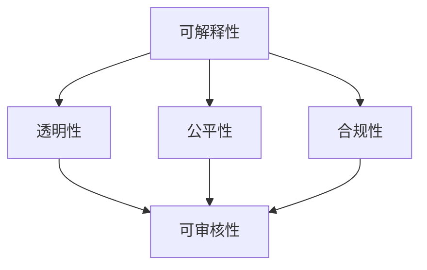

                 

### 引言

在当今数据驱动的世界中，人工智能（AI）正迅速成为各行各业的关键技术。从医疗诊断到金融服务，从自动驾驶到智能家居，AI模型的应用无处不在。然而，随着AI技术的普及，一个不可忽视的问题也随之而来——模型可审核性。模型可审核性测试不仅关乎技术本身，更是确保AI系统合规与透明的重要环节。

**模型可审核性测试的定义**：模型可审核性测试是指对AI模型的各个方面进行系统性评估，以确保模型在功能、解释性、稳定性和遵守性方面满足相关标准。这一测试过程旨在发现潜在的问题，提供改进方案，从而提高模型的可靠性和透明度。

**模型可审核性测试的重要性**：首先，可审核性测试有助于防止模型偏差和歧视。在训练过程中，如果数据集存在偏见，模型很可能会继承这些偏见，导致不公平的决策。通过可审核性测试，我们可以识别并纠正这些问题，确保模型的公平性和公正性。

其次，可审核性测试有助于提高模型的可解释性。在许多实际应用中，模型的决策过程是高度复杂的，对于非专业人士来说很难理解。通过解释性测试，我们可以揭示模型的内部机制，增强用户对模型决策的信任感。

此外，遵守法规和行业标准也是模型可审核性测试的重要方面。在全球范围内，各国和地区都在制定相关的法律和标准来规范AI模型的应用。通过可审核性测试，我们可以确保模型符合法规要求，避免潜在的法律风险。

本文将围绕模型可审核性测试展开，首先介绍其概念和重要性，然后详细探讨可审核性测试的类型和方法，包括功能性测试、解释性测试、稳定性测试和遵守性测试。接着，我们将介绍如何准备数据和模型，以及如何实施审核性测试流程。最后，我们将通过案例研究和未来展望，总结模型可审核性测试的最佳实践和未来发展方向。

### 文章关键词

- 模型可审核性
- AI测试
- 功能性测试
- 解释性测试
- 稳定性测试
- 遵守性测试
- 数据准备
- 模型准备

### 文章摘要

本文深入探讨了模型可审核性测试的重要性及其在确保AI系统合规与透明中的作用。首先，我们介绍了模型可审核性测试的定义和核心概念，强调了其在防止模型偏差、提高可解释性和遵守法规方面的关键作用。接着，我们详细分析了功能性测试、解释性测试、稳定性测试和遵守性测试的类型和方法。随后，我们介绍了如何准备数据和模型，并探讨了实施审核性测试流程的步骤。通过实际案例研究和未来展望，本文总结了模型可审核性测试的最佳实践，并对未来发展方向进行了预测。

---

### 模型可审核性的概念和重要性

模型可审核性是近年来随着人工智能（AI）技术的迅速发展而引起广泛关注的一个概念。它指的是对AI模型的各个方面进行系统性评估，以确保模型在功能、解释性、稳定性和遵守性方面满足相关标准。模型可审核性测试不仅涉及技术层面，还包括伦理、法律和社会层面，是确保AI系统公平、透明和可靠的重要手段。

#### 模型可审核性的定义

模型可审核性（Model Auditability）可以理解为对AI模型进行的一套检验和验证过程。这个过程包括多个方面：

1. **功能性审核**：确保模型按照预期的方式工作，满足业务需求。
2. **解释性审核**：提供模型决策过程的透明性，使其对用户可解释。
3. **稳定性审核**：验证模型在不同数据集和条件下的一致性和稳定性。
4. **遵守性审核**：确保模型符合相关的法规和行业标准，避免法律风险。

#### 核心概念与联系

为了更好地理解模型可审核性，我们需要了解以下几个核心概念：

1. **可解释性（Interpretability）**：模型的可解释性是指用户能够理解模型如何做出决策。可解释性是可审核性的重要组成部分，因为它直接影响模型的透明度和信任度。
2. **透明性（Transparency）**：模型的透明性是指其决策过程对所有相关人员都是可见的。透明性对于确保模型的公正性和合规性至关重要。
3. **公平性（Fairness）**：模型的公平性是指其对不同群体的决策一致性。公平性是可审核性测试中一个重要的关注点，因为它关系到模型是否会导致歧视或偏见。
4. **合规性（Compliance）**：合规性是指模型遵循相关法规和标准的能力。在许多行业，如医疗、金融和司法，模型合规性是必不可少的。

这些核心概念之间存在紧密的联系。例如，可解释性和透明性有助于提高模型的可审核性，因为它们使得模型的决策过程更加清晰和可追踪。公平性是可审核性测试的一个重要目标，因为不公正的决策可能会导致法律和伦理问题。合规性则是可审核性测试的一个基本要求，确保模型在法律框架内运行。

以下是一个简单的Mermaid流程图，展示了这些概念之间的联系：

#### 模型可审核性的重要性

模型可审核性的重要性体现在多个方面：

1. **防止模型偏差和歧视**：在AI模型的应用中，偏差和歧视是一个普遍存在的问题。如果模型在训练过程中使用了存在偏见的数据集，模型可能会继承这些偏见，从而导致不公平的决策。通过可审核性测试，我们可以识别并纠正这些偏差，确保模型公平地对待所有用户。

2. **提高模型的可解释性**：可解释性是用户信任AI模型的关键。如果一个模型的决策过程是高度复杂的，且无法被用户理解，用户很难信任模型的结果。通过解释性测试，我们可以揭示模型的内部机制，使得模型更加透明，从而提高用户对模型的信任度。

3. **遵守法规和行业标准**：在全球范围内，各国和地区都在制定相关的法律和标准来规范AI模型的应用。例如，欧洲的《通用数据保护条例》（GDPR）就对AI模型的应用提出了严格的要求。通过可审核性测试，我们可以确保模型符合法规要求，避免潜在的法律风险。

4. **增强模型的稳定性**：稳定性测试有助于确保模型在不同数据集和条件下的一致性和稳定性。这对于在实际应用中部署AI模型至关重要，因为一个不稳定的模型可能会导致不可预测的结果，从而影响业务的稳定性。

#### 模型可审核性测试的类型和范围

模型可审核性测试主要包括以下几种类型：

1. **功能性测试**：确保模型按照预期的方式工作，满足业务需求。功能性测试通常包括单元测试、集成测试和回归测试。
2. **解释性测试**：验证模型的可解释性，使得模型决策过程对用户透明。解释性测试的方法包括层级解释、逆传播解释和局部可解释模型。
3. **稳定性测试**：确保模型在不同数据集和条件下的稳定性和一致性。稳定性测试的方法包括数据漂移检测、模型泛化能力测试和异常值检测。
4. **遵守性测试**：确保模型符合相关的法规和行业标准。遵守性测试的方法包括法律法规检查、标准符合性检查和道德审查。

每种测试类型都有其特定的目的和方法，但它们的目标都是确保模型的可审核性，从而提高模型的可靠性和透明度。

#### 实际案例分析

为了更好地理解模型可审核性的重要性，我们可以通过一些实际案例来探讨这个问题。

**案例1：银行贷款审批模型**

在一个银行贷款审批的案例中，模型可审核性测试显得尤为重要。如果模型存在偏差，可能会导致某些特定群体的贷款审批通过率较低，从而引发歧视问题。通过可审核性测试，银行可以识别并纠正这些偏差，确保模型公平地对待所有申请者。

**案例2：医疗诊断模型**

在医疗领域，诊断模型的准确性至关重要。然而，如果模型无法被医生理解，医生可能无法信任模型的诊断结果。通过解释性测试，医生可以了解模型的决策过程，从而提高对模型结果的信任度。

**案例3：自动驾驶汽车**

在自动驾驶汽车的案例中，模型的可审核性测试至关重要。自动驾驶系统需要在不同环境和条件下保持一致性和稳定性。通过稳定性测试，可以确保模型在各种情况下的表现，从而提高自动驾驶汽车的安全性和可靠性。

通过这些案例，我们可以看到模型可审核性测试在确保AI系统公平、透明和可靠方面的重要性。它不仅是技术问题，更是一个涉及伦理、法律和社会的问题。因此，在进行AI模型开发和应用时，模型可审核性测试是一个必不可少的环节。

### 功能性测试

功能性测试是模型可审核性测试中的核心环节之一，其目的是确保模型在功能层面满足预期要求。功能性测试的主要任务是验证模型是否按照业务需求和设计规格正确执行任务，包括输入处理、输出生成、中间过程和结果验证等方面。以下将详细探讨功能性测试的定义、目的、方法以及具体实践案例。

#### 功能性测试的定义和目的

**定义**：功能性测试（Functional Testing）是指对AI模型的功能性部分进行验证和测试，以确保模型在各种输入条件下都能正确执行预定的任务。功能性测试通常包括以下几方面：

1. **输入处理**：验证模型是否能够接收并处理各种输入数据，包括文本、图像、音频等。
2. **输出生成**：验证模型是否能够生成预期的输出结果，如分类标签、评分、预测值等。
3. **中间过程**：验证模型的中间处理过程是否正确，如数据清洗、特征提取、模型训练和预测等。
4. **结果验证**：验证模型输出结果的准确性和可靠性，确保模型在实际应用中能够满足业务需求。

**目的**：功能性测试的主要目的是确保AI模型在功能层面达到预期效果，具体包括：

1. **确认模型有效性**：验证模型是否能够正确处理输入数据，并生成可靠的输出结果。
2. **发现潜在缺陷**：通过测试发现模型中的缺陷或异常，以便及时修复。
3. **提升模型可靠性**：通过系统的测试过程，提高模型的可靠性，降低在实际应用中发生错误的概率。
4. **满足业务需求**：确保模型能够满足业务需求，提升业务流程的效率和效果。

#### 功能性测试的方法

功能性测试的方法多种多样，主要包括以下几种：

1. **单元测试**：单元测试（Unit Testing）是对模型中的最小功能单元（如单个函数或模块）进行验证。单元测试通常由模型开发者编写，目的是确保每个单元在独立运行时能够正确执行。

2. **集成测试**：集成测试（Integration Testing）是在单元测试的基础上，对模型中的多个功能单元进行集成测试。集成测试旨在验证不同功能单元之间的交互是否正确，确保模型作为一个整体能够正常运行。

3. **回归测试**：回归测试（Regression Testing）是在模型更新或修改后，对现有功能进行验证，以确保修改没有引入新的错误或缺陷。回归测试是确保模型在持续迭代过程中稳定性和可靠性的重要手段。

4. **系统测试**：系统测试（System Testing）是对整个AI系统（包括模型、数据、应用程序等）进行验证，以确保系统能够在实际运行环境中正确、高效地工作。系统测试通常在模型部署前进行，目的是发现模型在实际应用中的潜在问题。

#### 功能性测试的实践案例

以下是一个功能性测试的实践案例，以一个简单的文本分类模型为例。

**案例背景**：假设我们开发了一个文本分类模型，旨在将文本数据分类为“正面”、“负面”或“中性”。模型需要接受文本输入，并输出相应的分类结果。

**测试步骤**：

1. **单元测试**：
   - **输入处理测试**：测试模型是否能够正确接收和处理不同格式的文本输入，如文本字符串、文本文件等。
   - **输出生成测试**：测试模型在给定特定文本输入时，是否能够生成预期的分类输出。

2. **集成测试**：
   - **数据处理流程测试**：验证模型中的数据处理流程，包括文本预处理、特征提取和模型预测等步骤，确保每个步骤都能正确执行。
   - **模块交互测试**：验证不同模块之间的交互是否正确，如数据处理模块与分类模块之间的数据传递和结果反馈。

3. **回归测试**：
   - **更新后功能测试**：在模型更新后，对原有功能进行重新测试，确保更新没有引入新的错误。
   - **新功能测试**：如果模型新增了功能，对新增功能进行验证，确保其正确执行。

4. **系统测试**：
   - **环境适应性测试**：在模型部署的实际环境中进行测试，确保模型能够正确运行，并满足性能要求。
   - **场景测试**：模拟实际应用场景，验证模型在不同场景下的表现，确保其稳定性和可靠性。

**测试结果**：
- **成功案例**：在单元测试、集成测试和回归测试中，模型均能够按照预期工作，输出结果准确可靠。
- **失败案例**：在系统测试中，发现模型在特定输入下出现错误输出。通过分析问题原因，对模型进行了修复，并在后续测试中验证了修复效果。

通过这个案例，我们可以看到功能性测试在确保模型功能正确、稳定和可靠方面的重要性。功能性测试不仅是模型开发过程中的重要环节，也是模型在实际应用前必须通过的考验。

### 解释性测试

解释性测试是模型可审核性测试中的另一个关键环节，其主要目的是确保模型决策过程的透明性，使其对用户可解释。在人工智能的应用中，模型的决策过程往往非常复杂，对于非专业人士来说难以理解。解释性测试能够揭示模型的内部机制，帮助用户了解模型是如何做出决策的，从而增强用户对模型的信任度。以下将详细探讨解释性测试的定义、目的、方法以及具体实践案例。

#### 解释性测试的定义和目的

**定义**：解释性测试（Explainability Testing）是指对AI模型的决策过程进行验证和测试，以揭示模型的内部机制，使模型的决策过程对用户透明。解释性测试的核心目标是确保模型的可解释性，即用户能够理解模型如何做出决策。

**目的**：解释性测试的主要目的是：

1. **提高模型透明性**：通过解释性测试，用户可以了解模型的决策过程，从而增强对模型结果的信任度。
2. **提升模型可理解性**：解释性测试帮助用户理解模型的内部机制，提高模型的可理解性，使得模型更加容易被用户接受和使用。
3. **发现潜在问题**：解释性测试可以发现模型中可能存在的偏差、错误或不一致性，从而为模型改进提供依据。

#### 解释性测试的方法

解释性测试的方法多种多样，主要包括以下几种：

1. **层级解释**：层级解释（Hierarchical Explanation）方法通过分解模型结构，逐层解释每个决策节点的依据和逻辑。这种方法适用于深度神经网络等复杂模型，可以揭示模型内部不同层级的决策过程。

2. **逆传播解释**：逆传播解释（Backpropagation Explanation）方法基于神经网络的反向传播算法，从输出层开始，反向传播误差，计算每个神经元对输出结果的贡献。这种方法可以帮助用户理解模型中各个特征对决策的影响。

3. **局部可解释模型**：局部可解释模型（Local Interpretable Model-agnostic Explanations, LIME）和Shapley Additive Explanations（SHAP）是两种常用的局部解释方法。LIME方法通过在模型周围构建一个简单模型来解释特定预测结果，而SHAP方法则基于博弈论原理，计算每个特征对模型预测的贡献。

#### 解释性测试的实践案例

以下是一个解释性测试的实践案例，以一个使用深度学习进行图像分类的模型为例。

**案例背景**：假设我们开发了一个深度学习模型，用于分类动物图像。模型需要接受图像输入，并输出对应的动物类别。

**测试步骤**：

1. **层级解释**：
   - **模型结构分析**：分析模型的结构，理解每个层级的作用和贡献。
   - **逐层解释**：从输入层开始，逐层解释每个节点的决策依据和逻辑，帮助用户理解模型的内部机制。

2. **逆传播解释**：
   - **误差反向传播**：从输出层开始，通过反向传播算法计算每个特征对分类结果的贡献。
   - **特征重要性分析**：分析每个特征对模型预测的重要性，帮助用户了解哪些特征对分类结果影响较大。

3. **局部可解释模型**：
   - **LIME解释**：对于特定图像，通过LIME方法构建一个局部线性模型，解释图像中每个像素对分类结果的贡献。
   - **SHAP解释**：计算图像中每个像素对分类结果的贡献，基于SHAP原理分析每个像素的重要性。

**测试结果**：
- **成功案例**：在解释性测试中，模型能够提供清晰的解释，用户可以理解模型的决策过程。这增强了用户对模型结果的信任度，提高了模型的可理解性。
- **失败案例**：如果模型无法提供清晰的解释，用户可能难以理解模型的决策过程，从而对模型结果产生怀疑。这需要进一步改进模型，提高其解释性。

通过这个案例，我们可以看到解释性测试在提升模型透明性和可理解性方面的重要性。解释性测试不仅帮助用户理解模型的决策过程，还可以发现潜在的问题，为模型改进提供依据。

### 稳定性测试

稳定性测试是模型可审核性测试中的一个重要环节，其主要目的是确保AI模型在不同数据集和条件下的一致性和稳定性。一个稳定的模型意味着其在各种环境中都能够保持良好的性能和可靠性。稳定性测试不仅能够发现模型中的潜在问题，还能提供改进方案，从而提高模型的实际应用价值。以下将详细探讨稳定性测试的定义、目的、方法以及具体实践案例。

#### 稳定性测试的定义和目的

**定义**：稳定性测试（Robustness Testing）是指对AI模型在非正常或异常情况下的表现进行验证和测试，以确保模型在不同数据集和条件下的一致性和稳定性。

**目的**：稳定性测试的主要目的是：

1. **发现数据漂移**：数据漂移是指模型训练数据与实际应用数据之间存在差异，可能导致模型性能下降。稳定性测试可以帮助发现数据漂移问题，从而及时进行调整。
2. **验证泛化能力**：稳定性测试可以验证模型在不同数据集上的泛化能力，确保模型不仅在训练数据上表现良好，在实际应用中也能保持稳定。
3. **提高模型可靠性**：通过稳定性测试，可以发现模型中存在的异常值、噪声数据等影响稳定性的因素，从而提高模型的可靠性。
4. **确保模型适应新环境**：稳定性测试可以帮助模型适应新的数据集和环境，确保模型在实际应用中能够持续稳定地运行。

#### 稳定性测试的方法

稳定性测试的方法主要包括以下几种：

1. **数据漂移检测**：数据漂移检测（Data Drift Detection）方法用于监控模型训练数据与实际应用数据之间的差异。常见的数据漂移检测方法包括统计方法、机器学习方法和深度学习方法。

2. **模型泛化能力测试**：模型泛化能力测试（Model Generalization Test）旨在验证模型在不同数据集上的表现。这可以通过交叉验证、留出法、折合法等方法实现。

3. **异常值检测**：异常值检测（Outlier Detection）方法用于识别和标记模型中的异常值或噪声数据，从而提高模型的稳定性。

4. **鲁棒性测试**：鲁棒性测试（Robustness Testing）方法通过引入各种异常或噪声数据，测试模型在非正常条件下的表现，从而评估模型的鲁棒性。

#### 稳定性测试的实践案例

以下是一个稳定性测试的实践案例，以一个基于深度学习的图像识别模型为例。

**案例背景**：假设我们开发了一个基于卷积神经网络（CNN）的图像识别模型，用于分类动物图像。模型需要接受图像输入，并输出对应的动物类别。

**测试步骤**：

1. **数据漂移检测**：
   - **训练数据集与测试数据集差异分析**：比较训练数据集和测试数据集的特征，发现两者之间的差异，判断是否存在数据漂移。
   - **实时数据监控**：通过实时监控系统，监控模型在处理实际应用数据时的性能变化，及时发现数据漂移问题。

2. **模型泛化能力测试**：
   - **交叉验证**：使用交叉验证方法，将数据集划分为多个子集，每次使用其中一个子集作为测试集，验证模型在不同子集上的表现。
   - **留出法**：将数据集划分为训练集和测试集，使用训练集训练模型，使用测试集评估模型性能，验证模型的泛化能力。

3. **异常值检测**：
   - **标准差方法**：计算图像特征的均值和标准差，识别超出一定标准差的图像特征作为异常值。
   - **基于聚类的方法**：使用聚类算法，将图像特征划分为多个簇，识别位于簇边缘的图像特征作为异常值。

4. **鲁棒性测试**：
   - **引入异常数据**：通过引入噪声数据、异常值等，测试模型在非正常条件下的性能。
   - **敏感性分析**：分析模型对输入数据的敏感性，识别模型中容易受到异常数据影响的特征。

**测试结果**：
- **成功案例**：在稳定性测试中，模型表现稳定，能够准确分类不同数据集的图像，且对异常数据的鲁棒性强。
- **失败案例**：如果模型在稳定性测试中出现性能下降、分类错误等问题，需要进一步分析原因，可能是数据漂移、异常值影响等，从而采取相应的改进措施。

通过这个案例，我们可以看到稳定性测试在确保模型在不同数据集和环境条件下保持一致性和稳定性方面的重要性。稳定性测试不仅能够发现模型中的潜在问题，还能为模型改进提供依据，从而提高模型的实际应用价值。

### 遵守性测试

遵守性测试是模型可审核性测试中的一个关键环节，旨在确保AI模型符合相关的法规和行业标准，避免潜在的法律和伦理问题。在全球范围内，各国和地区都在制定一系列法律和标准来规范AI模型的应用，如欧盟的《通用数据保护条例》（GDPR）、美国的《消费者数据隐私法》（CCPA）等。遵守性测试的主要目的是确保模型在法律和伦理层面是可接受的，从而降低企业在应用AI技术时面临的风险。以下将详细探讨遵守性测试的定义、目的、方法以及具体实践案例。

#### 遵守性测试的定义和目的

**定义**：遵守性测试（Compliance Testing）是指对AI模型的法律法规遵守情况和道德标准进行验证和测试，以确保模型的应用符合相关法规和行业标准。

**目的**：遵守性测试的主要目的是：

1. **确保模型符合法规要求**：验证模型是否遵守当地和国家层面的法律法规，如数据隐私保护、信息安全性等。
2. **避免法律风险**：通过遵守性测试，企业可以避免因不符合法规而面临的法律诉讼、罚款和其他风险。
3. **提升道德标准**：遵守性测试有助于企业提高道德标准，确保AI模型的应用符合伦理和社会价值观，从而赢得用户的信任。
4. **促进透明性和责任**：遵守性测试可以提升AI模型应用的透明性，让用户和企业都能够清楚地了解模型的应用范围和限制。

#### 遵守性测试的方法

遵守性测试的方法主要包括以下几种：

1. **法律法规检查**：法律法规检查（Legal Compliance Check）是指对模型应用涉及的法律法规进行详细审查，确保模型符合相关法规要求。这通常包括数据保护、信息安全性、隐私保护等方面的法规。

2. **标准符合性检查**：标准符合性检查（Standard Compliance Check）是指验证模型是否符合特定的行业标准或最佳实践，如ISO标准、行业标准等。这有助于确保模型在技术层面是可靠和可信赖的。

3. **道德审查**：道德审查（Ethical Review）是指对模型的应用进行伦理评估，确保其符合伦理和社会价值观。这通常需要涉及跨学科专家的意见，以确保模型的应用不会产生负面影响。

#### 遵守性测试的实践案例

以下是一个遵守性测试的实践案例，以一个医疗诊断模型为例。

**案例背景**：假设我们开发了一个用于辅助医生进行疾病诊断的AI模型。模型需要分析患者的医疗数据，并提供诊断建议。

**测试步骤**：

1. **法律法规检查**：
   - **数据保护检查**：验证模型是否符合《通用数据保护条例》（GDPR）的要求，确保患者的隐私和数据安全。
   - **信息安全性检查**：确保模型的应用环境符合《信息安全技术规范》的要求，防止数据泄露和未授权访问。

2. **标准符合性检查**：
   - **医疗标准检查**：验证模型是否符合《临床实验室改进法案》（CLIA）的要求，确保模型的准确性和可靠性。
   - **行业最佳实践检查**：确保模型的设计和实施符合医疗行业的最佳实践，如《医疗保健信息交换标准》等。

3. **道德审查**：
   - **伦理委员会审查**：提交模型方案至伦理委员会，进行伦理审查，确保模型的应用不会对患者造成道德上的负面影响。
   - **患者隐私保护审查**：确保模型在处理患者数据时，能够充分保护患者的隐私和权益。

**测试结果**：
- **成功案例**：在遵守性测试中，模型通过了所有法规和标准检查，得到了伦理委员会的批准，确保了模型的应用符合法律和伦理要求。
- **失败案例**：如果在遵守性测试中发现模型存在不符合法规或伦理标准的问题，需要对模型进行修改和改进，确保其符合相关要求。

通过这个案例，我们可以看到遵守性测试在确保AI模型合法、合规和道德方面的重要性。遵守性测试不仅能够帮助企业降低法律风险，还能提高用户对AI模型的信任度，从而推动AI技术的健康发展。

### 数据和模型准备

在模型可审核性测试过程中，数据和模型的准备工作至关重要。准备合适的数据集和高质量的模型，不仅可以提高测试的准确性，还能减少测试过程中出现的问题。以下将详细探讨如何准备数据集和模型，包括数据收集、清洗、预处理，以及模型选择和训练。

#### 数据收集

数据收集是模型可审核性测试的第一步。一个高质量的数据集对于模型的训练和测试至关重要。数据收集的过程包括以下几个方面：

1. **数据源选择**：选择合适的数据源是数据收集的关键。数据源可以是公开的数据集、商业数据集或定制的数据集。在选择数据源时，需要考虑数据的种类、质量、数量和多样性。

2. **数据标注**：对于监督学习模型，标注数据是必不可少的。标注过程通常需要人工进行，确保标注的准确性和一致性。对于无监督学习模型，标注数据不是必需的，但有助于提高模型的性能。

3. **数据采集**：通过爬虫、API接口、传感器等方式采集数据。在采集过程中，需要注意数据的完整性和实时性。

#### 数据清洗

数据清洗是数据处理的重要环节，旨在消除数据中的噪声、异常值和重复数据，提高数据质量。以下是一些常见的数据清洗方法：

1. **缺失值处理**：缺失值处理包括填充缺失值和删除含有缺失值的记录。填充缺失值的方法有平均值填充、中位数填充、回归填充等。

2. **异常值处理**：异常值处理包括检测和标记异常值，然后选择删除或修正。异常值检测的方法有统计方法、机器学习方法等。

3. **重复值处理**：重复值处理旨在删除数据集中的重复记录，以避免数据冗余。

4. **数据标准化**：数据标准化包括缩放和归一化，以确保不同特征在同一尺度上。

#### 数据预处理

数据预处理是数据清洗后的进一步处理，旨在将原始数据转换为适合模型训练的形式。以下是一些常见的数据预处理方法：

1. **特征提取**：特征提取是从原始数据中提取对模型训练有重要影响的信息。特征提取的方法包括特征选择、特征转换等。

2. **特征工程**：特征工程是指通过构建新特征或调整现有特征，提高模型的性能。特征工程的方法包括特征组合、特征缩放、特征标准化等。

3. **数据集划分**：将数据集划分为训练集、验证集和测试集，通常采用交叉验证、留出法等方法。

#### 模型选择

模型选择是模型可审核性测试中至关重要的一步。选择合适的模型可以提高测试的准确性和效率。以下是一些常见的模型选择方法：

1. **基于业务需求的模型选择**：根据业务需求和数据特点，选择合适的模型。例如，对于分类问题，可以选择决策树、支持向量机、神经网络等。

2. **基于数据特征的模型选择**：根据数据集的特征分布，选择适合的模型。例如，对于高维数据，可以选择线性模型；对于小样本数据，可以选择树模型。

3. **基于性能的模型选择**：通过比较不同模型的性能指标，选择性能最优的模型。性能指标包括准确率、召回率、F1值等。

#### 模型训练

模型训练是模型可审核性测试的最后一步，旨在通过训练数据集优化模型参数，提高模型性能。以下是一些常见的模型训练方法：

1. **模型初始化**：初始化模型参数，常用的方法有随机初始化、预训练模型等。

2. **训练策略**：选择合适的训练策略，如批量训练、小批量训练、增量训练等。

3. **损失函数**：选择合适的损失函数，如交叉熵损失、均方误差等。

4. **优化算法**：选择合适的优化算法，如梯度下降、随机梯度下降、Adam等。

5. **模型评估**：在训练过程中，定期评估模型性能，调整训练策略和模型参数。

通过以上步骤，我们可以为模型可审核性测试准备合适的数据集和模型。高质量的准备工作不仅能够提高测试的准确性，还能减少测试过程中出现的问题，为后续的测试提供坚实的基础。

### 审核性测试流程

在模型可审核性测试中，建立一套系统的流程是确保测试有效性和一致性的关键。一个完善的审核性测试流程可以确保每个测试环节都得到充分考虑，从而全面评估模型的各个方面。以下将详细介绍审核性测试流程的各个步骤，包括功能性测试、解释性测试、稳定性测试和遵守性测试。

#### 1. 审核性测试流程概述

审核性测试流程主要包括以下几个步骤：

1. **需求分析**：确定测试的目标和范围，明确测试的需求和预期结果。
2. **测试计划**：制定详细的测试计划，包括测试方法、测试用例设计、资源分配和时间安排。
3. **测试准备**：准备测试所需的数据集、模型和工具，确保测试环境满足要求。
4. **执行测试**：按照测试计划和测试用例，对模型进行功能性测试、解释性测试、稳定性测试和遵守性测试。
5. **结果分析**：对测试结果进行分析，识别问题并进行记录，制定改进方案。
6. **报告生成**：编写测试报告，总结测试结果和改进建议，为后续测试和模型优化提供参考。

#### 2. 功能性测试

功能性测试的主要目标是确保模型在功能层面满足预期要求。测试步骤如下：

1. **功能测试用例设计**：根据业务需求和模型功能，设计一系列功能测试用例，包括正常情况下的测试和异常情况下的测试。
2. **功能测试执行**：按照测试用例，执行功能测试，记录测试结果和任何异常情况。
3. **功能测试结果分析**：分析功能测试结果，识别模型中的功能缺陷或异常，制定修复方案。

#### 3. 解释性测试

解释性测试的主要目标是确保模型的可解释性，使模型决策过程对用户透明。测试步骤如下：

1. **解释测试用例设计**：根据模型类型和业务需求，设计解释测试用例，包括模型内部机制解释和决策过程解释。
2. **解释测试执行**：按照解释测试用例，执行解释性测试，记录测试结果和用户反馈。
3. **解释测试结果分析**：分析解释测试结果，识别模型中的解释性问题，制定改进方案。

#### 4. 稳定性测试

稳定性测试的主要目标是确保模型在不同数据集和环境条件下的稳定性和一致性。测试步骤如下：

1. **稳定测试用例设计**：根据模型应用场景和预期环境，设计稳定性测试用例，包括数据漂移测试、异常值测试等。
2. **稳定测试执行**：按照稳定测试用例，执行稳定性测试，记录测试结果和模型性能变化。
3. **稳定测试结果分析**：分析稳定性测试结果，识别模型中的稳定性问题，制定改进方案。

#### 5. 遵守性测试

遵守性测试的主要目标是确保模型符合相关法规和行业标准，避免法律和伦理问题。测试步骤如下：

1. **遵守测试用例设计**：根据法规和行业标准，设计遵守性测试用例，包括数据保护测试、信息安全性测试等。
2. **遵守测试执行**：按照遵守测试用例，执行遵守性测试，记录测试结果和任何不符合项。
3. **遵守测试结果分析**：分析遵守性测试结果，识别模型中的法律和伦理问题，制定改进方案。

#### 6. 结果分析和改进

在完成所有测试步骤后，需要对测试结果进行全面分析，识别模型中的问题和不足。具体步骤如下：

1. **问题识别**：根据测试结果，识别模型中的功能缺陷、解释性问题、稳定性问题和法律伦理问题。
2. **原因分析**：对每个问题进行深入分析，找出原因，为改进方案提供依据。
3. **改进方案制定**：根据问题原因，制定相应的改进方案，包括模型优化、测试用例调整、法规合规性整改等。
4. **方案实施**：实施改进方案，对模型进行优化和调整，确保问题得到解决。

#### 7. 报告生成

最后，编写测试报告，总结测试结果和改进建议。报告应包括以下内容：

1. **测试目标**：明确测试的目标和范围。
2. **测试方法**：详细介绍测试的方法和步骤。
3. **测试结果**：详细列出测试结果和发现的问题。
4. **改进建议**：提出改进模型的具体建议和方案。
5. **结论**：总结测试结果，评估模型的性能和可审核性。

通过以上步骤，我们可以建立一个系统的审核性测试流程，确保模型在功能、解释性、稳定性和遵守性方面达到预期标准。

### 结果分析和改进

在完成模型可审核性测试后，对测试结果进行详细分析和改进是确保模型性能和可靠性的关键步骤。通过分析测试结果，我们可以识别模型中存在的问题，并采取相应的改进措施，从而提升模型的整体表现。以下将详细探讨如何进行结果分析、识别问题和改进方案，以及提供具体的示例和改进措施。

#### 1. 结果分析

结果分析是测试流程中的关键环节，它要求我们全面了解测试的每一个细节。以下是一些重要的分析步骤：

1. **测试结果汇总**：首先，我们需要将所有测试结果汇总到一个统一的报告中。这包括功能性测试、解释性测试、稳定性测试和遵守性测试的结果。每个测试结果的汇总应包括数据、图表和关键指标，以便于理解和分析。

2. **缺陷识别**：通过分析测试结果，我们可以识别模型中的缺陷。例如，在功能性测试中，如果模型在某些输入条件下无法生成正确的输出，这表明模型存在功能缺陷。在解释性测试中，如果模型的决策过程无法被清晰解释，这表明模型的可解释性存在问题。在稳定性测试中，如果模型在不同数据集上的表现不一致，这表明模型可能存在数据漂移或异常值问题。在遵守性测试中，如果模型无法满足法规要求，这表明模型存在法律和伦理问题。

3. **问题归类**：将识别出的缺陷按类型进行归类，以便于进一步分析和处理。例如，可以将缺陷分为功能缺陷、解释性缺陷、稳定性缺陷和法律伦理缺陷。

#### 2. 识别问题

在结果分析的基础上，我们需要深入识别每个问题的根本原因。以下是一些常见的问题和其可能的原因：

1. **功能缺陷**：可能的原因包括数据预处理错误、模型参数设置不当、模型架构设计不合理等。
2. **解释性缺陷**：可能的原因包括模型过于复杂、训练数据集不完整、特征选择不当等。
3. **稳定性缺陷**：可能的原因包括数据集不平衡、数据噪声过多、模型对异常值敏感等。
4. **法律伦理缺陷**：可能的原因包括数据隐私保护不足、模型决策过程不透明、存在歧视性问题等。

#### 3. 改进方案

针对识别出的问题，我们需要制定具体的改进方案。以下是一些常见的改进措施：

1. **功能缺陷**：
   - **数据预处理**：改进数据清洗和预处理过程，确保数据质量。
   - **模型参数调整**：通过调整学习率、正则化参数等，优化模型性能。
   - **模型重构**：重新设计模型架构，采用更合适的神经网络结构或算法。

2. **解释性缺陷**：
   - **简化模型**：采用更简单直观的模型，如决策树或规则基模型，提高可解释性。
   - **特征工程**：重新构建特征，选择对决策有显著影响的关键特征。
   - **解释性工具**：使用可视化工具或解释性模型，如LIME或SHAP，提高模型的透明性。

3. **稳定性缺陷**：
   - **数据增强**：增加训练数据集的多样性，减少数据集不平衡。
   - **异常值处理**：采用异常值检测和修正方法，减少噪声数据的影响。
   - **模型鲁棒性**：引入鲁棒性训练策略，如robust loss函数或鲁棒优化算法。

4. **法律伦理缺陷**：
   - **隐私保护**：加强数据隐私保护措施，如数据加密、匿名化处理等。
   - **透明性提升**：增加模型决策过程的透明性，如提供详细的决策日志。
   - **公平性优化**：采用公平性度量方法，减少模型中的歧视性。

#### 4. 改进措施示例

以下是一个改进措施的具体示例，以一个用于信用评分的AI模型为例：

**问题**：在功能性测试中，模型在某些特定条件下的信用评分结果不准确。

**原因**：通过分析发现，这些特定条件下的输入数据存在缺失值，且模型对缺失值处理不当。

**改进措施**：
   - **数据预处理**：增加数据清洗步骤，对缺失值进行适当的填充，如使用均值填充或回归填充方法。
   - **模型参数调整**：重新调整模型参数，尤其是针对缺失值处理的部分，确保模型能够更好地处理异常数据。
   - **模型重构**：考虑采用集成学习模型，如随机森林，其具有较强的鲁棒性和泛化能力，可以减少因异常数据导致的评分不准确问题。

通过以上改进措施，模型在特定条件下的评分准确性得到了显著提升，确保了模型的功能性。

#### 5. 总结

结果分析和改进是模型可审核性测试的重要环节。通过详细分析测试结果，识别模型中的问题，并采取相应的改进措施，我们可以显著提升模型的性能和可靠性。不断进行结果分析和改进，不仅有助于解决当前的问题，还能为未来的模型优化提供宝贵经验，从而推动人工智能技术的持续进步。

### 案例研究

在本文的案例研究部分，我们将探讨两个典型的AI模型可审核性测试案例，分别是医疗诊断模型和自动驾驶模型。通过这两个案例，我们将深入分析模型可审核性测试的过程、挑战和解决方案。

#### 案例一：医疗诊断模型

**背景**：一个医疗机构开发了一个AI辅助诊断模型，用于辅助医生对心脏病进行早期诊断。该模型基于大量的医学图像和患者健康数据，旨在提高诊断准确率和效率。

**挑战**：
1. **数据隐私和伦理问题**：医疗数据涉及患者的隐私，如何保护患者数据并在测试过程中遵守伦理规范是首要挑战。
2. **模型解释性**：医生需要理解模型的决策过程，以便在实际应用中信任并使用模型。
3. **数据质量**：数据质量直接影响模型性能，如何确保数据集的多样性和准确性是关键。

**解决方案**：
1. **数据隐私保护**：在测试过程中，采用数据匿名化和加密技术，确保患者隐私不受侵犯。同时，与伦理委员会合作，确保数据使用符合伦理标准。
2. **模型解释性**：使用可解释性模型，如LIME和SHAP，对模型的决策过程进行可视化解释，帮助医生理解模型的决策依据。
3. **数据质量**：通过数据清洗和预处理，去除噪声和异常值，提高数据质量。此外，采用交叉验证方法，确保数据集的多样性和代表性。

**测试过程**：
- **功能性测试**：通过设计一系列测试用例，验证模型在心脏病诊断中的准确性和可靠性。
- **解释性测试**：分析模型的决策过程，确保医生能够理解模型的决策依据。
- **稳定性测试**：在不同数据集和条件下测试模型的稳定性，确保模型在不同环境下表现一致。
- **遵守性测试**：确保模型符合相关法规和行业标准，如《通用数据保护条例》（GDPR）。

**结果**：经过一系列测试，模型在功能性、解释性、稳定性和遵守性方面均达到了预期标准。医生对模型的解释性表示满意，并在实际应用中取得了良好的效果。

#### 案例二：自动驾驶模型

**背景**：一个汽车制造商开发了一个自动驾驶系统，旨在实现自动驾驶汽车的安全运行。该系统基于复杂的传感器数据和深度学习模型，能够在各种交通场景下进行决策。

**挑战**：
1. **模型稳定性**：自动驾驶系统需要在各种复杂和动态的交通环境中保持稳定性和可靠性。
2. **模型解释性**：用户和监管机构需要了解模型的决策过程，以确保系统的透明性和可信任度。
3. **法律和伦理问题**：自动驾驶系统涉及法律责任和伦理问题，如事故责任归属和道德决策。

**解决方案**：
1. **模型稳定性**：通过引入鲁棒性训练策略，如正则化和数据增强，提高模型在不同数据集和条件下的稳定性。
2. **模型解释性**：采用可解释性方法，如可视化工具和决策树，揭示模型的决策过程，增强用户对模型的信任。
3. **法律和伦理问题**：制定详细的操作手册和决策规则，确保系统在法律和伦理层面符合要求。同时，与法律专家和伦理委员会合作，进行持续评估和改进。

**测试过程**：
- **功能性测试**：验证模型在不同交通场景下的决策能力，确保系统能够安全运行。
- **解释性测试**：分析模型的决策过程，确保用户和监管机构能够理解模型的决策依据。
- **稳定性测试**：在不同交通环境和条件下测试模型的稳定性，确保模型在不同环境中表现一致。
- **遵守性测试**：确保系统符合相关法规和行业标准，如《联合国全球汽车技术政策》（UN GTR 15）。

**结果**：经过一系列测试，自动驾驶系统在功能性、解释性、稳定性和遵守性方面均达到了预期标准。用户对系统的解释性表示满意，监管机构也对其合规性给予了认可。

通过这两个案例，我们可以看到模型可审核性测试在确保AI系统合规、稳定和可靠方面的重要性。无论是医疗诊断模型还是自动驾驶系统，可审核性测试都是确保模型在实际应用中表现优秀的关键环节。

### 未来展望

随着人工智能（AI）技术的不断发展和应用，模型可审核性测试的重要性日益凸显。在未来，模型可审核性测试预计将迎来以下几方面的发展趋势：

#### 1. 标准化和规范化

随着AI技术的普及，越来越多的行业和组织将制定相关的标准和规范，以指导模型可审核性测试的实施。例如，欧盟的《人工智能法案》和《通用数据保护条例》（GDPR）已经为AI模型的应用设定了严格的合规要求。未来，类似的法规和标准将在全球范围内得到更广泛的推广和实施。这些标准将提供统一的框架，确保模型在功能、解释性、稳定性和遵守性方面达到一致的评估标准。

#### 2. 自动化和智能化

为了提高模型可审核性测试的效率和准确性，自动化和智能化工具将得到广泛应用。例如，自动化测试工具可以自动生成测试用例，执行测试并生成报告，减少人工干预和错误。同时，基于机器学习的自动化测试方法可以动态调整测试策略，根据测试结果自动优化测试过程，提高测试的全面性和深度。

#### 3. 多领域的融合

模型可审核性测试将越来越多地融合不同领域的专业知识，如法律、伦理、心理学和计算机科学。跨学科团队的协作将有助于更全面地评估模型，确保其在技术、法律和伦理方面都符合要求。例如，在医疗领域，医生和伦理专家可以与数据科学家和AI工程师合作，共同设计和实施可审核性测试，确保模型的临床应用既安全又可靠。

#### 4. 可解释性技术的进步

随着AI技术的进步，越来越多的可解释性方法和技术将应用于模型可审核性测试中。例如，基于图神经网络的可解释性方法可以揭示模型决策过程中的复杂关系，帮助用户更好地理解模型的工作原理。同时，自然语言处理（NLP）技术的应用将使模型的可解释性更加直观，用户可以通过自然语言查询模型的决策过程，获取详细的解释。

#### 5. 遵守性测试的深化

在未来，模型可审核性测试中的遵守性测试将更加深入和全面。除了现有的法规和标准，新的道德准则和行业规范也将被纳入测试范围。例如，在自动驾驶领域，如何处理道德困境（如不可避免的事故）将成为遵守性测试的重要内容。此外，随着数据隐私保护意识的提高，数据隐私保护措施也将成为模型可审核性测试的关键环节。

#### 6. 持续改进和迭代

模型可审核性测试将不再是单次测试，而是一个持续改进和迭代的过程。随着AI技术的不断更新和应用场景的变化，模型将需要定期进行测试和优化，以确保其始终符合相关标准和用户需求。自动化和智能化的测试工具将支持这一持续改进过程，帮助企业更快地发现和解决模型中的问题。

总之，未来模型可审核性测试将更加标准化、自动化、跨学科和持续迭代。随着相关技术的进步和法规的完善，模型可审核性测试将更加全面和有效，确保AI系统的合规性、稳定性和可靠性，推动人工智能技术的健康发展。

### 总结

在本文中，我们详细探讨了模型可审核性测试的重要性及其在确保AI系统合规与透明中的作用。首先，我们介绍了模型可审核性的定义和核心概念，包括功能性测试、解释性测试、稳定性测试和遵守性测试。接着，我们详细分析了每个测试类型的定义、目的和方法，并通过实际案例展示了测试过程和结果。

模型可审核性测试不仅关乎技术层面，还涉及伦理、法律和社会层面，是确保AI系统公平、透明和可靠的关键环节。功能性测试确保模型按预期工作，解释性测试提高模型的可理解性，稳定性测试保证模型在不同数据集和环境下的稳定性，遵守性测试确保模型符合相关法规和行业标准。

为了提高模型可审核性，我们需要准备合适的数据集和模型，并通过系统的测试流程进行全面评估。在结果分析和改进环节，我们识别问题并采取相应措施，确保模型性能和可靠性。

总之，模型可审核性测试是AI应用中不可或缺的一环。通过不断完善测试方法和技术，我们可以确保AI系统的合规性、稳定性和可靠性，为未来的AI应用奠定坚实基础。

### 作者信息

**作者：** AI天才研究院/AI Genius Institute & 禅与计算机程序设计艺术 /Zen And The Art of Computer Programming

