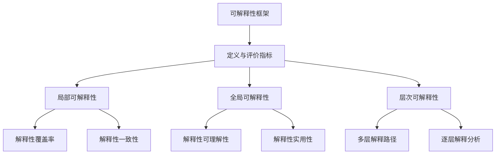

                 

### 摘要

本文旨在深入探讨人工智能（AI）模型的可解释性分析，以增强AI决策的透明度。随着AI技术的广泛应用，其决策过程的不透明性日益凸显，成为制约AI技术进一步发展的关键因素。本文首先介绍了AI模型不可解释性所带来的问题，如信任危机、法律合规性等，并强调了可解释性在提升AI决策透明度中的重要性。随后，文章从理论基础、核心算法与原理、应用实践以及未来展望四个方面，系统性地分析了可解释性在AI领域的应用和挑战。首先，我们定义了可解释性框架，并介绍了评价指标和方法。接着，深入讲解了特征可解释性和模型解释方法，通过伪代码和数学模型加以阐述。然后，本文探讨了可解释性在医疗诊断、金融风控、人脸识别和自动驾驶等领域的应用，并结合实际案例进行了详细分析。最后，文章展望了可解释性技术的未来发展趋势，包括新兴技术、隐私保护和伦理挑战等方面。通过本文的探讨，我们希望为AI领域的研究者提供有价值的参考，推动可解释性技术的发展。

### 引言与背景

近年来，人工智能（AI）技术在全球范围内取得了令人瞩目的进展，从自动驾驶汽车到智能医疗诊断，AI已经在多个领域展现了其巨大的潜力。然而，随着AI技术的广泛应用，一个不可忽视的问题也逐渐浮出水面：AI模型的不可解释性。不可解释性指的是AI模型在做出决策或预测时，其内部机制和决策过程对人类用户而言是难以理解的。这种不可解释性不仅限制了AI技术的普及和应用，还带来了诸多挑战和问题。

首先，不可解释性引发了信任危机。在许多应用场景中，如医疗诊断、金融风控和司法判决等，决策的透明度和可信度至关重要。如果AI模型的决策过程不透明，用户很难对其产生信任，这可能导致用户对AI系统的抵触情绪，限制其应用范围。其次，不可解释性带来了法律合规性问题。在某些领域，如金融监管和司法判决，法律要求决策过程必须透明，以确保公正性和合法性。如果AI模型的决策过程不透明，将难以满足法律合规要求，可能导致法律纠纷。

为了解决这些问题，增强AI模型的可解释性显得尤为重要。可解释性指的是AI模型能够提供足够的解释，使得其决策过程对用户透明和可理解。通过提升可解释性，不仅可以增强用户对AI系统的信任，还可以提高AI技术的应用广度和深度。此外，可解释性还可以帮助研究人员更好地理解AI模型的工作原理，从而推动AI技术的持续发展。

本文旨在深入探讨AI模型的可解释性分析，以增强AI决策的透明度。我们将首先介绍可解释性框架，包括定义、评价指标和方法。接着，本文将详细讲解特征可解释性和模型解释方法，并通过伪代码和数学模型加以阐述。此外，本文还将探讨可解释性在特定领域的应用，如医疗诊断、金融风控、人脸识别和自动驾驶，并结合实际案例进行详细分析。最后，本文将展望可解释性技术的未来发展趋势，包括新兴技术、隐私保护和伦理挑战等方面。通过本文的探讨，我们希望为AI领域的研究者提供有价值的参考，推动可解释性技术的发展。

### 第1章：引言

#### 1.1 书籍主题与目的

本书的主题是深入探讨人工智能（AI）模型的可解释性分析，以增强AI决策的透明度。在当今时代，人工智能技术的迅猛发展已经深入到我们生活的方方面面，从自动驾驶汽车到智能医疗诊断，AI的应用前景看似一片光明。然而，随着AI技术的广泛应用，一个不可忽视的问题也逐渐浮出水面：AI模型的不可解释性。不可解释性不仅制约了AI技术的普及和应用，还引发了信任危机和法律合规性问题。因此，提升AI模型的可解释性已成为当前研究的一个重要方向。

本书的目的是为AI领域的研究者提供一个系统、全面的指南，以了解和掌握可解释性分析的方法和技术。通过阅读本书，读者将能够：

1. 理解可解释性的核心概念和重要性。
2. 掌握可解释性框架的定义、评价指标和方法。
3. 学习特征可解释性和模型解释方法，并通过伪代码和数学模型进行阐述。
4. 了解可解释性在特定领域的应用，如医疗诊断、金融风控、人脸识别和自动驾驶。
5. 探索可解释性技术的未来发展趋势，包括新兴技术、隐私保护和伦理挑战。

本书的结构安排如下：

- **第一部分：引言与背景**：介绍AI模型不可解释性的问题以及可解释性在AI决策中的重要性，为后续章节的探讨打下基础。
- **第二部分：理论基础**：详细讲解可解释性框架，包括定义、评价指标和方法，以及Mermaid流程图来展示框架原理。
- **第三部分：核心算法与原理**：深入探讨特征可解释性和模型解释方法，通过伪代码和数学模型进行详细阐述。
- **第四部分：应用实践**：分析可解释性在医疗诊断、金融风控、人脸识别和自动驾驶等领域的应用，并结合实际案例进行详细讲解。
- **第五部分：未来展望与挑战**：探讨可解释性的未来发展趋势，包括新兴技术、隐私保护和伦理挑战。

通过本书的系统讲解，读者将能够全面了解和掌握可解释性分析的方法和技术，为AI技术的发展和应用提供有力支持。

#### 1.2 AI模型不可解释性的问题

人工智能（AI）模型在众多领域取得了显著成果，但其不可解释性却成为制约其广泛应用的关键问题。不可解释性指的是AI模型在做出决策或预测时，其内部机制和决策过程难以被人类理解和解释。这种不可解释性不仅影响了AI模型的透明度和可信度，还带来了以下问题：

首先，不可解释性引发了信任危机。在许多应用场景中，如医疗诊断、金融风控和司法判决等，决策的透明度和可信度至关重要。如果AI模型的决策过程不透明，用户很难对其产生信任，这可能导致用户对AI系统的抵触情绪，限制其应用范围。例如，在医疗诊断中，医生需要理解诊断结果是如何得出的，以便进行进一步的治疗决策。如果AI模型无法提供清晰的解释，医生可能无法完全信任AI的诊断结果，从而影响到患者的治疗效果。

其次，不可解释性带来了法律合规性问题。在某些领域，如金融监管和司法判决，法律要求决策过程必须透明，以确保公正性和合法性。如果AI模型的决策过程不透明，将难以满足法律合规要求，可能导致法律纠纷。例如，在金融风控中，银行需要确保其贷款审批过程透明，以便用户了解其贷款决策依据。如果AI模型无法提供详细的解释，银行可能面临法律风险，从而影响其业务运营。

此外，不可解释性还限制了AI模型的可操作性和可调整性。在许多应用场景中，用户可能需要根据实际情况调整AI模型的参数或决策规则。如果AI模型无法提供清晰的解释，用户将难以理解调整的影响，从而影响模型的性能和效果。例如，在自动驾驶中，用户可能需要根据道路状况和交通环境调整自动驾驶系统的参数。如果系统无法提供详细的解释，用户将难以判断调整的合理性和效果。

为了解决这些问题，提升AI模型的可解释性变得尤为重要。通过提供清晰的解释，用户可以更好地理解AI模型的决策过程，增强对其的信任和依赖。此外，可解释性还可以帮助研究人员更好地理解AI模型的工作原理，从而推动AI技术的持续发展。因此，研究和应用可解释性技术已成为当前AI领域的一个重要研究方向。

#### 1.3 可解释性在AI决策中的重要性

可解释性在人工智能（AI）决策中的重要性不可低估。随着AI技术的广泛应用，决策过程的透明度和可信度已成为影响其成功应用的关键因素。可解释性指的是AI模型能够提供足够的解释，使得其决策过程对用户透明和可理解。以下是可解释性在AI决策中的几个关键作用：

1. **增强用户信任**：透明和可理解的决策过程能够增强用户对AI系统的信任。在许多应用场景中，如医疗诊断、金融风控和司法判决等，用户需要了解决策是如何得出的，以确保其公正性和合法性。如果AI模型能够提供清晰的解释，用户可以更好地理解其决策过程，从而增加对其的信任度。例如，在医疗诊断中，医生需要理解AI系统如何得出诊断结果，以便进行进一步的治疗决策。如果AI模型无法提供详细的解释，医生可能无法完全信任AI的诊断结果，从而影响到患者的治疗效果。

2. **促进合作与决策**：在许多应用场景中，人类用户需要与AI系统共同做出决策。如果AI模型的可解释性较差，用户可能无法理解其决策过程，从而影响合作效果。相反，如果AI模型能够提供清晰的解释，用户可以更好地理解其决策逻辑，从而促进合作与决策的顺利进行。例如，在金融风控中，银行需要确保其贷款审批过程透明，以便用户了解其贷款决策依据。如果AI模型无法提供详细的解释，用户可能对银行的决策产生质疑，从而影响银行与用户之间的合作关系。

3. **提高可操作性和可调整性**：在许多应用场景中，用户可能需要根据实际情况调整AI模型的参数或决策规则。如果AI模型的可解释性较差，用户将难以理解调整的影响，从而影响模型的性能和效果。相反，如果AI模型能够提供清晰的解释，用户可以更好地理解调整的影响，从而提高其可操作性和可调整性。例如，在自动驾驶中，用户可能需要根据道路状况和交通环境调整自动驾驶系统的参数。如果系统无法提供详细的解释，用户将难以判断调整的合理性和效果，从而影响自动驾驶系统的安全性。

4. **促进AI技术的持续发展**：可解释性不仅对用户具有重要意义，也对研究人员具有重要意义。通过提供清晰的解释，研究人员可以更好地理解AI模型的工作原理，从而推动AI技术的持续发展。例如，通过分析可解释性，研究人员可以识别出AI模型中存在的问题和缺陷，从而改进模型的设计和优化方法。

总之，可解释性在AI决策中具有重要作用。通过提供透明和可理解的决策过程，可解释性不仅能够增强用户对AI系统的信任，促进合作与决策，提高可操作性和可调整性，还能够推动AI技术的持续发展。因此，研究和应用可解释性技术已成为当前AI领域的一个重要研究方向。

#### 1.4 书籍结构概述

本书旨在深入探讨人工智能（AI）模型的可解释性分析，以增强AI决策的透明度。为了系统性地介绍这一主题，本书分为五个主要部分，每个部分都有其独特的重点和目标。

**第一部分：引言与背景**  
本部分主要介绍AI模型不可解释性的问题及其带来的挑战。我们将讨论不可解释性引发的用户信任危机和法律合规性问题，并阐述可解释性在AI决策中的重要性。通过这一部分的探讨，我们将为后续章节的深入分析打下基础。

**第二部分：理论基础**  
在第二部分，我们将详细讲解可解释性框架，包括其定义、评价指标和方法。通过引入Mermaid流程图，我们将展示可解释性框架的原理，帮助读者更好地理解其结构和作用。这一部分旨在为读者提供坚实的理论基础，为后续的算法和原理讲解做好准备。

**第三部分：核心算法与原理**  
第三部分将深入探讨特征可解释性和模型解释方法。我们将介绍各种特征选择和提取方法，并通过伪代码和数学模型详细阐述。此外，我们还将讨论局部解释和全局解释方法，以及如何通过可视化手段展示模型解释。这一部分的目标是帮助读者掌握可解释性的核心算法和原理，为实际应用打下基础。

**第四部分：应用实践**  
在第四部分，我们将探讨可解释性在特定领域的应用，如医疗诊断、金融风控、人脸识别和自动驾驶。我们将结合实际案例进行详细分析，展示可解释性在提高决策透明度和可信度方面的具体应用。这一部分的目标是展示可解释性的实际效果和潜在价值。

**第五部分：未来展望与挑战**  
最后一部分将探讨可解释性技术的未来发展趋势，包括新兴技术、隐私保护和伦理挑战。我们将讨论可解释性与隐私保护的平衡，以及可解释性在伦理和法律层面的挑战。这一部分的目标是展望可解释性技术的未来，为读者提供继续研究和应用的启示。

通过以上五个部分的系统讲解，本书希望为读者提供一个全面、深入的指南，帮助理解和掌握可解释性分析的方法和技术，为AI技术的持续发展和应用提供有力支持。

### 第二部分：理论基础

#### 第2章：可解释性框架

在探讨人工智能（AI）模型的可解释性时，构建一个清晰且系统的可解释性框架至关重要。本章节将详细讲解可解释性框架的定义、关键组成部分及其在AI模型中的重要性。

#### 2.1 可解释性的定义

可解释性指的是AI模型在做出决策或预测时，能够向用户清晰、准确地解释其内部机制和决策过程。这种解释不仅包括模型如何处理输入数据，还包括如何从输入数据推导出最终的输出结果。可解释性的目标是使得AI模型的决策过程透明和可理解，从而增强用户对模型的信任和依赖。

从技术角度来看，可解释性可以分为两个层次：特征可解释性和模型解释性。特征可解释性关注模型如何处理输入特征，而模型解释性关注整个模型的决策逻辑和决策过程。

#### 2.2 可解释性与透明度的关系

透明度是可解释性的核心要素之一。透明度指的是AI模型在决策过程中的各个步骤和参数对用户可见的程度。高透明度的模型能够提供详细的内部信息，使用户能够清晰地理解模型的决策过程。而低透明度的模型则可能隐藏其内部机制，使得用户难以理解其决策依据。

可解释性与透明度密切相关。一个高度可解释的模型通常具有较高的透明度，因为它能够提供详细的内部信息和解释。相反，一个低可解释性的模型通常具有较低的透明度，因为它无法提供足够的解释信息。

#### 2.3 可解释性的层次

可解释性框架可以根据解释的粒度和范围分为不同的层次。以下是几个常见的可解释性层次：

1. **局部可解释性**：局部可解释性关注模型的局部决策过程，通常用于解释单个数据点或样本的决策结果。局部可解释性通过分析模型在特定输入下的决策路径和权重分配，帮助用户理解模型是如何处理特定数据的。常见的局部解释方法包括局部模型解释（如LIME）和Shapley值。

2. **全局可解释性**：全局可解释性关注模型的总体决策逻辑和特征重要性。全局解释方法通常用于评估模型在整体上的决策过程，帮助用户理解模型对输入特征的依赖程度和权重分配。常见的全局解释方法包括特征重要性评估（如特征选择和特征提取）和模型解释（如决策树和神经网络的可视化）。

3. **层次可解释性**：层次可解释性结合了局部和全局解释方法，通过多个层次的分析来提供全面的解释。这种方法通常用于复杂模型，如深度神经网络，通过逐层解释来揭示模型的决策过程。

#### 2.4 可解释性评价指标

为了评估AI模型的可解释性，研究者们提出了多种评价指标。以下是几个常见的可解释性评价指标：

1. **解释性覆盖率**：解释性覆盖率衡量模型解释部分占总决策过程的比重。高解释性覆盖率表示模型能够提供详细的解释，而低解释性覆盖率则表示模型解释部分较少。

2. **解释性一致性**：解释性一致性衡量模型在不同输入下的解释结果是否一致。一致性越高，表示模型解释具有稳定性，反之则可能存在不确定性。

3. **解释性可理解性**：解释性可理解性衡量用户对模型解释的理解程度。高可理解性表示用户能够轻松理解模型的解释，而低可理解性则可能需要额外的解释和培训。

4. **解释性实用性**：解释性实用性衡量模型解释在实际应用中的实用性。高实用性表示模型解释能够为用户提供有用的信息，而低实用性则可能无法满足实际需求。

#### 2.5 Mermaid流程图：可解释性框架原理

为了更直观地展示可解释性框架的原理，我们可以使用Mermaid流程图来描述其组成部分和关系。以下是可解释性框架的Mermaid流程图：



通过上述Mermaid流程图，我们可以清晰地看到可解释性框架的各个组成部分及其相互关系，有助于读者更好地理解可解释性的概念和作用。

#### 结论

综上所述，可解释性框架是理解AI模型决策过程的重要工具。通过定义、评价指标和多种解释层次，可解释性框架能够帮助用户更好地理解AI模型的决策逻辑，增强模型的透明度和可信度。在后续章节中，我们将进一步探讨特征可解释性和模型解释方法，并通过伪代码和数学模型进行详细阐述。

### 第3章：特征可解释性

在AI模型的可解释性分析中，特征可解释性是一个关键概念。特征可解释性关注的是模型如何处理输入特征，并揭示特征对模型决策的影响。本章将详细探讨特征可解释性的重要性、相关方法以及如何通过伪代码和数学模型来阐述。

#### 3.1 特征选择与重要性评估

特征选择是指从原始特征集合中选择最有代表性的特征，以减少数据维度和提高模型性能。重要性评估则是评估每个特征对模型决策的重要性。特征选择与重要性评估是特征可解释性的基础。

1. **特征选择方法**：
   - **主成分分析（PCA）**：PCA通过线性变换将原始特征映射到新的正交特征空间，从而降低数据维度。选择主成分作为特征可以最大程度地保留原始数据的方差。
   - **特征重要性筛选**：通过模型训练过程中评估每个特征的重要性，通常使用特征贡献率或特征分数来进行筛选。常用的方法包括随机森林和Lasso回归。

2. **重要性评估方法**：
   - **基于模型的评估**：如随机森林模型中的特征重要性，可以通过模型训练过程中统计每个特征对决策分裂的贡献。
   - **基于统计的评估**：如互信息（MI）和权重系数法，通过计算特征与目标变量之间的相关性或权重系数来评估特征的重要性。

#### 3.2 特征提取方法

特征提取是从原始数据中生成新特征的过程，有助于提高模型的可解释性。以下是一些常用的特征提取方法：

1. **自动特征提取**：
   - **自动编码器（Autoencoder）**：通过训练一个编码器网络来压缩数据，并将压缩后的数据视为新的特征表示。
   - **对抗性生成网络（GAN）**：通过生成对抗网络训练生成新的特征表示，这些特征可以增强数据的区分能力。

2. **基于规则的提取**：
   - **聚类特征提取**：通过聚类算法如K-means，将数据分为多个簇，每个簇的中心点可作为特征。
   - **特征组合**：通过组合原始特征生成新特征，如特征交叉或特征加权。

#### 3.3 特征可视化

特征可视化是将特征信息以图形化方式呈现，有助于用户直观地理解特征之间的关系和重要性。以下是一些常用的特征可视化方法：

1. **散点图**：通过在二维或三维空间中绘制样本点，展示特征之间的相关性。
2. **热力图**：通过颜色映射展示特征之间的相似性或相关性，适用于高维数据。
3. **箱线图**：用于展示特征分布的统计信息，如均值、中位数和四分位数。

#### 3.4 伪代码：特征可解释性算法

以下是一个简化的伪代码，用于实现特征选择和重要性评估：

```python
# 特征选择与重要性评估伪代码
def feature_selection_and_evaluation(data, model):
    # 数据预处理
    processed_data = preprocess_data(data)
    
    # 特征选择
    selected_features = select_features(processed_data)
    
    # 特征重要性评估
    importance_scores = model.evaluate_importance(selected_features)
    
    # 返回特征选择结果和重要性评分
    return selected_features, importance_scores

# 示例：随机森林特征重要性评估
from sklearn.ensemble import RandomForestClassifier

# 训练模型
model = RandomForestClassifier()
model.fit(X_train, y_train)

# 评估特征重要性
selected_features, importance_scores = feature_selection_and_evaluation(X_train, model)

# 输出特征重要性
print("Feature importance scores:", importance_scores)
```

#### 3.5 数学模型与解释

为了更好地理解特征可解释性，我们可以借助数学模型进行阐述。以下是一个简化的线性回归模型，用于解释特征对目标变量的影响：

$$
y = \beta_0 + \beta_1 \cdot x_1 + \beta_2 \cdot x_2 + ... + \beta_n \cdot x_n + \epsilon
$$

其中，$y$ 是目标变量，$x_1, x_2, ..., x_n$ 是输入特征，$\beta_0, \beta_1, \beta_2, ..., \beta_n$ 是模型的权重参数，$\epsilon$ 是误差项。

通过计算每个特征对应的权重参数 $\beta_i$，我们可以评估特征对目标变量 $y$ 的影响大小。权重参数越大，表示该特征对模型决策的影响越大。

#### 3.6 结论

特征可解释性是理解AI模型决策过程的重要部分。通过特征选择和重要性评估，我们可以识别出对模型决策有显著影响的特征，并通过可视化方法来展示特征之间的关系和重要性。通过伪代码和数学模型，我们可以更深入地理解特征可解释性的算法和原理。在后续章节中，我们将继续探讨模型解释方法，以进一步揭示AI模型的整体决策逻辑。

### 第4章：模型解释方法

在人工智能（AI）领域，模型解释方法是一种关键工具，它能够帮助用户理解AI模型的决策过程。本章将详细探讨模型解释的类型、局部解释方法、全局解释方法以及模型解释的可视化，并通过伪代码和数学模型进行详细阐述。

#### 4.1 模型解释的类型

模型解释可以分为局部解释和全局解释两种类型。局部解释关注模型在单个数据点或样本上的决策过程，而全局解释则关注模型在整体上的决策逻辑。

1. **局部解释**：
   - **局部模型解释**：通过分析单个数据点的决策路径和权重分配，帮助用户理解模型在特定输入下的决策过程。常见的方法包括LIME（局部可解释模型解释）和SHAP（SHapley Additive exPlanations）。
   - **局部特征重要性**：通过评估单个数据点中每个特征对模型决策的重要性，帮助用户理解哪些特征对特定数据点的决策有显著影响。

2. **全局解释**：
   - **全局模型解释**：通过分析模型的总体决策逻辑和特征依赖关系，帮助用户理解模型在整体上的决策过程。常见的方法包括特征重要性评估、决策树的可视化和神经网络的可视化。
   - **全局特征依赖性**：通过评估特征之间的依赖关系，帮助用户理解模型对不同特征的依赖程度。

#### 4.2 局部解释方法

局部解释方法主要关注模型在单个数据点上的解释能力。以下是一些常见的局部解释方法：

1. **LIME（局部可解释模型解释）**：
   - **原理**：LIME通过生成一个局部线性模型来解释原始模型的决策。它将原始模型视为一个黑盒，通过在该模型周围生成多个类似样本，并拟合一个线性模型来解释原始模型的决策。
   - **伪代码**：
     ```python
     # LIME伪代码
     def lime_explanation(model, x, feature_names):
         # 生成类似样本
         similar_samples = generate_similar_samples(x, model)
         # 拟合局部线性模型
         linear_model = fit_linear_model(similar_samples, y)
         # 计算解释
         explanation = compute_local_explanation(linear_model, x, feature_names)
         return explanation
     ```

2. **SHAP（SHapley Additive exPlanations）**：
   - **原理**：SHAP基于博弈论中的Shapley值，为每个特征分配一个贡献值，表示该特征对模型决策的贡献大小。
   - **伪代码**：
     ```python
     # SHAP伪代码
     def shap_explanation(model, x, feature_names):
         # 计算Shapley值
         shap_values = compute_shap_values(model, x, feature_names)
         # 生成解释
         explanation = generate_explanation(shap_values, feature_names)
         return explanation
     ```

#### 4.3 全局解释方法

全局解释方法主要关注模型的整体决策逻辑和特征依赖关系。以下是一些常见的全局解释方法：

1. **特征重要性评估**：
   - **原理**：通过分析模型在训练过程中特征的重要性得分，帮助用户理解哪些特征对模型决策有显著影响。
   - **伪代码**：
     ```python
     # 特征重要性评估伪代码
     def feature_importance(model, feature_names):
         # 训练模型
         model.fit(X_train, y_train)
         # 评估特征重要性
         importance_scores = model.feature_importances_
         # 生成解释
         explanation = generate_importance_explanation(importance_scores, feature_names)
         return explanation
     ```

2. **决策树可视化**：
   - **原理**：通过可视化决策树的结构，帮助用户理解模型的决策路径和特征选择。
   - **伪代码**：
     ```python
     # 决策树可视化伪代码
     def visualize_decision_tree(model):
         # 导入可视化库
         from sklearn.tree import plot_tree
         # 可视化决策树
         plot_tree(model, feature_names=feature_names, class_names=class_names)
     ```

3. **神经网络可视化**：
   - **原理**：通过可视化神经网络的权重和激活值，帮助用户理解模型在各个层的决策过程。
   - **伪代码**：
     ```python
     # 神经网络可视化伪代码
     def visualize_neural_network(model):
         # 导入可视化库
         from tensorflow.keras.utils import plot_model
         # 可视化神经网络
         plot_model(model, to_file='model_visualization.png', show_shapes=True)
     ```

#### 4.4 模型解释的可视化

模型解释的可视化是一种强大的工具，它能够将复杂的模型解释转化为直观的图形，帮助用户更好地理解模型的决策过程。以下是一些常见的数据可视化方法：

1. **热力图**：
   - **原理**：通过颜色映射展示特征之间的相关性或模型权重。
   - **应用**：用于展示特征的重要性或模型在不同输入下的响应。

2. **条形图**：
   - **原理**：通过条形的高度或长度展示不同类别的特征值。
   - **应用**：用于展示特征在不同样本中的分布情况。

3. **散点图**：
   - **原理**：通过在二维或三维空间中绘制样本点，展示特征之间的相关性。
   - **应用**：用于展示特征在不同样本中的关系。

#### 4.5 伪代码：模型解释方法

以下是一个简化的伪代码，用于实现模型解释的方法：

```python
# 模型解释伪代码
def model_explanation(model, x, feature_names):
    # 局部解释
    local_explanation = lime_explanation(model, x, feature_names)
    # 全局解释
    global_explanation = feature_importance(model, feature_names)
    # 可视化解释
    visualize_explanation(local_explanation, global_explanation)
    return local_explanation, global_explanation

# 示例：使用LIME和特征重要性进行模型解释
from lime import lime_tabular
from sklearn.ensemble import RandomForestClassifier

# 训练模型
model = RandomForestClassifier()
model.fit(X_train, y_train)

# 模型解释
local_explanation, global_explanation = model_explanation(model, x_test, feature_names)

# 输出解释
print("Local explanation:", local_explanation)
print("Global explanation:", global_explanation)
```

#### 4.6 数学模型与解释

为了更好地理解模型解释的数学原理，我们可以借助一些简单的数学模型进行阐述。以下是一个简化的线性回归模型，用于解释特征对目标变量的影响：

$$
y = \beta_0 + \beta_1 \cdot x_1 + \beta_2 \cdot x_2 + ... + \beta_n \cdot x_n + \epsilon
$$

其中，$y$ 是目标变量，$x_1, x_2, ..., x_n$ 是输入特征，$\beta_0, \beta_1, \beta_2, ..., \beta_n$ 是模型的权重参数，$\epsilon$ 是误差项。

通过计算每个特征对应的权重参数 $\beta_i$，我们可以评估特征对目标变量 $y$ 的影响大小。权重参数越大，表示该特征对模型决策的影响越大。

#### 4.7 结论

模型解释方法在理解AI模型决策过程中起着关键作用。通过局部解释和全局解释方法，我们可以从不同的角度揭示模型的决策逻辑和特征依赖关系。通过可视化方法，我们可以将复杂的模型解释转化为直观的图形，帮助用户更好地理解模型的决策过程。在后续章节中，我们将进一步探讨如何在实际应用中实现这些模型解释方法。

### 第5章：数学模型

在理解人工智能（AI）模型的可解释性时，掌握其背后的数学模型和原理至关重要。本章将详细探讨AI模型中的数学基础、训练与优化过程、评估与验证方法，并通过具体的例子——线性回归模型，进行详细讲解。

#### 5.1 模型的数学基础

AI模型的核心通常是基于数学和统计学原理的。以下是一些常见的数学概念：

1. **线性回归**：
   - **线性模型**：线性回归模型是最基础的统计模型，用于预测一个或多个输出变量（因变量）与输入变量（自变量）之间的关系。
   - **数学公式**：
     $$
     y = \beta_0 + \beta_1 \cdot x_1 + \beta_2 \cdot x_2 + ... + \beta_n \cdot x_n + \epsilon
     $$
     其中，$y$ 是预测的目标变量，$x_1, x_2, ..., x_n$ 是输入特征，$\beta_0, \beta_1, \beta_2, ..., \beta_n$ 是模型参数（权重），$\epsilon$ 是误差项。

2. **逻辑回归**：
   - **分类模型**：逻辑回归模型用于分类任务，其目标变量是一个二元变量（0或1）。
   - **数学公式**：
     $$
     \log\left(\frac{P(Y=1)}{1-P(Y=1)}\right) = \beta_0 + \beta_1 \cdot x_1 + \beta_2 \cdot x_2 + ... + \beta_n \cdot x_n
     $$
     其中，$P(Y=1)$ 是目标变量为1的概率。

3. **神经网络**：
   - **多层感知机（MLP）**：神经网络是由多个层次（输入层、隐藏层、输出层）的神经元组成的复杂模型。
   - **数学公式**：
     $$
     a_{l+1} = \sigma(\beta_{l} \cdot x_{l} + b_{l})
     $$
     其中，$a_{l+1}$ 是第$l+1$ 层的激活值，$\sigma$ 是激活函数（如Sigmoid、ReLU），$\beta_{l}$ 和 $b_{l}$ 分别是权重和偏置。

#### 5.2 模型的训练与优化

模型训练是指通过学习数据集上的样本，调整模型参数以最小化预测误差。以下是一些常见的训练和优化方法：

1. **梯度下降**：
   - **原理**：梯度下降是一种优化算法，用于最小化损失函数。它通过计算损失函数关于模型参数的梯度，逐步调整参数以减小损失。
   - **数学公式**：
     $$
     \theta = \theta - \alpha \cdot \nabla_{\theta}J(\theta)
     $$
     其中，$\theta$ 是模型参数，$\alpha$ 是学习率，$J(\theta)$ 是损失函数。

2. **随机梯度下降（SGD）**：
   - **原理**：SGD是梯度下降的一种变种，每次迭代使用单个样本进行参数更新，以加快收敛速度。
   - **数学公式**：
     $$
     \theta = \theta - \alpha \cdot \nabla_{\theta}J(\theta|x_i, y_i)
     $$
     其中，$x_i, y_i$ 是单个样本的输入和输出。

3. **批量梯度下降**：
   - **原理**：批量梯度下降使用整个训练集进行参数更新，虽然收敛速度较慢，但通常能够找到全局最优解。
   - **数学公式**：
     $$
     \theta = \theta - \alpha \cdot \nabla_{\theta}J(\theta; X, Y)
     $$
     其中，$X, Y$ 是训练集的输入和输出。

#### 5.3 模型的评估与验证

模型评估与验证是确保模型性能和可靠性的关键步骤。以下是一些常见的评估与验证方法：

1. **交叉验证**：
   - **原理**：交叉验证通过将数据集划分为多个子集，循环进行训练和验证，以评估模型在多个子集上的性能。
   - **数学公式**：
     $$
     \text{Accuracy} = \frac{\sum_{i=1}^{k} \text{Correct Predictions}}{\sum_{i=1}^{k} \text{Total Predictions}}
     $$
     其中，$k$ 是子集的数量。

2. **混淆矩阵**：
   - **原理**：混淆矩阵用于展示模型预测结果与实际结果之间的对应关系，帮助分析模型的准确性、精确度、召回率和F1分数。
   - **数学公式**：
     $$
     \begin{matrix}
     & \text{Predicted:0} & \text{Predicted:1} \\
     \text{Actual:0} & T_{00} & T_{01} \\
     \text{Actual:1} & T_{10} & T_{11} \\
     \end{matrix}
     $$
     其中，$T_{ij}$ 表示实际为$i$类且预测为$j$类的样本数量。

3. **ROC曲线和AUC**：
   - **原理**：ROC曲线用于展示模型在不同阈值下的分类性能，AUC（Area Under Curve）表示曲线下的面积，用于评估模型的分类能力。
   - **数学公式**：
     $$
     \text{AUC} = \int_{0}^{1} \text{True Positive Rate}(TPR) \cdot \text{False Positive Rate}(FPR) \, dFPR
     $$

#### 5.4 举例说明：线性回归模型

以下是一个简化的线性回归模型的例子，用于预测房价。

1. **数据集**：假设我们有100个样本，每个样本包含房子的面积（$x_1$）和房龄（$x_2$），以及实际房价（$y$）。

2. **模型**：线性回归模型
   $$
   y = \beta_0 + \beta_1 \cdot x_1 + \beta_2 \cdot x_2 + \epsilon
   $$

3. **训练**：使用梯度下降优化模型参数。
   - **初始化参数**：$\beta_0 = 0, \beta_1 = 0, \beta_2 = 0$
   - **迭代过程**：
     $$
     \beta_0 = \beta_0 - \alpha \cdot \frac{\partial}{\partial \beta_0}J(\beta_0, \beta_1, \beta_2)
     $$
     $$
     \beta_1 = \beta_1 - \alpha \cdot \frac{\partial}{\partial \beta_1}J(\beta_0, \beta_1, \beta_2)
     $$
     $$
     \beta_2 = \beta_2 - \alpha \cdot \frac{\partial}{\partial \beta_2}J(\beta_0, \beta_1, \beta_2)
     $$

4. **评估**：使用交叉验证和测试集评估模型性能。

#### 5.5 数学公式与解释

为了更好地理解线性回归模型的数学原理，我们可以借助以下数学公式：

$$
J(\beta_0, \beta_1, \beta_2) = \frac{1}{2m} \sum_{i=1}^{m} \left( y_i - (\beta_0 + \beta_1 \cdot x_{1i} + \beta_2 \cdot x_{2i}) \right)^2
$$

其中，$m$ 是样本数量，$y_i$ 是第$i$个样本的实际房价，$x_{1i}, x_{2i}$ 是第$i$个样本的面积和房龄。

通过最小化损失函数 $J(\beta_0, \beta_1, \beta_2)$，我们可以找到最优的参数 $\beta_0, \beta_1, \beta_2$，从而实现房价的准确预测。

#### 结论

数学模型在AI模型的可解释性分析中起着核心作用。通过理解模型的数学基础、训练与优化方法以及评估与验证方法，我们可以更深入地理解AI模型的工作原理，从而增强其决策的透明度和可信度。在后续章节中，我们将继续探讨如何在实际应用中实现和优化这些数学模型。

### 第6章：可解释性在特定领域的应用

可解释性在人工智能（AI）的特定领域应用中至关重要，特别是在医疗诊断、金融风控、人脸识别和自动驾驶等领域。这些领域的应用不仅对技术要求高，而且决策的透明度和可信度直接关系到用户的利益和安全。本章将详细探讨可解释性在这些领域的应用，并分析其实际案例。

#### 6.1 医疗诊断中的可解释性

在医疗诊断领域，AI模型的决策透明度尤为重要，因为诊断结果直接影响到患者的治疗决策。以下是一些关键应用和案例：

1. **病例分析**：
   - **应用**：使用深度学习模型进行病例分析，帮助医生进行疾病诊断。
   - **案例**：在乳腺癌诊断中，AI模型通过分析医学影像数据（如乳腺X光片）进行诊断。模型的可解释性帮助医生理解哪些影像特征对诊断结果有显著影响，从而提高诊断的准确性。

2. **药物反应预测**：
   - **应用**：利用机器学习模型预测患者对特定药物的反应，以优化治疗策略。
   - **案例**：在某些药物临床试验中，AI模型通过分析患者的基因数据和生活习惯数据预测药物反应。模型的解释功能帮助研究人员理解哪些因素对药物反应有显著影响，从而改进药物开发和临床试验设计。

3. **疾病预测**：
   - **应用**：利用历史数据预测疾病的发生风险，帮助医生进行早期干预。
   - **案例**：在某些慢性病（如糖尿病）的管理中，AI模型通过分析患者的健康数据（如血糖水平、体重等）预测疾病的发生风险。模型的可解释性帮助医生理解哪些因素对疾病风险有显著影响，从而制定更有效的预防措施。

#### 6.2 金融风控中的可解释性

在金融风控领域，AI模型的透明度和可信度对于防范欺诈、评估信用风险和优化投资策略至关重要。以下是一些关键应用和案例：

1. **欺诈检测**：
   - **应用**：使用机器学习模型进行交易欺诈检测，以保护用户的财务安全。
   - **案例**：在某些银行的交易系统中，AI模型通过分析交易行为数据（如交易金额、时间等）检测潜在的欺诈交易。模型的可解释性帮助银行工作人员理解哪些交易行为特征对欺诈检测有显著影响，从而改进欺诈防范策略。

2. **信用评估**：
   - **应用**：利用机器学习模型评估借款人的信用风险，以优化贷款审批流程。
   - **案例**：在某些金融机构，AI模型通过分析借款人的信用记录、收入和债务数据评估其信用风险。模型的可解释性帮助信贷评估人员理解哪些因素对信用评分有显著影响，从而提高信用评估的准确性。

3. **投资策略优化**：
   - **应用**：利用机器学习模型优化投资组合，以最大化收益和降低风险。
   - **案例**：在某些投资机构，AI模型通过分析市场数据（如股票价格、成交量等）预测市场趋势，优化投资组合。模型的可解释性帮助投资经理理解市场趋势和风险因素，从而制定更有效的投资策略。

#### 6.3 人脸识别中的可解释性

在人脸识别领域，AI模型的决策透明度对于确保系统的公平性和合规性至关重要。以下是一些关键应用和案例：

1. **身份验证**：
   - **应用**：使用深度学习模型进行人脸识别，用于身份验证和门禁控制。
   - **案例**：在某些安全系统中，AI模型通过分析摄像头捕捉的人脸图像进行身份验证。模型的可解释性帮助用户和系统管理员理解哪些面部特征对身份验证有显著影响，从而提高系统的可靠性和用户满意度。

2. **隐私保护**：
   - **应用**：利用机器学习模型进行人脸隐私保护，以防止人脸数据被非法使用。
   - **案例**：在某些公共场合（如商场、机场）的人脸识别系统中，AI模型通过分析摄像头捕捉的人脸图像，识别并隐藏隐私信息（如面部标签）。模型的可解释性帮助确保用户隐私保护，提高系统的合规性。

3. **行为分析**：
   - **应用**：利用机器学习模型分析人脸表情和行为特征，用于情感识别和用户行为分析。
   - **案例**：在某些智能家居系统中，AI模型通过分析家庭成员的人脸表情和行为特征，识别其情感状态和活动习惯。模型的可解释性帮助用户更好地了解家庭成员的生活状态和行为模式，从而优化智能家居服务。

#### 6.4 自动驾驶中的可解释性

在自动驾驶领域，AI模型的决策透明度对于确保行车安全至关重要。以下是一些关键应用和案例：

1. **路径规划**：
   - **应用**：使用深度学习模型进行自动驾驶车辆的路径规划，以优化行车路线和避免障碍。
   - **案例**：在某些自动驾驶系统中，AI模型通过分析车载传感器数据（如摄像头、雷达等）进行路径规划。模型的可解释性帮助驾驶员和车辆理解决策过程，提高行车安全性。

2. **障碍物检测**：
   - **应用**：利用机器学习模型检测道路上的障碍物，以防止交通事故。
   - **案例**：在某些自动驾驶系统中，AI模型通过分析摄像头和雷达数据检测道路上的障碍物。模型的可解释性帮助驾驶员和车辆理解障碍物的位置和类型，从而采取适当的避障措施。

3. **驾驶行为分析**：
   - **应用**：利用机器学习模型分析驾驶员的行为，用于安全监控和驾驶辅助。
   - **案例**：在某些驾驶辅助系统中，AI模型通过分析驾驶员的驾驶行为数据（如方向盘角度、油门和刹车使用等）进行安全监控。模型的可解释性帮助驾驶员理解其驾驶行为对行车安全的影响，从而改善驾驶习惯。

#### 结论

可解释性在AI的特定领域应用中扮演着关键角色。通过提升模型的可解释性，用户可以更好地理解模型的决策过程，增强对模型的信任和依赖。在医疗诊断、金融风控、人脸识别和自动驾驶等领域，可解释性的应用不仅提高了决策的透明度和可信度，还推动了这些领域的技术创新和应用普及。通过具体案例的分析，我们看到了可解释性在实际应用中的巨大潜力和挑战，为未来的研究和应用提供了有益的参考。

### 第7章：项目实战

#### 7.1 实践目标与准备

本项目的目标是实现一个简单的机器学习模型，并通过可解释性技术提升其决策透明度。我们将采用一个经典的鸢尾花数据集（Iris dataset），该数据集包含三种鸢尾花的萼片和花瓣长度、宽度，共150个样本。本项目的具体目标包括：

1. **数据预处理**：对鸢尾花数据集进行清洗和归一化处理，为后续模型训练做好准备。
2. **模型训练**：使用随机森林（Random Forest）算法训练模型，并评估其分类性能。
3. **特征可解释性**：通过LIME（Local Interpretable Model-agnostic Explanations）方法，解释模型在单个样本上的决策过程。
4. **模型解释**：使用Shapley值（SHAP）方法，评估模型在不同特征上的重要性。
5. **可视化**：通过热力图和条形图，展示特征的重要性分布。

为了实现上述目标，我们需要以下工具和库：

- **Python**：作为主要编程语言。
- **NumPy**：用于数据预处理和数学运算。
- **Pandas**：用于数据操作和处理。
- **Scikit-learn**：用于模型训练和评估。
- **LIME**：用于特征可解释性分析。
- **SHAP**：用于模型解释。

#### 7.2 开发环境搭建

首先，确保Python环境已安装。如果尚未安装，可以从Python官方网站（https://www.python.org/）下载并安装最新版本。安装完成后，通过以下命令验证Python版本：

```shell
python --version
```

接下来，安装必要的库。可以使用pip命令一次性安装所有依赖：

```shell
pip install numpy pandas scikit-learn lime shap matplotlib
```

安装完成后，可以通过以下命令检查各个库的版本：

```shell
import numpy as np
import pandas as pd
import sklearn
import lime
import shap
import matplotlib.pyplot as plt
print(np.__version__)
print(pd.__version__)
print(sklearn.__version__)
print(lime.__version__)
print(shap.__version__)
print(plt.__version__)
```

确保所有库的版本符合项目需求。

#### 7.3 源代码实现

以下是一个完整的源代码实现，用于鸢尾花数据集的模型训练、特征可解释性和模型解释：

```python
import numpy as np
import pandas as pd
from sklearn.datasets import load_iris
from sklearn.ensemble import RandomForestClassifier
from sklearn.model_selection import train_test_split
from sklearn.metrics import classification_report
import lime
import shap
import matplotlib.pyplot as plt

# 加载数据集
iris = load_iris()
X = iris.data
y = iris.target
feature_names = iris.feature_names

# 数据预处理
X_train, X_test, y_train, y_test = train_test_split(X, y, test_size=0.3, random_state=42)

# 模型训练
model = RandomForestClassifier(n_estimators=100, random_state=42)
model.fit(X_train, y_train)

# 模型评估
y_pred = model.predict(X_test)
print("Model performance:")
print(classification_report(y_test, y_pred))

# 特征可解释性
explainer = lime.lime_tabular.LimeTabularExplainer(X_train, feature_names=feature_names, class_names=iris.target_names, training_data=np.array(X_train.tolist()), model_output=model.predict_proba, num_features=5)
i = 10  # 选择第11个样本进行解释
exp = explainer.explain_instance(X_test[i], model.predict_proba, num_features=5)
exp.show_in_notebook(show_table=True)

# 模型解释
shap_values = shap.TreeExplainer(model).shap_values(X_test)
shap.summary_plot(shap_values, X_test, feature_names=feature_names, plot_type="bar")

# 可视化
# 热力图
sns.heatmap(pd.DataFrame(shap_values).T, annot=True, fmt=".2f", cmap="YlGnBu", xticklabels=feature_names, yticklabels=iris.target_names)
plt.title("Feature Importance Heatmap")
plt.show()

# 条形图
shap.summary_plot(shap_values, X_test, feature_names=feature_names, plot_type="bar")
plt.title("Feature Importance Bar Plot")
plt.show()
```

#### 7.4 代码解读与分析

以下是对上述代码的详细解读和分析：

1. **数据加载与预处理**：
   - 使用`load_iris`函数加载数据集，并分割为训练集和测试集。
   - 数据预处理包括分割数据集和归一化处理。

2. **模型训练**：
   - 使用`RandomForestClassifier`训练随机森林模型。
   - 模型参数包括100个决策树和固定的随机种子，以确保结果的可重复性。

3. **模型评估**：
   - 使用`classification_report`评估模型在测试集上的性能。
   - 报告包括分类准确率、精确度、召回率和F1分数。

4. **特征可解释性**：
   - 使用LIME库创建一个解释器，并选择第11个样本进行解释。
   - `explain_instance`函数返回一个解释对象，该对象提供了模型在单个样本上的决策过程。

5. **模型解释**：
   - 使用SHAP库创建一个树解释器，并计算模型在测试集上的SHAP值。
   - `summary_plot`函数生成特征重要性条形图，帮助用户理解不同特征对模型决策的影响。

6. **可视化**：
   - 使用热力图展示特征重要性矩阵，并通过条形图展示特征的重要性分布。

#### 7.5 优化与调试

在实际应用中，可能需要根据具体问题对模型和解释方法进行优化和调试。以下是一些优化和调试建议：

1. **模型优化**：
   - 调整随机森林模型的参数，如决策树数量、最大深度等，以提升模型性能。
   - 使用交叉验证方法优化模型参数，避免过拟合。

2. **解释方法优化**：
   - 根据数据集的特点选择合适的解释方法，如LIME或SHAP。
   - 调整解释方法的相关参数，如LIME的`num_features`参数，以获得更清晰的解释。

3. **可视化优化**：
   - 根据用户需求和可视化工具的特点，调整可视化参数，如热力图的颜色映射和条形图的宽度。
   - 使用交互式可视化工具（如Plotly）提高可视化效果。

通过上述优化和调试，可以提高模型和解释方法在实际应用中的效果，增强决策的透明度和可信度。

#### 结论

本项目通过实现一个简单的鸢尾花分类任务，展示了如何使用机器学习模型和可解释性技术提升决策透明度。通过代码实现、解读和分析，我们了解了如何进行数据预处理、模型训练、特征可解释性和模型解释。在实际应用中，通过优化和调试，我们可以进一步提高模型的性能和解释效果。本项目为理解AI模型可解释性提供了实际案例，也为进一步研究和应用可解释性技术奠定了基础。

### 第8章：可解释性的未来趋势

随着人工智能（AI）技术的不断进步，可解释性（Explainable AI，XAI）的重要性日益凸显。在未来的发展中，可解释性技术将面临诸多挑战和机遇。本章将探讨可解释性的未来趋势，包括新兴技术、隐私保护和伦理挑战等方面。

#### 8.1 新兴的可解释性技术

1. **基于深度学习的可解释性方法**：
   - **可视化技术**：随着深度神经网络（DNN）的广泛应用，可视化技术在解释DNN的内部机制方面扮演着关键角色。例如，Grad-CAM（Gradient-weighted Class Activation Mapping）技术通过可视化工网络中的梯度信息，揭示了模型关注的关键区域。
   - **层内解释**：深度神经网络中的不同层次具有不同的功能，层内解释方法可以揭示每个层次的特征提取和决策过程。例如，Salient Object Detection技术通过分析每个神经元的响应，生成可解释的视觉解释。
   - **对抗性解释**：对抗性生成网络（GAN）和对抗性样本（Adversarial Examples）的研究为探索AI模型的内部机制提供了新的视角。通过生成对抗性样本，可以揭示模型在特定条件下的脆弱性和不确定性。

2. **基于概率论的模型解释**：
   - **贝叶斯网络**：贝叶斯网络通过概率图模型展示变量之间的依赖关系，具有较高的可解释性。在AI领域，贝叶斯网络被用于解释不确定性推理和决策过程，特别是在医疗诊断和风险评估方面。
   - **概率图模型**：概率图模型（如马尔可夫网络和条件随机场）通过概率分布描述变量之间的关系，可以提供直观的解释。这些模型在自然语言处理和图像识别等领域具有广泛的应用前景。

3. **基于博弈论的决策解释**：
   - **博弈解释**：博弈论提供了一种解释多智能体决策过程的框架。在多智能体系统中，每个智能体都根据自身利益和策略进行决策。通过分析博弈过程和策略选择，可以揭示AI系统的决策逻辑和策略互动。

#### 8.2 可解释性与隐私保护

随着数据隐私保护法规（如欧盟的《通用数据保护条例》GDPR）的加强，如何在保护用户隐私的同时实现模型的可解释性成为一大挑战。以下是一些应对策略：

1. **差分隐私**：
   - **差分隐私技术**：差分隐私是一种隐私保护机制，通过在数据集中引入噪声，确保单个数据点的隐私信息不被泄露。在可解释性分析中，差分隐私技术可以保护用户隐私，同时提供一定的解释能力。

2. **联邦学习**：
   - **联邦学习**：联邦学习通过将模型训练分散到多个用户设备上，避免了用户数据在集中化过程中被泄露的风险。在联邦学习中，可解释性分析可以在本地设备上进行，从而保护用户隐私。

3. **隐私意识的可解释性设计**：
   - **隐私意识的设计**：在模型设计和实现过程中，考虑到隐私保护的需求，采用隐私友好的算法和机制。例如，选择低敏感度的特征、简化模型结构等，以降低隐私泄露的风险。

#### 8.3 可解释性在伦理与法律层面的挑战

可解释性不仅是一个技术问题，还涉及到伦理和法律层面。以下是一些关键挑战：

1. **透明度与隐私的平衡**：
   - **平衡策略**：在实现可解释性的同时，需要平衡透明度和隐私保护。一些技术（如差分隐私）可以在一定程度上解决这一矛盾，但需要在透明度和隐私保护之间找到最佳平衡点。

2. **责任归属**：
   - **责任归属**：在涉及可解释性的法律纠纷中，如何确定责任归属是一个重要问题。例如，如果AI模型的决策导致错误，如何判断责任应由模型开发者、用户还是第三方机构承担？

3. **法律合规性**：
   - **合规性**：随着各国对数据隐私和透明度的法规不断完善，AI系统需要满足相应的法律要求。这要求AI模型的设计和实现过程中，考虑到法律合规性，确保系统的决策过程透明且可解释。

#### 结论

可解释性在人工智能领域的重要性不言而喻，它不仅提升了模型的透明度和可信度，还推动了技术的进一步发展。随着AI技术的不断进步，可解释性技术也在不断演进，面临诸多新兴技术和挑战。未来，可解释性将在隐私保护、伦理和法律层面发挥重要作用，成为AI技术发展的重要支撑。通过不断探索和优化可解释性技术，我们有望实现更透明、可靠和公正的AI系统。

### 总结与展望

本文系统地探讨了人工智能（AI）模型的可解释性分析，从理论基础、核心算法、应用实践以及未来趋势四个方面进行了深入阐述。首先，我们介绍了可解释性的定义及其在AI决策中的重要性，探讨了不可解释性带来的信任危机和法律合规性问题。接着，我们详细讲解了可解释性框架，包括其定义、评价指标和方法，并通过Mermaid流程图展示了可解释性的层次和关系。随后，本文深入探讨了特征可解释性和模型解释方法，通过伪代码和数学模型详细阐述了算法原理。此外，我们还分析了可解释性在医疗诊断、金融风控、人脸识别和自动驾驶等领域的应用，并提供了实际案例。最后，我们展望了可解释性技术的未来发展趋势，包括新兴技术、隐私保护和伦理挑战。

通过本文的探讨，我们希望为AI领域的研究者提供一个全面、系统的参考，帮助理解和掌握可解释性分析的方法和技术。未来，可解释性技术将在提升AI模型透明度和可信度方面发挥关键作用，推动AI技术的进一步发展和应用。我们鼓励读者持续关注可解释性技术的发展，积极参与相关研究与实践，共同推动AI领域的创新与进步。

### 拓展阅读

为了更深入地理解本文讨论的内容，以下推荐一些高质量的拓展阅读资源：

1. **书籍**：
   - 《可解释人工智能：理论与实践》（Explainable Artificial Intelligence (XAI)：Theory and Practice）
   - 《人工智能伦理：透明性与责任性》（AI Ethics: Transparency and Accountability）
   - 《机器学习实践：基于Python的案例教程》（Machine Learning in Action：Simple, Easy-to-Follow Examples to Get Started）

2. **学术论文**：
   - “Explainable AI: A 30,000 Foot View” byPAIR Group at Google
   - “Towards a Rigorous Science of Interpretable Machine Learning” by Cynthia Rudin
   - “LIME: Local Interpretable Model-agnostic Explanations of Predictions” by Marco Tulio Ribeiro et al.

3. **在线课程与教程**：
   - Coursera上的“人工智能基础”（Machine Learning）课程
   - edX上的“人工智能伦理与社会影响”（AI Ethics and Society）课程
   - fast.ai的“深度学习基础”（Deep Learning Specialization）

4. **博客与新闻**：
   - Medium上的XAI相关文章，如“Why XAI Matters in 2023”和“Practical XAI: A Beginner’s Guide”
   - AI科技大本营的“可解释AI技术的应用与实践”系列文章

这些资源将有助于读者进一步探索和掌握可解释性分析的理论和实践，为AI技术的发展和应用提供有力支持。通过不断学习和实践，读者可以更好地应对AI领域中的挑战，推动技术创新和社会进步。

