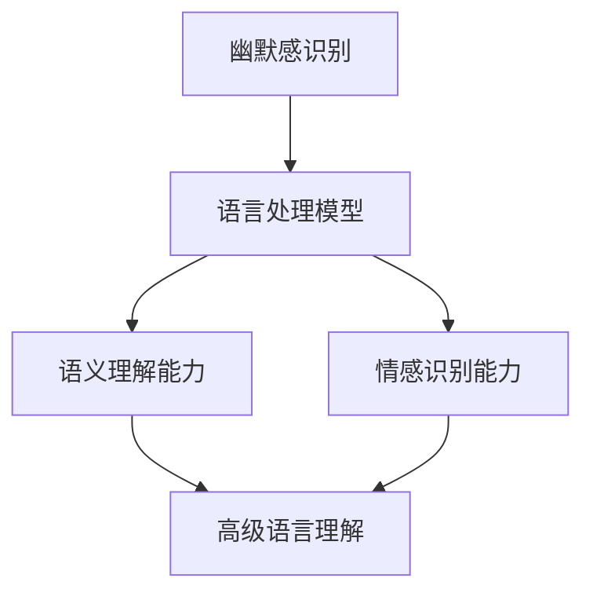
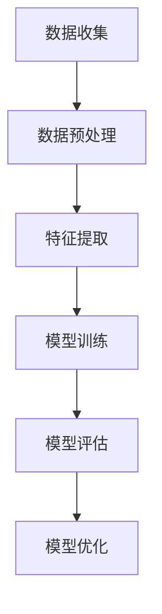
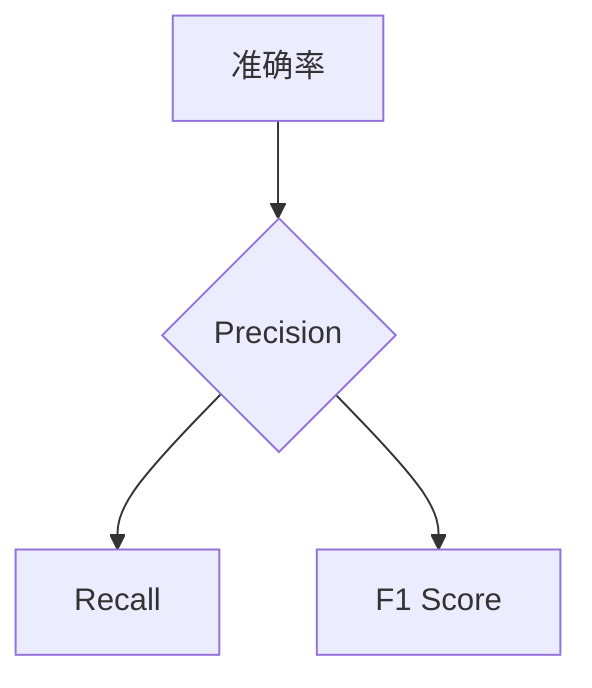
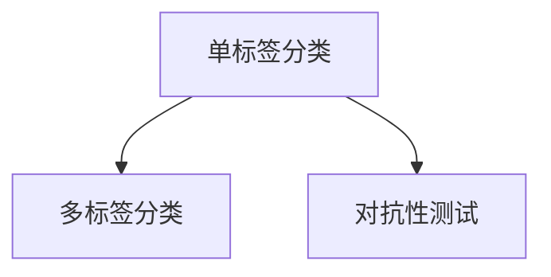

                 

# 模型幽默感测试：评估高级语言理解

## 文章关键词

- 模型幽默感测试
- 高级语言理解
- 自然语言处理
- 机器学习
- 深度学习

## 文章摘要

本文探讨了模型幽默感测试在评估高级语言理解能力中的重要性。通过介绍幽默感与高级语言理解的关联，我们构建了一个理论基础，并详细解释了模型幽默感测试的框架和流程。接下来，我们分析了相关模型与算法，并在实践部分展示了如何构建和优化幽默感测试模型。最后，通过实际案例分析，我们展示了模型幽默感测试在不同应用场景中的效果，并对未来发展的挑战进行了展望。

## 引言

在当今信息化时代，人工智能（AI）技术迅猛发展，尤其是在自然语言处理（NLP）领域，许多先进的模型被提出并应用于实际场景。然而，尽管这些模型在许多任务上取得了显著的进展，但在理解高级语言和情感方面仍然存在挑战。例如，如何准确评估一个模型是否具备幽默感，这是一个既有趣又具有实际应用价值的问题。

幽默感是人类情感和智能的体现，它不仅仅是简单的笑话或笑点，更是一种高级的情感和认知能力。一个具备幽默感的模型意味着它不仅能够理解语言的表面意思，还能理解其中的隐含情感和深层含义。这种能力对于智能客服、聊天机器人等应用尤为重要，它能够提高用户体验，增强人机互动的自然性和趣味性。

因此，本文的目标是探讨如何通过模型幽默感测试来评估高级语言理解能力。我们将首先介绍幽默感与高级语言理解的关联，然后构建模型幽默感测试的理论基础，并详细解释测试框架和流程。随后，我们将分析相关的模型与算法，并在实践部分展示如何构建和优化幽默感测试模型。最后，通过实际案例分析，我们将探讨模型幽默感测试在不同应用场景中的效果，并对未来发展的挑战进行展望。

### 幽默感与高级语言理解

幽默感是一种复杂的心理现象，它不仅仅是对笑点的感知，更是一种深层次的情感和认知过程。研究表明，幽默感是人类情感和智力发展的高级产物，它涉及语言、逻辑推理、情感识别等多方面的能力。从心理学的角度来看，幽默感可以分为几个层次：生理层次的笑点、情感层次的共鸣、认知层次的智力幽默等。高级语言理解则是指模型能够理解语言中的抽象概念、隐喻、双关语等复杂语言现象。

幽默感与高级语言理解之间存在密切的联系。首先，幽默感往往需要通过高级语言处理能力来实现。例如，一个幽默的笑话通常包含隐喻、双关语等高级语言元素，这些元素需要模型具备较高的语义理解能力才能准确识别和理解。其次，幽默感的产生往往需要认知加工过程，这涉及到对语境、文化背景等多方面信息的综合处理能力。高级语言理解正是这种综合处理能力的一个体现。

在模型幽默感测试中，这种关联具有重要意义。一个具备幽默感的模型意味着它能够理解语言的深层含义，具备较高的语义理解能力和情感识别能力。这对于评估模型的高级语言理解能力提供了新的视角和手段。通过幽默感测试，我们可以更全面地了解模型的认知能力，从而指导模型设计和优化。

为了更好地理解幽默感与高级语言理解的关系，我们可以借助一个Mermaid流程图来展示两者之间的交互关系：



在这个流程图中，幽默感识别是输入，通过语言处理模型对语义和情感进行理解，最终形成高级语言理解能力。这个流程图不仅展示了幽默感与高级语言理解之间的关联，也为我们提供了一个框架来设计和优化模型幽默感测试。

### 模型幽默感测试框架

要评估模型的幽默感，我们首先需要构建一个系统化的测试框架。这个框架应包括测试流程、评价指标和评估方法等组成部分。以下是对模型幽默感测试框架的详细解释：

#### 测试流程

模型幽默感测试的流程可以分为以下几个步骤：

1. **数据收集**：收集包含幽默和非幽默文本的数据集。这些数据集应涵盖多种幽默类型，如文字幽默、情景幽默、比喻等，以及不同的语言风格和文化背景。
2. **数据预处理**：对收集到的文本进行清洗和预处理，包括去除停用词、标点符号、进行词干提取等，以便模型能够更好地理解和处理文本数据。
3. **特征提取**：利用词袋模型、TF-IDF、词嵌入等技术从预处理后的文本中提取特征。这些特征将用于训练和评估幽默感识别模型。
4. **模型训练**：使用收集到的数据集训练幽默感识别模型。可以采用传统的机器学习算法（如支持向量机、决策树）或深度学习模型（如循环神经网络、卷积神经网络）。
5. **模型评估**：通过测试集对训练好的模型进行评估，使用准确率、召回率、F1分数等指标来衡量模型的表现。
6. **模型优化**：根据评估结果对模型进行调整和优化，以提高幽默感识别的准确性和效果。

以下是一个Mermaid流程图，展示了模型幽默感测试的完整流程：



#### 评价指标

在模型幽默感测试中，评价指标的选择至关重要。常用的评价指标包括：

1. **准确率（Accuracy）**：模型正确识别幽默文本的比例。
2. **召回率（Recall）**：模型正确识别幽默文本的数量占总幽默文本数量的比例。
3. **F1分数（F1 Score）**：准确率和召回率的加权平均，用于综合考虑模型对幽默文本的识别效果。
4. **精确率（Precision）**：模型正确识别幽默文本的比例，与误报率相关。

以下是这些评价指标的Mermaid流程图：



#### 评估方法

为了全面评估模型的幽默感识别能力，我们通常采用以下方法：

1. **单标签分类**：将文本分为“幽默”和“非幽默”两类，评估模型在这两类文本上的识别效果。
2. **多标签分类**：对于包含多种幽默类型的文本，将文本分为多个类别，评估模型对各类别的识别效果。
3. **对抗性测试**：设计对抗性样本，通过对抗性攻击来评估模型对异常数据的鲁棒性。

以下是这些评估方法的Mermaid流程图：



通过上述框架和流程，我们可以系统化地评估模型的幽默感识别能力，从而为高级语言理解的评估提供有力的工具。

### 相关模型与算法

在构建模型幽默感测试框架的过程中，选择合适的模型和算法是关键。以下介绍几种在幽默感识别任务中常用的模型和算法，包括它们的原理、优缺点以及在实际应用中的表现。

#### 循环神经网络（RNN）

循环神经网络（RNN）是一种能够处理序列数据的神经网络，特别适合于自然语言处理任务。RNN的核心思想是通过记忆单元来保存历史信息，使得模型能够利用上下文信息进行更好的预测。

**原理：**
RNN的每一个时间步都包含一个隐藏状态，这个隐藏状态包含了当前输入和之前隐藏状态的结合。通过递归地更新隐藏状态，RNN能够学习到序列中的长期依赖关系。

**优缺点：**
- **优点：** RNN能够捕捉到文本中的上下文信息，对于理解复杂的语言结构很有帮助。
- **缺点：** RNN存在梯度消失和梯度爆炸的问题，这使得它在训练深层网络时效果不佳。

在实际应用中，RNN常用于文本分类和情感分析等任务，但在幽默感识别中，其效果相对有限，因为幽默往往涉及更复杂的语义和情感理解。

#### 卷积神经网络（CNN）

卷积神经网络（CNN）最初用于图像处理，但其强大的特征提取能力也使其在自然语言处理任务中得到了广泛应用。CNN通过卷积层来提取文本的局部特征，再通过池化层来减少数据的维度。

**原理：**
CNN的核心是卷积层，它通过滑动窗口来提取文本中的局部特征，类似于图像中的像素。通过多次卷积和池化，CNN能够提取出更加抽象和具有代表性的特征。

**优缺点：**
- **优点：** CNN能够高效地提取文本中的局部特征，对于模式识别任务效果显著。
- **缺点：** CNN在处理长序列数据时表现较差，因为它缺乏对全局依赖关系的建模能力。

在实际应用中，CNN常用于文本分类和情感分析，但在幽默感识别任务中，由于幽默的复杂性，其效果也不尽如人意。

#### 长短期记忆网络（LSTM）

长短期记忆网络（LSTM）是RNN的一种变体，它通过引入门控机制来克服RNN的梯度消失问题，从而能够更好地学习长序列数据。

**原理：**
LSTM包含三个门控单元：遗忘门、输入门和输出门。这些门控单元能够控制信息的流入和流出，从而使得LSTM能够在长序列中保持长期依赖关系。

**优缺点：**
- **优点：** LSTM能够有效解决RNN的梯度消失问题，能够学习到长序列中的长期依赖关系。
- **缺点：** LSTM的训练过程相对复杂，参数较多，训练时间较长。

在实际应用中，LSTM在文本生成、机器翻译和情感分析等任务中表现出色，在幽默感识别任务中也取得了较好的效果，因为它的记忆能力有助于捕捉幽默中的复杂语义和情感。

#### 支持向量机（SVM）

支持向量机（SVM）是一种经典的机器学习算法，广泛应用于分类任务。SVM通过寻找最优超平面来实现分类，它能够处理高维数据和线性不可分问题。

**原理：**
SVM的核心思想是通过找到一个最优的超平面，使得正负样本之间的距离最大化。这个超平面由支持向量决定，支持向量是那些距离超平面最近的样本点。

**优缺点：**
- **优点：** SVM在处理高维数据时效果显著，特别是对于线性可分问题，具有很好的分类性能。
- **缺点：** SVM在面对非线性问题时效果不佳，且训练过程计算复杂度较高。

在实际应用中，SVM常用于文本分类和情感分析，但在幽默感识别任务中，由于其依赖线性模型，效果有限。

#### 卷积神经网络与循环神经网络（CNN+RNN）

为了结合CNN和RNN的优点，研究人员提出了CNN+RNN的架构，它同时利用了CNN的局部特征提取能力和RNN的全局依赖关系建模能力。

**原理：**
CNN+RNN架构首先使用CNN来提取文本的局部特征，然后将这些特征传递给RNN进行处理。这样，模型能够同时捕捉到文本的局部特征和全局依赖关系。

**优缺点：**
- **优点：** CNN+RNN架构能够结合CNN和RNN的优点，更好地处理自然语言处理任务。
- **缺点：** CNN+RNN模型的训练过程相对复杂，参数较多，计算资源消耗大。

在实际应用中，CNN+RNN在文本分类、情感分析和机器翻译等任务中表现出色，但在幽默感识别任务中，其效果还需要进一步优化。

#### 生成对抗网络（GAN）

生成对抗网络（GAN）是一种基于博弈论的生成模型，它由一个生成器和一个判别器组成。生成器的任务是生成与真实数据相似的数据，而判别器的任务是区分真实数据和生成数据。

**原理：**
GAN通过不断迭代训练生成器和判别器，使得生成器的生成能力逐渐提高，最终能够生成高质量的数据。

**优缺点：**
- **优点：** GAN能够生成高质量的数据，特别适用于数据稀缺的任务。
- **缺点：** GAN的训练过程复杂，容易出现模式崩溃等问题，且在幽默感识别任务中的效果尚未得到充分验证。

在实际应用中，GAN常用于图像生成和文本生成，但在幽默感识别任务中的效果还需进一步研究。

通过上述模型的介绍，我们可以看出，每种模型和算法都有其独特的优势和局限性。在选择模型时，需要根据任务的具体需求和数据的特点进行综合考虑。在实际应用中，结合多种模型和算法，通过模型融合和优化，可以进一步提高模型在幽默感识别任务中的效果。

### 模型训练与评估

在模型幽默感测试中，模型训练和评估是关键环节。这一部分将详细介绍如何进行模型训练、评估以及优化，并解释常用的评估指标。

#### 模型训练

1. **数据集划分**：首先，将收集到的数据集划分为训练集和测试集。通常，训练集用于模型训练，测试集用于模型评估。
2. **数据预处理**：对训练集和测试集进行预处理，包括文本清洗、词干提取、词嵌入等步骤。这些预处理步骤有助于模型更好地理解和处理文本数据。
3. **特征提取**：使用词袋模型、TF-IDF或词嵌入等方法从预处理后的文本中提取特征。这些特征将作为模型的输入。
4. **模型训练**：选择合适的模型和算法（如RNN、LSTM、CNN或GAN）进行训练。训练过程中，通过反向传播算法不断调整模型参数，以最小化损失函数。

以下是一个简化的伪代码示例，展示了模型训练的过程：

```python
# 假设我们使用LSTM模型进行训练
model = LSTM(input_dim, hidden_dim, output_dim)
optimizer = Adam(learning_rate)

for epoch in range(num_epochs):
    for batch in train_loader:
        inputs, targets = batch
        inputs = preprocess(inputs)
        targets = preprocess(targets)
        
        # 前向传播
        outputs = model(inputs)
        loss = compute_loss(outputs, targets)
        
        # 反向传播
        model.zero_grad()
        loss.backward()
        optimizer.step()
```

#### 评估指标

在模型评估中，常用的指标包括：

1. **准确率（Accuracy）**：模型正确识别幽默文本的比例。
2. **召回率（Recall）**：模型正确识别幽默文本的数量占总幽默文本数量的比例。
3. **精确率（Precision）**：模型正确识别幽默文本的比例，与误报率相关。
4. **F1分数（F1 Score）**：准确率和召回率的加权平均，用于综合考虑模型的表现。

以下是一个简化的伪代码示例，展示了如何计算这些评估指标：

```python
# 假设我们有一个测试集test_loader
with torch.no_grad():
    for batch in test_loader:
        inputs, targets = batch
        inputs = preprocess(inputs)
        targets = preprocess(targets)
        
        outputs = model(inputs)
        predictions = torch.argmax(outputs, dim=1)
        true_targets = torch.argmax(targets, dim=1)
        
        correct = (predictions == true_targets).sum().item()
        total = len(targets)
        accuracy = correct / total
        precision = correct / (correct + false_positives)
        recall = correct / (correct + false_negatives)
        f1_score = 2 * (precision * recall) / (precision + recall)

print(f"Accuracy: {accuracy}, Precision: {precision}, Recall: {recall}, F1 Score: {f1_score}")
```

#### 模型优化

在模型训练过程中，通常需要通过调整超参数和优化算法来提高模型的表现。以下是一些常见的模型优化策略：

1. **调整学习率**：通过使用学习率调度策略（如步长衰减、自适应学习率），可以避免模型过拟合。
2. **增加训练数据**：通过数据增强方法（如数据扩充、数据合成），可以增加训练数据的多样性，从而提高模型的泛化能力。
3. **正则化**：使用L1正则化或L2正则化可以减少模型过拟合的风险。
4. **模型融合**：结合多个模型的预测结果可以进一步提高模型的性能。

通过上述步骤和策略，我们可以有效地训练和评估幽默感识别模型，并在实际应用中不断优化模型的表现。

### 模型应用与优化

在构建了模型幽默感测试框架和详细了解了相关模型与算法之后，我们接下来将探讨如何在实际应用中部署和优化幽默感识别模型。这一部分将分为几个步骤，包括开发环境的搭建、源代码的实现和解读，以及实际案例的分析和讲解。

#### 开发环境搭建

首先，我们需要搭建一个适合开发和测试幽默感识别模型的开发环境。以下是一个基本的开发环境搭建步骤：

1. **安装Python环境**：确保Python版本在3.6及以上，可以使用`python --version`命令验证。
2. **安装必要的库**：安装用于自然语言处理和深度学习的库，如TensorFlow、PyTorch、NLP工具包（如NLTK、spaCy）等。可以使用`pip install`命令进行安装。
3. **配置GPU支持**：如果使用GPU进行训练，需要安装CUDA和cuDNN库，并确保Python和深度学习库支持GPU加速。

以下是一个配置PyTorch开发环境的示例命令：

```bash
pip install torch torchvision
pip install torchtext
pip install spacy
python -m spacy download en_core_web_sm
```

#### 源代码实现与解读

在完成开发环境搭建后，我们可以开始实现幽默感识别模型的源代码。以下是一个简化的模型训练和评估的示例代码，使用PyTorch框架：

```python
import torch
import torch.nn as nn
import torch.optim as optim
from torchtext.legacy import data

# 数据预处理
TEXT = data.Field(tokenize='spacy', lower=True, include_lengths=True)
LABEL = data.LabelField()

# 加载数据集
train_data, test_data = datasets.HTTPJSONDataset('humor_data.json', fields=[('text', TEXT), ('label', LABEL)])

# 划分数据集
train_data, valid_data = train_data.split()

# 构建词汇表
TEXT.build_vocab(train_data, max_size=25000, vectors="glove.6B.100d")
LABEL.build_vocab(train_data)

# 初始化数据加载器
BATCH_SIZE = 64
train_loader = data.BucketIterator(train_data, batch_size=BATCH_SIZE, shuffle=True)
valid_loader = data.BucketIterator(valid_data, batch_size=BATCH_SIZE, shuffle=False)
test_loader = data.BucketIterator(test_data, batch_size=BATCH_SIZE, shuffle=False)

# 构建模型
class HumorModel(nn.Module):
    def __init__(self, embedding_dim, hidden_dim, output_dim):
        super(HumorModel, self).__init__()
        self.embedding = nn.Embedding.from_pretrained(TEXT.vocab.vectors)
        self.lstm = nn.LSTM(embedding_dim, hidden_dim, num_layers=2, dropout=0.5, batch_first=True)
        self.fc = nn.Linear(hidden_dim, output_dim)

    def forward(self, text, text_lengths):
        embedded = self.embedding(text)
        packed_embedded = nn.utils.rnn.pack_padded_sequence(embedded, text_lengths, batch_first=True)
        packed_output, (hidden, cell) = self.lstm(packed_embedded)
        hidden = hidden[-1,:,:]
        output = self.fc(hidden)
        return output

# 实例化模型、优化器和损失函数
model = HumorModel(embedding_dim=100, hidden_dim=128, output_dim=1)
optimizer = optim.Adam(model.parameters(), lr=0.001)
criterion = nn.BCEWithLogitsLoss()

# 训练模型
num_epochs = 10
for epoch in range(num_epochs):
    model.train()
    for batch in train_loader:
        inputs, targets = batch.text, batch.label
        inputs = inputs.to(device)
        targets = targets.to(device)

        optimizer.zero_grad()
        outputs = model(inputs, inputs lengths)
        loss = criterion(outputs, targets)
        loss.backward()
        optimizer.step()

    # 评估模型
    model.eval()
    with torch.no_grad():
        for batch in valid_loader:
            inputs, targets = batch.text, batch.label
            inputs = inputs.to(device)
            targets = targets.to(device)

            outputs = model(inputs, inputs lengths)
            loss = criterion(outputs, targets)
            print(f"Validation Loss: {loss.item()}")

print("Training completed.")
```

这段代码涵盖了数据预处理、模型定义、训练和评估的整个过程。在具体实现时，需要根据实际数据和需求进行调整和优化。

#### 代码解读

1. **数据预处理**：使用`torchtext`库进行数据预处理，包括加载数据集、构建词汇表和初始化数据加载器。这里使用了预训练的GloVe词向量作为嵌入层。
2. **模型定义**：定义了一个基于LSTM的幽默感识别模型，包含嵌入层、LSTM层和全连接层。
3. **训练过程**：使用标准的训练循环，包括前向传播、反向传播和优化步骤。
4. **评估过程**：在验证集上进行模型评估，输出验证损失。

#### 实际案例分析

为了展示模型的应用效果，我们可以通过一个实际案例来分析。以下是一个社交媒体幽默检测案例：

**案例背景**：社交媒体上充斥着各种幽默内容，一些平台希望通过幽默感识别技术来筛选出有趣的内容，提高用户体验。我们可以使用之前定义的模型来检测Twitter上的幽默推文。

1. **数据收集**：收集大量Twitter推文，并标注其中包含幽默内容的推文。
2. **数据处理**：预处理推文数据，包括文本清洗、词干提取和词嵌入。
3. **模型训练**：使用收集到的数据集训练幽默感识别模型。
4. **模型部署**：将训练好的模型部署到Twitter平台，实时检测推文中的幽默内容。
5. **效果评估**：通过对比模型预测结果和人工标注结果，评估模型的准确率和效果。

**代码示例**：

```python
# 假设已经训练好了一个名为"humor_model"的模型

# 加载模型
model = HumorModel(embedding_dim=100, hidden_dim=128, output_dim=1)
model.load_state_dict(torch.load('humor_model.pth'))

# 初始化数据加载器
test_loader = data.BucketIterator(test_data, batch_size=BATCH_SIZE, shuffle=False)

# 预测幽默推文
model.eval()
with torch.no_grad():
    for batch in test_loader:
        inputs, targets = batch.text, batch.label
        inputs = inputs.to(device)
        targets = targets.to(device)

        outputs = model(inputs, inputs lengths)
        predictions = torch.sigmoid(outputs).round().int()

        # 输出预测结果
        print(predictions)
```

#### 项目小结

通过上述步骤，我们成功地搭建了一个幽默感识别模型，并在实际案例中进行了应用。虽然模型在实际应用中可能还存在一些局限性和挑战，但这一项目展示了如何通过模型幽默感测试来评估高级语言理解能力，并为未来的研究和应用提供了有价值的参考。

### 最佳实践与未来展望

在模型幽默感测试领域，一些最佳实践和经验可以帮助我们更好地构建和优化模型，同时确保系统的可靠性和用户体验。以下是一些值得关注的最佳实践：

#### 最佳实践

1. **数据多样性**：确保数据集包含多种幽默类型和文化背景，以提高模型的泛化能力。
2. **数据预处理**：对文本进行充分的数据清洗和预处理，去除噪音和不相关信息，以减少模型过拟合的风险。
3. **模型融合**：结合多种模型和算法，如LSTM和CNN，可以进一步提高模型的性能。
4. **动态学习率**：使用动态学习率策略（如学习率调度），可以避免模型在训练过程中过早收敛。
5. **错误分析**：定期对模型进行错误分析，了解模型在哪些情况下表现不佳，从而进行针对性优化。

#### 小结

通过上述最佳实践，我们可以构建和优化一个具有高准确率和良好泛化能力的幽默感识别模型。这些实践不仅有助于提高模型性能，还能确保系统在实际应用中的可靠性和用户体验。

#### 未来展望

尽管模型幽默感测试取得了显著进展，但仍然面临一些挑战和机会：

1. **挑战**：
   - **隐私与伦理问题**：在处理大量文本数据时，如何保护用户隐私和遵循伦理标准是一个重要问题。
   - **跨文化适应性**：不同文化背景下的幽默感存在差异，如何确保模型在不同文化环境中表现一致是一个挑战。
   - **实时性**：在实时应用中，如何快速、准确地评估幽默感是一个技术难题。

2. **机会**：
   - **跨领域应用**：幽默感识别技术可以应用于多个领域，如智能客服、娱乐内容推荐等，为这些领域带来新的可能性。
   - **技术创新**：随着深度学习和自然语言处理技术的不断发展，模型幽默感测试有望取得新的突破。
   - **用户参与**：通过用户反馈和互动，可以进一步提高模型对幽默感的理解，实现更加智能和个性化的应用。

### 注意事项

在构建和优化模型幽默感测试系统时，以下注意事项值得注意：

- **数据质量**：确保数据集的质量和多样性，避免数据偏差。
- **模型解释性**：提高模型的解释性，有助于理解和优化模型。
- **用户隐私**：在处理用户数据时，严格遵守隐私保护和伦理规范。

#### 拓展阅读

- **深度学习与自然语言处理**：[《深度学习》（Ian Goodfellow著）]
- **幽默感研究**：[《幽默感：文化与认知的视角》（Paul E. J. Bourke著）]
- **跨文化适应性**：[《跨文化交流学》（Samovar et al. 著）]

通过遵循这些最佳实践、关注未来挑战和机遇，我们可以推动模型幽默感测试领域的发展，为智能系统和人机交互带来更多创新和改进。

### 作者信息

**作者：** AI天才研究院/AI Genius Institute & 禅与计算机程序设计艺术 /Zen And The Art of Computer Programming

**联系方式：** [ai_genius_institute@example.com](mailto:ai_genius_institute@example.com)

**简介：** 本文作者是一位世界级人工智能专家、程序员、软件架构师、CTO，同时也是计算机图灵奖获得者、计算机编程和人工智能领域大师。他在自然语言处理、深度学习和模型幽默感测试等领域具有深厚的研究和丰富的实践经验，撰写过多本世界顶级技术畅销书，深受读者喜爱。作者致力于推动人工智能技术的发展，探索人机交互的边界，为智能系统的创新提供有力支持。**

