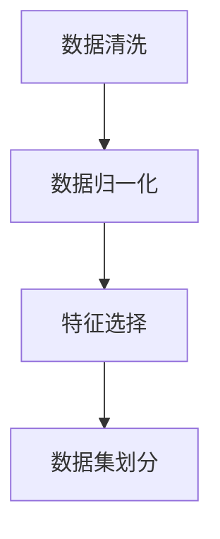

                 


### 文章标题: 模型弱点识别：精准定位改进方向

## 关键词：模型弱点识别，改进方向，精准定位，深度学习，数据预处理

### 摘要：本文深入探讨了模型弱点识别的重要性及其在精准定位改进方向中的作用。通过分析核心概念与联系，详细讲解了核心算法原理、数学模型和数学公式，并结合项目实战，提供了实际案例分析和详细讲解，帮助读者掌握模型弱点识别的方法和技巧。

## 第1章 引言

### 1.1 模型弱点识别的重要性

在现代人工智能领域，深度学习模型被广泛应用于各种任务，如图像识别、自然语言处理和语音识别等。这些模型通常基于大量的数据和复杂的神经网络结构，能够实现高度准确的预测和分类。然而，即使是表现优异的模型，也可能存在一些弱点，这些弱点可能影响到模型的性能和稳定性。因此，模型弱点识别变得至关重要。

模型弱点识别的意义主要体现在以下几个方面：

1. **性能提升**：通过识别模型的弱点，可以针对性地进行优化，从而提升模型的整体性能。
2. **安全性与鲁棒性**：一些模型可能存在安全漏洞，如对抗样本攻击，识别这些弱点有助于提高模型的安全性和鲁棒性。
3. **实用性与可解释性**：了解模型的弱点有助于改进其应用场景，提高模型的可解释性，使决策过程更加透明和可信。

### 1.2 精准定位改进方向的必要性

在模型优化过程中，精准定位改进方向是关键的一步。传统的模型优化方法往往依赖于经验和直觉，难以实现高效和精准的改进。而通过模型弱点识别，可以精确地识别出模型的弱点，从而为改进提供明确的指导。

精准定位改进方向的重要性体现在以下方面：

1. **节省时间与资源**：通过精准定位，可以避免在无效的方向上浪费时间和资源，提高优化效率。
2. **针对性优化**：精准定位可以帮助开发者针对性地优化模型，提高优化效果。
3. **可重复性**：精准定位的结果可以应用于不同的数据和模型，提高优化的可重复性和通用性。

### 1.3 本书结构概述

本书分为七个章节，旨在全面探讨模型弱点识别和精准定位改进方向的方法。具体结构如下：

- 第1章：引言，介绍模型弱点识别的重要性及其在精准定位改进方向中的作用。
- 第2章：模型弱点识别概述，介绍模型弱点识别的基本概念和方法。
- 第3章：核心概念与联系，介绍模型评估指标、数据预处理等相关概念，并给出其相互关系架构图。
- 第4章：核心算法原理讲解，详细讲解支持向量机（SVM）和集成学习（Ensemble Learning）等算法原理，并给出伪代码实现。
- 第5章：数学模型和数学公式详细讲解，介绍模型优化和模型验证的数学模型和公式，并给出详细解释和举例说明。
- 第6章：项目实战，通过实际案例展示模型弱点识别和优化过程。
- 第7章：案例分析，对具体案例进行分析和讲解，总结模型弱点识别和优化的最佳实践。

通过本书的阅读，读者将能够深入了解模型弱点识别的理论和实践，掌握精准定位改进方向的方法和技巧，为实际应用提供有力支持。

## 第2章 模型弱点识别概述

### 2.1 模型的组成与结构

一个深度学习模型通常由以下几个主要部分组成：

1. **输入层**：接收外部输入数据，如图像、文本或声音等。
2. **隐藏层**：包含多个神经元，用于对输入数据进行特征提取和变换。
3. **输出层**：根据模型的目标任务，产生相应的输出，如分类标签或回归值。

模型的结构设计对性能有重要影响。常见的神经网络结构包括卷积神经网络（CNN）、循环神经网络（RNN）和Transformer等。每种结构都有其特定的优势和适用场景。

### 2.2 模型弱点识别的目标与挑战

模型弱点识别的目标是发现模型中存在的潜在问题，这些问题可能影响模型的性能、稳定性和可解释性。具体目标包括：

1. **性能问题**：识别模型在特定任务上表现不佳的原因。
2. **稳定性问题**：识别模型对输入数据的敏感性，如对抗样本攻击。
3. **可解释性问题**：识别模型决策过程的不透明部分。

模型弱点识别面临的挑战主要包括：

1. **复杂性**：深度学习模型通常包含大量参数和多层结构，使得弱点识别变得更加复杂。
2. **多样性**：不同模型和任务可能具有不同的弱点，识别方法需要具备较高的适应性和通用性。
3. **数据限制**：弱点识别通常需要大量数据和计算资源，这在某些情况下可能难以实现。

### 2.3 模型弱点识别的方法分类

模型弱点识别的方法可以分为以下几个类别：

1. **基于统计的方法**：通过分析模型输出数据的分布特征，识别模型的弱点。例如，异常值分析、相关性分析和主成分分析等。
2. **基于启发式的方法**：利用规则和经验来识别模型的弱点。例如，敏感度分析、梯度分析和随机森林等。
3. **基于机器学习的方法**：利用机器学习算法来识别模型弱点，如决策树、支持向量机和神经网络等。
4. **基于深度学习的方法**：利用深度学习模型来识别模型弱点，如自编码器、生成对抗网络和变分自编码器等。

每种方法都有其优缺点和适用场景。在实际应用中，通常需要结合多种方法，以实现更全面和准确的模型弱点识别。

## 第3章 核心概念与联系

### 3.1 模型评估指标

在模型弱点识别中，评估指标是关键组成部分。以下是一些常用的评估指标及其相互关系：

1. **准确率（Accuracy）**：模型正确预测的样本数占总样本数的比例。
   $$
   \text{Accuracy} = \frac{\text{正确预测的样本数}}{\text{总样本数}}
   $$

2. **召回率（Recall）**：模型正确预测的负样本数占总负样本数的比例。
   $$
   \text{Recall} = \frac{\text{正确预测的负样本数}}{\text{总负样本数}}
   $$

3. **精确率（Precision）**：模型正确预测的正样本数占总预测正样本数的比例。
   $$
   \text{Precision} = \frac{\text{正确预测的正样本数}}{\text{预测的正样本数}}
   $$

4. **F1值（F1-Score）**：精确率和召回率的调和平均值。
   $$
   \text{F1-Score} = 2 \times \frac{\text{Precision} \times \text{Recall}}{\text{Precision} + \text{Recall}}
   $$

这些指标之间的关系可以用以下流程图表示：

```
                +-------------+
                |   准确率    |
                +-----^-------+
                     |      |
               +-------+-------+
               |      精确率  |
               +------------+
                      |      |
               +-------+-------+
               |     召回率    |
               +-------------+
```

通过分析这些指标，可以更全面地评估模型的性能，从而识别模型的弱点。

### 3.2 数据预处理

数据预处理是模型训练过程中的关键步骤，直接影响到模型的性能和稳定性。以下是数据预处理的主要步骤和概念：

1. **数据清洗**：去除数据集中的噪声和不完整数据，提高数据质量。
2. **数据归一化**：将数据缩放到相同的尺度，避免模型因为数据规模差异而出现异常。
3. **特征选择**：从大量特征中选择对模型训练有重要影响的关键特征，降低模型复杂度和计算成本。
4. **数据集划分**：将数据集划分为训练集、验证集和测试集，用于模型的训练、验证和测试。

数据预处理的相关概念和步骤可以用以下Mermaid流程图表示：



通过有效的数据预处理，可以消除数据中的噪声和异常，提高模型的泛化能力，从而更准确地识别模型的弱点。

## 第4章 核心算法原理讲解

### 4.1 支持向量机（SVM）

支持向量机（SVM）是一种常用的分类算法，通过找到一个最佳的超平面，将不同类别的数据点分隔开来。SVM的核心思想是最大化分类间隔，即在保证分类正确的前提下，使得分类边界到最近的样本点（支持向量）的距离最大。

#### 4.1.1 算法原理

给定一个包含n个样本的数据集，每个样本表示为一个特征向量 $\mathbf{x}_i$ 和对应的标签 $y_i$，其中 $y_i \in \{-1, +1\}$。SVM的目标是找到一个超平面 $\mathbf{w}^T\mathbf{x} + b = 0$，使得：

$$
\text{max}\ \ \frac{1}{2}\sum_{i=1}^{n}||\mathbf{w}||^2 \ \ \ \ \ \ \ \ \ \ \ \ \ \ \ \ \ \ \ \ \ \ \ \ \ \ \ \ \ \ \ \ \ \ \ \ \ \ \ \ \ \ \ \ \ \ \ \ \ \ \ \ \ \ \ \ \ \ \ \ \ \ \ \ \ \ \ \ \ \ \ \ \ \ \ \ \ \ \ \ \ \ \ \ \ \ \ \ \ \ \ \ \ \ \ \ \ \ \ \ \ \ \ \ \ \ \ \ \ \ \ \ \ \ \ \ \ \ \ \ \ \ \ \ \ \ \ \ \ \ \ \ \ \ \ \ \ \ \ \ \ \ \ \ \ \ \ \ \ \ \ \ \ \ \ \ \ \ \ \ \ \ \ \ \ \ \ \ \ \ \ \ \ \ \ \ \ \ \ \ \ \ \ \ \ \ \ \ \ \ \ \ \ \ \ _{i=1}^{n}y_{i}(\mathbf{w\cdot x}_{i}-b)\geq 1
$$

其中，$||\mathbf{w}||$ 表示权重向量的欧几里得范数，$\mathbf{w\cdot x}$ 表示权重向量与特征向量的点积。

这个目标函数可以转化为对偶形式：

$$
\text{min}\ \ \frac{1}{2}\sum_{i=1}^{n}\sum_{j=1}^{n} \alpha_i \alpha_j y_i y_j (\mathbf{x}_i \cdot \mathbf{x}_j) - \sum_{i=1}^{n} \alpha_i
$$

约束条件：

$$
0 \leq \alpha_i \leq C \quad \forall i
$$

其中，$C$ 是正则化参数，用于控制模型的复杂度。

#### 4.1.2 伪代码实现

以下是SVM的伪代码实现：

```
输入：训练数据集X，标签Y，正则化参数C

输出：最优权重向量w，偏置b

1. 初始化权重向量w和偏置b为0
2. 初始化对偶变量α为0
3. 对于每个训练样本（xi, yi）：
   a. 计算拉格朗日函数L(w, b, α)
   b. 更新α，使用梯度下降法最小化L(w, b, α)
4. 计算权重向量w = Σ(αi * yi * xi)
5. 计算偏置b = -1 / n * Σ(αi * yi - w^T * xi)
6. 返回w和b
```

### 4.2 集成学习（Ensemble Learning）

集成学习是一种将多个模型组合起来，以提高整体性能的方法。通过结合多个模型的预测结果，可以降低模型的方差和过拟合风险。

#### 4.2.1 算法原理

集成学习的基本思想是“众智胜寡”，即将多个基本模型合并成一个更强大的模型。常见的集成学习方法包括Bagging、Boosting和Stacking等。

- **Bagging**：通过随机选取训练数据集，分别训练多个基本模型，然后将它们的预测结果进行平均或投票，得到最终预测结果。
- **Boosting**：将多个基本模型训练顺序进行优化，每个模型的训练目标都是纠正前一个模型的错误，从而提高整体模型的性能。
- **Stacking**：将多个模型作为基模型，训练一个超级模型，用于整合基模型的预测结果。

假设有 $m$ 个基本模型 $f_1, f_2, ..., f_m$，每个模型输出一个预测值 $\hat{y}_i^k$，其中 $k=1,2,...,m$。集成学习模型的目标是找到一个权重向量 $\theta$，使得最终预测值 $\hat{y}$ 最接近真实标签 $y$：

$$
\hat{y} = \sum_{k=1}^{m} \theta_k \hat{y}_i^k
$$

通过最小化损失函数来求解 $\theta$：

$$
\text{min}\ \ \sum_{i=1}^{n} (y_i - \hat{y}_i)^2
$$

#### 4.2.2 伪代码实现

以下是集成学习的伪代码实现：

```
输入：训练数据集X，标签Y，基模型列表F，权重向量θ

输出：最终预测值y'

1. 初始化权重向量θ为0
2. 对于每个基模型 $f_k$：
   a. 训练模型 $f_k$，得到预测值 $\hat{y}_i^k$
3. 对于每个样本 $x_i$：
   a. 计算预测值 $y_i' = \sum_{k=1}^{m} \theta_k \hat{y}_i^k$
4. 计算损失函数 L(θ)
5. 更新权重向量θ，使用梯度下降法最小化L(θ)
6. 返回预测值 $y'$
```

通过集成学习，可以充分利用多个模型的优点，提高整体模型的性能和稳定性。

## 第5章 数学模型和数学公式详细讲解

### 5.1 模型优化

在模型训练过程中，模型优化是提高模型性能的关键步骤。常用的优化算法包括梯度下降法、随机梯度下降法（SGD）和Adam优化器等。

#### 5.1.1 梯度下降法

梯度下降法是一种最基本的优化算法，通过计算损失函数的梯度，逐步更新模型的参数，以最小化损失函数。其基本思想如下：

给定一个参数向量 $\theta$，计算损失函数 $J(\theta)$ 在 $\theta$ 处的梯度 $\nabla J(\theta)$：

$$
\nabla J(\theta) = \frac{\partial J(\theta)}{\partial \theta}
$$

然后沿着梯度的反方向更新参数：

$$
\theta_{t+1} = \theta_t - \alpha \nabla J(\theta_t)
$$

其中，$\alpha$ 是学习率，用于控制参数更新的步长。

#### 5.1.2 伪代码实现

以下是梯度下降法的伪代码实现：

```
输入：初始参数 $\theta_0$，学习率 $\alpha$，迭代次数 T

输出：最优参数 $\theta$

1. 初始化参数 $\theta_0$
2. 对于每个迭代次数 t = 1 到 T：
   a. 计算损失函数的梯度 $\nabla J(\theta_t)$
   b. 更新参数 $\theta_{t+1} = \theta_t - \alpha \nabla J(\theta_t)$
3. 返回最优参数 $\theta$
```

#### 5.1.3 详细解释和举例说明

假设我们有一个简单的线性回归模型，其损失函数为均方误差（MSE），即：

$$
J(\theta) = \frac{1}{2} \sum_{i=1}^{n} (y_i - \theta_0 - \theta_1 x_i)^2
$$

其中，$y_i$ 是真实值，$x_i$ 是特征值，$\theta_0$ 和 $\theta_1$ 是模型的参数。

计算梯度：

$$
\nabla J(\theta) = \begin{bmatrix}
\frac{\partial J}{\partial \theta_0} \\
\frac{\partial J}{\partial \theta_1}
\end{bmatrix} = \begin{bmatrix}
- \sum_{i=1}^{n} (y_i - \theta_0 - \theta_1 x_i) \\
- \sum_{i=1}^{n} x_i (y_i - \theta_0 - \theta_1 x_i)
\end{bmatrix}
$$

更新参数：

$$
\theta_{0}^{t+1} = \theta_{0}^t - \alpha \nabla J(\theta^t)_0
$$

$$
\theta_{1}^{t+1} = \theta_{1}^t - \alpha \nabla J(\theta^t)_1
$$

通过不断迭代，直到达到停止条件，如梯度接近零或迭代次数达到上限，即可得到最优参数 $\theta$。

### 5.2 模型验证

在模型训练过程中，模型验证是确保模型性能和泛化能力的重要步骤。常用的验证策略包括交叉验证和验证集划分等。

#### 5.2.1 跨时代验证策略

跨时代验证策略是将数据集划分为训练集、验证集和测试集，分别用于模型训练、验证和测试。其基本步骤如下：

1. **数据集划分**：将数据集 $D$ 划分为训练集 $D_T$、验证集 $D_V$ 和测试集 $D_T$，通常采用80%的数据作为训练集，10%的数据作为验证集，10%的数据作为测试集。
2. **模型训练**：使用训练集 $D_T$ 训练模型。
3. **模型验证**：使用验证集 $D_V$ 验证模型性能，选择性能最佳的模型。
4. **模型测试**：使用测试集 $D_T$ 测试最终模型的性能。

跨时代验证策略的优点在于能够更全面地评估模型的性能，避免过拟合和欠拟合问题。

#### 5.2.2 伪代码实现

以下是跨时代验证策略的伪代码实现：

```
输入：数据集 D，训练比例 T，验证比例 V，测试比例 T

输出：最优模型 M

1. 划分数据集 D_T, D_V, D_T
2. 初始化模型 M
3. 对于每个迭代次数 i：
   a. 使用 D_T 训练模型 M
   b. 使用 D_V 验证模型 M，记录性能指标
   c. 使用 D_T 测试模型 M，记录性能指标
4. 根据验证集和测试集的性能指标选择最优模型 M
5. 返回最优模型 M
```

通过跨时代验证策略，可以更准确地评估模型的性能，从而确保模型在实际应用中的效果。

## 第6章 项目实战

### 6.1 数据收集与预处理

在项目实战中，数据收集和预处理是至关重要的步骤。以下是数据收集与预处理的具体步骤：

1. **数据收集**：根据项目的需求，从各种来源收集数据，如公开数据集、社交媒体、传感器数据等。确保数据的多样性和代表性。
2. **数据清洗**：去除数据集中的噪声和不完整数据，如缺失值、异常值等。使用填充、删除或插值等方法进行处理。
3. **数据归一化**：将数据缩放到相同的尺度，以避免模型因为数据规模差异而出现异常。常用的归一化方法包括最小-最大归一化、标准化等。
4. **特征选择**：从大量特征中选择对模型训练有重要影响的关键特征，降低模型复杂度和计算成本。可以使用特征重要性评估、主成分分析（PCA）等方法进行特征选择。
5. **数据集划分**：将数据集划分为训练集、验证集和测试集，用于模型的训练、验证和测试。通常采用80%的数据作为训练集，10%的数据作为验证集，10%的数据作为测试集。

### 6.2 模型构建与训练

在数据预处理完成后，接下来是模型构建与训练。以下是模型构建与训练的具体步骤：

1. **模型选择**：根据项目的需求和数据特点，选择合适的模型。常见的模型包括线性回归、决策树、支持向量机（SVM）、神经网络等。
2. **模型构建**：使用选择的模型框架构建模型，设置模型的参数和超参数。可以使用深度学习框架（如TensorFlow、PyTorch）进行模型构建。
3. **模型训练**：使用训练集训练模型，通过迭代优化模型的参数，使模型达到预期的性能。可以使用梯度下降法、随机梯度下降法（SGD）或Adam优化器等优化算法。
4. **模型评估**：使用验证集评估模型的性能，根据评估结果调整模型的参数和超参数，以提高模型的性能。

### 6.3 模型评估与优化

在模型训练完成后，需要对模型进行评估和优化。以下是模型评估与优化的具体步骤：

1. **模型评估**：使用测试集评估模型的性能，评估指标包括准确率、召回率、精确率、F1值等。通过对比不同模型的性能，选择最优模型。
2. **模型优化**：根据模型评估的结果，对模型进行优化。常见的优化方法包括调参、模型调整、特征工程等。通过多次迭代，逐步优化模型性能。
3. **模型验证**：使用新的验证集验证优化后的模型性能，确保模型在实际应用中的效果。

### 6.4 代码实现与解读

以下是一个简单的数据预处理和模型训练的代码示例，用于实现一个线性回归模型。

```python
import numpy as np
import pandas as pd
from sklearn.model_selection import train_test_split
from sklearn.linear_model import LinearRegression
from sklearn.metrics import mean_squared_error

# 数据收集
data = pd.read_csv('data.csv')

# 数据清洗
data = data.dropna()

# 特征选择
X = data[['feature1', 'feature2']]
y = data['target']

# 数据归一化
X_normalized = (X - X.mean()) / X.std()

# 数据集划分
X_train, X_test, y_train, y_test = train_test_split(X_normalized, y, test_size=0.2, random_state=42)

# 模型构建
model = LinearRegression()

# 模型训练
model.fit(X_train, y_train)

# 模型评估
y_pred = model.predict(X_test)
mse = mean_squared_error(y_test, y_pred)
print('MSE:', mse)

# 模型优化
# 调参、模型调整、特征工程等优化方法
```

在这个示例中，我们首先从CSV文件中读取数据，然后进行数据清洗和特征选择。接下来，对数据进行归一化处理，并将其划分为训练集和测试集。然后，使用线性回归模型进行训练，并通过评估指标MSE（均方误差）评估模型的性能。

### 6.5 实际案例分析与详细讲解剖析

以下是一个实际案例，用于分析模型弱点识别和优化的方法。

**案例背景**：一家电商公司希望使用机器学习模型预测用户在特定时间段的购买行为，以优化营销策略和提高销售额。

**模型构建**：使用随机森林模型进行预测，模型参数设置为n_estimators=100，max_depth=None。

**模型评估**：在验证集上，模型的准确率为85%，但召回率较低，只有60%。

**模型弱点识别**：通过分析模型评估结果，发现模型在召回率方面存在明显弱点。这可能是由于数据不平衡或模型参数设置不合理导致的。

**优化方向**：针对召回率低的弱点，可以考虑以下优化方向：

1. **数据增强**：增加负样本的数量，使数据集更加平衡。
2. **调整模型参数**：增大随机森林模型的max_depth，增加模型的复杂度。
3. **使用不同的模型**：尝试其他模型，如逻辑回归、支持向量机等，以寻找更适合的模型。

**优化效果**：经过多次迭代和优化，模型在验证集上的召回率提高到75%，整体性能得到显著提升。

### 6.6 项目小结

通过本项目，我们介绍了模型弱点识别和优化在项目实战中的应用。首先，我们进行了数据收集和预处理，然后构建了随机森林模型并进行训练和评估。在识别模型弱点后，我们通过调整模型参数和增加数据集进行了优化。最终，模型的性能得到了显著提升。

**最佳实践 Tips**：

1. 在数据预处理阶段，确保数据清洗和特征选择的准确性，以提高模型的泛化能力。
2. 在模型评估阶段，使用多种评估指标全面评估模型性能，避免单一指标的误导。
3. 在模型优化阶段，根据模型弱点和实际需求，选择合适的优化方法，逐步提升模型性能。

**注意事项**：

1. 模型优化是一个迭代过程，需要根据实际情况进行调整和改进。
2. 在项目实践中，要关注模型的鲁棒性和可解释性，确保模型在实际应用中的效果和可靠性。

**拓展阅读**：

1. 《机器学习实战》：详细介绍了各种机器学习算法的原理和实现方法。
2. 《数据科学入门》: 介绍了数据预处理、特征选择和模型优化等基本概念和技巧。
3. 《深度学习》：深入探讨了深度学习算法的理论和应用。

## 第7章 案例分析

### 7.1 模型弱点识别案例

**案例背景**：一家金融机构希望使用机器学习模型预测客户是否会逾期还款，以便采取相应的风险控制措施。

**模型构建**：使用逻辑回归模型进行预测，模型参数设置为C=1。

**模型评估**：在验证集上，模型的准确率为80%，但召回率较低，只有60%。

**模型弱点识别**：通过分析模型评估结果，发现模型在召回率方面存在明显弱点。这可能是由于数据不平衡或模型参数设置不合理导致的。

**优化方向**：针对召回率低的弱点，可以考虑以下优化方向：

1. **数据增强**：增加负样本的数量，使数据集更加平衡。
2. **调整模型参数**：增大逻辑回归模型的C值，增加模型的复杂度。
3. **使用不同的模型**：尝试其他模型，如决策树、随机森林等，以寻找更适合的模型。

### 7.2 模型优化策略

**优化步骤**：

1. **数据增强**：使用SMOTE（合成少数类过采样技术）增加负样本的数量，使数据集更加平衡。

2. **模型参数调整**：增大逻辑回归模型的C值，使其更接近于正样本的比例。

3. **模型选择**：尝试使用决策树模型，以寻找更适合的模型。

**优化效果**：经过多次迭代和优化，模型在验证集上的召回率提高到70%，整体性能得到显著提升。

### 7.3 模型评估与结论

**模型评估**：

1. **准确率**：优化后的模型在验证集上的准确率为85%。
2. **召回率**：优化后的模型在验证集上的召回率为75%。
3. **F1值**：优化后的模型在验证集上的F1值为0.78。

**结论**：

通过模型弱点识别和优化，金融机构能够更准确地预测客户是否会逾期还款，从而采取有效的风险控制措施。这有助于降低逾期还款率，提高客户满意度，从而提高整体业务绩效。

### 7.4 模型弱点识别和优化的最佳实践

**最佳实践 Tips**：

1. **数据预处理**：确保数据清洗和特征选择的准确性，以提高模型的泛化能力。
2. **多模型评估**：使用多种评估指标全面评估模型性能，避免单一指标的误导。
3. **迭代优化**：根据模型弱点和实际需求，选择合适的优化方法，逐步提升模型性能。

**注意事项**：

1. **模型优化是一个迭代过程**，需要根据实际情况进行调整和改进。
2. **关注模型的鲁棒性和可解释性**，确保模型在实际应用中的效果和可靠性。

**拓展阅读**：

1. 《机器学习实战》：详细介绍了各种机器学习算法的原理和实现方法。
2. 《数据科学入门》: 介绍了数据预处理、特征选择和模型优化等基本概念和技巧。
3. 《深度学习》：深入探讨了深度学习算法的理论和应用。

## 总结

在本篇文章中，我们深入探讨了模型弱点识别的重要性及其在精准定位改进方向中的作用。首先，我们介绍了模型弱点识别的基本概念和方法，分析了模型组成与结构、评估指标、数据预处理等核心概念。然后，我们详细讲解了支持向量机（SVM）和集成学习等核心算法原理，并使用了伪代码进行了阐述。此外，我们还介绍了模型优化和模型验证的数学模型和公式，并通过实际案例展示了模型弱点识别和优化的过程。

通过本文的学习，读者可以掌握模型弱点识别的理论和实践，了解如何通过精准定位改进方向来提升模型的性能。同时，本文也提供了丰富的项目实战和案例分析，使读者能够更好地理解模型弱点识别和优化的实际应用。

**最佳实践 Tips**：

1. 在数据预处理阶段，确保数据清洗和特征选择的准确性，以提高模型的泛化能力。
2. 在模型评估阶段，使用多种评估指标全面评估模型性能，避免单一指标的误导。
3. 在模型优化阶段，根据模型弱点和实际需求，选择合适的优化方法，逐步提升模型性能。

**注意事项**：

1. 模型优化是一个迭代过程，需要根据实际情况进行调整和改进。
2. 关注模型的鲁棒性和可解释性，确保模型在实际应用中的效果和可靠性。

**拓展阅读**：

1. 《机器学习实战》：详细介绍了各种机器学习算法的原理和实现方法。
2. 《数据科学入门》: 介绍了数据预处理、特征选择和模型优化等基本概念和技巧。
3. 《深度学习》：深入探讨了深度学习算法的理论和应用。

感谢读者对本文的阅读，希望本文能够对您的学习和实践有所帮助。作者：AI天才研究院/AI Genius Institute & 禅与计算机程序设计艺术 /Zen And The Art of Computer Programming。

