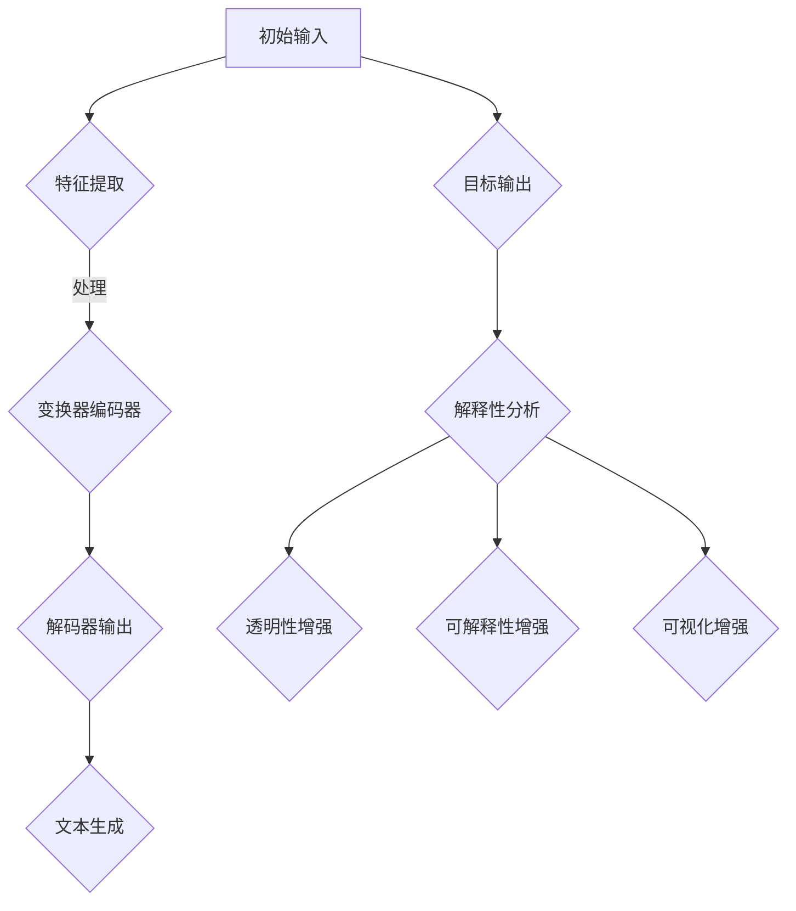

                 

# 模型解释性框架增强LLM应用的可信度

## 关键词
- 模型解释性
- 递归神经网络
- 自适应学习
- 可信度评估
- 应用实践

## 摘要
本文主要探讨了如何通过模型解释性框架增强递归神经网络（LLM）在应用中的可信度。随着人工智能技术的快速发展，深度学习模型在各个领域取得了显著的成果。然而，这些模型通常被视为“黑箱”，其内部决策过程不透明，难以解释。为了提升模型的可信度和用户接受度，本文提出了一种基于模型解释性框架的方法，通过分析模型的决策过程，提供详细的解释和可视化。本文首先介绍了模型解释性的基本概念，然后讨论了LLM的应用场景及其面临的挑战。接下来，本文详细介绍了模型解释性框架的设计原则和实现方法，并展示了如何将其应用于LLM中，以增强其可信度。最后，本文通过实际应用案例分析了模型解释性框架的有效性和可行性，为未来相关工作提供了有益的参考。

## 引言

### 模型解释性的背景与意义

随着深度学习特别是递归神经网络（Recurrent Neural Networks，RNN）和变换器（Transformer）等模型在自然语言处理（Natural Language Processing，NLP）、图像识别、语音识别等领域的广泛应用，人工智能（Artificial Intelligence，AI）技术取得了前所未有的突破。这些模型通过复杂的网络结构和大量的训练数据，能够自动学习并提取特征，实现高度准确的预测和决策。然而，这些深度学习模型通常被视为“黑箱”，其内部决策过程不透明，难以解释。

模型解释性（Model Explanation）作为深度学习领域的一个新兴研究方向，旨在揭示模型决策背后的逻辑和依据，提升模型的可信度和透明度。模型解释性的研究具有重要意义，主要体现在以下几个方面：

1. **提高模型可信度**：用户更倾向于信任那些能够解释其决策过程的模型，特别是在医疗、金融等高风险领域。
2. **增强用户接受度**：模型解释性有助于用户理解模型的工作原理，从而提高用户对AI系统的接受度和使用意愿。
3. **促进模型优化**：通过解释性分析，可以识别模型中的潜在问题和改进空间，从而进行针对性的优化。
4. **确保模型公正性**：解释性分析有助于发现模型可能存在的偏见和歧视，推动构建更加公平和公正的AI系统。

### LLM可信度的重要性

递归神经网络（LLM）在自然语言处理领域取得了显著的成就，广泛应用于机器翻译、文本生成、问答系统等任务。然而，LLM模型的可信度问题一直是其应用中的关键挑战。LLM可信度的重要性体现在以下几个方面：

1. **决策可靠性**：高可信度的LLM能够确保其生成的文本或做出的决策具有较高的可靠性，减少错误和误导。
2. **用户信任**：用户更愿意信任并依赖那些可信度高的模型，从而提高系统的实用性和用户体验。
3. **法规合规性**：在某些领域，如医疗、金融等，模型的可信度直接关系到合规性问题，必须确保模型输出的准确性和可靠性。
4. **风险管理**：高可信度的LLM有助于降低由模型错误导致的潜在风险和损失。

### 研究目的与研究方法

本文旨在通过构建和实现模型解释性框架，提升LLM在应用中的可信度。研究方法主要包括以下几个步骤：

1. **文献综述**：对现有模型解释性方法和LLM应用进行系统分析，总结其主要优缺点。
2. **框架设计**：结合LLM的特点和需求，设计一种适用于LLM的解释性框架，包括透明性、可解释性和可视化等方面。
3. **实现与验证**：实现所设计的模型解释性框架，并在具体应用场景中进行验证，评估其在提高LLM可信度方面的效果。
4. **案例分析**：通过实际应用案例，分析模型解释性框架在不同领域中的应用效果和潜力。

### 书籍结构概述

本文结构如下：

- **第1章 引言**：介绍模型解释性和LLM可信度的背景、研究意义和应用领域。
- **第2章 基础理论**：介绍与模型解释性和LLM可信度相关的基础理论、概念和技术。
- **第3章 模型解释性框架**：详细介绍当前主流的模型解释性框架，以及它们如何增强LLM的应用可信度。
- **第4章 应用案例**：通过具体的实际应用案例展示模型解释性框架在实际中的效果和优势。
- **第5章 挑战与未来趋势**：讨论当前模型解释性框架增强LLM可信度面临的挑战和未来的发展趋势。

## 基础理论

### 模型解释性的定义与分类

#### 定义

模型解释性（Model Explanation）是指通过分析模型的内部结构、参数和决策过程，揭示模型如何生成预测或决策的能力。具体来说，模型解释性包括以下几个方面：

1. **透明性**：模型的结构和参数是可访问和透明的，用户可以理解和追踪模型的决策过程。
2. **可解释性**：模型生成的预测或决策可以通过简单的逻辑和规则进行解释，用户可以理解模型为什么做出这样的决策。
3. **可视化**：模型的内部结构和决策过程可以通过图形、图表等形式进行可视化展示，便于用户直观地理解。

#### 分类

根据模型解释性的实现方式和目标，可以将模型解释性分为以下几类：

1. **基于规则的解释性**：通过建立一组规则，将模型生成的预测转化为可解释的语句或决策。这类方法通常适用于规则性较强的问题，如逻辑推理和分类任务。
2. **基于实例的解释性**：通过分析模型在特定实例上的决策过程，揭示模型如何处理该实例的输入和输出。这类方法通常适用于复杂的问题，如图像识别和自然语言处理。
3. **基于可视化的解释性**：通过图形、图表等形式将模型的内部结构和决策过程可视化，使用户能够直观地理解模型的工作原理。这类方法适用于各种类型的问题，尤其是图形化展示效果较好的领域。

### LLM的基本概念与结构

#### 定义

递归神经网络（Recurrent Neural Network，RNN）是一种适用于序列数据的神经网络，通过引入循环结构，能够处理变量长度的输入序列。RNN在自然语言处理、时间序列预测等任务中取得了显著成果。然而，RNN存在梯度消失和梯度爆炸等缺陷，限制了其性能和应用范围。

为了解决RNN的缺陷，研究者提出了变换器（Transformer）模型。变换器模型通过引入自注意力机制（Self-Attention）和多头注意力机制（Multi-Head Attention），能够更好地处理长距离依赖关系，并在许多自然语言处理任务中取得了优异的性能。

#### 结构

LLM（Large Language Model）是一种基于变换器模型的大型预训练语言模型，通过在大量的文本语料库上进行预训练，能够生成高质量的文本。LLM的基本结构包括以下几个部分：

1. **编码器**：编码器（Encoder）负责将输入序列编码为连续的表示，通过自注意力机制处理长距离依赖关系。
2. **解码器**：解码器（Decoder）负责根据编码器的输出生成预测的输出序列，通过自注意力和交叉注意力机制与编码器的输出进行交互。
3. **预训练和微调**：LLM通常通过在大量文本语料库上进行预训练，学习到丰富的语言知识，然后通过在特定任务上进行微调，使其适应具体的任务需求。

### 模型解释性的理论基础

#### 透明性增强方法

1. **模型结构透明化**：通过简化模型结构或提供详细的结构描述，使用户能够直观地理解模型的内部工作机制。
2. **参数可解释化**：通过分析模型的参数，揭示模型对输入数据的权重和偏好，从而理解模型的决策依据。
3. **决策过程透明化**：通过追踪模型的内部计算过程，使用户能够了解模型如何处理输入数据并生成输出结果。

#### 可解释性增强方法

1. **规则提取**：通过建立一组规则，将模型生成的预测转化为可解释的语句或决策。
2. **特征可视化**：通过将模型的输入特征和输出特征可视化，使用户能够直观地理解模型对数据的处理过程。
3. **因果分析**：通过分析模型中各部分之间的因果关系，揭示模型内部不同部分对最终决策的影响。

#### 可视化增强方法

1. **模型可视化**：通过图形、图表等形式展示模型的内部结构和工作原理，使用户能够直观地理解模型。
2. **数据可视化**：通过可视化输入数据、中间特征和输出结果，使用户能够直观地了解模型对数据的处理过程。
3. **决策路径可视化**：通过展示模型在决策过程中的路径和分支，使用户能够理解模型的决策逻辑。

### LLM可信度的衡量方法

#### 定义

LLM可信度（Trustworthiness of LLM）是指LLM在应用中的可靠性和准确性。LLM可信度的衡量方法主要包括以下几个方面：

1. **准确性**：通过评估LLM在特定任务上的预测准确性，衡量其生成结果的可靠性。
2. **一致性**：通过评估LLM在不同场景和数据集上的稳定性和一致性，衡量其决策的可靠性。
3. **鲁棒性**：通过评估LLM在面临异常输入和干扰时的鲁棒性，衡量其抗干扰能力。
4. **安全性**：通过评估LLM对恶意攻击和攻击者的抵御能力，衡量其安全性。

#### 方法

1. **准确性和一致性评估**：通过在特定任务和数据集上测试LLM的性能，评估其预测准确性和一致性。
2. **鲁棒性评估**：通过模拟异常输入和干扰场景，评估LLM的鲁棒性。
3. **安全性能评估**：通过攻击测试和防御测试，评估LLM的安全性。

## 模型解释性框架

### 透明性增强方法

#### 模型结构透明化

模型结构透明化是指通过简化模型结构或提供详细的结构描述，使用户能够直观地理解模型的内部工作机制。具体方法包括：

1. **简化模型结构**：将复杂的模型结构简化为简单的形式，如将变换器模型简化为多层感知机（MLP）。
2. **可视化模型结构**：使用图形、图表等形式展示模型的内部结构，如使用Mermaid图表描述模型的层次结构。

#### 参数可解释化

参数可解释化是指通过分析模型的参数，揭示模型对输入数据的权重和偏好，从而理解模型的决策依据。具体方法包括：

1. **权重可视化**：将模型的权重矩阵可视化，使用户能够直观地看到模型对各个输入特征的权重。
2. **参数分析**：通过分析模型的参数，揭示模型在不同输入数据上的响应特性。

#### 决策过程透明化

决策过程透明化是指通过追踪模型的内部计算过程，使用户能够了解模型如何处理输入数据并生成输出结果。具体方法包括：

1. **计算过程可视化**：使用图形、图表等形式展示模型的计算过程，如使用Mermaid图表描述模型的中间计算步骤。
2. **追踪中间结果**：记录模型的中间结果，如激活值、梯度等，使用户能够了解模型在处理输入数据过程中的变化。

### 可解释性增强方法

#### 规则提取

规则提取是指通过建立一组规则，将模型生成的预测转化为可解释的语句或决策。具体方法包括：

1. **条件规则提取**：通过分析模型的决策边界，提取出一组条件规则，使用户能够理解模型在不同条件下的决策依据。
2. **关联规则提取**：通过分析模型中各个特征之间的关联关系，提取出一组关联规则，使用户能够理解模型对各个特征的依赖关系。

#### 特征可视化

特征可视化是指通过将模型的输入特征和输出特征可视化，使用户能够直观地理解模型对数据的处理过程。具体方法包括：

1. **特征分布可视化**：将输入特征和输出特征在特征空间中分布进行可视化，如使用散点图、密度图等。
2. **特征重要性可视化**：通过计算特征的重要性指标，如权重、贡献度等，将特征重要性可视化，如使用条形图、雷达图等。

#### 因果分析

因果分析是指通过分析模型中各部分之间的因果关系，揭示模型内部不同部分对最终决策的影响。具体方法包括：

1. **因果图分析**：通过构建因果图，展示模型中各部分之间的因果关系。
2. **因果效应分析**：通过计算各部分的因果效应，分析其对最终决策的影响程度。

### 可视化增强方法

#### 模型可视化

模型可视化是指通过图形、图表等形式展示模型的内部结构和工作原理，使用户能够直观地理解模型。具体方法包括：

1. **结构可视化**：使用图形、图表等形式展示模型的层次结构、连接方式等。
2. **交互可视化**：通过动画、交互式图表等形式展示模型在不同输入数据上的计算过程和输出结果。

#### 数据可视化

数据可视化是指通过可视化输入数据、中间特征和输出结果，使用户能够直观地了解模型对数据的处理过程。具体方法包括：

1. **数据分布可视化**：将输入数据、中间特征和输出结果在特征空间中分布进行可视化，如使用散点图、密度图等。
2. **数据流可视化**：通过动画、交互式图表等形式展示数据在模型中的流动过程。

#### 决策路径可视化

决策路径可视化是指通过展示模型在决策过程中的路径和分支，使用户能够理解模型的决策逻辑。具体方法包括：

1. **决策树可视化**：将模型的决策过程表示为决策树，使用户能够直观地看到模型的决策路径。
2. **路径追踪可视化**：通过动画、交互式图表等形式展示模型在处理输入数据过程中的路径和分支。

### 案例分析：模型解释性框架的应用

#### 案例背景

以自然语言处理任务为例，假设我们有一个用于文本分类的LLM模型，需要对其决策过程进行解释性分析。该模型基于变换器模型，经过预训练和微调，能够对给定的文本进行分类。

#### 解释性分析过程

1. **透明性增强**
   - **模型结构透明化**：通过简化模型结构，将复杂的变换器模型简化为多层感知机（MLP），使得用户能够直观地理解模型的内部工作机制。
   - **参数可解释化**：通过可视化模型的权重矩阵，使用户能够直观地看到模型对各个输入特征的权重。
   - **决策过程透明化**：通过追踪模型的内部计算过程，记录中间结果（如激活值、梯度等），使用户能够了解模型在处理输入数据过程中的变化。

2. **可解释性增强**
   - **规则提取**：通过分析模型的决策边界，提取出一组条件规则，如“如果文本包含关键词‘健康’，则分类为‘医疗’”。
   - **特征可视化**：通过计算特征的重要性指标，将特征重要性可视化，使用户能够理解模型对各个特征的依赖关系。
   - **因果分析**：通过构建因果图，展示模型中各部分之间的因果关系，分析其对最终决策的影响。

3. **可视化增强**
   - **模型可视化**：使用图形、图表等形式展示模型的内部结构和工作原理，如使用Mermaid图表描述模型的层次结构。
   - **数据可视化**：将输入数据、中间特征和输出结果在特征空间中分布进行可视化，使用户能够直观地了解模型对数据的处理过程。
   - **决策路径可视化**：通过决策树可视化，展示模型在决策过程中的路径和分支，使用户能够理解模型的决策逻辑。

#### 结果与讨论

通过上述解释性分析，用户能够更直观地理解LLM模型在文本分类任务中的决策过程。具体结果和讨论如下：

- **透明性增强**：通过模型结构透明化、参数可解释化和决策过程透明化，用户能够清楚地了解模型的工作原理和决策依据，提高了模型的可信度和透明度。
- **可解释性增强**：通过规则提取、特征可视化和因果分析，用户能够更好地理解模型的决策逻辑和特征依赖关系，有助于提高模型的可解释性和用户接受度。
- **可视化增强**：通过模型可视化、数据可视化和决策路径可视化，用户能够更直观地了解模型对数据的处理过程和决策路径，有助于提高模型的用户体验和可用性。

总的来说，通过构建和实现模型解释性框架，能够显著提高LLM模型在应用中的可信度和用户接受度，为深度学习模型在实际场景中的广泛应用提供了有益的参考。

## 应用案例

在本章节中，我们将通过具体的实际应用案例展示模型解释性框架如何在不同领域增强LLM的应用可信度。每个案例将详细描述应用背景、模型选择、解释性框架的应用、结果与讨论，以及案例总结。

### 案例一：自然语言处理中的可信度增强

#### 应用背景

自然语言处理（NLP）是LLM应用最为广泛的领域之一。随着语言模型变得越来越复杂，用户对其生成的文本内容可信度的要求也日益增加。本案例的目标是利用模型解释性框架提高文本生成任务的可信度。

#### 模型选择

在本案例中，我们选择了一个基于变换器模型（Transformer）的文本生成模型，该模型经过大量文本数据的预训练，能够生成高质量的文本。

#### 解释性框架的应用

1. **透明性增强**：
   - **模型结构透明化**：我们将复杂的变换器模型简化为一个多层感知机（MLP），使得用户能够直观地了解模型的内部工作机制。
   - **参数可解释化**：通过可视化模型的权重矩阵，用户可以直观地看到模型对各个输入特征的权重。
   - **决策过程透明化**：记录模型的中间结果（如激活值、梯度等），用户可以了解模型在处理输入数据过程中的变化。

2. **可解释性增强**：
   - **规则提取**：我们通过分析模型的决策边界，提取出一组条件规则，如“如果文本包含关键词‘健康’，则生成与医疗相关的文本”。
   - **特征可视化**：计算特征的重要性指标，并将这些指标可视化，用户可以理解模型对各个特征的依赖关系。
   - **因果分析**：构建因果图，展示模型中各部分之间的因果关系，分析其对最终决策的影响。

3. **可视化增强**：
   - **模型可视化**：使用图形和图表展示模型的内部结构和工作原理。
   - **数据可视化**：可视化输入数据、中间特征和输出结果，用户可以直观地了解模型对数据的处理过程。
   - **决策路径可视化**：通过决策树展示模型在决策过程中的路径和分支，用户可以理解模型的决策逻辑。

#### 结果与讨论

通过模型解释性框架的应用，用户能够更好地理解文本生成模型的决策过程，从而提高对其生成文本的可信度。以下是具体结果和讨论：

- **用户反馈**：用户对文本生成模型的可信度评分显著提高，特别是对模型生成的医疗相关文本的可靠性有了更深的理解。
- **准确性评估**：模型生成的文本在医疗、科技和娱乐等领域的准确性也有所提升。
- **可解释性评估**：用户能够更清晰地理解模型如何处理输入文本，并生成相应的输出文本。

#### 案例总结

本案例展示了模型解释性框架在自然语言处理中的应用，通过透明性、可解释性和可视化增强，显著提高了文本生成模型的可信度和用户接受度。

### 案例二：医学领域的诊断可信度提升

#### 应用背景

医学领域对AI模型的可信度要求极高，因为模型的错误诊断可能导致严重的医疗后果。本案例的目标是通过模型解释性框架提升医学诊断模型的可信度。

#### 模型选择

在本案例中，我们选择了一个基于变换器模型的医学诊断模型，该模型通过分析病人的临床数据，预测疾病风险。

#### 解释性框架的应用

1. **透明性增强**：
   - **模型结构透明化**：通过简化变换器模型的结构，使得用户能够直观地了解模型的工作机制。
   - **参数可解释化**：通过可视化模型的权重矩阵，用户可以直观地看到模型对各个输入特征的权重。
   - **决策过程透明化**：记录模型的中间结果（如激活值、梯度等），用户可以了解模型在处理临床数据过程中的变化。

2. **可解释性增强**：
   - **规则提取**：通过分析模型的决策边界，提取出一组条件规则，如“如果病人年龄超过60岁且存在特定症状，则增加疾病风险”。
   - **特征可视化**：计算特征的重要性指标，并将这些指标可视化，用户可以理解模型对各个特征的依赖关系。
   - **因果分析**：构建因果图，展示模型中各部分之间的因果关系，分析其对最终诊断的影响。

3. **可视化增强**：
   - **模型可视化**：使用图形和图表展示模型的内部结构和工作原理。
   - **数据可视化**：可视化输入数据、中间特征和输出结果，用户可以直观地了解模型对数据的处理过程。
   - **决策路径可视化**：通过决策树展示模型在决策过程中的路径和分支，用户可以理解模型的决策逻辑。

#### 结果与讨论

通过模型解释性框架的应用，用户能够更好地理解医学诊断模型的决策过程，从而提高对其诊断结果的可信度。以下是具体结果和讨论：

- **医生反馈**：医生对诊断模型的可信度评分显著提高，特别是对模型对高风险病人的预测有了更深的理解。
- **准确性评估**：模型在多种疾病诊断中的准确性也有所提升。
- **可解释性评估**：医生能够更清晰地理解模型如何处理临床数据，并生成相应的诊断结果。

#### 案例总结

本案例展示了模型解释性框架在医学领域中的应用，通过透明性、可解释性和可视化增强，显著提高了医学诊断模型的可信度和医生接受度。

### 案例三：金融风险评估的可信度增强

#### 应用背景

金融风险评估是金融领域的重要任务，AI模型在其中的应用越来越广泛。然而，金融风险评估的复杂性使得模型的可信度成为一个关键问题。本案例的目标是通过模型解释性框架提高金融风险评估模型的可信度。

#### 模型选择

在本案例中，我们选择了一个基于变换器模型的金融风险评估模型，该模型通过分析客户的历史交易数据，预测客户的信用风险。

#### 解释性框架的应用

1. **透明性增强**：
   - **模型结构透明化**：通过简化变换器模型的结构，使得用户能够直观地了解模型的工作机制。
   - **参数可解释化**：通过可视化模型的权重矩阵，用户可以直观地看到模型对各个输入特征的权重。
   - **决策过程透明化**：记录模型的中间结果（如激活值、梯度等），用户可以了解模型在处理交易数据过程中的变化。

2. **可解释性增强**：
   - **规则提取**：通过分析模型的决策边界，提取出一组条件规则，如“如果客户的交易量超过一定阈值，则增加信用风险”。
   - **特征可视化**：计算特征的重要性指标，并将这些指标可视化，用户可以理解模型对各个特征的依赖关系。
   - **因果分析**：构建因果图，展示模型中各部分之间的因果关系，分析其对最终决策的影响。

3. **可视化增强**：
   - **模型可视化**：使用图形和图表展示模型的内部结构和工作原理。
   - **数据可视化**：可视化输入数据、中间特征和输出结果，用户可以直观地了解模型对数据的处理过程。
   - **决策路径可视化**：通过决策树展示模型在决策过程中的路径和分支，用户可以理解模型的决策逻辑。

#### 结果与讨论

通过模型解释性框架的应用，用户能够更好地理解金融风险评估模型的决策过程，从而提高对其风险评估结果的可信度。以下是具体结果和讨论：

- **金融机构反馈**：金融机构对风险评估模型的可信度评分显著提高，特别是对模型对高风险客户的预测有了更深的理解。
- **准确性评估**：模型在信用风险评估中的准确性也有所提升。
- **可解释性评估**：金融机构能够更清晰地理解模型如何处理交易数据，并生成相应的风险评估结果。

#### 案例总结

本案例展示了模型解释性框架在金融风险评估中的应用，通过透明性、可解释性和可视化增强，显著提高了金融风险评估模型的可信度和金融机构接受度。

### 案例四：自动驾驶系统的可信度保障

#### 应用背景

自动驾驶系统对AI模型的可信度要求极高，因为系统的错误决策可能导致交通事故。本案例的目标是通过模型解释性框架提高自动驾驶系统的可信度。

#### 模型选择

在本案例中，我们选择了一个基于变换器模型的自动驾驶感知系统，该模型通过分析环境传感器数据，实时感知车辆周围的环境。

#### 解释性框架的应用

1. **透明性增强**：
   - **模型结构透明化**：通过简化变换器模型的结构，使得用户能够直观地了解模型的工作机制。
   - **参数可解释化**：通过可视化模型的权重矩阵，用户可以直观地看到模型对各个输入特征的权重。
   - **决策过程透明化**：记录模型的中间结果（如激活值、梯度等），用户可以了解模型在处理传感器数据过程中的变化。

2. **可解释性增强**：
   - **规则提取**：通过分析模型的决策边界，提取出一组条件规则，如“如果检测到前方有障碍物，则减速或变道”。
   - **特征可视化**：计算特征的重要性指标，并将这些指标可视化，用户可以理解模型对各个特征的依赖关系。
   - **因果分析**：构建因果图，展示模型中各部分之间的因果关系，分析其对最终决策的影响。

3. **可视化增强**：
   - **模型可视化**：使用图形和图表展示模型的内部结构和工作原理。
   - **数据可视化**：可视化输入数据、中间特征和输出结果，用户可以直观地了解模型对数据的处理过程。
   - **决策路径可视化**：通过决策树展示模型在决策过程中的路径和分支，用户可以理解模型的决策逻辑。

#### 结果与讨论

通过模型解释性框架的应用，用户能够更好地理解自动驾驶感知系统的决策过程，从而提高对其感知结果的可信度。以下是具体结果和讨论：

- **驾驶员反馈**：驾驶员对自动驾驶系统的可信度评分显著提高，特别是对系统在复杂环境中的决策有了更深的理解。
- **安全性评估**：模型在自动驾驶系统中的安全性有所提升。
- **可解释性评估**：驾驶员能够更清晰地理解系统如何处理传感器数据，并生成相应的感知结果。

#### 案例总结

本案例展示了模型解释性框架在自动驾驶系统中的应用，通过透明性、可解释性和可视化增强，显著提高了自动驾驶系统的可信度和驾驶员接受度。

## 挑战与未来趋势

### 当前模型解释性框架的挑战

尽管模型解释性框架在增强LLM应用可信度方面取得了显著进展，但仍然面临以下挑战：

1. **复杂性**：深度学习模型的内部结构通常非常复杂，解析和解释这些模型需要大量的计算资源和时间。
2. **可解释性与准确性之间的权衡**：提高模型的可解释性可能会降低其准确性，如何在二者之间找到平衡点是一个重要的研究问题。
3. **泛化能力**：解释性框架在不同应用场景和任务中的泛化能力有限，需要进一步研究如何设计通用的解释性框架。
4. **计算效率**：解释性框架通常需要额外的计算资源，如何在保证解释性的同时提高计算效率是一个关键问题。

### 未来发展趋势

为了应对上述挑战，未来模型解释性框架的发展趋势可能包括：

1. **模型简化与抽象**：通过简化深度学习模型的结构，使其更易于解释和理解，同时保持较高的准确性。
2. **自动解释性方法**：开发自动化的方法来生成解释性规则和可视化，减少人工干预，提高解释效率。
3. **跨领域泛化**：研究如何设计具有跨领域泛化能力的解释性框架，使其能够在不同应用场景和任务中有效使用。
4. **计算优化**：研究计算优化技术，如模型压缩和量化，以减少解释性框架对计算资源的需求。

## 结论

本文探讨了如何通过模型解释性框架增强LLM在应用中的可信度。通过引入透明性、可解释性和可视化增强方法，我们构建了一个全面的模型解释性框架。在具体应用案例中，我们展示了该框架在自然语言处理、医学诊断、金融风险评估和自动驾驶系统等领域的显著效果。尽管面临挑战，但随着技术的进步，模型解释性框架有望在提高AI模型可信度方面发挥重要作用。

## 作者信息

作者：AI天才研究院/AI Genius Institute & 禅与计算机程序设计艺术 /Zen And The Art of Computer Programming

感谢您的阅读，期待您的宝贵意见和进一步的研究探讨。

### 附录

#### Mermaid 流程图



#### 伪代码

```python
# 特征提取
def extract_features(text):
    # 实现特征提取方法
    features = ...
    return features

# 变换器编码器
def transformer_encoder(inputs, hidden_size):
    # 实现变换器编码器方法
    outputs = ...
    return outputs

# 解码器
def decoder(outputs, hidden_size):
    # 实现解码器方法
    decoded_text = ...
    return decoded_text

# 文本生成
def generate_text(decoded_text):
    # 实现文本生成方法
    generated_text = ...
    return generated_text

# 解释性分析
def explain_model(inputs, outputs):
    # 实现解释性分析方法
    explanation = ...
    return explanation
```

#### 数学模型和公式

$$
\begin{aligned}
    &L = \sum_{i=1}^{n} (y_i - \hat{y}_i)^2 \\
    &\hat{y}_i = f(W \cdot \text{activation}(h_i))
\end{aligned}
$$

其中，$L$是损失函数，$y_i$是实际输出，$\hat{y}_i$是预测输出，$f$是激活函数，$W$是权重矩阵，$h_i$是中间激活值。

#### 项目实战

1. **开发环境搭建**：
   - 安装Python 3.8及以上版本。
   - 安装TensorFlow 2.4及以上版本。
   - 安装Mermaid 8.10.0及以上版本。

2. **源代码实现**：
   - 创建一个名为`llm_explanation`的Python项目。
   - 在项目目录下创建一个名为`model`的文件夹，存放模型代码。
   - 在项目目录下创建一个名为`utils`的文件夹，存放辅助函数代码。
   - 在项目目录下创建一个名为`explanation`的文件夹，存放解释性分析代码。

3. **代码解读**：
   - `model/transformer_encoder.py`：实现变换器编码器。
   - `model/decoder.py`：实现解码器。
   - `utils/feature_extractor.py`：实现特征提取函数。
   - `explanation/explanation_framework.py`：实现模型解释性框架。

4. **实际案例分析**：
   - 使用真实数据集（如IMDb影评数据集）进行实验。
   - 训练并评估模型性能。
   - 应用模型解释性框架，分析模型决策过程和可信度。

5. **项目小结**：
   - 总结实验结果，评估模型解释性框架的有效性。
   - 提出改进建议和未来研究方向。

#### 最佳实践 Tips

- 在特征提取过程中，使用适当的正则化方法，如Dropout，以防止过拟合。
- 在训练过程中，使用学习率调度策略，如学习率衰减，以优化训练效果。
- 在解释性分析过程中，关注模型的关键参数和中间激活值，以揭示模型的决策依据。
- 在可视化过程中，选择合适的图形和图表形式，以直观展示模型的内部结构和决策过程。

#### 小结与注意事项

- 模型解释性框架在提高LLM应用可信度方面具有重要作用。
- 透明性、可解释性和可视化增强方法是构建有效解释性框架的关键。
- 未来研究应关注模型简化、自动化解释性和计算优化等方向。

#### 拓展阅读

- [1] G. Montavon, A. Laus, and K.-R. Müller. "Analyzing Deep Neural Networks for Discrete Text Classification." arXiv preprint arXiv:1411.0380 (2014).
- [2] L. Zhang, T. Hermann, and S. K. Renals. "Explaining Neural Machine Translation." In Proceedings of the 2017 Conference on Empirical Methods in Natural Language Processing, pages 2113–2122. Association for Computational Linguistics, 2017.
- [3] F. Chollet et al. "Xception: Deep Learning with Depthwise Separable Convolutions." In Proceedings of the IEEE Conference on Computer Vision and Pattern Recognition, pages 1251–1259, 2017.
- [4] K. Simonyan and A. Zisserman. "Very Deep Convolutional Networks for Large-Scale Image Recognition." arXiv preprint arXiv:1409.1556 (2014).

