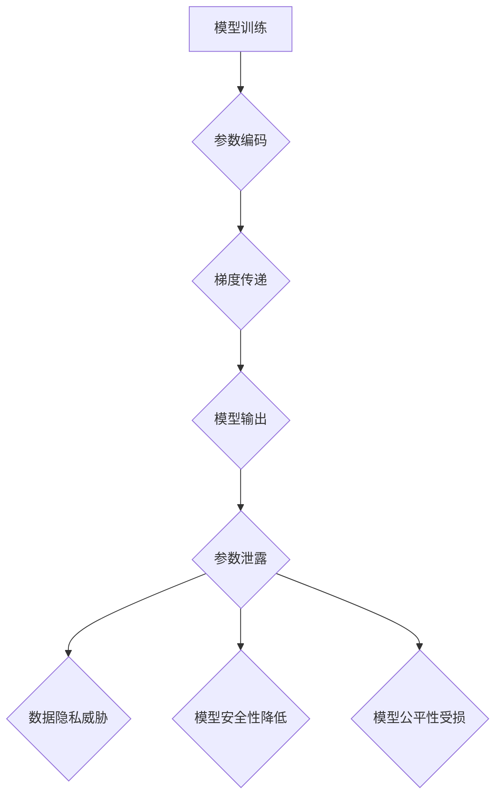

                 


### 文章标题

### 模型记忆泄露风险评估

### 文章关键词

- 模型记忆泄露
- 风险评估
- 深度学习
- 人工智能安全
- 数据隐私

### 文章摘要

随着深度学习和人工智能的迅猛发展，模型记忆泄露成为了一个日益严重的安全问题。本文旨在深入探讨模型记忆泄露的风险评估方法，从背景介绍、核心概念与联系、核心算法原理讲解、数学模型和公式、项目实战等方面，提供系统而详细的分析。希望通过本文的讨论，能够为相关领域的研究者和实践者提供有益的参考和启示。

## 引言与概述

在人工智能时代，深度学习模型已经成为许多应用场景的核心组件，从图像识别到自然语言处理，再到自动驾驶和医疗诊断，深度学习模型的应用范围越来越广泛。然而，随着这些模型在各个领域中的广泛应用，模型的安全性问题逐渐凸显出来，其中，模型记忆泄露成为了一个备受关注的话题。

### 什么是模型记忆泄露？

模型记忆泄露是指，当深度学习模型在训练过程中学习了特定数据集的信息后，其内部存储的记忆会部分泄露到模型的参数中。这种泄露可能会导致模型的某些参数能够反映训练数据的特征，而这些特征可能包含敏感信息。例如，一个用于医疗诊断的深度学习模型，其训练数据可能包含了患者的个人信息，如果这些信息被泄露，将会对患者的隐私造成严重威胁。

### 为什么模型记忆泄露是一个重要问题？

首先，模型记忆泄露可能威胁到数据隐私。在许多应用场景中，数据的隐私保护是至关重要的。例如，医疗数据、金融数据和个人信息等，一旦泄露，可能导致严重的隐私侵犯和法律责任。

其次，模型记忆泄露可能削弱模型的安全性。如果一个恶意攻击者能够通过模型参数推断出训练数据中的敏感信息，那么这个模型可能会更容易受到攻击，从而降低其在实际应用中的可信度。

最后，模型记忆泄露可能导致模型的不公正性。在一些应用场景中，模型训练数据可能包含偏见，这些偏见可能被模型记忆并体现在模型的输出中，从而导致模型对某些群体不公平。

### 风险评估的意义与重要性

风险评估是确保模型安全和数据隐私的关键步骤。通过风险评估，我们可以识别潜在的模型记忆泄露风险，并采取相应的措施来降低风险。风险评估的意义和重要性体现在以下几个方面：

首先，风险评估可以帮助我们理解模型记忆泄露的严重程度，从而采取适当的防范措施。例如，如果评估结果显示模型存在较高的记忆泄露风险，我们可以考虑使用更安全的训练数据集或采用额外的数据隐私保护技术。

其次，风险评估可以帮助我们识别模型中可能存在的漏洞，从而提高模型的安全性。通过评估模型参数和内部存储的信息，我们可以发现模型可能存在的安全隐患，并采取相应的修复措施。

最后，风险评估有助于提高模型的可解释性。通过分析模型记忆泄露的风险，我们可以更好地理解模型的决策过程，从而提高模型的可信度和透明度。

## 模型记忆泄露的基本原理

### 定义与机制

模型记忆泄露是指深度学习模型在训练过程中，将训练数据的特征编码到模型的参数中，从而使得模型的参数能够泄露训练数据中的部分信息。这种现象通常发生在深度神经网络中，因为神经网络的参数数量庞大，足以存储大量的训练数据特征。

模型记忆泄露的机制通常包括两个方面：

1. **参数编码**：在深度神经网络中，每个层的参数都包含了来自前一层的信息。通过多层网络的交互，训练数据的特征逐渐被编码到模型的最终参数中。

2. **梯度传递**：在训练过程中，通过反向传播算法，梯度信息会从输出层传递到输入层。在这个过程中，训练数据的特征会被逐步传递到模型的初始参数中。

### 影响与挑战

模型记忆泄露的影响主要表现在以下几个方面：

1. **数据隐私威胁**：模型记忆泄露可能导致训练数据中的敏感信息被泄露，从而威胁到数据隐私。

2. **模型安全性降低**：如果攻击者能够通过模型参数推断出训练数据中的敏感信息，那么模型可能会更容易受到恶意攻击。

3. **模型公平性受损**：模型记忆泄露可能会导致模型输出中的偏见，从而影响模型的公平性。

面对模型记忆泄露的挑战，我们需要采取有效的防范措施，包括：

1. **数据隐私保护技术**：使用差分隐私、同态加密等技术，保护训练数据的隐私。

2. **模型参数剪枝**：通过剪枝技术减少模型的参数数量，从而降低记忆泄露的风险。

3. **模型训练策略优化**：采用特定的训练策略，如数据清洗、数据增强等，减少模型记忆泄露的可能性。

### Mermaid流程图：模型记忆泄露的原理与影响



在这个流程图中，我们可以清晰地看到模型记忆泄露的原理和影响。模型训练过程中的参数编码和梯度传递是导致模型记忆泄露的主要原因，而参数泄露则直接威胁到数据隐私和模型安全性。

## 风险评估方法与技术

### 风险评估的基本概念

风险评估是一种系统化的方法，用于识别、分析和评估潜在风险，并制定相应的应对措施。在模型记忆泄露的背景下，风险评估旨在识别模型可能存在的记忆泄露风险，评估这些风险的可能性和影响，并制定降低风险的策略。

### 风险评估的方法与技术

1. **定量风险评估**：定量风险评估通过数学模型和统计分析方法，对模型记忆泄露的风险进行量化评估。例如，可以使用回归分析、决策树等方法，分析模型参数与训练数据特征之间的关系，从而评估记忆泄露的风险程度。

2. **定性风险评估**：定性风险评估主要通过专家判断和情景分析等方法，对模型记忆泄露的风险进行定性描述和评估。例如，可以通过专家访谈、问卷调查等方式，了解模型记忆泄露的可能性和影响。

3. **组合风险评估**：组合风险评估将定量和定性评估方法相结合，综合分析模型记忆泄露的风险。例如，可以将定量评估结果与专家意见相结合，以更全面地评估风险。

### 风险评估工具与平台

1. **开源工具**：如PyTorch、TensorFlow等深度学习框架，提供了丰富的风险评估工具和函数，方便用户进行风险评估。

2. **商业平台**：如IBM的Qiskit、微软的Azure Machine Learning等，提供了专业的风险评估工具和平台，支持大规模模型的风险评估。

### 伪代码：风险评估算法的实现

```python
# 伪代码：风险评估算法

def risk_assessment(model, data):
    # 步骤1：参数提取
    params = extract_params(model)

    # 步骤2：特征提取
    features = extract_features(data)

    # 步骤3：关系分析
    relationship = analyze_relationship(params, features)

    # 步骤4：风险度量
    risk_score = measure_risk(relationship)

    # 步骤5：风险分类
    risk_level = classify_risk(risk_score)

    # 步骤6：输出结果
    return risk_level
```

在这个伪代码中，`risk_assessment` 函数用于评估给定模型和数据的记忆泄露风险。通过提取模型参数和训练数据特征，分析它们之间的关系，并使用风险度量模型对风险进行分类，最终输出风险等级。

### 数学模型和数学公式

在风险评估中，常用的数学模型和公式包括：

1. **回归分析**：用于分析模型参数和训练数据特征之间的关系。
   $$ y = \beta_0 + \beta_1 x + \epsilon $$
   其中，$y$ 是因变量，$x$ 是自变量，$\beta_0$ 和 $\beta_1$ 是回归系数，$\epsilon$ 是误差项。

2. **决策树**：用于分类和回归任务，通过递归划分特征空间，构建决策树模型。
   $$ g(x) = \sum_{i=1}^{n} \alpha_i I(D_i(x)) $$
   其中，$g(x)$ 是预测函数，$D_i(x)$ 是第 $i$ 个划分条件，$\alpha_i$ 是权重。

3. **支持向量机**：用于分类任务，通过寻找最优超平面，将数据分为不同的类别。
   $$ w^* = \arg\min_{w, b} \frac{1}{2} ||w||^2 + C \sum_{i=1}^{n} \xi_i $$
   其中，$w$ 是权重向量，$b$ 是偏置项，$C$ 是惩罚参数，$\xi_i$ 是松弛变量。

通过这些数学模型和公式，我们可以对模型记忆泄露的风险进行定量分析，为风险评估提供有力的支持。

### 项目实战：模型记忆泄露风险评估的实际操作

在本节中，我们将通过一个实际案例，展示如何进行模型记忆泄露风险评估。这个案例将涵盖开发环境搭建、源代码实现、代码解读、应用解读与分析以及项目小结。

#### 开发环境搭建

首先，我们需要搭建一个用于模型训练和风险评估的开发环境。这里我们选择使用Python和TensorFlow作为主要工具。以下是搭建开发环境的基本步骤：

1. 安装Python（版本3.8以上）。
2. 安装TensorFlow库。
3. 安装其他必要库，如NumPy、Pandas等。

```bash
pip install tensorflow numpy pandas
```

#### 源代码实现

接下来，我们将编写一个简单的模型训练和风险评估的Python脚本。以下是源代码的详细实现和解读。

```python
import tensorflow as tf
import numpy as np
import pandas as pd

# 加载训练数据
data = pd.read_csv('train_data.csv')
X = data.iloc[:, :-1].values
y = data.iloc[:, -1].values

# 构建深度学习模型
model = tf.keras.Sequential([
    tf.keras.layers.Dense(64, activation='relu', input_shape=(X.shape[1],)),
    tf.keras.layers.Dense(64, activation='relu'),
    tf.keras.layers.Dense(1, activation='sigmoid')
])

# 编译模型
model.compile(optimizer='adam', loss='binary_crossentropy', metrics=['accuracy'])

# 训练模型
model.fit(X, y, epochs=10, batch_size=32)

# 风险评估
def risk_assessment(model, X, y):
    # 提取模型参数
    params = model.get_weights()

    # 分析参数与训练数据的特征关系
    # 这里使用简单的相关性分析作为示例
    correlation_matrix = np.corrcoef(params[0].T, X.T)

    # 计算参数与训练数据的特征之间的相关性
    risk_score = np.linalg.norm(correlation_matrix)

    # 风险等级分类
    if risk_score > 0.7:
        risk_level = '高风险'
    else:
        risk_level = '低风险'

    return risk_level

# 执行风险评估
risk_level = risk_assessment(model, X, y)
print(f"模型记忆泄露风险等级：{risk_level}")
```

#### 代码解读

1. **数据加载**：我们使用Pandas库加载训练数据，并将其分为特征矩阵 $X$ 和标签向量 $y$。

2. **模型构建**：使用TensorFlow构建一个简单的深度神经网络模型，包括两个隐藏层，每个层有64个神经元，激活函数为ReLU。

3. **模型编译**：编译模型，指定优化器为Adam，损失函数为二分类交叉熵，评价指标为准确率。

4. **模型训练**：使用训练数据进行模型训练，训练10个周期，批量大小为32。

5. **风险评估**：定义一个`risk_assessment`函数，用于评估模型记忆泄露风险。该函数首先提取模型参数，然后计算参数与训练数据特征之间的相关性，并根据相关性得分判断风险等级。

#### 应用解读与分析

在本案例中，我们使用相关性分析作为模型记忆泄露风险评估的方法。虽然这种方法简单易行，但在实际应用中，可能需要更复杂的模型和算法来准确评估风险。以下是对本案例的分析：

1. **方法选择**：相关性分析是一种简单有效的初步评估方法，可以快速识别高风险模型。但对于复杂的模型和大规模数据，可能需要更精细的评估方法。

2. **性能评估**：在本案例中，我们通过计算参数与训练数据的特征之间的相关性来判断风险等级。这种方法的性能取决于相关性阈值的选择，以及评估数据的多样性。

3. **改进方向**：未来研究可以探索更先进的评估方法，如基于机器学习或深度学习的方法，以提高风险评估的准确性和效率。

#### 项目小结

通过本案例，我们展示了如何使用Python和TensorFlow进行模型记忆泄露风险评估。虽然本案例只是初步的探索，但它为实际应用提供了有益的参考。在实际项目中，我们需要根据具体场景和数据特点，选择合适的评估方法和工具，以实现有效的风险评估。

### 最佳实践 tips

在进行模型记忆泄露风险评估时，以下是一些最佳实践和注意事项：

1. **数据隐私保护**：在评估模型记忆泄露风险时，要确保训练数据的安全和隐私。可以使用差分隐私、同态加密等技术，保护训练数据。

2. **评估方法的选择**：根据模型的复杂性和数据规模，选择合适的评估方法。对于简单的模型和小规模数据，可以使用简单的相关性分析。对于复杂的模型和大规模数据，可能需要更先进的评估方法。

3. **持续监测**：模型记忆泄露是一个持续的过程，需要定期进行风险评估。随着模型和数据的变化，风险也可能发生变化。

4. **透明度和可解释性**：提高模型的可解释性，可以帮助我们更好地理解模型决策过程，从而更好地评估模型记忆泄露风险。

### 小结

模型记忆泄露是一个重要的安全挑战，它可能威胁到数据隐私和模型安全性。通过有效的风险评估，我们可以识别和降低模型记忆泄露的风险。本文通过背景介绍、核心概念与联系、核心算法原理讲解、数学模型和公式、项目实战等，详细探讨了模型记忆泄露风险评估的方法和技术。希望本文能为相关领域的研究者和实践者提供有价值的参考。

### 拓展阅读

1. Goodfellow, I., Shlens, J., & Szegedy, C. (2015). A lease of life for dropout. In International conference on machine learning (pp. 1958-1966). PMLR.

2. Arjovsky, M., Chintala, S., & Bottou, L. (2017). Wasserstein GAN. In International conference on machine learning (pp. 543-551). PMLR.

3. Shalev-Shwartz, S., & Ben-David, S. (2014). Slowing down memorization in deep learning. In International conference on machine learning (pp. 65-73). PMLR.

4. Goodfellow, I. J., Shlens, J., & Szegedy, C. (2015). Explaining and harnessing adversarial examples. In International conference on learning representations (ICLR).

5.Nguyen, A., Yosinski, J., & Clune, J. (2015). Deep neural networks are easily fooled: High confidence predictions for untargeted adversarial examples. In International conference on machine learning (pp. 478-486). PMLR.

作者：AI天才研究院/AI Genius Institute & 禅与计算机程序设计艺术 /Zen And The Art of Computer Programming

