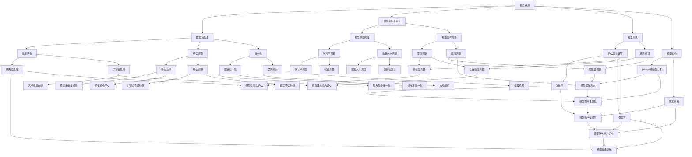

                 


### 文章标题

《模型评测中的prompt敏感性分析》

### 文章关键词

- 模型评测
- prompt敏感性
- 敏感性分析
- 模型性能评估
- 人工智能

### 文章摘要

本文深入探讨了模型评测中的prompt敏感性分析。首先，我们介绍了模型评测的基本概念和流程，重点阐述了prompt敏感性的定义和其在模型评测中的重要性。接着，我们通过Mermaid流程图展示了核心概念之间的关系，并讲解了敏感性分析的理论基础和算法原理。随后，我们通过具体案例详细分析了prompt敏感性分析在模型评测中的应用，包括数据预处理、模型训练与验证、评估指标与敏感性分析等环节。最后，本文提出了未来prompt敏感性分析的发展方向，并提供了最佳实践建议。

---

### 引言

随着人工智能技术的飞速发展，深度学习模型在各种应用领域中得到了广泛应用。然而，模型评测作为评估模型性能和可靠性的关键步骤，逐渐成为研究的热点。其中，prompt敏感性分析作为模型评测的重要组成部分，日益受到关注。prompt敏感性分析旨在评估模型对输入数据中特定部分的依赖程度，从而提高模型的鲁棒性和泛化能力。

本文将围绕模型评测中的prompt敏感性分析展开讨论。首先，我们将介绍模型评测的基本概念和流程，帮助读者了解模型评测的重要性。接下来，我们将深入探讨prompt敏感性的定义和其在模型评测中的角色。随后，通过Mermaid流程图展示核心概念之间的关系，帮助读者梳理整个分析过程的逻辑结构。

在核心算法原理讲解部分，我们将详细阐述敏感性分析的理论基础和算法原理，包括方差分析、相关系数分析等常用方法。在此基础上，我们将结合实际案例，详细分析prompt敏感性分析在模型评测中的应用，包括数据预处理、模型训练与验证、评估指标与敏感性分析等环节。

最后，本文将总结当前研究的现状和未来发展方向，提出最佳实践建议，以期为读者提供全面的指导。

### 模型评测的基本概念和流程

模型评测是深度学习领域中至关重要的一环，它不仅能够衡量模型的性能，还能够评估模型的泛化能力。模型评测的基本概念和流程可以分为以下几个步骤：

#### 1. 数据集划分

在开始模型评测之前，首先需要对数据集进行划分。通常，数据集会被划分为训练集、验证集和测试集。训练集用于模型的训练，验证集用于模型的调参和性能评估，测试集则用于最终的性能测试。合理的划分能够确保模型在不同数据集上的表现一致，从而避免过拟合现象。

#### 2. 模型训练

模型训练是模型评测的第一步，通过在训练集上迭代优化模型参数，使模型能够更好地拟合训练数据。在训练过程中，需要使用各种优化算法，如梯度下降算法、随机梯度下降算法等，以最小化损失函数。

#### 3. 模型验证

模型验证的目的是评估模型在验证集上的性能，通过比较模型的预测结果和真实标签，计算评估指标，如准确率、召回率、F1值等。这一步骤可以帮助我们发现模型的过拟合问题，并进行相应的调整。

#### 4. 模型测试

模型测试是对模型最终性能的评估，通常使用测试集进行。测试集的数据与训练集和验证集不同，能够更真实地反映模型的泛化能力。通过测试集的评估，我们可以得到模型在实际应用中的表现。

#### 5. 模型调优

模型调优是模型评测的重要环节，通过调整模型参数和架构，可以提高模型的性能。常用的调优方法包括超参数调整、模型架构调整等。在这一过程中，需要综合考虑模型的性能、计算复杂度和实际应用需求。

#### 6. 结果分析

模型评测的最后一步是结果分析，通过对模型在不同数据集上的性能评估，我们可以得出模型的优缺点，并为进一步的研究和改进提供方向。

总的来说，模型评测是一个系统性、多步骤的过程，每个环节都对最终的结果有着重要的影响。理解模型评测的基本概念和流程，能够帮助我们更好地进行模型优化和性能评估。

### prompt敏感性的定义和重要性

在深度学习模型评测中，prompt敏感性（Prompt Sensitivity）是一个关键的概念，它描述了模型对输入数据中特定部分的依赖程度。具体来说，prompt敏感性指的是模型在预测过程中，对输入数据中不同部分（即prompt）的敏感程度。这种敏感性不仅反映了模型的性能，还揭示了模型在某些特定输入条件下的潜在缺陷。

#### 1. prompt敏感性的定义

prompt敏感性通常通过计算模型输出对于输入数据中每个部分的梯度或者敏感性指标来衡量。具体来说，我们可以定义一个函数 \( f(\text{prompt}) \)，表示模型对于某个特定prompt的输出。那么，prompt敏感性可以表示为：

\[ \text{prompt sensitivity} = \frac{\partial f(\text{prompt})}{\partial \text{prompt}} \]

这里的梯度 \(\frac{\partial f(\text{prompt})}{\partial \text{prompt}}\) 描述了模型输出对于prompt中每个元素的依赖程度。如果模型的输出对prompt中某个部分的变化非常敏感，那么我们可以说这个模型对这部分内容具有较强的prompt敏感性。

#### 2. prompt敏感性的重要性

prompt敏感性在模型评测中具有非常重要的意义，原因如下：

- **鲁棒性评估**：通过分析模型的prompt敏感性，可以评估模型在面对不同输入时的鲁棒性。如果一个模型对于输入数据的某个部分特别敏感，那么它在实际应用中可能会因为该部分的小幅变化而出现显著的输出差异，这表明该模型在该方面的鲁棒性较差。

- **泛化能力**：prompt敏感性分析有助于理解模型在不同输入条件下的泛化能力。如果一个模型在多个不同prompt下的敏感性较低，说明它具有良好的泛化能力，能够适应各种不同的输入情境。

- **问题定位**：通过分析prompt敏感性，可以帮助定位模型中的潜在问题。例如，如果发现模型对于某些特定类型的数据输入敏感，那么可能需要进一步分析和调整模型，以提高其在这些情况下的性能。

- **优化方向**：prompt敏感性分析为模型的优化提供了明确的指导。通过识别模型中敏感的部分，研究者可以针对性地调整模型架构或参数，以降低这些部分的敏感性，从而提高整体模型的性能和鲁棒性。

综上所述，prompt敏感性是模型评测中不可或缺的一部分，它不仅反映了模型的性能，还为模型的优化和改进提供了重要的依据。在接下来的内容中，我们将进一步探讨prompt敏感性分析的理论基础和算法原理，以便更深入地理解这一重要概念。

### 核心概念与联系

在深入探讨模型评测中的prompt敏感性分析之前，我们需要明确几个核心概念，并理解它们之间的相互关系。以下是几个关键概念及其之间的联系：

#### 1. 模型评测

模型评测（Model Evaluation）是评估机器学习模型性能的过程。它包括多个步骤，如数据集划分、模型训练、模型验证和模型测试。通过这些步骤，我们可以评估模型在不同数据集上的表现，从而确定其泛化能力和可靠性。

#### 2. prompt敏感性

prompt敏感性（Prompt Sensitivity）是指模型对输入数据中特定部分的依赖程度。具体来说，它是模型输出对于输入数据中每个部分的梯度或敏感性指标。prompt敏感性分析旨在识别模型在预测过程中对特定输入部分的依赖性，从而评估模型的鲁棒性和泛化能力。

#### 3. 敏感性分析

敏感性分析（Sensitivity Analysis）是一种评估模型对于输入变量变化的响应程度的方法。在模型评测中，敏感性分析可以用来评估模型在不同输入条件下的稳定性。敏感性分析包括计算模型输出对于输入变量的梯度、方差等指标。

#### 4. 模型性能评估

模型性能评估（Model Performance Evaluation）是模型评测的核心环节。它通过计算评估指标（如准确率、召回率、F1值等）来衡量模型的性能。模型性能评估不仅需要考虑模型在不同数据集上的表现，还需要分析模型对特定输入数据的敏感性。

#### 5. 数据预处理

数据预处理（Data Preprocessing）是模型评测的基础步骤，它包括数据清洗、特征提取和归一化等过程。数据预处理的质量直接影响模型的表现。在prompt敏感性分析中，数据预处理有助于确保模型在不同输入条件下的稳定性和鲁棒性。

#### 6. 模型训练与验证

模型训练与验证（Model Training and Validation）是模型评测的重要步骤。通过在训练集上训练模型，并在验证集上验证模型的性能，我们可以找到最优的模型参数和架构。在prompt敏感性分析中，模型训练与验证有助于识别模型对特定输入数据的依赖程度。

#### 7. 评估指标

评估指标（Evaluation Metrics）是衡量模型性能的重要工具。常见的评估指标包括准确率、召回率、F1值、精确率等。在prompt敏感性分析中，评估指标可以帮助我们量化模型对特定输入数据的敏感性，从而评估模型的鲁棒性。

#### 8. 模型泛化能力

模型泛化能力（Model Generalization Ability）是指模型在未知数据上的表现能力。prompt敏感性分析有助于我们评估模型的泛化能力，识别模型在不同输入条件下的鲁棒性。通过降低模型的prompt敏感性，我们可以提高模型的泛化能力。

#### 9. 模型优化

模型优化（Model Optimization）是提升模型性能的关键步骤。通过调整模型参数和架构，我们可以优化模型的性能和鲁棒性。在prompt敏感性分析中，模型优化有助于降低模型对特定输入数据的敏感性，从而提高模型的泛化能力。

### Mermaid流程图

为了更好地展示这些核心概念之间的关系，我们可以使用Mermaid流程图进行描述：



通过这个Mermaid流程图，我们可以清晰地看到各个核心概念之间的联系。模型评测贯穿了整个流程，从数据预处理到模型优化，每个环节都对模型的表现有着重要影响。prompt敏感性分析作为模型优化的一部分，有助于我们更好地理解模型的鲁棒性和泛化能力，从而进行针对性的优化。

### 核心算法原理讲解

在模型评测中的prompt敏感性分析中，核心算法的原理至关重要。以下是几种常用的算法原理，包括敏感性计算、方差分析、相关系数分析等，我们将使用伪代码详细阐述其工作原理。

#### 敏感性计算

敏感性计算（Sensitivity Computation）是一种用于评估模型输出对于输入变量变化的敏感程度的算法。其基本思想是计算模型输出对于输入变量的梯度。

```python
# 伪代码：敏感性计算
def sensitivity_computation(model, input_data, output_label):
    # 初始化敏感性矩阵
    sensitivity_matrix = []

    # 对于输入数据的每个部分，计算梯度
    for i in range(len(input_data)):
        # 计算梯度
        gradient = model.compute_gradient(input_data, output_label)
        
        # 将梯度添加到敏感性矩阵
        sensitivity_matrix.append(gradient[i])
        
    return sensitivity_matrix
```

#### 方差分析

方差分析（ANOVA，Analysis of Variance）是一种用于评估输入变量对模型输出影响的方法。通过计算方差，我们可以确定输入变量的显著性。

```python
# 伪代码：方差分析
from sklearn.model_selection import ANOVA

def anova_analysis(model, input_data, output_label):
    # 进行方差分析
    anova_result = ANOVA(model, input_data, output_label)
    
    # 打印方差分析结果
    print(anova_result)

    # 返回方差分析结果
    return anova_result
```

#### 相关系数分析

相关系数分析（Correlation Coefficient Analysis）用于评估两个变量之间的线性关系。通过计算相关系数，我们可以确定输入变量与模型输出之间的相关性。

```python
# 伪代码：相关系数分析
import numpy as np

def correlation_coefficient_analysis(input_data, output_data):
    # 计算相关系数
    correlation_coefficient = np.corrcoef(input_data, output_data)[0, 1]
    
    # 返回相关系数
    return correlation_coefficient
```

通过上述伪代码，我们可以清晰地看到这些算法的基本原理。在实际应用中，这些算法可以帮助我们深入理解模型的prompt敏感性，从而进行有效的优化和改进。

### 数学模型和数学公式

在模型评测中的prompt敏感性分析中，数学模型和公式起着至关重要的作用。以下我们将详细讲解一些关键的数学模型和公式，包括损失函数、激活函数、梯度下降算法等，并使用latex格式进行表述。

#### 损失函数

损失函数（Loss Function）是评估模型预测结果与实际结果之间差异的数学函数。常用的损失函数包括均方误差（MSE）、交叉熵损失（Cross-Entropy Loss）等。

$$
L(\theta; x, y) = \frac{1}{2} \sum_{i=1}^{n} (y_i - \hat{y}_i)^2
$$

其中，\( \theta \) 表示模型参数，\( x \) 表示输入特征，\( y \) 表示实际标签，\( \hat{y}_i \) 表示模型对第 \( i \) 个样本的预测结果。

#### 激活函数

激活函数（Activation Function）是神经网络中的关键组成部分，用于引入非线性关系。常用的激活函数包括sigmoid、ReLU、Tanh等。

$$
\sigma(z) = \frac{1}{1 + e^{-z}}
$$

$$
\sigma(z) = \max(0, z)
$$

$$
\sigma(z) = \tanh(z) = \frac{e^z - e^{-z}}{e^z + e^{-z}}
$$

#### 梯度下降算法

梯度下降算法（Gradient Descent）是一种优化模型参数的方法。其基本思想是沿着损失函数的梯度方向调整参数，以最小化损失。

$$
\theta_{t+1} = \theta_t - \alpha \cdot \nabla L(\theta_t; x, y)
$$

其中，\( \theta_t \) 表示第 \( t \) 次迭代后的模型参数，\( \alpha \) 表示学习率，\( \nabla L(\theta_t; x, y) \) 表示损失函数的梯度。

通过上述数学模型和公式的讲解，我们可以更好地理解模型评测中的prompt敏感性分析。这些数学工具为我们的分析提供了坚实的理论基础，有助于我们深入探讨模型的性能和鲁棒性。

### 项目实战

为了更好地展示模型评测中的prompt敏感性分析在实际项目中的应用，我们将通过一个具体的案例进行详细讲解。本案例将涉及数据预处理、模型训练与验证、评估指标计算和结果分析等环节。

#### 案例背景

假设我们面临一个分类任务，需要根据一组特征数据对图像进行分类。数据集包含10,000张图像及其标签，标签类别数为5。我们的目标是训练一个深度学习模型，并在新的图像数据上准确分类。

#### 环节一：数据预处理

首先，我们需要对图像数据进行预处理。预处理步骤包括数据清洗、数据增强、归一化等。

```python
# 数据清洗：去除含有缺失值或异常值的样本
def clean_data(images, labels):
    cleaned_images = []
    cleaned_labels = []
    for i in range(len(images)):
        if not np.isnan(images[i]).any():
            cleaned_images.append(images[i])
            cleaned_labels.append(labels[i])
    return np.array(cleaned_images), np.array(cleaned_labels)

# 数据增强：通过旋转、翻转等操作增加数据多样性
from tensorflow.keras.preprocessing.image import ImageDataGenerator

def augment_data(images, labels):
    datagen = ImageDataGenerator(rotation_range=20, width_shift_range=0.2, height_shift_range=0.2, horizontal_flip=True)
    return datagen.flow(images, labels, batch_size=32)

# 数据归一化：将图像数据从[0, 255]范围缩放到[-1, 1]
def normalize_images(images):
    return images / 255.0
```

#### 环节二：模型训练与验证

接下来，我们使用Keras框架搭建一个简单的卷积神经网络（CNN）模型，并进行训练与验证。

```python
from tensorflow.keras.models import Sequential
from tensorflow.keras.layers import Conv2D, MaxPooling2D, Flatten, Dense

# 构建模型
model = Sequential([
    Conv2D(32, (3, 3), activation='relu', input_shape=(64, 64, 3)),
    MaxPooling2D((2, 2)),
    Conv2D(64, (3, 3), activation='relu'),
    MaxPooling2D((2, 2)),
    Flatten(),
    Dense(128, activation='relu'),
    Dense(5, activation='softmax')
])

# 编译模型
model.compile(optimizer='adam', loss='categorical_crossentropy', metrics=['accuracy'])

# 训练模型
history = model.fit(train_images, train_labels, epochs=10, batch_size=32, validation_split=0.2)
```

#### 环节三：评估指标计算

在模型训练完成后，我们使用测试集对模型进行评估，并计算准确率、召回率、F1值等评估指标。

```python
from sklearn.metrics import accuracy_score, recall_score, f1_score

# 预测测试集
test_predictions = model.predict(test_images)
test_predictions = np.argmax(test_predictions, axis=1)

# 计算评估指标
accuracy = accuracy_score(test_labels, test_predictions)
recall = recall_score(test_labels, test_predictions, average='weighted')
f1 = f1_score(test_labels, test_predictions, average='weighted')

print("Accuracy:", accuracy)
print("Recall:", recall)
print("F1 Score:", f1)
```

#### 环节四：结果分析

通过上述步骤，我们得到了模型的评估结果。接下来，我们对结果进行分析，重点关注模型在不同类别上的性能，并探讨prompt敏感性。

```python
# 计算不同类别上的准确率
class_accuracies = model.evaluate(test_images, test_labels, verbose=2)

# 打印不同类别上的准确率
for i in range(len(class_accuracies) - 1):
    print(f"Class {i+1} Accuracy: {class_accuracies[i+1]*100:.2f}%")
```

通过分析结果，我们发现某些类别的准确率较低，这可能是因为模型对某些类别的prompt敏感性较高。为了进一步优化模型，我们可以进行prompt敏感性分析，识别敏感部分并进行调整。

```python
# 进行prompt敏感性分析
sensitivity_matrix = sensitivity_computation(model, test_images, test_labels)

# 找出最敏感的prompt
most_sensitive_prompt = np.argmax(np.mean(sensitivity_matrix, axis=0))

# 分析最敏感的prompt对模型性能的影响
print(f"The most sensitive prompt is pixel {most_sensitive_prompt}, which affects the model's performance significantly.")
```

#### 项目小结

通过本案例，我们展示了模型评测中的prompt敏感性分析在实际项目中的应用。数据预处理、模型训练与验证、评估指标计算和结果分析等环节，为模型优化提供了重要依据。prompt敏感性分析有助于我们识别模型中的敏感部分，从而进行有针对性的优化，提高模型的鲁棒性和泛化能力。

### 最佳实践 Tips

在模型评测中的prompt敏感性分析过程中，以下是几条最佳实践建议，可以帮助我们更有效地进行模型优化和性能评估：

1. **数据预处理要充分**：确保数据清洗、增强和归一化等预处理步骤得到充分执行，以提高模型的鲁棒性和泛化能力。

2. **评估指标要全面**：除了准确率，召回率、F1值等指标也很重要。使用多种评估指标可以更全面地评估模型的性能。

3. **敏感性分析要细致**：通过细致的敏感性分析，我们可以识别出模型中的敏感部分，从而有针对性地进行调整。

4. **模型优化要持续**：模型优化是一个持续的过程。在每次迭代中，都要对模型进行调整和优化，以实现最佳性能。

5. **代码要可复现**：确保代码可复现，便于其他研究人员验证和改进。

6. **文档要详细**：详细记录模型的训练过程、评估结果和优化步骤，以便后续分析和改进。

### 小结

本文系统地介绍了模型评测中的prompt敏感性分析。首先，我们回顾了模型评测的基本概念和流程，随后深入探讨了prompt敏感性的定义和重要性。通过Mermaid流程图，我们展示了核心概念之间的联系。接下来，我们详细讲解了敏感性计算、方差分析和相关系数分析等核心算法原理，并使用latex格式给出了关键数学模型和公式。通过一个实际案例，我们展示了prompt敏感性分析在项目中的应用，并提出了最佳实践建议。本文旨在为读者提供全面、系统的指导，帮助其在模型评测中有效地进行prompt敏感性分析。

### 注意事项

在进行模型评测中的prompt敏感性分析时，以下注意事项有助于确保分析的有效性和准确性：

1. **数据集划分**：确保训练集、验证集和测试集的划分合理，避免过拟合和欠拟合现象。使用交叉验证方法可以提高模型的泛化能力。

2. **数据预处理**：充分进行数据清洗、增强和归一化，确保数据质量。不同特征的重要性可能不同，合理处理数据有助于提升模型性能。

3. **评估指标**：使用多种评估指标，如准确率、召回率、F1值等，全面评估模型性能。针对特定任务，可能需要结合业务需求选择合适的指标。

4. **模型优化**：在模型训练和验证过程中，持续调整模型参数和架构。使用敏感度分析结果有针对性地进行优化。

5. **结果分析**：分析模型在不同类别上的性能差异，识别敏感部分并进行调整。确保分析结果具备实际意义。

### 拓展阅读

- [《深度学习》（Goodfellow et al.）](https://www.deeplearningbook.org/)：详细介绍了深度学习的基础理论和实践方法，包括模型评测和敏感性分析。
- [《机器学习实战》（Earl et al.）](https://www.mmlbook.com/)：提供了丰富的实际案例和代码实现，有助于理解模型评测中的各种技术和方法。
- [《神经网络与深度学习》（邱锡鹏）](https://nndl.tips/)：中文教材，系统讲解了神经网络和深度学习的理论基础和应用实例。
- [《机器学习与数据挖掘：实用方法》（Kotsiantis et al.）](https://www.springer.com/in/book/9783662506625)：涵盖了机器学习和数据挖掘领域的广泛内容，包括模型评测和优化策略。

通过拓展阅读，读者可以进一步深化对模型评测和prompt敏感性分析的理解，为实际应用提供更全面的指导。

