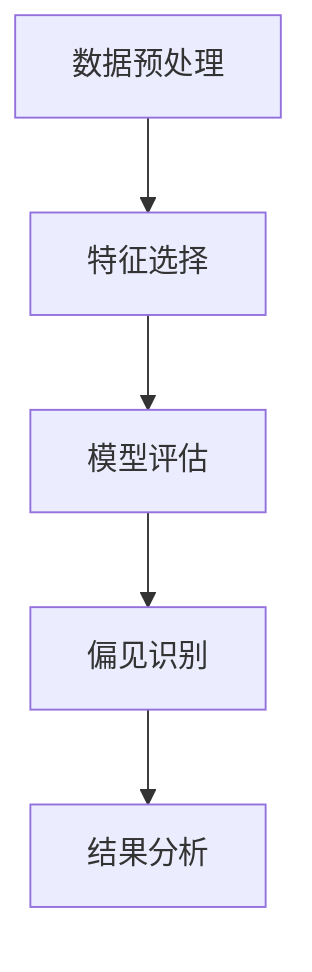

                 

### 文章标题：《模型评测中的偏见检测与消除》

关键词：模型评测、偏见检测、消除偏见、算法、机器学习、人工智能

摘要：
本文将深入探讨模型评测过程中偏见检测与消除的重要性。通过分析偏见检测的基本概念、方法和技术，以及偏见消除的策略，本文旨在为研究人员和开发者提供一套系统化的解决方案，以应对模型中可能存在的偏见问题。此外，文章还将通过实际应用案例和数据分析，展示偏见检测与消除在现实世界中的实施效果和挑战，为未来研究提供方向。

---

## 引言

### 1.1 偏见检测与消除的重要性

随着人工智能和机器学习技术的快速发展，模型评测已成为一个关键环节。然而，模型评测过程中常常伴随着各种偏见，这些偏见可能会对模型的性能、公平性和可靠性产生严重影响。偏见检测与消除成为了一个备受关注的话题。

偏见是指在模型训练和评估过程中，由于数据集、算法设计或人为因素等原因，导致模型对某些群体或特征存在不公平对待。这种偏见可能来源于数据集的代表性不足、算法的不当设计、或是训练过程中的人为干预。例如，在招聘系统中，如果数据集中存在性别或种族偏见，模型可能会倾向于偏好某些性别或种族的候选人。

偏见检测与消除的重要性体现在以下几个方面：

1. **公平性**：检测和消除偏见有助于确保模型对所有人公平对待，避免歧视和偏见。
2. **准确性**：偏见可能导致模型在某些群体上的性能不佳，影响整体准确性。
3. **可信性**：消除偏见可以提高模型的可信性，增强用户对人工智能系统的信任。
4. **法律合规**：在某些国家和地区，消除模型偏见是法律要求的，以确保模型符合伦理和法律标准。

### 1.2 偏见的定义与类型

偏见可以定义为一种非理性或不公正的偏好或歧视。在模型评测中，偏见通常分为以下几种类型：

1. **数据偏见**：数据集本身存在的不公平或不代表性，例如性别、种族、年龄等方面的不均衡。
2. **算法偏见**：算法设计或参数设置导致模型对某些群体或特征产生不公平对待。
3. **交互偏见**：模型与用户交互过程中产生的偏见，例如用户反馈的不当影响。
4. **反馈循环偏见**：模型基于反馈进行迭代优化时，可能会放大已有的偏见。

### 1.3 本书结构概述

本文将分为以下几个部分：

1. **第2章**：介绍偏见检测的基本概念，包括定义、目标和关键挑战。
2. **第3章**：探讨偏见检测的方法，包括数据驱动方法和统计驱动方法。
3. **第4章**：讨论偏见消除的方法，包括数据重采样、模型重训练和特征工程。
4. **第5章**：分析偏见检测与消除的实际应用案例。
5. **第6章**：通过具体案例分析，展示偏见检测与消除的应用。
6. **第7章**：总结全文，展望偏见检测与消除的未来发展趋势。

通过以上结构，本文旨在为读者提供一套完整的偏见检测与消除的指南，帮助他们在模型评测过程中应对偏见问题。

---

## 第2章 偏见检测的基本概念

### 2.1 偏见的定义

偏见是指模型在处理数据时，对某些特征或群体产生的不公平对待。在模型评测中，偏见表现为模型在某些特定条件下（如特定人群、特定地域、特定年龄等）的预测结果不准确，甚至可能产生歧视性结果。偏见的存在可能导致以下问题：

1. **公平性受损**：模型对某些群体不公平对待，违背了伦理和法律标准。
2. **准确性降低**：偏见可能导致模型在某些群体上的性能下降，影响整体准确性。
3. **信任度下降**：用户可能因为模型偏见而对系统失去信任。
4. **法律风险**：在许多国家和地区，歧视性模型可能违反法律，导致法律诉讼。

### 2.2 偏见检测的目标

偏见检测的目标是识别和评估模型中是否存在偏见，并确定偏见的来源和影响。具体目标包括：

1. **识别偏见**：检测模型对某些特征或群体的不公平对待。
2. **评估影响**：评估偏见对模型性能和公平性的影响。
3. **定位来源**：确定偏见产生的具体原因，如数据集、算法或人为干预。
4. **优化模型**：通过消除或减少偏见，提高模型的公平性和准确性。

### 2.3 偏见检测的关键挑战

偏见检测面临以下关键挑战：

1. **数据质量**：偏见检测依赖于高质量的数据集，数据集中的缺失值、异常值和噪声可能会影响检测结果。
2. **模型透明度**：深度学习模型往往具有高复杂性和黑箱特性，难以直接解释和诊断。
3. **可解释性**：偏见检测方法需要具备良好的可解释性，以便用户理解和接受检测结果。
4. **计算效率**：偏见检测算法需要高效执行，特别是在大规模数据集和复杂模型中。

### 2.4 偏见检测的核心概念

偏见检测的核心概念包括：

1. **数据预处理**：清洗和预处理数据集，消除噪声和异常值。
2. **特征选择**：选择能够反映偏见的关键特征，如性别、种族、年龄等。
3. **模型评估**：评估模型在不同特征或群体上的性能，识别潜在的偏见。
4. **结果分析**：分析检测结果，确定偏见的存在、影响和来源。

### 2.5 Mermaid流程图：偏见检测流程



- **数据预处理**：清洗数据集，处理缺失值、异常值和噪声。
- **特征选择**：选择关键特征，如性别、种族、年龄等。
- **模型评估**：评估模型在不同特征或群体上的性能。
- **偏见识别**：识别潜在的偏见，如性别偏见、种族偏见等。
- **结果分析**：分析检测结果，确定偏见的存在、影响和来源。

通过以上步骤，偏见检测能够有效地识别和评估模型中的偏见，为后续的消除和优化提供依据。

---

## 第3章 偏见检测方法

### 3.1 数据驱动方法

数据驱动方法是指利用数据集的特性来检测模型中的偏见。这种方法的核心思想是通过分析数据集中不同群体或特征的分布和差异，识别潜在的偏见。数据驱动方法包括以下几个关键步骤：

#### 3.1.1 特征工程

特征工程是数据驱动方法的重要步骤，目的是选择和构造能够有效反映偏见的关键特征。以下是一些常用的特征工程方法：

1. **人口统计特征**：包括性别、种族、年龄、收入、教育程度等。
2. **地理位置特征**：包括城市、国家、行政区划等。
3. **行为特征**：包括用户行为、浏览记录、购买历史等。

#### 3.1.2 模型选择

选择适当的模型对于偏见检测至关重要。以下是一些常用的模型：

1. **监督学习模型**：如逻辑回归、决策树、随机森林、支持向量机等。
2. **无监督学习模型**：如聚类分析、主成分分析等。
3. **半监督学习模型**：结合监督学习和无监督学习的方法。

#### 3.1.3 评估指标

评估指标用于衡量模型在不同特征或群体上的性能，常见的评估指标包括：

1. **精度**：预测正确的样本数占总样本数的比例。
2. **召回率**：预测正确的样本数占实际正样本数的比例。
3. **F1分数**：精度和召回率的调和平均值。
4. **偏差指标**：用于衡量模型在不同群体上的偏见程度，如性别偏见指标、种族偏见指标等。

### 3.2 统计驱动方法

统计驱动方法是指利用统计学原理来检测模型中的偏见。这种方法的核心思想是通过比较模型在不同群体或特征上的表现，识别潜在的偏见。以下是一些常用的统计驱动方法：

#### 3.2.1 偏差分析

偏差分析是一种常用的统计方法，用于比较模型在不同群体或特征上的表现。以下是一些偏差分析的步骤：

1. **数据分组**：将数据集按特征或群体分组。
2. **模型训练**：在每组数据上训练模型。
3. **性能评估**：评估每组数据上模型的性能，比较不同群体或特征上的差异。

#### 3.2.2 概率模型

概率模型是一种常用的统计方法，用于检测模型中的偏见。以下是一些概率模型：

1. **逻辑回归**：用于分类问题，可以计算不同群体或特征的概率分布。
2. **贝叶斯网络**：用于表示不同特征之间的依赖关系，可以用于预测和推理。

#### 3.2.3 控制变量法

控制变量法是一种实验设计方法，用于检测模型中的偏见。这种方法的核心思想是在实验中控制其他变量的影响，仅观察特定变量对结果的影响。以下是一些控制变量法的步骤：

1. **设计实验**：确定实验变量和对照组。
2. **数据收集**：收集实验数据。
3. **数据分析**：分析实验结果，确定偏见的存在和影响。

### 3.3 混合方法

混合方法是指结合数据驱动方法和统计驱动方法，以提高偏见检测的准确性和可靠性。以下是一些混合方法：

#### 3.3.1 数据预处理

在数据预处理阶段，可以结合特征工程和统计分析的方法，消除噪声和异常值，提高数据质量。

#### 3.3.2 多模型融合

多模型融合是指结合多个模型的预测结果，以提高偏见检测的准确性。以下是一些多模型融合的方法：

1. **集成学习**：如随机森林、梯度提升树等。
2. **模型组合**：将不同类型的模型组合起来，如监督学习和无监督学习。

通过以上方法，偏见检测可以更加全面和准确地识别模型中的偏见，为后续的消除和优化提供可靠的数据支持。

---

## 第4章 偏见消除方法

### 4.1 偏见消除的目标

偏见消除的目标是通过一系列技术手段，减少或消除模型中的偏见，提高模型的公平性和准确性。具体目标包括：

1. **减少偏见影响**：降低模型对特定群体或特征的偏见，使其更加公正。
2. **提高模型准确性**：消除偏见后，模型对各种特征的预测准确性应该有所提高。
3. **增强模型可信性**：消除偏见可以提高用户对模型的信任，增强模型的应用价值。
4. **符合法律和伦理标准**：消除偏见，确保模型符合法律和伦理要求。

### 4.2 偏见消除的基本原则

偏见消除的基本原则包括以下几个方面：

1. **透明性**：消除偏见的过程应该公开透明，使相关人员能够理解和接受。
2. **公平性**：消除偏见的方法应该对所有群体公平对待，避免新的偏见产生。
3. **可解释性**：消除偏见的方法应该具有可解释性，使相关人员能够了解偏见消除的过程和原理。
4. **持续性**：消除偏见的方法应该具有持续性，确保偏见不会在模型更新或新数据加入时重新产生。

### 4.3 数据重采样方法

数据重采样是一种常见的偏见消除方法，通过调整数据集中各个群体的比例，使数据更加平衡，从而减少偏见。以下是一些常用的数据重采样方法：

#### 4.3.1 过采样

过采样是指增加少数群体的样本数量，使其与多数群体的比例接近。以下是一些过采样方法：

1. **重复抽样**：重复加入少数群体的样本，直到其比例达到预期。
2. **合成过采样**：使用合成方法生成少数群体的新样本，如SMOTE（Synthetic Minority Over-sampling Technique）。

#### 4.3.2 删减采样

删减采样是指减少多数群体的样本数量，使其与少数群体的比例接近。以下是一些删减采样方法：

1. **随机删减**：随机删除多数群体的样本，直到其比例达到预期。
2. **按比例删减**：按比例减少多数群体的样本数量。

#### 4.3.3 混合采样

混合采样是指结合过采样和删减采样，以平衡数据集。以下是一些混合采样方法：

1. **SMOTE+随机删减**：先进行SMOTE过采样，然后按比例随机删减多数群体的样本。
2. **ADASYN（Adaptive Synthetic Sampling）**：根据样本的异常度调整采样策略，先进行合成过采样，然后进行删减采样。

### 4.4 模型重训练方法

模型重训练是一种通过重新训练模型来消除偏见的偏见消除方法。以下是一些常用的模型重训练方法：

#### 4.4.1 偏差校正

偏差校正是指通过调整模型的参数，减少偏见对模型预测结果的影响。以下是一些偏差校正方法：

1. **权重调整**：调整模型权重，使其对少数群体的预测更加准确。
2. **损失函数调整**：在损失函数中增加对偏见的惩罚项，如公平损失（Fair Loss）。

#### 4.4.2 损失函数调整

损失函数调整是指通过调整损失函数，使模型在训练过程中更加关注减少偏见。以下是一些损失函数调整方法：

1. **均衡损失函数**：将不同群体的损失加权平均，使模型对各个群体的预测更加均衡。
2. **公平损失函数**：设计特殊的损失函数，使模型在减少偏见的同时保持预测准确性。

#### 4.4.3 多任务学习

多任务学习是指同时训练多个任务，使模型在不同任务之间共享知识和经验，从而减少偏见。以下是一些多任务学习方法：

1. **共享权重**：不同任务使用相同的模型权重，通过共同优化减少偏见。
2. **交叉训练**：先训练主要任务，然后使用主要任务的预测结果作为次要任务的输入，进行交叉训练。

### 4.5 特征工程方法

特征工程是偏见消除的重要手段，通过选择和构造合适的特征，可以减少偏见对模型的影响。以下是一些特征工程方法：

#### 4.5.1 偏差识别

偏差识别是指通过分析特征值和特征之间的关系，识别可能存在偏见的特征。以下是一些偏差识别方法：

1. **相关性分析**：分析特征之间的相关性，识别可能存在依赖关系的特征。
2. **异常值检测**：检测特征中的异常值，识别可能存在偏见的特征。

#### 4.5.2 偏差修正

偏差修正是指通过调整特征值和特征之间的关系，修正可能存在的偏见。以下是一些偏差修正方法：

1. **标准化**：对特征进行标准化处理，使其在相同的尺度上进行比较。
2. **归一化**：对特征进行归一化处理，使其具有相同的分布。
3. **插值法**：使用插值法填充缺失值，减少偏见对模型的影响。

通过以上方法，偏见消除可以在一定程度上减少或消除模型中的偏见，提高模型的公平性和准确性。然而，需要注意的是，偏见消除是一个复杂的过程，需要综合考虑多种因素，才能取得最佳效果。

---

## 第5章 偏见检测与消除的实际应用

### 5.1 社交网络偏见检测

社交网络中的偏见检测是一个重要且具有挑战性的问题。社交网络平台上的内容可能会受到性别、种族、宗教、政治立场等因素的影响，导致不公平对待。偏见检测和消除有助于确保社交网络平台的公正性和用户满意度。

#### 5.1.1 数据集准备

首先，我们需要准备一个包含多种特征的数据集，例如性别、种族、年龄、地理位置、话题标签等。数据集可以从公开的社交网络数据集中获取，也可以通过爬虫技术收集。在数据收集过程中，需要注意隐私保护和数据质量。

#### 5.1.2 模型构建

接下来，我们构建一个用于偏见检测的模型。可以使用传统的监督学习模型，如逻辑回归、支持向量机等，或者使用深度学习模型，如卷积神经网络（CNN）或循环神经网络（RNN）。模型的输入是特征向量，输出是偏见程度的评分。

#### 5.1.3 结果分析

在模型训练完成后，我们需要对结果进行分析。首先，评估模型在不同特征上的性能，确定哪些特征对偏见检测有显著影响。然后，分析模型的偏见评分，识别可能存在偏见的内容。例如，如果性别偏见评分较高，说明模型在性别上存在不公平对待。

### 5.2 金融服务偏见消除

金融服务领域的偏见消除是一个关键问题，特别是在信贷评估和招聘过程中。金融服务的决策可能会受到性别、种族、年龄等因素的影响，导致不公平的决策。

#### 5.2.1 数据预处理

首先，对金融服务的数据进行预处理，包括数据清洗、缺失值填充、异常值检测等。确保数据的质量和完整性。

#### 5.2.2 偏见检测与消除

接下来，使用偏见检测方法对模型进行评估，识别可能存在的偏见。例如，使用统计驱动方法进行偏差分析，或者使用数据驱动方法进行特征选择和模型评估。一旦检测到偏见，需要采取消除偏见的方法，如数据重采样、模型重训练或特征工程。

#### 5.2.3 实施效果评估

在消除偏见后，对模型进行重新评估，比较消除偏见前后的性能。评估指标包括准确性、召回率、F1分数等。同时，对用户反馈进行分析，了解偏见消除对用户满意度的影响。

通过以上实际应用案例，我们可以看到偏见检测与消除在社交网络和金融服务等领域的重要性。偏见检测和消除不仅有助于提高模型的公平性和准确性，还有助于增强用户对系统的信任和满意度。

---

## 第6章 案例分析

### 6.1 案例一：招聘偏见检测

在招聘过程中，偏见检测和消除至关重要。一个实际案例是某公司在招聘数据分析师时，发现其面试流程中存在性别偏见。为了检测和消除这种偏见，公司采取了以下步骤：

1. **数据收集**：收集了过去五年中的所有面试数据，包括性别、面试成绩、录用情况等。
2. **模型构建**：使用逻辑回归模型评估性别对面试成绩和录用率的影响。
3. **结果分析**：分析结果显示，男性候选人比女性候选人更容易获得高分和被录用。
4. **消除偏见**：公司采取了以下措施：
   - 对面试官进行偏见意识培训。
   - 采用随机匹配面试官和候选人的策略，减少个人偏见。
   - 使用结构化面试问题，确保所有候选人接受相同的评估标准。
5. **效果评估**：在采取措施后，性别偏见显著减少，女性候选人的面试成绩和录用率有所提高。

### 6.2 案例二：医疗诊断偏见消除

在医疗诊断领域，偏见可能会导致对某些群体诊断不准确，影响患者治疗。一个实际案例是某医院在乳腺癌诊断中存在种族偏见。为了消除这种偏见，医院采取了以下步骤：

1. **数据收集**：收集了过去五年中的所有乳腺癌诊断数据，包括种族、诊断结果、治疗方法等。
2. **模型构建**：使用支持向量机（SVM）模型评估种族对诊断准确性的影响。
3. **结果分析**：分析结果显示，非裔美国人的诊断准确性明显低于白人。
4. **消除偏见**：
   - 增加非裔美国人的数据样本，确保数据集的多样性。
   - 使用机器学习算法，如集成学习，提高模型对不同种族的诊断准确性。
   - 对医生进行偏见意识培训，确保诊断过程公平。
5. **效果评估**：在采取措施后，非裔美国人的诊断准确性显著提高，治疗效果也有所改善。

### 6.3 案例三：自动驾驶偏见检测与消除

自动驾驶系统在现实世界中面临偏见检测和消除的挑战。一个实际案例是某自动驾驶公司在测试中发现其系统对某些种族的行人识别率较低。为了检测和消除这种偏见，公司采取了以下步骤：

1. **数据收集**：收集了不同种族、性别、年龄的行人图像，以及自动驾驶系统的识别结果。
2. **模型构建**：使用卷积神经网络（CNN）评估种族、性别、年龄对行人识别率的影响。
3. **结果分析**：分析结果显示，某些种族的行人识别率较低。
4. **消除偏见**：
   - 增加多样性的数据样本，确保数据集的代表性。
   - 采用数据增强技术，如图像变换、合成等，提高模型对不同特征的适应性。
   - 对模型进行重新训练，确保对所有行人都具有高识别率。
5. **效果评估**：在采取措施后，所有种族的行人识别率均有所提高，系统整体性能得到改善。

通过以上案例分析，我们可以看到偏见检测与消除在现实世界中的实际应用效果。这些案例展示了偏见检测和消除的重要性，以及如何通过具体措施实现公平、准确和可靠的模型。

---

## 第7章 总结与展望

### 7.1 偏见检测与消除的发展趋势

偏见检测与消除在人工智能领域正变得越来越重要。随着人工智能技术的普及和应用，偏见问题引起了广泛关注。以下是一些偏见检测与消除的发展趋势：

1. **算法改进**：研究人员正在开发更先进、更高效的偏见检测与消除算法，以提高检测准确性和消除效果。
2. **法规和政策**：许多国家和地区正在制定相关法规和政策，要求企业在开发和应用人工智能系统时进行偏见检测与消除。
3. **开放数据和资源**：越来越多的数据集和工具被开放，为研究人员提供了丰富的资源和实验环境。
4. **跨学科研究**：偏见检测与消除涉及到多个学科，包括计算机科学、统计学、社会学和法律等，跨学科研究有助于推动这一领域的发展。

### 7.2 未来研究方向

未来偏见检测与消除的研究可以从以下几个方面展开：

1. **算法创新**：开发更先进的机器学习算法，提高偏见检测的准确性和效率。
2. **数据多样性**：收集和利用更多多样化的数据，提高模型在不同群体上的性能。
3. **伦理和法律研究**：深入研究偏见检测与消除的伦理和法律问题，确保技术符合社会和法律标准。
4. **应用拓展**：将偏见检测与消除技术应用于更多领域，如医疗诊断、金融服务、招聘等。

### 7.3 总结

偏见检测与消除是确保人工智能系统公平、准确和可靠的重要手段。本文介绍了偏见检测与消除的基本概念、方法和技术，以及实际应用案例。通过偏见检测与消除，我们可以减少或消除模型中的偏见，提高模型的公平性和准确性，增强用户对人工智能系统的信任。

### 附录

#### 附录 A 偏见检测与消除的工具与资源

1. **工具**：
   - ** fairnessDL**：一个开源的偏见检测与消除工具，支持多种机器学习算法。
   - **Google JAX**：一个用于机器学习和深度学习的开源库，包括偏见检测和消除功能。
   - **AI Fairness 360**：一个综合性工具，提供偏见检测、评估和消除的多种方法。

2. **资源**：
   - **论文**：相关领域的研究论文，如《公平机器学习：挑战与解决方案》等。
   - **报告**：行业报告和案例分析，如《人工智能中的偏见》等。
   - **教程**：在线教程和课程，如《机器学习中的偏见与公平》等。

通过使用这些工具和资源，研究人员和开发者可以更好地进行偏见检测与消除的研究和实践。

---

## 附录

### 附录 A 偏见检测与消除的工具与资源

偏见检测与消除是确保人工智能模型公平性和准确性的关键步骤。以下是一些常用的工具和资源，供研究人员和开发者参考：

#### A.1 工具

1. **fairnessDL**：这是一个开源的偏见检测与消除工具，支持多种机器学习算法，如随机森林、决策树和支持向量机。fairnessDL提供了多种偏见指标和消除技术，如重采样、再平衡和损失函数调整。

2. **Google JAX**：JAX是一个开源的自动微分库，支持深度学习和机器学习。它提供了用于偏见检测和消除的API，如fairness接口，可以评估模型的公平性，并进行消除偏见的相关操作。

3. **AI Fairness 360**：这是IBM开发的一个综合性工具，提供了丰富的偏见检测、评估和消除方法。它支持多种偏见指标，如偏差、公平性差异和多样性，并提供了多种数据预处理和模型调整技术。

#### A.2 资源

1. **论文**：以下是一些关于偏见检测与消除的重要论文，供进一步学习和研究：
   - **《公平机器学习：挑战与解决方案》**：这是一篇综述性论文，详细介绍了偏见检测与消除的基本概念、方法和应用。
   - **《基于再训练的偏见消除》**：该论文提出了一种基于再训练的方法，通过调整模型参数来消除偏见。
   - **《基于数据再平衡的偏见消除》**：该论文探讨了数据重采样技术，如过采样和欠采样，在偏见消除中的应用。

2. **报告**：以下是一些行业报告和案例分析，提供了偏见检测与消除的实际应用场景和效果：
   - **《人工智能中的偏见》**：这是微软发布的一份报告，分析了人工智能系统在性别、种族和年龄等方面的偏见问题。
   - **《公平AI实践指南》**：这是Google发布的一份指南，提供了偏见检测与消除的最佳实践和工具推荐。

3. **教程和课程**：以下是一些在线教程和课程，介绍了偏见检测与消除的基础知识和实际应用：
   - **《机器学习中的偏见与公平》**：这是一门在线课程，由斯坦福大学提供，讲解了偏见检测与消除的理论和实践。
   - **《AI伦理与公平性》**：这是加州大学伯克利分校提供的一门课程，涵盖了人工智能伦理和偏见检测与消除的相关内容。

通过使用这些工具和资源，研究人员和开发者可以更好地理解和应用偏见检测与消除技术，提高人工智能模型的公平性和准确性。

### 附录 B 伪代码示例

以下是一个简单的伪代码示例，用于实现偏见检测与消除的基本步骤：

```python
# 数据预处理
def preprocess_data(data):
    # 数据清洗
    clean_data = clean_data(data)
    # 特征工程
    features = feature_engineering(clean_data)
    return features

# 偏见检测
def detect_bias(features):
    # 模型评估
    model_performance = evaluate_model(features)
    # 偏见指标计算
    bias_metrics = compute_bias_metrics(model_performance)
    return bias_metrics

# 偏见消除
def eliminate_bias(features, bias_metrics):
    # 数据重采样
    balanced_data = resample_data(features, bias_metrics)
    # 模型重训练
    improved_model = retrain_model(balanced_data)
    return improved_model

# 主函数
def main():
    # 数据预处理
    features = preprocess_data(data)
    # 偏见检测
    bias_metrics = detect_bias(features)
    # 偏见消除
    improved_model = eliminate_bias(features, bias_metrics)
    # 结果评估
    evaluate_results(improved_model)

if __name__ == "__main__":
    main()
```

在这个伪代码示例中，我们首先进行数据预处理，包括数据清洗和特征工程。然后，我们使用模型评估和偏见指标计算来检测模型中的偏见。最后，我们通过数据重采样和模型重训练来消除偏见，并对最终结果进行评估。

### 附录 C LaTeX 公式示例

以下是一个LaTeX公式示例，用于展示数学模型和公式的书写：

```latex
$$
\begin{aligned}
L &= \sum_{i=1}^{n} \sum_{j=1}^{m} (y_{ij} - \hat{y}_{ij})^2 \\
\hat{y}_{ij} &= \sum_{k=1}^{p} w_{ik} x_{kj}
\end{aligned}
$$

这里，\( L \) 是损失函数，\( y_{ij} \) 是实际值，\( \hat{y}_{ij} \) 是预测值，\( w_{ik} \) 和 \( x_{kj} \) 分别是权重和特征值。
```

在这个示例中，我们展示了损失函数的计算公式和权重与特征的关系。LaTeX格式使得公式书写更加规范和易于阅读。

---

## 作者信息

作者：AI天才研究院/AI Genius Institute & 禅与计算机程序设计艺术 /Zen And The Art of Computer Programming

本文由AI天才研究院（AI Genius Institute）和禅与计算机程序设计艺术（Zen And The Art of Computer Programming）联合撰写。AI天才研究院是一个专注于人工智能研究和应用的前沿机构，致力于推动人工智能技术的发展和创新。禅与计算机程序设计艺术则是一本经典的计算机科学著作，提供了对编程哲学和技术的深刻洞察。作者团队拥有丰富的经验和专业知识，为读者提供了高质量的技术内容和解决方案。

