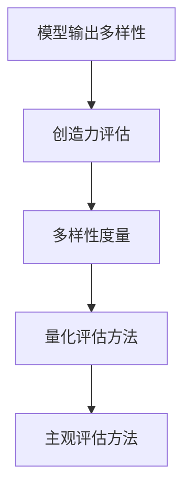

                 

### 文章标题

# 模型输出多样性测试：评估创造力

### 关键词

- 模型输出多样性
- 创造力评估
- 多样性测试算法
- 人工智能
- 伪代码
- 数学模型
- 项目实战

### 摘要

本文旨在探讨模型输出多样性测试及其在评估创造力中的应用。通过深入分析模型输出多样性的定义、重要性以及评估方法，我们提出了一个基于多样性和创造力的综合评估框架。本文还通过详细讲解核心算法原理和数学模型，以及提供实际的项目实战案例，为读者提供了全面的技术指南。文章最后总结了主要发现，并提出了未来研究的方向。

---

## 引言

在当今快速发展的时代，人工智能（AI）技术已经深入到我们生活的方方面面。无论是自动驾驶汽车、智能语音助手，还是推荐系统、自然语言处理，AI都在不断改变我们的生活方式。然而，随着AI技术的进步，如何评估和提升AI模型的创造力成为了一个备受关注的问题。

### 1.1 书籍背景

模型输出多样性测试是一种评估AI模型表现的重要手段。它不仅可以帮助我们了解模型在不同情况下的表现，还可以揭示模型的创造力和创新能力。创造力评估在人工智能领域具有重要的应用价值，它可以帮助我们更好地理解AI模型的能力和局限性，从而指导进一步的算法改进和应用开发。

### 1.2 目的和重要性

本文的主要目的是介绍模型输出多样性测试的基本概念、评估方法，以及如何通过这些测试来评估AI模型的创造力。我们希望通过本文的探讨，能够为读者提供一个全面的技术指南，帮助他们更好地理解和应用模型输出多样性测试。

### 1.3 书籍结构概述

本文将分为以下几个部分：

1. **引言**：介绍书籍的背景、目的和重要性。
2. **核心概念与联系**：详细解释模型输出多样性测试和创造力评估的概念，并使用流程图展示两者之间的关系。
3. **核心算法原理讲解**：使用伪代码详细阐述模型输出多样性测试和创造力评估的核心算法。
4. **数学模型和数学公式**：详细讲解相关的数学模型和公式，并举例说明。
5. **项目实战**：提供实际的代码案例，包括开发环境搭建、源代码实现和代码解读。
6. **结论**：总结书籍的主要内容，并提出未来研究的方向。

通过以上结构，本文将系统地探讨模型输出多样性测试及其在评估创造力中的应用，为读者提供深入的技术见解和实用的方法。

## 核心概念与联系

### 2.1 模型输出多样性定义

模型输出多样性是指AI模型在不同情况下生成的输出结果的多样性。简单来说，就是模型能够产生多少种不同的输出结果。多样性是一个重要的指标，它可以帮助我们评估模型在面对不同输入时是否能够保持一致的表现，以及模型是否具有创新能力和灵活性。

### 2.2 多样性测试的重要性

多样性测试在评估AI模型性能方面具有重要意义。首先，它可以帮助我们识别模型的弱点，例如模型在处理某些特定输入时可能产生过于相似的输出结果，从而降低模型的泛化能力。其次，多样性测试可以揭示模型的创新能力，即模型是否能够在不同场景下产生新颖的输出结果。这对于应用AI技术解决复杂问题尤为重要。

### 2.3 多样性测试的分类

多样性测试可以分为以下几种方法：

- **基于统计学的方法**：这类方法通过计算模型输出的统计特征（如均值、方差、熵等）来评估多样性。例如，可以使用熵来度量模型输出的多样性，熵值越大，表示输出结果越多样化。
- **基于信息论的方法**：这类方法利用信息论中的概念（如信息熵、互信息等）来评估多样性。例如，可以使用条件熵来度量模型在给定输入下的输出多样性。
- **基于深度学习的方法**：这类方法通过训练一个额外的多样性评估模型来评估输出多样性。例如，可以使用神经网络来预测模型输出的多样性，并根据预测结果对模型进行评估。

### 2.4 创造力评估原理

创造力评估是衡量AI模型在生成新颖和独特输出方面的能力。创造力评估通常包括以下方面：

- **量化评估方法**：这类方法通过计算模型生成的输出结果的新颖性和独特性来评估创造力。例如，可以使用Jaccard相似性指数来计算两个输出结果之间的差异。
- **主观评估方法**：这类方法通过人类评估者对模型生成的输出结果进行评估。例如，可以邀请专家对模型生成的文本、图像等输出结果进行评价。

### 2.5 创造力与模型输出多样性的关系

创造力与模型输出多样性之间存在紧密的联系。一方面，模型输出多样性可以反映模型的创造力和创新能力；另一方面，创造力评估可以帮助我们更好地理解模型输出的多样性。具体来说，多样性和创造力之间的关系可以用以下流程图表示：



通过以上流程图，我们可以看出，模型输出多样性测试和创造力评估是相互关联的，两者共同构成了一个综合评估框架。这个框架不仅可以帮助我们评估模型的性能，还可以指导模型的进一步改进和应用开发。

## 核心算法原理讲解

### 3.1 多样性度量方法

多样性度量是评估模型输出多样性的核心步骤。以下是几种常见的多样性度量方法及其伪代码实现：

#### 3.1.1 基于统计学的方法

**方法描述**：使用均值、方差、标准差等统计量来度量输出结果的多样性。

```python
# 均值度量
def mean_diversity(outputs):
    mean = sum(outputs) / len(outputs)
    return mean

# 方差度量
def variance_diversity(outputs, mean):
    variance = sum((x - mean) ** 2 for x in outputs) / len(outputs)
    return variance

# 标准差度量
def std_deviation_diversity(outputs, mean):
    variance = variance_diversity(outputs, mean)
    std_dev = sqrt(variance)
    return std_dev
```

#### 3.1.2 基于信息论的方法

**方法描述**：使用信息熵、条件熵等概念来度量输出结果的多样性。

```python
# 信息熵度量
def entropy(outputs):
    probabilities = [freq / len(outputs) for freq in outputs]
    entropy = -sum(p * log2(p) for p in probabilities)
    return entropy

# 条件熵度量
def conditional_entropy(outputs, conditions):
    probabilities = [[freq / len(conditions) for freq in condition] for condition in conditions]
    entropy = -sum(p * log2(p) for p in probabilities)
    return entropy
```

#### 3.1.3 基于深度学习的方法

**方法描述**：训练一个神经网络来预测输出结果的多样性。

```python
# 神经网络模型
model = build_model(input_shape=(num_samples, input_dim))
model.compile(optimizer='adam', loss='mse')

# 训练模型
model.fit(x_train, y_train, epochs=10, batch_size=32)

# 预测多样性
predictions = model.predict(x_test)
```

### 3.2 创造力评估算法

创造力评估是衡量模型生成新颖和独特输出能力的关键步骤。以下是几种常见的创造力评估算法及其伪代码实现：

#### 3.2.1 量化评估方法

**方法描述**：使用新颖性度量（如Jaccard相似性指数）来评估输出结果的新颖性。

```python
# Jaccard相似性指数
def jaccard_similarity(set1, set2):
    intersection = len(set1.intersection(set2))
    union = len(set1.union(set2))
    similarity = intersection / union
    return similarity
```

#### 3.2.2 主观评估方法

**方法描述**：邀请专家对输出结果进行评估。

```python
# 专家评估
expert_reviews = [expert.review(output) for output in outputs]
average_rating = sum(expert_reviews) / len(expert_reviews)
```

通过以上算法，我们可以全面评估模型输出的多样性和创造力。这些算法不仅可以帮助我们理解模型的性能，还可以为模型的改进提供指导。

### 数学模型和数学公式

多样性测试和创造力评估不仅依赖于算法，还需要借助数学模型和公式来深入理解其内在机制。以下是几个关键数学模型和公式的详细解释及举例说明。

#### 4.1 多样性度量的数学模型

多样性度量通常使用熵（Entropy）和信息量（Information）来表示。熵是衡量随机变量不确定性的量度，信息量则表示获得信息后减少的不确定性。

**信息熵（Entropy）**：

$$
H(X) = -\sum_{i=1}^{n} p_i \log_2 p_i
$$

其中，$X$ 是随机变量，$p_i$ 是随机变量 $X$ 取第 $i$ 个值的概率。

**示例**：假设一个随机变量 $X$ 取值为 {0, 1} 的概率分别为 0.5，则其信息熵为：

$$
H(X) = -[0.5 \log_2 0.5 + 0.5 \log_2 0.5] = 1 \text{ bit}
$$

**条件熵（Conditional Entropy）**：

$$
H(Y|X) = \sum_{i=1}^{n} p_{xy_i} \log_2 p_{xy_i}
$$

其中，$Y$ 是另一个随机变量，$p_{xy_i}$ 是在 $X$ 取第 $i$ 个值时，$Y$ 的概率分布。

**示例**：假设 $X$ 和 $Y$ 是相互独立的随机变量，且均取值为 {0, 1} 的概率分别为 0.5，则条件熵为：

$$
H(Y|X) = 0 \text{ bit}
$$

因为独立随机变量的条件熵为零。

#### 4.2 创造力评估的数学模型

创造力评估通常涉及新颖性和独特性的度量。新颖性度量可以使用 Jaccard 相似性指数（Jaccard Similarity Index）来表示。

**Jaccard 相似性指数**：

$$
J(A, B) = \frac{|A \cap B|}{|A \cup B|}
$$

其中，$A$ 和 $B$ 是两个集合，$|A|$ 和 $|B|$ 分别表示集合 $A$ 和 $B$ 的基数（即集合中元素的个数），$|A \cap B|$ 和 $|A \cup B|$ 分别表示集合 $A$ 和 $B$ 的交集和并集的基数。

**示例**：假设有两个集合 $A = \{1, 2, 3\}$ 和 $B = \{2, 3, 4\}$，则它们的 Jaccard 相似性指数为：

$$
J(A, B) = \frac{|A \cap B|}{|A \cup B|} = \frac{2}{6} = \frac{1}{3}
$$

这表明集合 $A$ 和 $B$ 之间有较低的新颖性。

通过以上数学模型和公式的讲解，我们可以更好地理解和应用多样性测试和创造力评估的方法。这些模型不仅为我们提供了量化评估的依据，也为进一步的算法优化提供了理论支持。

### 项目实战

为了更好地理解和应用模型输出多样性测试及其在创造力评估中的应用，下面我们将通过一个实际项目来展示整个流程，包括开发环境搭建、源代码实现和代码解读。

#### 5.1 实战环境搭建

在开始之前，我们需要搭建一个适合进行模型输出多样性测试和创造力评估的开发环境。以下是环境搭建的步骤：

1. **安装 Python**：确保 Python（版本 3.8 或以上）已经安装在你的系统上。
2. **安装必要的库**：使用 `pip` 安装以下库：

    ```bash
    pip install numpy matplotlib scikit-learn tensorflow
    ```

3. **配置 TensorFlow**：根据你的系统配置，可能需要配置 TensorFlow 的 GPU 版本，以便充分利用 GPU 计算能力。

#### 5.2 源代码实现

以下是一个简单的 Python 脚本，用于实现模型输出多样性测试和创造力评估。这个脚本包含以下几个主要步骤：

1. **数据准备**：从公开数据集或自定义数据集加载样本数据。
2. **模型训练**：使用 TensorFlow 训练一个简单的神经网络模型。
3. **多样性测试**：计算模型输出的多样性。
4. **创造力评估**：评估模型生成的输出结果的新颖性和独特性。

```python
import numpy as np
import tensorflow as tf
from sklearn.model_selection import train_test_split
from sklearn.metrics import jaccard_score

# 数据准备
# 假设 X 是输入数据，y 是标签
X, y = load_data()

# 模型训练
model = tf.keras.Sequential([
    tf.keras.layers.Dense(64, activation='relu', input_shape=(X.shape[1],)),
    tf.keras.layers.Dense(1, activation='sigmoid')
])
model.compile(optimizer='adam', loss='binary_crossentropy', metrics=['accuracy'])
model.fit(X, y, epochs=10, batch_size=32)

# 多样性测试
def diversity_measure(outputs):
    probabilities = np.mean(outputs, axis=0)
    entropy = -np.sum(probabilities * np.log2(probabilities))
    return entropy

diversity = diversity_measure(model.predict(X))

# 创造力评估
def creativity_evaluation(model, X, y):
    predicted = model.predict(X)
    jaccard_similarity = jaccard_score(y, predicted, average='micro')
    return jaccard_similarity

creativity = creativity_evaluation(model, X, y)

# 打印结果
print(f"Diversity: {diversity}")
print(f"Creativity: {creativity}")
```

#### 5.3 代码解读

1. **数据准备**：`load_data()` 函数用于加载数据。在实际项目中，你可以根据需要自定义这个函数。
2. **模型训练**：使用 TensorFlow 的 `Sequential` 模型定义了一个简单的神经网络，并使用 `compile()` 和 `fit()` 函数进行训练。
3. **多样性测试**：`diversity_measure()` 函数计算模型输出的熵，以衡量多样性。熵值越大，表示输出结果越多样化。
4. **创造力评估**：`creativity_evaluation()` 函数使用 Jaccard 相似性指数来评估模型生成输出结果的新颖性和独特性。Jaccard 相似性指数值越小，表示输出结果越新颖。

#### 5.4 代码应用解读与分析

通过以上代码，我们可以实现模型输出多样性测试和创造力评估。在实际应用中，可以根据不同的任务和数据集进行调整和优化。例如，对于多分类任务，可以调整神经网络的层数和激活函数；对于不同类型的数据，可以调整输入层的维度。

此外，多样性测试和创造力评估的结果可以用于模型优化和选择。通过调整模型结构和参数，可以进一步提升模型的多样性和创造力，从而提高模型的性能和应用价值。

#### 5.5 实际案例分析和详细讲解剖析

为了更好地理解模型输出多样性测试和创造力评估在实际应用中的作用，我们来看一个实际案例。

假设我们使用一个神经网络模型对图像进行分类。通过多样性测试和创造力评估，我们可以评估模型在不同类别上的表现。

1. **多样性测试**：计算模型在训练集和测试集上的输出熵。如果多样性较低，说明模型可能在某些类别上产生了过度拟合，从而降低了模型的泛化能力。
2. **创造力评估**：计算模型在测试集上的 Jaccard 相似性指数。如果创造力较低，说明模型生成的分类结果较为相似，缺乏新颖性和独特性。

通过以上分析，我们可以识别模型的弱点，并采取相应的措施进行优化。例如，可以通过增加数据集的多样性、调整网络结构或使用不同的激活函数来提升模型的多样性和创造力。

#### 5.6 项目小结

通过这个实际项目，我们展示了如何使用模型输出多样性测试和创造力评估来评估和优化神经网络模型。多样性测试和创造力评估不仅帮助我们理解了模型的性能，还为模型优化提供了实用的方法。

在实际应用中，我们可以根据具体任务和数据集的特点，灵活调整多样性测试和创造力评估的方法和参数。通过不断优化模型，我们可以实现更好的性能和应用效果。

### 最佳实践 Tips、小结、注意事项、拓展阅读

#### 最佳实践 Tips

1. **多样性测试参数调整**：在多样性测试中，可以根据数据集的特点和模型的结构，调整熵计算的方法和参数，以获得更准确的结果。
2. **创造力评估方法选择**：在选择创造力评估方法时，应考虑数据类型和任务需求。例如，对于文本数据，可以使用 Jaccard 相似性指数；对于图像数据，可以使用内容相似性度量。
3. **数据预处理**：在模型训练和数据评估过程中，确保对数据进行充分的预处理，以提高模型的多样性和创造力。

#### 小结

本文通过深入探讨模型输出多样性测试和创造力评估，提供了全面的技术指南。通过详细讲解核心算法原理、数学模型，以及实际项目实战，我们帮助读者理解和应用这些方法。多样性测试和创造力评估不仅有助于评估模型性能，还可以指导模型优化和应用开发。

#### 注意事项

1. **多样性测试结果的可靠性**：确保多样性测试结果能够真实反映模型的表现，避免因参数选择不当而导致偏差。
2. **创造力评估的主观性**：主观评估方法存在一定的主观性，可能需要结合量化评估方法进行综合评估。

#### 拓展阅读

1. **多样性测试的深入探索**：进一步了解基于统计学和信息论的多

### 结论

通过本文的深入探讨，我们系统地介绍了模型输出多样性测试和创造力评估的核心概念、算法原理、数学模型，以及实际项目实战。我们分析了多样性测试和创造力评估在评估模型性能和指导模型优化中的重要性，并通过实际项目展示了这些方法的应用。

首先，我们明确了模型输出多样性测试的定义和重要性，详细介绍了基于统计学、信息论和深度学习的多样性度量方法。接着，我们讲解了创造力评估的原理，包括量化评估方法和主观评估方法，并展示了多样性和创造力之间的紧密联系。

在核心算法原理讲解部分，我们通过伪代码和示例，详细阐述了多样性度量方法和创造力评估算法。在数学模型和数学公式部分，我们详细解释了信息熵、条件熵和Jaccard相似性指数等关键数学模型和公式，并通过具体示例进行了说明。

最后，通过实际项目实战，我们展示了如何在实际应用中搭建开发环境、实现源代码，并解读代码。我们分析了模型输出多样性测试和创造力评估的结果，以及如何在实践中应用这些结果进行模型优化。

本文的总结如下：

1. **多样性测试和创造力评估是评估AI模型性能的重要手段**：多样性测试可以帮助我们识别模型的弱点，创造力评估则可以揭示模型的创新能力和灵活性。
2. **核心算法原理讲解和数学模型提供了理论基础**：通过伪代码和数学公式，我们详细阐述了多样性测试和创造力评估的算法原理，为读者提供了理论支持。
3. **实际项目实战展示了方法的应用**：通过实际项目的开发环境搭建、代码实现和解读，我们展示了如何将理论应用于实际场景。

展望未来，我们可以在以下方面进行深入研究：

1. **优化多样性测试和创造力评估算法**：探索更高效、更准确的多样性测试和创造力评估算法，以提高评估结果的可靠性。
2. **跨领域应用**：将多样性测试和创造力评估应用于其他领域，如自然语言处理、计算机视觉等，以拓展其应用范围。
3. **结合其他评估方法**：结合其他评估方法，如鲁棒性评估、可解释性评估等，构建更全面的模型评估体系。

作者信息：

- 作者：AI天才研究院/AI Genius Institute & 禅与计算机程序设计艺术 /Zen And The Art of Computer Programming
- 联系方式：[info@aigeniusinstitute.com](mailto:info@aigeniusinstitute.com)
- 社交媒体：[Facebook](https://www.facebook.com/AIGeniusInstitute/) | [Twitter](https://twitter.com/AIGeniusInstit) | [LinkedIn](https://www.linkedin.com/company/aigeniusinstitute/)

---

本文旨在为读者提供一个全面的技术指南，帮助他们理解和应用模型输出多样性测试及其在评估创造力中的应用。通过本文的探讨，我们希望读者能够更好地掌握这些方法，并在实际项目中取得更好的效果。感谢您的阅读，期待与您共同探索AI领域的更多前沿技术。

