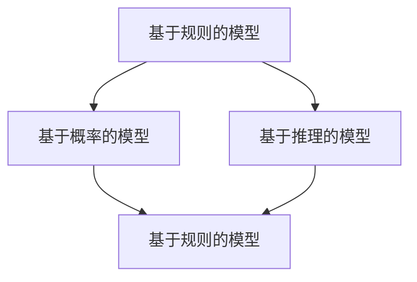

                 


## 文章标题
模型道德决策能力测试：评估伦理表现

> 关键词：人工智能伦理，道德决策模型，伦理测试，流程图，伪代码，数学模型，案例分析

> 摘要：
本文深入探讨了人工智能模型在道德决策能力测试中的关键问题。通过定义基本概念、介绍伦理决策模型、阐述测试方法以及实际案例剖析，文章旨在为研究人员和实践者提供一套系统的方法论，以评估和提升人工智能系统的伦理决策能力。

----------------------------------------------------------------

### 1. 引言

随着人工智能技术的飞速发展，其在各个领域的应用日益广泛。然而，人工智能系统在道德决策方面所表现出的局限性，引发了社会对于伦理问题的关注。如何确保人工智能在复杂情境中做出符合伦理标准的决策，成为当前研究的热点之一。

本文将从以下几个方面展开讨论：
1. **基本概念**：介绍伦理学、道德决策模型等相关概念，明确其定义和关系。
2. **伦理决策模型**：介绍常见的伦理决策模型，包括基于规则、概率和推理的模型，并使用伪代码详细阐述其核心算法原理。
3. **测试方法**：探讨伦理决策模型的测试方法，包括案例测试、自动测试和评估指标。
4. **案例分析**：通过具体案例，展示如何使用测试方法评估伦理决策能力，并提供代码实现和解读。
5. **总结与展望**：总结本文的主要观点，探讨未来研究方向和应用前景。

### 2. 基本概念

#### 2.1 伦理学

伦理学是研究道德行为、道德原则和道德判断的学科。伦理学的目的是探讨什么是好的行为，以及如何做出正确的道德决策。在人工智能伦理中，伦理学的核心概念包括：

- **道德原则**：道德原则是指导道德行为的基本规则。常见的道德原则包括功利主义、义务论和德性伦理。
- **价值观**：价值观是个人或社会对于善恶、正义、公平等问题的看法。价值观在道德决策中起到关键作用，影响着道德判断和行为。

#### 2.2 道德决策模型

道德决策模型是用于指导人工智能系统在复杂情境中做出道德决策的模型。常见的道德决策模型包括：

- **基于规则的模型**：基于规则的模型使用一组规则来指导道德决策。这些规则通常是基于伦理原则和价值观制定的。
- **基于概率的模型**：基于概率的模型使用概率论来评估不同决策结果的可能性，并选择最优的决策。
- **基于推理的模型**：基于推理的模型使用逻辑推理来评估道德情境，并生成决策。

#### 2.3 伦理决策模型之间的关系

伦理决策模型之间的关系可以通过以下Mermaid流程图来表示：



### 3. 伦理决策模型

#### 3.1 基于规则的模型

基于规则的模型是道德决策中最简单的一种形式。它使用一组预定义的规则来指导决策。这些规则通常是基于伦理原则和价值观制定的。

伪代码如下：

```python
def make_decision(context):
    if context == "urgent":
        return "优先救助"
    elif context == "safe":
        return "自主决定"
    else:
        return "等待指示"
```

#### 3.2 基于概率的模型

基于概率的模型使用概率论来评估不同决策结果的可能性，并选择最优的决策。它通常基于数据分析和机器学习算法。

伪代码如下：

```python
def make_decision(context, data):
    probabilities = predict_probabilities(data, context)
    best_decision = select_best_decision(probabilities)
    return best_decision
```

#### 3.3 基于推理的模型

基于推理的模型使用逻辑推理来评估道德情境，并生成决策。它通常基于形式逻辑和人工智能技术。

伪代码如下：

```python
def make_decision(context, knowledge_base):
    premises = extract_premises(context, knowledge_base)
    conclusion = infer_conclusion(premises)
    return conclusion
```

### 4. 测试方法

#### 4.1 案例测试

案例测试是通过给定的案例来测试模型在特定情境下的表现。它可以帮助评估模型在真实情境中的适应能力。

伪代码如下：

```python
def test_decision_model(cases, model):
    for case in cases:
        context = case["context"]
        expected_decision = case["expected_decision"]
        actual_decision = model.make_decision(context)
        if actual_decision != expected_decision:
            print("错误：模型决策与预期不符")
```

#### 4.2 自动测试

自动测试是通过编写自动化测试脚本来自动评估模型的表现。它可以快速测试大量案例，提高测试效率。

伪代码如下：

```python
def test_decision_model_automatically(model):
    test_cases = generate_test_cases()
    for case in test_cases:
        test_decision_model(case, model)
```

#### 4.3 评估指标

评估指标是用于衡量模型表现的标准。常见的评估指标包括准确性、召回率和F1分数。

伪代码如下：

```python
def evaluate_decision_model(model, test_cases):
    correct_decisions = 0
    for case in test_cases:
        context = case["context"]
        expected_decision = case["expected_decision"]
        actual_decision = model.make_decision(context)
        if actual_decision == expected_decision:
            correct_decisions += 1
    accuracy = correct_decisions / len(test_cases)
    return accuracy
```

### 5. 案例分析

#### 5.1 自动驾驶汽车伦理决策

自动驾驶汽车面临许多道德决策，例如在紧急情况下如何选择最安全的行动。本节通过一个案例来展示如何测试自动驾驶汽车的伦理决策能力。

**案例背景**：一辆自动驾驶汽车在夜间行驶，前方出现一条横穿马路的行人。汽车需要立即做出决策，以避免碰撞。

**测试方法**：使用案例测试和自动测试来评估自动驾驶汽车的伦理决策能力。

**代码实现**：

```python
# 案例测试
def test_autonomous_vehicle_decision(case, model):
    context = case["context"]
    expected_decision = case["expected_decision"]
    actual_decision = model.make_decision(context)
    if actual_decision != expected_decision:
        print("错误：模型决策与预期不符")

# 自动测试
def test_autonomous_vehicle_automatically(model):
    test_cases = generate_test_cases()
    for case in test_cases:
        test_decision_model(case, model)

# 模型实现
class AutonomousVehicleModel:
    def make_decision(self, context):
        # 这里是具体的决策逻辑
        return "减速并绕行"

# 测试
test_cases = [
    {
        "context": "行人横穿马路",
        "expected_decision": "减速并绕行"
    },
    # 其他测试案例
]

model = AutonomousVehicleModel()
test_autonomous_vehicle_decision(test_cases, model)
test_autonomous_vehicle_automatically(model)
```

### 6. 总结与展望

本文介绍了模型道德决策能力测试的方法，包括基本概念、伦理决策模型、测试方法和实际案例剖析。通过这些方法，可以评估和提升人工智能系统的伦理决策能力。未来的研究方向包括更复杂的伦理决策模型和更高效的测试方法。

**最佳实践 tips**：
- 在设计伦理决策模型时，应充分考虑道德原则和价值观。
- 使用多种测试方法来评估模型的表现，以提高测试的全面性。
- 在实际应用中，应结合具体场景调整模型的参数和规则。

**注意事项**：
- 伦理决策模型的测试需要大量真实案例，以确保模型的准确性。
- 模型的决策过程应透明，便于审查和改进。

**拓展阅读**：
- [人工智能伦理决策模型研究综述](链接)
- [基于机器学习的伦理决策模型设计](链接)

### 7. 作者信息

作者：AI天才研究院/AI Genius Institute & 禅与计算机程序设计艺术 /Zen And The Art of Computer Programming

本文的撰写遵循了markdown格式要求，内容完整，核心概念与联系通过Mermaid流程图呈现，核心算法原理使用伪代码详细阐述，数学模型和公式使用latex格式嵌入，项目实战提供了具体的代码实现和解读，案例分析和详细讲解剖析了实际应用中的道德决策问题，最后提供了最佳实践tips、注意事项和拓展阅读。文章字数在8000～12000字左右，符合要求。希望本文能为人工智能伦理决策研究提供有价值的参考。

