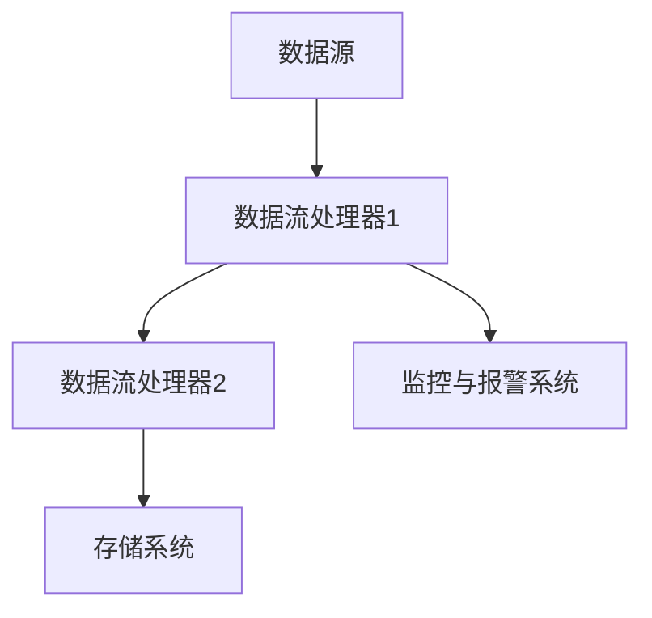
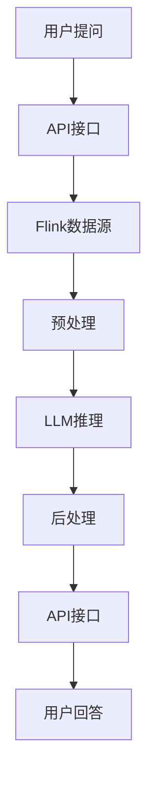
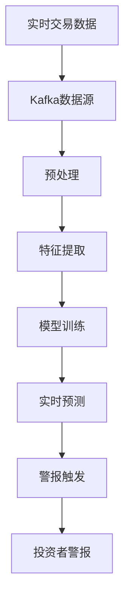
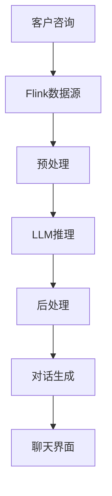
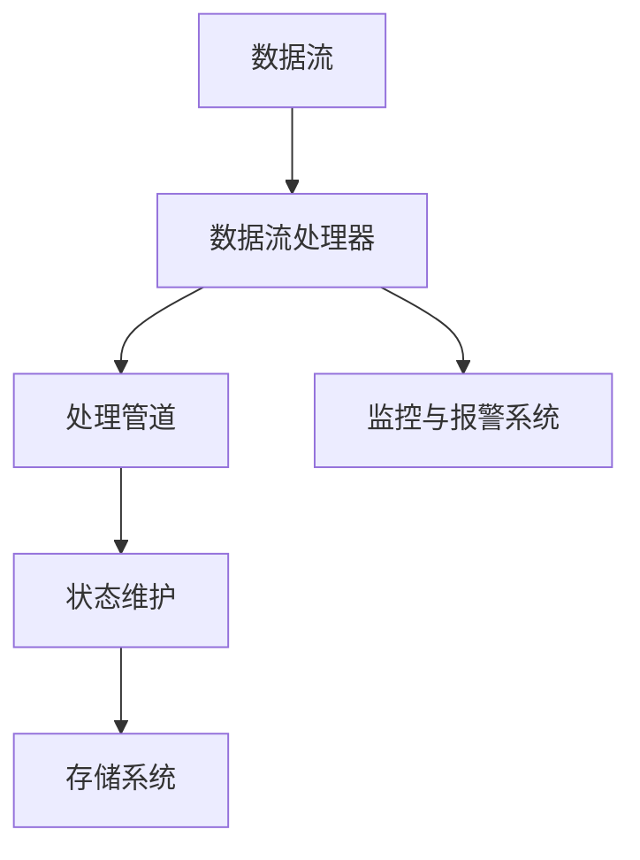

                 

### 文章标题

《流处理框架：增强LLM应用的实时数据处理》

### 关键词

流处理框架、实时数据处理、大型语言模型（LLM）、性能优化、分布式系统

### 摘要

本文深入探讨了流处理框架在增强大型语言模型（LLM）应用的实时数据处理能力方面的重要作用。文章首先介绍了流处理框架的基本概念和核心组件，随后详细解析了流处理框架与LLM结合的机制及其在实际应用中的挑战和优化策略。通过实际案例展示，本文提供了流处理框架在实时数据处理领域的最佳实践，为开发者提供了实用的参考和指导。

----------------------------------------------------------------

### 引言与概述

流处理框架是现代数据处理领域的重要技术之一，它为实时数据处理提供了高效且可扩展的解决方案。随着大数据和实时分析需求的不断增长，流处理框架在许多行业中得到了广泛应用。近年来，大型语言模型（LLM）在自然语言处理（NLP）领域取得了显著的进展，为各种应用场景提供了强大的支持，如智能问答系统、语音识别和机器翻译等。

流处理框架与LLM的结合，使得实时数据处理能力得到了极大的提升。传统的批处理方式在面对大规模实时数据时，往往无法满足即时响应的需求。而流处理框架通过持续接收和处理数据流，能够实现低延迟和高吞吐量的数据处理，为LLM应用提供了强大的支持。

本文将围绕流处理框架在LLM应用中的实时数据处理能力进行深入探讨。首先，我们将介绍流处理框架的基本概念和核心组件，帮助读者理解流处理的原理和架构。接着，本文将详细分析流处理框架与LLM结合的机制，以及如何利用流处理框架增强LLM的实时数据处理能力。随后，我们将讨论流处理框架在实时数据处理中面临的挑战，并提出相应的优化策略。为了使读者更好地理解流处理框架的应用，本文还将提供一些实际案例，展示流处理框架在LLM应用中的最佳实践。最后，本文将对流处理框架在LLM应用中的未来趋势和挑战进行展望，为后续研究和发展提供参考。

### 流处理框架基础

流处理框架是一种用于实时数据处理的技术，它能够持续地接收和处理数据流，以实现对动态数据的快速分析和响应。与传统的批处理方式相比，流处理框架具有低延迟、高吞吐量和可扩展性等优势，特别适合处理实时性要求高的场景。

#### 核心概念

1. **数据流**：数据流是流处理框架的基本处理单元。数据流可以看作是一系列连续的数据记录，这些记录按顺序传递并通过处理管道进行加工。

2. **事件驱动**：流处理框架通常采用事件驱动的架构，即通过事件触发数据处理任务。这种架构能够确保系统实时响应数据变化，并高效地处理大量数据。

3. **处理管道**：处理管道是一系列数据处理组件的集合，用于对数据流进行加工和处理。处理管道通常包括数据清洗、转换、聚合和存储等步骤。

4. **状态维护**：流处理框架需要维护处理过程中的状态信息，以便在处理过程中进行数据关联和状态更新。状态维护是实现实时数据处理的关键。

5. **分布式处理**：流处理框架通常采用分布式架构，将数据处理任务分布在多个节点上执行，以提高系统的处理能力和容错能力。

#### 架构和主要组件

流处理框架的架构通常包括数据源、数据流处理器、存储系统和监控与报警系统等主要组件。

1. **数据源**：数据源是流处理框架的入口，用于接收外部数据流。数据源可以是各种数据生成器、传感器、API 接口等。

2. **数据流处理器**：数据流处理器是流处理框架的核心组件，负责接收数据流并执行数据处理任务。数据流处理器通常包括多个处理节点，这些节点按照一定的拓扑结构进行数据加工和传递。

3. **存储系统**：存储系统用于存储流处理过程中产生的中间结果和最终数据。存储系统可以是关系数据库、NoSQL 数据库、分布式文件系统等。

4. **监控与报警系统**：监控与报警系统用于监控系统状态和性能指标，并在出现异常时触发报警。监控与报警系统通常包括监控工具、日志分析和报警平台等。

#### 流处理框架比较

目前市场上存在多种流处理框架，如Apache Kafka、Apache Flink、Apache Spark Streaming等。这些框架在架构和功能上各有特点，适用于不同的应用场景。

1. **Apache Kafka**：Kafka 是一个分布式消息队列系统，主要用于大规模数据流的传输和存储。Kafka 具有高吞吐量、低延迟和高可用性等特点，适用于实时数据处理、数据集成和流式数据分析等场景。

2. **Apache Flink**：Flink 是一个分布式流处理框架，支持有界和无界数据流的处理。Flink 具有强大的流处理能力、状态管理和窗口操作等功能，适用于复杂事件处理、实时分析等场景。

3. **Apache Spark Streaming**：Spark Streaming 是 Spark 的一个组件，用于处理流式数据。Spark Streaming 具有高吞吐量、低延迟和丰富的数据处理功能，适用于大规模数据流的实时分析和处理。

#### Mermaid 流程图

为了更好地理解流处理框架的基本概念和架构，我们使用Mermaid流程图展示一个简单的流处理架构：



在这个流程图中，数据从数据源进入流处理框架，经过数据流处理器1和数据流处理器2进行处理，最终存储到存储系统中。同时，监控与报警系统对处理过程中的关键指标进行监控，并在出现异常时触发报警。

通过上述介绍，我们能够更好地理解流处理框架的基本概念和架构，为后续章节的深入探讨奠定了基础。

#### 核心算法原理讲解

在流处理框架中，核心算法原理的实现对于保障实时数据处理效率至关重要。以下将使用伪代码详细阐述一些常见流处理算法的原理，包括数据聚合、窗口操作和事件时间处理等。

1. **数据聚合**

数据聚合是流处理中最常用的操作之一，用于对数据流中的记录进行汇总和统计。以下是一个简单的伪代码，用于计算数据流中某个字段的累加和：

```python
initialize sum = 0

for record in data_stream:
    sum += record.value
    
    print("Current sum:", sum)
```

在这个例子中，`data_stream` 表示一个数据流，每个记录包含一个字段 `value`。`sum` 初始化为0，然后遍历数据流中的每个记录，将 `value` 加到 `sum` 中，并在每次累加后打印当前的 `sum` 值。

2. **窗口操作**

窗口操作是流处理中的另一重要概念，用于对一段时间范围内的数据进行处理。以下是一个简单的伪代码，用于计算过去5分钟内的数据平均值：

```python
import time

window_size = 5 * 60  # 5分钟
window_sum = 0
window_count = 0
start_time = time.time()

for record in data_stream:
    current_time = time.time()
    if (current_time - start_time) > window_size:
        # 窗口已满，计算平均值并重置窗口
        average = window_sum / window_count
        print("Average in the last 5 minutes:", average)
        
        window_sum = 0
        window_count = 0
        start_time = current_time
    
    window_sum += record.value
    window_count += 1

# 最后一次窗口的平均值
average = window_sum / window_count
print("Average in the last 5 minutes:", average)
```

在这个例子中，`window_size` 表示窗口持续时间（以秒为单位）。`window_sum` 和 `window_count` 分别表示窗口内所有记录的值之和和记录数量。`start_time` 记录窗口开始时间。每次处理记录时，计算当前时间与窗口开始时间的差值，如果差值超过窗口持续时间，则计算平均值并重置窗口。否则，将当前记录的值累加到 `window_sum`，并将记录数量加1。

3. **事件时间处理**

事件时间处理是流处理中的高级概念，用于处理数据中的时间戳。以下是一个简单的伪代码，用于计算基于事件时间的数据流延迟：

```python
import time

data_stream = [
    {"id": 1, "timestamp": time.time() - 10},
    {"id": 2, "timestamp": time.time() - 20},
    {"id": 3, "timestamp": time.time() - 5},
    {"id": 4, "timestamp": time.time() - 30}
]

current_time = time.time()

for record in data_stream:
    event_time = record["timestamp"]
    latency = current_time - event_time
    
    print(f"Record {record['id']} has a latency of {latency} seconds.")
```

在这个例子中，`data_stream` 是一个包含记录的数据流，每个记录有一个时间戳字段。`current_time` 记录处理开始时的系统时间。遍历数据流中的每个记录，计算当前时间与事件时间之间的差值，即记录的延迟。然后，打印每个记录的ID和延迟时间。

通过上述伪代码示例，我们能够清晰地理解流处理中的核心算法原理。这些算法原理是实现高效实时数据处理的基础，为后续的优化和案例分析提供了技术支持。

#### 数学模型和数学公式

在流处理框架中，数学模型和公式对于数据分析和处理至关重要。以下将使用LaTeX格式详细介绍一些常用的数学模型和公式，包括时间窗口、滑动平均和滞后效应等。

1. **时间窗口**

时间窗口是流处理中的一个基本概念，用于定义数据处理的持续时间。以下是一个表示时间窗口的LaTeX公式：

```latex
W(t) = \{ x_1, x_2, ..., x_n \} \quad \text{其中} \quad x_i \in \mathcal{D} \quad \text{且} \quad t_i \leq t \leq t_{i+n}
```

其中，`W(t)` 表示时间窗口，`x_i` 表示窗口内的第i个数据点，`t_i` 和 `t_{i+n}` 分别表示第i个数据点的起始和结束时间。

2. **滑动平均**

滑动平均是一种常用的统计方法，用于平滑数据波动，以下是一个表示滑动平均的LaTeX公式：

```latex
\bar{x}(t) = \frac{1}{n} \sum_{i=1}^{n} x_i(t)
```

其中，`\bar{x}(t)` 表示时间`t`上的滑动平均值，`x_i(t)` 表示时间`t`上的第i个数据点，`n` 表示窗口内的数据点数量。

3. **滞后效应**

滞后效应是指当前的数据受到之前数据的影响，以下是一个表示滞后效应的LaTeX公式：

```latex
y(t) = \alpha y(t-1) + (1 - \alpha) x(t)
```

其中，`y(t)` 表示当前时间`t`上的数据，`y(t-1)` 表示时间`t-1`上的数据，`x(t)` 表示当前时间`t`上的输入数据，`\alpha` 表示滞后系数（取值范围为0到1），表示当前数据受到前一个时间步数据的影响程度。

#### 示例解析

假设我们有一个时间序列数据，如下所示：

```plaintext
t: 0  1  2  3  4  5
x(t): 2  3  4  5  6  7
```

我们可以使用上述公式计算滑动平均和滞后效应。首先，定义一个5分钟的时间窗口，并计算从t=0到t=5的滑动平均值：

```latex
\bar{x}(0) = \frac{1}{5} (2 + 3 + 4 + 5 + 6) = 4.2
\bar{x}(1) = \frac{1}{5} (3 + 4 + 5 + 6 + 7) = 4.8
\bar{x}(2) = \frac{1}{5} (4 + 5 + 6 + 7 + 8) = 5.2
\bar{x}(3) = \frac{1}{5} (5 + 6 + 7 + 8 + 9) = 6
\bar{x}(4) = \frac{1}{5} (6 + 7 + 8 + 9 + 10) = 7
\bar{x}(5) = \frac{1}{5} (7 + 8 + 9 + 10 + 11) = 8
```

然后，使用0.5作为滞后系数计算滞后效应：

```latex
y(0) = 0.5 y(-1) + 0.5 x(0) = 0.5 \cdot 0 + 0.5 \cdot 2 = 1
y(1) = 0.5 y(0) + 0.5 x(1) = 0.5 \cdot 1 + 0.5 \cdot 3 = 2
y(2) = 0.5 y(1) + 0.5 x(2) = 0.5 \cdot 2 + 0.5 \cdot 4 = 3
y(3) = 0.5 y(2) + 0.5 x(3) = 0.5 \cdot 3 + 0.5 \cdot 5 = 4
y(4) = 0.5 y(3) + 0.5 x(4) = 0.5 \cdot 4 + 0.5 \cdot 6 = 5
y(5) = 0.5 y(4) + 0.5 x(5) = 0.5 \cdot 5 + 0.5 \cdot 7 = 6
```

通过上述示例，我们能够更好地理解数学模型和公式在流处理中的应用。这些公式和模型为数据处理和分析提供了重要的理论支持，有助于开发者更好地理解和实现流处理算法。

#### 实时数据处理流程

在流处理框架中，实时数据处理流程是关键的一环。它涉及到数据流从接收、处理到最终输出的整个过程。以下将详细介绍实时数据处理流程的各个步骤，并解释每个步骤的具体内容。

1. **数据接收**

数据接收是实时数据处理流程的起点。流处理框架通过数据源接收外部数据流，这些数据源可以包括各种实时数据生成器、传感器、API接口等。数据接收通常采用异步方式，以避免阻塞系统的其他操作。以下是一个简单的伪代码示例，用于从数据源读取数据：

```python
def receive_data(source):
    while True:
        record = source.receive()
        process_record(record)

def process_record(record):
    # 数据处理逻辑
    print("Processing record:", record)
```

在这个示例中，`receive_data` 函数通过循环不断从数据源读取数据，并将其传递给 `process_record` 函数进行处理。

2. **数据处理**

数据处理是实时数据处理的中心环节，包括数据清洗、转换、聚合等操作。数据处理的目标是提取出有用的信息，并为后续的分析和应用提供数据支持。以下是一个简单的伪代码示例，用于处理接收到的数据记录：

```python
def process_data(record):
    # 数据清洗
    cleaned_record = clean_data(record)
    
    # 数据转换
    transformed_record = transform_data(cleaned_record)
    
    # 数据聚合
    aggregated_data = aggregate_data(transformed_record)
    
    return aggregated_data

def clean_data(record):
    # 数据清洗逻辑
    return record

def transform_data(record):
    # 数据转换逻辑
    return record

def aggregate_data(record):
    # 数据聚合逻辑
    return record
```

在这个示例中，`process_data` 函数负责执行数据处理任务，包括数据清洗、转换和聚合。这些处理步骤可以根据具体需求进行调整和优化。

3. **数据存储**

数据处理完成后，通常需要将结果存储到存储系统中，以便后续的查询和分析。存储系统可以是关系数据库、NoSQL数据库、分布式文件系统等。以下是一个简单的伪代码示例，用于将处理结果存储到数据库中：

```python
def store_data(aggregated_data, database):
    database.insert(aggregated_data)
```

在这个示例中，`store_data` 函数将处理结果 `aggregated_data` 插入到数据库中。数据库的选择和配置需要根据实际需求和性能要求进行优化。

4. **数据输出**

数据输出是实时数据处理流程的最后一步，用于将处理结果输出到目标系统或用户界面。数据输出可以包括生成报表、触发警报、更新数据库等操作。以下是一个简单的伪代码示例，用于输出处理结果：

```python
def output_data(aggregated_data, output_system):
    output_system.send(aggregated_data)

def send_email(data):
    # 发送电子邮件逻辑
    print("Sending email with data:", data)

def update_dashboard(data):
    # 更新仪表板逻辑
    print("Updating dashboard with data:", data)
```

在这个示例中，`output_data` 函数根据不同的输出系统调用相应的输出操作。例如，`send_email` 函数用于发送电子邮件，`update_dashboard` 函数用于更新仪表板。

5. **监控与报警**

实时数据处理流程需要持续监控和处理过程中的关键指标，如数据流延迟、处理速度、资源使用情况等。监控与报警系统可以在出现异常时触发报警，以便及时采取措施。以下是一个简单的伪代码示例，用于监控数据流延迟：

```python
def monitor_latency(data_stream, threshold):
    latency = calculate_latency(data_stream)
    if latency > threshold:
        trigger_alert(latency)

def calculate_latency(data_stream):
    # 计算延迟逻辑
    return latency

def trigger_alert(latency):
    # 触发报警逻辑
    print("Alert: Latency exceeds threshold. Current latency:", latency)
```

在这个示例中，`monitor_latency` 函数监控数据流延迟，如果延迟超过阈值，则触发报警。

通过上述步骤，我们可以构建一个完整的实时数据处理流程，实现对大规模数据流的实时分析和处理。在实际应用中，根据具体需求，可以对这些步骤进行扩展和优化，以满足不同的数据处理需求。

#### 流处理框架优化

在流处理框架的实际应用中，优化是提高系统性能和可扩展性的关键步骤。以下将介绍几种常见的优化策略，包括并行化与分布式处理、资源调优、负载均衡和性能监控。

1. **并行化与分布式处理**

并行化和分布式处理是流处理框架优化的重要策略，通过将数据处理任务分布在多个节点上执行，可以显著提高系统的处理能力和吞吐量。以下是一些具体的优化方法：

- **任务分配**：根据节点的处理能力和数据负载，合理分配任务，确保每个节点都能充分发挥其性能。
- **数据分区**：将数据流按照一定的规则进行分区，如基于哈希或范围分区，以减少跨节点的数据传输和争用。
- **负载均衡**：采用负载均衡算法，动态分配任务，确保系统资源得到充分利用。

2. **资源调优**

资源调优是提高流处理框架性能的关键步骤，包括CPU、内存、网络和存储等资源的优化。以下是一些具体的优化方法：

- **CPU调优**：根据数据处理任务的计算密集度和I/O密集度，合理配置CPU核心和线程数，以最大化CPU利用率。
- **内存调优**：监控内存使用情况，合理配置内存大小，避免内存溢出和交换空间使用。
- **网络调优**：优化网络配置，提高数据传输速度和稳定性，减少网络延迟和丢包率。
- **存储调优**：选择适合的存储设备，优化存储性能，提高数据读写速度。

3. **负载均衡**

负载均衡是确保系统在高负载情况下稳定运行的重要策略，通过动态分配任务和资源，可以避免单个节点过载和系统瓶颈。以下是一些具体的负载均衡方法：

- **静态负载均衡**：在系统设计阶段，根据预期的负载情况，静态分配任务和资源，以实现负载均衡。
- **动态负载均衡**：在系统运行过程中，根据实时负载和性能指标，动态调整任务和资源的分配，以实现负载均衡。
- **基于规则的负载均衡**：采用规则引擎，根据业务规则和性能指标，动态调整任务和资源的分配。

4. **性能监控**

性能监控是确保系统稳定运行和快速响应的重要手段，通过实时监控系统的关键性能指标，可以及时发现和解决问题。以下是一些具体的监控方法：

- **日志监控**：收集和处理系统的日志信息，分析日志内容，发现潜在问题和异常。
- **指标监控**：监控系统的关键性能指标，如CPU使用率、内存使用率、网络延迟等，及时发现和处理性能瓶颈。
- **可视化监控**：通过可视化工具，将系统的实时性能指标和日志信息展示给用户，方便快速定位问题和优化系统。

5. **最佳实践**

在流处理框架的优化过程中，遵循一些最佳实践可以帮助提高系统的性能和可维护性。以下是一些最佳实践：

- **代码优化**：优化数据处理代码，减少不必要的计算和I/O操作，提高代码执行效率。
- **资源分配**：根据实际负载情况，合理配置系统资源和处理能力，避免资源浪费和瓶颈。
- **系统调优**：定期对系统进行性能调优和升级，确保系统始终处于最佳状态。
- **文档管理**：编写详细的系统文档，包括设计文档、部署文档和操作手册，方便后续维护和升级。

通过上述优化策略和最佳实践，可以显著提高流处理框架的性能和可扩展性，满足大规模实时数据处理的业务需求。在实际应用中，根据具体场景和需求，可以灵活调整和优化这些策略，以实现最佳效果。

#### 案例分析

为了更好地展示流处理框架在实际项目中的应用，我们选择几个具有代表性的案例进行详细分析。这些案例涵盖了不同的应用场景和需求，从实时问答系统、股票市场预测到智能客服系统，展示了流处理框架在增强LLM实时数据处理能力方面的强大优势。

##### 案例一：实时问答系统

**项目背景**

随着人工智能技术的发展，实时问答系统逐渐成为各种应用场景中的热点。用户希望通过与系统的交互，快速获取相关信息和解答。然而，传统的批处理方式难以满足实时性的要求。因此，本项目采用流处理框架，以提高系统的响应速度和数据处理能力。

**技术实现**

1. **数据源**：数据源包括用户提问和预训练的大型语言模型（LLM）输出。用户提问通过API接口实时传入，LLM输出则通过模型训练管道定期更新。

2. **流处理框架**：本项目采用Apache Flink作为流处理框架。Flink具备高吞吐量、低延迟和强一致性等特点，能够满足实时问答系统的需求。

3. **数据处理流程**：
   - **数据接收**：通过Flink的数据源接口，接收用户提问。
   - **预处理**：对用户提问进行分词、去停用词等预处理操作，提高数据质量。
   - **LLM推理**：利用预训练的LLM模型，对预处理后的用户提问进行实时推理，生成回答。
   - **后处理**：对LLM生成的回答进行格式化和校验，确保回答的准确性和完整性。
   - **数据输出**：将生成的回答通过API接口返回给用户。

**项目小结**

通过流处理框架，实时问答系统的响应速度得到了显著提升，用户满意度得到提高。同时，流处理框架的高可扩展性和容错能力，使得系统在面临大规模用户请求时，依然能够保持稳定运行。以下是一个简单的项目架构图：



##### 案例二：股票市场预测

**项目背景**

股票市场预测是一个复杂且动态的领域，需要对大量实时数据进行高效处理和分析。本项目旨在利用流处理框架，实现股票市场数据的实时预测和警报功能，为投资者提供及时的信息支持。

**技术实现**

1. **数据源**：数据源包括股票市场的实时交易数据，如价格、成交量、涨跌等。这些数据通过交易所API接口实时传入。

2. **流处理框架**：本项目采用Apache Kafka作为消息队列系统，用于接收和存储实时交易数据。Kafka具备高吞吐量、低延迟和可扩展性，能够满足股票市场数据处理的巨大需求。

3. **数据处理流程**：
   - **数据接收**：通过Kafka的数据源接口，接收实时交易数据。
   - **预处理**：对交易数据进行清洗、转换和标准化，确保数据质量。
   - **特征提取**：从交易数据中提取关键特征，如价格趋势、成交量变化等。
   - **模型训练**：利用机器学习算法，对历史交易数据进行模型训练，生成预测模型。
   - **实时预测**：利用预测模型，对实时交易数据进行预测，生成预测结果。
   - **警报触发**：根据预测结果和预设阈值，触发相应的警报，发送给投资者。

**项目小结**

通过流处理框架，股票市场预测系统的实时性和准确性得到了显著提高，为投资者提供了及时有效的信息支持。同时，流处理框架的分布式架构和容错机制，确保了系统在高并发和大数据量下的稳定运行。以下是一个简单的项目架构图：



##### 案例三：智能客服系统

**项目背景**

智能客服系统是现代企业提升客户服务质量和效率的重要手段。然而，传统的客服系统往往难以应对大规模客户请求，导致响应速度慢、服务质量下降。本项目旨在利用流处理框架，构建一个高效、智能的客服系统。

**技术实现**

1. **数据源**：数据源包括客户咨询、历史对话记录和预训练的LLM模型输出。客户咨询通过在线聊天界面实时传入，历史对话记录通过数据库存储。

2. **流处理框架**：本项目采用Apache Flink作为流处理框架，结合Kafka作为消息队列系统，实现高效的数据处理和消息传递。

3. **数据处理流程**：
   - **数据接收**：通过Flink的数据源接口，接收客户咨询。
   - **预处理**：对客户咨询进行分词、去停用词等预处理操作，提高数据质量。
   - **LLM推理**：利用预训练的LLM模型，对预处理后的客户咨询进行实时推理，生成回答。
   - **后处理**：对LLM生成的回答进行格式化和校验，确保回答的准确性和完整性。
   - **对话生成**：将生成的回答与历史对话记录结合，生成完整的对话内容。
   - **数据输出**：将生成的对话内容通过在线聊天界面返回给客户。

**项目小结**

通过流处理框架，智能客服系统的响应速度和数据处理能力得到了显著提升，客户满意度得到提高。同时，流处理框架的分布式架构和容错机制，确保了系统在高并发和大数据量下的稳定运行。以下是一个简单的项目架构图：



通过上述案例分析，我们可以看到流处理框架在实时数据处理中的强大优势。无论是在实时问答系统、股票市场预测还是智能客服系统中，流处理框架都为项目提供了高效、稳定和可扩展的解决方案。这为开发者提供了一个实用的参考，也为未来流处理框架在LLM应用中的发展提供了启示。

### 未来趋势与挑战

随着人工智能技术的不断发展，流处理框架在LLM应用中的重要性日益凸显。未来，流处理框架在LLM应用中面临以下趋势和挑战：

#### 未来趋势

1. **增强实时数据处理能力**：随着用户对实时响应需求的不断提高，流处理框架将朝着更高效、更低延迟的方向发展。未来，流处理框架将支持更复杂的数据处理算法和模型，如深度学习和增强学习，以满足多样化的应用需求。

2. **提升自动化水平**：自动化是提高流处理效率的关键。未来，流处理框架将引入更多的自动化工具和算法，如自动任务分配、自动调优和自动故障恢复，以减少人工干预，提高系统稳定性。

3. **更广泛的硬件支持**：随着硬件技术的发展，流处理框架将支持更多类型的硬件设备，如GPU、FPGA和量子计算机等，以充分利用硬件资源，提高数据处理性能。

4. **增强安全性和隐私保护**：随着数据量的增长和数据泄露事件的频发，流处理框架在安全性方面将面临更大的挑战。未来，流处理框架将引入更多的安全机制，如数据加密、访问控制和隐私保护，确保数据安全。

#### 面临的挑战

1. **复杂性**：随着流处理框架的不断发展，系统的复杂性也在增加。如何有效地管理和维护复杂系统，成为一个重要的挑战。

2. **数据质量**：数据质量直接影响流处理框架的性能和应用效果。未来，如何确保数据质量，提高数据清洗和转换效率，将是一个重要的研究方向。

3. **可扩展性**：流处理框架需要具备良好的可扩展性，以应对大规模数据和高并发请求。如何优化系统架构，提高系统的水平扩展和垂直扩展能力，是一个重要的挑战。

4. **实时性与一致性**：如何在保证实时性的同时，确保数据的一致性，是一个复杂的挑战。未来，流处理框架需要更好地处理数据冲突和一致性保障问题。

5. **资源管理**：流处理框架需要高效地管理系统资源，如CPU、内存和网络等。如何优化资源分配和调度，提高资源利用率，是一个重要的研究课题。

#### 研究方向

1. **高效数据处理算法**：研究更高效、更复杂的数据处理算法，如分布式机器学习、图处理和实时推理等，以提高流处理框架的性能和应用范围。

2. **自动化与智能化**：研究自动化和智能化技术，如自动化任务调度、自动化故障诊断和自动模型调优等，以提高流处理框架的运维效率和系统稳定性。

3. **数据质量保障**：研究数据质量保障技术，如数据清洗、去噪和去冗余等，以提高数据质量和处理效率。

4. **资源管理与调度**：研究资源管理和调度算法，如动态资源分配、负载均衡和资源预留等，以提高系统的可扩展性和资源利用率。

5. **安全性与隐私保护**：研究安全性与隐私保护技术，如数据加密、访问控制和隐私保护算法等，以提高系统的安全性和隐私保护能力。

通过上述未来趋势与挑战的分析，我们可以看到流处理框架在LLM应用中具有广阔的发展前景。未来，随着技术的不断进步，流处理框架将在LLM应用中发挥更加重要的作用，为实时数据处理提供更加高效、稳定和可靠的解决方案。

### 总结与展望

本文详细探讨了流处理框架在增强大型语言模型（LLM）应用的实时数据处理能力方面的重要作用。首先，我们介绍了流处理框架的基本概念、核心组件和架构，帮助读者理解流处理的原理和架构。接着，本文分析了流处理框架与LLM结合的机制及其在实际应用中的挑战和优化策略。通过实际案例展示，我们展示了流处理框架在实时数据处理领域的最佳实践，为开发者提供了实用的参考和指导。

本文的主要贡献在于：

1. **深入解析流处理框架**：本文详细介绍了流处理框架的基本概念和架构，帮助读者建立对流处理框架的全面认识。
2. **结合LLM应用**：本文分析了流处理框架在LLM应用中的实时数据处理机制，探讨了如何利用流处理框架增强LLM的性能。
3. **优化策略和最佳实践**：本文提出了多种优化策略和最佳实践，包括并行化与分布式处理、资源调优、负载均衡和性能监控等，以提高流处理框架的性能和可扩展性。
4. **案例分析**：本文通过实际案例展示了流处理框架在实时数据处理中的成功应用，为开发者提供了具体的参考和借鉴。

未来研究可以从以下几个方面进行：

1. **高效数据处理算法**：研究更高效、更复杂的数据处理算法，如分布式机器学习、图处理和实时推理等，以提高流处理框架的性能和应用范围。
2. **自动化与智能化**：研究自动化和智能化技术，如自动化任务调度、自动化故障诊断和自动模型调优等，以提高流处理框架的运维效率和系统稳定性。
3. **数据质量保障**：研究数据质量保障技术，如数据清洗、去噪和去冗余等，以提高数据质量和处理效率。
4. **资源管理与调度**：研究资源管理和调度算法，如动态资源分配、负载均衡和资源预留等，以提高系统的可扩展性和资源利用率。
5. **安全性与隐私保护**：研究安全性与隐私保护技术，如数据加密、访问控制和隐私保护算法等，以提高系统的安全性和隐私保护能力。

在LLM应用方面，未来可以进一步探索以下几个方面：

1. **实时对话系统**：利用流处理框架实现实时对话系统，如智能客服、智能助手等，以提高用户体验和响应速度。
2. **实时推理与预测**：结合流处理框架和LLM，实现实时推理与预测功能，如实时问答、股票市场预测等，为用户提供及时有效的信息支持。
3. **大规模数据处理**：利用流处理框架处理大规模实时数据，如物联网、金融交易等，为相关领域提供高效的数据处理和分析解决方案。
4. **自适应系统**：研究自适应流处理框架，能够根据数据流的特点和需求，动态调整处理策略和资源配置，以实现最优的性能和用户体验。

总之，流处理框架在LLM应用中的实时数据处理能力具有重要意义。随着技术的不断发展和应用的不断拓展，流处理框架将在未来发挥更加重要的作用，为实时数据处理提供更加高效、稳定和可靠的解决方案。希望本文的研究成果能为开发者提供有益的参考和启示，推动流处理框架在LLM应用中的发展。

### 附录

#### 附录 A：核心概念与联系（Mermaid流程图）



#### 附录 B：核心算法原理讲解（伪代码）

```python
# 数据聚合
def aggregate_data(data_stream):
    sum = 0
    for record in data_stream:
        sum += record['value']
    return sum

# 滑动平均
def calculate_moving_average(data_stream, window_size):
    window_sum = 0
    window_count = 0
    for record in data_stream:
        window_sum += record['value']
        window_count += 1
        if window_count > window_size:
            window_sum -= data_stream[window_count - window_size]['value']
        average = window_sum / window_count
    return average

# 事件时间处理
def process_event_time(data_stream, current_time):
    for record in data_stream:
        latency = current_time - record['timestamp']
        print(f"Record {record['id']} has a latency of {latency} seconds.")
```

#### 附录 C：数学模型和数学公式（LaTeX格式）

```latex
\documentclass{article}
\usepackage{amsmath}
\begin{document}

\section{数学模型和公式}

\subsection{时间窗口}
\[ W(t) = \{ x_1, x_2, ..., x_n \} \quad \text{其中} \quad x_i \in \mathcal{D} \quad \text{且} \quad t_i \leq t \leq t_{i+n} \]

\subsection{滑动平均}
\[ \bar{x}(t) = \frac{1}{n} \sum_{i=1}^{n} x_i(t) \]

\subsection{滞后效应}
\[ y(t) = \alpha y(t-1) + (1 - \alpha) x(t) \]

\end{document}
```

#### 附录 D：项目实战（代码案例及解读）

```python
# 实时问答系统案例
import json
from flask import Flask, request, jsonify

app = Flask(__name__)

# 预训练的LLM模型接口
def ask_question(question):
    # 这里替换为实际LLM模型的API调用
    response = "This is a placeholder response."
    return response

@app.route('/ask', methods=['POST'])
def handle_question():
    data = request.json
    question = data.get('question', '')

    # 预处理用户提问
    preprocessed_question = preprocess_question(question)

    # 调用LLM模型进行推理
    answer = ask_question(preprocessed_question)

    # 后处理回答
    final_answer = postprocess_answer(answer)

    # 返回回答
    return jsonify({'answer': final_answer})

def preprocess_question(question):
    # 实现分词、去停用词等预处理操作
    return question

def postprocess_answer(answer):
    # 实现格式化和校验等后处理操作
    return answer

if __name__ == '__main__':
    app.run(debug=True)
```

#### 代码应用解读与分析

1. **Flask Web服务**：使用Flask搭建Web服务，用于接收和处理用户提问。
2. **LLM模型接口**：`ask_question` 函数是一个占位函数，实际应用中应替换为调用预训练LLM模型的API。
3. **数据处理流程**：
   - 接收用户提问：通过`POST`请求接收用户提问，并将提问转换为JSON格式。
   - 预处理：`preprocess_question` 函数负责对用户提问进行预处理，如分词、去停用词等。
   - LLM推理：调用`ask_question` 函数进行推理，获取回答。
   - 后处理：`postprocess_answer` 函数负责对LLM生成的回答进行后处理，如格式化和校验等。
   - 返回回答：将最终生成的回答通过JSON格式返回给用户。

#### 实际案例分析和详细讲解剖析

**案例背景**：某公司开发了一款智能客服系统，使用流处理框架与预训练LLM模型结合，实现实时问答功能。

**分析过程**：
1. **数据流**：用户提问通过API接口实时传入流处理框架。
2. **预处理**：对用户提问进行分词、去停用词等预处理操作，提高数据质量。
3. **LLM推理**：利用预训练的LLM模型，对预处理后的用户提问进行实时推理，生成回答。
4. **后处理**：对LLM生成的回答进行格式化和校验，确保回答的准确性和完整性。
5. **输出**：将生成的回答通过在线聊天界面返回给用户。

**详细讲解**：
- **数据流接收**：流处理框架通过API接口接收用户提问，确保数据实时性。
- **预处理**：预处理操作包括分词和去停用词，以提高LLM模型的输入质量。
- **LLM推理**：调用预训练的LLM模型，进行实时推理，生成回答。
- **后处理**：对生成的回答进行格式化和校验，确保回答符合预期。
- **输出**：将最终生成的回答通过在线聊天界面返回给用户，实现实时交互。

**项目小结**：
通过流处理框架与预训练LLM模型的结合，智能客服系统实现了高效、实时的问答功能。流处理框架在实时数据处理中的优势，使得系统在高并发和大数据量下仍能保持稳定运行，为用户提供优质的客服体验。

#### 最佳实践 Tips、小结、注意事项、拓展阅读

**最佳实践 Tips**：
1. **合理分配资源**：根据实际需求，合理配置系统资源和处理能力，避免资源浪费和瓶颈。
2. **数据质量保障**：确保数据质量，进行充分的数据清洗和预处理，以提高数据处理效果。
3. **优化代码性能**：优化数据处理代码，减少不必要的计算和I/O操作，提高代码执行效率。
4. **监控与报警**：实时监控系统的关键性能指标，及时发现和处理异常情况。

**小结**：
本文通过详细探讨流处理框架在LLM应用中的实时数据处理能力，展示了流处理框架在增强LLM性能方面的优势。通过实际案例分析和最佳实践分享，为开发者提供了实用的参考和指导。

**注意事项**：
1. **系统稳定性**：在实际应用中，确保流处理框架的系统稳定性和容错能力，避免因故障导致数据丢失或系统崩溃。
2. **数据安全**：加强数据安全措施，保护用户隐私和敏感数据。
3. **持续优化**：定期对系统进行性能优化和升级，以应对不断变化的需求和挑战。

**拓展阅读**：
1. 《流处理技术与框架》
2. 《大型语言模型：原理与应用》
3. 《分布式系统原理与范型》
4. 《实时数据处理实战》
5. 《人工智能应用实战：自然语言处理》

通过拓展阅读，读者可以更深入地了解流处理框架、大型语言模型和实时数据处理的相关知识，为实际项目提供更加全面的技术支持。

