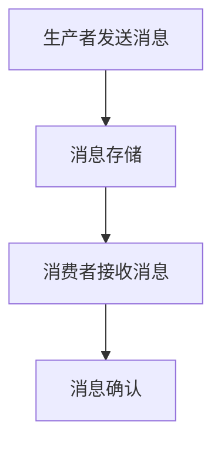

                 

# 文章标题：消息队列：优化LLM应用的异步通信

> 关键词：消息队列，LLM应用，异步通信，优化策略，性能调优

> 摘要：本文深入探讨了消息队列在大型语言模型（LLM）应用中的重要性，分析了LLM应用的异步通信需求，并详细阐述了如何通过消息队列优化策略来提升LLM应用的性能。文章通过实际项目案例分析，为开发者提供了实用性的指导和建议。

# 设计《消息队列：优化LLM应用的异步通信》书籍目录大纲

为了设计《消息队列：优化LLM应用的异步通信》的目录大纲，我们需要遵循以下步骤：

## 1. 确定核心内容

根据书名，核心内容应包括：

- 消息队列的基础概念和原理
- 消息队列在不同场景下的应用
- LLM（大型语言模型）应用的异步通信需求
- 消息队列优化策略
- 实际项目中的消息队列应用案例

## 2. 设计一级目录

一级目录应涵盖核心内容的各个方面，如下：

### 第一部分：消息队列基础

#### 第1章：消息队列概述

1.1 消息队列的定义与作用

1.2 消息队列的技术原理

1.3 消息队列的发展历程

### 第二部分：消息队列应用场景

#### 第2章：消息队列在数据处理中的应用

2.1 数据处理中的异步通信需求

2.2 常见数据处理场景与消息队列的应用

2.3 消息队列在数据处理中的性能优化

### 第三部分：LLM应用的异步通信

#### 第3章：LLM应用异步通信需求分析

3.1 LLM应用异步通信的优势

3.2 LLM应用异步通信的关键技术

3.3 LLM应用异步通信的最佳实践

### 第四部分：消息队列优化策略

#### 第4章：消息队列性能优化方法

4.1 消息队列性能瓶颈分析

4.2 消息队列性能优化策略

4.3 消息队列调优实践

### 第五部分：实际应用案例分析

#### 第5章：消息队列在实时数据流处理中的应用

5.1 实时数据流处理中的异步通信需求

5.2 消息队列在实时数据流处理中的应用

5.3 消息队列在实时数据流处理中的优化案例

#### 第6章：消息队列在大规模数据处理中的应用

6.1 大规模数据处理中的异步通信需求

6.2 消息队列在大规模数据处理中的应用

6.3 消息队列在大规模数据处理中的优化案例

### 第六部分：附录

#### 第7章：消息队列常用工具与框架

7.1 消息队列常用工具介绍

7.2 消息队列开源框架介绍

7.3 消息队列工具与框架的比较与选择

## 3. 补充细节

根据每个章节的主题，细化每个章节的内容，包括：

- 核心概念与联系：使用 Mermaid 流程图展示消息队列的基本原理和架构
- 核心算法原理讲解：使用伪代码详细阐述消息队列的关键算法原理
- 数学模型和数学公式：使用 LaTeX 格式嵌入文中独立段落，详细讲解消息队列中的数学模型和公式，并举例说明
- 项目实战：提供实际项目中的消息队列应用案例，包括开发环境搭建、源代码实现和解读、代码分析与优化

确保整体目录大纲在2000字以内，简洁明了地展示书籍的核心内容。

----------------------------------------------------------------

# 第1章 消息队列概述

## 1.1 消息队列的定义与作用

消息队列（Message Queue）是一种异步通信机制，它允许应用程序在不同的处理模块之间传递消息。消息队列的核心作用是实现系统中的解耦，提高系统的可扩展性和容错性。

在分布式系统中，各个模块往往需要协同工作来完成复杂的业务逻辑。然而，这些模块可能分布在不同的服务器上，运行在不同的进程中，甚至使用不同的编程语言。消息队列提供了一种灵活且可靠的方法，使得这些模块可以无需直接通信，而是通过消息队列进行消息传递。

消息队列的主要作用如下：

- **解耦**：通过消息队列，可以降低模块间的耦合度，使得每个模块可以独立开发、部署和扩展。
- **异步通信**：消息队列允许消息的生产者和消费者在不同的时间进行通信，提高了系统的并发能力。
- **可扩展性**：消息队列可以水平扩展，以处理更大的消息量。
- **容错性**：消息队列提供了消息持久化机制，即使在系统发生故障时，消息也不会丢失。

## 1.2 消息队列的技术原理

消息队列的工作原理可以简单概括为以下几个步骤：

1. **生产者发送消息**：应用程序的生产者将消息发送到消息队列中。
2. **消息存储**：消息队列将消息存储在内存或磁盘上，以确保消息的持久化。
3. **消费者接收消息**：应用程序的消费者从消息队列中获取消息，进行处理。
4. **消息确认**：消费者处理完消息后，会向消息队列发送确认信号，表明消息已被成功处理。

消息队列的关键技术包括：

- **队列模型**：消息队列通常采用先进先出（FIFO）的队列模型，保证消息的顺序处理。
- **消息持久化**：消息队列可以通过将消息存储在内存或磁盘上，实现消息的持久化，防止消息丢失。
- **分布式架构**：消息队列可以采用分布式架构，提高系统的性能和可用性。

## 1.3 消息队列的发展历程

消息队列技术的发展可以追溯到20世纪80年代，当时用于简化分布式系统的通信。最早的实现之一是IBM的MQ系列消息队列产品。随着互联网和分布式系统的兴起，消息队列技术逐渐成熟，并出现了许多开源消息队列系统，如RabbitMQ、Kafka和ActiveMQ等。

近年来，随着云计算和大数据技术的发展，消息队列的应用场景不断扩展，其在实时数据处理、大规模数据处理和分布式系统中发挥着越来越重要的作用。

## 1.4 消息队列的核心概念与联系

为了更好地理解消息队列的工作原理，我们可以使用Mermaid流程图来展示消息队列的核心概念和联系。



该流程图展示了消息队列的基本工作流程，即生产者发送消息，消息存储在队列中，消费者接收消息并处理，最后发送确认信号。

## 1.5 消息队列的核心算法原理讲解

消息队列中的核心算法主要包括消息的发送、存储和消费。以下使用伪代码详细阐述这些算法原理。

### 消息发送算法

```python
def sendMessage(queue, message):
    # 将消息添加到队列的末尾
    queue.append(message)
    # 发送消息通知
    notifyConsumer(queue)
```

### 消息存储算法

```python
def storeMessage(queue, message):
    # 将消息存储在磁盘或内存中
    storeMessageToDiskOrMemory(message)
    # 将消息添加到队列的末尾
    queue.append(message)
```

### 消息消费算法

```python
def consumeMessage(queue):
    # 从队列的头部获取消息
    message = queue.pop(0)
    # 处理消息
    processMessage(message)
    # 发送确认信号
    sendAcknowledgement(queue)
```

## 1.6 数学模型和数学公式

消息队列的性能优化往往涉及到一些数学模型和公式。以下是一个简单的数学模型示例，用于分析消息队列的吞吐量。

### 吞吐量公式

$$
T = \frac{N}{\sum_{i=1}^{M} \frac{1}{T_i}}
$$

其中，\(T\) 是系统的吞吐量，\(N\) 是总的消息数量，\(M\) 是消费者的数量，\(T_i\) 是第 \(i\) 个消费者的处理时间。

### 举例说明

假设我们有一个消息队列系统，包含 3 个消费者，每个消费者的处理时间分别为 2 秒、3 秒和 4 秒。总共发送了 100 个消息。

根据吞吐量公式，我们可以计算出系统的吞吐量为：

$$
T = \frac{100}{\frac{1}{2} + \frac{1}{3} + \frac{1}{4}} \approx 40.91 \text{ 消息/秒}
$$

这表明，在理想情况下，该系统每秒可以处理约 40.91 个消息。

## 1.7 项目实战

### 开发环境搭建

为了演示消息队列的应用，我们使用 RabbitMQ 作为消息队列系统。以下是在 Ubuntu 系统上安装 RabbitMQ 的步骤：

1. 更新系统包列表：
   ```bash
   sudo apt-get update
   ```

2. 安装 RabbitMQ：
   ```bash
   sudo apt-get install rabbitmq-server
   ```

3. 启动 RabbitMQ 服务：
   ```bash
   sudo systemctl start rabbitmq-server
   ```

4. 查看 RabbitMQ 服务状态：
   ```bash
   sudo systemctl status rabbitmq-server
   ```

### 源代码实现和解读

我们创建一个简单的生产者和消费者应用程序，以演示消息队列的基本功能。

**生产者代码（producer.py）：**

```python
import pika

# 创建 RabbitMQ 连接
connection = pika.BlockingConnection(pika.ConnectionParameters('localhost'))
channel = connection.channel()

# 声明一个队列
channel.queue_declare(queue='task_queue', durable=True)

# 发送消息
for i in range(10):
    message = f'Hello World {i}'
    channel.basic_publish(exchange='',
                          routing_key='task_queue',
                          body=message,
                          properties=pika.BasicProperties(delivery_mode=2))  # 消息持久化

print(" [x] Sent {}".format(message))
connection.close()
```

**消费者代码（consumer.py）：**

```python
import pika

# 创建 RabbitMQ 连接
connection = pika.BlockingConnection(pika.ConnectionParameters('localhost'))
channel = connection.channel()

# 声明一个队列
channel.queue_declare(queue='task_queue', durable=True)

# 消费消息
def callback(ch, method, properties, body):
    print(" [x] Received {}".format(body))
    # 模拟处理时间
    import time
    time.sleep(body.count(b'.'))
    print(" [x] Done")
    ch.basic_ack(delivery_tag=method.delivery_tag)

# 订阅消息
channel.basic_consume(queue='task_queue',
                      on_message_callback=callback,
                      auto_ack=False)

print(' [*] Waiting for messages. To exit press CTRL+C')
channel.start_consuming()
```

### 代码应用解读与分析

**生产者代码解读：**

1. 导入必要的模块和库。
2. 创建 RabbitMQ 连接并获取通道。
3. 声明一个持久化的队列 `task_queue`。
4. 循环发送 10 条消息到 `task_queue`。
5. 关闭连接。

**消费者代码解读：**

1. 导入必要的模块和库。
2. 创建 RabbitMQ 连接并获取通道。
3. 声明一个持久化的队列 `task_queue`。
4. 定义回调函数 `callback`，用于处理接收到的消息。
5. 设置消费者不自动确认消息已被处理。
6. 开始消费消息并等待。

**代码分析：**

- **持久化**：生产者和消费者都使用了 `durable=True` 参数来确保队列和消息的持久化，防止在系统崩溃时消息丢失。
- **消息确认**：消费者在处理完消息后，会调用 `ch.basic_ack(delivery_tag=method.delivery_tag)` 来发送确认信号，表明消息已被成功处理。

### 实际案例分析和详细讲解剖析

在实际项目中，消息队列的应用场景非常广泛，例如分布式系统的异步通信、实时数据处理、大规模数据处理等。以下是一个实时数据处理的应用案例。

**应用案例：实时用户行为分析**

在一个实时用户行为分析系统中，我们需要实时收集用户的行为数据，并进行分析和处理。为了实现这一目标，我们可以使用消息队列来解耦数据的收集、存储和分析模块。

**架构设计：**

1. **数据收集模块**：负责实时收集用户行为数据，并将数据发送到消息队列。
2. **消息队列**：存储用户行为数据，提供异步通信机制。
3. **数据处理模块**：从消息队列中读取数据，进行分析和处理。

**技术实现：**

1. **数据收集模块**：使用 Node.js 编写脚本，实时监听用户行为事件，并将事件数据发送到 RabbitMQ 消息队列。
2. **消息队列**：使用 RabbitMQ 作为消息队列系统，确保消息的可靠传输和持久化。
3. **数据处理模块**：使用 Python 编写数据处理脚本，从 RabbitMQ 消息队列中读取数据，进行实时分析，并将分析结果存储到数据库中。

**项目小结：**

通过使用消息队列，我们成功实现了实时用户行为分析系统的解耦和高效处理。消息队列提供了异步通信机制，使得数据收集、存储和分析模块可以独立运行和扩展。此外，消息队列的持久化功能确保了数据的安全性和可靠性。

## 1.8 最佳实践 Tips

- **选择合适的消息队列系统**：根据实际需求和性能要求，选择合适的消息队列系统，如 RabbitMQ、Kafka 或 RocketMQ。
- **确保消息的顺序性**：如果应用场景需要消息的顺序性，可以采用顺序队列或顺序消息机制。
- **消息持久化**：对于重要消息，确保消息的持久化，防止消息丢失。
- **消息确认机制**：使用消息确认机制，确保消息已被成功处理。
- **消息队列监控**：定期监控消息队列的性能和状态，及时发现并解决问题。

## 1.9 小结

本章介绍了消息队列的定义、技术原理和核心算法，并通过实际项目案例展示了消息队列在实时数据处理中的应用。在接下来的章节中，我们将进一步探讨消息队列在数据处理中的应用场景、LLM应用的异步通信需求以及消息队列的优化策略。

## 1.10 注意事项

- **消息队列的选择**：在选择消息队列系统时，需要考虑系统的性能、可靠性、可扩展性和易用性等因素。
- **消息持久化策略**：根据实际需求，合理配置消息持久化策略，以确保数据的安全性和可靠性。
- **消息确认机制**：在消费者处理完消息后，务必发送确认信号，以避免消息重复处理或丢失。

## 1.11 拓展阅读

- **《RabbitMQ权威指南》**：深入介绍了 RabbitMQ 的基本概念、架构设计和应用案例。
- **《Kafka：从入门到实战》**：详细讲解了 Kafka 的架构、原理和应用。
- **《大规模数据处理技术》**：探讨了大规模数据处理中的消息队列应用和优化策略。

----------------------------------------------------------------

# 第2章 消息队列在数据处理中的应用

## 2.1 数据处理中的异步通信需求

在数据处理领域，异步通信是一种常见的通信方式，它允许数据处理模块独立运行，并按照消息的顺序和优先级进行处理。异步通信的需求主要源于以下几个原因：

1. **高并发处理**：在处理大量数据时，需要多个处理模块同时工作，以提高系统的吞吐量。异步通信可以实现任务的并行处理，从而提高数据处理效率。
2. **解耦系统模块**：数据处理系统通常由多个模块组成，如数据采集、存储、分析和展示等。异步通信可以降低模块间的耦合度，使得每个模块可以独立开发和扩展。
3. **弹性伸缩**：异步通信允许系统根据需求动态调整处理模块的数量和资源分配，以实现弹性伸缩。
4. **容错性和可靠性**：异步通信可以确保数据处理过程中的容错性和可靠性。即使在某个处理模块发生故障时，其他模块仍可以正常运行，确保系统的稳定性和连续性。

## 2.2 常见数据处理场景与消息队列的应用

在数据处理领域，消息队列的应用场景非常广泛，以下列举了几个常见的数据处理场景及其在消息队列中的应用。

### 2.2.1 实时数据处理

实时数据处理要求系统在短时间内处理大量数据，并快速生成结果。消息队列在实时数据处理中的应用主要体现在以下几个方面：

1. **数据收集**：使用消息队列将来自不同源的数据（如日志文件、传感器数据等）收集到统一的数据处理系统中。
2. **数据预处理**：消息队列可以异步处理数据的清洗、转换和去重等操作，从而提高数据的质量和准确性。
3. **数据存储**：消息队列可以将处理后的数据存储到数据库、数据仓库或其他存储系统中，以供后续分析和使用。

### 2.2.2 批量数据处理

批量数据处理通常涉及大量历史数据的处理，以生成报告、进行数据挖掘或进行预测分析等。消息队列在批量数据处理中的应用包括：

1. **任务调度**：使用消息队列进行任务调度，将批量数据处理任务分配到不同的处理节点上，实现并行处理。
2. **数据传输**：将数据从源系统传输到目标系统，例如将数据从关系型数据库迁移到NoSQL数据库。
3. **结果汇总**：将各个处理节点的结果汇总，生成最终的报告或分析结果。

### 2.2.3 大规模数据处理

大规模数据处理通常涉及 PB 级别的数据，需要分布式系统来支持。消息队列在大规模数据处理中的应用包括：

1. **数据分区**：使用消息队列将大规模数据划分为多个分区，以便分布式处理。
2. **数据复制**：使用消息队列进行数据复制，确保数据在分布式系统中的可靠性和可用性。
3. **流处理和批处理**：结合流处理和批处理技术，实现大规模数据的实时分析和处理。

## 2.3 消息队列在数据处理中的性能优化

消息队列在数据处理中的性能优化是确保系统高效运行的关键。以下是一些常用的性能优化策略：

### 2.3.1 消息队列配置优化

1. **队列大小**：合理配置队列大小，避免消息积压。队列大小应考虑系统处理能力和消息量。
2. **队列持久化**：对于重要消息，使用持久化队列，确保消息在系统故障时不会丢失。
3. **队列索引**：为队列创建索引，提高消息检索速度。

### 2.3.2 网络优化

1. **带宽**：确保网络带宽充足，避免数据传输延迟。
2. **负载均衡**：使用负载均衡器将消息分发到不同的处理节点，实现负载均衡。

### 2.3.3 消息批量处理

1. **批量发送**：批量发送消息，减少系统调用的次数，提高处理效率。
2. **批量消费**：批量消费消息，减少系统调用的次数，提高处理效率。

### 2.3.4 消息压缩

1. **数据压缩**：使用压缩算法对消息进行压缩，减少数据传输量，提高传输速度。

### 2.3.5 消息缓存

1. **缓存消息**：将常用消息缓存到内存中，减少磁盘读取次数，提高处理速度。

### 2.3.6 消息队列监控

1. **性能监控**：定期监控消息队列的性能指标，如吞吐量、延迟、队列长度等，及时发现并解决问题。
2. **错误日志**：记录消息队列的错误日志，便于问题追踪和定位。

## 2.4 实际案例分析和详细讲解剖析

### 2.4.1 案例背景

某互联网公司需要实时处理大量用户行为数据，以提供个性化的推荐服务。用户行为数据包括浏览记录、购买记录、评论和点赞等。为了实现这一目标，公司决定采用消息队列系统进行数据处理。

### 2.4.2 架构设计

1. **数据采集模块**：使用 Node.js 编写脚本，实时监听用户行为事件，并将事件数据发送到 RabbitMQ 消息队列。
2. **消息队列**：使用 RabbitMQ 作为消息队列系统，确保消息的可靠传输和持久化。
3. **数据处理模块**：使用 Python 编写数据处理脚本，从 RabbitMQ 消息队列中读取数据，进行实时分析，并将分析结果存储到 Elasticsearch 中。
4. **推荐引擎模块**：使用 Elasticsearch 进行用户行为数据的存储和检索，实现个性化推荐。

### 2.4.3 技术实现

1. **数据采集模块**：使用 Node.js 编写脚本，实时监听用户行为事件，并将事件数据发送到 RabbitMQ 消息队列。
   ```javascript
   const amqp = require('amqplib/callback_api');
   
   amqp.connect('amqp://localhost', function(error0, connection) {
     if (error0) {
       throw error0;
     }
     connection.createChannel(function(error1, channel) {
       if (error1) {
         throw error1;
       }
       const queue = 'task_queue';
       channel.assertQueue(queue, {
         durable: true
       });
       
       // 监听用户行为事件
       io.on('connection', (socket) => {
         socket.on('event', (data) => {
           channel.sendToQueue(queue, Buffer.from(JSON.stringify(data)), {
             persistent: true
           });
           console.log(' [x] Sent event:', data);
         });
       });
     });
   });
   ```

2. **数据处理模块**：使用 Python 编写数据处理脚本，从 RabbitMQ 消息队列中读取数据，进行实时分析，并将分析结果存储到 Elasticsearch 中。
   ```python
   import pika
   import json
   from elasticsearch import Elasticsearch
   
   es = Elasticsearch("http://localhost:9200")
   
   def callback(ch, method, properties, body):
       data = json.loads(body)
       # 处理用户行为数据
       process_user_event(data)
       # 存储分析结果到 Elasticsearch
       es.index(index="user_events", id=data['id'], document=data)
       print(" [x] Processed event:", data)
       ch.basic_ack(delivery_tag=method.delivery_tag)
   
   def process_user_event(data):
       # 对用户行为数据进行分析和处理
       pass
   
   connection = pika.BlockingConnection(pika.ConnectionParameters('localhost'))
   channel = connection.channel()
   channel.queue_declare(queue='task_queue', durable=True)
   channel.basic_consume(queue='task_queue', on_message_callback=callback, auto_ack=True)
   print(' [x] Starting consumer')
   channel.start_consuming()
   ```

### 2.4.4 代码解读与分析

1. **数据采集模块**：使用 Node.js 实现数据采集功能，监听用户行为事件，并将事件数据发送到 RabbitMQ 消息队列。
2. **数据处理模块**：使用 Python 实现数据处理功能，从 RabbitMQ 消息队列中读取用户行为数据，进行实时分析，并将分析结果存储到 Elasticsearch 中。

### 2.4.5 项目小结

通过使用消息队列，该互联网公司成功实现了用户行为数据的实时处理和存储。消息队列提供了异步通信机制，使得数据采集、处理和存储模块可以独立运行和扩展。此外，消息队列的持久化功能确保了数据的安全性和可靠性。

## 2.5 小结

本章介绍了消息队列在数据处理中的应用，包括实时数据处理、批量数据处理和大规模数据处理等场景。通过实际项目案例分析，我们展示了消息队列在数据处理中的优势和应用。在接下来的章节中，我们将进一步探讨LLM应用的异步通信需求以及消息队列的优化策略。

## 2.6 注意事项

- **消息队列的选择**：根据实际需求和性能要求，选择合适的消息队列系统，如 RabbitMQ、Kafka 或 RocketMQ。
- **消息持久化策略**：根据实际需求，合理配置消息持久化策略，以确保数据的安全性和可靠性。
- **消息确认机制**：在消费者处理完消息后，务必发送确认信号，以避免消息重复处理或丢失。

## 2.7 拓展阅读

- **《消息队列实战：原理、架构与项目实践》**：深入介绍了消息队列的原理、架构设计和项目实践。
- **《大数据处理技术导论》**：探讨了大数据处理中的消息队列应用和优化策略。
- **《实时数据处理技术》**：详细介绍了实时数据处理中的消息队列应用和优化方法。

