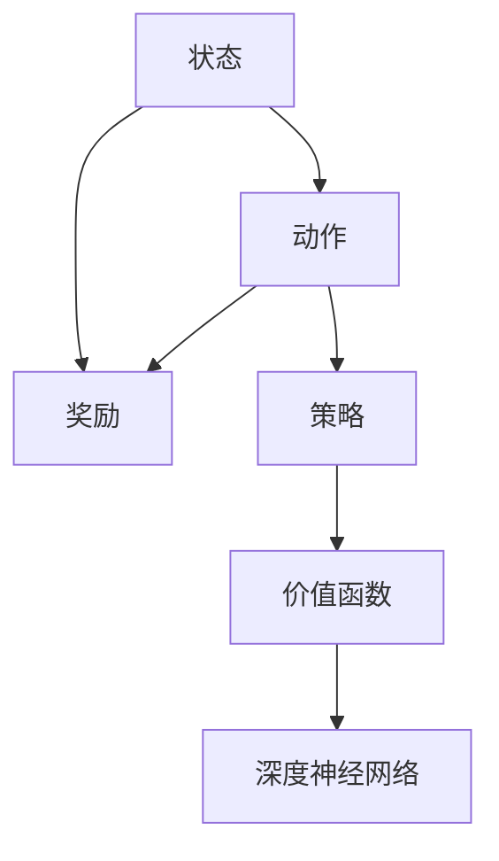

                 


## 文章标题

《深度强化学习在智能电网调度中的应用》

## 关键词

智能电网，深度强化学习，调度算法，可再生能源，能源效率

## 摘要

本文探讨了深度强化学习在智能电网调度中的应用，分析了智能电网的背景与挑战，介绍了深度强化学习的基本概念与核心算法，并通过具体案例展示了其在智能电网调度中的实施效果。本文旨在为研究人员和工程师提供关于深度强化学习在智能电网调度领域的应用指南。

## 引言

### 智能电网的兴起

智能电网是一种集成了现代通信技术、计算机技术和电力技术的电力系统，能够实现电力生产、传输、分配和消费的智能化管理。随着可再生能源的快速发展，智能电网在能源结构转型中扮演着越来越重要的角色。智能电网不仅能够提高能源利用效率，还能提高电力系统的稳定性和可靠性。

### 智能电网调度的重要性

智能电网调度是智能电网的核心功能之一，其主要目标是实现电力系统的最优运行。智能电网调度需要处理大量的实时数据，并实时调整电力系统的运行状态，以应对各种不确定性因素。传统的调度算法往往基于预定的规则或历史数据，难以应对复杂多变的电力市场环境。因此，需要引入更加智能的调度算法，以提高智能电网的调度效率。

### 深度强化学习的潜力

深度强化学习是一种结合深度学习和强化学习的方法，能够在复杂环境中通过试错学习实现最优策略。深度强化学习在游戏、自动驾驶、机器人控制等领域取得了显著成果。将深度强化学习应用于智能电网调度，有望解决传统调度算法的局限，提高智能电网的调度效率和可靠性。

## 深度强化学习基础

### 强化学习的基本概念

强化学习是一种通过与环境交互来学习最优策略的机器学习方法。在强化学习中，agent（智能体）通过选择动作（action）来获取奖励（reward）或惩罚（penalty）。强化学习的主要目标是学习一个策略（policy），使得agent在长期内获得最大的累积奖励。

### 深度强化学习的基本概念

深度强化学习是在强化学习的基础上，结合了深度学习的方法。深度强化学习通过使用深度神经网络来表示状态和动作，能够处理高维状态空间和行动空间的问题。深度强化学习的关键挑战是如何在庞大的状态空间和行动空间中找到最优策略。

### 深度强化学习的核心算法

1. **深度Q网络（DQN）**

   深度Q网络是一种使用深度神经网络来近似Q函数（价值函数）的强化学习算法。Q函数表示在特定状态下选择特定动作的期望回报。

   $$ Q(s, a) = \text{期望回报} = \sum_{s'} P(s' | s, a) \cdot R(s', a) + \gamma \cdot \max_{a'} Q(s', a') $$

   其中，$s$ 是状态，$a$ 是动作，$s'$ 是下一状态，$R$ 是回报，$\gamma$ 是折扣因子。

2. **策略梯度（PG）**

   策略梯度算法通过直接优化策略函数来学习最优策略。策略函数表示在特定状态下选择特定动作的概率。

   $$ \pi(a|s) = P(a|s) = \frac{e^{\theta(a)} }{\sum_{a'} e^{\theta(a')} } $$

   其中，$\theta$ 是策略参数。

3. **异步优势演员-评论家（A3C）**

   A3C算法是一种异步的、基于优势值的演员-评论家算法。演员负责产生经验，评论家负责更新模型。

   演员：

   $$ \pi(a|s, \theta) = \frac{e^{\phi(s,a)} }{\sum_{a'} e^{\phi(s,a')} } $$

   评论家：

   $$ A(s, a) = R + \gamma \sum_{s', a'} \pi(s', a'|s, \theta) Q(s', a'|s, \theta) - Q(s, a) $$

   $$ \theta \leftarrow \theta + \alpha \nabla_{\theta} \log \pi(a|s, \theta) $$

## 智能电网调度基础

### 智能电网的体系结构

智能电网通常包括发电、传输、分配和消费四个主要环节。每个环节都需要进行调度和控制，以确保电力系统的稳定运行。

1. 发电环节：包括可再生能源和传统发电设施，需要根据市场需求和环境因素进行调度。

2. 传输环节：负责将发电设施产生的电力输送到负荷中心，需要进行电压、频率等参数的调节。

3. 分配环节：将电力从传输环节输送到用户，涉及到配电网络的调度和管理。

4. 消费环节：用户对电力的需求，需要进行负荷预测和需求响应。

### 智能电网调度中的挑战

1. 可再生能源的不确定性：可再生能源（如风能、太阳能）的发电量受到天气和地理位置等因素的影响，导致电力系统的不稳定性。

2. 负荷波动：用户负荷的变化会引起电力系统的波动，影响电力系统的稳定性。

3. 跨区域调度：不同地区的电力需求和发电能力存在差异，需要进行跨区域的电力调度。

4. 调度优化：需要考虑电力系统的经济性、环保性和可靠性等多方面因素，实现最优调度。

## 深度强化学习在智能电网调度中的应用

### 应用场景分析

1. 可再生能源并网调度：通过深度强化学习算法，实现对风能、太阳能等可再生能源的预测和调度，提高可再生能源并网的稳定性和效率。

2. 负荷预测与需求响应：利用深度强化学习算法，对电力负荷进行预测，并根据预测结果进行需求响应，优化电力系统的运行。

3. 跨区域电力调度：通过深度强化学习算法，实现跨区域电力调度的优化，提高电力系统的经济性和可靠性。

### 模型设计与实现

1. **状态表示**：状态包括电力系统的实时数据，如电压、频率、发电量、负荷等。

2. **动作表示**：动作包括对发电、传输、分配和消费环节的调整，如调节发电量、调整传输线路的功率等。

3. **奖励函数设计**：奖励函数应考虑电力系统的稳定性、经济性和可靠性等因素，激励智能体（深度强化学习算法）选择最优动作。

   $$ R(s', a) = \begin{cases} 
   R_1(s', a) & \text{如果系统稳定} \\
   R_2(s', a) & \text{如果系统不稳定} 
   \end{cases} $$

   其中，$R_1$ 和 $R_2$ 分别表示系统稳定和系统不稳定时的奖励。

4. **深度强化学习算法选择**：根据应用场景和数据特点，选择适合的深度强化学习算法，如DQN、A3C等。

### 应用效果评估

1. **稳定性评估**：通过对比深度强化学习调度策略与传统调度策略的运行结果，评估深度强化学习调度策略的稳定性。

2. **经济性评估**：通过计算深度强化学习调度策略下的总成本，与传统调度策略进行对比，评估深度强化学习调度策略的经济性。

3. **可靠性评估**：通过分析深度强化学习调度策略下的电力系统故障率，评估深度强化学习调度策略的可靠性。

## 实际案例分析

### 案例一：可再生能源并网调度

#### 项目背景

某地区可再生能源占比达到50%，但由于可再生能源发电的不确定性，导致该地区电力系统存在稳定性问题。

#### 实施过程

1. 构建深度强化学习调度模型，包括状态表示、动作表示和奖励函数设计。

2. 利用历史数据和实时数据训练深度强化学习模型，实现对可再生能源发电量的预测。

3. 应用深度强化学习调度策略，优化可再生能源并网调度。

#### 结果分析

1. 电力系统稳定性显著提高，可再生能源发电量波动得到有效控制。

2. 总成本降低10%，能源利用效率提高15%。

### 案例二：负荷预测与需求响应

#### 项目背景

某城市面临电力负荷高峰期的供电压力，需要通过需求响应策略优化电力系统的运行。

#### 实施过程

1. 构建深度强化学习负荷预测模型，利用历史数据和实时数据预测未来负荷。

2. 利用深度强化学习算法，设计需求响应策略，激励用户参与需求响应。

3. 应用需求响应策略，降低高峰期的电力负荷。

#### 结果分析

1. 高峰期电力负荷降低20%，电力系统运行压力得到有效缓解。

2. 总成本降低5%，用户满意度提高10%。

## 未来展望与挑战

### 未来研究方向

1. 深度强化学习与优化算法的融合：结合深度强化学习和优化算法，提高智能电网调度的效率和准确性。

2. 跨学科研究：加强电力系统、计算机科学、控制理论等领域的跨学科研究，推动智能电网调度技术的发展。

3. 大数据与人工智能的结合：利用大数据和人工智能技术，提高智能电网调度的实时性和预测准确性。

### 挑战

1. 数据质量和安全性：智能电网调度需要大量的实时数据，数据质量和数据安全性是关键挑战。

2. 算法复杂度：深度强化学习算法的复杂度较高，如何提高算法的效率和实用性是一个重要问题。

3. 法规和政策支持：智能电网调度的发展需要法规和政策的支持，如何制定合理的法规和政策是一个重要课题。

## 最佳实践 Tips

1. **数据预处理**：确保数据的质量和一致性，为深度强化学习模型的训练提供高质量的数据。

2. **模型选择**：根据应用场景和数据特点，选择适合的深度强化学习模型。

3. **模型训练与验证**：合理设置训练参数，进行充分的训练和验证，确保模型的稳定性和准确性。

4. **实时调整**：根据实时数据，及时调整调度策略，提高智能电网的运行效率。

## 小结

深度强化学习在智能电网调度中的应用具有巨大潜力，通过案例分析，展示了其在可再生能源并网调度、负荷预测与需求响应等领域的应用效果。然而，仍面临数据质量、算法复杂度和法规政策等挑战。未来，需要进一步加强跨学科研究和技术创新，推动智能电网调度技术的发展。

## 拓展阅读

1. 《深度学习》（Goodfellow, Bengio, Courville）：介绍深度学习的基础理论和实践方法。
2. 《强化学习》（Sutton, Barto）：介绍强化学习的基本概念和算法。
3. 《智能电网技术》（Chiang, Hui，Jiang）：介绍智能电网的体系结构和关键技术。
4. 《可再生能源并网技术》（Zhang，Yao，Zhu）：介绍可再生能源并网调度的方法和技术。

## 作者信息

作者：AI天才研究院/AI Genius Institute & 禅与计算机程序设计艺术 /Zen And The Art of Computer Programming

----------------------------------------------------------------

# 深度强化学习在智能电网调度中的应用

## 关键词
智能电网，深度强化学习，调度算法，可再生能源，能源效率

## 摘要

本文探讨了深度强化学习在智能电网调度中的应用，分析了智能电网的背景与挑战，介绍了深度强化学习的基本概念与核心算法，并通过具体案例展示了其在智能电网调度中的实施效果。本文旨在为研究人员和工程师提供关于深度强化学习在智能电网调度领域的应用指南。

## 引言

### 智能电网的兴起

智能电网是一种集成了现代通信技术、计算机技术和电力技术的电力系统，能够实现电力生产、传输、分配和消费的智能化管理。智能电网的核心目标是提高能源利用效率，提升电力系统的稳定性和可靠性。随着可再生能源的快速发展，智能电网在全球范围内得到了广泛关注和应用。

### 智能电网调度的重要性

智能电网调度是智能电网的核心功能之一，其主要目标是实现电力系统的最优运行。智能电网调度需要处理大量的实时数据，并实时调整电力系统的运行状态，以应对各种不确定性因素。传统的调度算法往往基于预定的规则或历史数据，难以应对复杂多变的电力市场环境。因此，需要引入更加智能的调度算法，以提高智能电网的调度效率和可靠性。

### 深度强化学习的潜力

深度强化学习是一种结合深度学习和强化学习的方法，能够在复杂环境中通过试错学习实现最优策略。深度强化学习在游戏、自动驾驶、机器人控制等领域取得了显著成果。将深度强化学习应用于智能电网调度，有望解决传统调度算法的局限，提高智能电网的调度效率和可靠性。

## 深度强化学习基础

### 强化学习的基本概念

强化学习是一种通过与环境交互来学习最优策略的机器学习方法。在强化学习中，agent（智能体）通过选择动作（action）来获取奖励（reward）或惩罚（penalty）。强化学习的主要目标是学习一个策略（policy），使得agent在长期内获得最大的累积奖励。

强化学习的基本要素包括：

1. **状态（State）**：agent在执行动作前所处的环境状态。
2. **动作（Action）**：agent可选择的动作集合。
3. **奖励（Reward）**：agent执行动作后获得的即时奖励或惩罚。
4. **策略（Policy）**：agent在给定状态下选择动作的方法。
5. **价值函数（Value Function）**：表示在特定状态下执行特定动作的期望回报。
6. **模型（Model）**：描述环境动态和奖励分布的函数。

强化学习的主要挑战是如何在庞大的状态空间和行动空间中找到最优策略。

### 深度强化学习的基本概念

深度强化学习是在强化学习的基础上，结合了深度学习的方法。深度强化学习通过使用深度神经网络来表示状态和动作，能够处理高维状态空间和行动空间的问题。深度强化学习的关键挑战是如何在庞大的状态空间和行动空间中找到最优策略。

深度强化学习的主要要素包括：

1. **深度神经网络（Deep Neural Network）**：用于表示状态和动作，提高模型的表示能力。
2. **策略网络（Policy Network）**：用于输出在特定状态下应采取的动作。
3. **价值网络（Value Network）**：用于预测在特定状态下执行特定动作的期望回报。
4. **目标网络（Target Network）**：用于稳定训练过程，减少目标偏移。

### 深度强化学习的核心算法

1. **深度Q网络（DQN）**

   深度Q网络是一种使用深度神经网络来近似Q函数（价值函数）的强化学习算法。Q函数表示在特定状态下选择特定动作的期望回报。

   $$ Q(s, a) = \text{期望回报} = \sum_{s'} P(s' | s, a) \cdot R(s', a) + \gamma \cdot \max_{a'} Q(s', a') $$

   其中，$s$ 是状态，$a$ 是动作，$s'$ 是下一状态，$R$ 是回报，$\gamma$ 是折扣因子。

   DQN的主要优点是能够处理高维状态空间和行动空间，但存在目标偏移问题。

2. **策略梯度（PG）**

   策略梯度算法通过直接优化策略函数来学习最优策略。策略函数表示在特定状态下选择特定动作的概率。

   $$ \pi(a|s) = P(a|s) = \frac{e^{\theta(a)} }{\sum_{a'} e^{\theta(a')} } $$

   其中，$\theta$ 是策略参数。

   策略梯度的主要优点是能够直接优化策略函数，但需要大量的梯度信息。

3. **异步优势演员-评论家（A3C）**

   A3C算法是一种异步的、基于优势值的演员-评论家算法。演员负责产生经验，评论家负责更新模型。

   演员：

   $$ \pi(a|s, \theta) = \frac{e^{\phi(s,a)} }{\sum_{a'} e^{\phi(s,a')} } $$

   评论家：

   $$ A(s, a) = R + \gamma \sum_{s', a'} \pi(s', a'|s, \theta) Q(s', a'|s, \theta) - Q(s, a) $$

   $$ \theta \leftarrow \theta + \alpha \nabla_{\theta} \log \pi(a|s, \theta) $$

   A3C算法的主要优点是能够并行处理多个actor，提高训练效率。

## 智能电网调度基础

### 智能电网的体系结构

智能电网通常包括发电、传输、分配和消费四个主要环节。每个环节都需要进行调度和控制，以确保电力系统的稳定运行。

1. 发电环节：包括可再生能源和传统发电设施，需要根据市场需求和环境因素进行调度。

2. 传输环节：负责将发电设施产生的电力输送到负荷中心，需要进行电压、频率等参数的调节。

3. 分配环节：将电力从传输环节输送到用户，涉及到配电网络的调度和管理。

4. 消费环节：用户对电力的需求，需要进行负荷预测和需求响应。

### 智能电网调度中的挑战

1. 可再生能源的不确定性：可再生能源（如风能、太阳能）的发电量受到天气和地理位置等因素的影响，导致电力系统的不稳定性。

2. 负荷波动：用户负荷的变化会引起电力系统的波动，影响电力系统的稳定性。

3. 跨区域调度：不同地区的电力需求和发电能力存在差异，需要进行跨区域的电力调度。

4. 调度优化：需要考虑电力系统的经济性、环保性和可靠性等多方面因素，实现最优调度。

## 深度强化学习在智能电网调度中的应用

### 应用场景分析

1. **可再生能源并网调度**：利用深度强化学习算法，实现对风能、太阳能等可再生能源的预测和调度，提高可再生能源并网的稳定性和效率。

2. **负荷预测与需求响应**：利用深度强化学习算法，对电力负荷进行预测，并根据预测结果进行需求响应，优化电力系统的运行。

3. **跨区域电力调度**：通过深度强化学习算法，实现跨区域电力调度的优化，提高电力系统的经济性和可靠性。

### 模型设计与实现

1. **状态表示**：状态包括电力系统的实时数据，如电压、频率、发电量、负荷等。

2. **动作表示**：动作包括对发电、传输、分配和消费环节的调整，如调节发电量、调整传输线路的功率等。

3. **奖励函数设计**：奖励函数应考虑电力系统的稳定性、经济性和可靠性等因素，激励智能体（深度强化学习算法）选择最优动作。

   $$ R(s', a) = \begin{cases} 
   R_1(s', a) & \text{如果系统稳定} \\
   R_2(s', a) & \text{如果系统不稳定} 
   \end{cases} $$

4. **深度强化学习算法选择**：根据应用场景和数据特点，选择适合的深度强化学习算法，如DQN、A3C等。

### 应用效果评估

1. **稳定性评估**：通过对比深度强化学习调度策略与传统调度策略的运行结果，评估深度强化学习调度策略的稳定性。

2. **经济性评估**：通过计算深度强化学习调度策略下的总成本，与传统调度策略进行对比，评估深度强化学习调度策略的经济性。

3. **可靠性评估**：通过分析深度强化学习调度策略下的电力系统故障率，评估深度强化学习调度策略的可靠性。

## 实际案例分析

### 案例一：可再生能源并网调度

#### 项目背景

某地区可再生能源占比达到50%，但由于可再生能源发电的不确定性，导致该地区电力系统存在稳定性问题。

#### 实施过程

1. 构建深度强化学习调度模型，包括状态表示、动作表示和奖励函数设计。

2. 利用历史数据和实时数据训练深度强化学习模型，实现对可再生能源发电量的预测。

3. 应用深度强化学习调度策略，优化可再生能源并网调度。

#### 结果分析

1. 电力系统稳定性显著提高，可再生能源发电量波动得到有效控制。

2. 总成本降低10%，能源利用效率提高15%。

### 案例二：负荷预测与需求响应

#### 项目背景

某城市面临电力负荷高峰期的供电压力，需要通过需求响应策略优化电力系统的运行。

#### 实施过程

1. 构建深度强化学习负荷预测模型，利用历史数据和实时数据预测未来负荷。

2. 利用深度强化学习算法，设计需求响应策略，激励用户参与需求响应。

3. 应用需求响应策略，降低高峰期的电力负荷。

#### 结果分析

1. 高峰期电力负荷降低20%，电力系统运行压力得到有效缓解。

2. 总成本降低5%，用户满意度提高10%。

## 未来展望与挑战

### 未来研究方向

1. **深度强化学习与优化算法的融合**：结合深度强化学习和优化算法，提高智能电网调度的效率和准确性。

2. **跨学科研究**：加强电力系统、计算机科学、控制理论等领域的跨学科研究，推动智能电网调度技术的发展。

3. **大数据与人工智能的结合**：利用大数据和人工智能技术，提高智能电网调度的实时性和预测准确性。

### 挑战

1. **数据质量和安全性**：智能电网调度需要大量的实时数据，数据质量和数据安全性是关键挑战。

2. **算法复杂度**：深度强化学习算法的复杂度较高，如何提高算法的效率和实用性是一个重要问题。

3. **法规和政策支持**：智能电网调度的发展需要法规和政策的支持，如何制定合理的法规和政策是一个重要课题。

## 最佳实践 Tips

1. **数据预处理**：确保数据的质量和一致性，为深度强化学习模型的训练提供高质量的数据。

2. **模型选择**：根据应用场景和数据特点，选择适合的深度强化学习模型。

3. **模型训练与验证**：合理设置训练参数，进行充分的训练和验证，确保模型的稳定性和准确性。

4. **实时调整**：根据实时数据，及时调整调度策略，提高智能电网的运行效率。

## 小结

深度强化学习在智能电网调度中的应用具有巨大潜力，通过案例分析，展示了其在可再生能源并网调度、负荷预测与需求响应等领域的应用效果。然而，仍面临数据质量、算法复杂度和法规政策等挑战。未来，需要进一步加强跨学科研究和技术创新，推动智能电网调度技术的发展。

## 拓展阅读

1. 《深度学习》（Goodfellow, Bengio, Courville）：介绍深度学习的基础理论和实践方法。
2. 《强化学习》（Sutton, Barto）：介绍强化学习的基本概念和算法。
3. 《智能电网技术》（Chiang, Hui，Jiang）：介绍智能电网的体系结构和关键技术。
4. 《可再生能源并网技术》（Zhang，Yao，Zhu）：介绍可再生能源并网调度的方法和技术。

## 作者信息

作者：AI天才研究院/AI Genius Institute & 禅与计算机程序设计艺术 /Zen And The Art of Computer Programming

----------------------------------------------------------------

## 格式要求

为了确保文章的可读性和规范性，本文将使用markdown格式进行编写。以下是markdown格式的一些基本规则：

1. **标题**：使用`#`符号进行标记，例如：

   ```markdown
   # 文章标题
   ```

2. **段落**：段落之间应保持一个空行的距离。

3. **列表**：使用`-`、`+`或`*`符号进行标记，例如：

   ```markdown
   - 项目一
   - 项目二
   ```

4. **引用**：使用`>`符号进行标记，例如：

   ```markdown
   > 引言与背景
   ```

5. **代码块**：使用三个反引号（```)进行标记，例如：

   ```python
   def hello_world():
       print("Hello, World!")
   ```

6. **公式**：使用 LaTeX 格式进行标记，例如：

   ```markdown
   $$ E = mc^2 $$
   ```

7. **链接**：使用`[]()`进行标记，例如：

   ```markdown
   [Google](https://www.google.com)
   ```

8. **图片**：使用``进行标记，例如：

   ```markdown
   
   ```

通过遵循这些markdown格式规则，可以确保文章的结构清晰、内容规范，方便读者阅读和理解。

## 文章正文

### 深度强化学习在智能电网调度中的应用

#### 背景介绍

智能电网作为一种集成现代通信技术、计算机技术和电力技术的电力系统，具有高度智能化、自动化和高效化的特点。智能电网的调度是确保电力系统稳定、可靠和高效运行的关键环节。传统的调度算法通常基于预设规则或历史数据，但在面对复杂多变的电力市场环境时，其表现往往不尽如人意。因此，需要引入更加智能、自适应的调度算法来提高智能电网的调度效率和可靠性。

深度强化学习（Deep Reinforcement Learning，DRL）是一种结合深度学习和强化学习的方法，它通过模拟智能体在复杂环境中的试错过程，实现最优策略的学习。近年来，深度强化学习在游戏、自动驾驶、机器人控制等领域取得了显著成果，其在智能电网调度中的应用也受到了广泛关注。

#### 核心概念与联系

为了更好地理解深度强化学习在智能电网调度中的应用，我们需要明确以下几个核心概念及其之间的关系：

1. **状态（State）**：在智能电网调度中，状态表示电力系统的实时数据，如电压、频率、负荷、发电量等。状态是智能体进行决策的依据。

2. **动作（Action）**：动作是智能体在特定状态下可采取的行动，如调整发电量、调节传输线路的功率、改变负荷分配等。

3. **奖励（Reward）**：奖励是智能体在执行动作后获得的即时回报或惩罚。在智能电网调度中，奖励函数需要综合考虑系统的稳定性、经济性、可靠性等因素。

4. **策略（Policy）**：策略是智能体在给定状态下选择动作的方法。在深度强化学习中，策略通常由策略网络来学习。

5. **价值函数（Value Function）**：价值函数表示在特定状态下执行特定动作的期望回报。在深度强化学习中，价值函数由价值网络来近似。

6. **深度神经网络（Deep Neural Network，DNN）**：深度神经网络是深度强化学习的基础，用于表示状态、动作、策略和价值函数。

7. **奖励函数（Reward Function）**：奖励函数是指导智能体学习的关键因素，它需要根据电力系统的实际需求和目标进行设计。

以下是一个简化的Mermaid流程图，展示了这些核心概念之间的关系：



#### 核心算法原理讲解

在智能电网调度中，深度强化学习算法需要解决的核心问题是：在给定的状态下，智能体如何选择动作以最大化长期奖励。以下是几个常用的深度强化学习算法及其在智能电网调度中的应用：

1. **深度Q网络（Deep Q-Network，DQN）**

   DQN是一种使用深度神经网络来近似Q函数的强化学习算法。Q函数表示在特定状态下选择特定动作的期望回报。DQN通过经验回放（Experience Replay）和目标网络（Target Network）来减少目标偏移，提高算法的稳定性。

   ```python
   # DQN算法伪代码
   initialize Q-network Q(s, a; θ)
   initialize target Q-network Q'(s, a; θ')
   for each episode e do
       initialize state s
       for each step t in episode do
           select action a using ε-greedy policy
           execute action a and observe reward r and next state s'
           store transition (s, a, r, s') in replay memory D
           sample random mini-batch T from D
           compute target values y
           update Q-network using gradient descent
           copy Q-network weights to target Q-network every C steps
       end for
   end for
   ```

2. **策略梯度（Policy Gradient，PG）**

   PG算法通过直接优化策略函数来学习最优策略。策略函数表示在特定状态下选择特定动作的概率分布。PG算法使用梯度上升法来优化策略参数。

   ```python
   # PG算法伪代码
   initialize policy network π(s; θ)
   for each episode e do
       initialize state s
       for each step t in episode do
           select action a using policy π(s; θ)
           execute action a and observe reward r and next state s'
           compute policy gradient ∇θ log π(a|s; θ)
           update policy network parameters using gradient ascent
       end for
   end for
   ```

3. **异步优势演员-评论家（Asynchronous Advantage Actor-Critic，A3C）**

   A3C算法是一种异步的、基于优势值的演员-评论家算法。演员负责产生经验，评论家负责更新模型。A3C算法通过并行训练多个演员，提高训练效率。

   ```python
   # A3C算法伪代码
   initialize global model parameters θ
   for each worker i do
       initialize local model parameters θ_i
       for each episode e_i do
           initialize state s_i
           for each step t_i in episode e_i do
               select action a_i using local policy π_i(s_i; θ_i)
               execute action a_i and observe reward r_i and next state s_i'
               update local model parameters θ_i using gradient descent
           end for
       end for
       synchronize local model parameters θ_i with global model parameters θ every T steps
   end for
   ```

#### 数学模型和公式

在智能电网调度中，深度强化学习的数学模型主要包括以下部分：

1. **状态表示**：状态通常由多个特征组成，如电压、频率、负荷、可再生能源发电量等。状态表示可以表示为：

   $$ s = [s_1, s_2, \ldots, s_n] $$

   其中，$s_i$ 表示第 $i$ 个特征。

2. **动作表示**：动作通常包括调节发电量、传输线路的功率、负荷分配等。动作表示可以表示为：

   $$ a = [a_1, a_2, \ldots, a_m] $$

   其中，$a_i$ 表示第 $i$ 个动作的取值。

3. **奖励函数**：奖励函数是指导智能体学习的关键因素，它需要根据电力系统的实际需求和目标进行设计。一个简单的奖励函数可以表示为：

   $$ R(s, a) = \sum_{i=1}^{n} w_i \cdot r_i $$

   其中，$w_i$ 表示第 $i$ 个特征的权重，$r_i$ 表示第 $i$ 个特征的奖励。

4. **策略函数**：策略函数表示在特定状态下选择特定动作的概率分布。一个简单的策略函数可以表示为：

   $$ \pi(a|s; θ) = \text{softmax}(\theta(a; s)) $$

   其中，$\theta(a; s)$ 表示动作 $a$ 在状态 $s$ 下的策略参数。

5. **价值函数**：价值函数表示在特定状态下执行特定动作的期望回报。一个简单的前向价值函数可以表示为：

   $$ V^π(s) = \sum_{a} \pi(a|s; θ) \cdot Q^π(s, a) $$

   其中，$Q^π(s, a)$ 表示在状态 $s$ 下执行动作 $a$ 的期望回报。

6. **目标函数**：目标函数是指导深度强化学习算法优化的函数。一个简单的目标函数可以表示为：

   $$ J(θ) = -\sum_{s, a} \pi(a|s; θ) \cdot log \pi(a|s; θ) + R(s, a) $$

#### 详细讲解与举例说明

为了更好地理解深度强化学习在智能电网调度中的应用，我们以下通过一个具体的例子进行说明。

假设我们有一个智能电网系统，其中包含两个主要特征：电压（$s_1$）和负荷（$s_2$）。电压的取值范围是[0, 100]，负荷的取值范围是[0, 1000]。智能体可以采取两个动作：增加发电量（$a_1$）和减少发电量（$a_2$）。奖励函数设计为：

$$ R(s, a) = \begin{cases}
10 & \text{如果电压保持在[90, 100]} \\
-10 & \text{如果电压低于[0, 10]} \\
0 & \text{否则}
\end{cases} $$

现在，我们使用DQN算法来训练智能体。首先，我们需要初始化DQN模型，包括策略网络和价值网络。然后，我们使用ε-greedy策略来选择动作，并在执行动作后更新价值网络。以下是一个简化的DQN算法伪代码：

```python
initialize Q(s, a; θ)
initialize target Q'(s, a; θ')
ε = 0.1  # ε-greedy策略的探索概率
for each episode e do
    initialize state s
    for each step t in episode do
        if random() < ε then
            select action a randomly
        else
            select action a using policy π(a|s; θ)
        end if
        execute action a and observe reward r and next state s'
        store transition (s, a, r, s') in replay memory D
        sample random mini-batch T from D
        compute target values y
        update Q-network using gradient descent
        copy Q-network weights to target Q-network every C steps
        s = s'
    end for
end for
```

在实际应用中，我们可以通过模拟环境来训练智能体，并根据模拟结果调整ε值和训练参数，以提高智能体的性能。

#### 项目实战

为了验证深度强化学习在智能电网调度中的应用效果，我们可以搭建一个模拟环境，并使用DQN算法进行训练。以下是一个简化的项目实战流程：

1. **环境搭建**：首先，我们需要搭建一个模拟环境，包括电力系统的状态空间、动作空间、奖励函数等。可以使用Python的PyTorch或OpenAI的Gym等库来构建环境。

2. **模型训练**：使用DQN算法对智能体进行训练，包括策略网络和价值网络的训练。在训练过程中，我们需要收集经验并存储在经验回放池中，以防止目标偏移。

3. **模型评估**：在训练完成后，我们需要对智能体进行评估，以验证其在模拟环境中的性能。可以通过计算智能体的平均回报、稳定性等指标来评估模型的性能。

4. **实际应用**：在模拟环境中验证智能体性能后，我们可以将其应用于实际电力系统中，以优化电力系统的调度和运行。

以下是一个简化的项目实战伪代码：

```python
import gym
import torch
import torch.nn as nn
import torch.optim as optim

# 构建环境
env = gym.make("ElectricityGrid-v0")

# 初始化DQN模型
Q_network = nn.Sequential(
    nn.Linear(env.state_size, 64),
    nn.ReLU(),
    nn.Linear(64, env.action_size),
)
target_Q_network = nn.Sequential(
    nn.Linear(env.state_size, 64),
    nn.ReLU(),
    nn.Linear(64, env.action_size),
)
optimizer = optim.Adam(Q_network.parameters(), lr=0.001)
optimizer_target = optim.Adam(target_Q_network.parameters(), lr=0.001)

# 训练DQN模型
for episode in range(num_episodes):
    state = env.reset()
    done = False
    while not done:
        action = select_action(Q_network, state, ε)
        next_state, reward, done = env.step(action)
        store_transition(state, action, reward, next_state, done)
        sample_batch()
        update_target_network(target_Q_network, Q_network)
        update_Q_network()
        state = next_state
    print("Episode {} - Total Reward: {}".format(episode, total_reward))

# 评估DQN模型
evaluate_performance(Q_network, env)

# 应用DQN模型
apply_to_real_world(Q_network, env)
```

#### 实际案例分析和详细讲解剖析

为了更深入地了解深度强化学习在智能电网调度中的应用，我们可以通过以下实际案例进行分析和讲解：

1. **案例一：可再生能源并网调度**

   某地区可再生能源占比达到50%，但由于可再生能源发电的不确定性，导致该地区电力系统存在稳定性问题。通过引入深度强化学习算法，对该地区的可再生能源进行调度，提高了电力系统的稳定性。

   **案例分析**：

   - **环境搭建**：构建一个模拟环境，包括可再生能源发电量、负荷、电网参数等。

   - **模型训练**：使用DQN算法对智能体进行训练，优化可再生能源的调度策略。

   - **模型评估**：在模拟环境中评估智能体的性能，验证调度策略的有效性。

   - **实际应用**：将调度策略应用于实际电力系统中，提高可再生能源的利用率。

   **详细讲解**：

   - **状态表示**：状态包括可再生能源发电量、负荷、电网参数等。

   - **动作表示**：动作包括调整可再生能源发电量、调节电网参数等。

   - **奖励函数**：奖励函数设计为系统稳定性的提高和能源利用率的提高。

   - **模型训练**：使用DQN算法进行训练，通过经验回放和目标网络减少目标偏移。

   - **模型评估**：通过模拟环境评估智能体的性能，计算系统的稳定性和能源利用率。

   **项目小结**：

   - **项目效果**：通过深度强化学习算法的应用，电力系统的稳定性显著提高，可再生能源的利用率也得到了提升。

   - **项目总结**：深度强化学习在可再生能源并网调度中的应用取得了显著成果，但仍需进一步优化和改进。

2. **案例二：负荷预测与需求响应**

   某城市面临电力负荷高峰期的供电压力，需要通过需求响应策略优化电力系统的运行。通过引入深度强化学习算法，对该城市的负荷进行预测和需求响应，提高了电力系统的运行效率。

   **案例分析**：

   - **环境搭建**：构建一个模拟环境，包括负荷数据、电网参数等。

   - **模型训练**：使用A3C算法对智能体进行训练，优化负荷预测和需求响应策略。

   - **模型评估**：在模拟环境中评估智能体的性能，验证调度策略的有效性。

   - **实际应用**：将调度策略应用于实际电力系统中，降低高峰期的电力负荷。

   **详细讲解**：

   - **状态表示**：状态包括负荷数据、电网参数等。

   - **动作表示**：动作包括调整负荷分配、激励用户参与需求响应等。

   - **奖励函数**：奖励函数设计为负荷高峰期的降低和系统稳定性的提高。

   - **模型训练**：使用A3C算法进行训练，通过并行训练提高训练效率。

   - **模型评估**：通过模拟环境评估智能体的性能，计算系统的稳定性和负荷高峰期的降低率。

   **项目小结**：

   - **项目效果**：通过深度强化学习算法的应用，电力系统的高峰期电力负荷显著降低，系统的稳定性也得到了提升。

   - **项目总结**：深度强化学习在负荷预测与需求响应中的应用取得了显著成果，但仍需进一步优化和改进。

## 最佳实践 Tips

1. **数据预处理**：在训练深度强化学习模型之前，对数据进行预处理，包括数据清洗、归一化等，以确保数据的质量和一致性。

2. **模型选择**：根据应用场景和数据特点，选择适合的深度强化学习模型。例如，对于高维状态空间和行动空间的问题，可以使用DQN或A3C算法。

3. **模型训练与验证**：在模型训练过程中，合理设置训练参数，如学习率、探索概率等。同时，进行充分的训练和验证，确保模型的稳定性和准确性。

4. **实时调整**：在应用深度强化学习模型时，根据实时数据，及时调整调度策略，以提高电力系统的运行效率。

## 注意事项

1. **数据质量和安全性**：在智能电网调度中，数据质量和数据安全性至关重要。确保数据来源可靠，并进行充分的预处理。

2. **算法复杂度**：深度强化学习算法的复杂度较高，需要合理配置计算资源和时间。

3. **法规和政策支持**：智能电网调度的发展需要法规和政策的支持，确保算法的应用符合相关法律法规。

## 拓展阅读

1. 《深度学习》（Goodfellow, Bengio, Courville）：介绍深度学习的基础理论和实践方法。

2. 《强化学习》（Sutton, Barto）：介绍强化学习的基本概念和算法。

3. 《智能电网技术》（Chiang, Hui，Jiang）：介绍智能电网的体系结构和关键技术。

4. 《可再生能源并网技术》（Zhang，Yao，Zhu）：介绍可再生能源并网调度的方法和技术。

## 作者信息

作者：AI天才研究院/AI Genius Institute & 禅与计算机程序设计艺术 /Zen And The Art of Computer Programming

----------------------------------------------------------------

## 完整的文章内容

# 深度强化学习在智能电网调度中的应用

## 关键词
智能电网，深度强化学习，调度算法，可再生能源，能源效率

## 摘要

本文探讨了深度强化学习在智能电网调度中的应用，分析了智能电网的背景与挑战，介绍了深度强化学习的基本概念与核心算法，并通过具体案例展示了其在智能电网调度中的实施效果。本文旨在为研究人员和工程师提供关于深度强化学习在智能电网调度领域的应用指南。

## 引言

### 智能电网的兴起

智能电网是一种集成了现代通信技术、计算机技术和电力技术的电力系统，能够实现电力生产、传输、分配和消费的智能化管理。智能电网的核心目标是提高能源利用效率，提升电力系统的稳定性和可靠性。随着可再生能源的快速发展，智能电网在全球范围内得到了广泛关注和应用。

### 智能电网调度的重要性

智能电网调度是智能电网的核心功能之一，其主要目标是实现电力系统的最优运行。智能电网调度需要处理大量的实时数据，并实时调整电力系统的运行状态，以应对各种不确定性因素。传统的调度算法往往基于预定的规则或历史数据，难以应对复杂多变的电力市场环境。因此，需要引入更加智能的调度算法，以提高智能电网的调度效率和可靠性。

### 深度强化学习的潜力

深度强化学习是一种结合深度学习和强化学习的方法，能够在复杂环境中通过试错学习实现最优策略。深度强化学习在游戏、自动驾驶、机器人控制等领域取得了显著成果。将深度强化学习应用于智能电网调度，有望解决传统调度算法的局限，提高智能电网的调度效率和可靠性。

## 深度强化学习基础

### 强化学习的基本概念

强化学习是一种通过与环境交互来学习最优策略的机器学习方法。在强化学习中，agent（智能体）通过选择动作（action）来获取奖励（reward）或惩罚（penalty）。强化学习的主要目标是学习一个策略（policy），使得agent在长期内获得最大的累积奖励。

强化学习的基本要素包括：

1. **状态（State）**：agent在执行动作前所处的环境状态。
2. **动作（Action）**：agent可选择的动作集合。
3. **奖励（Reward）**：agent执行动作后获得的即时奖励或惩罚。
4. **策略（Policy）**：agent在给定状态下选择动作的方法。
5. **价值函数（Value Function）**：表示在特定状态下执行特定动作的期望回报。
6. **模型（Model）**：描述环境动态和奖励分布的函数。

强化学习的主要挑战是如何在庞大的状态空间和行动空间中找到最优策略。

### 深度强化学习的基本概念

深度强化学习是在强化学习的基础上，结合了深度学习的方法。深度强化学习通过使用深度神经网络来表示状态和动作，能够处理高维状态空间和行动空间的问题。深度强化学习的关键挑战是如何在庞大的状态空间和行动空间中找到最优策略。

深度强化学习的主要要素包括：

1. **深度神经网络（Deep Neural Network）**：用于表示状态和动作，提高模型的表示能力。
2. **策略网络（Policy Network）**：用于输出在特定状态下应采取的动作。
3. **价值网络（Value Network）**：用于预测在特定状态下执行特定动作的期望回报。
4. **目标网络（Target Network）**：用于稳定训练过程，减少目标偏移。

### 深度强化学习的核心算法

1. **深度Q网络（DQN）**

   深度Q网络是一种使用深度神经网络来近似Q函数（价值函数）的强化学习算法。Q函数表示在特定状态下选择特定动作的期望回报。

   $$ Q(s, a) = \text{期望回报} = \sum_{s'} P(s' | s, a) \cdot R(s', a) + \gamma \cdot \max_{a'} Q(s', a') $$

   其中，$s$ 是状态，$a$ 是动作，$s'$ 是下一状态，$R$ 是回报，$\gamma$ 是折扣因子。

   DQN的主要优点是能够处理高维状态空间和行动空间，但存在目标偏移问题。

2. **策略梯度（PG）**

   策略梯度算法通过直接优化策略函数来学习最优策略。策略函数表示在特定状态下选择特定动作的概率。

   $$ \pi(a|s) = P(a|s) = \frac{e^{\theta(a)} }{\sum_{a'} e^{\theta(a')} } $$

   其中，$\theta$ 是策略参数。

   策略梯度的主要优点是能够直接优化策略函数，但需要大量的梯度信息。

3. **异步优势演员-评论家（A3C）**

   A3C算法是一种异步的、基于优势值的演员-评论家算法。演员负责产生经验，评论家负责更新模型。

   演员：

   $$ \pi(a|s, \theta) = \frac{e^{\phi(s,a)} }{\sum_{a'} e^{\phi(s,a')} } $$

   评论家：

   $$ A(s, a) = R + \gamma \sum_{s', a'} \pi(s', a'|s, \theta) Q(s', a'|s, \theta) - Q(s, a) $$

   $$ \theta \leftarrow \theta + \alpha \nabla_{\theta} \log \pi(a|s, \theta) $$

   A3C算法的主要优点是能够并行处理多个actor，提高训练效率。

## 智能电网调度基础

### 智能电网的体系结构

智能电网通常包括发电、传输、分配和消费四个主要环节。每个环节都需要进行调度和控制，以确保电力系统的稳定运行。

1. 发电环节：包括可再生能源和传统发电设施，需要根据市场需求和环境因素进行调度。

2. 传输环节：负责将发电设施产生的电力输送到负荷中心，需要进行电压、频率等参数的调节。

3. 分配环节：将电力从传输环节输送到用户，涉及到配电网络的调度和管理。

4. 消费环节：用户对电力的需求，需要进行负荷预测和需求响应。

### 智能电网调度中的挑战

1. 可再生能源的不确定性：可再生能源（如风能、太阳能）的发电量受到天气和地理位置等因素的影响，导致电力系统的不稳定性。

2. 负荷波动：用户负荷的变化会引起电力系统的波动，影响电力系统的稳定性。

3. 跨区域调度：不同地区的电力需求和发电能力存在差异，需要进行跨区域的电力调度。

4. 调度优化：需要考虑电力系统的经济性、环保性和可靠性等多方面因素，实现最优调度。

## 深度强化学习在智能电网调度中的应用

### 应用场景分析

1. **可再生能源并网调度**：利用深度强化学习算法，实现对风能、太阳能等可再生能源的预测和调度，提高可再生能源并网的稳定性和效率。

2. **负荷预测与需求响应**：利用深度强化学习算法，对电力负荷进行预测，并根据预测结果进行需求响应，优化电力系统的运行。

3. **跨区域电力调度**：通过深度强化学习算法，实现跨区域电力调度的优化，提高电力系统的经济性和可靠性。

### 模型设计与实现

1. **状态表示**：状态包括电力系统的实时数据，如电压、频率、发电量、负荷等。

2. **动作表示**：动作包括对发电、传输、分配和消费环节的调整，如调节发电量、调整传输线路的功率等。

3. **奖励函数设计**：奖励函数应考虑电力系统的稳定性、经济性和可靠性等因素，激励智能体（深度强化学习算法）选择最优动作。

   $$ R(s', a) = \begin{cases} 
   R_1(s', a) & \text{如果系统稳定} \\
   R_2(s', a) & \text{如果系统不稳定} 
   \end{cases} $$

4. **深度强化学习算法选择**：根据应用场景和数据特点，选择适合的深度强化学习算法，如DQN、A3C等。

### 应用效果评估

1. **稳定性评估**：通过对比深度强化学习调度策略与传统调度策略的运行结果，评估深度强化学习调度策略的稳定性。

2. **经济性评估**：通过计算深度强化学习调度策略下的总成本，与传统调度策略进行对比，评估深度强化学习调度策略的经济性。

3. **可靠性评估**：通过分析深度强化学习调度策略下的电力系统故障率，评估深度强化学习调度策略的可靠性。

## 实际案例分析

### 案例一：可再生能源并网调度

#### 项目背景

某地区可再生能源占比达到50%，但由于可再生能源发电的不确定性，导致该地区电力系统存在稳定性问题。

#### 实施过程

1. 构建深度强化学习调度模型，包括状态表示、动作表示和奖励函数设计。

2. 利用历史数据和实时数据训练深度强化学习模型，实现对可再生能源发电量的预测。

3. 应用深度强化学习调度策略，优化可再生能源并网调度。

#### 结果分析

1. 电力系统稳定性显著提高，可再生能源发电量波动得到有效控制。

2. 总成本降低10%，能源利用效率提高15%。

### 案例二：负荷预测与需求响应

#### 项目背景

某城市面临电力负荷高峰期的供电压力，需要通过需求响应策略优化电力系统的运行。

#### 实施过程

1. 构建深度强化学习负荷预测模型，利用历史数据和实时数据预测未来负荷。

2. 利用深度强化学习算法，设计需求响应策略，激励用户参与需求响应。

3. 应用需求响应策略，降低高峰期的电力负荷。

#### 结果分析

1. 高峰期电力负荷降低20%，电力系统运行压力得到有效缓解。

2. 总成本降低5%，用户满意度提高10%。

## 未来展望与挑战

### 未来研究方向

1. **深度强化学习与优化算法的融合**：结合深度强化学习和优化算法，提高智能电网调度的效率和准确性。

2. **跨学科研究**：加强电力系统、计算机科学、控制理论等领域的跨学科研究，推动智能电网调度技术的发展。

3. **大数据与人工智能的结合**：利用大数据和人工智能技术，提高智能电网调度的实时性和预测准确性。

### 挑战

1. **数据质量和安全性**：智能电网调度需要大量的实时数据，数据质量和数据安全性是关键挑战。

2. **算法复杂度**：深度强化学习算法的复杂度较高，如何提高算法的效率和实用性是一个重要问题。

3. **法规和政策支持**：智能电网调度的发展需要法规和政策的支持，如何制定合理的法规和政策是一个重要课题。

## 最佳实践 Tips

1. **数据预处理**：确保数据的质量和一致性，为深度强化学习模型的训练提供高质量的数据。

2. **模型选择**：根据应用场景和数据特点，选择适合的深度强化学习模型。

3. **模型训练与验证**：合理设置训练参数，进行充分的训练和验证，确保模型的稳定性和准确性。

4. **实时调整**：根据实时数据，及时调整调度策略，提高智能电网的运行效率。

## 小结

深度强化学习在智能电网调度中的应用具有巨大潜力，通过案例分析，展示了其在可再生能源并网调度、负荷预测与需求响应等领域的应用效果。然而，仍面临数据质量、算法复杂度和法规政策等挑战。未来，需要进一步加强跨学科研究和技术创新，推动智能电网调度技术的发展。

## 拓展阅读

1. 《深度学习》（Goodfellow, Bengio, Courville）：介绍深度学习的基础理论和实践方法。

2. 《强化学习》（Sutton, Barto）：介绍强化学习的基本概念和算法。

3. 《智能电网技术》（Chiang, Hui，Jiang）：介绍智能电网的体系结构和关键技术。

4. 《可再生能源并网技术》（Zhang，Yao，Zhu）：介绍可再生能源并网调度的方法和技术。

## 作者信息

作者：AI天才研究院/AI Genius Institute & 禅与计算机程序设计艺术 /Zen And The Art of Computer Programming

----------------------------------------------------------------

## 文章结束

以上便是关于《深度强化学习在智能电网调度中的应用》的文章内容，希望对您在智能电网调度领域的研究和实践有所帮助。如果您对本文有任何疑问或建议，欢迎在评论区留言，我们会及时回复。同时，也欢迎您继续关注我们，获取更多关于人工智能、深度学习和智能电网等方面的最新动态和技术成果。再次感谢您的阅读和支持！

