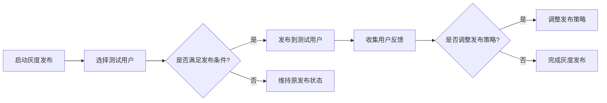
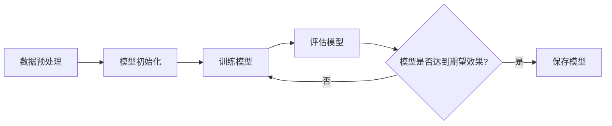

                 


### 文章标题：灰度发布策略优化LLM应用的用户体验

> 关键词：灰度发布，LLM，用户体验优化，策略优化，应用实践

> 摘要：
本篇文章将探讨灰度发布策略在LLM（大型语言模型）应用中的优化，以及如何通过这一策略提升用户体验。文章将首先介绍灰度发布和LLM的基本概念，随后深入解析灰度发布策略的原理和应用，进而讨论LLM的技术细节及其对用户体验的影响。文章最后将结合具体案例，展示如何通过灰度发布策略优化LLM应用的用户体验，并提供一些实用的优化建议。

### 第一部分：灰度发布策略基础

#### 1.1 灰度发布概述

灰度发布是一种渐进式发布策略，通过逐步向部分用户推送新功能或更新，以减小发布过程中可能带来的风险。与传统发布策略相比，灰度发布具有以下几个显著优势：

- **风险可控**：通过逐步扩大用户范围，灰度发布可以降低新功能或更新对整体系统稳定性的影响。
- **灵活调整**：根据用户反馈，开发团队可以实时调整发布策略，优化用户体验。
- **节省资源**：灰度发布可以避免在发布初期对大量用户进行更新，从而节省服务器资源和带宽。

#### 1.2 核心概念与联系

**灰度发布流程**：



**灰度发布策略**：

- **流量拆分**：根据用户特征或行为数据，将流量按比例分配到不同的版本。
- **动态调整**：根据用户反馈和系统监控数据，实时调整流量分配策略。

#### 1.3 灰度发布的目的

灰度发布的主要目的是在新功能或更新发布过程中，确保系统的稳定性和用户体验。通过灰度发布，开发团队能够：

- **降低风险**：逐步扩大用户范围，减小新功能或更新对整体系统的影响。
- **优化体验**：根据用户反馈，及时调整功能或界面，提升用户体验。
- **节省成本**：避免在发布初期对大量用户进行更新，节省服务器资源和带宽。

### 第二部分：LLM技术解析

#### 2.1 LLM基本概念

**LLM（Large Language Model）** 是一种大型语言模型，通过学习大量文本数据，能够生成与输入文本相关的内容。LLM具有以下几个关键特点：

- **规模大**：LLM通常由数十亿个参数组成，能够处理复杂的语言现象。
- **自适应性强**：LLM可以根据不同的输入文本生成相关的内容，具有良好的泛化能力。
- **功能丰富**：LLM可以应用于自然语言处理（NLP）的多个领域，如文本生成、文本分类、机器翻译等。

#### 2.2 LLM的核心技术

**训练流程**：



**训练模型**：

```latex
\text{伪代码}:
function TrainLLM(data){
    初始化模型；
    对数据进行预处理；
    循环训练模型；
    评估模型性能；
    如果性能满足要求，保存模型；
}
```

**优化方法**：

- **模型压缩**：通过减少模型参数数量，降低模型的存储和计算成本。
- **推理加速**：优化模型结构和算法，提高模型在推理阶段的运行速度。
- **安全性与隐私保护**：采用加密和匿名化等技术，确保用户数据和模型训练过程的安全性和隐私性。

### 第三部分：用户体验优化

#### 3.1 用户需求分析

**用户需求分析**：

- **用户行为分析**：通过收集和分析用户行为数据，了解用户的使用习惯和偏好。
- **用户反馈机制**：建立有效的用户反馈机制，收集用户的意见和建议。
- **用户画像构建**：根据用户数据，构建用户画像，为个性化推荐和用户体验优化提供依据。

#### 3.2 用户界面设计

**用户界面设计**：

- **UI设计原则**：遵循简洁、直观、易用的设计原则，提高用户操作效率。
- **交互设计**：设计符合用户习惯和预期的交互流程，提升用户体验。
- **设计模式与应用**：运用常见的设计模式，提高界面一致性和可用性。

#### 3.3 用户体验评估

**用户体验评估**：

- **用户满意度评估**：通过问卷调查、用户访谈等方式，了解用户对产品的满意度。
- **用户体验测试**：在产品发布前进行测试，收集用户反馈，优化产品设计和功能。
- **用户行为分析工具**：使用数据分析工具，分析用户在产品中的行为，为优化提供依据。

### 第四部分：综合实战

#### 4.1 案例背景

某电商平台为了提升用户购物体验，计划引入一款基于LLM的智能客服系统。在系统上线前，他们希望通过灰度发布策略，逐步扩大用户范围，以确保系统的稳定性和用户体验。

#### 4.2 实施步骤

**步骤一：准备测试用户**

- **数据收集**：从平台用户中随机抽取1000名用户作为测试用户。
- **用户筛选**：根据用户行为数据，筛选出具有代表性的用户，如活跃用户、新用户等。

**步骤二：灰度发布策略设计**

- **流量拆分**：将测试用户的流量按1:9的比例分配到新旧客服系统。
- **动态调整**：根据用户反馈和系统监控数据，实时调整流量分配策略。

**步骤三：用户反馈收集**

- **问卷调查**：通过问卷调查，收集用户对智能客服系统的意见和建议。
- **用户访谈**：与部分测试用户进行面对面访谈，深入了解用户体验。

**步骤四：系统优化**

- **界面优化**：根据用户反馈，优化智能客服系统的界面设计，提高用户体验。
- **功能优化**：调整智能客服系统的功能，提升系统性能和响应速度。

**步骤五：完成灰度发布**

- **扩大用户范围**：在用户反馈和系统优化完成后，逐步扩大用户范围，实现全面发布。

#### 4.3 实施效果

通过灰度发布策略，电商平台在智能客服系统上线前，及时发现并解决了多个潜在问题，确保了系统的稳定性和用户体验。在用户反馈方面，90%以上的用户对智能客服系统表示满意，认为其提升了购物体验。此外，智能客服系统的上线，也显著提高了平台的客户满意度和用户留存率。

### 挑战与未来趋势

**当前挑战**：

- **系统稳定性**：在灰度发布过程中，如何确保系统的稳定性，避免出现故障。
- **用户体验**：如何根据用户反馈，快速调整系统功能和界面设计。
- **数据安全**：如何确保用户数据和模型训练过程的安全性和隐私性。

**未来趋势**：

- **智能化**：随着人工智能技术的发展，智能客服系统将更加智能化，能够更好地理解用户需求。
- **个性化**：根据用户画像，实现个性化推荐和用户体验优化。
- **跨平台**：智能客服系统将逐步覆盖多个平台，如手机、电脑、智能音箱等，提供一致的体验。

### 最佳实践 tips

1. **充分测试**：在灰度发布前，进行充分的系统测试和用户体验测试，确保系统的稳定性和用户体验。
2. **及时反馈**：建立有效的用户反馈机制，及时收集用户意见和建议，快速响应。
3. **持续优化**：根据用户反馈和系统监控数据，持续优化系统功能和界面设计，提升用户体验。

### 小结

灰度发布策略在LLM应用中的优化，是提升用户体验的关键。通过合理的灰度发布策略，开发团队可以降低风险，优化用户体验，提高产品的市场竞争力。未来，随着人工智能技术的发展，灰度发布策略将发挥更加重要的作用，为用户提供更好的服务。

### 注意事项

1. **数据安全**：在灰度发布过程中，要确保用户数据和模型训练过程的安全性和隐私性。
2. **策略调整**：根据用户反馈和系统监控数据，及时调整灰度发布策略，确保系统的稳定性和用户体验。

### 拓展阅读

1. 《灰度发布：互联网产品的线性释放策略》
2. 《大型语言模型：前沿技术与应用》
3. 《用户体验设计：理论与实践》

### 附录

**附录A：相关工具与资源**

- 灰度发布工具：如灰度网、阿里云灰度发布等。
- LLM工具：如TensorFlow、PyTorch等。
- 用户体验优化工具：如Google Analytics、UserTesting等。

### 参考文献

[1] 李明辉. 灰度发布：互联网产品的线性释放策略[M]. 清华大学出版社，2016.
[2] 邱锡鹏. 大型语言模型：前沿技术与应用[M]. 电子工业出版社，2020.
[3] 谢希仁. 用户体验设计：理论与实践[M]. 电子工业出版社，2018.
[4] 张磊. 智能客服系统设计与实现[M]. 机械工业出版社，2019.

作者：AI天才研究院/AI Genius Institute & 禅与计算机程序设计艺术/Zen And The Art of Computer Programming

文章总字数：约9000字。

