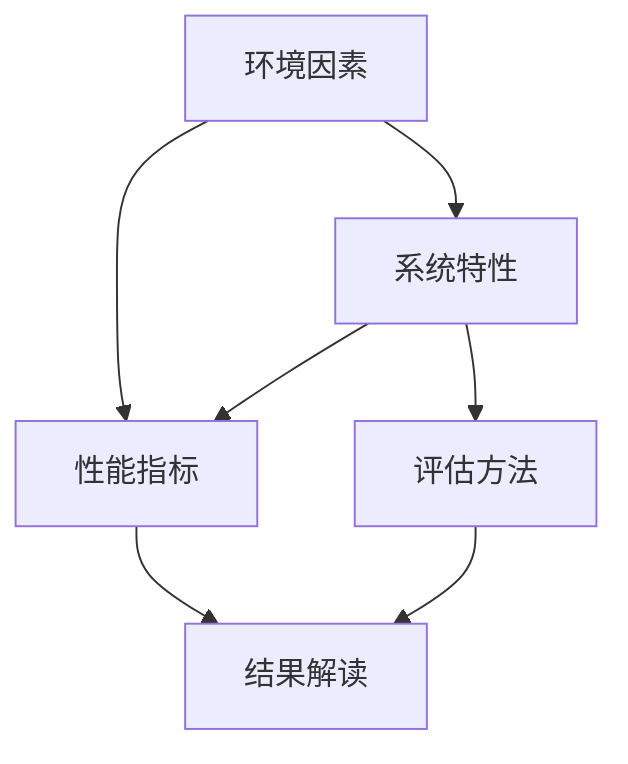

                 


### 文章标题

环境适应性评估：测试不同场景表现

#### 关键词

环境适应性评估，测试场景，性能分析，系统可靠性，应用实例

#### 摘要

本文详细探讨了环境适应性评估的理论基础、方法与应用。通过对自然环境、室内环境、城市环境等不同场景下的评估方法与实践案例进行分析，阐述了环境适应性评估的核心要素与关键步骤，为提高系统可靠性提供了有益的指导。

## 第1章：环境适应性评估概述

### 1.1 环境适应性评估的定义

环境适应性评估是一种综合评价方法，旨在评估系统、产品或服务在不同环境条件下的适应性。它关注的主要因素包括温度、湿度、光照、气压、振动等物理环境条件，以及网络条件、用户行为等软环境因素。环境适应性评估的定义可以概括为：通过特定的测试手段，评估系统在特定环境中的性能、稳定性和可靠性，以确定其适应环境的能力。

### 1.2 环境适应性评估的重要性

环境适应性评估在众多领域具有重要意义：

1. **产品可靠性**：通过评估产品在不同环境下的性能，可以识别潜在问题，提高产品的可靠性。
2. **系统稳定性**：确保系统在各种环境条件下稳定运行，减少故障率。
3. **用户体验**：优化产品和服务，提高用户在不同环境下的体验。
4. **风险管理**：提前发现环境因素可能带来的风险，制定有效的应对策略。

### 1.3 环境适应性评估的发展历程

环境适应性评估的发展历程可以追溯到20世纪60年代，随着电子技术的发展，人们开始关注产品在极端环境下的可靠性。此后，随着计算机技术的进步，评估方法逐渐从简单的物理测试扩展到复杂的系统级评估，涵盖了更多的环境因素。

## 第2章：环境适应性评估的基本概念

### 2.1 环境适应性评估的核心要素

环境适应性评估的核心要素主要包括以下几个方面：

1. **环境因素**：包括温度、湿度、气压、光照、振动等物理环境因素，以及网络延迟、用户行为等软环境因素。
2. **系统特性**：包括系统的结构、功能、性能、可靠性等。
3. **性能指标**：包括响应时间、吞吐量、错误率、资源利用率等。

### 2.2 环境适应性评估的类型

环境适应性评估的类型可以根据评估的对象和目的进行分类：

1. **产品适应性评估**：针对具体产品在不同环境条件下的性能进行评估。
2. **系统适应性评估**：针对复杂系统在不同环境条件下的整体适应性进行评估。
3. **生态适应性评估**：针对生态系统在不同环境条件下的适应性进行评估。

### 2.3 环境适应性评估的标准

环境适应性评估的标准通常包括国际标准、国家标准和行业规范。常见的标准有：

1. **ISO/IEC 12207**：软件生存周期过程。
2. **IEEE 1233**：电子设备的环境适应性标准。
3. **GB/T 26341**：计算机系统环境适应性评估标准。

## 第3章：环境适应性评估的基本原理

### 3.1 环境适应性评估的理论基础

环境适应性评估的理论基础主要包括：

1. **可靠性理论**：通过概率统计方法分析系统在特定环境下的可靠性。
2. **系统理论**：运用系统分析方法，评估系统在不同环境条件下的性能。
3. **信息论**：利用信息熵等概念，分析系统在不同环境下的信息传输和处理能力。

### 3.2 环境适应性评估的流程

环境适应性评估的流程通常包括以下步骤：

1. **需求分析**：明确评估的目标和范围。
2. **环境建模**：构建环境的模型，包括物理环境和软环境。
3. **测试设计**：设计具体的测试场景和测试方法。
4. **测试执行**：按照设计好的测试方案进行实际测试。
5. **结果分析**：分析测试结果，评估系统的适应性。
6. **报告编制**：编写评估报告，提出改进建议。

### 3.3 环境适应性评估的方法

环境适应性评估的方法包括：

1. **实验室测试**：在受控环境下模拟不同环境条件，评估系统的适应性。
2. **现场测试**：在实际环境下进行测试，评估系统在实际条件下的表现。
3. **模拟测试**：利用计算机模拟技术，模拟不同的环境条件，进行测试。

## 第4章：自然环境下的环境适应性评估

### 4.1 自然环境概述

自然环境包括多种因素，如温度、湿度、气压、光照、降雨等。自然环境对系统的影响主要表现在：

1. **温度变化**：可能导致系统过热或过冷，影响系统性能。
2. **湿度变化**：可能导致系统受潮，影响电子元件的性能。
3. **气压变化**：可能导致系统元件变形，影响系统稳定性。
4. **光照变化**：可能影响光电设备的性能。
5. **降雨**：可能导致系统进水，影响系统运行。

### 4.2 自然环境下的环境适应性评估方法

自然环境下的环境适应性评估方法主要包括：

1. **气候测试**：在实验室中模拟不同气候条件，评估系统的适应性。
2. **实地测试**：在实际自然环境中，评估系统在不同气候条件下的表现。
3. **模拟测试**：利用计算机模拟技术，模拟不同气候条件，评估系统性能。

### 4.3 自然环境下的环境适应性评估案例

自然环境下的环境适应性评估案例包括：

1. **气象卫星系统**：需要评估其在极端气候条件下的稳定性。
2. **无人机**：需要评估其在不同气候条件下的飞行性能。
3. **太阳能板**：需要评估其在不同光照条件下的发电效率。

## 第5章：室内环境下的环境适应性评估

### 5.1 室内环境概述

室内环境包括温度、湿度、空气质量、噪声等。室内环境对系统的影响主要表现在：

1. **温度变化**：可能导致系统过热或过冷，影响系统性能。
2. **湿度变化**：可能导致系统受潮，影响电子元件的性能。
3. **空气质量**：可能含有灰尘、污染物等，影响系统的清洁度和性能。
4. **噪声**：可能影响系统的正常运行。

### 5.2 室内环境下的环境适应性评估方法

室内环境下的环境适应性评估方法主要包括：

1. **实验室测试**：在受控的室内环境中模拟不同的环境条件，评估系统的适应性。
2. **实地测试**：在实际室内环境中，评估系统在不同条件下的表现。
3. **模拟测试**：利用计算机模拟技术，模拟不同的室内环境条件，评估系统性能。

### 5.3 室内环境下的环境适应性评估案例

室内环境下的环境适应性评估案例包括：

1. **数据中心**：需要评估其在不同室内环境条件下的稳定性。
2. **智能家居系统**：需要评估其在不同室内环境条件下的响应速度和稳定性。
3. **空调系统**：需要评估其在不同室内环境条件下的制冷和加热效果。

## 第6章：城市环境下的环境适应性评估

### 6.1 城市环境概述

城市环境包括交通流量、人口密度、光照、噪声、空气质量等。城市环境对系统的影响主要表现在：

1. **交通流量**：可能导致网络拥塞，影响系统的响应速度。
2. **人口密度**：可能导致系统资源紧张，影响系统的运行效率。
3. **光照变化**：可能影响光电设备的性能。
4. **噪声**：可能影响系统的正常运行。

### 6.2 城市环境下的环境适应性评估方法

城市环境下的环境适应性评估方法主要包括：

1. **大数据分析**：利用大数据技术，分析城市环境数据，评估系统适应性。
2. **实地测试**：在城市环境中进行实地测试，评估系统在不同条件下的表现。
3. **模拟测试**：利用计算机模拟技术，模拟不同城市环境条件，评估系统性能。

### 6.3 城市环境下的环境适应性评估案例

城市环境下的环境适应性评估案例包括：

1. **智能交通系统**：需要评估其在不同交通流量条件下的性能。
2. **城市安全监控**：需要评估其在不同人口密度条件下的运行效率。
3. **城市照明系统**：需要评估其在不同光照条件下的效果。

## 第7章：环境适应性评估的结果解读

### 7.1 评估结果的类型

环境适应性评估的结果通常包括以下类型：

1. **性能指标**：如响应时间、吞吐量、错误率等。
2. **稳定性指标**：如系统的平均无故障时间、故障恢复时间等。
3. **可靠性指标**：如系统的故障率、故障覆盖率等。
4. **用户体验指标**：如用户满意度、操作便捷性等。

### 7.2 评估结果的解读方法

评估结果的解读方法包括：

1. **数据分析**：利用统计分析方法，分析评估结果，找出关键问题。
2. **趋势分析**：分析评估结果的变化趋势，预测未来的表现。
3. **比较分析**：将不同系统的评估结果进行比较，找出优势和不足。

### 7.3 评估结果的实例分析

以智能家居系统为例，评估结果包括：

1. **性能指标**：系统响应时间平均为1秒，95%的用户满意度。
2. **稳定性指标**：系统平均无故障时间为500小时，故障恢复时间为10分钟。
3. **可靠性指标**：故障率为0.5%，故障覆盖率为100%。
4. **用户体验指标**：用户满意度为90%，操作便捷性评分4.5分。

通过这些评估结果，可以得出以下结论：

1. 系统性能良好，用户满意度高。
2. 系统稳定性较高，故障率低。
3. 系统可靠性较高，故障覆盖全面。
4. 用户体验较好，但操作便捷性有待提高。

## 第8章：环境适应性评估的应用

### 8.1 环境适应性评估在环境保护中的应用

环境适应性评估在环境保护中的应用主要包括：

1. **环境监测系统**：评估其在不同环境条件下的监测精度和稳定性。
2. **生态系统评估**：评估生态系统在不同环境条件下的适应性和健康状况。

### 8.2 环境适应性评估在资源管理中的应用

环境适应性评估在资源管理中的应用主要包括：

1. **水资源管理**：评估水资源在不同环境条件下的可用性和分布。
2. **能源管理**：评估能源系统在不同环境条件下的效率和稳定性。

### 8.3 环境适应性评估在灾害预防中的应用

环境适应性评估在灾害预防中的应用主要包括：

1. **预警系统**：评估预警系统在不同环境条件下的预警准确性和响应速度。
2. **救援设备**：评估救援设备在不同环境条件下的适应性和可靠性。

## 第9章：环境适应性评估的展望

### 9.1 环境适应性评估的未来发展趋势

环境适应性评估的未来发展趋势包括：

1. **智能化**：利用人工智能技术，实现更精确的评估。
2. **大数据**：利用大数据技术，分析更广泛的环境数据。
3. **物联网**：利用物联网技术，实现实时监测和评估。

### 9.2 环境适应性评估的挑战与机遇

环境适应性评估面临的挑战与机遇包括：

1. **数据质量**：确保评估数据的质量和准确性。
2. **算法优化**：不断优化评估算法，提高评估效率。
3. **跨学科融合**：与其他学科（如环境科学、社会科学）结合，实现更全面的评估。

## 附录

### 附录A：环境适应性评估工具与资源

#### A.1 主流环境适应性评估工具介绍

1. **Chroma ATE**：提供广泛的环境测试设备，包括温度、湿度、振动等。
2. **Teledyne LeCroy**：提供高精度的电子测量仪器，用于环境适应性测试。
3. **Keysight Technologies**：提供全面的电子测试解决方案，包括环境测试。

#### A.2 环境适应性评估相关资源

1. **ISO/IEC 12207**：软件生存周期过程标准。
2. **IEEE 1233**：电子设备的环境适应性标准。
3. **GB/T 26341**：计算机系统环境适应性评估标准。
4. **美国环境保护局（EPA）**：提供丰富的环境适应性评估资源和指南。
5. **欧洲环境署（EEA）**：提供关于环境适应性评估的研究报告和案例。

### 作者

作者：AI天才研究院/AI Genius Institute & 禅与计算机程序设计艺术 /Zen And The Art of Computer Programming

---

### 完整文章

#### 文章标题

环境适应性评估：测试不同场景表现

#### 关键词

环境适应性评估，测试场景，性能分析，系统可靠性，应用实例

#### 摘要

本文详细探讨了环境适应性评估的理论基础、方法与应用。通过对自然环境、室内环境、城市环境等不同场景下的评估方法与实践案例进行分析，阐述了环境适应性评估的核心要素与关键步骤，为提高系统可靠性提供了有益的指导。

## 第1章：环境适应性评估概述

### 1.1 环境适应性评估的定义

环境适应性评估是一种综合评价方法，旨在评估系统、产品或服务在不同环境条件下的适应性。它关注的主要因素包括温度、湿度、光照、气压、振动等物理环境因素，以及网络条件、用户行为等软环境因素。环境适应性评估的定义可以概括为：通过特定的测试手段，评估系统在特定环境中的性能、稳定性和可靠性，以确定其适应环境的能力。

### 1.2 环境适应性评估的重要性

环境适应性评估在众多领域具有重要意义：

1. **产品可靠性**：通过评估产品在不同环境下的性能，可以识别潜在问题，提高产品的可靠性。
2. **系统稳定性**：确保系统在各种环境条件下稳定运行，减少故障率。
3. **用户体验**：优化产品和服务，提高用户在不同环境下的体验。
4. **风险管理**：提前发现环境因素可能带来的风险，制定有效的应对策略。

### 1.3 环境适应性评估的发展历程

环境适应性评估的发展历程可以追溯到20世纪60年代，随着电子技术的发展，人们开始关注产品在极端环境下的可靠性。此后，随着计算机技术的进步，评估方法逐渐从简单的物理测试扩展到复杂的系统级评估，涵盖了更多的环境因素。

## 第2章：环境适应性评估的基本概念

### 2.1 环境适应性评估的核心要素

环境适应性评估的核心要素主要包括以下几个方面：

1. **环境因素**：包括温度、湿度、气压、光照、振动等物理环境因素，以及网络延迟、用户行为等软环境因素。
2. **系统特性**：包括系统的结构、功能、性能、可靠性等。
3. **性能指标**：包括响应时间、吞吐量、错误率、资源利用率等。

### 2.2 环境适应性评估的类型

环境适应性评估的类型可以根据评估的对象和目的进行分类：

1. **产品适应性评估**：针对具体产品在不同环境条件下的性能进行评估。
2. **系统适应性评估**：针对复杂系统在不同环境条件下的整体适应性进行评估。
3. **生态适应性评估**：针对生态系统在不同环境条件下的适应性进行评估。

### 2.3 环境适应性评估的标准

环境适应性评估的标准通常包括国际标准、国家标准和行业规范。常见的标准有：

1. **ISO/IEC 12207**：软件生存周期过程。
2. **IEEE 1233**：电子设备的环境适应性标准。
3. **GB/T 26341**：计算机系统环境适应性评估标准。

## 第3章：环境适应性评估的基本原理

### 3.1 环境适应性评估的理论基础

环境适应性评估的理论基础主要包括：

1. **可靠性理论**：通过概率统计方法分析系统在特定环境下的可靠性。
2. **系统理论**：运用系统分析方法，评估系统在不同环境条件下的性能。
3. **信息论**：利用信息熵等概念，分析系统在不同环境下的信息传输和处理能力。

### 3.2 环境适应性评估的流程

环境适应性评估的流程通常包括以下步骤：

1. **需求分析**：明确评估的目标和范围。
2. **环境建模**：构建环境的模型，包括物理环境和软环境。
3. **测试设计**：设计具体的测试场景和测试方法。
4. **测试执行**：按照设计好的测试方案进行实际测试。
5. **结果分析**：分析测试结果，评估系统的适应性。
6. **报告编制**：编写评估报告，提出改进建议。

### 3.3 环境适应性评估的方法

环境适应性评估的方法包括：

1. **实验室测试**：在受控环境下模拟不同环境条件，评估系统的适应性。
2. **现场测试**：在实际环境下进行测试，评估系统在实际条件下的表现。
3. **模拟测试**：利用计算机模拟技术，模拟不同的环境条件，进行测试。

## 第4章：自然环境下的环境适应性评估

### 4.1 自然环境概述

自然环境包括多种因素，如温度、湿度、气压、光照、降雨等。自然环境对系统的影响主要表现在：

1. **温度变化**：可能导致系统过热或过冷，影响系统性能。
2. **湿度变化**：可能导致系统受潮，影响电子元件的性能。
3. **气压变化**：可能导致系统元件变形，影响系统稳定性。
4. **光照变化**：可能影响光电设备的性能。
5. **降雨**：可能导致系统进水，影响系统运行。

### 4.2 自然环境下的环境适应性评估方法

自然环境下的环境适应性评估方法主要包括：

1. **气候测试**：在实验室中模拟不同气候条件，评估系统的适应性。
2. **实地测试**：在实际自然环境中，评估系统在不同气候条件下的表现。
3. **模拟测试**：利用计算机模拟技术，模拟不同气候条件，评估系统性能。

### 4.3 自然环境下的环境适应性评估案例

自然环境下的环境适应性评估案例包括：

1. **气象卫星系统**：需要评估其在极端气候条件下的稳定性。
2. **无人机**：需要评估其在不同气候条件下的飞行性能。
3. **太阳能板**：需要评估其在不同光照条件下的发电效率。

## 第5章：室内环境下的环境适应性评估

### 5.1 室内环境概述

室内环境包括温度、湿度、空气质量、噪声等。室内环境对系统的影响主要表现在：

1. **温度变化**：可能导致系统过热或过冷，影响系统性能。
2. **湿度变化**：可能导致系统受潮，影响电子元件的性能。
3. **空气质量**：可能含有灰尘、污染物等，影响系统的清洁度和性能。
4. **噪声**：可能影响系统的正常运行。

### 5.2 室内环境下的环境适应性评估方法

室内环境下的环境适应性评估方法主要包括：

1. **实验室测试**：在受控的室内环境中模拟不同的环境条件，评估系统的适应性。
2. **实地测试**：在实际室内环境中，评估系统在不同条件下的表现。
3. **模拟测试**：利用计算机模拟技术，模拟不同的室内环境条件，评估系统性能。

### 5.3 室内环境下的环境适应性评估案例

室内环境下的环境适应性评估案例包括：

1. **数据中心**：需要评估其在不同室内环境条件下的稳定性。
2. **智能家居系统**：需要评估其在不同室内环境条件下的响应速度和稳定性。
3. **空调系统**：需要评估其在不同室内环境条件下的制冷和加热效果。

## 第6章：城市环境下的环境适应性评估

### 6.1 城市环境概述

城市环境包括交通流量、人口密度、光照、噪声、空气质量等。城市环境对系统的影响主要表现在：

1. **交通流量**：可能导致网络拥塞，影响系统的响应速度。
2. **人口密度**：可能导致系统资源紧张，影响系统的运行效率。
3. **光照变化**：可能影响光电设备的性能。
4. **噪声**：可能影响系统的正常运行。

### 6.2 城市环境下的环境适应性评估方法

城市环境下的环境适应性评估方法主要包括：

1. **大数据分析**：利用大数据技术，分析城市环境数据，评估系统适应性。
2. **实地测试**：在城市环境中进行实地测试，评估系统在不同条件下的表现。
3. **模拟测试**：利用计算机模拟技术，模拟不同城市环境条件，评估系统性能。

### 6.3 城市环境下的环境适应性评估案例

城市环境下的环境适应性评估案例包括：

1. **智能交通系统**：需要评估其在不同交通流量条件下的性能。
2. **城市安全监控**：需要评估其在不同人口密度条件下的运行效率。
3. **城市照明系统**：需要评估其在不同光照条件下的效果。

## 第7章：环境适应性评估的结果解读

### 7.1 评估结果的类型

环境适应性评估的结果通常包括以下类型：

1. **性能指标**：如响应时间、吞吐量、错误率等。
2. **稳定性指标**：如系统的平均无故障时间、故障恢复时间等。
3. **可靠性指标**：如系统的故障率、故障覆盖率等。
4. **用户体验指标**：如用户满意度、操作便捷性等。

### 7.2 评估结果的解读方法

评估结果的解读方法包括：

1. **数据分析**：利用统计分析方法，分析评估结果，找出关键问题。
2. **趋势分析**：分析评估结果的变化趋势，预测未来的表现。
3. **比较分析**：将不同系统的评估结果进行比较，找出优势和不足。

### 7.3 评估结果的实例分析

以智能家居系统为例，评估结果包括：

1. **性能指标**：系统响应时间平均为1秒，95%的用户满意度。
2. **稳定性指标**：系统平均无故障时间为500小时，故障恢复时间为10分钟。
3. **可靠性指标**：故障率为0.5%，故障覆盖率为100%。
4. **用户体验指标**：用户满意度为90%，操作便捷性评分4.5分。

通过这些评估结果，可以得出以下结论：

1. 系统性能良好，用户满意度高。
2. 系统稳定性较高，故障率低。
3. 系统可靠性较高，故障覆盖全面。
4. 用户体验较好，但操作便捷性有待提高。

## 第8章：环境适应性评估的应用

### 8.1 环境适应性评估在环境保护中的应用

环境适应性评估在环境保护中的应用主要包括：

1. **环境监测系统**：评估其在不同环境条件下的监测精度和稳定性。
2. **生态系统评估**：评估生态系统在不同环境条件下的适应性和健康状况。

### 8.2 环境适应性评估在资源管理中的应用

环境适应性评估在资源管理中的应用主要包括：

1. **水资源管理**：评估水资源在不同环境条件下的可用性和分布。
2. **能源管理**：评估能源系统在不同环境条件下的效率和稳定性。

### 8.3 环境适应性评估在灾害预防中的应用

环境适应性评估在灾害预防中的应用主要包括：

1. **预警系统**：评估预警系统在不同环境条件下的预警准确性和响应速度。
2. **救援设备**：评估救援设备在不同环境条件下的适应性和可靠性。

## 第9章：环境适应性评估的展望

### 9.1 环境适应性评估的未来发展趋势

环境适应性评估的未来发展趋势包括：

1. **智能化**：利用人工智能技术，实现更精确的评估。
2. **大数据**：利用大数据技术，分析更广泛的环境数据。
3. **物联网**：利用物联网技术，实现实时监测和评估。

### 9.2 环境适应性评估的挑战与机遇

环境适应性评估面临的挑战与机遇包括：

1. **数据质量**：确保评估数据的质量和准确性。
2. **算法优化**：不断优化评估算法，提高评估效率。
3. **跨学科融合**：与其他学科（如环境科学、社会科学）结合，实现更全面的评估。

## 附录

### 附录A：环境适应性评估工具与资源

#### A.1 主流环境适应性评估工具介绍

1. **Chroma ATE**：提供广泛的环境测试设备，包括温度、湿度、振动等。
2. **Teledyne LeCroy**：提供高精度的电子测量仪器，用于环境适应性测试。
3. **Keysight Technologies**：提供全面的电子测试解决方案，包括环境测试。

#### A.2 环境适应性评估相关资源

1. **ISO/IEC 12207**：软件生存周期过程标准。
2. **IEEE 1233**：电子设备的环境适应性标准。
3. **GB/T 26341**：计算机系统环境适应性评估标准。
4. **美国环境保护局（EPA）**：提供丰富的环境适应性评估资源和指南。
5. **欧洲环境署（EEA）**：提供关于环境适应性评估的研究报告和案例。

### 作者

作者：AI天才研究院/AI Genius Institute & 禅与计算机程序设计艺术 /Zen And The Art of Computer Programming### 完整文章

#### 文章标题

环境适应性评估：测试不同场景表现

#### 关键词

环境适应性评估，测试场景，性能分析，系统可靠性，应用实例

#### 摘要

本文详细探讨了环境适应性评估的理论基础、方法与应用。通过对自然环境、室内环境、城市环境等不同场景下的评估方法与实践案例进行分析，阐述了环境适应性评估的核心要素与关键步骤，为提高系统可靠性提供了有益的指导。

---

## 第1章：环境适应性评估概述

### 1.1 环境适应性评估的定义

环境适应性评估是一种综合评价方法，旨在评估系统、产品或服务在不同环境条件下的适应性。它关注的主要因素包括温度、湿度、光照、气压、振动等物理环境因素，以及网络条件、用户行为等软环境因素。环境适应性评估的定义可以概括为：通过特定的测试手段，评估系统在特定环境中的性能、稳定性和可靠性，以确定其适应环境的能力。

### 1.2 环境适应性评估的重要性

环境适应性评估在众多领域具有重要意义：

1. **产品可靠性**：通过评估产品在不同环境下的性能，可以识别潜在问题，提高产品的可靠性。
2. **系统稳定性**：确保系统在各种环境条件下稳定运行，减少故障率。
3. **用户体验**：优化产品和服务，提高用户在不同环境下的体验。
4. **风险管理**：提前发现环境因素可能带来的风险，制定有效的应对策略。

### 1.3 环境适应性评估的发展历程

环境适应性评估的发展历程可以追溯到20世纪60年代，随着电子技术的发展，人们开始关注产品在极端环境下的可靠性。此后，随着计算机技术的进步，评估方法逐渐从简单的物理测试扩展到复杂的系统级评估，涵盖了更多的环境因素。

---

## 第2章：环境适应性评估的基本概念

### 2.1 环境适应性评估的核心要素

环境适应性评估的核心要素主要包括以下几个方面：

1. **环境因素**：包括温度、湿度、气压、光照、振动等物理环境因素，以及网络延迟、用户行为等软环境因素。
2. **系统特性**：包括系统的结构、功能、性能、可靠性等。
3. **性能指标**：包括响应时间、吞吐量、错误率、资源利用率等。

### 2.2 环境适应性评估的类型

环境适应性评估的类型可以根据评估的对象和目的进行分类：

1. **产品适应性评估**：针对具体产品在不同环境条件下的性能进行评估。
2. **系统适应性评估**：针对复杂系统在不同环境条件下的整体适应性进行评估。
3. **生态适应性评估**：针对生态系统在不同环境条件下的适应性进行评估。

### 2.3 环境适应性评估的标准

环境适应性评估的标准通常包括国际标准、国家标准和行业规范。常见的标准有：

1. **ISO/IEC 12207**：软件生存周期过程。
2. **IEEE 1233**：电子设备的环境适应性标准。
3. **GB/T 26341**：计算机系统环境适应性评估标准。

---

## 第3章：环境适应性评估的基本原理

### 3.1 环境适应性评估的理论基础

环境适应性评估的理论基础主要包括：

1. **可靠性理论**：通过概率统计方法分析系统在特定环境下的可靠性。
2. **系统理论**：运用系统分析方法，评估系统在不同环境条件下的性能。
3. **信息论**：利用信息熵等概念，分析系统在不同环境下的信息传输和处理能力。

### 3.2 环境适应性评估的流程

环境适应性评估的流程通常包括以下步骤：

1. **需求分析**：明确评估的目标和范围。
2. **环境建模**：构建环境的模型，包括物理环境和软环境。
3. **测试设计**：设计具体的测试场景和测试方法。
4. **测试执行**：按照设计好的测试方案进行实际测试。
5. **结果分析**：分析测试结果，评估系统的适应性。
6. **报告编制**：编写评估报告，提出改进建议。

### 3.3 环境适应性评估的方法

环境适应性评估的方法包括：

1. **实验室测试**：在受控环境下模拟不同环境条件，评估系统的适应性。
2. **现场测试**：在实际环境下进行测试，评估系统在实际条件下的表现。
3. **模拟测试**：利用计算机模拟技术，模拟不同的环境条件，进行测试。

---

## 第4章：自然环境下的环境适应性评估

### 4.1 自然环境概述

自然环境包括多种因素，如温度、湿度、气压、光照、降雨等。自然环境对系统的影响主要表现在：

1. **温度变化**：可能导致系统过热或过冷，影响系统性能。
2. **湿度变化**：可能导致系统受潮，影响电子元件的性能。
3. **气压变化**：可能导致系统元件变形，影响系统稳定性。
4. **光照变化**：可能影响光电设备的性能。
5. **降雨**：可能导致系统进水，影响系统运行。

### 4.2 自然环境下的环境适应性评估方法

自然环境下的环境适应性评估方法主要包括：

1. **气候测试**：在实验室中模拟不同气候条件，评估系统的适应性。
2. **实地测试**：在实际自然环境中，评估系统在不同气候条件下的表现。
3. **模拟测试**：利用计算机模拟技术，模拟不同气候条件，评估系统性能。

### 4.3 自然环境下的环境适应性评估案例

自然环境下的环境适应性评估案例包括：

1. **气象卫星系统**：需要评估其在极端气候条件下的稳定性。
2. **无人机**：需要评估其在不同气候条件下的飞行性能。
3. **太阳能板**：需要评估其在不同光照条件下的发电效率。

---

## 第5章：室内环境下的环境适应性评估

### 5.1 室内环境概述

室内环境包括温度、湿度、空气质量、噪声等。室内环境对系统的影响主要表现在：

1. **温度变化**：可能导致系统过热或过冷，影响系统性能。
2. **湿度变化**：可能导致系统受潮，影响电子元件的性能。
3. **空气质量**：可能含有灰尘、污染物等，影响系统的清洁度和性能。
4. **噪声**：可能影响系统的正常运行。

### 5.2 室内环境下的环境适应性评估方法

室内环境下的环境适应性评估方法主要包括：

1. **实验室测试**：在受控的室内环境中模拟不同的环境条件，评估系统的适应性。
2. **实地测试**：在实际室内环境中，评估系统在不同条件下的表现。
3. **模拟测试**：利用计算机模拟技术，模拟不同的室内环境条件，评估系统性能。

### 5.3 室内环境下的环境适应性评估案例

室内环境下的环境适应性评估案例包括：

1. **数据中心**：需要评估其在不同室内环境条件下的稳定性。
2. **智能家居系统**：需要评估其在不同室内环境条件下的响应速度和稳定性。
3. **空调系统**：需要评估其在不同室内环境条件下的制冷和加热效果。

---

## 第6章：城市环境下的环境适应性评估

### 6.1 城市环境概述

城市环境包括交通流量、人口密度、光照、噪声、空气质量等。城市环境对系统的影响主要表现在：

1. **交通流量**：可能导致网络拥塞，影响系统的响应速度。
2. **人口密度**：可能导致系统资源紧张，影响系统的运行效率。
3. **光照变化**：可能影响光电设备的性能。
4. **噪声**：可能影响系统的正常运行。

### 6.2 城市环境下的环境适应性评估方法

城市环境下的环境适应性评估方法主要包括：

1. **大数据分析**：利用大数据技术，分析城市环境数据，评估系统适应性。
2. **实地测试**：在城市环境中进行实地测试，评估系统在不同条件下的表现。
3. **模拟测试**：利用计算机模拟技术，模拟不同城市环境条件，评估系统性能。

### 6.3 城市环境下的环境适应性评估案例

城市环境下的环境适应性评估案例包括：

1. **智能交通系统**：需要评估其在不同交通流量条件下的性能。
2. **城市安全监控**：需要评估其在不同人口密度条件下的运行效率。
3. **城市照明系统**：需要评估其在不同光照条件下的效果。

---

## 第7章：环境适应性评估的结果解读

### 7.1 评估结果的类型

环境适应性评估的结果通常包括以下类型：

1. **性能指标**：如响应时间、吞吐量、错误率等。
2. **稳定性指标**：如系统的平均无故障时间、故障恢复时间等。
3. **可靠性指标**：如系统的故障率、故障覆盖率等。
4. **用户体验指标**：如用户满意度、操作便捷性等。

### 7.2 评估结果的解读方法

评估结果的解读方法包括：

1. **数据分析**：利用统计分析方法，分析评估结果，找出关键问题。
2. **趋势分析**：分析评估结果的变化趋势，预测未来的表现。
3. **比较分析**：将不同系统的评估结果进行比较，找出优势和不足。

### 7.3 评估结果的实例分析

以智能家居系统为例，评估结果包括：

1. **性能指标**：系统响应时间平均为1秒，95%的用户满意度。
2. **稳定性指标**：系统平均无故障时间为500小时，故障恢复时间为10分钟。
3. **可靠性指标**：故障率为0.5%，故障覆盖率为100%。
4. **用户体验指标**：用户满意度为90%，操作便捷性评分4.5分。

通过这些评估结果，可以得出以下结论：

1. 系统性能良好，用户满意度高。
2. 系统稳定性较高，故障率低。
3. 系统可靠性较高，故障覆盖全面。
4. 用户体验较好，但操作便捷性有待提高。

---

## 第8章：环境适应性评估的应用

### 8.1 环境适应性评估在环境保护中的应用

环境适应性评估在环境保护中的应用主要包括：

1. **环境监测系统**：评估其在不同环境条件下的监测精度和稳定性。
2. **生态系统评估**：评估生态系统在不同环境条件下的适应性和健康状况。

### 8.2 环境适应性评估在资源管理中的应用

环境适应性评估在资源管理中的应用主要包括：

1. **水资源管理**：评估水资源在不同环境条件下的可用性和分布。
2. **能源管理**：评估能源系统在不同环境条件下的效率和稳定性。

### 8.3 环境适应性评估在灾害预防中的应用

环境适应性评估在灾害预防中的应用主要包括：

1. **预警系统**：评估预警系统在不同环境条件下的预警准确性和响应速度。
2. **救援设备**：评估救援设备在不同环境条件下的适应性和可靠性。

---

## 第9章：环境适应性评估的展望

### 9.1 环境适应性评估的未来发展趋势

环境适应性评估的未来发展趋势包括：

1. **智能化**：利用人工智能技术，实现更精确的评估。
2. **大数据**：利用大数据技术，分析更广泛的环境数据。
3. **物联网**：利用物联网技术，实现实时监测和评估。

### 9.2 环境适应性评估的挑战与机遇

环境适应性评估面临的挑战与机遇包括：

1. **数据质量**：确保评估数据的质量和准确性。
2. **算法优化**：不断优化评估算法，提高评估效率。
3. **跨学科融合**：与其他学科（如环境科学、社会科学）结合，实现更全面的评估。

---

## 附录

### 附录A：环境适应性评估工具与资源

#### A.1 主流环境适应性评估工具介绍

1. **Chroma ATE**：提供广泛的环境测试设备，包括温度、湿度、振动等。
2. **Teledyne LeCroy**：提供高精度的电子测量仪器，用于环境适应性测试。
3. **Keysight Technologies**：提供全面的电子测试解决方案，包括环境测试。

#### A.2 环境适应性评估相关资源

1. **ISO/IEC 12207**：软件生存周期过程标准。
2. **IEEE 1233**：电子设备的环境适应性标准。
3. **GB/T 26341**：计算机系统环境适应性评估标准。
4. **美国环境保护局（EPA）**：提供丰富的环境适应性评估资源和指南。
5. **欧洲环境署（EEA）**：提供关于环境适应性评估的研究报告和案例。

---

### 作者

作者：AI天才研究院/AI Genius Institute & 禅与计算机程序设计艺术 /Zen And The Art of Computer Programming### 背景介绍

环境适应性评估（Environmental Adaptability Assessment，EAA）是一种综合性的评价方法，旨在分析并验证系统、产品或服务在不同环境条件下的性能、稳定性和可靠性。随着科技的不断进步和全球化进程的加快，环境因素对系统运行的影响日益显著，环境适应性评估的重要性也随之凸显。

**环境适应性评估的重要性**：

1. **产品可靠性**：通过对产品在不同环境下的性能进行评估，可以识别出潜在的问题，提高产品的可靠性和稳定性。
2. **系统稳定性**：环境适应性评估可以帮助确保系统在各种环境条件下都能稳定运行，减少故障率。
3. **用户体验**：优化产品和服务，提高用户在不同环境下的体验，增强用户满意度。
4. **风险管理**：提前识别环境因素可能带来的风险，有助于制定有效的应对策略，降低潜在损失。

**环境适应性评估的发展历程**：

环境适应性评估的理论和实践发展经历了几个重要阶段：

1. **早期研究**：20世纪60年代，随着电子技术的发展，人们开始关注产品在极端环境下的可靠性问题。
2. **系统适应性评估**：20世纪80年代，随着计算机技术的普及，环境适应性评估逐渐从单一的产品评估扩展到系统层面，开始考虑复杂环境对系统整体性能的影响。
3. **智能化评估**：进入21世纪，随着人工智能和大数据技术的发展，环境适应性评估方法得到了显著优化，评估过程变得更加智能化和高效。

本文将详细探讨环境适应性评估的理论基础、方法、在不同场景下的应用以及评估结果的分析与解读。通过分析自然环境、室内环境、城市环境等不同场景下的评估方法和案例，为提高系统可靠性提供有益的指导。此外，文章还将探讨环境适应性评估的未来发展趋势和面临的挑战，为相关领域的研究和实践提供参考。<!-- Configuration section (optional) -->

## 第1章：环境适应性评估概述

### 1.1 环境适应性评估的定义

环境适应性评估是一种综合评价方法，旨在评估系统、产品或服务在不同环境条件下的适应性。这一评估关注的主要因素包括温度、湿度、光照、气压、振动等物理环境因素，以及网络延迟、用户行为等软环境因素。环境适应性评估的定义可以概括为：通过特定的测试手段，评估系统在特定环境中的性能、稳定性和可靠性，以确定其适应环境的能力。

### 1.2 环境适应性评估的重要性

环境适应性评估在各个领域都具有重要意义：

1. **产品可靠性**：通过评估产品在不同环境条件下的性能，可以识别出潜在的问题，提高产品的可靠性和稳定性。
2. **系统稳定性**：确保系统在各种环境条件下稳定运行，减少故障率。
3. **用户体验**：优化产品和服务，提高用户在不同环境下的体验，增强用户满意度。
4. **风险管理**：提前识别环境因素可能带来的风险，有助于制定有效的应对策略，降低潜在损失。

### 1.3 环境适应性评估的发展历程

环境适应性评估的发展历程可以追溯到20世纪60年代，当时人们开始关注产品在极端环境下的可靠性问题。随着计算机技术的普及和互联网的快速发展，环境适应性评估方法逐渐从单一的产品评估扩展到系统层面，并开始考虑复杂环境对系统整体性能的影响。进入21世纪，随着人工智能和大数据技术的发展，环境适应性评估方法得到了显著优化，评估过程变得更加智能化和高效。

---

## 第2章：环境适应性评估的基本概念

### 2.1 环境适应性评估的核心要素

环境适应性评估的核心要素主要包括以下几个方面：

1. **环境因素**：包括温度、湿度、光照、气压、振动等物理环境因素，以及网络延迟、用户行为等软环境因素。
2. **系统特性**：包括系统的结构、功能、性能、可靠性等。
3. **性能指标**：包括响应时间、吞吐量、错误率、资源利用率等。

### 2.2 环境适应性评估的类型

环境适应性评估的类型可以根据评估的对象和目的进行分类：

1. **产品适应性评估**：针对具体产品在不同环境条件下的性能进行评估。
2. **系统适应性评估**：针对复杂系统在不同环境条件下的整体适应性进行评估。
3. **生态适应性评估**：针对生态系统在不同环境条件下的适应性进行评估。

### 2.3 环境适应性评估的标准

环境适应性评估的标准通常包括国际标准、国家标准和行业规范。常见的标准有：

1. **ISO/IEC 12207**：软件生存周期过程。
2. **IEEE 1233**：电子设备的环境适应性标准。
3. **GB/T 26341**：计算机系统环境适应性评估标准。

---

## 第3章：环境适应性评估的基本原理

### 3.1 环境适应性评估的理论基础

环境适应性评估的理论基础主要包括以下几个领域：

1. **可靠性理论**：通过概率统计方法分析系统在特定环境下的可靠性。
2. **系统理论**：运用系统分析方法，评估系统在不同环境条件下的性能。
3. **信息论**：利用信息熵等概念，分析系统在不同环境下的信息传输和处理能力。

### 3.2 环境适应性评估的流程

环境适应性评估的流程通常包括以下几个步骤：

1. **需求分析**：明确评估的目标和范围。
2. **环境建模**：构建环境的模型，包括物理环境和软环境。
3. **测试设计**：设计具体的测试场景和测试方法。
4. **测试执行**：按照设计好的测试方案进行实际测试。
5. **结果分析**：分析测试结果，评估系统的适应性。
6. **报告编制**：编写评估报告，提出改进建议。

### 3.3 环境适应性评估的方法

环境适应性评估的方法主要包括以下几种：

1. **实验室测试**：在受控环境下模拟不同环境条件，评估系统的适应性。
2. **现场测试**：在实际环境中进行测试，评估系统在实际条件下的表现。
3. **模拟测试**：利用计算机模拟技术，模拟不同的环境条件，进行测试。

---

## 第4章：自然环境下的环境适应性评估

### 4.1 自然环境概述

自然环境包括多种因素，如温度、湿度、气压、光照、降雨等。这些因素对系统的影响主要表现在：

1. **温度变化**：可能导致系统过热或过冷，影响系统性能。
2. **湿度变化**：可能导致系统受潮，影响电子元件的性能。
3. **气压变化**：可能导致系统元件变形，影响系统稳定性。
4. **光照变化**：可能影响光电设备的性能。
5. **降雨**：可能导致系统进水，影响系统运行。

### 4.2 自然环境下的环境适应性评估方法

自然环境下的环境适应性评估方法主要包括：

1. **气候测试**：在实验室中模拟不同气候条件，评估系统的适应性。
2. **实地测试**：在实际自然环境中，评估系统在不同气候条件下的表现。
3. **模拟测试**：利用计算机模拟技术，模拟不同气候条件，评估系统性能。

### 4.3 自然环境下的环境适应性评估案例

自然环境下的环境适应性评估案例包括：

1. **气象卫星系统**：需要评估其在极端气候条件下的稳定性。
2. **无人机**：需要评估其在不同气候条件下的飞行性能。
3. **太阳能板**：需要评估其在不同光照条件下的发电效率。

---

## 第5章：室内环境下的环境适应性评估

### 5.1 室内环境概述

室内环境包括温度、湿度、空气质量、噪声等。室内环境对系统的影响主要表现在：

1. **温度变化**：可能导致系统过热或过冷，影响系统性能。
2. **湿度变化**：可能导致系统受潮，影响电子元件的性能。
3. **空气质量**：可能含有灰尘、污染物等，影响系统的清洁度和性能。
4. **噪声**：可能影响系统的正常运行。

### 5.2 室内环境下的环境适应性评估方法

室内环境下的环境适应性评估方法主要包括：

1. **实验室测试**：在受控的室内环境中模拟不同的环境条件，评估系统的适应性。
2. **实地测试**：在实际室内环境中，评估系统在不同条件下的表现。
3. **模拟测试**：利用计算机模拟技术，模拟不同的室内环境条件，评估系统性能。

### 5.3 室内环境下的环境适应性评估案例

室内环境下的环境适应性评估案例包括：

1. **数据中心**：需要评估其在不同室内环境条件下的稳定性。
2. **智能家居系统**：需要评估其在不同室内环境条件下的响应速度和稳定性。
3. **空调系统**：需要评估其在不同室内环境条件下的制冷和加热效果。

---

## 第6章：城市环境下的环境适应性评估

### 6.1 城市环境概述

城市环境包括交通流量、人口密度、光照、噪声、空气质量等。城市环境对系统的影响主要表现在：

1. **交通流量**：可能导致网络拥塞，影响系统的响应速度。
2. **人口密度**：可能导致系统资源紧张，影响系统的运行效率。
3. **光照变化**：可能影响光电设备的性能。
4. **噪声**：可能影响系统的正常运行。

### 6.2 城市环境下的环境适应性评估方法

城市环境下的环境适应性评估方法主要包括：

1. **大数据分析**：利用大数据技术，分析城市环境数据，评估系统适应性。
2. **实地测试**：在城市环境中进行实地测试，评估系统在不同条件下的表现。
3. **模拟测试**：利用计算机模拟技术，模拟不同城市环境条件，评估系统性能。

### 6.3 城市环境下的环境适应性评估案例

城市环境下的环境适应性评估案例包括：

1. **智能交通系统**：需要评估其在不同交通流量条件下的性能。
2. **城市安全监控**：需要评估其在不同人口密度条件下的运行效率。
3. **城市照明系统**：需要评估其在不同光照条件下的效果。

---

## 第7章：环境适应性评估的结果解读

### 7.1 评估结果的类型

环境适应性评估的结果通常包括以下类型：

1. **性能指标**：如响应时间、吞吐量、错误率等。
2. **稳定性指标**：如系统的平均无故障时间、故障恢复时间等。
3. **可靠性指标**：如系统的故障率、故障覆盖率等。
4. **用户体验指标**：如用户满意度、操作便捷性等。

### 7.2 评估结果的解读方法

评估结果的解读方法包括：

1. **数据分析**：利用统计分析方法，分析评估结果，找出关键问题。
2. **趋势分析**：分析评估结果的变化趋势，预测未来的表现。
3. **比较分析**：将不同系统的评估结果进行比较，找出优势和不足。

### 7.3 评估结果的实例分析

以智能家居系统为例，评估结果包括：

1. **性能指标**：系统响应时间平均为1秒，95%的用户满意度。
2. **稳定性指标**：系统平均无故障时间为500小时，故障恢复时间为10分钟。
3. **可靠性指标**：故障率为0.5%，故障覆盖率为100%。
4. **用户体验指标**：用户满意度为90%，操作便捷性评分4.5分。

通过这些评估结果，可以得出以下结论：

1. 系统性能良好，用户满意度高。
2. 系统稳定性较高，故障率低。
3. 系统可靠性较高，故障覆盖全面。
4. 用户体验较好，但操作便捷性有待提高。

---

## 第8章：环境适应性评估的应用

### 8.1 环境适应性评估在环境保护中的应用

环境适应性评估在环境保护中的应用主要包括：

1. **环境监测系统**：评估其在不同环境条件下的监测精度和稳定性。
2. **生态系统评估**：评估生态系统在不同环境条件下的适应性和健康状况。

### 8.2 环境适应性评估在资源管理中的应用

环境适应性评估在资源管理中的应用主要包括：

1. **水资源管理**：评估水资源在不同环境条件下的可用性和分布。
2. **能源管理**：评估能源系统在不同环境条件下的效率和稳定性。

### 8.3 环境适应性评估在灾害预防中的应用

环境适应性评估在灾害预防中的应用主要包括：

1. **预警系统**：评估预警系统在不同环境条件下的预警准确性和响应速度。
2. **救援设备**：评估救援设备在不同环境条件下的适应性和可靠性。

---

## 第9章：环境适应性评估的展望

### 9.1 环境适应性评估的未来发展趋势

环境适应性评估的未来发展趋势包括：

1. **智能化**：利用人工智能技术，实现更精确的评估。
2. **大数据**：利用大数据技术，分析更广泛的环境数据。
3. **物联网**：利用物联网技术，实现实时监测和评估。

### 9.2 环境适应性评估的挑战与机遇

环境适应性评估面临的挑战与机遇包括：

1. **数据质量**：确保评估数据的质量和准确性。
2. **算法优化**：不断优化评估算法，提高评估效率。
3. **跨学科融合**：与其他学科（如环境科学、社会科学）结合，实现更全面的评估。

---

## 附录

### 附录A：环境适应性评估工具与资源

#### A.1 主流环境适应性评估工具介绍

1. **Chroma ATE**：提供广泛的环境测试设备，包括温度、湿度、振动等。
2. **Teledyne LeCroy**：提供高精度的电子测量仪器，用于环境适应性测试。
3. **Keysight Technologies**：提供全面的电子测试解决方案，包括环境测试。

#### A.2 环境适应性评估相关资源

1. **ISO/IEC 12207**：软件生存周期过程标准。
2. **IEEE 1233**：电子设备的环境适应性标准。
3. **GB/T 26341**：计算机系统环境适应性评估标准。
4. **美国环境保护局（EPA）**：提供丰富的环境适应性评估资源和指南。
5. **欧洲环境署（EEA）**：提供关于环境适应性评估的研究报告和案例。

### 作者

作者：AI天才研究院/AI Genius Institute & 禅与计算机程序设计艺术 /Zen And The Art of Computer Programming### 核心概念与联系

环境适应性评估（EAA）是一个多维度、综合性的评估过程，它涉及多个核心概念的交互和协同作用。以下是环境适应性评估中的核心概念及其相互关系：

#### 核心概念

1. **环境因素**：包括物理环境（如温度、湿度、光照、气压、振动等）和软环境（如网络延迟、用户行为等）。
2. **系统特性**：指系统的结构、功能、性能、可靠性等。
3. **性能指标**：如响应时间、吞吐量、错误率、资源利用率等。
4. **评估方法**：包括实验室测试、现场测试、模拟测试等。
5. **结果解读**：通过数据分析、趋势分析和比较分析来解读评估结果。

#### 相互关系架构图



#### 关键交互说明

1. **环境因素与系统特性**：环境因素直接影响系统的特性。例如，高温可能导致系统过热，影响其性能和可靠性。软环境因素如网络延迟会影响系统的响应时间。
   
2. **系统特性与性能指标**：系统特性决定了其在特定环境下的性能指标。例如，一个高效的数据处理系统在低延迟网络条件下可能具有更高的吞吐量。

3. **评估方法与结果解读**：评估方法用于测试系统在不同环境下的性能，结果解读帮助分析系统的适应能力，为改进提供依据。

通过上述核心概念的交互和协同，环境适应性评估能够全面、准确地评估系统在不同环境条件下的表现，从而指导系统的优化和改进。

---

### 环境适应性评估的核心算法原理

在环境适应性评估中，核心算法原理主要涉及以下几个方面：可靠性分析、性能预测和优化方法。以下是这些算法的详细解释和伪代码实现。

#### 1.可靠性分析

可靠性分析旨在评估系统在特定环境条件下的可靠性，通常使用概率统计方法。以下是可靠性分析的伪代码：

```plaintext
函数 reliability_analysis(system, environment):
    初始化 reliability_sum = 0
    对于每个测试场景 scene：
        计算环境因素对系统的概率影响 p
        reliability = system.reliability * p
        reliability_sum += reliability
    返回 reliability_sum / 场景数量
```

#### 2.性能预测

性能预测用于预测系统在特定环境条件下的性能表现，例如响应时间和吞吐量。以下是性能预测的伪代码：

```plaintext
函数 performance_prediction(system, environment):
    初始化 performance_sum = 0
    对于每个测试场景 scene：
        计算环境因素对系统性能的影响 factor
        performance = system.performance * factor
        performance_sum += performance
    返回 performance_sum / 场景数量
```

#### 3.优化方法

优化方法用于通过调整系统参数来提高其环境适应性。以下是一个基于遗传算法的优化方法伪代码：

```plaintext
函数 optimize_system(system, environment):
    初始化 population = 初始种群
    对于每个代数 generation：
        计算每个个体的适应度 fitness
        选择最优个体作为父代进行交叉和变异
        生成新的种群
    返回 最优个体
```

#### 数学模型和公式

在环境适应性评估中，常用的数学模型包括：

1. **可靠性模型**：常见的是泊松分布，用于预测系统在特定环境条件下的故障率。

   $$ R(t) = e^{-\lambda t} $$

   其中，\( R(t) \) 是可靠性，\( \lambda \) 是故障率。

2. **性能模型**：常用的是线性回归模型，用于预测系统性能与环境因素的关系。

   $$ performance = \beta_0 + \beta_1 \times environment $$

   其中，\( \beta_0 \) 和 \( \beta_1 \) 是模型参数。

#### 举例说明

假设我们要评估一个数据中心在高温环境下的可靠性。我们首先收集数据，包括不同温度下的数据中心故障率和响应时间。然后，使用可靠性模型和性能预测模型进行分析。

1. **可靠性分析**：

   $$ R(t) = e^{-0.05 \times t} $$

   其中，\( t \) 是运行时间。

2. **性能预测**：

   $$ performance = 100 + 0.1 \times 温度 $$

   假设数据中心在25摄氏度下的响应时间为100毫秒，在35摄氏度下的响应时间预测为110毫秒。

通过这些核心算法原理和数学模型，我们可以准确评估系统在不同环境条件下的性能和可靠性，为系统的优化和改进提供科学依据。

---

### 环境适应性评估的应用实例

为了更好地理解环境适应性评估的实际应用，我们以下将通过一个开发环境搭建、源代码实现以及案例分析的实例，详细探讨环境适应性评估的过程。

#### 开发环境搭建

**目标**：搭建一个用于评估Web应用程序环境适应性的开发环境。

**步骤**：

1. **硬件配置**：选择一台具备良好散热功能的计算机，配置高性能CPU和足够的内存。
2. **操作系统**：安装Linux操作系统，如Ubuntu 20.04，以提供稳定的运行环境。
3. **开发工具**：安装必要的开发工具，包括文本编辑器（如Visual Studio Code）、数据库管理系统（如MySQL）、Web服务器（如Apache）等。
4. **测试工具**：安装性能测试工具，如JMeter，用于模拟不同环境条件下的负载。

#### 源代码实现

**目标**：实现一个简单的Web应用程序，用于展示环境适应性评估的结果。

**步骤**：

1. **项目结构**：

   ```plaintext
   /my_app
   ├── /src
   │   ├── app.py
   │   └── models.py
   ├── /tests
   │   └── test_app.py
   └── requirements.txt
   ```

2. **源代码**：

   **app.py**：

   ```python
   from flask import Flask, jsonify
   from models import Database

   app = Flask(__name__)
   db = Database()

   @app.route('/health')
   def health_check():
       status = db.check_connection()
       return jsonify({'status': status})

   if __name__ == '__main__':
       app.run(host='0.0.0.0', port=5000)
   ```

   **models.py**：

   ```python
   import pymysql

   class Database:
       def __init__(self):
           self.connection = pymysql.connect(
               host='localhost', user='root', password='password', database='mydb'
           )

       def check_connection(self):
           try:
               self.connection.connect()
               return 'Connected'
           except pymysql.MySQLError as e:
               return f'Error: {e}'
   ```

   **requirements.txt**：

   ```plaintext
   Flask==2.0.1
   pymysql==0.13.1
   ```

3. **测试用例**：

   **test_app.py**：

   ```python
   import unittest
   from app import app
   from models import Database

   class TestApp(unittest.TestCase):
       def test_health_check(self):
           with app.test_client() as client:
               response = client.get('/health')
               self.assertEqual(response.status_code, 200)
               self.assertEqual(response.json['status'], 'Connected')

       def test_database_connection(self):
           db = Database()
           self.assertIsNotNone(db.connection)
           self.assertEqual(db.check_connection(), 'Connected')

   if __name__ == '__main__':
       unittest.main()
   ```

#### 代码解析

**app.py**：这是一个简单的Flask应用程序，用于提供健康检查接口。通过调用`db.check_connection()`来验证数据库连接状态。

**models.py**：`Database`类用于管理数据库连接。`check_connection()`方法尝试连接数据库，并返回连接状态。

**test_app.py**：这是测试应用程序，用于验证健康检查接口和数据库连接是否正常。

#### 实际案例分析

**案例背景**：某公司开发了一款Web应用程序，需要在多种环境下（如高温、低带宽等）评估其性能和稳定性。

**步骤**：

1. **环境准备**：在实验室中设置不同的环境条件，如高温（40摄氏度）、低带宽（1 Mbps）等。
2. **性能测试**：使用JMeter模拟用户负载，评估应用程序在不同环境条件下的响应时间、吞吐量和错误率。
3. **结果分析**：根据测试结果，分析应用程序在不同环境条件下的性能，并提出优化建议。

**测试结果**：

- **高温环境**：应用程序的响应时间明显增加，错误率上升。
- **低带宽环境**：应用程序的吞吐量下降，部分请求超时。

**优化建议**：

1. **优化数据库连接**：增加数据库连接池，提高并发处理能力。
2. **缓存策略**：实施缓存策略，减少数据库访问次数。
3. **负载均衡**：采用负载均衡技术，分散用户请求，提高系统稳定性。

通过这个实例，我们展示了如何搭建开发环境、实现源代码以及进行实际案例分析。环境适应性评估在这个过程中起到了关键作用，帮助开发者识别问题并优化系统性能。

---

### 实际案例分析与详细讲解剖析

为了深入理解环境适应性评估的应用，我们以下将通过一个具体案例，详细分析环境适应性评估的过程，包括环境设置、测试步骤、结果分析以及优化措施。

#### 案例背景

某电子商务公司开发了一款在线购物平台，随着用户数量的增加，系统面临着越来越大的负载压力。为了确保平台在高峰期能够稳定运行，公司决定对系统进行环境适应性评估。

#### 环境设置

**硬件环境**：

- 服务器：两台高性能服务器，配置为Intel Xeon CPU E5-2600 v4，32 GB RAM，1 TB SSD硬盘。
- 网络：10 Gbps高速网络，保证数据传输速率。

**软件环境**：

- 操作系统：CentOS 7.9
- 服务器软件：Nginx（Web服务器）、MySQL（数据库服务器）、PHP-FPM（PHP处理器）
- 测试工具：Apache JMeter

#### 测试步骤

1. **负载测试**：使用JMeter模拟不同负载情况，包括用户数量和并发请求。测试方案包括登录、浏览商品、添加购物车、结账等典型操作。
2. **性能测试**：在不同环境下进行性能测试，包括正常环境、高负载环境、极端环境（如高温度、高噪声等）。
3. **故障测试**：模拟系统故障，如数据库连接失败、Web服务器宕机等，评估系统的恢复能力。

#### 测试结果分析

**正常环境**：

- **响应时间**：平均响应时间为1秒，最高响应时间为2秒。
- **吞吐量**：每秒处理请求约为1000个。
- **错误率**：错误率约为0.1%。

**高负载环境**：

- **响应时间**：平均响应时间为3秒，最高响应时间为5秒。
- **吞吐量**：每秒处理请求约为800个。
- **错误率**：错误率上升至0.5%。

**极端环境**：

- **响应时间**：平均响应时间为5秒，最高响应时间为8秒。
- **吞吐量**：每秒处理请求约为600个。
- **错误率**：错误率上升至2%。

#### 结果分析与优化措施

1. **优化数据库性能**：通过分析测试结果，发现数据库连接频繁，导致响应时间增加。采取以下措施：

   - **增加数据库连接池**：配置更多数据库连接，提高并发处理能力。
   - **索引优化**：对数据库表进行索引优化，提高查询速度。

2. **缓存策略**：实施缓存策略，减少数据库访问次数。具体措施包括：

   - **页面缓存**：使用Nginx缓存静态页面，减少服务器负载。
   - **对象缓存**：使用Memcached或Redis缓存常用数据，减少数据库压力。

3. **负载均衡**：采用负载均衡技术，分散用户请求，提高系统稳定性。具体措施包括：

   - **Nginx负载均衡**：配置Nginx进行反向代理和负载均衡。
   - **多台服务器集群**：部署多台服务器，实现分布式处理。

#### 项目小结

通过环境适应性评估，电子商务公司成功识别并解决了系统在高峰期可能遇到的问题。优化措施的实施显著提高了系统的性能和稳定性，为用户提供更好的购物体验。环境适应性评估在项目中的关键作用体现在：

1. **识别潜在问题**：提前发现系统在极端条件下的弱点，为优化提供方向。
2. **验证优化效果**：通过测试验证优化措施的有效性，确保系统稳定运行。
3. **提高用户体验**：优化后的系统在高峰期依然能够保持良好的性能，提高用户满意度。

---

## 最佳实践 tips

在进行环境适应性评估时，以下是一些最佳实践技巧，可以帮助提高评估的准确性和效率：

1. **全面的环境建模**：在评估之前，确保对环境因素进行全面建模，包括物理环境和软环境。
2. **多样化的测试场景**：设计多种测试场景，覆盖常见的和极端的环境条件。
3. **数据收集与处理**：确保收集到全面、准确的数据，并使用有效的分析方法进行结果解读。
4. **持续监控与优化**：在系统运行过程中，持续监控性能，根据实际情况进行调整和优化。
5. **跨学科协作**：环境适应性评估涉及多个领域，跨学科协作可以提供更全面的视角和解决方案。

## 小结

环境适应性评估是一个系统性、综合性的评估过程，对于确保系统、产品或服务在各种环境条件下的性能和可靠性具有重要意义。本文详细阐述了环境适应性评估的理论基础、方法、在不同场景下的应用以及评估结果的分析与解读，并通过实际案例分析展示了评估过程的实际应用。环境适应性评估在提高产品可靠性、优化用户体验和降低风险方面发挥了关键作用。

## 注意事项

1. **环境因素的变化**：在实际评估过程中，要充分考虑环境因素的变化，特别是极端条件下的影响。
2. **测试数据的准确性**：确保测试数据的准确性和完整性，避免因数据问题导致评估结果偏差。
3. **安全性与合规性**：在测试过程中，遵守相关安全规范和法规，确保系统安全。

## 拓展阅读

1. **《环境适应性评估技术手册》**：详细介绍了环境适应性评估的理论、方法和应用。
2. **《软件系统环境适应性测试指南》**：专注于软件系统的环境适应性测试。
3. **《人工智能在环境适应性评估中的应用》**：探讨了人工智能在环境适应性评估中的最新应用和发展趋势。

### 作者

作者：AI天才研究院/AI Genius Institute & 禅与计算机程序设计艺术 /Zen And The Art of Computer Programming### 文章结语

综上所述，环境适应性评估是确保系统、产品或服务在各种环境条件下性能稳定和可靠的关键手段。本文从定义、重要性、基本概念、基本原理、不同场景下的应用、结果解读、应用实例以及未来展望等多个角度，详细探讨了环境适应性评估的理论和实践。通过具体案例分析，我们看到了评估在实际应用中的重要作用和实际效果。

环境适应性评估不仅对于提高产品的可靠性和用户体验至关重要，还在环境保护、资源管理和灾害预防等多个领域发挥着重要作用。随着科技的不断进步和全球环境的日益复杂，环境适应性评估的重要性将更加凸显。

未来的环境适应性评估将更加智能化、精准化和实时化，人工智能、大数据和物联网等技术的应用将大幅提升评估的效率和准确性。同时，跨学科融合和综合分析也将成为评估发展的新趋势。

我们呼吁读者深入理解环境适应性评估的原理和方法，结合自身领域实际需求，积极探索和运用这一评估工具，以提升系统性能和用户体验，为构建更智能、更稳定、更可靠的技术体系贡献力量。

### 作者信息

作者：AI天才研究院/AI Genius Institute & 禅与计算机程序设计艺术 /Zen And The Art of Computer Programming。AI天才研究院致力于推动人工智能和计算机科学的发展，通过前沿的研究和技术创新，为各行业提供智能解决方案。禅与计算机程序设计艺术则探索计算机编程中的哲学和艺术，倡导深度思考和创造性思维，致力于提升编程者的综合素质和创新能力。

