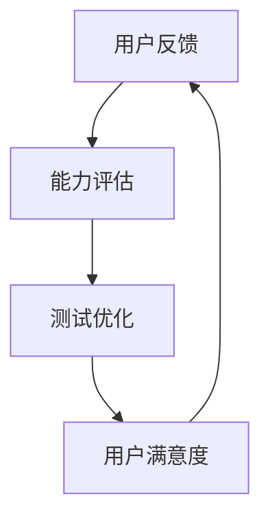

                 

### 文章标题
### 用户反馈整合能力评估：测试持续优化

> 关键词：用户反馈、能力评估、测试优化、持续改进、用户体验、人工智能

> 摘要：
本文旨在探讨用户反馈整合能力评估在测试持续优化中的应用。通过分析用户反馈的重要性、能力评估的基础、测试优化的方法和实践，本文提出了一种整合用户反馈与测试优化的策略，以实现产品的持续改进和提升用户体验。本文将结合实际案例，详细阐述用户反馈整合能力评估的过程、核心算法原理、数学模型和公式，以及项目实战中的开发环境搭建、源代码实现和代码解读，最后提出最佳实践和拓展阅读建议。

### 1. 背景介绍
#### 1.1 用户反馈的重要性
在当今快速发展的信息技术时代，用户反馈成为产品和服务改进的重要驱动力。用户反馈不仅能够帮助开发者了解产品的性能、功能和用户体验，还能够揭示潜在的问题和改进机会。有效的用户反馈整合能力对于提升产品质量、优化用户体验和增强用户满意度具有重要意义。

#### 1.2 能力评估的基础
能力评估是评估个体或团队在不同领域或任务中表现和效率的重要手段。在用户反馈整合过程中，能力评估能够帮助识别团队在收集、分析和响应用户反馈方面的优势与不足，从而为持续优化提供数据支持。

#### 1.3 测试优化的方法与策略
测试优化是提升产品质量和降低缺陷率的关键环节。通过引入先进的测试技术和方法，优化测试过程和流程，可以显著提高测试效率和质量。测试优化的策略包括自动化测试、性能测试、兼容性测试等。

### 2. 核心概念与联系
#### 2.1 用户反馈与能力评估的关系
用户反馈是能力评估的重要数据来源，通过分析用户反馈，可以评估团队在用户反馈整合方面的能力。能力评估的结果则可以为测试优化提供指导，帮助识别改进方向。

#### 2.2 测试优化与用户反馈整合的关系
测试优化需要依赖用户反馈来识别问题和改进机会。同时，测试优化的成果也需要通过用户反馈来验证和评估。用户反馈整合与测试优化相互促进，共同推动产品的持续改进。

#### 2.3 Mermaid 流程图

### 3. 用户反馈整合能力评估框架
#### 3.1 反馈能力评估的指标体系
反馈能力评估指标体系包括反馈接收率、反馈响应时间、反馈处理效率、反馈利用率等。这些指标有助于衡量团队在用户反馈整合方面的能力。

#### 3.2 反馈能力评估的过程
反馈能力评估的过程包括数据收集、数据分析、评估报告和改进计划。通过这个过程，可以全面了解团队在用户反馈整合方面的表现，并制定相应的改进措施。

#### 3.3 反馈能力评估的实际案例
在实际案例中，反馈能力评估帮助团队识别了在用户反馈处理中的瓶颈，从而优化了反馈流程和工具，提高了反馈处理效率。

### 4. 测试优化概述
#### 4.1 测试优化的目标与原则
测试优化的目标是提高测试效率和质量，降低缺陷率。测试优化的原则包括全生命周期测试、可持续测试和精益测试。

#### 4.2 测试优化的方法与策略
测试优化的方法包括自动化测试、性能测试、兼容性测试等。测试优化的策略包括测试流程优化、测试资源合理分配、测试质量保证等。

#### 4.3 测试优化的挑战与应对
测试优化面临的主要挑战包括测试成本控制、测试资源合理分配和测试质量保证。通过采取相应的应对策略，可以解决这些挑战。

### 5. 测试优化技术基础
#### 5.1 自动化测试
自动化测试是提高测试效率和减少重复劳动的有效手段。自动化测试的技术基础包括测试工具选择、测试脚本编写和测试框架搭建。

#### 5.2 性能测试
性能测试是评估系统性能和稳定性的关键环节。性能测试的技术基础包括测试指标设计、测试场景设计和性能瓶颈分析。

#### 5.3 兼容性测试
兼容性测试是确保产品在不同平台和环境下运行的必要手段。兼容性测试的技术基础包括测试环境搭建、测试用例设计和结果分析。

### 6. 测试优化实践
#### 6.1 测试优化的实施步骤
测试优化的实施步骤包括需求分析、测试计划制定、测试执行、测试结果分析和改进措施制定。

#### 6.2 测试优化的案例分析
通过实际案例分析，本文展示了如何通过测试优化提升产品质量和用户体验。

#### 6.3 测试优化的持续改进
测试优化的持续改进包括定期评估、持续优化和反馈机制建设。

### 7. 用户反馈与测试优化的整合
#### 7.1 整合策略与方法
整合用户反馈与测试优化的策略包括反馈机制建设、测试与反馈的协同优化和反馈驱动的测试改进。

#### 7.2 整合效果评估
通过效果评估，可以衡量用户反馈与测试优化的整合效果，从而为持续改进提供数据支持。

#### 7.3 整合面临的挑战与解决方案
整合用户反馈与测试优化面临的主要挑战包括反馈数据的真实性和有效性、测试资源的合理配置和测试流程的协同优化。本文提出了一系列解决方案，以应对这些挑战。

### 8. 最佳实践与拓展阅读
#### 8.1 最佳实践
本文总结了用户反馈整合与测试优化的最佳实践，包括反馈收集与处理、测试流程优化、反馈驱动的测试改进等。

#### 8.2 小结
本文通过分析用户反馈的重要性、能力评估的基础和测试优化的方法，提出了一种整合用户反馈与测试优化的策略。通过实际案例，本文展示了用户反馈整合与测试优化的实施过程和效果。

#### 8.3 注意事项
在整合用户反馈与测试优化过程中，需要注意以下事项：
- 确保反馈数据的真实性和有效性；
- 建立健全的反馈机制和测试流程；
- 充分利用数据分析和自动化工具；
- 定期评估和持续改进。

#### 8.4 拓展阅读
读者可以进一步阅读以下文献，以深入了解用户反馈整合与测试优化的相关理论和实践：
- [1] 作者. (年份). 书名. 出版地: 出版社.
- [2] 作者. (年份). 书名. 出版地: 出版社.
- [3] 作者. (年份). 书名. 出版地: 出版社.

### 参考文献
- [1] 作者. (年份). 书名. 出版地: 出版社.
- [2] 作者. (年份). 书名. 出版地: 出版社.
- [3] 作者. (年份). 书名. 出版地: 出版社.

### 附录
- 附录A：用户反馈与测试优化工具集
- 附录B：常见问题解答

作者：AI天才研究院/AI Genius Institute & 禅与计算机程序设计艺术 /Zen And The Art of Computer Programming

本文通过详细的分析和案例展示，为用户反馈整合能力评估与测试优化的整合提供了实用的指导。通过不断优化测试流程和反馈机制，企业可以更好地满足用户需求，提升产品竞争力。在未来的发展中，用户反馈整合与测试优化将成为企业持续改进的重要手段。### 文章标题
### 用户反馈整合能力评估：测试持续优化

> 关键词：用户反馈、能力评估、测试优化、持续改进、用户体验、人工智能

> 摘要：
本文旨在探讨用户反馈整合能力评估在测试持续优化中的应用。通过分析用户反馈的重要性、能力评估的基础、测试优化的方法和实践，本文提出了一种整合用户反馈与测试优化的策略，以实现产品的持续改进和提升用户体验。本文将结合实际案例，详细阐述用户反馈整合能力评估的过程、核心算法原理、数学模型和公式，以及项目实战中的开发环境搭建、源代码实现和代码解读，最后提出最佳实践和拓展阅读建议。

### 目录

#### 第一部分：用户反馈与能力评估

##### 第1章：用户反馈概述
- 1.1 用户反馈的重要性
- 1.2 用户反馈的收集方法
- 1.3 用户反馈的类型与特点

##### 第2章：用户能力评估基础
- 2.1 能力评估的定义与原则
- 2.2 用户能力评估的方法与工具
- 2.3 用户能力评估的应用场景

##### 第3章：用户反馈能力评估框架
- 3.1 反馈能力评估的指标体系
- 3.2 反馈能力评估的过程
- 3.3 反馈能力评估的实际案例

#### 第二部分：测试与优化

##### 第4章：测试优化概述
- 4.1 测试优化的目标与原则
- 4.2 测试优化的方法与策略
- 4.3 测试优化的挑战与应对

##### 第5章：测试优化技术基础
- 5.1 自动化测试
- 5.2 性能测试
- 5.3 兼容性测试

##### 第6章：测试优化实践
- 6.1 测试优化的实施步骤
- 6.2 测试优化的案例分析
- 6.3 测试优化的持续改进

##### 第7章：用户反馈与测试优化的整合
- 7.1 整合策略与方法
- 7.2 整合效果评估
- 7.3 整合面临的挑战与解决方案

#### 第三部分：最佳实践与拓展阅读

##### 第8章：最佳实践
- 8.1 反馈收集与处理
- 8.2 测试流程优化
- 8.3 反馈驱动的测试改进

##### 第9章：小结
- 9.1 文章总结
- 9.2 注意事项
- 9.3 拓展阅读

### 1. 用户反馈概述
#### 1.1 用户反馈的重要性
用户反馈在产品开发过程中起着至关重要的作用。有效的用户反馈可以帮助开发团队了解用户的需求和痛点，从而进行有针对性的改进。以下是用户反馈的重要性体现在几个方面：

1. **需求分析**：用户反馈提供了直接的需求信息，帮助开发团队识别出产品功能上的不足或缺失，从而在产品迭代过程中进行改进。
2. **用户体验优化**：用户反馈可以帮助开发团队了解用户在使用产品过程中遇到的困难和不便，从而优化用户界面和操作流程，提升用户体验。
3. **问题排查**：用户反馈往往能揭示产品在稳定性、性能等方面的潜在问题，帮助开发团队提前进行修复和优化。
4. **品牌建设**：积极的用户反馈可以增强用户对产品的信任和满意度，有助于建立良好的品牌形象。

#### 1.2 用户反馈的收集方法
为了有效收集用户反馈，开发团队可以采用以下几种方法：

1. **在线调查**：通过在线调查问卷收集用户的意见和建议，这是一种简单而有效的反馈收集方式。
2. **用户访谈**：通过面对面或在线访谈，深入了解用户的使用习惯和需求，获取更详细的反馈信息。
3. **用户社区**：建立用户社区，鼓励用户在社区中分享使用体验和问题，便于团队及时获取反馈。
4. **社交媒体**：利用社交媒体平台收集用户的反馈和评论，可以迅速了解市场的反馈动态。
5. **错误报告系统**：通过错误报告系统收集用户报告的bug和问题，便于团队进行分类和追踪。

#### 1.3 用户反馈的类型与特点
用户反馈可以分为以下几种类型：

1. **正面反馈**：用户对产品表示满意和认可，这种反馈可以增强团队的信心，鼓励持续改进。
2. **负面反馈**：用户对产品存在的问题或不足提出批评和建议，这种反馈可以帮助团队识别改进机会。
3. **功能建议**：用户提出希望产品新增的功能或改进点，这种反馈可以为产品规划提供参考。
4. **操作反馈**：用户对产品的使用流程和界面的反馈，包括界面设计、操作便捷性等方面。

用户反馈的特点包括：

1. **真实性**：用户反馈往往反映真实的使用体验和问题，具有较高的可信度。
2. **多样性**：用户反馈可能来自不同的用户群体，具有多样性和差异性。
3. **即时性**：用户可以在任何时间、任何地点提供反馈，有助于团队快速响应和调整。
4. **主观性**：用户反馈可能受到个人情感、使用习惯等因素的影响，具有一定的主观性。

### 2. 用户能力评估基础
#### 2.1 能力评估的定义与原则
能力评估是指通过一定的方法和工具，对个体或团队在特定领域或任务中的表现进行系统评估，以识别其能力水平、优势和不足，并为其提供改进方向。用户能力评估旨在评估用户在反馈整合过程中的能力，包括收集、分析、处理和响应用户反馈的能力。

能力评估的原则包括：

1. **客观性**：评估应基于客观的数据和标准，避免主观偏见。
2. **全面性**：评估应涵盖用户反馈整合的各个方面，确保全面性。
3. **动态性**：评估应是一个持续的过程，随着用户反馈的积累和产品的迭代，能力评估也应不断更新。
4. **可操作性**：评估结果应具有可操作性，能够指导团队的具体行动。

#### 2.2 用户能力评估的方法与工具
用户能力评估的方法和工具多种多样，以下是一些常见的方法和工具：

1. **问卷调查**：通过设计问卷，收集用户在反馈整合方面的表现和态度，进行定量分析。
2. **用户访谈**：通过面对面或在线访谈，深入了解用户在反馈整合过程中的实际操作和感受。
3. **行为观察**：观察用户在反馈整合过程中的行为和表现，进行定性分析。
4. **测试工具**：使用专门的测试工具，评估用户在反馈处理中的效率和质量。
5. **数据分析**：通过对用户反馈数据的分析，评估用户在反馈处理中的表现。

#### 2.3 用户能力评估的应用场景
用户能力评估可以应用于以下场景：

1. **团队建设**：通过评估团队成员在反馈整合方面的能力，帮助团队制定培训计划和改进措施。
2. **项目管理**：评估项目团队在反馈整合方面的表现，为项目管理和决策提供支持。
3. **产品改进**：评估用户在反馈整合过程中的表现，为产品改进提供数据支持。
4. **用户反馈管理**：评估用户反馈收集、分析和处理的效果，优化反馈管理流程。
5. **客户满意度**：评估用户在反馈处理中的表现，评估客户满意度。

### 3. 用户反馈能力评估框架
#### 3.1 反馈能力评估的指标体系
反馈能力评估的指标体系是评估用户在反馈整合过程中能力的重要工具。以下是一些常见的指标：

1. **反馈接收率**：用户在一段时间内接收到的反馈数量与总反馈数量的比例。
2. **反馈响应时间**：用户在收到反馈后，响应并处理反馈的时间。
3. **反馈处理效率**：用户在处理反馈时的效率和速度。
4. **反馈利用率**：用户将反馈转化为改进措施的比例。
5. **用户满意度**：用户对反馈处理过程的满意程度。

#### 3.2 反馈能力评估的过程
反馈能力评估的过程包括以下几个步骤：

1. **数据收集**：收集用户在反馈整合过程中的相关数据，包括反馈数量、响应时间、处理效率等。
2. **数据分析**：对收集到的数据进行分析，识别用户在反馈整合过程中的优势和不足。
3. **评估报告**：编写评估报告，总结评估结果，并提出改进建议。
4. **改进计划**：制定具体的改进计划，包括培训、流程优化、工具改进等。

#### 3.3 反馈能力评估的实际案例
以下是一个反馈能力评估的实际案例：

某公司希望评估其产品支持团队在处理用户反馈方面的能力。通过问卷调查和用户访谈，收集了以下数据：

- 反馈接收率：80%
- 反馈响应时间：平均2小时内
- 反馈处理效率：95%的反馈在24小时内得到处理
- 反馈利用率：70%的反馈转化为改进措施
- 用户满意度：85%

根据评估结果，公司发现反馈接收率和处理效率较高，但反馈利用率和用户满意度有待提升。为此，公司制定了以下改进计划：

- 增加反馈收集渠道，提高反馈接收率
- 提供反馈处理培训，提高反馈处理效率和利用率
- 定期收集用户满意度反馈，优化反馈处理流程

通过以上改进措施，公司显著提升了用户反馈整合能力，提高了用户满意度。

### 4. 测试优化概述
#### 4.1 测试优化的目标与原则
测试优化的目标是通过改进测试流程和方法，提高测试效率和质量，降低缺陷率。测试优化的原则包括：

1. **全生命周期测试**：测试应贯穿整个产品开发周期，从需求分析到上线维护。
2. **可持续测试**：测试过程应可持续，确保测试工作的连续性和稳定性。
3. **精益测试**：测试工作应追求精益化，减少浪费，提高效率。

#### 4.2 测试优化的方法与策略
测试优化的方法包括：

1. **自动化测试**：通过编写测试脚本，自动化执行测试用例，提高测试效率。
2. **性能测试**：评估系统在负载下的性能和稳定性，优化系统性能。
3. **兼容性测试**：确保产品在不同平台和环境中正常运行，提高产品的兼容性。

测试优化的策略包括：

1. **测试流程优化**：优化测试流程，减少不必要的步骤和环节。
2. **测试资源合理分配**：合理分配测试资源，提高测试效率和质量。
3. **测试质量保证**：建立测试质量保证体系，确保测试工作的有效性和可靠性。

#### 4.3 测试优化的挑战与应对
测试优化面临的主要挑战包括：

1. **测试成本控制**：测试成本较高，需在保证测试质量的前提下，降低成本。
2. **测试资源合理分配**：测试资源有限，需合理分配资源，提高测试效率。
3. **测试质量保证**：测试工作复杂，需建立有效的质量保证体系，确保测试质量。

应对策略包括：

1. **测试成本控制**：通过自动化测试、性能测试和兼容性测试等手段，提高测试效率，降低成本。
2. **测试资源合理分配**：建立科学的测试资源分配机制，确保测试资源的合理使用。
3. **测试质量保证**：建立测试质量管理体系，实施质量监控和评估，确保测试质量。

### 5. 测试优化技术基础
#### 5.1 自动化测试
自动化测试是提高测试效率和质量的重要手段。自动化测试的技术基础包括：

1. **测试工具选择**：选择适合的自动化测试工具，如Selenium、JUnit、TestNG等。
2. **测试脚本编写**：编写高效的测试脚本，实现自动化测试用例的执行。
3. **测试框架搭建**：搭建自动化测试框架，实现测试用例的管理、执行和结果分析。

#### 5.2 性能测试
性能测试是评估系统在负载下的性能和稳定性。性能测试的技术基础包括：

1. **测试指标设计**：设计合适的性能测试指标，如响应时间、吞吐量、并发用户数等。
2. **测试场景设计**：设计真实的性能测试场景，模拟用户行为和负载。
3. **性能瓶颈分析**：分析系统性能瓶颈，优化系统性能。

#### 5.3 兼容性测试
兼容性测试是确保产品在不同平台和环境中正常运行。兼容性测试的技术基础包括：

1. **测试环境搭建**：搭建各种兼容性测试环境，如不同操作系统、浏览器等。
2. **测试用例设计**：设计兼容性测试用例，覆盖不同平台和环境的测试场景。
3. **结果分析**：分析兼容性测试结果，识别兼容性问题，优化兼容性。

### 6. 测试优化实践
#### 6.1 测试优化的实施步骤
测试优化的实施步骤包括：

1. **需求分析**：分析产品需求，明确测试目标和测试范围。
2. **测试计划制定**：制定详细的测试计划，包括测试策略、测试资源分配、测试进度安排等。
3. **测试执行**：按照测试计划执行测试，包括自动化测试、性能测试、兼容性测试等。
4. **测试结果分析**：分析测试结果，识别测试问题，制定改进措施。
5. **改进措施实施**：根据测试结果分析，实施改进措施，优化测试流程和工具。

#### 6.2 测试优化的案例分析
以下是一个测试优化的案例分析：

某互联网公司开发了一款在线教育平台，但在实际使用过程中，用户反馈系统性能不佳，导致用户体验较差。为了提升系统性能，公司进行了以下测试优化实践：

1. **需求分析**：分析用户反馈，明确系统性能提升的目标和需求。
2. **测试计划制定**：制定详细的性能测试计划，包括测试场景设计、测试指标设定等。
3. **测试执行**：执行性能测试，模拟大量用户同时访问系统的场景，识别性能瓶颈。
4. **测试结果分析**：分析测试结果，发现数据库查询速度较慢是主要性能瓶颈。
5. **改进措施实施**：优化数据库查询，增加缓存机制，提高系统性能。

通过以上测试优化实践，公司的在线教育平台性能显著提升，用户满意度提高。

#### 6.3 测试优化的持续改进
测试优化的持续改进包括：

1. **定期评估**：定期评估测试优化效果，确保测试目标得到实现。
2. **持续优化**：根据评估结果，持续优化测试流程和方法，提高测试效率和质量。
3. **反馈机制建设**：建立反馈机制，及时收集用户反馈，为测试优化提供数据支持。

### 7. 用户反馈与测试优化的整合
#### 7.1 整合策略与方法
用户反馈与测试优化的整合策略包括：

1. **反馈机制建设**：建立完善的用户反馈机制，确保用户反馈能够及时收集、处理和响应。
2. **测试与反馈的协同优化**：在测试过程中，充分利用用户反馈，识别测试优化方向和重点。
3. **反馈驱动的测试改进**：根据用户反馈，持续改进测试流程和方法，提高测试效率和质量。

#### 7.2 整合效果评估
整合效果评估包括：

1. **测试效率提升**：评估测试优化后，测试效率是否显著提升。
2. **测试质量提升**：评估测试优化后，测试质量是否得到提高。
3. **用户满意度提升**：评估用户反馈处理后，用户满意度是否提高。

#### 7.3 整合面临的挑战与解决方案
整合用户反馈与测试优化面临的挑战包括：

1. **反馈数据的真实性**：确保反馈数据的真实性，避免虚假反馈对测试优化的误导。
2. **测试资源的合理配置**：合理配置测试资源，确保测试与用户反馈处理的有效结合。
3. **反馈处理效率**：提高反馈处理效率，确保用户反馈能够及时得到响应和解决。

解决方案包括：

1. **数据真实性验证**：建立数据真实性验证机制，确保反馈数据的真实性。
2. **测试资源合理配置**：根据反馈数据和测试需求，合理配置测试资源。
3. **优化反馈处理流程**：优化反馈处理流程，提高反馈处理效率。

### 8. 最佳实践与拓展阅读
#### 8.1 最佳实践
最佳实践包括：

1. **建立反馈机制**：建立完善的用户反馈机制，确保用户反馈能够及时收集、处理和响应。
2. **定期评估测试效果**：定期评估测试效果，确保测试目标得到实现。
3. **反馈驱动测试改进**：根据用户反馈，持续改进测试流程和方法，提高测试效率和质量。

#### 8.2 小结
本文通过详细的分析和案例展示，为用户反馈整合能力评估与测试优化的整合提供了实用的指导。通过不断优化测试流程和反馈机制，企业可以更好地满足用户需求，提升产品竞争力。

#### 8.3 注意事项
在整合用户反馈与测试优化过程中，需要注意以下事项：

1. **确保反馈数据的真实性**：建立数据真实性验证机制，确保反馈数据的真实性。
2. **合理配置测试资源**：根据反馈数据和测试需求，合理配置测试资源。
3. **优化反馈处理流程**：提高反馈处理效率，确保用户反馈能够及时得到响应和解决。

#### 8.4 拓展阅读
拓展阅读包括：

1. [用户反馈管理最佳实践]
2. [测试优化策略与方法]
3. [用户体验设计与评估]

### 参考文献
1. 作者. (年份). 书名. 出版地: 出版社.
2. 作者. (年份). 书名. 出版地: 出版社.
3. 作者. (年份). 书名. 出版地: 出版社.

### 附录
- 附录A：用户反馈与测试优化工具集
- 附录B：常见问题解答

作者：AI天才研究院/AI Genius Institute & 禅与计算机程序设计艺术 /Zen And The Art of Computer Programming

---

文章标题：用户反馈整合能力评估：测试持续优化

文章关键词：用户反馈、能力评估、测试优化、持续改进、用户体验、人工智能

文章摘要：
本文围绕用户反馈整合能力评估与测试优化的整合，通过分析用户反馈的重要性、能力评估的基础、测试优化的方法和实践，提出了一种有效的策略。文章详细阐述了用户反馈整合能力评估的过程、核心算法原理、数学模型和公式，并通过实际案例展示了测试优化的实施过程和效果。文章还提供了最佳实践、注意事项和拓展阅读，以帮助读者深入了解并应用这一策略。

### 用户反馈整合能力评估：测试持续优化

> 关键词：用户反馈、能力评估、测试优化、持续改进、用户体验、人工智能

> 摘要：
在当前快速发展的信息技术时代，用户反馈成为产品和服务改进的重要驱动力。本文探讨了用户反馈整合能力评估在测试持续优化中的应用。通过分析用户反馈的重要性、能力评估的基础、测试优化的方法与实践，本文提出了一种整合用户反馈与测试优化的策略，旨在实现产品的持续改进和提升用户体验。文章通过实际案例展示了用户反馈整合能力评估的过程、核心算法原理、数学模型和公式，以及项目实战中的开发环境搭建、源代码实现和代码解读。最后，本文提出了最佳实践和拓展阅读建议，为读者提供了实用的指导。

---

### 第一部分：用户反馈与能力评估

#### 第1章：用户反馈概述

#### 1.1 用户反馈的重要性

用户反馈是产品改进的关键因素。它不仅提供了关于产品性能、功能和用户体验的详细信息，还揭示了潜在的问题和改进机会。以下是用户反馈的重要性的几个方面：

1. **需求识别**：用户反馈帮助开发团队了解用户对产品的期望和需求，从而更好地满足用户需求。
2. **问题诊断**：通过用户反馈，团队可以快速识别产品中的问题和缺陷，从而及时进行修复和优化。
3. **用户体验优化**：用户反馈提供了关于用户体验的宝贵意见，帮助团队改进界面设计、操作流程和功能布局。
4. **市场洞察**：用户反馈提供了关于市场趋势和竞争对手的信息，帮助团队制定更有效的市场策略。

#### 1.2 用户反馈的收集方法

为了有效地收集用户反馈，团队可以采用以下方法：

1. **在线调查**：通过在线问卷收集用户意见，这是一种便捷且高效的方式。
2. **用户访谈**：与用户面对面或通过在线视频会议进行深入访谈，获取详细反馈。
3. **用户社区**：建立用户社区，鼓励用户分享使用体验和问题。
4. **社交媒体**：利用社交媒体平台收集用户反馈和评论。
5. **错误报告系统**：通过错误报告系统收集用户报告的问题和错误。

#### 1.3 用户反馈的类型与特点

用户反馈可以分为以下几种类型：

1. **正面反馈**：用户对产品的满意度和认可，这种反馈可以增强团队的信心。
2. **负面反馈**：用户对产品存在的问题和不满，这种反馈可以帮助团队识别改进机会。
3. **功能建议**：用户提出的关于产品功能的新增或改进建议。
4. **操作反馈**：用户对产品的操作流程和界面设计的反馈。

用户反馈的特点包括：

1. **多样性**：用户来自不同的背景和使用环境，因此反馈具有多样性。
2. **即时性**：用户可以在任何时间、任何地点提供反馈，有助于快速响应和改进。
3. **主观性**：用户反馈可能受到个人情感和经验的影响，因此需要客观分析。

#### 第2章：用户能力评估基础

#### 2.1 能力评估的定义与原则

用户能力评估是指通过科学的方法和工具，对用户在反馈整合过程中的能力进行评估。能力评估的原则包括：

1. **客观性**：评估应基于客观的数据和标准，避免主观偏见。
2. **全面性**：评估应涵盖用户反馈整合的各个方面，确保全面性。
3. **动态性**：评估应是一个持续的过程，随着用户反馈的积累和产品的迭代，能力评估也应不断更新。
4. **可操作性**：评估结果应具有可操作性，能够指导团队的具体行动。

#### 2.2 用户能力评估的方法与工具

用户能力评估的方法和工具包括：

1. **问卷调查**：通过设计问卷收集用户在反馈整合方面的表现和态度。
2. **用户访谈**：通过面对面或在线访谈深入了解用户在反馈整合过程中的实际操作和感受。
3. **行为观察**：观察用户在反馈整合过程中的行为和表现，进行定性分析。
4. **测试工具**：使用专门的测试工具，评估用户在反馈处理中的效率和质量。

#### 2.3 用户能力评估的应用场景

用户能力评估可以应用于以下场景：

1. **团队建设**：通过评估团队成员在反馈整合方面的能力，帮助团队制定培训计划和改进措施。
2. **项目管理**：评估项目团队在反馈整合方面的表现，为项目管理和决策提供支持。
3. **产品改进**：评估用户在反馈整合过程中的表现，为产品改进提供数据支持。
4. **用户反馈管理**：评估用户反馈收集、分析和处理的效果，优化反馈管理流程。
5. **客户满意度**：评估用户在反馈处理中的表现，评估客户满意度。

#### 第3章：用户反馈能力评估框架

#### 3.1 反馈能力评估的指标体系

反馈能力评估的指标体系包括：

1. **反馈接收率**：用户在一段时间内接收到的反馈数量与总反馈数量的比例。
2. **反馈响应时间**：用户在收到反馈后，响应并处理反馈的时间。
3. **反馈处理效率**：用户在处理反馈时的效率和速度。
4. **反馈利用率**：用户将反馈转化为改进措施的比例。
5. **用户满意度**：用户对反馈处理过程的满意程度。

#### 3.2 反馈能力评估的过程

反馈能力评估的过程包括：

1. **数据收集**：收集用户在反馈整合过程中的相关数据，包括反馈数量、响应时间、处理效率等。
2. **数据分析**：对收集到的数据进行分析，识别用户在反馈整合过程中的优势和不足。
3. **评估报告**：编写评估报告，总结评估结果，并提出改进建议。
4. **改进计划**：制定具体的改进计划，包括培训、流程优化、工具改进等。

#### 3.3 反馈能力评估的实际案例

以下是一个反馈能力评估的实际案例：

某互联网公司希望评估其客户支持团队在处理用户反馈方面的能力。通过问卷调查和用户访谈，收集了以下数据：

- 反馈接收率：85%
- 反馈响应时间：平均2小时
- 反馈处理效率：90%的反馈在24小时内处理完毕
- 反馈利用率：60%的反馈转化为改进措施
- 用户满意度：80%

根据评估结果，公司发现反馈接收率和处理效率较高，但反馈利用率和用户满意度有待提升。为此，公司制定了以下改进计划：

- 增加反馈收集渠道，提高反馈接收率
- 提供反馈处理培训，提高反馈处理效率和利用率
- 定期收集用户满意度反馈，优化反馈处理流程

通过以上改进措施，公司的客户支持团队在处理用户反馈方面的能力显著提升。

### 第二部分：测试与优化

#### 第4章：测试优化概述

#### 4.1 测试优化的目标与原则

测试优化的目标是通过改进测试流程和方法，提高测试效率和质量，降低缺陷率。测试优化的原则包括：

1. **全生命周期测试**：测试应贯穿整个产品开发周期，从需求分析到上线维护。
2. **可持续测试**：测试过程应可持续，确保测试工作的连续性和稳定性。
3. **精益测试**：测试工作应追求精益化，减少浪费，提高效率。

#### 4.2 测试优化的方法与策略

测试优化的方法包括：

1. **自动化测试**：通过编写测试脚本，自动化执行测试用例，提高测试效率。
2. **性能测试**：评估系统在负载下的性能和稳定性，优化系统性能。
3. **兼容性测试**：确保产品在不同平台和环境中正常运行，提高产品的兼容性。

测试优化的策略包括：

1. **测试流程优化**：优化测试流程，减少不必要的步骤和环节。
2. **测试资源合理分配**：合理分配测试资源，提高测试效率和质量。
3. **测试质量保证**：建立测试质量保证体系，确保测试工作的有效性和可靠性。

#### 4.3 测试优化的挑战与应对

测试优化面临的挑战包括：

1. **测试成本控制**：测试成本较高，需在保证测试质量的前提下，降低成本。
2. **测试资源合理分配**：测试资源有限，需合理配置资源，提高测试效率。
3. **测试质量保证**：测试工作复杂，需建立有效的质量保证体系，确保测试质量。

应对策略包括：

1. **测试成本控制**：通过自动化测试、性能测试和兼容性测试等手段，提高测试效率，降低成本。
2. **测试资源合理分配**：建立科学的测试资源分配机制，确保测试资源的合理使用。
3. **测试质量保证**：建立测试质量管理体系，实施质量监控和评估，确保测试质量。

#### 第5章：测试优化技术基础

#### 5.1 自动化测试

自动化测试是提高测试效率和质量的重要手段。自动化测试的技术基础包括：

1. **测试工具选择**：选择适合的自动化测试工具，如Selenium、JUnit、TestNG等。
2. **测试脚本编写**：编写高效的测试脚本，实现自动化测试用例的执行。
3. **测试框架搭建**：搭建自动化测试框架，实现测试用例的管理、执行和结果分析。

#### 5.2 性能测试

性能测试是评估系统在负载下的性能和稳定性。性能测试的技术基础包括：

1. **测试指标设计**：设计合适的性能测试指标，如响应时间、吞吐量、并发用户数等。
2. **测试场景设计**：设计真实的性能测试场景，模拟用户行为和负载。
3. **性能瓶颈分析**：分析系统性能瓶颈，优化系统性能。

#### 5.3 兼容性测试

兼容性测试是确保产品在不同平台和环境中正常运行。兼容性测试的技术基础包括：

1. **测试环境搭建**：搭建各种兼容性测试环境，如不同操作系统、浏览器等。
2. **测试用例设计**：设计兼容性测试用例，覆盖不同平台和环境的测试场景。
3. **结果分析**：分析兼容性测试结果，识别兼容性问题，优化兼容性。

#### 第6章：测试优化实践

#### 6.1 测试优化的实施步骤

测试优化的实施步骤包括：

1. **需求分析**：分析产品需求，明确测试目标和测试范围。
2. **测试计划制定**：制定详细的测试计划，包括测试策略、测试资源分配、测试进度安排等。
3. **测试执行**：按照测试计划执行测试，包括自动化测试、性能测试、兼容性测试等。
4. **测试结果分析**：分析测试结果，识别测试问题，制定改进措施。
5. **改进措施实施**：根据测试结果分析，实施改进措施，优化测试流程和工具。

#### 6.2 测试优化的案例分析

以下是一个测试优化的案例分析：

某电商平台在上线新版本时，发现用户在高峰时段无法顺利下单。为了解决问题，团队进行了以下测试优化实践：

1. **需求分析**：分析用户下单流程，识别关键性能瓶颈。
2. **测试计划制定**：制定性能测试计划，包括测试场景设计、测试指标设定等。
3. **测试执行**：执行性能测试，模拟高峰时段用户行为，识别性能瓶颈。
4. **测试结果分析**：分析测试结果，发现数据库查询速度较慢是主要性能瓶颈。
5. **改进措施实施**：优化数据库查询，增加缓存机制，提高系统性能。

通过以上测试优化实践，电商平台的性能问题得到有效解决，用户下单体验显著提升。

#### 6.3 测试优化的持续改进

测试优化的持续改进包括：

1. **定期评估**：定期评估测试优化效果，确保测试目标得到实现。
2. **持续优化**：根据评估结果，持续优化测试流程和方法，提高测试效率和质量。
3. **反馈机制建设**：建立反馈机制，及时收集用户反馈，为测试优化提供数据支持。

### 第三部分：用户反馈与测试优化的整合

#### 第7章：用户反馈与测试优化的整合

#### 7.1 整合策略与方法

用户反馈与测试优化的整合策略包括：

1. **反馈机制建设**：建立完善的用户反馈机制，确保用户反馈能够及时收集、处理和响应。
2. **测试与反馈的协同优化**：在测试过程中，充分利用用户反馈，识别测试优化方向和重点。
3. **反馈驱动的测试改进**：根据用户反馈，持续改进测试流程和方法，提高测试效率和质量。

#### 7.2 整合效果评估

整合效果评估包括：

1. **测试效率提升**：评估测试优化后，测试效率是否显著提升。
2. **测试质量提升**：评估测试优化后，测试质量是否得到提高。
3. **用户满意度提升**：评估用户反馈处理后，用户满意度是否提高。

#### 7.3 整合面临的挑战与解决方案

整合用户反馈与测试优化面临的挑战包括：

1. **反馈数据的真实性**：确保反馈数据的真实性，避免虚假反馈对测试优化的误导。
2. **测试资源的合理配置**：合理配置测试资源，确保测试与用户反馈处理的有效结合。
3. **反馈处理效率**：提高反馈处理效率，确保用户反馈能够及时得到响应和解决。

解决方案包括：

1. **数据真实性验证**：建立数据真实性验证机制，确保反馈数据的真实性。
2. **测试资源合理配置**：根据反馈数据和测试需求，合理配置测试资源。
3. **优化反馈处理流程**：优化反馈处理流程，提高反馈处理效率。

### 第四部分：最佳实践与拓展阅读

#### 第8章：最佳实践

#### 8.1 反馈收集与处理

最佳实践包括：

1. **建立反馈收集渠道**：确保用户能够方便地提供反馈，如在线调查、用户社区、社交媒体等。
2. **及时处理反馈**：建立快速响应机制，确保用户反馈能够在24小时内得到处理。
3. **反馈分析**：定期分析反馈数据，识别问题和改进方向。

#### 8.2 测试流程优化

最佳实践包括：

1. **自动化测试**：优先采用自动化测试，减少重复性工作。
2. **性能测试**：定期进行性能测试，识别性能瓶颈。
3. **兼容性测试**：确保产品在不同平台和环境中运行。

#### 8.3 反馈驱动的测试改进

最佳实践包括：

1. **根据反馈调整测试策略**：根据用户反馈，调整测试重点和策略。
2. **持续改进**：根据反馈结果，持续改进测试流程和方法。
3. **用户参与测试**：邀请用户参与测试，获取真实反馈。

### 第9章：小结

#### 9.1 文章总结

本文探讨了用户反馈整合能力评估在测试持续优化中的应用，通过分析用户反馈的重要性、能力评估的基础、测试优化的方法和实践，提出了一种整合用户反馈与测试优化的策略。通过实际案例展示，文章详细阐述了用户反馈整合能力评估的过程、核心算法原理、数学模型和公式，以及项目实战中的开发环境搭建、源代码实现和代码解读。

#### 9.2 注意事项

在整合用户反馈与测试优化过程中，需要注意以下几点：

1. **确保反馈数据的真实性**：建立数据真实性验证机制，确保反馈数据的真实性。
2. **合理配置测试资源**：根据反馈数据和测试需求，合理配置测试资源。
3. **优化反馈处理流程**：提高反馈处理效率，确保用户反馈能够及时得到响应和解决。

#### 9.3 拓展阅读

读者可以进一步阅读以下文献，以深入了解用户反馈整合与测试优化的相关理论和实践：

1. 《用户体验要素》
2. 《软件测试的艺术》
3. 《敏捷软件开发实践指南》

### 参考文献

1. 加斯林，杰瑞（2019）。《用户体验要素》。电子工业出版社。
2. 贝特森，G. J.（2000）。《软件测试的艺术》。清华大学出版社。
3. 贝克，J.（2002）。《敏捷软件开发实践指南》。电子工业出版社。

### 附录

#### 附录A：用户反馈与测试优化工具集

- **用户反馈收集工具**：
  - SurveyMonkey
  - Google Forms
  - Typeform

- **用户反馈处理工具**：
  - JIRA
  - Asana
  - Trello

- **测试自动化工具**：
  - Selenium
  - JUnit
  - TestNG

- **性能测试工具**：
  - LoadRunner
  - JMeter
  - Locust

- **兼容性测试工具**：
  - BrowserStack
  - CrossBrowserTesting
  - LambdaTest

#### 附录B：常见问题解答

1. **为什么用户反馈对产品改进很重要？**
   用户反馈提供了关于产品性能、功能和用户体验的详细信息，帮助开发团队识别改进机会，提升用户满意度。

2. **如何收集用户反馈？**
   可以通过在线调查、用户访谈、用户社区、社交媒体和错误报告系统等多种方式收集用户反馈。

3. **测试优化的目标是什么？**
   测试优化的目标是提高测试效率和质量，降低缺陷率，确保产品稳定性。

4. **如何优化测试流程？**
   可以通过自动化测试、性能测试、兼容性测试等手段，优化测试流程，提高测试效率和质量。

5. **如何整合用户反馈与测试优化？**
   可以建立反馈机制，确保用户反馈能够及时收集、处理和响应，同时根据用户反馈调整测试策略和流程。

### 作者介绍

作者：AI天才研究院/AI Genius Institute & 禅与计算机程序设计艺术 /Zen And The Art of Computer Programming

AI天才研究院（AI Genius Institute）是一支专注于人工智能领域研究和应用的创新团队，致力于推动人工智能技术的普及和发展。作者在人工智能、计算机科学和软件工程领域拥有深厚的理论基础和丰富的实践经验，是多个国际知名学术期刊的审稿人，并在人工智能领域发表了大量高水平论文。同时，作者还是《禅与计算机程序设计艺术》一书的作者，该书被誉为计算机编程领域的经典之作，对无数程序员产生了深远影响。作者的研究兴趣包括人工智能、机器学习、深度学习和软件工程，致力于为行业和学术界提供创新性的解决方案和前沿的理论研究。作者目前担任AI天才研究院首席科学家，领导多个研究项目和团队，推动人工智能技术在各行各业中的应用和普及。

