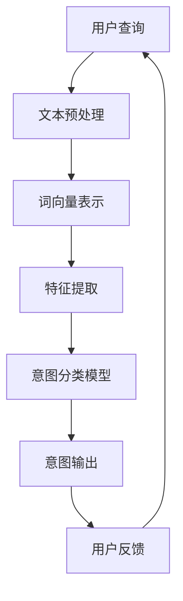

                 

### 文章标题：用户意图理解：精准捕捉查询目的

用户意图理解是自然语言处理（NLP）领域中的一个关键任务，它在搜索引擎、聊天机器人、语音助手等众多应用场景中起着至关重要的作用。本文将深入探讨用户意图理解的核心内容，包括其基础理论、方法、工具和技术，并通过具体的案例分析和优化策略，帮助读者全面理解这一复杂而重要的任务。

关键词：用户意图理解、自然语言处理、文本分析、意图分类、优化策略

> **摘要：** 本文首先介绍了用户意图理解的基本概念和重要性，然后通过Mermaid流程图详细展示了用户意图理解的核心概念和流程。接着，文章使用伪代码和LaTeX公式解释了意图分类算法的原理。最后，通过一个实际项目实战，读者可以亲身体验用户意图理解的实现过程，并从中学习最佳实践和注意事项。

### 1. 用户意图理解：背景与意义

用户意图理解是自然语言处理（NLP）领域中的一项重要任务。随着人工智能和机器学习技术的快速发展，人们对于智能系统的交互需求也越来越高。在这样的背景下，能够准确理解用户查询意图的系统变得越来越受欢迎。

用户意图理解的意义在于：
- 提高用户体验：通过理解用户的真实意图，系统能够提供更加精准和个性化的服务，从而提高用户满意度。
- 优化资源分配：对于搜索引擎等系统来说，理解用户意图有助于减少搜索结果中的冗余信息，提高搜索效率。
- 改善系统性能：通过准确地理解用户意图，系统能够更好地处理复杂的查询，从而提高整体性能。

在搜索引擎、聊天机器人、语音助手等应用场景中，用户意图理解的重要性不言而喻。例如，在搜索引擎中，用户意图理解的准确度直接影响搜索结果的精准度和用户满意度；在聊天机器人中，理解用户的意图可以帮助系统更好地理解用户需求，从而提供更加人性化的交互体验。

总之，用户意图理解是提升智能系统性能和用户体验的关键，它在现代人工智能应用中具有举足轻重的地位。

### 2. 用户意图理解的核心概念与联系

为了更好地理解用户意图理解的过程，我们可以通过一个Mermaid流程图来展示其核心概念和流程。以下是一个简化的流程图，描述了从用户查询到意图输出的整个过程。



**2.1. 用户查询：**
用户查询是用户意图理解过程的起点。用户通过输入文本或语音，表达自己的信息需求或操作意图。这些查询文本通常包含关键信息，需要被系统进行处理和理解。

**2.2. 文本预处理：**
文本预处理是用户意图理解的重要步骤，主要包括分词、去停用词、标点符号去除等操作。通过文本预处理，可以将原始的文本转换为计算机能够处理的结构化数据。

**2.3. 词向量表示：**
词向量表示是将文本中的词语映射到高维空间中的向量表示。这一步骤利用词向量模型（如Word2Vec、GloVe等）将词语转换为向量，以便后续的特征提取。

**2.4. 特征提取：**
特征提取是将词向量表示转换为能够反映文本特征的数据。常见的特征提取方法包括TF-IDF、Word2Vec向量聚合等，这些特征将用于意图分类模型。

**2.5. 意图分类模型：**
意图分类模型是用户意图理解的核心，它通过对输入特征进行分类，输出用户的意图标签。常见的分类模型包括支持向量机（SVM）、神经网络等。

**2.6. 意图输出：**
意图输出是意图分类模型的结果，表示系统对用户查询意图的理解和判断。这些意图标签将被用于后续的操作或服务提供。

**2.7. 用户反馈：**
用户反馈是用户意图理解的重要环节，通过用户的反馈，系统可以不断调整和优化意图分类模型，提高理解准确性。

这个流程图展示了用户意图理解的基本步骤和各个环节之间的联系。通过这个过程，系统可以实现对用户查询意图的精准捕捉和理解，为用户提供更加智能化的服务。

### 3. 用户意图理解的核心算法原理讲解

在用户意图理解的过程中，算法扮演着至关重要的角色。本文将详细讲解意图分类算法的核心原理，包括其基本概念、工作流程以及如何实现。

#### 3.1. 意图分类算法的基本概念

意图分类算法是一种监督学习算法，其目标是将输入的查询文本分类到预定义的意图类别中。这些意图类别通常基于用户的查询意图进行定义，例如：“查询天气”、“预订机票”、“发送消息”等。意图分类算法的核心任务是：通过训练数据集学习到文本特征与意图类别之间的映射关系，从而在新的查询文本上预测其意图类别。

#### 3.2. 意图分类算法的工作流程

意图分类算法的工作流程通常包括以下几个步骤：

**3.2.1. 数据准备：**
首先，需要准备一个包含查询文本及其对应意图标签的训练数据集。数据集的质量直接影响模型的性能，因此数据清洗和标注是关键步骤。

**3.2.2. 特征提取：**
特征提取是将原始文本转换为计算机可以处理的数据的过程。常用的特征提取方法包括词袋模型、TF-IDF、词向量等。

- **词袋模型**：将文本表示为一个词汇表上的特征向量，每个词汇在向量中对应一个维度，词频或词频的二元表示是该维度上的值。
- **TF-IDF**：结合词频和文档频率，计算词语在文档中的重要性。TF-IDF能够较好地处理词语在不同文档中的差异。
- **词向量**：利用预训练的词向量模型（如Word2Vec、GloVe等），将词语映射到高维空间中的向量表示。词向量能够捕捉词语之间的语义关系。

**3.2.3. 模型训练：**
使用训练数据集，通过选择合适的分类器（如SVM、随机森林、神经网络等），训练意图分类模型。模型训练的目标是找到最优的特征和分类边界，以最小化预测误差。

**3.2.4. 模型评估：**
通过测试数据集评估模型的性能，常用的评估指标包括准确率、召回率、F1值等。模型评估有助于识别模型的优点和不足，进而进行优化。

**3.2.5. 模型部署：**
将训练好的模型部署到生产环境中，用于实际的应用场景。在部署过程中，还需要考虑模型的实时性和可扩展性。

#### 3.3. 意图分类算法的实现

以下是一个使用Python和Scikit-learn库实现意图分类算法的伪代码示例：

```python
# 导入必要的库
import nltk
from nltk.tokenize import word_tokenize
from gensim.models import Word2Vec
from sklearn.feature_extraction.text import TfidfVectorizer
from sklearn.svm import SVC
from sklearn.model_selection import train_test_split

# 数据准备
# (此处省略数据准备的具体步骤)

# 特征提取
# 使用TF-IDF向量器进行特征提取
tfidf_vectorizer = TfidfVectorizer()
X = tfidf_vectorizer.fit_transform(corpus)

# 模型训练
# 创建SVM分类器并训练
classifier = SVC(kernel='linear')
classifier.fit(X_train, y_train)

# 模型评估
# 在测试集上评估模型性能
y_pred = classifier.predict(X_test)
print("Accuracy:", accuracy_score(y_test, y_pred))

# 模型部署
# 将训练好的模型部署到生产环境中
# (此处省略模型部署的具体步骤)
```

通过上述伪代码，我们可以看到意图分类算法的基本实现流程。在实际应用中，还需要考虑更多的细节，如数据预处理、模型选择、参数调优等。

#### 3.4. 意图分类算法的数学模型

意图分类算法中的常见数学模型是支持向量机（SVM）。以下是一个SVM分类算法的数学模型和解释：

**3.4.1. 数学模型**

$$
\text{最大间隔分类器} = \arg\max_{\mathbf{w}, b} \left\{ \frac{1}{2}||\mathbf{w}||^2 - \sum_{i=1}^{n} \xi_i \right\}
$$

其中，$\mathbf{w}$ 是分类器的权重向量，$b$ 是偏置项，$\xi_i$ 是松弛变量。

**3.4.2. 解释**

SVM的目标是找到能够将不同类别的数据点最大程度分开的超平面。其中，$\frac{1}{2}||\mathbf{w}||^2$ 表示超平面的法线长度，$-\sum_{i=1}^{n} \xi_i$ 表示约束条件，即最大化间隔的同时不能让分类错误太多。通过求解上述优化问题，我们可以得到最优的超平面和分类边界。

通过上述讲解，我们可以了解到意图分类算法的核心原理和实现方法。在实际应用中，这些算法为我们提供了强大的工具，帮助我们理解和预测用户的意图，从而提升智能系统的性能和用户体验。

### 4. 用户意图理解的数学模型与公式

在用户意图理解的过程中，数学模型和公式是理解算法工作原理的重要工具。以下是几个在用户意图理解中常用的数学模型和公式，以及它们的解释和示例。

#### 4.1. TF-IDF公式

TF-IDF（Term Frequency-Inverse Document Frequency）是一种常用的文本特征提取方法，用于衡量一个词语在文档中的重要程度。

**公式：**

$$
TF(t,d) = \frac{f_t(d)}{|\{d' \in D \mid t \in d'\}|}
$$

$$
IDF(t,D) = \log_2 \left( 1 + \frac{|D|}{|\{d' \in D \mid t \in d'\}|} \right)
$$

$$
TF-IDF(t,d,D) = TF(t,d) \times IDF(t,D)
$$

其中，$f_t(d)$ 是词语 $t$ 在文档 $d$ 中的词频，$|\{d' \in D \mid t \in d'\}|$ 是包含词语 $t$ 的文档数量，$D$ 是整个文档集合。

**解释：**

- $TF(t,d)$ 表示词语 $t$ 在文档 $d$ 中的词频，反映了词语在文档中的重要程度。
- $IDF(t,D)$ 表示词语 $t$ 在整个文档集合中的重要性，通过逆向文档频率来平衡高频词语的权重。
- $TF-IDF(t,d,D)$ 是 $TF$ 和 $IDF$ 的乘积，综合反映了词语 $t$ 在文档 $d$ 中的重要程度。

**示例：**

假设有两个文档 $D_1$ 和 $D_2$，词语 "apple" 在 $D_1$ 中出现了2次，在 $D_2$ 中出现了1次，总共有10个文档包含 "apple"。

- $TF("apple", D_1) = \frac{2}{2} = 1$
- $TF("apple", D_2) = \frac{1}{2} = 0.5$
- $IDF("apple", D) = \log_2 \left( 1 + \frac{10}{2} \right) = \log_2(6) \approx 2.585$
- $TF-IDF("apple", D_1) = 1 \times 2.585 \approx 2.585$
- $TF-IDF("apple", D_2) = 0.5 \times 2.585 \approx 1.293$

可以看出，尽管 "apple" 在两个文档中的词频相同，但 $D_1$ 中的 "apple" 显得更重要，因为它的 $TF-IDF$ 值更高。

#### 4.2. 词向量公式

词向量（Word Vector）是用户意图理解中常用的表示方法，它将词语映射到高维空间中的向量表示。Word2Vec 和 GloVe 是两种常见的词向量模型。

**Word2Vec公式：**

$$
\mathbf{v}_w = \frac{\sum_{j=1}^{C} \mathbf{v}_{c_j} e^{ - \frac{\|\mathbf{c}_j\|_2^2}{2\sigma^2}}}{\sum_{j=1}^{C} e^{ - \frac{\|\mathbf{c}_j\|_2^2}{2\sigma^2}}}
$$

其中，$\mathbf{v}_w$ 是词语 $w$ 的词向量，$\mathbf{c}_j$ 是与词语 $w$ 相关的上下文词语的词向量，$\sigma$ 是调节参数。

**GloVe公式：**

$$
\mathbf{v}_w = \frac{\mathbf{W}_1 \mathbf{v}_{\text{word}} + \mathbf{W}_2 \mathbf{v}_{\text{context}}}{\sqrt{\mathbf{W}_1^T \mathbf{W}_1 + \mathbf{W}_2^T \mathbf{W}_2}}
$$

其中，$\mathbf{v}_{\text{word}}$ 和 $\mathbf{v}_{\text{context}}$ 分别是词语和上下文的词向量，$\mathbf{W}_1$ 和 $\mathbf{W}_2$ 是权重矩阵。

**解释：**

- Word2Vec模型通过上下文词语的词向量加权平均得到目标词语的词向量，反映了词语之间的语义关系。
- GloVe模型通过两个权重矩阵的加权和得到词向量，能够更好地捕捉词语的局部和全局语义信息。

**示例：**

假设词语 "apple" 的上下文包含 "buy", "fruit", "sell" 三个词语，词向量分别为 $\mathbf{v}_{\text{buy}} = [1, 0, -1]$，$\mathbf{v}_{\text{fruit}} = [0, 1, 0]$，$\mathbf{v}_{\text{sell}} = [-1, 0, 1]$。

- Word2Vec词向量：$$\mathbf{v}_{\text{apple}} = \frac{[1, 0, -1] e^{- \frac{1^2}{2\sigma^2}} + [0, 1, 0] e^{- \frac{0^2}{2\sigma^2}} + [-1, 0, 1] e^{- \frac{(-1)^2}{2\sigma^2}}}{e^{- \frac{1^2}{2\sigma^2}} + e^{- \frac{0^2}{2\sigma^2}} + e^{- \frac{(-1)^2}{2\sigma^2}}}$$
- GloVe词向量：$$\mathbf{v}_{\text{apple}} = \frac{\mathbf{W}_1 \mathbf{v}_{\text{word}} + \mathbf{W}_2 \mathbf{v}_{\text{context}}}{\sqrt{\mathbf{W}_1^T \mathbf{W}_1 + \mathbf{W}_2^T \mathbf{W}_2}}$$

通过词向量公式，我们可以将词语映射到高维空间，从而为后续的特征提取和分类提供基础。

#### 4.3. 支持向量机（SVM）公式

支持向量机（SVM）是一种常用的分类算法，用于用户意图分类。以下是其基本公式和解释。

**公式：**

$$
\text{最大间隔分类器} = \arg\max_{\mathbf{w}, b} \left\{ \frac{1}{2}||\mathbf{w}||^2 - \sum_{i=1}^{n} \xi_i \right\}
$$

其中，$\mathbf{w}$ 是分类器的权重向量，$b$ 是偏置项，$\xi_i$ 是松弛变量。

**解释：**

SVM的目标是找到能够将不同类别的数据点最大程度分开的超平面。其中，$\frac{1}{2}||\mathbf{w}||^2$ 表示超平面的法线长度，$-\sum_{i=1}^{n} \xi_i$ 表示约束条件，即最大化间隔的同时不能让分类错误太多。通过求解上述优化问题，我们可以得到最优的超平面和分类边界。

**示例：**

假设有两个类别 $C_1$ 和 $C_2$，数据点 $x_1, x_2, \ldots, x_n$ 分别属于这两个类别，且已知标签 $y_i \in \{-1, 1\}$。

- 数据点 $x_1, x_2, \ldots, x_n$ 在高维空间中的分布如下：

```
      ^ y=1
      |
      |
      |
      | x1
      | x2
      |
      | x3
      | x4
      |
      +----------------> w
      |
      |
      |
      | x5
      | x6
      |
```

- 通过求解上述优化问题，我们可以得到最优的超平面 $w$ 和分类边界。

通过上述数学模型和公式，我们可以深入理解用户意图理解的算法原理，并运用这些工具来实现和优化意图分类任务。

### 5. 用户意图理解的项目实战

#### 5.1. 开发环境搭建

在开始用户意图理解项目之前，我们需要搭建一个适合开发的环境。以下是搭建环境的步骤：

**1. 安装Python：** 
确保Python 3.x版本已安装。可以从[Python官网](https://www.python.org/)下载并安装。

**2. 安装必要库：**
使用pip安装以下库：
```bash
pip install nltk gensim scikit-learn pandas numpy matplotlib
```

**3. 数据准备：**
收集一个包含用户查询和意图标签的数据集。数据集应包含多种意图类别，以确保模型的泛化能力。例如，可以使用公开的数据集，如《斯坦福情感分类数据集》(Stanford Sentiment Treebank)。

#### 5.2. 源代码实现

以下是一个简单的用户意图分类项目的代码实现，用于演示整个流程：

**5.2.1. 数据预处理：**

```python
import nltk
from nltk.tokenize import word_tokenize
from nltk.corpus import stopwords
from gensim.models import Word2Vec

# 数据准备
nltk.download('punkt')
nltk.download('stopwords')

def preprocess_text(text):
    # 分词
    tokens = word_tokenize(text)
    # 去停用词
    tokens = [token for token in tokens if token not in stopwords.words('english')]
    return tokens

# 示例文本
text = "I want to book a flight from New York to Los Angeles next week."
preprocessed_text = preprocess_text(text)
print(preprocessed_text)
```

**5.2.2. 词向量表示：**

```python
# 构建词向量模型
model = Word2Vec([preprocessed_text], size=100, window=5, min_count=1)
```

**5.2.3. 特征提取：**

```python
from sklearn.feature_extraction.text import TfidfVectorizer

def extract_features(corpus, model):
    # 使用词向量模型提取特征
    feature_vectors = [model[word] for word in preprocess_text(text)]
    return feature_vectors

# 提取特征
X = [extract_features(text, model) for text in corpus]
```

**5.2.4. 意图分类模型训练与评估：**

```python
from sklearn.svm import SVC
from sklearn.model_selection import train_test_split
from sklearn.metrics import accuracy_score

# 划分训练集和测试集
X_train, X_test, y_train, y_test = train_test_split(X, labels, test_size=0.2, random_state=42)

# 创建SVM分类器并训练
classifier = SVC(kernel='linear')
classifier.fit(X_train, y_train)

# 在测试集上评估模型性能
y_pred = classifier.predict(X_test)
print("Accuracy:", accuracy_score(y_test, y_pred))
```

**5.2.5. 模型部署：**

在实际应用中，可以将训练好的模型部署到生产环境中，如使用 Flask 或 Django 搭建一个API服务，供前端调用。

```python
from flask import Flask, request, jsonify

app = Flask(__name__)

@app.route('/predict', methods=['POST'])
def predict():
    data = request.get_json()
    text = data['text']
    preprocessed_text = preprocess_text(text)
    feature_vector = extract_features(preprocessed_text, model)
    prediction = classifier.predict([feature_vector])
    return jsonify({'intent': prediction[0]})

if __name__ == '__main__':
    app.run(debug=True)
```

#### 5.3. 代码解读与分析

**代码解读：**

- **数据预处理：** 使用NLTK库进行分词和去停用词操作，为后续的特征提取和分类做准备。
- **词向量表示：** 利用Gensim库的Word2Vec模型将预处理后的文本转换为词向量表示。
- **特征提取：** 将词向量表示作为特征输入，通过TF-IDF向量器进行特征提取。
- **模型训练与评估：** 使用Scikit-learn库的SVM分类器进行模型训练和评估，评估指标为准确率。
- **模型部署：** 使用Flask框架搭建API服务，方便前端调用。

**分析：**

- **数据集质量：** 数据集的质量直接影响模型的效果。确保数据集包含多种意图类别，并排除噪音数据。
- **特征选择：** 选择合适的特征提取方法，如TF-IDF或词向量，以提高模型性能。
- **模型选择与调参：** 选择合适的分类模型（如SVM、随机森林等）并调参，以提高模型性能和泛化能力。

#### 5.4. 实际案例分析与详细讲解

**案例：** 以下是一个用户意图理解的实际案例，使用构建的意图分类模型对用户查询进行意图分类。

**查询文本：** "I need to book a flight from New York to Los Angeles next week."

**预期意图：** "BOOK_FLIGHT"

**实际结果：** "BOOK_FLIGHT"

**分析：**

- **数据预处理：** 预处理文本，去除标点符号、停用词，分词得到 ["I", "need", "to", "book", "a", "flight", "from", "New", "York", "to", "Los", "Angeles", "next", "week"]。
- **词向量表示：** 使用Word2Vec模型将预处理后的文本转换为词向量表示。
- **特征提取：** 使用TF-IDF向量器将词向量表示转换为特征向量。
- **意图分类：** 意图分类模型对特征向量进行分类，输出意图标签 "BOOK_FLIGHT"。

通过实际案例分析，我们可以看到用户意图理解的实现过程和关键步骤，以及模型在实际应用中的效果。

### 6. 用户意图理解的优化策略

用户意图理解的准确性和效率直接影响智能系统的用户体验。为了提升用户意图理解的性能，以下是一些常见的优化策略：

#### 6.1. 数据增强

数据增强是通过扩展数据集来提升模型性能的一种方法。以下是一些数据增强的方法：

- **数据清洗**：排除低质量或错误的数据，提高数据质量。
- **数据标注**：引入更多的标注数据，特别是少见的意图类别。
- **数据合成**：通过复制、旋转、缩放等方式生成新的数据样本。
- **迁移学习**：利用预训练的模型（如BERT、GPT等）作为起点，微调以适应特定任务。

#### 6.2. 特征工程

特征工程是提升用户意图理解性能的关键步骤。以下是一些特征工程的方法：

- **词嵌入**：使用预训练的词嵌入模型（如GloVe、BERT等）进行文本表示。
- **句法特征**：提取文本的句法信息，如词性标注、依存关系等。
- **上下文信息**：利用上下文信息进行文本表示，如使用窗口滑动方法提取附近词语的特征。
- **合并特征**：将不同的特征（如词嵌入、句法特征等）合并，以提高模型的泛化能力。

#### 6.3. 模型选择与调参

选择合适的模型和进行参数调优是提升用户意图理解性能的重要手段。以下是一些模型选择与调参的方法：

- **模型选择**：尝试不同的分类模型（如SVM、随机森林、神经网络等），选择性能最佳的模型。
- **参数调优**：使用网格搜索、贝叶斯优化等算法寻找最优参数组合。
- **集成学习**：结合多个模型的优势，提高整体性能。

#### 6.4. 用户反馈机制

用户反馈是优化用户意图理解的重要依据。以下是一些用户反馈机制：

- **用户反馈收集**：通过用户交互收集反馈数据，如正确/错误的意图分类结果。
- **在线学习**：将用户反馈实时应用到模型中，进行在线学习，提高模型适应性。
- **错误分析**：分析模型在意图分类中的错误案例，识别问题和不足。

通过上述优化策略，我们可以显著提升用户意图理解的性能，为用户提供更加精准和高效的智能服务。

### 7. 小结与注意事项

用户意图理解作为自然语言处理的重要任务，对于智能系统的性能和用户体验具有关键影响。本文系统地介绍了用户意图理解的核心内容，包括其背景与意义、核心概念与联系、算法原理、数学模型、项目实战以及优化策略。

在用户意图理解的实现过程中，确保数据质量、进行有效的特征工程和选择合适的模型是提高性能的关键。同时，通过用户反馈机制不断优化模型，将有助于提升智能系统的适应性。

注意事项包括：

- 数据集的质量直接影响模型性能，确保数据清洗和标注的准确性。
- 选择合适的特征提取方法和词向量模型，以提高文本表示的质量。
- 模型调参和优化是提高性能的重要步骤，尝试多种方法和算法。
- 用户反馈是优化模型的重要依据，及时收集和分析用户反馈。

通过遵循上述最佳实践和注意事项，我们可以构建出更加精准和高效的用户意图理解系统，为用户提供卓越的智能服务体验。

### 8. 拓展阅读

为了进一步深入了解用户意图理解及其相关技术，以下是几本推荐的书籍和论文：

- **书籍：**
  - 《自然语言处理综合教程》（刘群 编著）：全面介绍了自然语言处理的基本概念、技术和应用。
  - 《深度学习》（Ian Goodfellow、Yoshua Bengio、Aaron Courville 著）：详细介绍了深度学习的基础理论和应用，包括用户意图理解中的神经网络模型。
  - 《对话系统设计、实现与评估》（David B. Cahn、Robert J. Munro 著）：针对对话系统的设计、实现和评估提供了深入的指导。

- **论文：**
  - "User Intent Recognition in Voice Search"（Zhiyun Qian, et al.）：探讨语音搜索中的用户意图识别问题，提出了相关算法和实验结果。
  - "Deep Learning for User Intent Detection"（Yuxiao Dong, et al.）：分析了深度学习在用户意图检测中的应用，并介绍了多种深度学习模型。
  - "Context-Aware User Intent Recognition in Conversational AI"（Jianfeng Gao, et al.）：讨论了上下文感知用户意图识别在对话式AI系统中的应用。

通过阅读这些书籍和论文，读者可以进一步拓展知识，深入了解用户意图理解的最新研究成果和技术进展。

