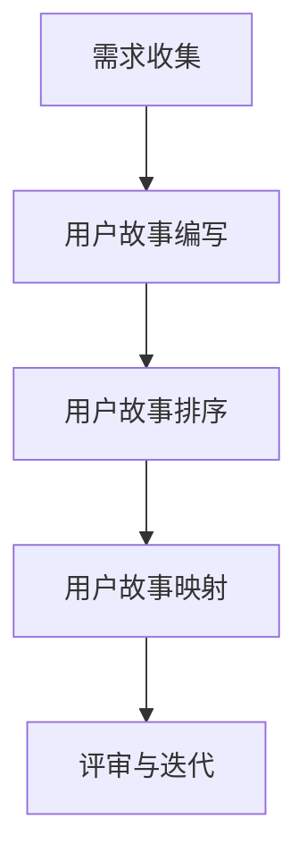
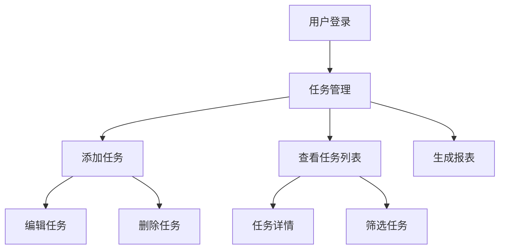

                 


### 撰写技术博客文章——用户故事映射技术在大型应用开发中的应用

#### 文章关键词

用户故事映射、大型应用开发、敏捷开发、需求分析、软件架构、流程优化

#### 文章摘要

本文将深入探讨用户故事映射技术在大型应用开发中的应用。我们将从用户故事映射的基础概念开始，逐步分析其在大型应用开发中的核心作用和挑战，并通过具体实例阐述其实际操作方法和效果。文章还将探讨用户故事映射背后的核心算法原理，并介绍如何构建数学模型进行用户故事优先级评估。最后，我们将通过一个实际案例展示用户故事映射技术的实施过程，总结最佳实践，并提供进一步阅读的建议。

---

#### 引言

在当今快速变化的技术时代，软件开发项目的成功越来越依赖于敏捷开发方法。用户故事映射作为一种敏捷需求分析方法，已经成为大型应用开发中的重要工具。本文旨在详细介绍用户故事映射技术在大型应用开发中的应用，帮助开发团队更好地理解用户需求，优化开发流程，提升项目成功率。

### 第一步：用户故事映射简介

#### 1.1 用户故事映射概述

用户故事映射是一种将用户需求、功能点、优先级等信息以可视化形式呈现的方法。它通常由一组用户故事组成，这些故事描述了用户如何与产品进行交互，以及产品需要实现的功能。

#### 1.2 用户故事映射的重要性

用户故事映射对于大型应用开发具有重要意义。首先，它有助于明确用户需求，确保开发工作始终围绕用户价值进行。其次，用户故事映射可以促进跨部门协作，提升团队沟通效率。此外，用户故事映射还有助于发现潜在风险和优化项目进度。

#### 1.3 大型应用开发中的挑战

在大型应用开发过程中，团队往往面临以下挑战：
- **需求变化频繁**：随着市场和技术的发展，用户需求不断变化，导致项目进度波动。
- **团队协作困难**：大型项目涉及多个部门和角色，沟通和协作成本高。
- **资源分配不均**：在项目过程中，资源分配往往难以做到精准，可能导致项目延误或质量下降。

#### 1.4 用户故事映射流程概述

用户故事映射的流程通常包括以下步骤：
1. **需求收集**：通过与用户沟通，了解他们的需求和行为。
2. **用户故事编写**：根据需求收集信息，编写用户故事。
3. **用户故事排序**：对用户故事进行优先级排序，确保开发工作有序进行。
4. **用户故事映射**：将用户故事以可视化形式呈现，展示用户需求、功能点及其关系。

### 第二步：核心概念与联系

#### 2.1 用户故事定义与结构

用户故事是用户故事映射的核心元素。一个典型的用户故事通常包含以下结构：
- **用户**：描述与产品交互的用户。
- **角色**：用户在产品中的角色。
- **目标**：用户希望通过产品实现的目标。

例如：“作为用户，我想能够添加新任务，以便管理我的日常工作。”

#### 2.2 用户故事编写要点

编写用户故事时，需要注意以下几点：
- **简洁明了**：用户故事应简洁明了，避免冗长和复杂。
- **具体明确**：用户故事应具体明确，描述用户行为的实际场景。
- **可测试性**：用户故事应具备可测试性，确保开发工作有明确的目标。

#### 2.3 用户故事优先级排序

在用户故事映射过程中，优先级排序至关重要。常见的排序方法包括：
- **优先级矩阵**：根据用户故事的重要性和紧急性进行排序。
- **MoSCoW方法**：将用户故事分为“必须”、“应该”、“可以”、“可能不”四个优先级。

#### 2.4 用户故事映射流程图

用户故事映射流程可以用以下Mermaid流程图表示：



### 第三步：核心算法原理讲解

#### 3.1 用户故事映射算法

用户故事映射涉及多个算法，其中关键算法包括：
- **层次结构算法**：将用户故事按照层次结构进行组织。
- **用户交互场景算法**：根据用户与产品的交互场景，将用户故事进行分组。
- **故事映射算法**：将用户故事映射到产品功能模块。

#### 3.2 Pseudo-code for User Story Mapping

以下是一个用户故事映射的伪代码示例：

```python
# Pseudo-code for User Story Mapping

function user_story_mapping(user_stories):
    # Initialize empty data structures
    story_map = {}
    hierarchy = []
    
    # Organize user stories into a hierarchy
    for story in user_stories:
        if story.parent is None:
            hierarchy.append(story)
        else:
            story_map[story.parent.id].append(story)
    
    # Sort hierarchy based on priority
    sorted_hierarchy = sort(hierarchy, key=lambda x: x.priority)
    
    # Map user stories to product modules
    for story in sorted_hierarchy:
        if story.module is not None:
            map_story_to_module(story, story.module)
    
    # Return the final story map
    return story_map

function map_story_to_module(story, module):
    # Map the user story to the specified module
    module.user_stories.append(story)
```

#### 3.3 用户故事映射算法示例

假设我们有以下一组用户故事：

```plaintext
Story 1: 用户登录
Story 2: 添加新任务
Story 3: 完成任务
Story 4: 查看任务列表
Story 5: 修改任务详情
```

用户故事映射算法可以将这些故事映射到以下模块：

```plaintext
模块1：用户登录
模块2：任务管理
  - 模块2.1：添加新任务
  - 模块2.2：完成任务
  - 模块2.3：查看任务列表
  - 模块2.4：修改任务详情
```

### 第四步：数学模型与详细解释

#### 4.1 用户故事优先级评估模型

为了更好地评估用户故事的优先级，我们可以使用以下数学模型：

- **用户故事优先级（P）**：综合考虑用户故事的重要性（R）、实现难度（I）和依赖关系（D）。

公式如下：

$$P = w_1 \times R + w_2 \times I + w_3 \times D$$

其中，$w_1, w_2, w_3$分别为权重，分别代表重要性、实现难度和依赖关系的相对重要性。

#### 4.2 影响分析模型

为了评估用户故事对项目整体的影响，我们可以使用以下模型：

- **用户故事影响（I）**：综合考虑功能因素（F）、安全因素（S）和价值因素（V）。

公式如下：

$$I = a \times F + b \times S + c \times V$$

其中，$a, b, c$分别为权重，分别代表功能因素、安全因素和价值因素的相对重要性。

#### 4.3 公式示例

假设我们有以下一组用户故事：

- 用户故事A：重要性（R）为5，实现难度（I）为2，依赖关系（D）为3。
- 用户故事B：重要性（R）为3，实现难度（I）为4，依赖关系（D）为1。

使用优先级评估模型，我们可以计算出：

$$P(A) = 0.5 \times 5 + 0.3 \times 2 + 0.2 \times 3 = 3.4$$
$$P(B) = 0.5 \times 3 + 0.3 \times 4 + 0.2 \times 1 = 2.1$$

可以看出，用户故事A的优先级高于用户故事B。

### 实际案例：用户故事映射在大型项目中的应用

#### 5.1 项目背景

假设我们正在开发一款企业级项目管理软件。该项目涉及到多个功能模块，包括用户管理、任务管理、项目管理、报表分析等。为了确保项目顺利进行，我们需要使用用户故事映射技术来明确用户需求，优化开发流程。

#### 5.2 用户故事收集

通过与项目经理、产品经理和客户进行沟通，我们收集到了以下用户故事：

- 用户故事1：用户能够快速登录系统。
- 用户故事2：用户能够添加、编辑和删除任务。
- 用户故事3：用户能够查看任务列表和任务详情。
- 用户故事4：用户能够根据任务类型、优先级和截止日期筛选任务。
- 用户故事5：用户能够生成项目进度报表。

#### 5.3 用户故事排序

使用MoSCoW方法，我们将用户故事进行排序：

- **必须**：用户故事1、用户故事2、用户故事3
- **应该**：用户故事4
- **可以**：用户故事5

#### 5.4 用户故事映射

根据用户故事，我们创建了以下用户故事映射图：



#### 5.5 开发环境搭建

为了实现用户故事映射，我们搭建了以下开发环境：

- **前端**：使用Vue.js框架搭建用户界面。
- **后端**：使用Spring Boot框架实现业务逻辑。
- **数据库**：使用MySQL数据库存储用户数据。

#### 5.6 源代码实现与代码解读

以下是一个用户故事（用户登录）的实现示例：

```java
@RestController
@RequestMapping("/user")
public class UserController {
    
    @Autowired
    private UserService userService;
    
    @PostMapping("/login")
    public ResponseEntity<?> login(@RequestBody LoginRequest loginRequest) {
        User user = userService.login(loginRequest.getUsername(), loginRequest.getPassword());
        if (user != null) {
            return ResponseEntity.ok(new LoginResponse(user.getId(), user.getUsername()));
        } else {
            return ResponseEntity.badRequest().body("登录失败");
        }
    }
}
```

#### 5.7 代码应用解读与分析

用户登录功能的实现主要包括以下步骤：

1. 接收用户输入的用户名和密码。
2. 调用UserService类的login方法，验证用户名和密码。
3. 如果验证通过，返回用户的ID和用户名；否则，返回错误信息。

#### 5.8 项目小结

通过用户故事映射技术，我们成功地明确了用户需求，优化了开发流程。在实际开发过程中，我们按照用户故事的优先级逐步实现了各个功能模块，确保了项目的顺利进行。用户故事映射技术不仅提高了团队沟通效率，还帮助我们在项目过程中及时发现并解决问题，提升了项目质量。

### 最佳实践与注意事项

- **定期更新用户故事映射图**：随着项目进展，用户需求可能发生变化。定期更新用户故事映射图有助于确保开发工作与实际需求保持一致。
- **保持用户故事简洁明了**：用户故事应尽量简洁明了，避免冗长和复杂，以确保开发团队能够快速理解和实施。
- **充分考虑用户故事优先级**：在项目开发过程中，应优先考虑高优先级用户故事，确保关键功能得到及时实现。

### 拓展阅读

- 《用户故事映射：软件开发的敏捷需求方法》
- 《敏捷实践指南》
- 《敏捷需求管理：产品经理的实践指南》

---

**作者：AI天才研究院/AI Genius Institute & 禅与计算机程序设计艺术/Zen And The Art of Computer Programming**

本文通过逻辑清晰、结构紧凑的方式，详细介绍了用户故事映射技术在大型应用开发中的应用。从核心概念到算法原理，再到实际案例，本文旨在帮助读者全面了解用户故事映射技术，并在实际项目中有效运用。希望本文能为您的软件开发工作提供有益的启示和帮助。

