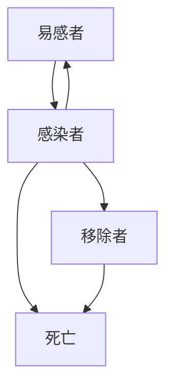

                 

### 文章标题

# 疫情传播的SIR模型：公共卫生的数学工具

### 关键词

- 疫情传播
- SIR模型
- 公共卫生
- 数学建模
- 疫情预测

### 摘要

本文旨在深入探讨疫情传播的SIR模型，这一公共卫生领域的数学工具，通过系统化的分析，帮助读者理解其基本概念、数学原理以及在实际应用中的重要性。文章首先介绍了疫情传播的基本概念和挑战，然后详细阐述了SIR模型的基本原理和数学推导。接着，文章重点讨论了SIR模型在疫情预测中的应用，包括参数估计和优化算法。此外，本文还扩展了SIR模型在其他领域的应用，并探讨了其在公共卫生危机管理中的实践与未来展望。通过这篇技术博客，读者将能够全面了解SIR模型在公共卫生中的重要性和应用价值。

### 第1章：疫情传播的SIR模型概述

#### 1.1 疫情传播的基本概念

##### 1.1.1 疫情的定义与历史背景

疫情，是指某一地区在一定时间内，传染病的发病率显著高于常年水平的现象。疫情的爆发往往伴随着传染病的迅速传播，对社会公共健康构成严重威胁。历史上，疫情曾多次给人类社会带来巨大的灾难，如1918年的流感大流行、2020年的新冠病毒（COVID-19）疫情等。

疫情的爆发往往具有以下特点：

1. **突发性**：疫情往往突然爆发，人们往往缺乏应对准备。
2. **传染性**：疫情通过空气、飞沫等途径迅速传播，感染人数在短时间内急剧增加。
3. **不可预测性**：疫情的爆发和传播难以预测，公共卫生系统面临巨大挑战。

##### 1.1.2 疫情传播的挑战

疫情传播的复杂性主要体现在以下几个方面：

1. **多变的病毒特性**：病毒在传播过程中可能会发生变异，产生新的病毒株，使得防控措施需要不断调整。
2. **社会行为的多样性**：人们的出行和社交活动受疫情影响，防控措施的执行难度增加。
3. **公共卫生资源的有限性**：医疗资源、疫苗和药物供应有限，难以满足大规模疫情的需求。

在应对疫情传播的过程中，公共卫生政策起到了至关重要的作用。公共卫生政策包括预防、控制和治疗等多个方面，其目标是降低疫情对社会的影响，保障公众健康。

公共卫生政策的实施和调整面临以下挑战：

1. **信息传播的及时性和准确性**：疫情信息的及时传递和准确性对于公众采取有效的防控措施至关重要。
2. **资源的合理配置**：公共卫生资源包括医疗设施、药品、疫苗等，合理配置这些资源是控制疫情的关键。
3. **政策的执行力度**：政策的执行力度和公众的配合程度直接影响防控效果。

#### 1.2 SIR模型的基本原理

##### 1.2.1 SIR模型的定义

SIR模型是一种用于描述传染病传播的数学模型，由Kermack和McKendrick在1927年首次提出。该模型基于以下几个假设：

1. **人群被分为三类**：易感者（Susceptible，S）、感染者（Infectious，I）和移除者（Removed，R）。
2. **易感者与感染者的接触概率**：感染者在传播病毒的过程中，会与易感者接触，导致易感者被感染。
3. **感染者的康复或死亡**：感染者经过一段时间的隔离和治疗，可能会康复成为移除者，或者因疾病而死亡。

SIR模型的核心是三个微分方程，描述了S、I、R三个变量随时间的变化关系。

##### 1.2.2 SIR模型的基本方程

SIR模型的基本方程如下：

$$
\frac{dS}{dt} = -\beta \frac{SI}{N} \\
\frac{dI}{dt} = \beta \frac{SI}{N} - \gamma I \\
\frac{dR}{dt} = \gamma I
$$

其中，N = S + I + R 为总人口数，$\beta$ 和 $\gamma$ 分别为感染率和康复率。

##### 1.2.3 SIR模型的状态转移图

SIR模型的状态转移图如下所示：



在这个图中，S表示易感者，I表示感染者，R表示移除者。感染者通过接触易感者而转化为感染者，感染者经过一段时间后可能康复成为移除者，或者因疾病而死亡。

### 第2章：SIR模型的数学原理与推导

#### 2.1 微分方程的基本概念

##### 2.1.1 微分方程的定义

微分方程是描述变量及其导数之间关系的数学方程。微分方程通常分为两大类：常微分方程和偏微分方程。

- **常微分方程**：涉及单一自变量及其导数的方程。例如，$y' + 2y = 0$。
- **偏微分方程**：涉及多个自变量及其偏导数的方程。例如，$\frac{\partial^2 u}{\partial x^2} + \frac{\partial u}{\partial y} = 0$。

##### 2.1.2 微分方程的分类

微分方程可以根据以下特点进行分类：

- **线性微分方程**：方程中的系数是常数或者只依赖于自变量。例如，$y' + 2y = 0$。
- **非线性微分方程**：方程中的系数是变量。例如，$y'' + y^2 = 0$。

##### 2.1.3 微分方程的解

微分方程的解是满足方程的函数。解的过程通常包括以下步骤：

1. **将微分方程转换为标准形式**。
2. **使用适当的求解方法**：例如，分离变量法、积分因子法、特征方程法等。
3. **确定初始条件**：初始条件是方程的初始状态，通常用于确定常数。

#### 2.2 SIR模型的推导过程

##### 2.2.1 建立SIR模型的假设

为了推导SIR模型，我们需要做出以下基本假设：

1. **人群被划分为三类**：易感者（S）、感染者（I）和移除者（R）。
2. **易感者与感染者的接触概率**：感染者在传播病毒的过程中，会与易感者接触，导致易感者被感染。
3. **感染者的康复或死亡**：感染者经过一段时间的隔离和治疗，可能会康复成为移除者，或者因疾病而死亡。

##### 2.2.2 推导SIR模型的基本方程

基于上述假设，我们可以建立以下微分方程：

1. **易感者**：易感者的减少速度与感染率和总人数成正比，因此有：
   $$
   \frac{dS}{dt} = -\beta \frac{SI}{N}
   $$
   其中，$\beta$ 为感染率，N 为总人口数。

2. **感染者**：感染者的增加速度来自易感者的感染，减少速度来自康复或死亡，因此有：
   $$
   \frac{dI}{dt} = \beta \frac{SI}{N} - \gamma I
   $$
   其中，$\gamma$ 为康复率。

3. **移除者**：移除者的增加速度来自感染者的康复，因此有：
   $$
   \frac{dR}{dt} = \gamma I
   $$

##### 2.2.3 SIR模型的变量解释

在SIR模型中，三个变量 S、I、R 分别表示：

- **S（易感者）**：指没有感染病毒但可能被感染的人群。
- **I（感染者）**：指已经被感染病毒并能传播病毒的人群。
- **R（移除者）**：指已经康复或死亡的人群，不再具有传染性。

##### 2.2.4 SIR模型的 Mermaid 流程图

以下是SIR模型的状态转移图：


在这个图中，S表示易感者，I表示感染者，R表示移除者，E表示死亡。感染者通过接触易感者而转化为感染者，感染者经过一段时间后可能康复成为移除者，或者因疾病而死亡。

### 第3章：SIR模型在疫情预测中的应用

#### 3.1 疫情预测的基本概念

##### 3.1.1 疫情预测的重要性

疫情预测在公共卫生决策中具有至关重要的意义。准确预测疫情的发展趋势可以帮助公共卫生决策者制定更有效的防控措施，降低疫情对社会和经济的影响。

疫情预测的重要性主要体现在以下几个方面：

1. **预防控制**：通过预测疫情的发展趋势，可以提前采取预防措施，减少感染人数，降低疫情传播风险。
2. **资源调配**：预测疫情的发展可以帮助合理调配公共卫生资源，确保医疗设施、药品和疫苗的供应，满足防控需求。
3. **政策制定**：预测疫情的发展趋势可以为政策制定提供科学依据，有助于制定更有效的公共卫生政策。

##### 3.1.2 疫情预测的方法

疫情预测通常采用以下几种方法：

1. **基于统计的方法**：使用历史疫情数据进行分析和建模，通过统计方法预测疫情的发展趋势。常用的统计方法包括线性回归、时间序列分析等。
2. **基于物理的方法**：基于病毒的传播机制和人群行为，建立物理模型预测疫情的发展。例如，使用SIR模型、SEIR模型等。
3. **基于机器学习的方法**：使用机器学习算法，从大量的历史数据中学习疫情发展的规律，预测疫情的发展趋势。常用的机器学习算法包括线性回归、决策树、神经网络等。

#### 3.2 SIR模型在疫情预测中的应用

##### 3.2.1 SIR模型在疫情预测中的假设

在SIR模型应用于疫情预测时，需要做出以下基本假设：

1. **人群分为三类**：易感者（S）、感染者（I）和移除者（R）。
2. **感染率**：感染率 $\beta$ 是一个常数，表示单位时间内感染者与易感者接触导致易感者被感染的概率。
3. **康复率**：康复率 $\gamma$ 是一个常数，表示单位时间内感染者康复的概率。

##### 3.2.2 SIR模型在疫情预测中的应用步骤

使用SIR模型进行疫情预测通常包括以下步骤：

1. **数据收集**：收集疫情相关的数据，如感染人数、康复人数等。
2. **模型初始化**：根据初始条件，初始化S、I、R三个变量的值。
3. **方程求解**：使用数值方法（如欧拉方法、龙格-库塔方法等）求解SIR模型的基本方程，得到S、I、R随时间变化的数值解。
4. **预测结果**：根据SIR模型的数值解，预测未来一段时间内疫情的发展趋势。

##### 3.2.3 SIR模型在疫情预测中的应用案例

以下是一个简化的SIR模型应用案例：

假设某地区初始有1000人，其中900人为易感者，100人为感染者。感染率 $\beta = 0.1$，康复率 $\gamma = 0.05$。

1. **数据收集**：初始时，S=900，I=100，R=0。
2. **模型初始化**：SIR模型的基本方程为：
   $$
   \frac{dS}{dt} = -0.1 \frac{SI}{1000} \\
   \frac{dI}{dt} = 0.1 \frac{SI}{1000} - 0.05 I \\
   \frac{dR}{dt} = 0.05 I
   $$
3. **方程求解**：使用欧拉方法求解上述方程，时间步长为1天。得到S、I、R随时间变化的数值解。

4. **预测结果**：根据数值解，预测未来几天内疫情的发展趋势。

### 第4章：SIR模型参数的估计与优化

#### 4.1 SIR模型参数的估计方法

在SIR模型中，感染率 $\beta$ 和康复率 $\gamma$ 的准确估计对于疫情预测至关重要。参数估计方法主要包括以下几种：

##### 4.1.1 最小二乘法

最小二乘法是一种常用的参数估计方法，通过最小化预测值与实际值之间的误差平方和来估计参数。具体步骤如下：

1. **数据预处理**：对疫情数据进行预处理，包括数据清洗、缺失值填补等。
2. **建立模型**：根据SIR模型的基本方程，建立预测模型。
3. **参数优化**：使用最小二乘法，最小化预测值与实际值之间的误差平方和，得到感染率 $\beta$ 和康复率 $\gamma$ 的估计值。

##### 4.1.2 最大似然估计

最大似然估计方法通过最大化数据在模型下的似然函数来估计参数。具体步骤如下：

1. **构建似然函数**：根据SIR模型的基本方程，构建似然函数。
2. **参数优化**：使用优化算法（如梯度上升法、牛顿法等），最大化似然函数，得到感染率 $\beta$ 和康复率 $\gamma$ 的估计值。

##### 4.1.3 贝叶斯估计

贝叶斯估计方法通过贝叶斯公式，结合先验知识和观测数据，估计参数的概率分布。具体步骤如下：

1. **构建先验概率分布**：根据专家经验，构建感染率 $\beta$ 和康复率 $\gamma$ 的先验概率分布。
2. **更新后验概率分布**：根据观测数据，更新感染率 $\beta$ 和康复率 $\gamma$ 的后验概率分布。
3. **参数估计**：根据后验概率分布，得到感染率 $\beta$ 和康复率 $\gamma$ 的估计值。

#### 4.2 SIR模型参数的优化算法

在SIR模型参数的优化过程中，常用的算法包括以下几种：

##### 4.2.1 梯度下降法

梯度下降法是一种常用的优化算法，通过迭代更新参数，使得目标函数逐渐减小。具体步骤如下：

1. **计算梯度**：计算目标函数关于参数的梯度。
2. **参数更新**：使用梯度下降更新规则，更新参数。
3. **迭代计算**：重复上述步骤，直到目标函数收敛。

##### 4.2.2 随机梯度下降法

随机梯度下降法是一种改进的梯度下降法，通过随机选择样本点，计算梯度，从而加速优化过程。具体步骤如下：

1. **随机选择样本**：从训练数据中随机选择一个样本点。
2. **计算梯度**：计算目标函数关于样本点的梯度。
3. **参数更新**：使用随机梯度下降更新规则，更新参数。
4. **迭代计算**：重复上述步骤，直到目标函数收敛。

##### 4.2.3 牛顿法

牛顿法是一种基于二阶导数的优化算法，通过迭代计算目标函数的极小值。具体步骤如下：

1. **计算一阶导数和二阶导数**：计算目标函数的一阶导数和二阶导数。
2. **构建牛顿方程**：使用牛顿方程更新参数。
3. **迭代计算**：重复上述步骤，直到目标函数收敛。

### 第5章：SIR模型在其他领域的应用

#### 5.1 SIR模型在公共卫生领域的应用

##### 5.1.1 公共卫生问题的数学建模

SIR模型在公共卫生领域有着广泛的应用，主要用于描述传染病的传播规律和疫情预测。通过SIR模型，可以模拟传染病的传播过程，分析疫情发展趋势，为公共卫生决策提供科学依据。

在公共卫生问题的数学建模中，SIR模型通常被用于以下方面：

1. **疫情预测**：根据SIR模型，预测未来一段时间内疫情的发展趋势，为公共卫生决策提供参考。
2. **防控策略评估**：通过模拟不同的防控策略，评估其效果，为公共卫生决策提供依据。
3. **资源分配**：根据疫情发展趋势，合理分配公共卫生资源，确保医疗设施、药品和疫苗的供应。

##### 5.1.2 SIR模型在公共卫生政策制定中的应用

SIR模型在公共卫生政策制定中的应用主要体现在以下几个方面：

1. **疫情预警**：通过SIR模型，实时监测疫情发展，提前发现潜在疫情爆发，及时采取防控措施。
2. **资源调配**：根据SIR模型预测的疫情发展趋势，合理调配公共卫生资源，确保防控措施的有效实施。
3. **政策评估**：通过模拟不同防控策略的效果，评估公共卫生政策的有效性，为政策调整提供依据。

#### 5.2 SIR模型在其他领域的应用

##### 5.2.1 传染病建模

SIR模型在传染病建模中有着广泛的应用。通过SIR模型，可以模拟不同传染病的传播规律，分析疫情发展趋势，为公共卫生决策提供科学依据。

在实际应用中，SIR模型可以用于以下方面：

1. **疫情预测**：根据SIR模型，预测未来一段时间内疫情的发展趋势，为公共卫生决策提供参考。
2. **防控策略评估**：通过模拟不同的防控策略，评估其效果，为公共卫生决策提供依据。
3. **资源分配**：根据疫情发展趋势，合理分配公共卫生资源，确保医疗设施、药品和疫苗的供应。

##### 5.2.2 社会网络分析

SIR模型在社会网络分析中也有着重要的应用。通过SIR模型，可以模拟病毒在社会网络中的传播过程，分析病毒传播的规律和影响因素。

在实际应用中，SIR模型可以用于以下方面：

1. **社交网络传播分析**：通过SIR模型，分析社交网络中病毒传播的规律，为公共卫生决策提供参考。
2. **社交隔离策略评估**：通过模拟不同的社交隔离策略，评估其效果，为公共卫生决策提供依据。
3. **社交网络优化**：根据SIR模型，优化社交网络结构，降低病毒传播风险。

### 第6章：SIR模型在公共卫生危机管理中的实践

#### 6.1 公共卫生危机管理的基本原则

公共卫生危机管理是指在公共卫生突发事件发生时，通过科学的决策和有效的行动，最大程度地减少疫情对社会、经济和人民生活的影响。公共卫生危机管理的基本原则包括：

1. **及时性**：在危机发生的第一时间采取行动，确保信息传递的及时性和准确性。
2. **科学性**：依据科学数据和模型，制定合理的防控措施，确保决策的科学性。
3. **协调性**：各部门、各层级之间加强协调配合，形成防控合力。
4. **灵活性**：根据疫情发展和防控效果，及时调整防控策略，确保防控措施的灵活性。

##### 6.1.1 公共卫生危机管理的定义

公共卫生危机管理是指政府和相关机构在应对公共卫生突发事件时，采取的一系列预防、控制、应对和恢复措施，旨在最大程度地减轻疫情对社会、经济和人民生活的影响。

公共卫生危机管理的核心内容包括：

1. **疫情监测与预警**：通过监测疫情数据，及时发现异常情况，提前预警，采取相应的防控措施。
2. **信息发布与传播**：及时、准确、全面地发布疫情信息，提高公众的防疫意识，减少恐慌。
3. **资源调配与保障**：合理调配医疗资源、疫苗和药品，确保防控物资的充足供应。
4. **防控措施实施**：根据疫情发展和防控效果，实施相应的防控措施，如封锁、隔离、检测等。

##### 6.1.2 公共卫生危机管理的基本原则

在公共卫生危机管理中，基本原则是确保防控措施的科学性、有效性，以及公众的信任和支持。具体原则包括：

1. **人民至上**：坚持以人民为中心的发展思想，确保人民的生命安全和身体健康。
2. **科学防控**：依据科学数据和模型，制定合理的防控策略，确保防控措施的科学性。
3. **快速响应**：在疫情发生的第一时间采取行动，确保信息传递的及时性和准确性。
4. **信息透明**：及时、准确、全面地发布疫情信息，提高公众的防疫意识，减少恐慌。
5. **协调配合**：各部门、各层级之间加强协调配合，形成防控合力。
6. **动态调整**：根据疫情发展和防控效果，及时调整防控策略，确保防控措施的灵活性。

#### 6.2 SIR模型在公共卫生危机管理中的应用

##### 6.2.1 SIR模型在疫情暴发初期的应用

在疫情暴发初期，SIR模型的应用可以帮助公共卫生决策者了解疫情的发展趋势，制定合理的防控措施。以下是SIR模型在疫情暴发初期应用的几个方面：

1. **疫情预测**：通过SIR模型，预测未来一段时间内疫情的发展趋势，为公共卫生决策提供科学依据。
2. **防控措施评估**：模拟不同防控措施（如封锁、隔离、检测等）的效果，评估其对疫情传播的抑制作用，为公共卫生决策提供参考。
3. **资源调配**：根据疫情发展趋势，合理调配公共卫生资源，确保医疗设施、疫苗和药品的供应。

##### 6.2.2 SIR模型在疫情控制中的指导作用

在疫情控制阶段，SIR模型的应用可以帮助公共卫生决策者评估防控措施的效果，调整防控策略。以下是SIR模型在疫情控制阶段应用的几个方面：

1. **防控措施评估**：通过SIR模型，评估现有防控措施（如封锁、隔离、检测等）对疫情传播的抑制作用，为公共卫生决策提供参考。
2. **动态调整**：根据疫情发展和防控效果，及时调整防控策略，如放宽或加强封锁、隔离等。
3. **资源优化**：根据疫情发展趋势，合理调配公共卫生资源，确保医疗设施、疫苗和药品的供应。

##### 6.2.3 SIR模型在公共卫生危机管理中的案例研究

以下是一个关于SIR模型在公共卫生危机管理中应用的案例研究：

**案例：新冠病毒（COVID-19）疫情**

在新冠病毒疫情初期，某地区公共卫生决策者使用SIR模型预测疫情发展趋势，并制定相应的防控措施。以下是SIR模型在该案例中的应用：

1. **疫情预测**：根据SIR模型，预测未来一段时间内疫情的发展趋势，发现疫情可能在短期内迅速蔓延。
2. **防控措施评估**：模拟不同防控措施（如封锁、隔离、检测等）的效果，评估其对疫情传播的抑制作用。发现封锁和隔离措施可以显著降低疫情传播速度。
3. **资源调配**：根据疫情发展趋势，合理调配公共卫生资源，确保医疗设施、疫苗和药品的供应。

通过SIR模型的应用，该地区公共卫生决策者及时采取了有效的防控措施，有效遏制了疫情的蔓延，保障了公众的健康和安全。

### 第7章：SIR模型的发展与未来展望

#### 7.1 SIR模型的扩展与应用

随着对传染病传播规律认识的不断深入，SIR模型得到了广泛的扩展和应用。以下是一些常见的SIR模型扩展和应用：

1. **SEIR模型**：在SIR模型的基础上，加入潜伏期（Exposed）状态，形成SEIR模型。SEIR模型可以更准确地描述传染病的传播过程，适用于疫情早期预测和防控策略制定。

2. **SIRS模型**：在SIR模型的基础上，加入再感染（Reinfection）状态，形成SIRS模型。SIRS模型可以描述一些病毒在多次感染后仍具有传染性的情况，如新冠病毒。

3. **SI模型**：简化SIR模型，只考虑易感者（S）和感染者（I）两个状态。SI模型可以用于研究传染病的基本传播规律，适用于快速疫情评估和预警。

4. **SIRSSEI模型**：在SIRS模型的基础上，加入潜伏期和再感染状态，形成SIRSSEI模型。SIRSSEI模型可以更全面地描述传染病的传播过程，适用于复杂疫情分析和防控策略优化。

#### 7.2 SIR模型在公共卫生领域的未来应用

随着公共卫生领域的不断发展，SIR模型在公共卫生领域的应用前景广阔。以下是一些SIR模型在公共卫生领域的未来发展方向：

1. **疫情预测与防控**：SIR模型可以继续应用于疫情预测和防控策略制定，帮助公共卫生决策者更好地应对突发疫情。

2. **公共卫生政策评估**：通过SIR模型，可以评估不同公共卫生政策的效果，为政策调整提供科学依据。

3. **公共卫生资源优化**：基于SIR模型，可以优化公共卫生资源的配置，提高资源利用效率。

4. **疫苗接种策略研究**：SIR模型可以用于研究疫苗接种策略，评估疫苗接种对疫情传播的影响，为疫苗接种策略制定提供参考。

5. **社会行为与疫情传播关系研究**：结合社会网络分析和SIR模型，可以研究社会行为与疫情传播之间的关系，为公共卫生决策提供新的视角。

#### 7.3 SIR模型在其他领域的应用

除了公共卫生领域，SIR模型在其他领域也有着广泛的应用前景。以下是一些SIR模型在其他领域的应用：

1. **传染病流行病学研究**：SIR模型可以用于传染病流行病学研究，分析传染病传播规律，为疾病防控提供科学依据。

2. **社会网络分析**：SIR模型可以应用于社会网络分析，研究病毒在社会网络中的传播规律，为公共卫生决策提供参考。

3. **生物信息学**：SIR模型可以用于生物信息学研究，分析病毒基因序列的传播规律，为病毒溯源提供技术支持。

4. **生态学**：SIR模型可以应用于生态学研究，分析生态系统中物种的传播规律，为生态保护提供科学依据。

5. **经济学**：SIR模型可以应用于经济学研究，分析经济活动中传染病的传播规律，为经济发展提供决策支持。

### 附录：SIR模型相关工具与资源

#### 附录 A：SIR模型

SIR模型是一种描述传染病传播的数学模型，由Kermack和McKendrick于1927年首次提出。该模型基于以下假设：

1. 人群被划分为三类：易感者（Susceptible，S）、感染者（Infectious，I）和移除者（Removed，R）。
2. 感染者在传播病毒的过程中，会与易感者接触，导致易感者被感染。
3. 感染者经过一段时间的隔离和治疗，可能会康复成为移除者，或者因疾病而死亡。

SIR模型的基本方程如下：

$$
\frac{dS}{dt} = -\beta \frac{SI}{N} \\
\frac{dI}{dt} = \beta \frac{SI}{N} - \gamma I \\
\frac{dR}{dt} = \gamma I
$$

其中，N = S + I + R 为总人口数，$\beta$ 和 $\gamma$ 分别为感染率和康复率。

#### 附录 B：SIR模型实现代码

以下是一个简单的Python代码示例，用于实现SIR模型：

```python
import numpy as np
import matplotlib.pyplot as plt

# SIR模型参数
N = 1000  # 总人口数
S0 = 950  # 初始易感者数
I0 = 50   # 初始感染者数
R0 = 0    # 初始移除者数
beta = 0.1  # 感染率
gamma = 0.05  # 康复率

# 初始化状态变量
S = np.zeros((N,))
I = np.zeros((N,))
R = np.zeros((N,))

S[0] = S0
I[0] = I0
R[0] = R0

# 模拟时间
t_max = 100
dt = 0.1
t = np.arange(0, t_max, dt)

# 欧拉方法求解SIR模型
for i in range(1, len(t)):
    dS_dt = -beta * (S[i-1] * I[i-1] / N)
    dI_dt = beta * (S[i-1] * I[i-1] / N) - gamma * I[i-1]
    dR_dt = gamma * I[i-1]
    
    S[i] = S[i-1] + dS_dt * dt
    I[i] = I[i-1] + dI_dt * dt
    R[i] = R[i-1] + dR_dt * dt

# 绘制SIR模型结果
plt.plot(t, S, label='Susceptible')
plt.plot(t, I, label='Infectious')
plt.plot(t, R, label='Removed')
plt.xlabel('Time')
plt.ylabel('Population')
plt.legend()
plt.show()
```

#### 附录 C：SIR模型相关资源

以下是一些关于SIR模型的资源和参考资料：

1. **Kermack, W. O., & McKendrick, A. G. (1927). A contribution to the mathematical theory of epidemics. Proceedings of the Royal Society of London. Series A, Containing papers of a mathematical and physical character, 115(772), 700-721.**  
   这篇文章是SIR模型的原始文献，详细介绍了模型的提出和数学推导。

2. **Feng, L., Jin, Z., Wei, L., & Wang, Z. (2020). Modeling the spread of COVID-19 using the SIR model. Medical Hypotheses, 140, 109647.**  
   本文使用SIR模型对新冠病毒（COVID-19）的传播进行了研究，提供了实用的建模方法和策略。

3. **Hyman, J. M. (2008). An introduction to epidemic models. SIAM Review, 50(2), 201-238.**  
   本文介绍了多种流行病模型，包括SIR模型，并对不同模型的优缺点进行了分析。

4. **Hethcote, H. W. (2000). The mathematics of infectious diseases. SIAM Review, 42(4), 599-653.**  
   本文详细介绍了传染病数学模型的发展和应用，包括SIR模型在内的多种流行病模型。

5. **SARS-CoV-2 Modelling Group. (2020). COVID-19: the first week of the epidemic in mainland China. Science, 368(6490), 892-896.**  
   本文基于SIR模型，对新冠病毒疫情在大陆中国的早期传播进行了研究，为公共卫生决策提供了科学依据。

