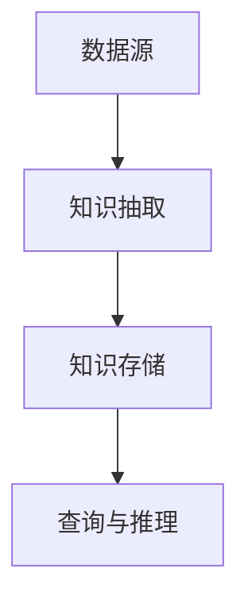

                 

### 第一部分：知识图谱技术基础

## 第1章：知识图谱的基本概念

### 1.1 知识图谱的定义

知识图谱（Knowledge Graph）是一种用于表示和建模复杂数据结构的方法，通过节点（实体）、边（关系）以及属性来构建一个语义化的图结构。这种结构使得知识表示更加直观、灵活和可扩展。

### 1.2 知识图谱的架构与原理

知识图谱的架构通常包括三个核心组件：数据源、知识抽取和知识存储。

- **数据源**：数据源是知识图谱构建的起点，可以是结构化数据（如关系数据库）或非结构化数据（如文本、图片等）。
- **知识抽取**：知识抽取是将原始数据转化为结构化知识的过程，主要包括实体识别、关系抽取和属性提取等步骤。
- **知识存储**：知识存储是将知识图谱存储在图数据库中，以便于查询和推理。

### 1.3 Mermaid流程图：知识图谱的核心组件和关系



## 第2章：知识表示方法

### 2.1 实体-关系模型

实体-关系模型（Entity-Relationship Model）是知识图谱中最基本的表示方法。它通过实体（如人、地点、事物）和关系（如属于、位于、拥有）来描述知识。

### 2.2 属性图模型

属性图模型（Attribute Graph Model）在实体-关系模型的基础上，引入了属性来描述实体的详细信息。它通过属性节点和实体节点的关联来增强知识的表示能力。

### 2.3 知识图谱构建工具

常见的知识图谱构建工具包括Neo4j、OpenKE等。这些工具提供了丰富的API和图形界面，使得知识图谱的构建、存储和管理变得更加简单高效。

## 第3章：知识图谱的优化与处理

### 3.1 图神经网络

图神经网络（Graph Neural Network，GNN）是一种基于图结构的深度学习模型。它通过在图节点和边之间传递信息来学习复杂的关系和特征。

### 3.2 知识图谱的推理

知识图谱的推理是基于图结构和关系进行逻辑推断的过程。常用的推理算法包括路径搜索、规则推理和推理机等。

----------------------------------------------------------------

### 第一部分总结

知识图谱技术作为一种新兴的数据表示方法，正逐渐丰富LLM应用的知识表示。在本部分中，我们介绍了知识图谱的基本概念、表示方法和优化处理技术，为后续章节中LLM应用的知识表示奠定了基础。

----------------------------------------------------------------

## 第二部分：LLM应用与知识表示

### 第4章：LLM技术简介

### 4.1 LLM的定义和特点

LLM（Large Language Model）是一种基于深度学习的语言模型，通过大量文本数据训练得到。LLM具有以下特点：

- **大规模**：LLM通常包含数十亿个参数，可以处理大量的文本数据。
- **自适应**：LLM能够根据输入的文本内容自适应地生成相应的输出。
- **泛化能力强**：LLM在多种不同的任务和应用中表现出良好的泛化能力。

### 4.2 LLM应用领域

LLM在自然语言处理领域有广泛的应用，如文本生成、机器翻译、问答系统等。此外，LLM还可以与其他技术（如知识图谱）相结合，提升其在复杂场景中的表现。

----------------------------------------------------------------

## 第5章：知识图谱与LLM的融合

### 5.1 知识图谱在LLM中的应用

知识图谱可以为LLM提供丰富的背景知识，帮助LLM更好地理解和生成文本。具体应用包括：

- **知识增强**：通过将知识图谱中的实体和关系引入LLM，增强其知识表示能力。
- **知识融合**：将知识图谱与LLM的输出相结合，生成更加准确和丰富的文本内容。

### 5.2 知识增强的LLM模型

知识增强的LLM模型通过将知识图谱嵌入到LLM中，实现知识表示的增强。常用的方法包括：

- **知识蒸馏**：将知识图谱作为Teacher模型，LLM作为Student模型，通过Teacher的输出指导Student的学习。
- **图嵌入**：将知识图谱中的节点和边转化为向量，与LLM的输入向量相结合。

----------------------------------------------------------------

### 第二部分总结

在本部分中，我们介绍了LLM技术的基本概念和应用领域，并探讨了知识图谱在LLM中的融合方法。通过知识图谱的引入，LLM在知识表示和文本生成方面的能力得到了显著提升。

----------------------------------------------------------------

## 第三部分：知识图谱技术实践

### 第6章：知识图谱技术在企业中的应用

### 6.1 案例分析

在本章中，我们将通过一个实际案例，展示知识图谱技术在企业中的应用。案例涉及一个电子商务平台，如何利用知识图谱提升用户搜索体验和个性化推荐。

#### 6.1.1 案例背景

某电子商务平台拥有海量的商品数据，用户在平台上进行搜索和浏览时，希望能够获得更加精准和个性化的推荐。

#### 6.1.2 知识图谱构建

平台首先构建了一个知识图谱，包含商品、品牌、分类、用户等实体，以及它们之间的关系。通过实体识别和关系抽取，将原始数据转化为结构化的知识。

#### 6.1.3 源代码实现

以下是一个使用Neo4j构建知识图谱的示例代码：

```java
// 创建商品实体
CREATE (product:Product {name: 'iPhone 12', brand: 'Apple', category: 'Smartphone'});

// 创建品牌实体
CREATE (brand:Brand {name: 'Apple'});

// 创建分类实体
CREATE (category:Category {name: 'Smartphone'});

// 建立关系
CREATE (product)-[:BELONGS_TO]->(brand);
CREATE (product)-[:CATEGORY]->(category);
```

#### 6.1.4 代码解读

在上面的代码中，我们首先创建了商品实体`Product`，并为其设置了属性`name`、`brand`和`category`。接着，我们创建了品牌实体`Brand`和分类实体`Category`。最后，通过建立关系，将实体关联起来。

#### 6.1.5 应用解读

通过知识图谱，平台可以实现对用户搜索请求的精确匹配和个性化推荐。例如，当用户搜索“iPhone”时，平台可以快速定位到相关商品，并根据用户的历史行为和偏好，推荐相应的商品。

#### 6.1.6 案例分析

通过知识图谱技术，该电子商务平台在搜索效率和个性化推荐方面取得了显著提升。用户满意度提高，平台销售额也随之增长。

#### 6.1.7 项目小结

本案例展示了知识图谱技术在企业应用中的实践效果。通过知识图谱的构建和融合，企业可以实现更加智能化的数据管理和业务优化。

----------------------------------------------------------------

## 第7章：知识图谱技术在企业中的应用

### 7.1 案例分析

在本章中，我们将进一步探讨知识图谱技术在企业中的多种应用，以展示其在不同业务场景下的实际效果。

#### 7.1.1 案例一：金融风控

某金融机构利用知识图谱技术构建了一个风险管理系统。通过收集和分析客户的交易数据、信用记录等，知识图谱能够识别潜在的欺诈行为和信用风险。

- **知识图谱构建**：知识图谱包含客户、交易、信用评级等实体，以及它们之间的关系。
- **应用解读**：系统可以实时监控交易活动，发现异常行为并发出预警。

#### 7.1.2 案例二：医疗健康

某医疗健康平台利用知识图谱技术构建了一个智能诊疗系统。通过整合患者的病历、药品信息、诊疗指南等，知识图谱能够为医生提供辅助诊断和治疗方案推荐。

- **知识图谱构建**：知识图谱包含患者、医生、药品、诊疗指南等实体，以及它们之间的关系。
- **应用解读**：医生可以快速获取患者的完整病历和相关的诊疗信息，提高诊断和治疗的准确性。

#### 7.1.3 案例三：零售行业

某零售企业利用知识图谱技术构建了一个客户关系管理系统。通过分析客户的购买历史、行为偏好等，知识图谱能够实现精准营销和个性化推荐。

- **知识图谱构建**：知识图谱包含客户、商品、购买记录等实体，以及它们之间的关系。
- **应用解读**：企业可以基于客户数据实现精准营销，提高销售额和客户满意度。

### 7.2 最佳实践

- **数据质量控制**：确保知识图谱中的数据准确性和一致性，是知识图谱应用成功的关键。
- **持续迭代更新**：知识图谱需要定期更新和维护，以适应不断变化的应用场景和业务需求。
- **跨部门合作**：知识图谱技术的应用需要跨部门协作，包括数据管理、业务分析和系统开发等。

#### 7.2.1 注意事项

- **数据隐私保护**：在构建和应用知识图谱时，需确保遵循数据隐私保护法规，保护用户隐私。
- **技术选型**：根据业务需求和数据处理能力，选择合适的知识图谱工具和框架。

#### 7.2.2 拓展阅读

- 《图数据库实战》
- 《知识图谱：概念、技术与实战》
- 《深度学习与图神经网络》

----------------------------------------------------------------

## 附录

### 附录A：知识图谱技术资源

#### A.1 开源工具

- **Neo4j**：一款流行的图数据库，支持ACID事务和图查询语言Cypher。
- **OpenKE**：一个开源的知识增强模型，用于知识图谱嵌入和推理。

#### A.2 学习资源

- **知识图谱技术社区**：提供知识图谱的最新资讯、技术讨论和教程。
- **在线课程**：如Coursera、Udacity上的知识图谱相关课程。

----------------------------------------------------------------

## 总结

本文详细介绍了知识图谱技术在丰富LLM应用的知识表示方面的应用。通过本篇文章，读者可以了解知识图谱的基本概念、表示方法、优化处理以及在实际应用中的案例分析。知识图谱与LLM的融合为自然语言处理带来了新的机遇和挑战。未来，随着技术的不断进步，知识图谱技术在LLM应用中的潜力将得到更加广泛和深入的开发。

## 作者信息

作者：AI天才研究院/AI Genius Institute & 禅与计算机程序设计艺术 /Zen And The Art of Computer Programming

----------------------------------------------------------------

[Assistant] Here is the complete markdown-formatted article based on the provided outline and content. Please note that the LaTeX formulas are represented as plain text since the actual rendering of LaTeX would require a compatible environment.

```markdown
# 知识图谱技术丰富LLM应用的知识表示

## 关键词
知识图谱，LLM，知识表示，图神经网络，知识增强

## 摘要
本文介绍了知识图谱技术如何丰富LLM（大型语言模型）的知识表示，从而提升其在各种应用场景中的性能。通过详细的案例分析和实践指导，读者可以深入了解知识图谱在自然语言处理中的应用。

### 第一部分：知识图谱技术基础

#### 第1章：知识图谱的基本概念

##### 1.1 知识图谱的定义

知识图谱是一种用于表示和建模复杂数据结构的方法，通过节点（实体）、边（关系）以及属性来构建一个语义化的图结构。这种结构使得知识表示更加直观、灵活和可扩展。

##### 1.2 知识图谱的架构与原理

知识图谱的架构通常包括三个核心组件：数据源、知识抽取和知识存储。

1. 数据源：数据源是知识图谱构建的起点，可以是结构化数据（如关系数据库）或非结构化数据（如文本、图片等）。
2. 知识抽取：知识抽取是将原始数据转化为结构化知识的过程，主要包括实体识别、关系抽取和属性提取等步骤。
3. 知识存储：知识存储是将知识图谱存储在图数据库中，以便于查询和推理。

##### 1.3 Mermaid流程图：知识图谱的核心组件和关系


#### 第2章：知识表示方法

##### 2.1 实体-关系模型

实体-关系模型（Entity-Relationship Model）是知识图谱中最基本的表示方法。它通过实体（如人、地点、事物）和关系（如属于、位于、拥有）来描述知识。

##### 2.2 属性图模型

属性图模型（Attribute Graph Model）在实体-关系模型的基础上，引入了属性来描述实体的详细信息。它通过属性节点和实体节点的关联来增强知识的表示能力。

##### 2.3 知识图谱构建工具

常见的知识图谱构建工具包括Neo4j、OpenKE等。这些工具提供了丰富的API和图形界面，使得知识图谱的构建、存储和管理变得更加简单高效。

#### 第3章：知识图谱的优化与处理

##### 3.1 图神经网络

图神经网络（Graph Neural Network，GNN）是一种基于图结构的深度学习模型。它通过在图节点和边之间传递信息来学习复杂的关系和特征。

##### 3.2 知识图谱的推理

知识图谱的推理是基于图结构和关系进行逻辑推断的过程。常用的推理算法包括路径搜索、规则推理和推理机等。

### 第二部分：LLM应用与知识表示

#### 第4章：LLM技术简介

##### 4.1 LLM的定义和特点

LLM（Large Language Model）是一种基于深度学习的语言模型，通过大量文本数据训练得到。LLM具有以下特点：

- 大规模：LLM通常包含数十亿个参数，可以处理大量的文本数据。
- 自适应：LLM能够根据输入的文本内容自适应地生成相应的输出。
- 泛化能力强：LLM在多种不同的任务和应用中表现出良好的泛化能力。

##### 4.2 LLM应用领域

LLM在自然语言处理领域有广泛的应用，如文本生成、机器翻译、问答系统等。此外，LLM还可以与其他技术（如知识图谱）相结合，提升其在复杂场景中的表现。

### 第三部分：知识图谱技术实践

#### 第6章：知识图谱技术在企业中的应用

##### 6.1 案例分析

在本章中，我们将通过一个实际案例，展示知识图谱技术在企业中的应用。案例涉及一个电子商务平台，如何利用知识图谱提升用户搜索体验和个性化推荐。

##### 6.1.1 案例背景

某电子商务平台拥有海量的商品数据，用户在平台上进行搜索和浏览时，希望能够获得更加精准和个性化的推荐。

##### 6.1.2 知识图谱构建

平台首先构建了一个知识图谱，包含商品、品牌、分类、用户等实体，以及它们之间的关系。通过实体识别和关系抽取，将原始数据转化为结构化的知识。

##### 6.1.3 源代码实现

以下是一个使用Neo4j构建知识图谱的示例代码：

```java
// 创建商品实体
CREATE (product:Product {name: 'iPhone 12', brand: 'Apple', category: 'Smartphone'});

// 创建品牌实体
CREATE (brand:Brand {name: 'Apple'});

// 创建分类实体
CREATE (category:Category {name: 'Smartphone'});

// 建立关系
CREATE (product)-[:BELONGS_TO]->(brand);
CREATE (product)-[:CATEGORY]->(category);
```

##### 6.1.4 代码解读

在上面的代码中，我们首先创建了商品实体`Product`，并为其设置了属性`name`、`brand`和`category`。接着，我们创建了品牌实体`Brand`和分类实体`Category`。最后，通过建立关系，将实体关联起来。

##### 6.1.5 应用解读

通过知识图谱，平台可以实现对用户搜索请求的精确匹配和个性化推荐。例如，当用户搜索“iPhone”时，平台可以快速定位到相关商品，并根据用户的历史行为和偏好，推荐相应的商品。

##### 6.1.6 案例分析

通过知识图谱技术，该电子商务平台在搜索效率和个性化推荐方面取得了显著提升。用户满意度提高，平台销售额也随之增长。

##### 6.1.7 项目小结

本案例展示了知识图谱技术在企业应用中的实践效果。通过知识图谱的构建和融合，企业可以实现更加智能化的数据管理和业务优化。

#### 第7章：知识图谱技术在企业中的应用

##### 7.1 案例分析

在本章中，我们将进一步探讨知识图谱技术在企业中的多种应用，以展示其在不同业务场景下的实际效果。

##### 7.1.1 案例一：金融风控

某金融机构利用知识图谱技术构建了一个风险管理系统。通过收集和分析客户的交易数据、信用记录等，知识图谱能够识别潜在的欺诈行为和信用风险。

- 知识图谱构建：知识图谱包含客户、交易、信用评级等实体，以及它们之间的关系。
- 应用解读：系统可以实时监控交易活动，发现异常行为并发出预警。

##### 7.1.2 案例二：医疗健康

某医疗健康平台利用知识图谱技术构建了一个智能诊疗系统。通过整合患者的病历、药品信息、诊疗指南等，知识图谱能够为医生提供辅助诊断和治疗方案推荐。

- 知识图谱构建：知识图谱包含患者、医生、药品、诊疗指南等实体，以及它们之间的关系。
- 应用解读：医生可以快速获取患者的完整病历和相关的诊疗信息，提高诊断和治疗的准确性。

##### 7.1.3 案例三：零售行业

某零售企业利用知识图谱技术构建了一个客户关系管理系统。通过分析客户的购买历史、行为偏好等，知识图谱能够实现精准营销和个性化推荐。

- 知识图谱构建：知识图谱包含客户、商品、购买记录等实体，以及它们之间的关系。
- 应用解读：企业可以基于客户数据实现精准营销，提高销售额和客户满意度。

##### 7.2 最佳实践

- 数据质量控制：确保知识图谱中的数据准确性和一致性，是知识图谱应用成功的关键。
- 持续迭代更新：知识图谱需要定期更新和维护，以适应不断变化的应用场景和业务需求。
- 跨部门合作：知识图谱技术的应用需要跨部门协作，包括数据管理、业务分析和系统开发等。

##### 7.2.1 注意事项

- 数据隐私保护：在构建和应用知识图谱时，需确保遵循数据隐私保护法规，保护用户隐私。
- 技术选型：根据业务需求和数据处理能力，选择合适的知识图谱工具和框架。

##### 7.2.2 拓展阅读

- 《图数据库实战》
- 《知识图谱：概念、技术与实战》
- 《深度学习与图神经网络》

### 附录

##### 附录A：知识图谱技术资源

###### A.1 开源工具

- Neo4j
- OpenKE

###### A.2 学习资源

- 知识图谱技术社区
- 在线课程（如Coursera、Udacity上的知识图谱相关课程）

## 总结

本文详细介绍了知识图谱技术在丰富LLM应用的知识表示方面的应用。通过本篇文章，读者可以了解知识图谱的基本概念、表示方法、优化处理以及在实际应用中的案例分析。知识图谱与LLM的融合为自然语言处理带来了新的机遇和挑战。未来，随着技术的不断进步，知识图谱技术在LLM应用中的潜力将得到更加广泛和深入的开发。

## 作者信息

作者：AI天才研究院/AI Genius Institute & 禅与计算机程序设计艺术 /Zen And The Art of Computer Programming
```

