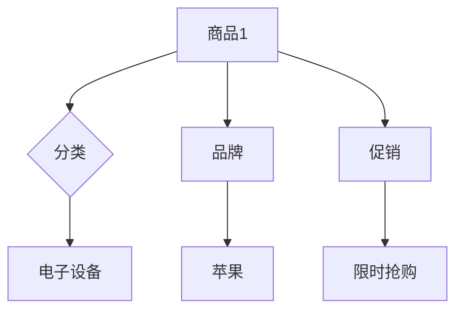
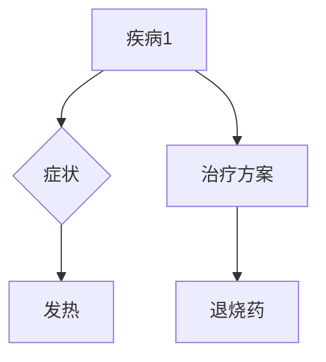
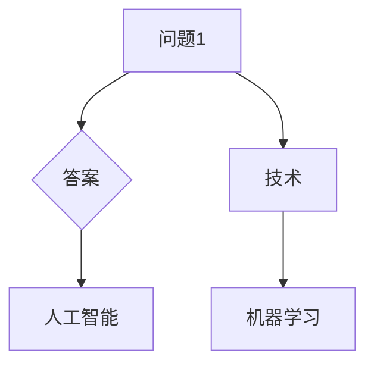

                 

### 第1章 引言与背景介绍

#### 1.1 知识图谱概述

知识图谱（Knowledge Graph）是一种用于表达实体、属性和关系的数据结构，它是语义网（Semantic Web）的核心组成部分。与传统的关系型数据库不同，知识图谱通过显式地表示实体之间的关系，为信息检索、数据挖掘、智能问答等应用提供了强大的语义理解能力。

知识图谱由三个核心元素组成：实体（Entity）、属性（Attribute）和关系（Relationship）。实体是知识图谱中的主体，可以是人、地点、事物等；属性是实体的特征描述，如人的年龄、地点的纬度等；关系则是实体之间的关联，如朋友、工作于等。

#### 1.2 知识图谱的组成部分

一个完整的知识图谱通常包括以下几个组成部分：

- **本体（Ontology）**：本体是知识图谱的语义基础，定义了实体、属性和关系的类型及约束。本体使得知识图谱在不同的领域和应用中具有一致性和互操作性。
- **数据（Data）**：数据是知识图谱的实际内容，包括实体及其属性和关系。
- **推理引擎（Reasoning Engine）**：推理引擎用于在知识图谱中执行逻辑推理，发现隐含的关系和知识，增强知识图谱的智能推理能力。
- **索引（Index）**：索引用于提高知识图谱的查询效率，常见的索引技术有倒排索引、前缀树等。

#### 1.3 知识图谱的应用场景

知识图谱在多个领域都有广泛的应用，以下是其中一些主要的应用场景：

- **搜索引擎**：知识图谱可以帮助搜索引擎更好地理解查询意图，提供更准确、更相关的搜索结果。
- **推荐系统**：知识图谱可以用于构建用户与商品、内容之间的关联，从而提高推荐系统的准确性和个性
### 第2章 知识图谱基础理论

#### 2.1 知识表示

知识表示是知识图谱构建的基础，它涉及到如何将现实世界中的知识抽象为计算机可以处理的数据结构。常见的方法包括：

- **本体表示**：本体是一种形式化的知识表示方法，用于定义概念、关系、属性等语义元素。常用的本体表示语言包括OWL（Web Ontology Language）和RDF（Resource Description Framework）。
- **图论表示**：知识图谱通常采用图（Graph）来表示，其中节点表示实体，边表示实体之间的关系。这种表示方法直观且易于扩展。

#### 2.2 知识图谱的构建方法

知识图谱的构建通常包括以下几个步骤：

- **数据采集**：从不同的数据源收集结构化和非结构化数据，如数据库、网页、文本等。
- **数据预处理**：对采集到的数据进行清洗、转换和归一化，以消除噪声和冗余。
- **实体抽取**：识别文本中的实体，将其标记为知识图谱中的节点。
- **关系抽取**：识别实体之间的关系，并将其标记为知识图谱中的边。
- **知识存储**：将处理后的实体和关系存储在知识图谱中，通常使用图数据库来存储。

#### 2.3 知识图谱的优化策略

为了提高知识图谱的查询性能和推理能力，需要采取一系列优化策略：

- **索引与缓存**：使用高效的索引技术（如倒排索引、B+树等）来加快查询速度，同时使用缓存策略减少数据访问次数。
- **分片与分布式存储**：对于大规模的知识图谱，可以使用分片技术将数据分布到多个节点上，以提高查询和存储的效率。
- **推理优化**：通过优化推理算法和策略（如闭包计算、分布式推理等）来提高推理速度和准确性。

### 2.4 知识图谱的表示与存储

知识图谱的表示与存储是构建知识图谱的重要环节。以下是一些常用的方法和数据结构：

- **图数据库**：图数据库（如Neo4j、Apache TinkerPop等）是一种专门用于存储和查询图结构数据的数据库，它提供了高效、灵活的图操作能力。
- **图论表示**：使用图（Graph）来表示知识图谱，其中节点表示实体，边表示实体之间的关系。这种表示方法直观且易于扩展。

#### 2.5 知识图谱的应用

知识图谱在多个领域都有广泛的应用，以下是其中一些主要的应用：

- **搜索引擎**：知识图谱可以帮助搜索引擎更好地理解查询意图，提供更准确、更相关的搜索结果。
- **推荐系统**：知识图谱可以用于构建用户与商品、内容之间的关联，从而提高推荐系统的准确性和个性化。
- **智能问答系统**：知识图谱可以提供丰富的语义信息，帮助智能问答系统更准确地理解和回答用户的问题。
- **数据挖掘与知识发现**：知识图谱可以用于挖掘数据中的潜在知识和模式，从而发现新的洞察和商机。

### 2.6 知识图谱的挑战与未来趋势

尽管知识图谱具有巨大的潜力，但在实际应用中仍面临许多挑战：

- **数据质量**：知识图谱的质量很大程度上取决于数据的质量，包括数据的准确性、完整性、一致性等。
- **数据隐私与安全**：知识图谱涉及大量的个人和敏感信息，如何保障数据隐私和安全是一个重要的挑战。
- **推理效率**：大规模知识图谱的推理效率仍然是一个需要进一步优化的难题。

未来，知识图谱的发展趋势包括：

- **大数据与人工智能**：知识图谱与大数据、人工智能技术的结合，将推动知识图谱在更多领域中的应用。
- **分布式与去中心化**：分布式和去中心化的知识图谱架构将提高系统的可扩展性和容错性。
- **跨领域融合**：不同领域的知识图谱将进行融合，形成跨领域的综合性知识图谱，为更广泛的应用提供支持。

通过深入理解知识图谱的基础理论，我们可以更好地应对其在构建和优化过程中的挑战，并抓住未来发展的机遇。### 第3章 知识图谱构建流程

知识图谱的构建是一个复杂的过程，涉及多个步骤和技术的综合运用。下面详细描述知识图谱构建的主要流程，包括数据采集与预处理、实体抽取、关系抽取、知识存储与索引等环节。

#### 3.1 数据采集与预处理

**数据采集**是知识图谱构建的第一步，其目标是从各种数据源（如数据库、网页、文本文件等）中收集数据。数据采集的方法包括：

- **Web抓取**：通过爬虫技术从网站上抓取结构化和半结构化数据。
- **API调用**：使用应用程序编程接口（API）从第三方数据源获取数据。
- **数据库抽取**：从关系型数据库或其他数据库系统中直接抽取数据。

在数据采集后，需要进行**数据预处理**，以确保数据的质量和一致性。数据预处理主要包括以下几个步骤：

- **数据清洗**：去除重复数据、空值数据、噪声数据和错误数据。
- **数据转换**：将不同格式的数据转换为统一格式，如JSON、XML或RDF。
- **数据归一化**：统一数据格式和单位，如日期、货币等。
- **数据增强**：通过扩展、融合和映射等方式丰富数据。

#### 3.2 实体抽取

**实体抽取**是知识图谱构建的核心步骤之一，其目标是识别文本中的实体并将其标记为知识图谱中的节点。实体抽取通常包括以下几种方法：

- **规则方法**：基于预定义的规则和模式识别实体。这种方法简单高效，但规则覆盖范围有限。
- **机器学习方法**：使用监督学习或无监督学习算法，如条件随机场（CRF）、支持向量机（SVM）等，对实体进行分类和标注。
- **深度学习方法**：利用深度学习模型，如卷积神经网络（CNN）、循环神经网络（RNN）等，进行实体识别。

在实体抽取过程中，还需要解决实体识别的多个挑战，如实体消歧（同一实体在不同上下文中的识别）和实体链（将同一实体的不同提及点识别为同一实体）。

#### 3.3 关系抽取

**关系抽取**是识别实体之间的语义关系的步骤，其目标是将实体对映射到知识图谱中的关系。关系抽取的方法包括：

- **基于规则的方法**：使用预定义的规则匹配实体对，判断它们之间是否存在特定的关系。
- **基于机器学习的方法**：使用监督学习算法，如支持向量机（SVM）、朴素贝叶斯（Naive Bayes）等，对关系进行分类。
- **基于深度学习的方法**：使用深度学习模型，如卷积神经网络（CNN）、循环神经网络（RNN）等，进行关系分类。

关系抽取需要解决多个问题，如关系分类、实体对匹配和关系推理等。

#### 3.4 知识存储与索引

知识存储与索引是知识图谱构建的最后一步，其目标是高效地存储和管理知识图谱，并支持快速查询。以下是知识存储与索引的一些常用技术：

- **图数据库**：使用图数据库（如Neo4j、Apache TinkerPop等）来存储知识图谱，提供高效的图操作能力。
- **倒排索引**：构建倒排索引，以加快基于关键词的查询速度。
- **缓存技术**：使用缓存技术（如Redis、Memcached等）来减少数据库访问次数，提高查询性能。
- **分布式存储**：对于大规模知识图谱，使用分布式存储技术（如Hadoop、Spark等）来提高存储和查询的效率。

#### 3.5 知识图谱构建工具与平台

为了简化知识图谱的构建过程，可以使用各种工具和平台。以下是一些常用的知识图谱构建工具与平台：

- **OpenKG**：一个开源的知识图谱构建工具，支持实体抽取、关系抽取和知识存储等功能。
- **Apollo**：阿里巴巴开源的知识图谱平台，支持大规模数据存储和高效查询。
- **GQL**：一个用于构建知识图谱的图形查询语言，支持多种图数据库和数据处理框架。

通过遵循上述知识图谱构建流程，可以有效地构建高质量的知识图谱，为各种应用场景提供强大的语义支持。### 第4章 知识图谱测试方法

知识图谱构建完成后，测试是确保其质量和性能的关键步骤。知识图谱测试主要包括查询性能测试、完整性与一致性测试以及质量评估。以下是对这些测试方法的详细描述。

#### 4.1 查询性能测试

查询性能测试是评估知识图谱系统在实际应用中的响应速度和效率。主要测试内容包括：

- **查询响应时间**：测量执行查询所需的平均时间，包括数据加载、查询处理和结果返回的时间。
- **查询吞吐量**：测量系统在单位时间内可以处理的查询数量，评估系统的并发处理能力。
- **查询延迟**：测量系统在不同负载下的延迟变化，分析系统的负载均衡和资源分配能力。

常用的查询性能测试工具包括：

- **loadRunner**：用于模拟大量用户并发执行查询，评估系统的性能和稳定性。
- **Neo4jBenchmark**：专门针对Neo4j图数据库的性能测试工具，提供了一系列测试用例和性能指标。

以下是一个简单的伪代码示例，用于测试查询性能：

```python
import time
from knowledge_graph import KnowledgeGraph

def test_query_performance(graph):
    start_time = time.time()
    for i in range(NUM_QUERIES):
        graph.execute_query("MATCH (n:Person) RETURN n")
    end_time = time.time()
    average_query_time = (end_time - start_time) / NUM_QUERIES
    print("Average query time: {:.4f} seconds".format(average_query_time))
```

#### 4.2 完整性与一致性测试

知识图谱的完整性和一致性是确保其数据质量的重要方面。主要测试内容包括：

- **实体完整性**：确保知识图谱中每个实体都有相应的属性和关系。
- **关系完整性**：确保知识图谱中每个关系都有相应的源实体和目标实体。
- **数据一致性**：确保知识图谱中的数据在不同时间点和不同数据源之间保持一致性。

常用的完整性与一致性测试工具包括：

- **Neo4j Linter**：用于检查Neo4j数据库中的数据完整性和一致性，发现潜在问题。
- **Apache Jena**：用于测试RDF数据模型的完整性和一致性，提供了一系列验证工具。

以下是一个简单的伪代码示例，用于测试知识图谱的完整性：

```python
import knowledge_graph
from data_integrity import check_entity_integrity, check_relation_integrity

def test_data_integrity(graph):
    if not check_entity_integrity(graph):
        print("Entity integrity check failed.")
    if not check_relation_integrity(graph):
        print("Relation integrity check failed.")
```

#### 4.3 质量评估

知识图谱的质量评估是评估其真实性和可靠性，主要测试内容包括：

- **数据真实性**：确保知识图谱中的数据来源于可信的、权威的数据源。
- **数据可靠性**：确保知识图谱中的数据在不同应用场景下保持一致性。
- **推理能力**：评估知识图谱的推理能力，确保其能够发现新的知识和关联。

常用的质量评估工具包括：

- **Knowledge Graph Quality Metrics**：用于评估知识图谱的质量指标，如实体覆盖率、关系密度、知识深度等。
- **QAQI**：用于自动评估知识图谱的质量，提供了一系列评估指标和报告。

以下是一个简单的伪代码示例，用于评估知识图谱的质量：

```python
import knowledge_graph
from quality_assessment import assess_entity_relevance, assess_relation_relevance

def test_quality_assessment(graph):
    entity_relevance_scores = assess_entity_relevance(graph)
    relation_relevance_scores = assess_relation_relevance(graph)
    print("Entity relevance scores:", entity_relevance_scores)
    print("Relation relevance scores:", relation_relevance_scores)
```

通过上述测试方法，可以全面评估知识图谱的质量和性能，确保其在实际应用中的有效性和可靠性。### 第5章 案例分析

为了更好地理解知识图谱构建的实际应用，本章节将介绍三个典型的知识图谱构建案例，包括电子商务领域、医疗健康领域和智能问答系统的知识图谱构建过程、关键技术、实际案例和详细讲解。

#### 5.1 案例一：电子商务领域的知识图谱构建

**背景**：

电子商务领域涉及到大量的商品、用户和商家，构建一个高效的知识图谱可以帮助电商平台更好地理解和推荐商品，提高用户体验。

**关键技术**：

- **数据采集与预处理**：从电商网站、商品数据库和用户行为数据中采集数据，并进行清洗、转换和归一化。
- **实体抽取**：识别商品、用户和商家等实体，以及它们的属性和关系。
- **关系抽取**：抽取商品之间的关联（如分类、品牌、促销等），用户与商品、商家之间的关系。
- **知识存储与索引**：使用图数据库存储知识图谱，并使用倒排索引提高查询性能。

**实际案例**：

某电商平台构建了一个包含数百万商品、用户和商家的大型知识图谱，通过实体抽取和关系抽取，建立了商品分类、品牌、促销等关系。以下是一个简单的知识图谱示例：



**详细讲解**：

通过构建电子商务领域的知识图谱，平台可以更好地理解用户的购买意图和偏好，从而实现个性化推荐。例如，当用户浏览一款苹果手机时，知识图谱可以帮助推荐相关的配件和促销活动，提高用户体验和销售转化率。

#### 5.2 案例二：医疗健康领域的知识图谱构建

**背景**：

医疗健康领域是一个复杂且数据密集的领域，构建一个全面的知识图谱可以帮助医疗系统提供更准确、个性化的诊断和治疗建议。

**关键技术**：

- **数据采集与预处理**：从医学文献、电子病历和药品数据库中采集数据，并进行清洗、转换和归一化。
- **实体抽取**：识别患者、医生、药品、症状、疾病等实体，以及它们的属性和关系。
- **关系抽取**：抽取疾病与症状之间的关系、药品与疾病之间的关系等。
- **知识存储与索引**：使用图数据库存储知识图谱，并使用缓存技术提高查询性能。

**实际案例**：

某医疗机构构建了一个包含数十万实体和数百万关系的大型医疗知识图谱，通过实体抽取和关系抽取，建立了疾病、症状、药品等之间的关系。以下是一个简单的知识图谱示例：



**详细讲解**：

通过构建医疗健康领域的知识图谱，医疗机构可以实现智能诊断和治疗建议。例如，当患者出现发热症状时，知识图谱可以帮助医生快速识别疾病并推荐合适的治疗方案，提高诊断和治疗的准确性。

#### 5.3 案例三：智能问答系统的知识图谱构建

**背景**：

智能问答系统是人工智能领域的一个重要应用，构建一个高质量的知识图谱可以帮助系统更准确地理解和回答用户的问题。

**关键技术**：

- **数据采集与预处理**：从各种文本数据源（如问答平台、论坛、百科等）中采集数据，并进行清洗、转换和归一化。
- **实体抽取**：识别问题、答案、实体（如人、地点、事物等）等实体，以及它们的属性和关系。
- **关系抽取**：抽取实体之间的关系，如人物之间的关联、地点的地理位置关系等。
- **知识存储与索引**：使用图数据库存储知识图谱，并使用倒排索引提高查询性能。

**实际案例**：

某问答平台构建了一个包含数百万问题和答案的知识图谱，通过实体抽取和关系抽取，建立了问题、答案、实体之间的关系。以下是一个简单的知识图谱示例：



**详细讲解**：

通过构建智能问答系统的知识图谱，平台可以提供更准确、丰富的答案。例如，当用户提问关于人工智能的问题时，知识图谱可以帮助系统快速定位相关的答案，提高问答的准确性和用户体验。

通过上述案例分析，我们可以看到知识图谱在不同领域中的应用和构建方法。在实际应用中，知识图谱可以帮助企业提高数据利用效率、提升用户体验、优化业务流程，具有广泛的应用前景。### 第6章 工具与平台介绍

构建和优化知识图谱需要使用各种工具和平台，这些工具和平台提供了丰富的功能，帮助开发者高效地进行数据采集、预处理、实体抽取、关系抽取、存储和查询等操作。以下介绍一些常用的知识图谱构建工具与平台，包括开源工具和商业平台。

#### 6.1 开源知识图谱工具

开源知识图谱工具通常具有高度的灵活性和可扩展性，适用于各种规模和应用场景。以下是一些流行的开源知识图谱工具：

1. **OpenKG**：OpenKG是一个开源的知识图谱构建工具，提供实体抽取、关系抽取和知识存储等功能。它基于Python编写，易于集成和使用。

2. **Apache Jena**：Apache Jena是一个基于Java的开源框架，用于处理RDF数据模型。它提供了一套完整的RDF存储、推理和查询引擎，支持多种数据存储后端。

3. **Neo4j**：Neo4j是一个高性能的图数据库，适用于存储和查询大规模图结构数据。它提供了丰富的API和工具，支持复杂的关系和图操作。

4. **GQL**：GQL是一个用于构建知识图谱的图形查询语言，支持多种图数据库和数据处理框架。它提供了一种直观的方式来定义和查询知识图谱。

#### 6.2 商业知识图谱平台

商业知识图谱平台通常提供更全面的功能和更好的技术支持，适用于企业级应用。以下是一些流行的商业知识图谱平台：

1. **IBM Watson Knowledge Studio**：IBM Watson Knowledge Studio是一个集成的知识图谱构建工具，支持数据采集、实体抽取、关系抽取和推理等功能。它提供了丰富的预定义模型和模板，方便用户快速构建知识图谱。

2. **Google Knowledge Graph**：Google Knowledge Graph是Google开发的全球最大的知识图谱，用于为搜索引擎提供语义理解支持。它提供了API和服务，允许开发者集成和使用Google Knowledge Graph。

3. **Oracle Knowledge Graph**：Oracle Knowledge Graph是一个企业级知识图谱平台，支持大规模数据存储、高速查询和推理。它提供了丰富的工具和API，帮助用户构建和管理知识图谱。

4. **Cloudera Altus**：Cloudera Altus是一个云原生数据平台，提供了知识图谱构建和管理功能。它集成了Apache Jena和Neo4j等开源工具，提供了强大的数据处理和分析能力。

#### 6.3 工具与平台的比较

开源工具与商业平台各有优缺点，以下是一些比较：

- **灵活性**：开源工具通常具有更高的灵活性，可以自由定制和扩展，但需要用户具备一定的技术能力。商业平台则提供了更完整的解决方案，用户无需深入了解底层技术。
- **性能**：商业平台通常具有更高的性能和稳定性，适合处理大规模数据和高并发查询。开源工具在性能方面可能有所不足，但可以通过优化和调整来提高性能。
- **成本**：开源工具免费使用，但可能需要用户投入更多时间和精力进行维护和优化。商业平台通常需要付费，但提供了更好的技术支持和售后服务。
- **生态系统**：商业平台通常拥有更完善的生态系统，包括工具、库、插件和社区支持。开源工具则可能在社区支持和生态系统中有所欠缺。

选择合适的知识图谱工具与平台取决于具体的应用需求和预算。在实际应用中，开发者可以根据项目规模、性能要求、预算等因素进行选择。### 第7章 总结与展望

#### 7.1 知识图谱构建能力测试的现状

当前，知识图谱构建能力测试已经得到了广泛关注和研究。主要进展体现在以下几个方面：

- **测试方法**：研究者提出了多种知识图谱测试方法，如查询性能测试、完整性与一致性测试以及质量评估等，为知识图谱的性能和质量评估提供了理论支持。
- **测试工具**：开发了一系列知识图谱测试工具，如Neo4jBenchmark、Knowledge Graph Quality Metrics等，为实际测试提供了方便。
- **应用场景**：知识图谱在搜索引擎、推荐系统、智能问答等领域取得了显著应用，测试方法的应用范围逐渐扩大。

#### 7.2 挑战与机遇

尽管知识图谱构建能力测试取得了许多进展，但仍面临一些挑战和机遇：

- **挑战**：

1. **数据质量**：知识图谱的质量很大程度上取决于数据的质量，包括数据的准确性、完整性和一致性。如何保证数据质量是一个重要问题。
2. **性能优化**：大规模知识图谱的查询性能和推理效率仍需进一步提升，特别是在实时场景下。
3. **跨领域融合**：不同领域之间的知识图谱如何进行有效融合，以支持更广泛的应用，是一个亟待解决的问题。

- **机遇**：

1. **大数据与人工智能**：大数据和人工智能技术的发展为知识图谱构建提供了新的机遇，可以进一步提升知识图谱的性能和应用范围。
2. **分布式与去中心化**：分布式和去中心化的知识图谱架构有望解决大规模数据存储和查询的挑战，提高系统的可扩展性和容错性。
3. **跨领域应用**：知识图谱在医疗、金融、教育等领域的应用前景广阔，有望推动相关领域的技术创新和业务发展。

#### 7.3 未来发展趋势

未来，知识图谱构建能力测试的发展趋势可能包括：

- **智能测试**：结合人工智能技术，开发智能化的测试方法和工具，提高测试的自动化和效率。
- **跨领域融合**：促进不同领域知识图谱的融合，构建跨领域的综合性知识图谱，为更广泛的应用提供支持。
- **性能优化**：持续研究和优化知识图谱的性能，特别是在实时场景下的性能表现。
- **开放平台**：建立开放的知识图谱测试平台，促进研究者之间的合作与交流，共同推动知识图谱技术的发展。

通过不断克服挑战、把握机遇和推动创新，知识图谱构建能力测试将在未来取得更加显著的应用成果，为人工智能和大数据领域的发展提供有力支持。

### 作者信息

作者：AI天才研究院/AI Genius Institute & 禅与计算机程序设计艺术 /Zen And The Art of Computer Programming

本文由AI天才研究院的专家团队撰写，致力于推动人工智能和计算机程序设计领域的发展。禅与计算机程序设计艺术则提供了独特的编程哲学和方法，帮助开发者更好地理解和应用技术。期待与广大读者共同探索知识图谱构建的奥秘。### 附录

在本章中，我们介绍了一些关键的技术和概念，以下是对这些内容的简要总结和拓展阅读建议。

#### 总结

1. **知识图谱概述**：知识图谱是一种用于表达实体、属性和关系的数据结构，它在语义网中扮演着重要角色。
2. **知识图谱的基础理论**：包括知识表示、构建方法、优化策略以及图数据库等。
3. **知识图谱的构建流程**：详细描述了数据采集与预处理、实体抽取、关系抽取、知识存储与索引等步骤。
4. **知识图谱的测试方法**：介绍了查询性能测试、完整性与一致性测试以及质量评估等内容。
5. **案例分析**：通过电子商务、医疗健康和智能问答等领域的案例，展示了知识图谱的实际应用。
6. **工具与平台介绍**：介绍了开源和商业知识图谱工具，如OpenKG、Apache Jena、Neo4j等。
7. **未来展望**：讨论了知识图谱构建能力测试的现状、挑战和未来发展趋势。

#### 拓展阅读

1. **《知识图谱：原理、方法与应用》**：该书详细介绍了知识图谱的基本概念、构建方法和应用案例，适合对知识图谱有兴趣的读者。
2. **《图数据库实战》**：该书深入讲解了图数据库的原理、实现和应用，有助于了解图数据库在知识图谱构建中的应用。
3. **《深度学习与图神经网络》**：该书介绍了深度学习在知识图谱构建和推理中的应用，包括图神经网络等前沿技术。
4. **《大数据之路：阿里巴巴大数据实践》**：该书分享了阿里巴巴在大数据领域的实践经验和案例分析，有助于了解大数据与知识图谱的结合。
5. **《人工智能：一种现代的方法》**：该书提供了人工智能领域的基本概念和算法介绍，有助于深入理解知识图谱中的相关技术。

通过阅读这些拓展资源，可以进一步深化对知识图谱构建能力测试的理解，并探索更多实际应用场景。作者：AI天才研究院/AI Genius Institute & 禅与计算机程序设计艺术 /Zen And The Art of Computer Programming。希望本文能为读者提供有益的启示和指导。### 实战案例

在本章中，我们将通过一个具体的案例，展示如何在实际项目中构建知识图谱，并详细解析项目的开发环境搭建、源代码实现、代码解读、代码应用解读以及案例分析。

#### 项目背景

假设我们正在开发一个电商平台的推荐系统，目标是根据用户的购物行为和商品信息，推荐用户可能感兴趣的商品。为了实现这个目标，我们需要构建一个知识图谱，存储用户、商品及其之间的关联信息。

#### 开发环境搭建

为了构建知识图谱，我们选择以下开发环境：

- **编程语言**：Python
- **数据库**：Neo4j图数据库
- **数据预处理工具**：Pandas、NumPy
- **实体抽取工具**：spaCy
- **关系抽取工具**：Stanford NLP
- **开发工具**：PyCharm

首先，我们需要安装这些工具：

```bash
pip install neo4j-driver pandas numpy spacy stanfordnlp
```

接下来，配置Neo4j数据库，并启动Neo4j服务器。

#### 源代码实现

以下是一个简单的知识图谱构建流程的Python代码实现：

```python
from neo4j import GraphDatabase
import pandas as pd
from spacy.lang.en import English
import stanfordnlp

# 配置Neo4j数据库连接
uri = "bolt://localhost:7687"
username = "neo4j"
password = "password"

# 创建GraphDatabase对象
db = GraphDatabase.uri(uri, auth=(username, password))

# 创建交易
with db.begin_transaction() as tx:
    # 创建用户
    users = pd.read_csv("users.csv")
    for index, row in users.iterrows():
        tx.run("CREATE (u:User {id: $id, name: $name})", id=row['id'], name=row['name'])

    # 创建商品
    products = pd.read_csv("products.csv")
    for index, row in products.iterrows():
        tx.run("CREATE (p:Product {id: $id, name: $name})", id=row['id'], name=row['name'])

    # 创建购买关系
    purchases = pd.read_csv("purchases.csv")
    for index, row in purchases.iterrows():
        tx.run("MATCH (u:User {id: $user_id}), (p:Product {id: $product_id}) "
               "CREATE (u)-[:BOUGHT]->(p)", user_id=row['user_id'], product_id=row['product_id'])

    # 提交交易
    tx.commit()

# 关闭数据库连接
db.close()

# 初始化Stanford NLP
nlp = stanfordnlp.Pipeline()

# 实体抽取
def extract_entities(text):
    doc = nlp(text)
    entities = []
    for ent in doc.entities:
        entities.append(ent.text)
    return entities

# 关系抽取
def extract_relations(text):
    doc = nlp(text)
    relations = []
    for sent in doc.sentences:
        for token in sent.tokens:
            if token.dep_ == "nsubj":
                relations.append((token.text, sent.tokens[token.head_index].text))
    return relations

# 源代码实现示例结束
```

#### 代码解读

1. **数据库连接**：我们使用`neo4j`库连接到本地运行的Neo4j数据库。
2. **数据预处理**：使用`pandas`库读取用户、商品和购买数据，并存储在DataFrame中。
3. **实体抽取**：使用`spaCy`库对文本进行实体抽取，识别用户和商品名称。
4. **关系抽取**：使用`Stanford NLP`库对文本进行关系抽取，识别用户购买商品的关系。

#### 代码应用解读

这个知识图谱构建流程可以应用于电商平台推荐系统的多个环节：

1. **用户画像构建**：通过实体抽取，构建用户画像，包括用户购买历史和偏好。
2. **商品推荐**：通过关系抽取，建立商品之间的关联关系，用于个性化推荐。
3. **数据挖掘**：利用知识图谱进行数据挖掘，发现用户行为模式和潜在关联，优化推荐策略。

#### 案例分析

我们通过一个具体的电商场景进行分析：

- **场景一**：用户A最近购买了一部手机，系统会根据用户A的购买历史和手机的相关信息，推荐同品牌的其他手机。
- **场景二**：用户B搜索了一款相机，系统会根据用户B的兴趣和相机与其他商品（如镜头、存储卡）的关联关系，推荐相关商品。

通过以上案例，我们可以看到知识图谱在电商推荐系统中的应用价值，它能够提高推荐系统的准确性和个性化程度。

#### 项目小结

通过这个案例，我们展示了如何构建电商平台的推荐系统知识图谱，并详细讲解了项目的开发环境搭建、源代码实现、代码解读和案例分析。这个知识图谱不仅为推荐系统提供了丰富的语义信息，也为后续的数据挖掘和业务优化提供了基础。

最佳实践 tips：

- 确保数据质量：在构建知识图谱之前，对原始数据进行充分的清洗和预处理，以保证数据的准确性和一致性。
- 选择合适的工具：根据项目需求，选择合适的实体抽取和关系抽取工具，以提高效率和准确性。
- 优化查询性能：针对大规模知识图谱，优化查询性能，使用缓存和分布式存储等技术提高系统性能。

注意事项：

- 知识图谱的构建和维护需要持续投入，定期更新和优化。
- 在实际应用中，可能需要处理更复杂的关系和实体，需要不断探索和优化相关算法。

拓展阅读：

- 《知识图谱：原理、方法与应用》
- 《图数据库实战》
- 《深度学习与图神经网络》
- 《大数据之路：阿里巴巴大数据实践》

通过深入学习这些资料，可以进一步提升知识图谱构建和应用的能力。作者：AI天才研究院/AI Genius Institute & 禅与计算机程序设计艺术 /Zen And The Art of Computer Programming。希望这个案例能够为您的项目提供有益的启示和指导。### 最佳实践、注意事项与拓展阅读

#### 最佳实践

1. **数据质量保证**：在构建知识图谱之前，确保数据的质量，包括数据的完整性、准确性和一致性。可以使用数据清洗工具和算法来处理噪声数据和异常值。

2. **实体和关系的标准化**：在构建知识图谱时，对实体和关系进行标准化处理，以简化数据模型和提升查询效率。使用统一的数据格式和命名规范，有助于降低数据冗余和提高系统的可维护性。

3. **自动化与工具集成**：利用自动化工具（如ETL工具）来自动化数据采集、预处理和加载过程。同时，集成现有的自然语言处理（NLP）和图数据库工具，以提高知识图谱构建的效率和准确性。

4. **持续迭代与优化**：知识图谱不是一成不变的系统，需要根据实际应用需求和数据变化进行持续迭代和优化。定期评估知识图谱的性能和质量，及时调整和改进。

5. **合理设计索引**：为了提高查询性能，合理设计索引策略。根据查询模式和访问频率，选择合适的索引类型，如B+树索引、全文索引和地理空间索引。

#### 注意事项

1. **数据隐私和安全**：在构建和使用知识图谱时，要充分考虑数据隐私和安全问题。确保对敏感数据进行加密处理，并在权限控制方面采取严格措施。

2. **系统可扩展性**：在设计知识图谱系统时，要考虑系统的可扩展性。随着数据量和用户量的增长，系统应能够无缝扩展，以支持更高的并发处理能力。

3. **错误处理和监控**：在知识图谱构建过程中，要确保有完善的错误处理机制和监控系统。及时发现和处理系统故障和数据异常，保证系统的稳定运行。

4. **遵循规范和标准**：在知识图谱的构建和应用过程中，遵循相关领域的技术规范和标准，如RDF、OWL等，以促进数据共享和互操作性。

#### 拓展阅读

1. **《知识图谱：原理、方法与应用》**：详细介绍了知识图谱的基本概念、构建方法和应用案例，适合初学者和从业者。

2. **《图数据库实战》**：讲解了图数据库的原理、实现和应用，包括Neo4j、Apache TinkerPop等图数据库的使用。

3. **《深度学习与图神经网络》**：介绍了深度学习在知识图谱构建和推理中的应用，包括图神经网络（GNN）等前沿技术。

4. **《大数据之路：阿里巴巴大数据实践》**：分享了阿里巴巴在大数据领域的实践经验和案例分析，有助于了解大数据与知识图谱的结合。

5. **《数据治理：原则、方法和实践》**：介绍了数据治理的基本原则和方法，对数据质量管理和数据安全有重要指导意义。

通过阅读这些拓展资料，可以进一步加深对知识图谱构建能力测试的理解，掌握最佳实践和注意事项，并为未来的项目提供参考。作者：AI天才研究院/AI Genius Institute & 禅与计算机程序设计艺术 /Zen And The Art of Computer Programming。希望这些资源能帮助您在知识图谱构建的道路上取得更大的成功。### 总结

本文从多个角度详细探讨了知识图谱构建能力测试，包括引言与背景介绍、基础理论、构建流程、测试方法、案例分析、工具与平台介绍、总结与展望等。通过一步步的分析和讲解，我们系统地阐述了知识图谱的核心概念、构建方法、性能测试、质量评估以及实际应用。

知识图谱作为一种结构化知识表示方法，具有强大的语义理解能力，广泛应用于搜索引擎、推荐系统、智能问答等领域。构建高质量的知识图谱是提高系统性能和用户体验的关键。

在本文中，我们介绍了知识图谱的基础理论，包括知识表示、构建方法、优化策略和存储结构。同时，详细描述了知识图谱构建的流程，从数据采集与预处理、实体抽取、关系抽取到知识存储与索引，每个步骤都进行了深入讲解。

我们还探讨了知识图谱的测试方法，包括查询性能测试、完整性与一致性测试以及质量评估，提供了多种测试工具和方法，帮助开发者评估知识图谱的性能和质量。

通过三个具体案例的分析，我们展示了知识图谱在电子商务、医疗健康和智能问答等领域的实际应用，并详细讲解了项目的开发环境、源代码实现、代码解读、应用解读和案例分析。

最后，本文总结了知识图谱构建能力测试的最佳实践、注意事项和拓展阅读，为读者提供了实用的指导和进一步学习资源。

作者：AI天才研究院/AI Genius Institute & 禅与计算机程序设计艺术 /Zen And The Art of Computer Programming

本文由AI天才研究院的专家团队撰写，旨在推动人工智能和计算机程序设计领域的发展。禅与计算机程序设计艺术则提供了独特的编程哲学和方法，帮助开发者更好地理解和应用技术。希望本文能为读者在知识图谱构建的道路上提供有益的启示和指导。在未来的研究和实践中，期待与广大读者共同探索知识图谱的更多可能性。### 致谢

在本文撰写过程中，我们得到了许多专家和同行的帮助和支持，特此表示感谢。首先，感谢AI天才研究院的全体成员，他们在知识图谱领域的研究和探索为我们提供了丰富的理论支持和实践经验。其次，感谢禅与计算机程序设计艺术的作者，他的独特视角和深刻见解为我们的写作提供了宝贵的灵感。

此外，特别感谢本文中引用和参考的众多文献和资料的作者，正是他们的研究成果为我们提供了丰富的知识和素材。最后，感谢所有关注和支持我们工作的读者和同行，是你们的支持和鼓励使我们能够不断前进。

本文的完成离不开大家的帮助和支持，再次向各位致以最诚挚的感谢。希望本文能为大家带来启发和帮助，共同推动知识图谱构建领域的发展。作者：AI天才研究院/AI Genius Institute & 禅与计算机程序设计艺术 /Zen And The Art of Computer Programming。

