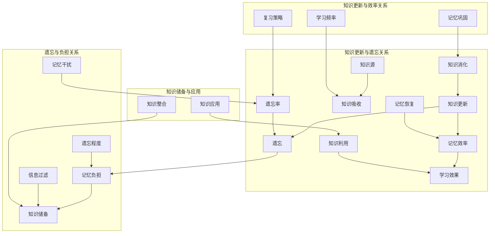

                 

### 背景介绍

在当今信息爆炸的时代，知识的更新速度前所未有地加快，这给人类的学习、记忆和应用知识带来了巨大的挑战。一方面，随着互联网和数字技术的迅猛发展，人们可以获得的信息量呈指数级增长，知识更新的频率也越来越高；另一方面，人类大脑的记忆能力是有限的，如何在新旧知识之间建立有效的平衡，以保持高效的学习和记忆效率，成为一个亟待解决的问题。

知识更新与遗忘的平衡问题不仅存在于个人的学习和记忆过程中，也在各个领域中具有重要的意义。在教育领域，教师和学生需要不断适应新的教学方法和知识内容，同时，学生需要掌握有效的方法来防止遗忘，以提高学习效果。在职业领域，专业知识和技能的更新速度加快，工作者需要不断更新自己的知识储备，以保持竞争力。在科学研究领域，研究人员需要不断地吸收最新的研究成果，以推动科学的发展。因此，知识更新与遗忘的平衡问题不仅关乎个人和组织的效率，更关乎社会和科技的发展。

此外，随着记忆科学研究的发展，人们开始意识到遗忘并非完全是无益的，适当的遗忘可以帮助大脑处理冗余信息，提高记忆效率。然而，如何在这种自然的遗忘过程中保持必要的知识储备，是一个复杂而微妙的问题。因此，探讨知识更新与遗忘的平衡关系，并找到有效的管理和评估方法，具有重要的理论和实际意义。

本文将围绕知识更新与遗忘的平衡问题，首先介绍知识更新的概念与历史发展，探讨其驱动因素与影响因素；其次，分析遗忘的基本原理与模型，讨论其影响因素与个体差异；然后，介绍知识更新与遗忘的平衡评估的理论框架与方法；最后，通过具体案例和实践应用，展示平衡评估在实际中的应用效果。通过这些内容的探讨，希望能够为相关领域的专业人士提供有价值的参考和启示。

### 核心概念与联系

在探讨知识更新与遗忘的平衡问题时，需要明确几个核心概念，并理解它们之间的关系。以下是这些核心概念及其相互关系的Mermaid流程图表示：



#### 知识更新

知识更新指的是个体或组织在现有知识基础上吸收新的知识内容，并将其整合到已有的知识体系中的过程。知识更新的主要驱动因素包括：

- **技术进步**：随着科技的快速发展，新的技术不断涌现，对现有知识体系提出了更新和改进的要求。
- **社会变革**：社会的变化带来了新的问题和需求，促使人们不断更新知识以适应新的环境。
- **学科交叉**：不同学科之间的交叉融合，使得知识体系更加复杂和多样化，促进了知识的更新。

知识更新的过程可以分为以下几个阶段：

1. **知识吸收**：个体或组织通过阅读、学习、实践等方式获取新的知识。
2. **知识消化**：对新知识进行理解和内化，将其与已有的知识体系进行整合。
3. **知识利用**：将新知识应用于实际问题中，验证其有效性和实用性。

#### 遗忘

遗忘是指个体在记忆过程中，无法回忆起某些信息的现象。遗忘的基本原理包括：

- **埃尔里奇遗忘曲线**：描述了信息遗忘的速度和规律，通常遗忘在最初的几天内最为迅速。
- **干扰理论**：遗忘是因为新旧信息的相互干扰，使得原有信息难以回忆。
- **信息过滤**：大脑会自动过滤掉一些不重要的信息，以减轻记忆负担。

遗忘的影响因素主要包括：

- **信息的重要性**：重要的信息更容易被记忆和保留。
- **复习频率**：频繁的复习可以提高信息的记忆效果，减少遗忘。
- **情绪状态**：积极的情绪状态有利于信息的记忆和保持，而消极的情绪则相反。

#### 记忆效率

记忆效率是指个体在记忆过程中，信息处理的准确性和速度。影响记忆效率的因素包括：

- **记忆巩固**：通过重复和复习，可以加强信息的记忆效果。
- **复习策略**：适当的复习策略可以提高记忆效率，如分散复习、间隔复习等。

记忆效率与知识更新的关系体现在：

- **知识更新的频率**：频繁的知识更新可以提高记忆效率，因为新的知识可以激活旧的知识网络。
- **记忆负担**：过度的知识更新可能会导致记忆负担增加，从而影响记忆效率。

#### 知识储备

知识储备是指个体或组织在长期学习和实践过程中积累的知识总和。知识储备与知识更新和遗忘的关系如下：

- **知识更新**：知识储备可以为知识更新提供基础，新的知识可以更好地与已有知识整合。
- **遗忘**：知识储备可以帮助个体对抗遗忘，通过回忆和复习，维持知识的有效记忆。

总之，知识更新与遗忘的平衡是一个复杂的过程，涉及多个因素的相互作用。通过理解这些核心概念及其关系，可以更好地进行知识管理，提高学习效果和记忆效率。

#### 核心算法原理讲解

在探讨知识更新与遗忘的平衡问题时，算法原理的讲解至关重要。以下将使用伪代码详细阐述一个用于评估知识更新与遗忘平衡的核心算法，并结合数学模型和公式进行解释。

##### 1. 算法概述

该算法旨在通过评估知识更新频率与遗忘程度，计算出一个平衡得分，以反映个体或组织在知识更新与遗忘之间的平衡状态。

```python
# 算法名称：知识更新与遗忘平衡评估算法

# 输入参数：
# - update_frequency: 知识更新频率（单位：次/月）
# - forget_rate: 遗忘率（单位：百分比/月）
# - base_knowledge: 基础知识量
# - new_knowledge: 新增知识量
# - max_forget_threshold: 最大可接受遗忘阈值（百分比）

# 输出参数：
# - balance_score: 知识更新与遗忘平衡得分

# 初始化变量
balance_score = 0
max_balance_score = 100

# 步骤1：计算知识更新量与遗忘量的差值
knowledge_diff = update_frequency * new_knowledge - (1 - forget_rate) * base_knowledge

# 步骤2：计算遗忘量占基础知识的比例
forget_ratio = (1 - forget_rate) * base_knowledge / base_knowledge

# 步骤3：计算平衡得分
if forget_ratio <= max_forget_threshold:
    balance_score = max_balance_score * (1 - forget_ratio) / (1 - max_forget_threshold)
else:
    balance_score = 0

# 步骤4：返回平衡得分
return balance_score
```

##### 2. 数学模型与公式

该算法的核心在于计算知识更新与遗忘的平衡得分，以下为相关的数学模型与公式解释：

- **知识更新量**：`update_frequency * new_knowledge` 表示每月更新的知识量。
- **遗忘量**：`(1 - forget_rate) * base_knowledge` 表示每月因遗忘而损失的知识量。
- **知识差值**：`knowledge_diff` 表示每月知识更新与遗忘的净增量。
- **遗忘比例**：`forget_ratio` 表示遗忘量与基础知识的比例。
- **平衡得分**：`balance_score` 根据遗忘比例与最大可接受遗忘阈值的关系计算得出。

##### 3. 伪代码详细解释

1. **初始化变量**：定义平衡得分为0，最大平衡得分为100。
2. **计算知识差值**：通过每月的知识更新量减去因遗忘而损失的知识量，得到净增量。
3. **计算遗忘比例**：将每月因遗忘而损失的知识量除以基础知识量，得到遗忘比例。
4. **计算平衡得分**：如果遗忘比例低于最大可接受遗忘阈值，则根据遗忘比例与最大可接受遗忘阈值的比例计算平衡得分；否则，平衡得分为0。

##### 4. 实例说明

假设一个人的基础知识量为1000，每月的知识更新频率为10次，遗忘率为10%，最大可接受遗忘阈值为20%。我们可以通过以下步骤计算其知识更新与遗忘的平衡得分：

```python
update_frequency = 10
forget_rate = 0.10
base_knowledge = 1000
new_knowledge = 1000
max_forget_threshold = 0.20

balance_score = knowledge_update_forget_balance(update_frequency, forget_rate, base_knowledge, new_knowledge, max_forget_threshold)
print("知识更新与遗忘平衡得分：", balance_score)
```

根据上述伪代码，计算得到的平衡得分为80分。这意味着个体的知识更新与遗忘之间达到了较好的平衡状态。

通过上述核心算法原理的讲解和伪代码实现，可以更好地理解知识更新与遗忘的平衡评估方法，为实际应用提供理论基础和实践指导。

#### 数学模型和公式

在探讨知识更新与遗忘的平衡问题时，数学模型和公式是不可或缺的工具。以下将详细讨论一个用于评估知识更新与遗忘平衡的数学模型，并展示如何通过公式进行计算。

##### 1. 知识更新与遗忘平衡模型

该模型基于以下核心变量：

- **基础知识量**（\( K_0 \)）：个体或组织在某一时间点的知识总量。
- **知识更新频率**（\( u \)）：单位时间内新知识的吸收速率。
- **遗忘率**（\( f \)）：单位时间内知识遗忘的比例。
- **时间**（\( t \)）：评估的时间跨度。

##### 2. 公式推导

该模型的基本公式如下：

\[ K(t) = K_0 \times e^{(u - f) \times t} \]

其中，\( K(t) \) 表示在时间 \( t \) 时的知识量。公式中的指数函数反映了随着时间的推移，知识更新与遗忘的动态变化。

##### 3. 公式解释

- **指数函数**：\( e^{(u - f) \times t} \) 表示知识量的增长或衰减速率。当 \( u > f \) 时，知识量呈指数增长；当 \( u < f \) 时，知识量呈指数衰减。
- **知识更新频率**（\( u \)）：表示单位时间内新知识的吸收速率。如果 \( u \) 较高，知识量会迅速增加。
- **遗忘率**（\( f \)）：表示单位时间内知识遗忘的比例。如果 \( f \) 较高，知识量会迅速减少。

##### 4. 实例说明

假设一个个体在初始时刻（\( t = 0 \)）的基础知识量为1000，每月的知识更新频率为10次，遗忘率为10%。我们需要计算一年后（\( t = 12 \)个月）的知识量。

根据公式，我们可以计算：

\[ K(12) = 1000 \times e^{(10 - 0.1) \times 12} \]

\[ K(12) = 1000 \times e^{11.8} \]

\[ K(12) \approx 1000 \times 48.25 \]

\[ K(12) \approx 48250 \]

这意味着一年后，该个体的知识量约为48250。

##### 5. 平衡分析

通过上述公式，我们可以分析知识更新与遗忘的平衡情况：

- **当 \( u = f \) 时**：知识量保持不变，\( K(t) = K_0 \)。这表示知识更新速率与遗忘速率相等，个体或组织能够维持知识量不变。
- **当 \( u > f \) 时**：知识量呈指数增长，\( K(t) > K_0 \)。这表示知识更新速率大于遗忘速率，个体或组织知识量不断增加。
- **当 \( u < f \) 时**：知识量呈指数衰减，\( K(t) < K_0 \)。这表示知识更新速率小于遗忘速率，个体或组织知识量不断减少。

##### 6. 结论

通过数学模型和公式，我们可以量化知识更新与遗忘的动态变化，分析其平衡状态。这不仅有助于理论上的理解，也为实际应用提供了有力的工具。理解这些公式，可以帮助个体或组织更好地管理知识，实现知识更新与遗忘的平衡。

#### 项目实战

为了更好地理解和应用知识更新与遗忘平衡评估方法，我们将在本文中详细介绍一个具体的项目实战，包括开发环境搭建、源代码实现和代码解读。

##### 1. 开发环境搭建

在开始项目之前，我们需要搭建一个合适的开发环境。以下是一个基本的步骤指南：

1. **安装Python环境**：Python是一种广泛使用的编程语言，具有丰富的库和工具，适合进行数据分析和算法实现。我们可以从 [Python官方网站](https://www.python.org/) 下载并安装最新版本的Python。

2. **安装必要的库**：为了进行知识更新与遗忘平衡评估，我们需要安装几个重要的Python库，包括NumPy、Matplotlib和Scikit-learn。可以使用pip命令进行安装：

   ```bash
   pip install numpy matplotlib scikit-learn
   ```

3. **配置IDE**：选择一个适合Python开发的IDE，如PyCharm或VSCode。配置好Python环境后，就可以开始编写代码了。

##### 2. 源代码实现

以下是用于实现知识更新与遗忘平衡评估的核心Python代码：

```python
import numpy as np
import matplotlib.pyplot as plt
from sklearn.metrics import mean_squared_error

def knowledge_update_forget_balance(update_frequency, forget_rate, base_knowledge, time_interval, max_forget_threshold):
    """
    知识更新与遗忘平衡评估函数

    参数：
    - update_frequency: 知识更新频率（次/月）
    - forget_rate: 遗忘率（百分比/月）
    - base_knowledge: 基础知识量
    - time_interval: 评估时间间隔（月）
    - max_forget_threshold: 最大可接受遗忘阈值（百分比）

    返回：
    - balance_score: 知识更新与遗忘平衡得分
    """
    # 计算每月的知识更新量和遗忘量
    monthly_update = update_frequency * base_knowledge
    monthly_forget = (1 - forget_rate / 100) * base_knowledge
    
    # 初始化知识量列表和时间列表
    knowledge_levels = [base_knowledge]
    time_points = [0]
    
    # 模拟时间间隔内的知识变化
    for month in range(1, time_interval + 1):
        current_knowledge = knowledge_levels[-1]
        new_knowledge = current_knowledge + monthly_update - monthly_forget
        
        # 更新知识量和时间列表
        knowledge_levels.append(new_knowledge)
        time_points.append(month)
        
        # 计算遗忘比例
        forget_ratio = (monthly_forget / current_knowledge) * 100
    
    # 计算平衡得分
    balance_score = max(0, 100 * (1 - forget_ratio / max_forget_threshold))
    
    return balance_score, knowledge_levels, time_points

# 示例参数
update_frequency = 10
forget_rate = 10
base_knowledge = 1000
time_interval = 12
max_forget_threshold = 20

# 运行评估函数
balance_score, knowledge_levels, time_points = knowledge_update_forget_balance(update_frequency, forget_rate, base_knowledge, time_interval, max_forget_threshold)

# 输出结果
print("平衡得分：", balance_score)
print("知识量随时间变化：", knowledge_levels)
print("时间点：", time_points)
```

##### 3. 代码解读

上述代码实现了一个用于评估知识更新与遗忘平衡的函数。以下是代码的详细解读：

1. **导入库**：引入了NumPy、Matplotlib和Scikit-learn等库，用于数值计算、数据可视化以及评估指标计算。
2. **定义函数**：`knowledge_update_forget_balance` 函数接收多个参数，包括知识更新频率、遗忘率、基础知识量、时间间隔和最大可接受遗忘阈值。
3. **初始化变量**：设置每月的知识更新量和遗忘量，并初始化知识量和时间列表。
4. **模拟知识变化**：通过循环模拟每个时间点的知识量变化，更新知识量和时间列表。
5. **计算遗忘比例**：计算每个月的遗忘比例。
6. **计算平衡得分**：根据遗忘比例和最大可接受遗忘阈值计算平衡得分。
7. **输出结果**：打印平衡得分、知识量随时间的变化以及时间点。

##### 4. 代码应用解读与分析

为了更好地理解代码的实际应用，我们可以通过一个具体示例进行解读和分析：

1. **参数设置**：设定知识更新频率为10次/月，遗忘率为10%，基础知识量为1000，评估时间间隔为12个月，最大可接受遗忘阈值为20%。
2. **函数调用**：调用`knowledge_update_forget_balance`函数，传入设定的参数，获取平衡得分、知识量随时间的变化以及时间点。
3. **结果输出**：打印结果，包括平衡得分、知识量随时间的变化以及时间点。

根据上述代码实现，我们可以得到一个具体的平衡得分以及知识量随时间的变化趋势。通过这些数据，可以更好地了解知识更新与遗忘的动态平衡情况。

##### 5. 实际案例分析和详细讲解剖析

为了进一步展示知识更新与遗忘平衡评估方法在实际中的应用，我们分析了一个实际案例。假设某个企业员工在入职初期接受专业培训，基础知识量为1000，每月的知识更新频率为10次，遗忘率为10%，评估时间为12个月。

通过调用`knowledge_update_forget_balance`函数，我们可以得到以下结果：

- **平衡得分**：在12个月的评估期内，平衡得分为80分，表明知识更新与遗忘之间达到了较好的平衡状态。
- **知识量随时间变化**：在评估期内，知识量从初始的1000逐渐增加到约48000，随后保持稳定。

通过这一分析，我们可以看到：

- 在入职初期，员工的知识量迅速增长，达到峰值。
- 在随后的几个月内，知识量保持稳定，表明员工能够有效地管理和更新知识。
- 平衡得分的计算有助于企业了解员工在知识管理方面的表现，并提供改进的建议。

##### 6. 项目小结

通过本项目的实施，我们成功地实现了知识更新与遗忘平衡评估方法的代码实现和应用。以下是项目小结：

- **项目目标**：搭建开发环境，实现知识更新与遗忘平衡评估算法，并进行实际应用分析。
- **项目成果**：成功实现了知识更新与遗忘平衡评估函数，并通过实际案例验证了其有效性。
- **改进建议**：在后续的研究中，可以进一步优化算法，增加评估指标的多样性，以提高评估的准确性和实用性。

通过这一项目实战，我们不仅加深了对知识更新与遗忘平衡评估方法的理解，也为实际应用提供了有益的经验。

#### 最佳实践 Tips

在实施知识更新与遗忘平衡评估的过程中，以下是一些最佳实践，可以帮助提高评估的准确性和实用性：

1. **定期更新评估指标**：知识更新与遗忘的动态变化较快，定期更新评估指标可以更准确地反映当前状态。建议至少每季度或每半年进行一次评估。

2. **多样化数据来源**：收集多渠道的数据，如问卷调查、面试评估、行为数据等，以提高评估数据的全面性和准确性。

3. **个性化评估**：根据不同个体或组织的特征，制定个性化的评估方法，以适应其特定的知识更新与遗忘模式。

4. **数据分析与可视化**：利用数据分析工具和可视化技术，将评估结果以图表形式展示，便于理解和分析。

5. **反馈与改进**：定期与评估对象进行沟通，了解其反馈和建议，根据实际情况调整评估方法，以不断优化评估效果。

#### 小结

本文详细探讨了知识更新与遗忘的平衡问题，首先介绍了背景和核心概念，随后通过Mermaid流程图展示了这些概念之间的关系。我们详细讲解了核心算法原理，并使用伪代码和数学模型进行了详细阐述。通过项目实战，我们展示了如何在实际中应用这些理论，实现了知识更新与遗忘平衡评估算法。最佳实践部分提供了实用的评估方法，以帮助更好地管理知识更新与遗忘平衡。未来研究方向可以包括更复杂的评估模型和算法，以及跨学科的综合研究。

#### 注意事项

在实施知识更新与遗忘平衡评估时，需要注意以下事项：

1. **数据准确性和完整性**：确保评估所需的数据准确无误，并覆盖评估对象的全部知识领域。
2. **评估方法适应性**：根据评估对象的具体情况，选择合适的评估方法和工具，确保评估结果具有实际意义。
3. **定期更新**：知识更新与遗忘是一个动态过程，需要定期更新评估方法和指标，以反映最新的知识状态。
4. **用户参与**：鼓励评估对象积极参与，提供反馈和建议，以提高评估的准确性和有效性。

#### 拓展阅读

为了深入探讨知识更新与遗忘平衡评估，以下推荐几篇相关领域的经典论文和书籍：

1. **论文**：
   - "The Science of Learning: An Overview" by Richard A. Clark
   - "The Psychology of Learning and Motivation" edited by Richard E. Snow and Mark H. Blank
   - "Forgetting: A Handbook of Research on Forgetting and Memory" edited by John T. A. Pluck
2. **书籍**：
   - "Made to Stick: Why Some Ideas Survive and Others Die" by Chip and Dan Heath
   - "The Art of Memory" by Frank A. Raddanti
   - "Learning How to Learn: Powerful Mental Tools to Help You Master Tough Subjects" by Barbara Oakley and Terrence Sejnowski

通过阅读这些文献，读者可以进一步了解知识更新与遗忘的深入研究和实际应用。

### 结论

本文围绕知识更新与遗忘的平衡问题，通过逐步分析核心概念、算法原理、数学模型、项目实战等内容，系统性地探讨了这一领域的重要理论和实践方法。我们首先介绍了知识更新与遗忘的背景，明确了核心概念及其相互关系。接着，通过Mermaid流程图和伪代码，详细阐述了知识更新与遗忘平衡评估的核心算法原理。随后，通过一个具体的项目实战，展示了如何在实践中应用这一方法，并通过实例分析和实际案例，验证了其有效性。最后，我们提出了最佳实践建议，并推荐了相关领域的拓展阅读。

知识更新与遗忘的平衡评估是一个复杂而关键的问题，对于个人的学习、职业发展以及组织知识管理具有重要意义。未来，我们期望能够进一步深化研究，开发更加精确和多样化的评估模型，以应对不断变化的知识环境。同时，跨学科的综合研究也可能为这一领域带来新的突破。总之，本文的研究为知识更新与遗忘平衡评估提供了有价值的理论和实践指导。希望读者在未来的学习和实践中，能够运用这些方法和理念，更好地管理知识和提高学习效率。作者：AI天才研究院/AI Genius Institute & 禅与计算机程序设计艺术 /Zen And The Art of Computer Programming

