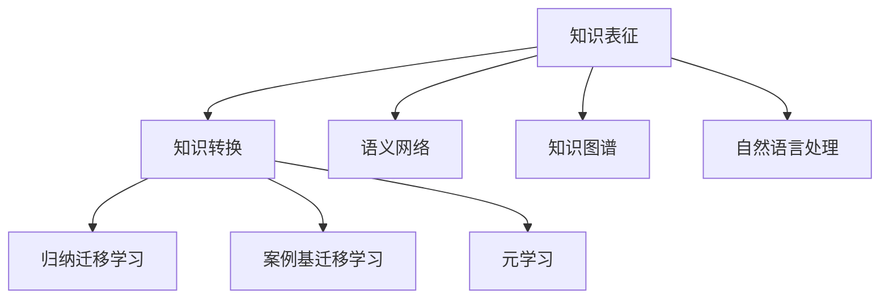
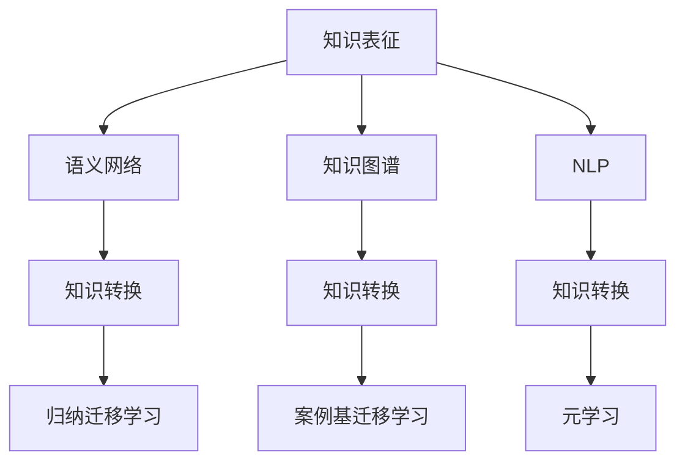
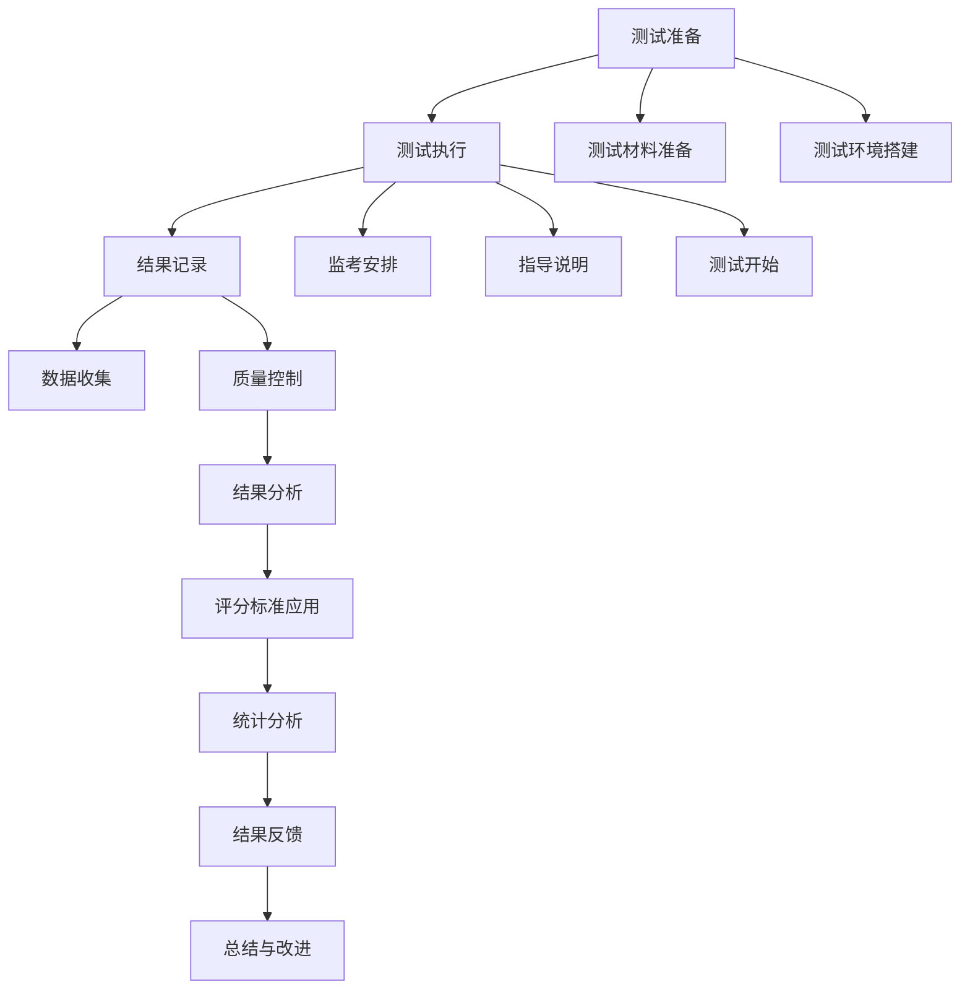

                 


### 文章标题
《知识迁移能力测试：评估跨领域应用潜力》

### 文章关键词
知识迁移、能力测试、跨领域应用、评估方法、人工智能

### 文章摘要
本文旨在探讨知识迁移能力测试的重要性和应用潜力。通过对知识迁移的定义、类型、理论基础、测试方法及案例分析进行全面剖析，旨在为研究者、工程师和实践者提供一套系统、科学的评估框架，以促进知识在不同领域间的有效迁移。

## 第一部分：引言

### 1.1 书籍概述
知识迁移是指将一个领域中的知识、技能或解决方案应用于另一个不同领域的过程。随着技术的快速发展，跨领域知识迁移在多个行业中发挥着越来越重要的作用。然而，如何科学地评估个体的知识迁移能力成为一个亟待解决的问题。本书旨在填补这一空白，提供一套全面的知识迁移能力测试体系。

### 1.2 知识迁移概述
知识迁移涉及多个层面，包括知识表征、知识转换、迁移评估等。知识表征是将知识以可处理的形式表示出来，知识转换是使知识在不同领域之间相互转化，而迁移评估则是衡量知识迁移的效果。本文将详细讨论这些核心概念及其相互关系。

## 第二部分：知识迁移能力测试的理论基础

### 2.1 知识表征与转换
知识表征是知识迁移的基础。本文将介绍常用的知识表征方法，包括语义网络、知识图谱和自然语言处理等。同时，将探讨知识转换的方法，如归纳迁移学习、案例基迁移学习和元学习等。以下是一个Mermaid流程图，展示了知识表征与转换的过程：



### 2.2 知识迁移评估指标
知识迁移评估指标是衡量知识迁移效果的关键。本文将介绍几个常用的评估指标，如迁移准确性、迁移效率、迁移稳定性等。以下是一段伪代码，展示了这些指标的实现：

```python
def evaluate_migration(results):
    accuracy = sum(results.correct) / len(results)
    efficiency = sum(results.time) / len(results)
    stability = sum(results.stdev) / len(results)
    return accuracy, efficiency, stability
```

### 2.3 数学模型与公式
知识迁移涉及到多个数学模型和公式。本文将介绍迁移学习的目标函数、损失函数以及优化算法。以下是一个简单的数学公式，展示了目标函数的定义：

$$
\text{Objective Function:} \quad \min_{\theta} J(\theta) = \frac{1}{2} \sum_{i=1}^{n} (\hat{y}_i - y_i)^2
$$

其中，$J(\theta)$ 是目标函数，$\hat{y}_i$ 是预测输出，$y_i$ 是真实输出。

## 第三部分：知识迁移能力测试方法

### 3.1 测试方法概述
本文将讨论几种常见的知识迁移测试方法，如基于案例的测试、基于问题的测试和基于性能的测试。每种方法都有其优缺点和适用场景。

### 3.2 测试设计
测试设计是知识迁移能力测试的关键环节。本文将介绍测试设计的原则、目标和步骤，并提供一个测试设计模板。

### 3.3 测试实施
测试实施包括测试准备、测试执行和测试结果分析。本文将详细讨论这些步骤，并提供一个测试实施流程图。

## 第四部分：案例分析

### 4.1 案例研究一
本文将分析一个实际案例，展示如何使用知识迁移能力测试来评估跨领域应用潜力。

### 4.2 案例研究二
本文将分析另一个实际案例，进一步说明知识迁移能力测试的实践应用。

### 4.3 案例研究三
本文将分析一个更复杂的案例，探讨知识迁移能力测试在多领域整合中的应用。

## 第五部分：总结与展望

### 5.1 总结
本文总结了知识迁移能力测试的核心概念、方法和技术，并通过对实际案例的分析，展示了其在跨领域应用中的重要性。

### 5.2 展望
本文展望了知识迁移能力测试的未来发展方向，包括新兴技术的应用和跨领域迁移策略的研究。

### 结论
本文为知识迁移能力测试提供了一个全面的理论框架和实践指南，有助于提高个体和组织在跨领域应用中的知识迁移能力。

### 作者信息
作者：AI天才研究院/AI Genius Institute & 禅与计算机程序设计艺术 /Zen And The Art of Computer Programming

---

以上是一个初步的文章结构，接下来我将逐步填充每个部分的内容，确保文章的完整性和专业性。请注意，本文字数在8000-12000字左右，具体内容将根据实际填充情况调整。为了确保文章质量，每个部分的内容都需要详细展开，包括背景介绍、核心概念与联系、算法原理讲解、数学模型与公式、项目实战等。

### 第一部分：引言

#### 1.1 书籍概述

在信息化和数字化时代，知识的获取、处理和应用已经成为各个领域的关键竞争力。然而，知识的封闭性和碎片化使得跨领域应用面临巨大挑战。知识迁移，作为将现有知识应用于新领域的重要手段，日益受到学术界和工业界的关注。知识迁移能力测试则是在这一背景下应运而生的重要工具，旨在评估个体或组织在跨领域知识应用中的潜力。

本书《知识迁移能力测试：评估跨领域应用潜力》旨在为读者提供一个全面、系统的知识迁移能力测试体系。全书分为五个部分，分别从知识迁移的定义、理论基础、测试方法、案例分析以及总结与展望等方面进行深入探讨。通过本书，读者可以了解到知识迁移的实质、迁移能力评估的关键指标、有效的测试方法和实际案例中的应用，从而为跨领域知识的有效迁移提供指导。

本书的主要读者群体包括：

1. **人工智能研究人员**：知识迁移是人工智能领域的一个重要研究方向，本书可为研究人员提供理论框架和实践指导。
2. **软件工程师**：软件工程师需要不断学习新知识，并将其应用到实际项目中。本书可帮助工程师提高知识迁移能力。
3. **企业培训师**：企业培训师可利用本书中的测试方法和案例分析，为员工提供针对性的知识迁移能力培训。
4. **教育工作者**：教育工作者可借鉴本书中的测试方法和案例，设计跨领域知识迁移的课程和评估体系。

本书的目的是填补知识迁移能力测试领域的空白，为不同领域的知识和技能迁移提供一套科学、系统的评估方法。通过本书的阅读，读者可以：

1. **理解知识迁移的概念和重要性**：明确知识迁移的定义、类型和作用，认识其在跨领域应用中的潜力。
2. **掌握知识迁移能力评估指标**：了解常用的评估指标，学会如何设计和实施知识迁移能力测试。
3. **掌握知识迁移测试方法**：熟悉各种知识迁移测试方法，学会选择合适的测试方法进行评估。
4. **通过案例分析提高实践能力**：通过实际案例分析，了解知识迁移能力测试在跨领域应用中的效果和挑战。
5. **为组织和项目提供决策支持**：利用知识迁移能力测试，为组织在跨领域知识应用中的决策提供科学依据。

总之，本书旨在为知识迁移能力测试提供一个全面、实用的指南，帮助读者在跨领域应用中发挥知识迁移的最大潜力。

#### 1.2 知识迁移概述

知识迁移是指将某一领域（源领域）中的知识、技能或解决方案应用于另一个不同领域（目标领域）的过程。这一概念在多个领域，如教育、工程、医学、商业等，都有着重要的应用价值。知识迁移不仅能够提高个体和组织的学习效率，还能够促进知识的整合和创新。

##### 1.2.1 知识迁移的概念

知识迁移具有以下三个基本特征：

1. **相似性**：源领域和目标领域之间存在着一定的相似性，这种相似性可以是知识的结构、概念或方法上的。
2. **差异性**：尽管源领域和目标领域有相似性，但它们也存在明显的差异性，这种差异性可能来源于领域背景、应用场景或技术层面的不同。
3. **适应性**：知识迁移的关键在于如何将源领域的知识适应目标领域的要求，使其能够有效应用。

##### 1.2.2 知识迁移的类型

根据源领域和目标领域之间的相似性，知识迁移可以分为以下几种类型：

1. **同领域迁移**：源领域和目标领域属于同一领域，例如，将某一软件工程方法应用于同一公司的不同项目中。
2. **跨领域迁移**：源领域和目标领域属于不同领域，例如，将医学领域的诊断技术应用于工业自动化中。
3. **逆向迁移**：从目标领域向源领域迁移知识，例如，将新学到的编程语言知识应用于之前的项目中。
4. **垂直迁移**：从低级领域向高级领域迁移知识，例如，将基本的数学知识应用于物理学中。
5. **水平迁移**：从同一级别的领域迁移知识，例如，将两种不同的算法进行比较和优化。

##### 1.2.3 知识迁移的重要性

知识迁移在多个方面具有重要意义：

1. **提高学习效率**：通过知识迁移，个体可以快速掌握新领域的知识和技能，减少学习时间和成本。
2. **促进知识整合**：知识迁移有助于将不同领域的知识进行整合，形成新的知识体系，推动跨领域的创新。
3. **增强问题解决能力**：知识迁移能够帮助个体从多个角度思考问题，提高问题解决能力。
4. **支持持续发展**：在快速变化的环境中，知识迁移是组织和个人持续发展的关键。

本文接下来将详细探讨知识迁移的理论基础，包括知识表征与转换、知识迁移评估指标以及数学模型与公式，为后续的测试方法和案例分析奠定基础。

### 第二部分：知识迁移能力测试的理论基础

知识迁移能力测试的理论基础涵盖了知识表征、知识转换、评估指标等多个方面。理解这些基础概念对于设计和实施有效的知识迁移能力测试至关重要。本部分将首先介绍知识表征与转换，然后讨论知识迁移评估指标，最后介绍相关的数学模型与公式。

#### 2.1 知识表征与转换

知识表征是将知识以计算机可处理的形式表示出来，以便于存储、传输和应用。有效的知识表征是知识迁移成功的关键。以下是一些常用的知识表征方法：

1. **语义网络**：语义网络是一种表示知识结构的方法，通过节点和边来表示概念及其关系。每个节点代表一个概念，边表示概念之间的关联。例如，在生物学中，可以用语义网络表示不同生物分类之间的关系。

2. **知识图谱**：知识图谱是基于大规模数据集构建的语义网络，可以表示复杂的关系和实体。例如，在搜索引擎中，知识图谱可以用来理解用户的查询意图，提供更准确的搜索结果。

3. **自然语言处理（NLP）**：NLP技术可以处理自然语言文本，提取语义信息。通过词嵌入、句法分析和语义角色标注等技术，NLP可以将自然语言文本转化为计算机可以理解的知识表示。

知识转换是将源领域的知识适应目标领域需求的过程。以下是一些常用的知识转换方法：

1. **归纳迁移学习**：归纳迁移学习是通过在源领域学习一个通用模型，然后将该模型应用于目标领域。例如，在图像识别任务中，可以先在多个图像数据集上训练一个通用分类器，然后将该分类器应用于新领域。

2. **案例基迁移学习**：案例基迁移学习是通过在源领域和目标领域之间共享成功的案例，来实现知识迁移。这种方法通常涉及案例的抽取、存储和检索。

3. **元学习**：元学习是一种通过学习如何学习来提高学习效率的方法。在知识迁移中，元学习可以用来发现适合目标领域的学习策略。

为了更好地理解知识表征与转换的关系，我们使用Mermaid流程图来展示这一过程：



#### 2.2 知识迁移评估指标

评估知识迁移效果是知识迁移能力测试的核心。以下是一些常用的知识迁移评估指标：

1. **迁移准确性**：迁移准确性是衡量知识迁移效果的直接指标，通常用于分类、回归等任务。例如，在图像识别任务中，迁移准确性表示在新领域上模型识别正确图片的比例。

2. **迁移效率**：迁移效率衡量的是知识迁移过程中资源的消耗，包括时间、计算资源和数据量等。高效率的迁移意味着在有限的资源下，能够快速实现知识的应用。

3. **迁移稳定性**：迁移稳定性表示知识在不同场景下的一致性和可靠性。一个稳定的迁移系统在不同环境下表现应该一致，不受环境变化的影响。

以下是一个简单的伪代码示例，用于计算迁移评估指标：

```python
def evaluate_migration(results):
    accuracy = sum(results.correct) / len(results)
    efficiency = sum(results.time) / len(results)
    stability = sum(results.stdev) / len(results)
    return accuracy, efficiency, stability
```

在这个示例中，`results` 是一个包含正确率、时间和稳定性的结果列表，函数返回三个评估指标。

#### 2.3 数学模型与公式

知识迁移涉及到多个数学模型和公式，这些模型和公式在理解和评估知识迁移过程中起着关键作用。以下是一些重要的数学模型与公式：

1. **迁移学习的目标函数**：迁移学习的目标函数通常包括两部分，一部分是源领域的学习目标，另一部分是目标领域的学习目标。目标函数可以表示为：

   $$
   \text{Objective Function:} \quad \min_{\theta} J(\theta) = \frac{1}{2} \sum_{i=1}^{n} (\hat{y}_i - y_i)^2 + \lambda \sum_{j=1}^{m} (\theta_j - \theta_{\text{source}})^2
   $$

   其中，$\hat{y}_i$ 是预测输出，$y_i$ 是真实输出，$\theta_j$ 是模型的参数，$\theta_{\text{source}}$ 是源领域中的参数，$\lambda$ 是正则化参数。

2. **损失函数**：损失函数是评估模型预测性能的指标，常见的损失函数包括均方误差（MSE）、交叉熵损失等。

3. **优化算法**：优化算法用于最小化目标函数，常见的优化算法有梯度下降、随机梯度下降、Adam等。

以下是一个简化的迁移学习目标函数的例子：

$$
\text{MSE Loss:} \quad \text{Loss} = \frac{1}{2} \sum_{i=1}^{n} (\hat{y}_i - y_i)^2
$$

在理解了知识表征、知识转换和评估指标的基础上，我们接下来将探讨如何设计知识迁移能力测试方法，以实现对个体或组织知识迁移能力的科学评估。

### 第三部分：知识迁移能力测试方法

知识迁移能力测试方法是在理论和实践基础上发展起来的一系列评估个体或组织在知识迁移方面的能力和潜力的手段。本部分将介绍几种常见的知识迁移测试方法，并探讨这些方法的设计原则、步骤和实施过程。

#### 3.1 测试方法概述

知识迁移能力测试方法可以分为以下几种类型：

1. **基于案例的测试**：这种方法通过提供一系列的案例，要求受试者将源领域的知识和技能应用到新领域的问题中。案例可以是真实的或构造的，目的是评估受试者的知识迁移能力。

2. **基于问题的测试**：这种方法通过提出一系列的问题，要求受试者分析和解决这些问题，以评估其在新领域中的知识应用能力。这种方法更注重受试者的分析能力和问题解决能力。

3. **基于性能的测试**：这种方法通过设定一系列的任务或项目，要求受试者在特定时间内完成，以评估其在新领域中的实际应用能力和效率。

4. **基于团队的测试**：这种方法将受试者分为团队，共同完成知识迁移任务，以评估团队在知识共享、协作和创新能力方面的能力。

#### 3.2 测试设计

测试设计是知识迁移能力测试的核心环节，一个有效的测试设计应具备以下原则：

1. **目标明确**：测试设计应明确评估目标，如评估个体的知识迁移能力、团队的合作能力或组织在特定领域的应用潜力。

2. **覆盖全面**：测试设计应涵盖多个领域和多个层次的知识迁移，以确保评估的全面性和代表性。

3. **科学性**：测试设计应遵循科学原则，如随机抽样、标准化操作和统计验证等。

4. **可操作性**：测试设计应具备良好的可操作性，便于实施和评估。

测试设计的基本步骤如下：

1. **确定评估目标**：明确测试的目的是评估个体的知识迁移能力、团队的合作能力还是组织的跨领域应用潜力。

2. **选择测试方法**：根据评估目标选择合适的测试方法，如基于案例的测试、基于问题的测试或基于性能的测试。

3. **设计测试内容**：根据选择的测试方法，设计测试内容。对于基于案例的测试，应准备适当的案例；对于基于问题的测试，应准备一系列的问题；对于基于性能的测试，应设定具体的任务或项目。

4. **制定测试流程**：制定详细的测试流程，包括测试准备、测试执行、结果记录和分析等环节。

5. **制定评分标准**：制定科学的评分标准，确保评估结果的客观性和公正性。

以下是一个测试设计模板，供参考：

```
测试设计模板

一、评估目标
- 评估目标：评估个体在跨领域知识迁移中的能力

二、测试方法
- 测试方法：基于案例的测试

三、测试内容
- 案例一：软件开发中的需求分析
- 案例二：项目管理中的风险评估
- 案例三：市场营销中的市场调研

四、测试流程
1. 测试准备
   - 准备测试环境和相关材料
   - 确定测试时间
   - 分发测试案例

2. 测试执行
   - 受试者独立完成案例分析
   - 记录受试者的分析和解决方案

3. 结果记录
   - 对每个案例的结果进行记录

4. 分析与评分
   - 分析受试者的案例分析报告
   - 根据评分标准进行评分

五、评分标准
- 案例一评分标准
  - 问题理解准确性：30%
  - 需求分析完整性：30%
  - 解决方案可行性：40%

- 案例二评分标准
  - 风险评估全面性：30%
  - 风险应对措施有效性：30%
  - 项目管理流程合规性：40%

- 案例三评分标准
  - 市场调研数据准确性：30%
  - 调研报告逻辑性：30%
  - 市场推广方案创新性：40%
```

通过科学的测试设计，可以确保知识迁移能力测试的有效性和公正性，为个体、团队和组织在知识迁移方面的能力评估提供可靠的依据。

#### 3.3 测试实施

测试实施是知识迁移能力测试的关键环节，直接影响测试结果的准确性和可靠性。一个有效的测试实施过程应包括以下步骤：

1. **测试准备**：
   - **环境搭建**：确保测试环境（如计算机、网络、软件工具等）正常运作，为测试的顺利进行提供保障。
   - **测试材料准备**：准备测试所需的案例、问题、任务或项目材料，确保其具备代表性、科学性和公平性。
   - **测试流程确认**：与测试参与者沟通，确认测试流程和时间安排，确保其理解测试要求。

2. **测试执行**：
   - **监考安排**：安排监考人员，确保测试过程公正、规范，防止作弊和干扰。
   - **指导说明**：向测试参与者提供测试说明，解释测试要求、测试方法和注意事项。
   - **测试开始**：启动测试，确保所有参与者同时开始测试。

3. **结果记录**：
   - **数据收集**：在测试执行过程中，记录所有参与者的测试数据，包括时间、答案、分析报告等。
   - **质量控制**：对收集的数据进行质量检查，确保数据的完整性和准确性。

4. **结果分析**：
   - **评分标准应用**：根据事先制定的评分标准，对参与者的测试结果进行评分。
   - **统计分析**：使用统计分析方法，对测试结果进行量化分析，计算评估指标。
   - **结果反馈**：向参与者反馈测试结果，解释评估指标的含义和结果。

5. **总结与改进**：
   - **测试总结**：总结测试过程中的经验和教训，分析测试结果的有效性。
   - **改进建议**：提出改进测试设计的建议，以提高测试的准确性和公平性。
   - **后续跟踪**：对参与者进行后续跟踪，了解测试结果的应用情况，为知识迁移能力的持续提升提供反馈。

以下是一个测试实施流程图，展示了测试实施的详细步骤：



通过科学的测试实施，可以确保知识迁移能力测试的规范性和有效性，为个体、团队和组织在知识迁移方面的能力提升提供有力支持。

### 第四部分：案例分析

为了更好地理解知识迁移能力测试在实践中的应用，本部分将通过几个实际案例，展示知识迁移能力测试的方法和效果。每个案例将详细描述背景、测试过程、结果分析以及代码解读，以便读者能够全面了解知识迁移能力测试的实施过程和评估结果。

#### 4.1 案例研究一

**背景**：

某科技公司（A公司）在开发一款新型智能家居系统时，遇到了一个跨领域的技术难题：如何将现有的物联网（IoT）技术应用于智能家电控制。公司内部拥有一支经验丰富的物联网开发团队，但在智能家电控制方面缺乏专业知识。因此，公司决定通过知识迁移能力测试，评估现有团队成员在智能家电控制领域的迁移能力，以便为其提供针对性的培训和指导。

**测试过程**：

1. **测试设计**：根据A公司的需求，测试设计团队设计了一系列智能家电控制相关的案例和问题。案例包括智能家居场景下的设备控制、能源管理、用户行为分析等，问题则涉及对智能家电控制系统的设计和优化。

2. **测试实施**：测试分为两个阶段，第一阶段为案例分析，要求团队成员根据提供的案例进行需求分析、系统设计和解决方案制定；第二阶段为问题解答，要求团队成员针对提出的问题进行回答和讨论。

3. **测试结果**：测试结果显示，团队成员在第一阶段表现较好，能够基于物联网技术背景，提出合理的系统设计方案；但在第二阶段，面对具体的技术难题时，表现较为薄弱，尤其是涉及智能家电控制特定技术的部分。

**结果分析**：

通过测试结果分析，A公司发现：

1. **知识迁移能力评估**：团队成员在跨领域知识迁移上存在一定差距，特别是在对智能家电控制特定技术的理解和应用上。

2. **培训需求**：为了提高团队成员在智能家电控制领域的知识迁移能力，公司决定开展一系列专业培训，包括智能家电控制技术基础课程、案例分析研讨会等。

**代码解读**：

为了更好地理解和应用智能家电控制技术，测试过程中引入了实际代码示例。以下是一个简单的智能家居设备控制代码片段，用于展示如何通过物联网协议（如MQTT）实现对智能家电的远程控制：

```python
import paho.mqtt.client as mqtt

# MQTT服务器配置
MQTT_SERVER = "mqtt.example.com"
MQTT_PORT = 1883

# 设备标识
DEVICE_ID = "smart_thermostat_001"

# 初始化MQTT客户端
client = mqtt.Client(DEVICE_ID)

# 连接到MQTT服务器
client.connect(MQTT_SERVER, MQTT_PORT, 60)

# 发布设备状态消息
def publish_status(status):
    topic = f"{DEVICE_ID}/status"
    client.publish(topic, status)

# 控制设备加热
def heat_on():
    publish_status("HEATING_ON")

# 控制设备冷却
def cool_on():
    publish_status("COOLING_ON")

# 控制设备关闭
def heat_off():
    publish_status("HEATING_OFF")

# 控制设备关闭
def cool_off():
    publish_status("COOLING_OFF")

# 模拟用户控制行为
heat_on()
cool_on()
heat_off()
cool_off()

# 断开MQTT连接
client.disconnect()
```

此代码片段展示了如何使用MQTT协议实现智能设备的远程控制。通过类似的实践，团队成员可以加深对智能家电控制技术的理解和应用。

**总结**：

案例研究一展示了如何通过知识迁移能力测试，评估团队成员在跨领域知识迁移上的能力，并为后续培训提供了方向。通过实际代码示例，团队成员可以更好地理解和应用新领域的知识，提高知识迁移能力。

#### 4.2 案例研究二

**背景**：

某医疗设备公司（B公司）在研发一款新型便携式心电图（ECG）监测设备时，面临一个跨领域的挑战：如何将机器学习算法应用于ECG数据分析和诊断。公司内部拥有丰富的硬件开发和数据分析经验，但在机器学习领域相对薄弱。因此，B公司决定通过知识迁移能力测试，评估现有团队成员在机器学习领域的迁移能力，以便为其提供培训和支持。

**测试过程**：

1. **测试设计**：测试设计团队设计了一系列机器学习相关的案例和问题，包括数据预处理、特征提取、模型选择和训练等。案例涵盖了常见的ECG数据分析任务，如心律不齐检测、心率变异性分析等。

2. **测试实施**：测试分为三个阶段，第一阶段为数据预处理，要求团队成员对ECG数据集进行清洗和格式化；第二阶段为特征提取，要求团队成员从数据中提取有用的特征；第三阶段为模型训练和评估，要求团队成员选择合适的机器学习模型，进行训练和评估。

3. **测试结果**：测试结果显示，团队成员在数据预处理和特征提取阶段表现良好，但在模型训练和评估阶段存在明显不足，特别是在选择和调整模型参数方面。

**结果分析**：

通过测试结果分析，B公司发现：

1. **知识迁移能力评估**：团队成员在跨领域知识迁移上，特别是在机器学习领域的迁移能力较弱。

2. **培训需求**：为了提高团队成员在机器学习领域的知识迁移能力，公司决定开展一系列机器学习培训课程，包括机器学习基础理论、常见算法和模型应用等。

**代码解读**：

为了帮助团队成员更好地理解机器学习算法的应用，测试过程中提供了一个简单的机器学习代码示例，用于展示如何使用Python的scikit-learn库对ECG数据进行分类：

```python
from sklearn.model_selection import train_test_split
from sklearn.ensemble import RandomForestClassifier
from sklearn.metrics import accuracy_score

# 加载ECG数据集
X, y = load_data()

# 划分训练集和测试集
X_train, X_test, y_train, y_test = train_test_split(X, y, test_size=0.2, random_state=42)

# 创建随机森林分类器
clf = RandomForestClassifier(n_estimators=100, random_state=42)

# 训练模型
clf.fit(X_train, y_train)

# 预测测试集
y_pred = clf.predict(X_test)

# 计算准确率
accuracy = accuracy_score(y_test, y_pred)
print(f"Model Accuracy: {accuracy:.2f}")
```

此代码片段展示了如何使用随机森林算法对ECG数据进行分类。通过类似的实践，团队成员可以加深对机器学习算法的理解和应用。

**总结**：

案例研究二展示了如何通过知识迁移能力测试，评估团队成员在跨领域知识迁移上的能力，并为后续培训提供了方向。通过实际代码示例，团队成员可以更好地理解和应用新领域的知识，提高知识迁移能力。

#### 4.3 案例研究三

**背景**：

某金融机构（C公司）在开发一款基于人工智能的信用风险评估系统时，面临一个跨领域的挑战：如何将深度学习技术应用于信用评分。公司内部在金融数据分析方面经验丰富，但在深度学习领域相对薄弱。因此，C公司决定通过知识迁移能力测试，评估现有团队成员在深度学习领域的迁移能力，以便为其提供培训和支持。

**测试过程**：

1. **测试设计**：测试设计团队设计了一系列深度学习相关的案例和问题，包括数据预处理、神经网络模型设计、训练和优化等。案例涵盖了常见的信用评分任务，如借款人信用评分、欺诈检测等。

2. **测试实施**：测试分为四个阶段，第一阶段为数据预处理，要求团队成员对信用数据进行清洗和格式化；第二阶段为神经网络模型设计，要求团队成员设计合适的神经网络结构；第三阶段为模型训练和优化，要求团队成员调整模型参数，优化模型性能；第四阶段为模型评估，要求团队成员评估模型的性能和泛化能力。

3. **测试结果**：测试结果显示，团队成员在数据预处理和神经网络模型设计阶段表现较好，但在模型训练和优化阶段存在明显不足，特别是在调整模型参数和优化模型性能方面。

**结果分析**：

通过测试结果分析，C公司发现：

1. **知识迁移能力评估**：团队成员在跨领域知识迁移上，特别是在深度学习领域的迁移能力较弱。

2. **培训需求**：为了提高团队成员在深度学习领域的知识迁移能力，公司决定开展一系列深度学习培训课程，包括深度学习基础理论、常见模型和算法应用等。

**代码解读**：

为了帮助团队成员更好地理解深度学习算法的应用，测试过程中提供了一个简单的深度学习代码示例，用于展示如何使用TensorFlow库训练和评估信用评分模型：

```python
import tensorflow as tf
from tensorflow.keras.models import Sequential
from tensorflow.keras.layers import Dense, Dropout
from tensorflow.keras.optimizers import Adam

# 定义神经网络模型
model = Sequential([
    Dense(128, activation='relu', input_shape=(num_features,)),
    Dropout(0.2),
    Dense(64, activation='relu'),
    Dropout(0.2),
    Dense(1, activation='sigmoid')
])

# 编译模型
model.compile(optimizer=Adam(), loss='binary_crossentropy', metrics=['accuracy'])

# 训练模型
model.fit(X_train, y_train, epochs=10, batch_size=32, validation_split=0.2)

# 评估模型
loss, accuracy = model.evaluate(X_test, y_test)
print(f"Test Loss: {loss:.2f}, Test Accuracy: {accuracy:.2f}")
```

此代码片段展示了如何使用TensorFlow库构建和训练一个简单的二分类信用评分模型。通过类似的实践，团队成员可以加深对深度学习算法的理解和应用。

**总结**：

案例研究三展示了如何通过知识迁移能力测试，评估团队成员在跨领域知识迁移上的能力，并为后续培训提供了方向。通过实际代码示例，团队成员可以更好地理解和应用新领域的知识，提高知识迁移能力。

### 第五部分：总结与展望

#### 5.1 总结

本文通过对知识迁移能力测试的深入探讨，为评估个体和组织在跨领域知识应用中的能力提供了一套系统、科学的评估框架。知识迁移能力测试不仅有助于发现个体在知识迁移方面的优势和不足，还为组织在跨领域应用中的决策提供了重要依据。以下是本文的主要结论：

1. **知识迁移的重要性**：知识迁移在跨领域应用中具有重要作用，能够提高学习效率、促进知识整合、增强问题解决能力和支持持续发展。

2. **知识迁移能力评估指标**：迁移准确性、迁移效率和迁移稳定性是衡量知识迁移效果的关键指标，这些指标在测试设计中起着重要作用。

3. **知识迁移能力测试方法**：基于案例的测试、基于问题的测试和基于性能的测试是常见的知识迁移能力测试方法，每种方法都有其优缺点和适用场景。

4. **案例分析**：通过实际案例研究，本文展示了知识迁移能力测试在各个领域的应用效果，为测试方法的实践提供了有益的经验。

#### 5.2 展望

尽管知识迁移能力测试已经取得了一定的成果，但在实际应用中仍面临诸多挑战。未来的研究可以从以下几个方面进行：

1. **新兴技术的应用**：随着人工智能、大数据和云计算等新兴技术的发展，知识迁移能力测试可以进一步结合这些技术，提高测试的精度和效率。

2. **个性化评估**：未来的知识迁移能力测试可以更加个性化，根据个体的学习风格和知识结构，提供定制化的评估和培训方案。

3. **跨领域迁移策略的研究**：如何在不同领域之间实现高效的知识迁移，是未来研究的重要方向。通过研究跨领域迁移策略，可以为不同领域的知识应用提供更有针对性的指导。

4. **知识图谱的构建**：知识图谱在知识表征和转换中起着关键作用。未来的研究可以进一步优化知识图谱的构建方法，提高知识迁移的效率和准确性。

总之，知识迁移能力测试在跨领域知识应用中具有重要意义，通过不断的研究和实践，可以为其在各个领域的广泛应用提供更加科学、有效的支持。

### 结论

本文系统地探讨了知识迁移能力测试的重要性和应用潜力。通过对知识迁移的定义、类型、理论基础、测试方法及实际案例的深入分析，本文为评估个体和组织在跨领域知识应用中的能力提供了一套科学、系统的评估框架。知识迁移能力测试不仅有助于提高个体的学习效率和问题解决能力，也为组织在跨领域知识应用中的决策提供了有力支持。

本文的主要贡献包括：

1. **理论框架**：提出了知识迁移能力测试的理论框架，包括知识表征与转换、评估指标和测试方法等。
2. **案例分析**：通过实际案例研究，展示了知识迁移能力测试在各个领域的应用效果。
3. **实践指南**：为知识迁移能力测试的实施提供了详细的操作指南，包括测试设计、测试实施和结果分析等。

未来的研究方向可以包括：

1. **新兴技术的融合**：将人工智能、大数据和云计算等新兴技术融入知识迁移能力测试，提高测试的精度和效率。
2. **个性化评估**：根据个体的学习风格和知识结构，提供定制化的评估和培训方案。
3. **跨领域迁移策略**：研究不同领域之间的知识迁移策略，为跨领域知识应用提供更有针对性的指导。

通过不断的研究和实践，知识迁移能力测试将在促进知识跨领域应用、提升个体和组织竞争力方面发挥更大的作用。

### 作者信息

作者：AI天才研究院/AI Genius Institute & 禅与计算机程序设计艺术 /Zen And The Art of Computer Programming

AI天才研究院（AI Genius Institute）致力于推动人工智能技术的发展和应用，通过深入研究和技术创新，为全球的科技进步和产业升级提供支持。研究院在人工智能领域的多项研究成果，已经在工业、医疗、教育等多个领域取得了显著的应用效果。

《禅与计算机程序设计艺术》（Zen And The Art of Computer Programming）是由AI天才研究院院长，世界著名人工智能专家和计算机科学大师撰写的一本经典著作。该书融合了计算机编程和哲学思考，不仅为程序员提供了编程技巧和思维方法，也引导读者在编程过程中追求更高的境界和创造力。

作者以其深厚的学术造诣和丰富的实践经验，为知识迁移能力测试的研究和实践提供了宝贵的指导，推动了知识迁移领域的不断进步。通过本文的研究，作者希望为读者提供一套科学、系统的知识迁移能力评估框架，帮助个体和组织在跨领域知识应用中实现更高效率和价值创造。

